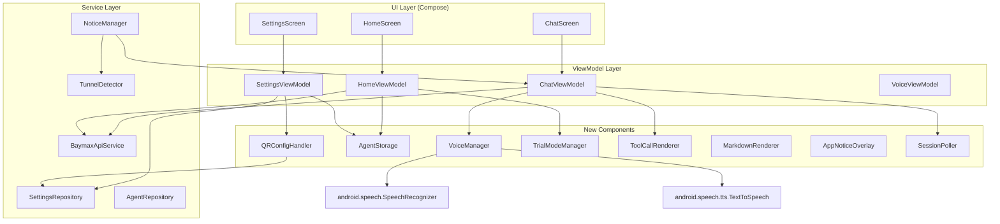
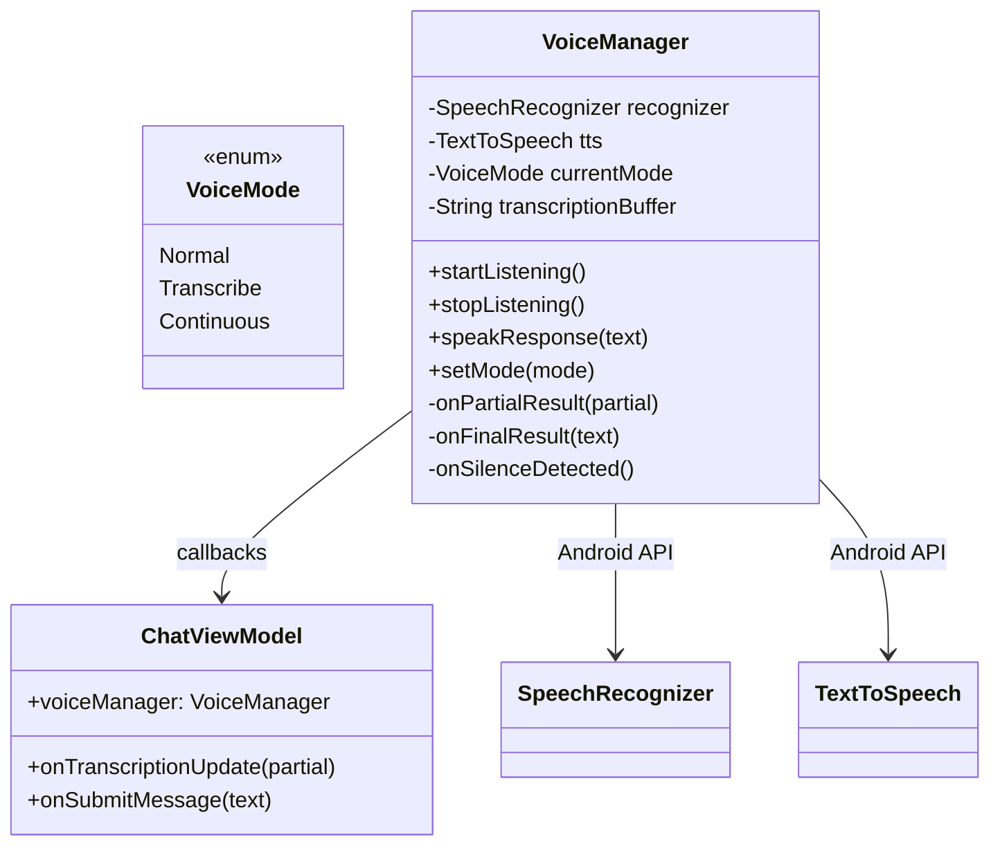
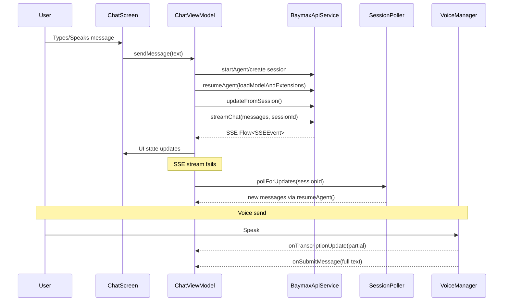
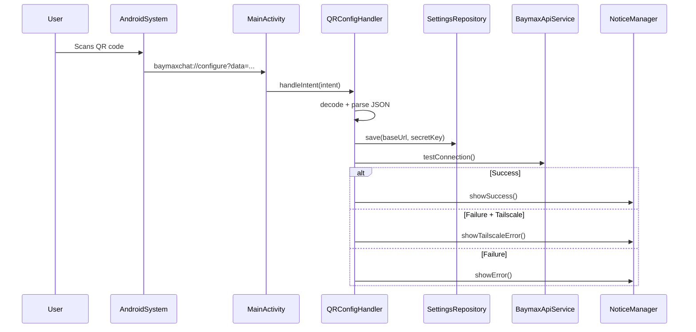

# Android Feature Parity - Design Document

## Architecture Overview

This document describes the architecture and design for bringing Android to feature parity with iOS. The approach follows the existing MVVM + Repository pattern already established in the Android codebase.



## New Package Structure

```
com.simtropolis.baymax/
├── data/
│   ├── api/
│   │   ├── BaymaxApiService.kt          # Existing
│   │   ├── SettingsRepository.kt         # Existing
│   │   └── AgentRepository.kt            # NEW: agent CRUD + storage
│   ├── model/
│   │   ├── Message.kt                    # Existing
│   │   ├── SSEEvent.kt                   # Existing
│   │   └── ChatSession.kt               # Existing
│   └── repository/
│       ├── VoiceManager.kt              # NEW: speech recognition + TTS
│       ├── SessionPoller.kt             # NEW: polling logic
│       └── TrialModeManager.kt          # NEW: trial session persistence
├── ui/
│   ├── screens/
│   │   ├── HomeScreen.kt                # Extended: sidebar with agents
│   │   ├── HomeViewModel.kt             # Extended
│   │   ├── ChatScreen.kt                # Extended: tool calls + notices
│   │   ├── ChatViewModel.kt             # Extended: polling + voice
│   │   ├── SettingsScreen.kt            # Extended: agent management
│   │   └── SettingsViewModel.kt         # Extended
│   ├── components/
│   │   ├── ChatInputView.kt             # Extended: voice button
│   │   ├── MessageBubble.kt             # Extended: markdown renderer
│   │   ├── WelcomeCard.kt               # Existing
│   │   ├── ToolCallCard.kt              # NEW: tool call visualization
│   │   ├── StackedToolCallsView.kt      # NEW: grouped tool calls
│   │   ├── AppNoticeOverlay.kt          # NEW: connection notices
│   │   ├── AgentManagementSheet.kt      # NEW: save/switch agents
│   │   ├── VoiceInputButton.kt          # NEW: voice input UI
│   │   └── MarkdownText.kt              # NEW: markdown rendering
│   └── theme/
│       └── Theme.kt                     # Existing
├── util/
│   ├── QRConfigHandler.kt              # NEW: deep link parsing
│   ├── TunnelDetector.kt              # NEW: tunnel URL detection
│   └── NoticeManager.kt               # NEW: notice state management
├── BaymaxApplication.kt                # Extended: new service init
└── MainActivity.kt                     # Extended: deep link intent filter
```

## Component Specifications

### 1. VoiceManager (`data/repository/VoiceManager.kt`)



**Design**:
- Wrap Android's `SpeechRecognizer` and `TextToSpeech` into a reactive `ViewModel`-scoped manager
- Expose `voiceMode: StateFlow<VoiceMode>`, `isListening: StateFlow<Boolean>`, `transcription: StateFlow<String>`
- `ContinuousVoiceManager` variant auto-restarts listening after TTS completes
- Use foreground service notification for continuous mode (Android 14+ permission requirements)

### 2. AgentRepository (`data/api/AgentRepository.kt`)

**Design**:
- Room database or DataStore with `AgentConfiguration` entity
- Fields: `id` (UUID), `name` (String?), `url` (String), `secret` (String), `lastUsed` (Long), `isDefault` (Boolean)
- Default naming: URL pattern detection → "Trial", "Desktop", or custom
- Expose `savedAgents: Flow<List<AgentConfiguration>>`, `currentAgent: Flow<AgentConfiguration?>`
- `switchToAgent()` writes to DataStore + posts refresh notification

### 3. QRConfigHandler (`util/QRConfigHandler.kt`)

**Design**:
- Parse `baymaxchat://configure?data=<url-encoded-json>` intents
- Expected JSON: `{"url": "...", "secret": "..."}`
- Normalize URL (add https:// if missing, strip :443)
- Apply to `SettingsRepository`, test connection, show success/error via `NoticeManager`
- Detect Tailscale URLs (100.x.x.x, .ts.net) for specific error messages

### 4. SessionPoller (`data/repository/SessionPoller.kt`)

**Design**:
- ViewModel-scoped coroutine job
- Poll interval: start at 2s, exponential backoff to 5s max
- Hash-based change detection: compute hash of message IDs + content, compare each poll
- Max 10 unchanged polls (~20s) then stop
- Stop on 404 (session deleted), user sends message, ViewModel cleared

```kotlin
fun pollForUpdates(
    sessionId: String,
    onMessagesUpdated: (List<Message>) -> Unit
): Job
```

### 5. ToolCallCard / StackedToolCallsView (`ui/components/`)

**Design**:
- `ToolCallCard`: Animated `Card` with tool name, duration, status indicator (spinner/success/failure)
- `StackedToolCallsView`: Overlapping cards for grouped consecutive tool calls
- State management: `activeToolCalls: Map<String, ToolCallWithTiming>`, `completedToolCalls: Map<String, CompletedToolCall>`
- Match iOS: tool calls are grouped by message ID, consecutive tool-only messages are collapsed

### 6. MarkdownText (`ui/components/MarkdownText.kt`)

**Design**:
- Use `com.github.hubt.us:compose-richtext` or `io.noties.markwon` for markdown rendering
- Compose `MarkdownText` component renders: bold, italic, code blocks (syntax highlighted), tables, lists
- Match iOS `MarkdownTableView` for table rendering

### 7. AppNoticeOverlay (`ui/components/AppNoticeOverlay.kt`)

**Design**:
- `NoticeManager` as singleton holding `currentNotice: StateFlow<Notice?>`
- Notice types: `TunnelDisabled(503)`, `TunnelUnreachable(cannotConnectToHost)`, `AppNeedsUpdate(decodingError)`
- `AppNoticeOverlay`: Composable that observes `NoticeManager` and shows `Snackbar` or top banner
- Auto-dismiss after 5s, or tap to dismiss

### 8. TrialModeManager (`data/repository/TrialModeManager.kt`)

**Design**:
- Persist trial session ID in DataStore
- `getOrCreateTrialSession()`: returns existing or creates new via `startAgent()`
- Single session limit enforced client-side
- Mock insights: `totalSessions=5, totalTokens=450000000`

### 9. TunnelDetector (`util/TunnelDetector.kt`)

**Design**:
- `isTunnelURL(url: String): TunnelType` returns enum: `NONE`, `TAILSCALE`, `CLOUDFLARE`
- Tailscale detection: `100.x.x.x` IP prefix or `.ts.net` domain
- Cloudflare detection: `cloudflare-tunnel-proxy` substring
- Intent building: `openTailscaleApp()` tries `tailscale://`, falls back to Play Store

## Data Flow

### Streaming Chat (existing, enhanced)


### Configuration via Deep Link


## Key Interfaces

```kotlin
// VoiceManager
data class VoiceState(
    val mode: VoiceMode = VoiceMode.Normal,
    val isListening: Boolean = false,
    val transcription: String = "",
    val isSpeaking: Boolean = false
)

interface VoiceManagerCallback {
    fun onTranscriptionUpdate(partial: String)
    fun onSubmitMessage(text: String)
    fun onCancelRequest()
}

// Agent configuration
@Entity
data class AgentConfiguration(
    @PrimaryKey val id: String = UUID.randomUUID().toString(),
    val name: String? = null,
    val url: String,
    val secret: String,
    val lastUsed: Long = System.currentTimeMillis()
) {
    val displayName: String get() = name ?: url.displayFormatted()
}

// Notice system
data class AppNotice(
    val type: NoticeType,
    val message: String,
    val action: NoticeAction? = null
)

enum class NoticeType {
    TUNNEL_DISABLED,
    TUNNEL_UNREACHABLE,
    APP_NEEDS_UPDATE
}

sealed class NoticeAction {
    data class OpenApp(val packageName: String) : NoticeAction()
    object Dismiss : NoticeAction()
}

// Session polling
sealed class PollResult {
    data class Updated(val messages: List<Message>) : PollResult()
    object NoChange : PollResult()
    data class Error(val exception: Exception) : PollResult()
    object SessionDeleted : PollResult()
}

// Tunnel detection
enum class TunnelType { NONE, TAILSCALE, CLOUDFLARE }
```

## Correctness Properties

### Property 1: Voice transcription fidelity
_For any_ voice input, WHEN speech recognition completes THEN THE transcription SHALL contain the complete utterance with no truncation.

**Validates: Requirement 1.1, 1.2**

### Property 2: Agent configuration persistence
_For any_ saved agent configuration, WHEN user closes and reopens app THEN THE configuration SHALL be available in the saved agents list.

**Validates: Requirement 2.1, 2.3**

### Property 3: Deep link correctness
_For any_ valid baymaxchat://configure URL, WHEN decoded AND applied THEN THE app SHALL connect to the specified server.

**Validates: Requirement 3.1, 3.2**

### Property 4: Polling termination
_For any_ active polling session, WHEN user sends a new message THEN polling SHALL stop within 1 second.

**Validates: Requirement 4.4, 4.5**

### Property 5: Tool call state recovery
_For any_ session reload (polling, refresh), WHEN messages contain tool requests and responses THEN THE app SHALL correctly categorize them as active or completed.

**Validates: Requirement 5.1, 5.2**

### Property 6: Memory bound
_For any_ conversation, WHEN messages exceed 50 or completed tool calls exceed 20 THEN THE app SHALL prune the oldest while preserving the first system message.

**Validates: Requirement 6.1, 6.2**

### Property 7: Notice visibility
_For any_ 503 HTTP response from API, WHEN not in trial mode THEN THE app SHALL display tunnel disabled notice within 2 seconds.

**Validates: Requirement 7.1**

### Property 8: Trial session persistence
_For any_ trial session, WHEN app is relaunched THEN THE app SHALL resume the same session if it exists server-side.

**Validates: Requirement 9.1, 9.2, 9.3**
