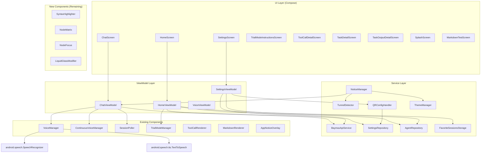

# Android Feature Parity - Design Document

## Architecture Overview

This document describes the architecture and design for bringing Android to feature parity with iOS. The approach follows the existing MVVM + Repository pattern already established in the Android codebase.

### Complete Component Architecture



### Package Structure

```
com.simtropolis.baymax/
├── data/
│   ├── api/
│   │   ├── BaymaxApiService.kt          # Existing + G.1 API extensions
│   │   ├── SettingsRepository.kt         # Existing
│   │   └── AgentRepository.kt            # Existing
│   ├── model/
│   │   ├── Message.kt                    # Existing + F.1 content types
│   │   ├── SSEEvent.kt                   # Existing + H.2 NotificationEvent
│   │   ├── ChatSession.kt                # Existing + SessionInsights
│   │   └── VoiceState.kt                 # Existing + I.4 rich UI extensions
│   └── repository/
│       ├── VoiceManager.kt              # Existing
│       ├── ContinuousVoiceManager.kt    # Existing
│       ├── SessionPoller.kt             # Existing
│       ├── TrialModeManager.kt          # Existing
│       ├── FavoriteSessionsStorage.kt   # Existing
│       └── ThemeManager.kt              # NEW: I.3 dark mode toggle
├── ui/
│   ├── screens/
│   │   ├── HomeScreen.kt                # Extended: sidebar, NodeMatrix (H.1), pagination
│   │   ├── HomeViewModel.kt             # Extended: insights, pagination
│   │   ├── ChatScreen.kt                # Extended: I.1 auto-scroll
│   │   ├── ChatViewModel.kt             # Extended: polling + voice
│   │   ├── SettingsScreen.kt            # Extended: I.3 dark mode toggle, E.2 markdown test link
│   │   ├── SettingsViewModel.kt         # Extended
│   │   ├── TrialModeInstructionsScreen.kt  # Existing (A.1)
│   │   ├── ToolCallDetailScreen.kt      # Existing (C.1)
│   │   ├── TaskDetailScreen.kt          # Existing (C.2)
│   │   ├── SplashScreen.kt              # NEW: D.1
│   │   └── MarkdownTestScreen.kt        # NEW: E.2
│   ├── components/
│   │   ├── ChatInputView.kt             # Existing
│   │   ├── MessageBubble.kt             # Extended: F.1, C.4, C.5
│   │   ├── WelcomeCard.kt               # Extended: D.2, D.3, I.5
│   │   ├── ToolCallCard.kt              # Existing
│   │   ├── StackedToolCallsView.kt      # Existing
│   │   ├── AppNoticeOverlay.kt          # Existing
│   │   ├── FullTextOverlay.kt           # Existing (C.3)
│   │   ├── MarkdownText.kt              # Extended: E.1 syntax highlighting
│   │   ├── SyntaxHighlighter.kt         # NEW: E.1
│   │   ├── NodeMatrix.kt                # NEW: H.1
│   │   ├── NodeFocus.kt                 # NEW: H.1
│   │   └── LiquidGlassModifier.kt       # NEW: I.5
│   └── theme/
│       └── Theme.kt                     # Extended: I.3 ThemeManager integration
├── util/
│   ├── QRConfigHandler.kt               # Extended: I.2 config success
│   ├── TunnelDetector.kt                # Existing
│   ├── NoticeManager.kt                 # Existing
│   └── TunnelType.kt                    # Existing
├── BaymaxApplication.kt                 # Existing
└── MainActivity.kt                      # Extended: D.1 splash, routes
```

---

## Component Specifications (Remaining Features)

### 1. SyntaxHighlighter (`ui/components/SyntaxHighlighter.kt`) — E.1

**Purpose**: Apply syntax highlighting to code blocks in multiple languages.

**Interface**:
```kotlin
object SyntaxHighlighter {
    fun highlight(code: String, language: String): AnnotatedString
    fun supportedLanguages(): List<String>
}
```

**Implementation**:
- Kotlin regex patterns matching iOS `SharedMessageComponents.swift` approach
- Return `AnnotatedString` with `SpanStyle` colors for each token type
- Supported languages: Swift, Python, JavaScript, TypeScript, JSON, Shell, Ruby, Go, Rust, SQL, HTML, CSS
- Token colors: strings (orange), comments (green), keywords (blue), numbers (teal), functions (yellow), types (teal)
- Unknown language → plain text

**Integration with `MarkdownText`**:
- Pre-process code blocks before passing to Markwon
- Use `SpannableString` + `ForegroundColorSpan` applied to code block
- Add language badge in top-right of code blocks

---

### 2. SplashScreen (`ui/screens/SplashScreen.kt`) — D.1

**Purpose**: Animated logo splash with timing logic.

**Interface**:
```kotlin
@Composable
fun SplashScreen(
    isActive: MutableState<Boolean>
)
```

**Implementation**:
- `LaunchedEffect` with timing logic
- Track `lastAppOpenTime` and `hasLaunchedBefore` in SharedPreferences
- `AnimatedVisibility` with fade transition
- First launch or 24h+ gap: 0.4s fade in, 1.0s display, 0.4s fade out
- Otherwise: 0.2s fade in, 0.3s display, 0.2s fade out

**Integration**: Show in `MainActivity.kt` as overlay before `BaymaxNavigation()`.

---

### 3. Enhanced WelcomeCard — D.2, D.3, I.5

**Extensions to `ui/components/WelcomeCard.kt`**:

1. **Typewriter Effect (D.2)**:
   - Accept `greeting: String` parameter
   - `LaunchedEffect` with `delay(20ms)` per character
   - Track `displayedText` as `mutableStateOf`

2. **Token Progress Bar (D.3)**:
   - Accept `tokenCount: Long?`, `isLoadingTokens: Boolean` parameters
   - Horizontal progress bar with formatted token count
   - `formatTokenCount(count: Long)`: "450M", "12K", "1B"

3. **Session Density (D.3)**:
   - Accept `sessions: List<ChatSession>`, `daysOffset: Int` props
   - Compute density: quiet (≤2), light (3-5), busy (>5)
   - Adjust greeting: "Quiet yesterday", "Light yesterday", "Busy yesterday"

4. **Liquid Glass Fallback (I.5)**:
   - Apply `Modifier.liquidGlassBackground()` on WelcomeCard background

---

### 4. NodeMatrix (`ui/components/NodeMatrix.kt`) — H.1

**Purpose**: Visual grid of circular nodes representing sessions, arranged by date.

**Interface**:
```kotlin
@Composable
fun NodeMatrix(
    sessions: List<ChatSession>,
    selectedSessionId: String?,
    onNodeTap: (ChatSession) -> Unit,
    onDayChange: ((Int) -> Unit)?,
    showDraftNode: Boolean = false,
    modifier: Modifier = Modifier
)
```

**Implementation**:
- Compose `Canvas` for custom node drawing
- Nodes = circles sized by message count (min 8dp, max 16dp, eased progression)
- Tap target ≥ 32dp (accessibility)
- `pointerInput` for horizontal swipe gesture to change day
- `daysOffset: Int` state tracks current day
- Position/session caching to avoid recomputation
- Pulsing animation for live sessions (<5 min since update)
- Star indicator for favorited sessions
- Empty state for days with no sessions
- Loading spinner while sessions load

**Subcomponents**:
- `NodePositioner` — calculates x/y positions
- `NodeRenderer` — draws nodes on Canvas with color, size, pulse
- `NodeGestureHandler` — handles swipe, tap gestures

---

### 5. NodeFocus (`ui/components/NodeFocus.kt`) — H.1

**Purpose**: Popover shown when a session node is tapped.

**Interface**:
```kotlin
@Composable
fun NodeFocus(
    session: ChatSession,
    onContinueSession: (String) -> Unit,
    onDismiss: () -> Unit,
    modifier: Modifier = Modifier
)
```

**Display**:
- Session description/title
- Message count
- Working directory (with folder icon)
- "Continue Session" button → navigates to ChatScreen
- Close button
- Border with subtle blue stroke

---

### 6. SSE NotificationEvent — H.2

**Extend `SSEEvent` sealed class in `SSEEvent.kt`**:
```kotlin
@Serializable
@SerialName("Notification")
data class NotificationEvent(
    @SerialName("request_id") val requestId: String,
    val message: NotificationMessage
) : SSEEvent()

@Serializable
data class NotificationMessage(
    val method: String,
    val params: Map<String, JsonElement> = emptyMap()
)
```

**Extend `parseSSEEvent()` in `BaymaxApiService.kt`**:
```kotlin
"Notification" -> json.decodeFromString<SSEEvent.NotificationEvent>(data)
```

**Dispatch**: When `NotificationEvent` received in SSE stream, call `NoticeManager.show()` with notification details.

---

### 7. Intelligent Auto-Scroll — I.1

**Add state to `ChatScreen.kt`**:
```kotlin
private var shouldAutoScroll by mutableStateOf(true)
private var userIsScrolling by mutableStateOf(false)
private var lastContentHeight by mutableStateOf(0)
private var lastScrollUpdate by mutableStateOf(System.currentTimeMillis())
```

**Implementation**:
- Use `LazyListState` scroll listener to detect manual scrolls
- When `shouldAutoScroll && !userIsScrolling` and new content arrives → `animateScrollToItem(lastIndex)`
- Set `shouldAutoScroll = false` when user scrolls up (`firstVisibleItemIndex > 0`)
- Set `shouldAutoScroll = true` when user scrolls back to bottom
- Throttle scroll updates to max 1 per 100ms during fast streaming
- On stream finish, final scroll to bottom if auto-scroll was active

---

### 8. Configuration Success Feedback — I.2

**Extend `QRConfigHandler.kt`**:
```kotlin
var configurationSuccess: MutableState<Boolean> = mutableStateOf(false)
```

**Flow**:
- When `handleDeepLink()` succeeds → `configurationSuccess = true`
- `LaunchedEffect` with `delay(3000)` to clear flag
- UI observes state and shows green banner/checkmark

---

### 9. ThemeManager (Dark Mode Toggle) — I.3

**New `data/repository/ThemeManager.kt`**:
```kotlin
object ThemeManager {
    var isDarkMode: MutableState<Boolean> = mutableStateOf(
        SharedPreferences.getBoolean("isDarkMode", false)
    )
    
    fun toggle() {
        isDarkMode = !isDarkMode
        // Persist to SharedPreferences
    }
}
```

**UI Changes**:
- Add `Switch` to `SettingsScreen` with "Dark Mode" label
- Modify `BaymaxTheme` in `Theme.kt` to observe `ThemeManager.isDarkMode`
- Update `WelcomeCard` and other components using `isSystemInDarkTheme()` to use `ThemeManager.isDarkMode`

---

### 10. Voice State Rich UI — I.4

**Extend `VoiceState` in `VoiceState.kt`**:
```kotlin
data class VoiceState(
    val mode: VoiceMode = VoiceMode.Normal,
    val isListening: Boolean = false,
    val transcription: String = "",
    val isSpeaking: Boolean = false,
    val stateLabel: String = "Idle"
) {
    val iconRes: Int
        get() = when (stateLabel) {
            "Idle" -> R.drawable.ic_mic_slash
            "Listening" -> R.drawable.ic_mic_fill
            "Processing" -> R.drawable.ic_ellipsis_circle
            "Speaking" -> R.drawable.ic_speaker_wave
            "Error" -> R.drawable.ic_warning_triangle
            else -> R.drawable.ic_mic_slash
        }
    
    val tintColor: Color
        get() = when (stateLabel) {
            "Idle" -> Color.Gray
            "Listening" -> Color.Blue
            "Processing" -> Color(0xFFFF9800)
            "Speaking" -> Color(0xFF4CAF50)
            "Error" -> Color.Red
            else -> Color.Gray
        }
}
```

---

### 11. Liquid Glass Modifier — I.5

**New `ui/components/LiquidGlassModifier.kt`**:
```kotlin
@Composable
fun Modifier.liquidGlassBackground(
    cornerRadius: Dp,
    shadowRadius: Dp = 16.dp
): Modifier {
    // API 31+: RenderEffect.createBlurEffect() + graphicsLayer
    // API < 31: semi-transparent solid surface with shadow
}
```

---

### 12. API Extensions — G.1

**Add to `BaymaxApiService.kt`**:
```kotlin
// Session Insights
suspend fun fetchInsights(): ApiResult<SessionInsights>
// GET /sessions/insights -> { totalSessions: Int, totalTokens: Long }

// Provider Update
suspend fun updateProvider(sessionId: String, provider: String, model: String): ApiResult<Unit>
// POST /agent/update_provider

// Extensions
suspend fun loadEnabledExtensions(): ApiResult<List<String>>
// GET /config/extensions

// Retry Logic
private suspend fun <T> fetchWithRetry(
    maxAttempts: Int = 2,
    operation: suspend () -> ApiResult<T>
): ApiResult<T>
```

Transient errors: `SocketTimeoutException`, `ConnectException`, `UnknownHostException`, HTTP 502/503/504

---

## Correctness Properties

### Phases 1-10 (Already Validated)

| Property | Validates |
|---|---|
| Voice transcription fidelity | Requirements 1.1, 1.2 |
| Agent configuration persistence | Requirements 2.1, 2.3 |
| Deep link correctness | Requirements 3.1, 3.2 |
| Polling termination | Requirements 4.4, 4.5 |
| Tool call state recovery | Requirements 5.1, 5.2 |
| Memory bound | Requirements 6.1, 6.2 |
| Notice visibility | Requirement 7.1 |
| Trial session persistence | Requirements 9.1, 9.2, 9.3 |

### Phases 11-15 (New)

| Property | Validates |
|---|---|
| **Property 1: Splash Timing** — For any first launch or >24h gap, splash display ≥ 1.5s. For <24h, splash ≤ 1.0s. | D.1 |
| **Property 2: Syntax Highlighting Completeness** — For any supported language, `highlight()` returns `AnnotatedString` with ≥ 1 `SpanStyle`. | E.1 |
| **Property 3: Retry Bounds** — For any transient error, `fetchWithRetry` makes ≤ 2 attempts with 1s delay. | G.4 |
| **Property 4: SSE NotificationEvent Parsing** — For `{"type": "Notification", ...}`, `parseSSEEvent()` produces `NotificationEvent` without throwing. | H.2 |
| **Property 5: Auto-Scroll User Interruption** — For any manual scroll-up (`firstVisibleItemIndex > 0`), `shouldAutoScroll` becomes false until user scrolls to bottom. | I.1 |
| **Property 6: Dark Mode Persistence** — For any dark mode toggle, after restart theme matches last toggled state. | I.3 |
| **Property 7: Configuration Success Timeout** — For successful QR config, success indicator visible exactly 3s. | I.2 |
| **Property 8: Voice State Icon Consistency** — For any voice state, `iconRes`/`tintColor` return correct resource/color. | I.4 |
| **Property 9: Typewriter Animation** — For greeting of length N, animation produces N chars over N×20ms. | D.2 |

---

## Error Handling

| Feature | Error Handling |
|---|---|
| Splash Screen | DataStore unavailable → default to full splash (first-launch behavior) |
| Syntax Highlighting | Unknown language → plain monospace; malformed code → incomplete highlighting but visible |
| API Extensions | `/sessions/insights` unavailable → mock data (5 sessions, 450M tokens); `/agent/update_provider` → log & continue; retry exhaustion → return last error |
| NodeMatrix | No sessions → empty state; loading → spinner |
| Auto-Scroll | Bounds check before `animateScrollToItem`; throttle to 1/100ms |
| Config Success | Already showing + new config → reset timer |
| Dark Mode | Preference read failure → default to system theme |
| Voice State | Unknown state label → default to Idle |
| Liquid Glass | API < 31 → fallback to translucent solid |

---

## Testing Strategy

### Unit Tests
- `SyntaxHighlighter`: each language produces colored output, unknown language plain
- `SSEEvent.NotificationEvent` deserialization
- `fetchWithRetry`: retry count, delay, success on retry, exhaustion
- `VoiceState.iconRes`/`tintColor`: correct resource for each state
- `formatTokenCount`: "450M", "12K", "1B"
- `groupSessionsByDate`: correct ordering and headers
- `NodeMatrix` position calculation logic

### UI Tests (Compose)
- `SplashScreen`: fades in/out with correct timing
- `NodeMatrix`: renders nodes, responds to tap/swipe
- `NodeFocus`: displays session details
- `MarkdownTestScreen`: all markdown features visible
- Dark mode toggle switches theme immediately

### Integration Tests
- Splash → main content transition timing
- SSE NotificationEvent → NoticeManager dispatch
- Dark mode toggle → persistence → theme on restart
- Configuration success → 3s banner → auto-dismiss
- Auto-scroll stops on manual scroll, resumes at bottom

### Manual Testing
- NodeMatrix visual appearance across different screen sizes
- Syntax highlighting with various languages in code blocks
- Voice state UI transition during listen/process/speak cycle
- Liquid glass appearance on API 31+ vs fallback appearance

---

## Summary: Complete Feature Parity Roadmap

| Phase | Area | Tasks | Status |
|---|---|---|---|
| 1-10 | Foundation & Core Parity | 34 | ✅ Complete |
| 11 | Welcome Screen | 3 | ❌ Remaining |
| 12 | Rich Markdown | 2 | ❌ Remaining |
| 13 | API Completeness | 1 | ❌ Remaining |
| 14 | Visual Navigation | 2 | ❌ Remaining |
| 15 | UX Polish | 5 | ❌ Remaining |
| **Total** | | **47** | **72% Complete** |

The remaining 13 tasks represent the final ~28% to reach full feature parity with iOS.