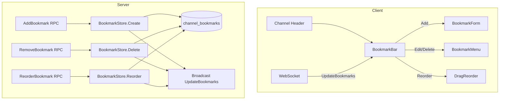

# Design: Channel Bookmarks

## 1. Overview

Baymax channels currently have no mechanism to pin important links or references. This design adds channel bookmarks — a section in the channel header where users (with appropriate permissions) can save important URLs, file references, and message links. Bookmarks are persisted server-side and synced to all channel members in real-time.

**Key decisions:**

- **New protobuf messages**: `AddBookmark`, `RemoveBookmark`, `ReorderBookmark`, `UpdateBookmarks` push message.
- **Database**: New `channel_bookmarks` table with ordering support.
- **Permission**: Only Admin/Member roles can manage bookmarks; Guests can view.
- **Bookmark types**: Link (URL), File (file attachment ID), Message (channel message ID).
- **Real-time sync**: Via existing WebSocket; `UpdateBookmarks` pushed on any change.

## 2. Architecture



### Components

| Component | Responsibility |
|---|---|
| `BookmarkBar` | Displays bookmarks in channel header; shows count and expand/collapse |
| `BookmarkForm` | Dialog for creating/editing a bookmark |
| `BookmarkStore` (server) | CRUD for bookmarks; manages ordering |
| `UpdateBookmarks` | Push notification to all channel members |

## 3. Components and Interfaces

### 3.1 Protobuf Changes

```protobuf
message Bookmark {
    uint64 id = 1;
    uint64 channel_id = 2;
    string label = 3;
    string url = 4;               // For LINK type
    optional string file_id = 5;  // For FILE type
    optional uint64 message_id = 6; // For MESSAGE type
    BookmarkType type = 7;
    uint64 created_by = 8;
    uint64 created_at = 9;
    optional string description = 10;
    uint32 sort_order = 11;
}

enum BookmarkType {
    LINK = 0;
    FILE = 1;
    MESSAGE = 2;
}

message AddBookmark {
    uint64 channel_id = 1;
    string label = 2;
    BookmarkType type = 3;
    string url = 4;
    optional string file_id = 5;
    optional uint64 message_id = 6;
    optional string description = 7;
}

message RemoveBookmark {
    uint64 channel_id = 1;
    uint64 bookmark_id = 2;
}

message UpdateBookmark {
    uint64 channel_id = 1;
    uint64 bookmark_id = 2;
    string label = 3;
    optional string description = 4;
}

message ReorderBookmarks {
    uint64 channel_id = 1;
    repeated uint64 bookmark_ids = 2;  // ordered list of bookmark IDs
}

message UpdateChannelBookmarks {
    uint64 channel_id = 1;
    repeated Bookmark bookmarks = 2;
    repeated uint64 removed_bookmark_ids = 3;
}
```

### 3.2 BookmarkBar UI (Client)

```rust
pub struct BookmarkBar {
    channel_id: ChannelId,
    bookmarks: Vec<Bookmark>,
    expanded: bool,  // when >5 bookmarks, collapse by default
}

impl BookmarkBar {
    /// Render bookmarks in channel header area.
    pub fn render(&mut self, cx: &mut App) -> AnyElement {
        // Layout:
        // ┌─ Bookmarks (3) ──────────────┐
        // │ [🔗 Deploy Guide] [📄 Config] │
        // │ [+ Add bookmark]             │
        // └───────────────────────────────┘
    }
    
    fn render_bookmark(bookmark: &Bookmark, cx: &App) -> AnyElement;
    fn on_bookmark_click(bookmark: &Bookmark, window: &mut Window, cx: &mut App);
    fn show_add_form(position: Point<Pixels>, window: &mut Window, cx: &mut App);
    fn show_context_menu(bookmark_id: u64, position: Point<Pixels>, window: &mut Window, cx: &mut App);
}
```

**Integration**: The `BookmarkBar` renders at the top of the channel view, between the channel header and the message list. It is an `Entity<T>` observed by the `ChannelStore`.

### 3.3 BookmarkForm (Client)

```rust
pub struct BookmarkForm {
    mode: FormMode,  // Create or Edit
    label: SharedString,
    url: SharedString,
    description: SharedString,
    bookmark_type: BookmarkType,
    error: Option<SharedString>,
}

pub enum FormMode {
    Create { channel_id: ChannelId },
    Edit { bookmark_id: u64 },
}
```

The form renders as a modal dialog with fields for label (required), URL/file/message selector (type-dependent), and description (optional).

### 3.4 BookmarkStore (Server)

```go
type BookmarkStore struct {
    db *sqlx.DB
}

func (s *BookmarkStore) CreateBookmark(ctx context.Context, params AddBookmarkParams) (*Bookmark, error)
func (s *BookmarkStore) DeleteBookmark(ctx context.Context, channelID uint64, bookmarkID uint64) error
func (s *BookmarkStore) UpdateBookmark(ctx context.Context, params UpdateBookmarkParams) (*Bookmark, error)
func (s *BookmarkStore) ReorderBookmarks(ctx context.Context, channelID uint64, bookmarkIDs []uint64) error
func (s *BookmarkStore) GetBookmarks(ctx context.Context, channelID uint64) ([]Bookmark, error)
func (s *BookmarkStore) DeleteChannelBookmarks(ctx context.Context, channelID uint64) error
```

### 3.5 Database Table

```sql
CREATE TABLE channel_bookmarks (
    id BIGSERIAL PRIMARY KEY,
    channel_id BIGINT NOT NULL REFERENCES channels(id) ON DELETE CASCADE,
    label VARCHAR(255) NOT NULL,
    description TEXT,
    bookmark_type SMALLINT NOT NULL DEFAULT 0,  -- 0=link, 1=file, 2=message
    url TEXT,
    file_id VARCHAR(255),
    message_id BIGINT,
    created_by BIGINT NOT NULL,
    created_at TIMESTAMP NOT NULL DEFAULT NOW(),
    updated_at TIMESTAMP NOT NULL DEFAULT NOW(),
    sort_order INT NOT NULL DEFAULT 0
);

CREATE INDEX idx_channel_bookmarks_channel ON channel_bookmarks(channel_id, sort_order);
```

## 4. Data Models

### 4.1 Bookmark (client model)

```rust
pub struct Bookmark {
    pub id: u64,
    pub channel_id: ChannelId,
    pub label: SharedString,
    pub description: Option<SharedString>,
    pub type: BookmarkType,
    pub url: Option<SharedString>,
    pub file_id: Option<String>,
    pub message_id: Option<u64>,
    pub created_by: u64,
    pub created_at: DateTime<Utc>,
    pub sort_order: u32,
}
```

## 5. Correctness Properties

### Property 5.1: Bookmark ordering

_For any_ set of bookmarks in a channel, `ReorderBookmarks` SHALL set the `sort_order` for each bookmark according to its position in the `bookmark_ids` array.

**Validates: Requirement 6.3**

### Property 5.2: Bookmark permission enforcement

_For any_ `AddBookmark`, `RemoveBookmark`, or `ReorderBookmark` request, the server SHALL verify the requesting user has `Admin` or `Member` role in the channel. If not, the request SHALL be rejected.

**Validates: Requirement 6.1**

### Property 5.3: Real-time bookmark sync

_For any_ bookmark CRUD operation, the server SHALL broadcast an `UpdateChannelBookmarks` message to all connected channel members within 200ms.

**Validates: Requirement 6.4**

### Property 5.4: Cascade delete

_For any_ channel deletion, all bookmarks in that channel SHALL be deleted (via `ON DELETE CASCADE`).

**Validates: Requirement 6.1**

## 6. Error Handling

| Error | Handling |
|---|---|
| Bookmark URL is invalid | Client-side validation before sending; server-side re-validation |
| Duplicate bookmark label | Allowed (no uniqueness constraint); user is warned but not blocked |
| Bookmark for deleted message | Still rendered; clicking shows "Message has been deleted" |
| Permission denied on bookmark operation | Return `403 FORBIDDEN`; client shows toast |
| Reorder with stale bookmark IDs | Log warning; apply best-effort ordering; ignore unknown IDs |

## 7. Testing Strategy

- **Unit tests**: BookmarkStore CRUD operations, reordering logic, permission checks
- **Integration tests**: Create bookmark → verify broadcast → verify other client sees it → delete → verify removal
- **UI tests**: BookmarkBar rendering with various counts, form validation (empty label), reorder via drag-and-drop
- **Concurrency tests**: Two admins simultaneously reordering; verify final order is consistent
