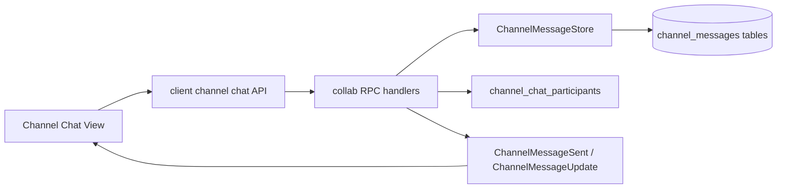

# Design: Channel Chat Foundation

## 1. Overview

The current repository still defines channel-chat protobuf messages, but the collab server handlers reject every channel-chat RPC and no desktop chat UI consumes those messages. This foundation restores the smallest useful end-to-end chat path before the richer Mattermost-style enhancements are attempted.

The design keeps the existing protobuf schema intact for the first slice. The server persists channel messages, tracks active chat participants, broadcasts existing `ChannelMessageSent` and `ChannelMessageUpdate` events, and exposes client methods used by a new desktop channel-chat UI.

## 2. Architecture

## 3. Components and Interfaces

### Server

`crates/collab/src/rpc.rs` should replace the removed-chat stubs with real handlers for:

- `JoinChannelChat`
- `LeaveChannelChat`
- `SendChannelMessage`
- `RemoveChannelMessage`
- `UpdateChannelMessage`
- `AckChannelMessage`
- `GetChannelMessages`
- `GetChannelMessagesById`

The handlers should delegate persistence and permission checks to query/store helpers instead of embedding SQL in RPC code.

### Database

Add channel message persistence tables for messages, mentions, and read acknowledgements. Reuse existing id wrappers such as `ChannelId`, `MessageId`, `UserId`, and `ChannelChatParticipantId`.

### Client

Add a focused client-facing API for channel chat operations. The UI should not construct low-level request envelopes directly outside this API.

### Desktop UI

Create a channel-chat view that renders message history, subscribes to live events, and exposes a composer. Rich text, reactions, threads, and files should extend this view once the foundation is merged.

## 4. Correctness Properties

### Property 0.1: Channel Isolation

_For any_ channel-chat RPC, if the authenticated user cannot access the channel, the system SHALL reject the request and SHALL NOT return or broadcast private messages.

**Validates: Requirement 0.4**

### Property 0.2: Send Broadcast Consistency

_For any_ successful `SendChannelMessage`, the persisted message returned in `SendChannelMessageResponse` SHALL match the message broadcast in `ChannelMessageSent`.

**Validates: Requirement 0.2**

### Property 0.3: History Ordering

_For any_ channel message history request, returned messages SHALL be ordered consistently by message id or timestamp and pagination SHALL not skip or duplicate messages across pages.

**Validates: Requirement 0.1, Requirement 0.2**

### Property 0.4: UI Draft Preservation

_For any_ failed send attempt, the desktop composer SHALL retain the unsent text until the user explicitly clears or successfully sends it.

**Validates: Requirement 0.3**

## 5. Error Handling

| Error | Handling |
|---|---|
| Unauthorized channel access | Reject with a permission error and do not leak channel metadata beyond the request id. |
| Send validation failure | Return a user-visible error and preserve the draft in the UI. |
| Broadcast failure to one participant | Log the failed connection and continue delivering to other participants. |
| Missing message id for edit/delete | Return not found without mutating state. |
| Disconnected chat participant | Remove stale participant rows through the existing server cleanup path. |

## 6. Testing Strategy

- Server integration tests for join, send, history, edit, delete, ack, and permissions.
- Client tests for request construction and live event handling.
- GPUI tests for message list rendering, send success, send failure, and live update insertion.
- Concurrency tests for simultaneous sends preserving stable ordering.
