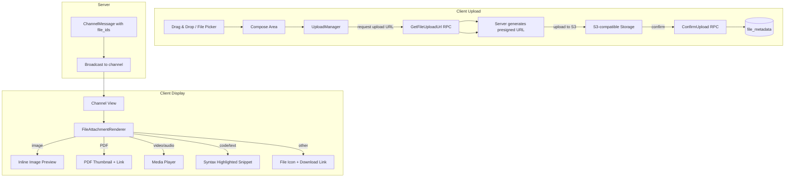

# Design: File Upload and Preview in Channels

## 1. Overview

Baymax channels currently support only text messages. This design adds file attachments to channel messages: upload via drag-and-drop or file picker, inline previews for images/PDFs/video/audio/code, file metadata display, and storage management.

**Key decisions:**

- **Storage**: Files are stored on the existing server-side object storage (S3-compatible, similar to existing file storage for editor buffers).
- **New proto types**: `FileAttachment` message, `channel_id` + `file_id` on `ChannelMessage`, `UploadFile`/`GetFileUploadUrl` RPCs.
- **File size limits**: Configurable server-side; enforced during upload URL generation.
- **Preview rendering**: Leverage existing `media` and `image_viewer` crates for inline previews; PDF preview via existing `pdf_preview` component.
- **Drag-and-drop**: Use existing GPUI file-drop events on the compose area.

## 2. Architecture



### Components

| Component | Responsibility |
|---|---|
| `UploadManager` | Coordinates file upload: request URL → upload to S3 → confirm |
| `FileAttachment` | Proto message; metadata about an uploaded file |
| `FileAttachmentRenderer` | Renders file previews in channel messages |
| `FileStore` (server) | Manages file metadata, S3 upload URLs, storage limits |

## 3. Components and Interfaces

### 3.1 Protobuf Changes

```protobuf
// New messages for file upload
message GetFileUploadUrl {
    uint64 channel_id = 1;
    string filename = 2;
    uint64 file_size = 3;
    string mime_type = 4;
}

message GetFileUploadUrlResponse {
    string url = 1;           // Presigned S3 upload URL
    string file_id = 2;       // Unique file ID for confirmation
    map<string, string> headers = 3; // Required upload headers
}

message ConfirmFileUpload {
    string file_id = 1;
}

message ConfirmFileUploadResponse {
    FileAttachment attachment = 1;
}

message FileAttachment {
    string id = 1;
    string filename = 2;
    uint64 file_size = 3;
    string mime_type = 4;
    string url = 5;            // Download URL
    uint64 uploader_id = 6;
    uint64 uploaded_at = 7;
    optional uint64 image_width = 8;
    optional uint64 image_height = 9;
    optional uint64 duration_ms = 10; // For audio/video
}

// Add to ChannelMessage
message ChannelMessage {
    // ...existing fields...
    repeated FileAttachment files = 10;  // File attachments on this message
}
```

### 3.2 UploadManager (Client)

```rust
pub struct UploadManager {
    client: Arc<Client>,
    active_uploads: HashMap<FileId, UploadProgress>,
}

pub struct UploadProgress {
    pub file_id: FileId,
    pub filename: SharedString,
    pub progress: f32,          // 0.0 to 1.0
    pub status: UploadStatus,
}

pub enum UploadStatus {
    Pending,
    RequestingUrl,
    Uploading(f32),
    Confirming,
    Complete(FileAttachment),
    Failed(SharedString),
}

impl UploadManager {
    /// Start uploading a file. Returns a FileAttachment once complete.
    pub fn upload_file(
        &mut self,
        channel_id: ChannelId,
        file_path: &Path,
        cx: &mut Context<Self>,
    ) -> Task<Result<FileAttachment>>;

    /// Upload progress stream (for UI progress bars).
    pub fn uploads_for_channel(&self, channel_id: ChannelId) -> Vec<UploadProgress>;

    /// Cancel an in-progress upload.
    pub fn cancel_upload(&mut self, file_id: FileId);
}
```

### 3.3 FileAttachmentRenderer (Client)

```rust
pub struct FileAttachmentRenderer;

impl FileAttachmentRenderer {
    /// Render a single file attachment as an inline preview element.
    pub fn render(
        file: &FileAttachment,
        window: &mut Window,
        cx: &mut App,
    ) -> AnyElement {
        match detect_file_kind(&file.mime_type, &file.filename) {
            FileKind::Image => self.render_image_preview(file, cx),
            FileKind::Video => self.render_video_player(file, cx),
            FileKind::Audio => self.render_audio_player(file, cx),
            FileKind::Pdf => self.render_pdf_thumbnail(file, cx),
            FileKind::Code => self.render_code_snippet(file, cx),
            FileKind::Other => self.render_file_card(file, cx),
        }
    }

    fn render_image_preview(&self, file: &FileAttachment, cx: &mut App) -> AnyElement;
    fn render_video_player(&self, file: &FileAttachment, cx: &mut App) -> AnyElement;
    fn render_audio_player(&self, file: &FileAttachment, cx: &mut App) -> AnyElement;
    fn render_pdf_thumbnail(&self, file: &FileAttachment, cx: &mut App) -> AnyElement;
    fn render_code_snippet(&self, file: &FileAttachment, cx: &mut App) -> AnyElement;
    fn render_file_card(&self, file: &FileAttachment, cx: &mut App) -> AnyElement;
}

fn detect_file_kind(mime: &str, filename: &str) -> FileKind {
    // Based on MIME type and extension
}
```

### 3.4 FileStore (Server)

```go
type FileStore struct {
    db     *sqlx.DB
    s3     *s3.Client
    config FileStoreConfig
}

type FileStoreConfig struct {
    MaxFileSize      int64  // bytes
    AllowedTypes     []string // MIME allowlist
    StorageBucket     string
    StoragePrefix     string
}

func (s *FileStore) GenerateUploadUrl(ctx context.Context, channelID uint64, filename string, fileSize int64, mimeType string) (*UploadUrlResponse, error)
func (s *FileStore) ConfirmUpload(ctx context.Context, fileID string) (*FileAttachment, error)
func (s *FileStore) GetFileMetadata(ctx context.Context, fileID string) (*FileAttachment, error)
func (s *FileStore) DeleteFile(ctx context.Context, fileID string) error
```

### 3.5 Database Table

```sql
CREATE TABLE channel_files (
    id UUID PRIMARY KEY DEFAULT gen_random_uuid(),
    channel_id BIGINT NOT NULL REFERENCES channels(id),
    message_id BIGINT REFERENCES channel_messages(id),
    filename VARCHAR(512) NOT NULL,
    file_size BIGINT NOT NULL,
    mime_type VARCHAR(255) NOT NULL,
    storage_path TEXT NOT NULL,
    uploader_id BIGINT NOT NULL,
    image_width INT,
    image_height INT,
    duration_ms BIGINT,
    created_at TIMESTAMP NOT NULL DEFAULT NOW(),
    
    FOREIGN KEY (channel_id) REFERENCES channels(id),
    FOREIGN KEY (message_id) REFERENCES channel_messages(id) ON DELETE SET NULL
);

CREATE INDEX idx_channel_files_channel ON channel_files(channel_id);
CREATE INDEX idx_channel_files_message ON channel_files(message_id);
```

## 4. Data Models

### 4.1 `FileAttachment` (proto → client model)

```rust
pub struct FileAttachment {
    pub id: String,
    pub filename: SharedString,
    pub file_size: u64,
    pub mime_type: SharedString,
    pub url: SharedString,
    pub uploader_id: u64,
    pub uploaded_at: DateTime<Utc>,
    pub image_dimensions: Option<(u32, u32)>,
    pub duration: Option<Duration>,
}
```

### 4.2 File storage (S3 path pattern)

```
uploads/channels/{channel_id}/{file_id}/{filename}
```

## 5. Correctness Properties

### Property 5.1: File size enforcement

_For any_ upload request where `file_size` exceeds `MaxFileSize`, the server SHALL reject the request with a `413 PAYLOAD_TOO_LARGE` error.

**Validates: Requirement 4.4**

### Property 5.2: File type allowlist

_For any_ upload request where `mime_type` is not in the configured `AllowedTypes` list, the server SHALL reject the request.

**Validates: Requirement 4.4**

### Property 5.3: Upload completion atomicity

_For any_ file where `ConfirmUpload` succeeds, the file SHALL be accessible at the returned download URL AND the metadata SHALL be persisted in `channel_files`.

**Validates: Requirement 4.1**

### Property 5.4: File deletion on message deletion

_For any_ message that is deleted, all associated file records in `channel_files` SHALL be deleted, and the underlying storage objects SHALL be scheduled for garbage collection.

**Validates: Requirement 4.5**

### Property 5.5: Thumbnail generation

_For any_ uploaded image file, the server SHALL generate a thumbnail (max 400px wide) for inline preview use.

**Validates: Requirement 4.2**

## 6. Error Handling

| Error | Handling |
|---|---|
| Upload exceeds file size limit | Client-side pre-check before requesting URL; server-side rejection as safety net |
| S3 upload fails (network) | Retry with backoff (3 attempts); show progress bar with "Retry" button |
| Unsupported file type | Show "File type not supported" toast with list of allowed types |
| S3 bucket unavailable | Return 503; client shows "Upload service unavailable" |
| Duplicate filename | Use unique `file_id` in storage path; display original filename to users |
| Upload cancelled mid-flight | Abort presigned URL upload; no server cleanup needed (S3 will have incomplete upload that expires) |

## 7. Testing Strategy

- **Unit tests**: FileStore.GenerateUploadUrl validation, ConfirmUpload, GetFileMetadata
- **Integration tests**: Upload file → ConfirmUpload → fetch message → verify FileAttachment exists
- **UI tests**: Drag-and-drop onto compose area, file picker dialog, progress bar rendering, image preview rendering
- **Security tests**: Verify presigned URL cannot be used to upload files larger than requested size, verify MIME type spoofing rejection
