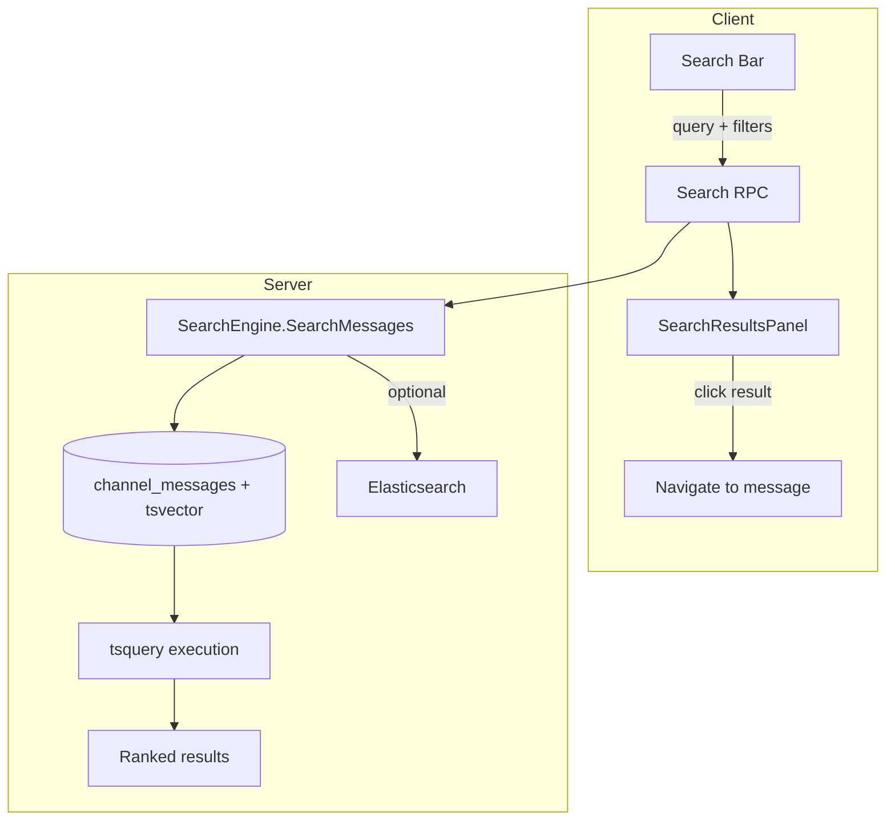

# Design: Message Search in Channels

## 1. Overview

Baymax channels provide no mechanism to search past messages. This design adds full-text search across channel messages with filtering by channel, user, and date range. It uses PostgreSQL full-text search (tsvector/tsquery) or Elasticsearch if available, with a search index maintained in near-real-time.

**Key decisions:**

- **PostgreSQL full-text search**: Primary implementation using `tsvector` columns and `tsquery` — no additional infrastructure required. Elasticsearch is optional for larger deployments.
- **Search index maintained via triggers**: A `tsvector` column on `channel_messages` updated via PostgreSQL triggers on INSERT/UPDATE/DELETE.
- **Search is server-side only**: Clients send search queries via RPC; the server executes them and returns results.
- **Pagination**: Cursor-based pagination with `before_message_id` parameter (reuses existing pattern from `GetChannelMessages`).

## 2. Architecture



### Components

| Component | Responsibility |
|---|---|
| `SearchBar` | Input field in channel header; accepts query string with filter syntax |
| `SearchResultsPanel` | Renders paginated search results with context highlighting |
| `SearchEngine` (server) | Executes full-text search queries; returns ranked results |

## 3. Components and Interfaces

### 3.1 Protobuf Changes

```protobuf
message SearchChannelMessages {
    uint64 channel_id = 1;          // optional — if unset, search all channels user has access to
    string query = 2;
    optional uint64 before_id = 3;  // cursor-based pagination
    uint32 limit = 4;               // default 20, max 100
    optional string filter_channel = 5;  // "in:channel-name"
    optional string filter_user = 6;     // "from:username"
    optional uint64 filter_after = 7;    // unix timestamp
    optional uint64 filter_before = 8;   // unix timestamp
}

message SearchChannelMessagesResponse {
    repeated SearchResult results = 1;
    bool done = 2;  // true if no more results
}

message SearchResult {
    ChannelMessage message = 1;
    string channel_name = 2;
    string sender_name = 3;
    repeated uint64 match_positions = 4;  // byte positions of matches in message body (for highlighting)
}
```

### 3.2 SearchBar UI (Client)

```rust
pub struct SearchBar {
    editor: Entity<Editor>,
    active_filters: SearchFilters,
    results: Option<Entity<SearchResultsPanel>>,
}

impl SearchBar {
    /// Render the search bar (typically in channel header).
    pub fn render(&mut self, cx: &mut Context<Self>) -> AnyElement;
    
    /// Called on each keystroke. Debounces query by 300ms.
    fn on_query_changed(&mut self, query: &str, cx: &mut Context<Self>);
    
    /// Parse query string for filter syntax:
    /// "in:general from:alice before:2024-01-01 deploy error" 
    fn parse_filters(query: &str) -> (SearchFilters, String);
}

pub struct SearchFilters {
    pub channel_name: Option<String>,
    pub username: Option<String>,
    pub after_date: Option<DateTime<Utc>>,
    pub before_date: Option<DateTime<Utc>>,
}
```

### 3.3 SearchResultsPanel (Client)

```rust
pub struct SearchResultsPanel {
    results: Vec<SearchResult>,
    loading: bool,
    done: bool,
    active_query: String,
}

impl SearchResultsPanel {
    pub fn render(&mut self, cx: &mut Context<Self>) -> AnyElement;
    
    /// Each result shows:
    /// ┌────────────────────────────┐
    /// │ #channel · @user · 2min ago │
    /// │ ...text before **match**... │
    /// └────────────────────────────┘
    fn render_result(result: &SearchResult, cx: &App) -> AnyElement;
    
    /// Navigate to the message in the channel and scroll to it.
    fn on_result_clicked(result: &SearchResult, window: &mut Window, cx: &mut App);
}
```

### 3.4 SearchEngine (Server)

```go
type SearchEngine struct {
    db *sqlx.DB
}

type SearchParams struct {
    ChannelID   *uint64
    Query       string
    BeforeID    *uint64
    Limit       uint32
    ChannelName *string
    Username    *string
    AfterDate   *time.Time
    BeforeDate  *time.Time
}

type SearchResult struct {
    MessageID     uint64
    ChannelID     uint64
    ChannelName   string
    Body          string
    SenderID      uint64
    SenderName    string
    CreatedAt     time.Time
    Rank          float64  // ts_rank
}

func (s *SearchEngine) SearchMessages(ctx context.Context, params SearchParams) ([]SearchResult, bool, error) {
    // Build tsquery from search terms
    // Filter by channel_id if provided
    // Apply additional filters (channel name, username, date range)
    // Order by ts_rank DESC, created_at DESC
    // Return up to params.Limit results + done boolean
}
```

### 3.5 Database Migration

```sql
-- Add tsvector column to channel_messages
ALTER TABLE channel_messages ADD COLUMN search_vector tsvector;

-- Create GIN index for fast full-text search
CREATE INDEX idx_channel_messages_search ON channel_messages USING GIN(search_vector);

-- Create trigger function to update tsvector on insert/update
CREATE FUNCTION update_message_search_vector() RETURNS trigger AS $$
BEGIN
    NEW.search_vector := to_tsvector('english', COALESCE(NEW.body, ''));
    RETURN NEW;
END;
$$ LANGUAGE plpgsql;

-- Create trigger
CREATE TRIGGER trg_message_search_vector
    BEFORE INSERT OR UPDATE ON channel_messages
    FOR EACH ROW EXECUTE FUNCTION update_message_search_vector();

-- Initial population for existing messages
UPDATE channel_messages SET search_vector = to_tsvector('english', COALESCE(body, ''));
```

## 4. Data Models

### 4.1 No new tables

Search reuses the existing `channel_messages` table with an added `search_vector tsvector` column and GIN index.

### 4.2 Query construction

```sql
SELECT 
    cm.id, cm.channel_id, cm.body, cm.sender_id, cm.created_at,
    ts_rank(cm.search_vector, plainto_tsquery('english', $1)) AS rank,
    c.name AS channel_name
FROM channel_messages cm
JOIN channels c ON cm.channel_id = c.id
WHERE cm.search_vector @@ plainto_tsquery('english', $1)
    AND ($2::bigint IS NULL OR cm.channel_id = $2)
    AND ($3::text IS NULL OR c.name ILIKE '%' || $3 || '%')
    AND ($4::bigint IS NULL OR cm.sender_id = $4)
    AND ($5::timestamptz IS NULL OR cm.created_at >= $5)
    AND ($6::timestamptz IS NULL OR cm.created_at <= $6)
    AND ($7::bigint IS NULL OR cm.id < $7)  -- cursor pagination
ORDER BY ts_rank(cm.search_vector, plainto_tsquery('english', $1)) DESC, cm.id DESC
LIMIT $8;
```

## 5. Correctness Properties

### Property 5.1: Search result freshness

_For any_ new message sent in a channel, the search index SHALL reflect that message within 1 second (trigger-based, same transaction as INSERT).

**Validates: Requirement 5.4**

### Property 5.2: Search access control

_For any_ search query, the server SHALL only return messages from channels that the requesting user is a member of.

**Validates: Requirement 5.1**

### Property 5.3: Query syntax correctness

_For any_ valid search query with filter modifiers (`in:`, `from:`, `before:`, `after:`), the server SHALL correctly parse and apply all specified filters.

**Validates: Requirement 5.2**

### Property 5.4: Pagination completeness

_For any_ search query that returns more results than `limit`, `done` SHALL be `false` and the client SHALL be able to fetch the next page via `before_id`.

**Validates: Requirement 5.3**

## 6. Error Handling

| Error | Handling |
|---|---|
| Invalid tsquery syntax (special characters) | Escape or strip characters that break tsquery; log warning |
| Query too short (< 2 chars) | Reject with "Query must be at least 2 characters" |
| Query too long (> 200 chars) | Truncate to 200 characters |
| Index not yet populated | Show "Indexing in progress — some results may be incomplete" banner |
| Database timeout on search | Return partial results with a "Search timed out, try narrowing your query" message |
| Elasticsearch unavailable | Fall back to PostgreSQL tsquery; log warning |

## 7. Testing Strategy

- **Unit tests**: Query construction for various filter combinations, ts_rank ordering, pagination cursor logic
- **Database tests**: Verify trigger correctly updates tsvector on INSERT/UPDATE/DELETE, verify GIN index is used (EXPLAIN ANALYZE)
- **Integration tests**: Insert messages → search → verify correct results with highlighting positions
- **Filter tests**: Verify `in:`, `from:`, `before:`/`after:` filters return correct subsets
- **Pagination tests**: Insert 100+ messages, search, verify pagination returns all results across multiple pages
