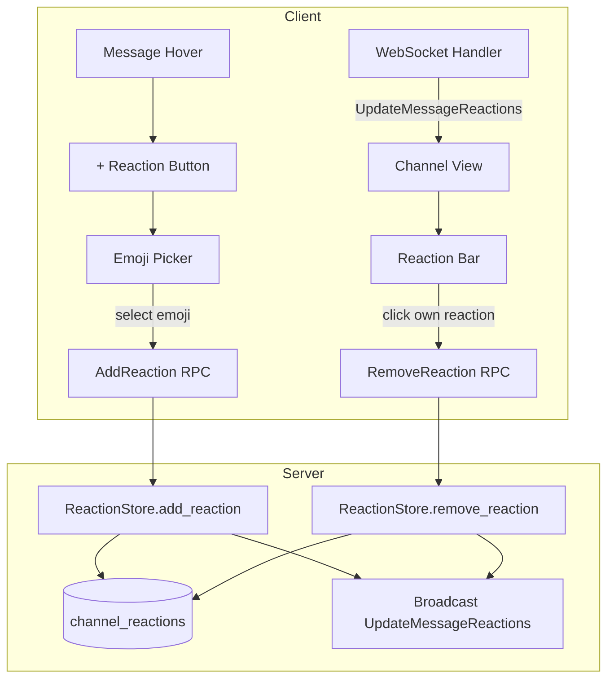

# Design: Emoji Reactions on Channel Messages

## 1. Overview

Channel messages in Sim currently have no reaction support. This design adds emoji reactions — lightweight non-verbal responses. Reactions require both server-side persistence and real-time sync, plus a client-side emoji picker and reaction bar UI.

**Key decisions:**

- **Proto changes**: New `AddReaction` and `RemoveReaction` RPC messages, new `UpdateMessageReactions` push message. `ChannelMessage` proto gets an optional `reactions` field for batch-loaded state.
- **Database**: New `channel_reactions` table keyed by `(message_id, user_id, emoji_name)`.
- **Reactions are not editable**: Once added, only toggle (add/remove own reaction) — no editing.
- **Real-time sync**: Via existing WebSocket infrastructure; reaction changes are pushed as `UpdateMessageReactions` events.

## 2. Architecture



### Components

| Component | Responsibility |
|---|---|
| `ReactionBar` | Renders emoji + count per message. Dispatches add/remove on click. |
| `EmojiPicker` | Searchable emoji grid. Emits selected emoji. |
| `ReactionStore` (server) | CRUD for reactions. Broadcasts changes. |
| `UpdateMessageReactions` | New proto message for real-time sync. |

## 3. Components and Interfaces

### 3.1 Protobuf Changes

```protobuf
// New messages for reaction operations
message AddReaction {
    uint64 channel_id = 1;
    uint64 message_id = 2;
    string emoji_name = 3;  // e.g., "thumbsup", "rocket"
}

message RemoveReaction {
    uint64 channel_id = 1;
    uint64 message_id = 2;
    string emoji_name = 3;
}

// Push notification to all channel participants
message UpdateMessageReactions {
    uint64 channel_id = 1;
    uint64 message_id = 2;
    repeated Reaction reactions = 3;
}

message Reaction {
    string emoji_name = 1;
    repeated uint64 user_ids = 2;  // users who reacted
}

// Optional: add reactions field to ChannelMessage for batch loading
// (add to existing ChannelMessage message)
message ChannelMessage {
    // ...existing fields...
    repeated ReactionSummary reaction_summaries = 9;  // populated on message fetch
}

message ReactionSummary {
    string emoji_name = 1;
    uint32 count = 2;
    repeated uint64 user_ids = 3;
}
```

### 3.2 ReactionStore (Server-side)

```go
type ReactionStore struct {
    db *sqlx.DB
}

func (s *ReactionStore) AddReaction(channelID, messageID uint64, userID uint64, emojiName string) error
func (s *ReactionStore) RemoveReaction(channelID, messageID uint64, userID uint64, emojiName string) error
func (s *ReactionStore) GetReactions(messageID uint64) ([]Reaction, error)
func (s *ReactionStore) DeleteMessageReactions(messageID uint64) error
```

**Database table**:

```sql
CREATE TABLE channel_reactions (
    channel_id BIGINT NOT NULL,
    message_id BIGINT NOT NULL,
    user_id BIGINT NOT NULL,
    emoji_name VARCHAR(100) NOT NULL,
    created_at TIMESTAMP NOT NULL DEFAULT NOW(),
    PRIMARY KEY (message_id, user_id, emoji_name)
);

CREATE INDEX idx_reactions_message ON channel_reactions (message_id);
```

### 3.3 ReactionBar UI Component

```rust
pub struct ReactionBar {
    message_id: u64,
    reactions: Vec<ReactionSummary>,
    current_user_id: u64,
}

impl ReactionBar {
    /// Renders the bar of emoji + count chips below a message.
    pub fn render(&self, cx: &mut App) -> Vec<AnyElement>;
    
    /// Called when user clicks an existing reaction.
    fn toggle_reaction(&mut self, emoji_name: &str, cx: &mut App);
    
    /// Called when user clicks the "+" button.
    fn show_picker(&mut self, position: Point<Pixels>, window: &mut Window, cx: &mut App);
}
```

### 3.4 EmojiPicker

```rust
pub struct EmojiPicker {
    search_query: SharedString,
    matches: Vec<EmojiMatch>,
    recent: Vec<String>,
}

impl EmojiPicker {
    pub fn new(cx: &mut App) -> Self;
    pub fn render(window: &mut Window, cx: &mut App) -> AnyElement;
    
    fn on_select(emoji_name: String);
}
```

The emoji picker renders as a popover grid. It uses a bundled emoji dataset (e.g., a JSON file mapping emoji names to unicode). Search filters by name and keywords. Recently used emojis are stored in the KeyValueStore (local) and displayed at the top.

## 4. Data Models

### 4.1 Server-side (database)

```
channel_reactions
├── channel_id   BIGINT  (FK to channels)
├── message_id   BIGINT  (FK to channel_messages)
├── user_id      BIGINT
├── emoji_name   VARCHAR(100)
├── created_at   TIMESTAMP
└── PRIMARY KEY (message_id, user_id, emoji_name)
```

### 4.2 Client-side (proto types)

```rust
// Client-side representation for rendering
struct ReactionSummary {
    emoji_name: SharedString,
    count: usize,
    user_ids: Vec<u64>,
    reacted_by_me: bool,
}
```

## 5. Correctness Properties

### Property 5.1: Reaction toggle idempotency

_For any_ `(message_id, user_id, emoji_name)` tuple, calling `AddReaction` when an existing reaction exists SHALL be a no-op (or return success), and calling `RemoveReaction` when no reaction exists SHALL be a no-op.

**Validates: Requirement 2.1**

### Property 5.2: Real-time sync

_For any_ reaction added or removed by one participant, all connected participants in the channel SHALL receive `UpdateMessageReactions` within 500ms and the reaction bar SHALL update accordingly.

**Validates: Requirement 2.2**

### Property 5.3: Reaction cleanup on message deletion

_For any_ deleted `ChannelMessage`, all associated reactions in `channel_reactions` SHALL be deleted.

**Validates: Requirement 2.4**

### Property 5.4: Unique reactions

_For any_ `(message_id, user_id, emoji_name)` tuple, there SHALL be at most one row in `channel_reactions`.

**Validates: Requirement 2.1**

## 6. Error Handling

| Error | Handling |
|---|---|
| Network failure on add/remove | Retry with exponential backoff (3 attempts). If all fail, show toast "Reaction failed to sync" |
| Emoji name not found | Validate against emoji dataset on client before sending; reject on server with descriptive error |
| Message already deleted | Return `NOT_FOUND` error; client removes the message from view |
| Race condition (double-toggle) | Handle gracefully via idempotent upsert/delete in the database |
| Emoji picker search no results | Show "No emojis found — try a different search" |

## 7. Testing Strategy

- **Unit tests**: ReactionStore add/remove/get queries, idempotency
- **Integration tests**: Full flow: add reaction → verify `UpdateMessageReactions` broadcast → verify other client sees it
- **UI tests**: EmojiPicker rendering, search filtering, ReactionBar rendering with various reaction counts
- **Concurrency tests**: Simultaneous add/remove from multiple clients; verify no duplicate or lost reactions
