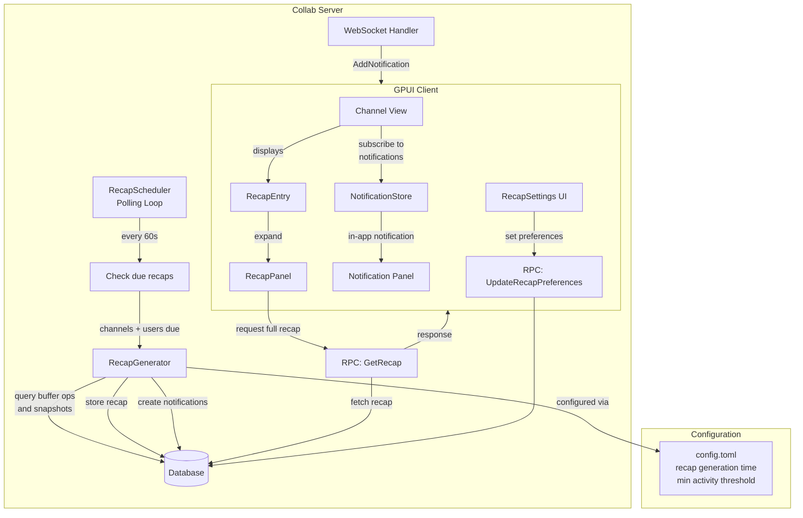
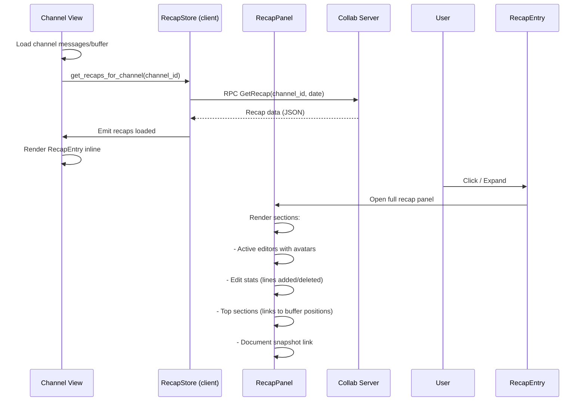

# Design: Channel Recaps / Digests

## 1. Overview

Channel Recaps are automated daily summaries of channel activity tailored to Sim's collaborative document model (Markdown buffers synced via CRDT). Unlike chat-centric platforms where recaps count messages, Sim recaps summarize document contributions: who edited what, which sections saw the most change, and the overall document evolution over a 24-hour period. Recaps are rendered as visually distinct entries inline in the channel, with optional notification delivery.

**Key architectural decisions:**

- **Recap focuses on buffer contributions, not chat messages**: Sim channels are centered on shared documents (`ChannelBuffer` backed by `language::Buffer`). Chat messages were removed from the codebase (RPC handlers return errors). The recap tracks CRDT buffer operations (edits), active collaborators, and document snapshots — not chat-style messages. The data model is designed to accommodate future re-addition of chat messages if needed, but the initial implementation is document-first.
- **Polling loop for recap generation**: The `collab` crate has no dedicated job queue or cron system. The existing pattern for periodic background work is `executor.spawn_detached` with a loop + `executor.sleep` (as used by `fetch_extensions_from_blob_store_periodically`). The recap generator follows this same pattern: a polling loop checks once per minute for channels whose recap is due, generates the recap, and stores it.
- **Recap is a stored entity in the database**: Each generated recap is persisted as a row in a new `channel_recaps` table. This enables historical access, efficient querying for the UI, and avoids regenerating recaps on every client request.
- **Recap content is structured JSON**: The summary data (edit count, active participants, top sections, etc.) is stored as a JSON blob. This avoids schema migrations for every new recap metric and allows the client to render rich content without additional server queries.
- **Notification delivery via existing Notification system**: Recaps are delivered using the existing `rpc::Notification` enum and its database-backed notification store. A new `ChannelRecap` variant is added. Push notifications are sent to connected clients as `AddNotification` messages.
- **Per-user scheduling via local timezone**: The recap delivery time (default 8 AM) is stored per-user as a delivery preference. The server polls for users whose configured delivery time has elapsed (in their stored timezone offset). Per-channel and global opt-out are stored as preference flags.

### Glossary

| Term | Definition |
|---|---|
| **Recap** | A structured summary of channel activity over a 24-hour period |
| **Digest** | (Future) A collection of recaps from multiple channels delivered as a single notification |
| **Recap Period** | The 24-hour window covered by a recap (e.g., "2026-06-24 08:00 to 2026-06-25 08:00") |
| **Buffer Operation** | A CRDT operation applied to the channel's shared document (insert/edit/delete) |
| **Active Editor** | A user who applied at least one buffer operation during the recap period |

## 2. Architecture

### 2.1 High-level data flow



### 2.2 Recap generation flow

```mermaid
sequenceDiagram
    participant Loop as RecapScheduler
    participant Gen as RecapGenerator
    participant DB as Database
    participant Notif as Notification Store
    participant WS as WebSocket
    
    Loop->>Loop: Every 60s tick
    Loop->>DB: SELECT channels_with_recap_due()
    DB-->>Loop: [(channel_id, user_ids)]
    
    Loop->>Gen: generate_recap(channel_id)
    
    Gen->>DB: SELECT buffer_ops WHERE timestamp IN period
    Gen->>DB: SELECT buffer_snapshots BEFORE/AFTER period
    DB-->>Gen: operation history, snapshots
    
    Gen->>Gen: Compute stats:
    Gen->>Gen: - Edit count per user
    Gen->>Gen: - Active editors list
    Gen->>Gen: - Sections with most changes
    Gen->>Gen: - Lines added/deleted
    Gen->>Gen: - Diff summary
    
    Gen->>DB: INSERT INTO channel_recaps
    DB-->>Gen: recap_id
    
    alt Notifications enabled
        Gen->>Notif: CREATE notification per user
        Notif->>DB: INSERT notifications
        Notif-->>WS: Push AddNotification per connected user
    end
```

### 2.3 Recap rendering flow (client)



### Components

| Component | Layer | Responsibility |
|---|---|---|
| `RecapScheduler` | Server | Polling loop that checks for channels/users due for recap generation |
| `RecapGenerator` | Server | Queries buffer operations, computes statistics, stores recap |
| `RecapStore` (server) | Server | CRUD operations for `channel_recaps` table |
| `RecapStore` (client) | Client (GPUI) | Cached recap state per channel, RPC interface |
| `RecapEntry` | Client (GPUI) | Inline channel element showing recap summary, visually distinct |
| `RecapPanel` | Client (GPUI) | Expanded recap view with full stats and navigation links |
| `RecapSettings` | Client (GPUI) | Preference UI for delivery time, opt-out per-channel and globally |
| `NotificationStore` | Client (GPUI) | Existing notification handling; recaps appear as notification entries |

## 3. Components and Interfaces

### 3.1 Protobuf Changes

```protobuf
// --- New RPC messages ---

// Request recap for a channel on a specific date
message GetRecap {
    uint64 channel_id = 1;
    // Date in YYYY-MM-DD format, interpreted in user's timezone.
    // If omitted, returns the most recent recap.
    optional string date = 2;
}

message GetRecapResponse {
    optional Recap recap = 1;
}

// Fetch multiple recaps for a digest / feed view
message GetRecaps {
    repeated uint64 channel_ids = 1;
    // Maximum number of recaps per channel, newest first.
    uint32 limit = 2;
}

message GetRecapsResponse {
    repeated Recap recaps = 1;
}

// --- Preference management ---

message UpdateRecapPreferences {
    // Per-channel opt-out. If set to true, recaps are not generated
    // for this channel for the calling user.
    optional bool opt_out_all = 1;
    // Per-channel opt-out map: channel_id -> opt_out
    map<uint64, bool> channel_opt_outs = 2;
    // Delivery time as minutes since midnight in the user's timezone.
    // Default: 480 (8:00 AM).
    optional uint32 delivery_time_minutes = 3;
    // The user's IANA timezone string, e.g. "America/New_York".
    // Used to align delivery_time_minutes to wall-clock time.
    optional string timezone = 4;
    // Minimum number of edits in a period to generate a recap.
    // Default: 5.
    optional uint32 min_activity_threshold = 5;
}

message UpdateRecapPreferencesResponse {
    bool success = 1;
}

// --- Push notification for new recap ---
// Reuses the existing AddNotification system; no new push message needed.
// The notification content includes:
//   channel_id, channel_name, recap_date, edit_count, editor_count.

// --- Data message ---

message Recap {
    uint64 id = 1;
    uint64 channel_id = 2;
    // The date this recap covers (YYYY-MM-DD), in the generation timezone.
    string recap_date = 3;
    // Unix timestamp (seconds) when the recap period starts.
    uint64 period_start = 4;
    // Unix timestamp (seconds) when the recap period ends.
    uint64 period_end = 5;

    // Summary statistics
    uint32 total_edit_operations = 10;
    uint32 active_editor_count = 11;
    uint32 lines_added = 12;
    uint32 lines_deleted = 13;

    // Active editors, ordered by edit count descending
    repeated EditorSummary active_editors = 20;
    // Top sections by edit activity, ordered by activity descending
    repeated SectionSummary top_sections = 21;
    // Summary of document state at period end (snapshot excerpt)
    optional DocumentSnapshotSummary document_summary = 22;

    // Timestamps
    uint64 generated_at = 30;
    bool is_read = 31;
}

message EditorSummary {
    uint64 user_id = 1;
    string github_login = 2;
    string avatar_url = 3;
    uint32 edit_count = 4;
    uint32 lines_added = 5;
    uint32 lines_deleted = 6;
}

message SectionSummary {
    // Buffer position range (0-indexed byte offsets)
    uint64 start_offset = 1;
    uint64 end_offset = 2;
    // Section preview text (first line or excerpt, max 80 chars)
    string preview = 3;
    uint32 edit_count = 4;
    repeated uint64 editor_user_ids = 5;
    // Severity of change: "light", "moderate", "heavy"
    string activity_level = 6;
}

message DocumentSnapshotSummary {
    // Total document length at end of period
    uint64 total_bytes = 1;
    // Number of distinct top-level sections (e.g., markdown headings)
    uint32 section_count = 2;
    // List of section headings that had edits
    repeated string changed_headings = 3;
    // Brief text excerpt of the most-edited region (max 200 chars)
    string most_edited_excerpt = 4;
}
```

### 3.2 Server-side RecapStore

```rust
// File: crates/collab/src/db/queries/recaps.rs

impl Database {
    /// Generate and store a recap for a channel for a given period.
    pub async fn create_recap(
        &self,
        channel_id: ChannelId,
        period_start: PrimitiveDateTime,
        period_end: PrimitiveDateTime,
    ) -> Result<Recap>;

    /// Fetch the most recent recap for a channel.
    pub async fn get_latest_recap(
        &self,
        channel_id: ChannelId,
    ) -> Result<Option<Recap>>;

    /// Fetch a recap by ID.
    pub async fn get_recap_by_id(
        &self,
        recap_id: RecapId,
    ) -> Result<Option<Recap>>;

    /// Fetch recaps for multiple channels, newest first, limited per channel.
    pub async fn get_recaps(
        &self,
        channel_ids: &[ChannelId],
        limit: usize,
    ) -> Result<Vec<Recap>>;

    /// Get channels that are due for recap generation at this moment,
    /// considering user delivery time preferences and timezone offsets.
    pub async fn channels_due_for_recap(
        &self,
        now: &PrimitiveDateTime,
    ) -> Result<Vec<(ChannelId, Vec<UserId>)>>;

    /// Mark a recap as read for a user.
    pub async fn mark_recap_read(
        &self,
        recap_id: RecapId,
        user_id: UserId,
    ) -> Result<()>;

    // --- Preference management ---

    pub async fn get_recap_preferences(
        &self,
        user_id: UserId,
    ) -> Result<RecapPreferences>;

    pub async fn update_recap_preferences(
        &self,
        user_id: UserId,
        preferences: RecapPreferences,
    ) -> Result<()>;

    /// Check if a user has opted out of recaps for a specific channel.
    pub async fn is_recap_opted_out(
        &self,
        user_id: UserId,
        channel_id: ChannelId,
    ) -> Result<bool>;
}

/// Per-user recap preferences.
pub struct RecapPreferences {
    pub opt_out_all: bool,
    pub channel_opt_outs: HashSet<ChannelId>,
    /// Minutes since midnight for delivery time.
    pub delivery_time_minutes: u32,
    /// IANA timezone string.
    pub timezone: String,
    /// Minimum edits to trigger a recap.
    pub min_activity_threshold: u32,
}
```

### 3.3 RecapScheduler (Server-side polling loop)

The scheduler follows the `fetch_extensions_from_blob_store_periodically` pattern:

```rust
// File: crates/collab/src/recaps.rs (new module)

pub fn start_recap_scheduler(app_state: Arc<AppState>) {
    let executor = app_state.executor.clone();
    executor.spawn_detached(async move {
        loop {
            if let Err(error) = generate_due_recaps(&app_state).await {
                log::error!("recap generation failed: {:?}", error);
            }
            executor.sleep(Duration::from_secs(60)).await;
        }
    });
}

async fn generate_due_recaps(app_state: &Arc<AppState>) -> Result<()> {
    let now = /* current time */;
    let due_channels = app_state.db.channels_due_for_recap(&now).await?;

    for (channel_id, user_ids) in due_channels {
        // Determine the recap period (aligned to 24-hour windows from delivery time)
        let (period_start, period_end) = compute_recap_period(channel_id, &now);

        // Skip if activity is below threshold for opted-in users
        let activity_count = app_state.db
            .count_buffer_operations(channel_id, period_start, period_end)
            .await?;

        // Check the effective minimum threshold (lowest among opted-in users)
        let min_threshold = get_effective_threshold(&app_state.db, &user_ids).await;
        if activity_count < min_threshold {
            continue;
        }

        // Generate and store the recap
        let recap = app_state.db.create_recap(
            channel_id, period_start, period_end
        ).await?;

        // Create notifications for opted-in, connected users
        for user_id in &user_ids {
            if app_state.db.is_recap_opted_out(*user_id, channel_id).await? {
                continue;
            }
            app_state.db.create_notification(
                *user_id,
                Notification::ChannelRecap {
                    channel_id: channel_id.0,
                    recap_date: recap.recap_date.clone(),
                    edit_count: recap.total_edit_operations,
                },
                /* avoid_duplicates */ true,
                &tx,
            ).await?;
        }
    }
    Ok(())
}
```

### 3.4 RecapGenerator internals

The core generation logic queries buffer operations and snapshots to compute statistics:

```rust
// Pseudocode — lives in crates/collab/src/db/queries/recaps.rs

impl Database {
    pub async fn create_recap(
        &self,
        channel_id: ChannelId,
        period_start: PrimitiveDateTime,
        period_end: PrimitiveDateTime,
    ) -> Result<Recap> {
        // 1. Get the buffer for this channel (from `buffers` table)
        let buffer = self.get_buffer_for_channel(channel_id).await?;

        // 2. Query buffer operations in the period
        //    buffer_operations stores (buffer_id, epoch, lamport_timestamp, replica_id, value)
        //    The lamport_timestamp can approximate time, but we also need wall-clock time.
        //    If buffer_operations lacks wall-clock timestamps, we join with
        //    observed_buffer_edits or use the buffer_snapshots epoch as proxy.
        let operations = self.get_buffer_operations_in_range(
            buffer.id, period_start, period_end
        ).await?;

        // 3. Compute editor summaries (group by replica_id -> user_id mapping)
        let editors = aggregate_editors(&operations);  // edit count, lines added/deleted per user

        // 4. Compute section summaries (map byte ranges to markdown headings)
        let sections = compute_active_sections(&operations, &buffer);

        // 5. Get before/after snapshots for line diff statistics
        let before_snapshot = self.get_buffer_snapshot_at(buffer.id, period_start).await?;
        let after_snapshot = self.get_buffer_snapshot_at(buffer.id, period_end).await?;
        let (lines_added, lines_deleted) = diff_snapshots(&before_snapshot, &after_snapshot);

        // 6. Store recap
        let recap_data = RecapData {
            total_edit_operations: operations.len() as u32,
            active_editor_count: editors.len() as u32,
            lines_added,
            lines_deleted,
            active_editors: editors,
            top_sections: sections,
            document_summary: compute_document_summary(&after_snapshot),
        };

        // Serialize to JSON and insert into channel_recaps
        self.insert_recap(channel_id, period_start, period_end, recap_data).await
    }
}
```

### 3.5 RecapEntry UI Component (Client-side, GPUI)

```rust
// File: crates/channel/src/recap_entry.rs (new)

pub struct RecapEntry {
    channel_id: ChannelId,
    recap_summary: Option<RecapSummary>,
    expanded: bool,
    loading_task: Option<Task<Result<()>>>,
    recap_store: Entity<ClientRecapStore>,
}

impl RecapEntry {
    /// Renders the recap teaser in the channel timeline.
    /// Visually distinct: subtle background, calendar icon, summary stats.
    pub fn render(&mut self, window: &mut Window, cx: &mut Context<Self>) -> impl IntoElement;

    fn toggle_expand(&mut self, window: &mut Window, cx: &mut Context<Self>);
}

impl RenderOnce for RecapEntry {
    fn render(self, _window: &mut Window, _cx: &mut App) -> impl IntoElement {
        div()
            .id(("recap", self.channel_id, /* recap date */))
            .cursor_pointer()
            .bg(gpui::blue().with_alpha(0.08))
            .rounded_md()
            .p_2()
            .child(
                h3().text_sm().child(format_args!(
                    "📋 Channel Recap — {}",
                    self.recap_summary.recap_date
                ))
            )
            .child(
                div().flex().gap_4().child(
                    format_args!("{} editors · {} edits · +{} / -{} lines",
                        self.recap_summary.active_editor_count,
                        self.recap_summary.total_edit_operations,
                        self.recap_summary.lines_added,
                        self.recap_summary.lines_deleted,
                    )
                )
            )
            .when(self.expanded, |el| {
                el.child(self.render_expanded_content())
            })
    }
}
```

### 3.6 RecapPanel UI Component

```rust
// File: crates/channel/src/recap_panel.rs (new)

pub struct RecapPanel {
    channel_id: ChannelId,
    recap: Option<Recap>,
    loading: bool,
    error: Option<SharedString>,
}

impl RecapPanel {
    pub fn open(
        channel_id: ChannelId,
        recap_date: Option<String>,
        window: &mut Window,
        cx: &mut App,
    ) -> Task<Result<()>>;

    pub fn render(&mut self, window: &mut Window, cx: &mut Context<Self>) -> impl IntoElement {
        // Layout:
        // ┌─────────────────────────────────┐
        // │ 📋 Recap for June 25, 2026      │
        // │ Close button                    │
        // ├─────────────────────────────────┤
        // │ Summary bar:                    │
        // │  8 editors · 142 edits          │
        // │  +350 / -120 lines              │
        // ├─────────────────────────────────┤
        // │ Active Editors:                 │
        // │  [avatar] alice — 45 edits      │
        // │  [avatar] bob   — 32 edits      │
        // │  ...                            │
        // ├─────────────────────────────────┤
        // │ Top Sections:                   │
        // │  ## Architecture (§1-34) — 28e  │
        // │  ## API Design (§200-245) — 18e │
        // │  (click navigates to position)  │
        // ├─────────────────────────────────┤
        // │ Document Snapshot:              │
        // │  "The system processes..."      │
        // └─────────────────────────────────┘
    }

    fn render_editor_list(&self, editors: &[EditorSummary]) -> impl IntoElement;
    fn render_sections(&self, sections: &[SectionSummary]) -> impl IntoElement;
}
```

### 3.7 ClientRecapStore

```rust
// File: crates/channel/src/recap_store.rs (new)

pub struct ClientRecapStore {
    recaps_by_channel: HashMap<ChannelId, Vec<Recap>>,
    client: Arc<Client>,
}

impl ClientRecapStore {
    pub fn new(client: Arc<Client>) -> Self;

    /// Fetch recap for a channel on a specific date.
    pub fn get_recap(
        &self,
        channel_id: ChannelId,
        date: Option<String>,
        cx: &App,
    ) -> Task<Result<Option<Recap>>>;

    /// Fetch recaps for visible channels (for digest view).
    pub fn get_recent_recaps(
        &self,
        channel_ids: &[ChannelId],
        cx: &App,
    ) -> Task<Result<Vec<Recap>>>;

    /// Mark a recap as read for the current user.
    pub fn mark_read(
        &self,
        recap_id: RecapId,
        cx: &mut App,
    ) -> Task<Result<()>>;
}
```

### 3.8 Notification integration

```rust
// File: crates/rpc/src/notification.rs

pub enum Notification {
    // ...existing variants...
    ContactRequest { sender_id: u64 },
    ContactRequestAccepted { responder_id: u64 },
    ChannelInvitation { channel_id: u64, channel_name: String, inviter_id: u64 },

    // New variant
    ChannelRecap {
        #[serde(rename = "entity_id")]
        channel_id: u64,
        recap_date: String,
        edit_count: u32,
    },
}
```

The notification payload carries enough info for the in-app notification to display a summary:

> **Recap: #design-doc** — 8 editors, 142 edits, +350 lines today

Clicking the notification navigates to the channel and opens the recap panel.

### 3.9 Recap display in channel (integration point)

Recap entries are rendered inline in the channel's timeline/buffer view. Since Sim channels display a collaborative document (not a chronological message list), the recap is placed:

1. **As a floating card at the top of the buffer** when the user first opens a channel that has an unread recap
2. **In the channel header** as a "View Recap" button when one is available
3. **In the jump-to menu** as a recap entry for quick navigation

The recap entry is visually distinct: it uses a subtle blue/tinted background, a calendar icon emoji, and compact summary text. It is not part of the document's editable text — it overlays in the chrome around the buffer, similar to how the channel description or member list appears.

```rust
// Integration in channel.rs view
pub struct ChannelView {
    buffer: Entity<ChannelBuffer>,
    recap_entry: Option<RecapEntry>,  // displayed above buffer if recap exists
    // ...
}
```

## 4. Data Models

### 4.1 New database tables

```sql
-- Channel recaps: one row per generated recap
CREATE TABLE channel_recaps (
    id              BIGSERIAL PRIMARY KEY,
    channel_id      BIGINT NOT NULL REFERENCES channels(id) ON DELETE CASCADE,
    -- The coverage period (wall-clock aligned)
    period_start    TIMESTAMP NOT NULL,
    period_end      TIMESTAMP NOT NULL,
    -- YYYY-MM-DD string for human-friendly display
    recap_date      VARCHAR(10) NOT NULL,
    -- Structured recap data as JSON
    data            JSONB NOT NULL,
    generated_at    TIMESTAMP NOT NULL DEFAULT NOW(),
    -- Channel epoch at generation time (for ordering)
    epoch           INTEGER NOT NULL DEFAULT 0
);

CREATE INDEX idx_recaps_channel_date ON channel_recaps (channel_id, recap_date DESC);
CREATE INDEX idx_recaps_period_end ON channel_recaps (period_end);

-- Recap read tracking: which users have seen which recaps
CREATE TABLE channel_recap_reads (
    recap_id        BIGINT NOT NULL REFERENCES channel_recaps(id) ON DELETE CASCADE,
    user_id         BIGINT NOT NULL REFERENCES users(id) ON DELETE CASCADE,
    read_at         TIMESTAMP NOT NULL DEFAULT NOW(),
    PRIMARY KEY (recap_id, user_id)
);

-- User recap preferences
CREATE TABLE channel_recap_preferences (
    user_id                     BIGINT PRIMARY KEY REFERENCES users(id) ON DELETE CASCADE,
    opt_out_all                 BOOLEAN NOT NULL DEFAULT FALSE,
    delivery_time_minutes       INTEGER NOT NULL DEFAULT 480,  -- 8:00 AM
    timezone                    VARCHAR(64) NOT NULL DEFAULT 'UTC',
    min_activity_threshold      INTEGER NOT NULL DEFAULT 5,
    updated_at                  TIMESTAMP NOT NULL DEFAULT NOW()
);

-- Per-channel opt-out for recaps
CREATE TABLE channel_recap_opt_outs (
    user_id         BIGINT NOT NULL REFERENCES users(id) ON DELETE CASCADE,
    channel_id      BIGINT NOT NULL REFERENCES channels(id) ON DELETE CASCADE,
    created_at      TIMESTAMP NOT NULL DEFAULT NOW(),
    PRIMARY KEY (user_id, channel_id)
);
```

### 4.2 Recap data JSON structure

```json
{
    "total_edit_operations": 142,
    "active_editor_count": 8,
    "lines_added": 350,
    "lines_deleted": 120,
    "active_editors": [
        {
            "user_id": 1001,
            "edit_count": 45,
            "lines_added": 180,
            "lines_deleted": 60
        }
    ],
    "top_sections": [
        {
            "start_offset": 0,
            "end_offset": 1200,
            "preview": "## Architecture",
            "edit_count": 28,
            "editor_user_ids": [1001, 1003, 1007],
            "activity_level": "heavy"
        }
    ],
    "document_summary": {
        "total_bytes": 15000,
        "section_count": 7,
        "changed_headings": ["Architecture", "API Design", "Data Models"],
        "most_edited_excerpt": "The system processes incoming requests through a pipeline..."
    },
    "generated_at": 1751234567
}
```

### 4.3 Client-side types

```rust
// File: crates/channel/src/recap_types.rs

#[derive(Debug, Clone, Serialize, Deserialize)]
pub struct Recap {
    pub id: RecapId,
    pub channel_id: ChannelId,
    pub recap_date: String,
    pub period_start: DateTime<Utc>,
    pub period_end: DateTime<Utc>,
    pub data: RecapData,
    pub generated_at: DateTime<Utc>,
    pub is_read: bool,
}

#[derive(Debug, Clone, Serialize, Deserialize)]
pub struct RecapData {
    pub total_edit_operations: u32,
    pub active_editor_count: u32,
    pub lines_added: u32,
    pub lines_deleted: u32,
    pub active_editors: Vec<EditorSummary>,
    pub top_sections: Vec<SectionSummary>,
    pub document_summary: Option<DocumentSnapshotSummary>,
}

// Mirror proto types from section 3.1
pub struct EditorSummary {
    pub user_id: u64,
    pub github_login: String,
    pub avatar_url: String,
    pub edit_count: u32,
    pub lines_added: u32,
    pub lines_deleted: u32,
}

pub struct SectionSummary {
    pub start_offset: u64,
    pub end_offset: u64,
    pub preview: String,
    pub edit_count: u32,
    pub editor_user_ids: Vec<u64>,
    pub activity_level: String,
}

pub struct DocumentSnapshotSummary {
    pub total_bytes: u64,
    pub section_count: u32,
    pub changed_headings: Vec<String>,
    pub most_edited_excerpt: String,
}
```

### 4.4 Server-side DB model

```rust
// File: crates/collab/src/db/tables/recap.rs (new)

use sea_orm::entity::prelude::*;

#[derive(Clone, Debug, PartialEq, Eq, DeriveEntityModel)]
#[sea_orm(table_name = "channel_recaps")]
pub struct Model {
    #[sea_orm(primary_key)]
    pub id: RecapId,
    pub channel_id: ChannelId,
    pub period_start: PrimitiveDateTime,
    pub period_end: PrimitiveDateTime,
    pub recap_date: String,
    pub data: Json,
    pub generated_at: PrimitiveDateTime,
    pub epoch: i32,
}
```

## 5. Correctness Properties

### Property 5.1: Recap generation idempotency

_For any_ `(channel_id, period_start, period_end)` tuple, the system SHALL generate at most one recap row. If a recap already exists for the exact period, `create_recap` SHALL be a no-op.

**Validates: Requirement 13.1.1, 13.4.3**

### Property 5.2: Activity threshold

_For any_ channel whose total edit operations in the recap period are strictly less than the effective minimum activity threshold for its members, the system SHALL NOT generate a recap.

**Validates: Requirement 13.1.4**

### Property 5.3: Recap period alignment

_For any_ user, the recap delivery time SHALL align to 24-hour windows starting from their configured delivery time in their stored timezone. If user A has delivery time 8:00 AM in `America/New_York` and user B has 8:00 AM in `Europe/London`, their recaps SHALL be generated at the corresponding UTC times (12:00 UTC and 07:00 UTC respectively during standard time).

**Validates: Requirement 13.1.3**

### Property 5.4: Channel visibility respect

_For any_ recap generated for a channel, the system SHALL only include edits from users who are channel members at the time of generation. If a user was a member during the period but left before generation, their edits SHALL still be counted (edits are immutable), but their identity SHALL only be included if they were a member at generation time.

**Validates: Requirement 13.1 (visibility), Requirement 13.4.10**

### Property 5.5: Notification opt-out

_For any_ user who has opted out of recaps (globally via `opt_out_all` or per-channel via `channel_recap_opt_outs`), the system SHALL NOT create a notification for that recap. The recap entry SHALL still be visible in the channel if the user navigates to it manually.

**Validates: Requirement 13.3.4**

### Property 5.6: Recap read tracking

_For any_ recap that a user has not explicitly marked as read (via `channel_recap_reads`), the recap entry SHALL display with an unread indicator (e.g., a blue dot or bold text). Once marked read, the indicator SHALL be cleared.

**Validates: Requirement 13.2.1**

### Property 5.7: Notification delivery

_For any_ user who has enabled recap notifications and is connected to the server at delivery time, the system SHALL deliver an `AddNotification` message within 60 seconds of recap generation. If the user is offline, the notification SHALL be delivered upon next connection (via existing notification sync).

**Validates: Requirement 13.3.2**

### Property 5.8: Edit-only content

_For any_ channel that has no buffer operations in the recap period (i.e., no edits were made by any participant), the system SHALL NOT generate a recap, regardless of other activity (e.g., membership changes).

**Validates: Requirement 13.4.3, Requirement 13.1.1**

### Property 5.9: Recap data consistency over time

_For any_ recap stored in `channel_recaps`, the `data` JSON blob SHALL be immutable after insertion. If a channel's buffer is later edited, historical recaps SHALL NOT change. This ensures that users viewing an old recap see the same content every time.

**Validates: Requirement 13.4.4**

## 6. Error Handling

| Error | Handling |
|---|---|
| **Buffer not found for channel** | Log warning and skip; the channel may have been deleted between the due check and generation |
| **Database connection failure during generation** | Retry on next scheduler tick (60s). Log error with channel_id for manual inspection |
| **Recap generation for very large channel (>10k ops)** | Run generation in a spawned task with a timeout (30s). If it times out, log error and skip; the next tick will retry. Future optimization: incremental recaps. |
| **User timezone is invalid/unparseable** | Fall back to UTC. Log a warning for the user_id. |
| **Recap creation race (two ticks for same period)** | Handled by `ON CONFLICT DO NOTHING` / period uniqueness constraint. The second tick silently succeeds. |
| **Notification creation failure for one user** | Log error and continue to other users. The recap is still stored; the user will see it when they open the channel. |
| **Client requests recap for deleted channel** | Return `NOT_FOUND`; client removes any stale recap entry from the view |
| **Recap data JSON too large (>1MB)** | Truncate long fields (excerpts, changed_headings) before serialization. The total recap JSON size SHALL not exceed 1MB. |
| **User preference update with invalid delivery_time_minutes (>1440)** | Reject with `INVALID_ARGUMENT` error; client validates before sending |
| **Editing frequency mismatch: user makes zero edits but views document** | Only buffer operations count as activity. Passive reading (joining buffer without editing) does not qualify as "active participation." |

## 7. Testing Strategy

### 7.1 Unit tests

- **RecapStore queries**: Test `create_recap`, `get_latest_recap`, `channels_due_for_recap` with mocked database transactions.
- **Recap data computation**: Test `compute_active_sections` with known edit patterns, verify section boundaries and edit counts. Test `diff_snapshots` line counting.
- **Preference management**: CRUD operations on `channel_recap_preferences` and `channel_recap_opt_outs` tables.
- **Idempotency**: Call `create_recap` twice with the same period; verify only one row exists.

### 7.2 Integration tests

- **Full generation flow**: Set up a test channel with a buffer and known edits. Trigger recap generation. Verify a recap row is created with correct statistics. Verify notifications are created for channel members.
- **Activity threshold**: Configure a high threshold. Make few edits below threshold. Verify no recap is generated.
- **Opt-out**: Set per-channel opt-out for a user. Generate recap. Verify no notification for that user but recap exists.
- **Timezone alignment**: Create users with different timezones. Set same delivery time. Verify recaps are generated at correct UTC offsets.
- **Scheduler loop**: Mock the DB to return due channels. Verify `generate_due_recaps` is called and the loop sleeps for 60 seconds.

### 7.3 API / RPC tests

- **GetRecap**: Send request for existing recap, non-existent recap, and recap in a channel the user doesn't belong to. Verify correct responses.
- **UpdateRecapPreferences**: Update each preference field. Verify they persist. Attempt invalid values (e.g., delivery_time_minutes > 1440). Verify rejection.
- **Recap notification**: Generate a recap, verify `AddNotification` is pushed to connected members. Verify notification content includes correct channel_id and edit count.

### 7.4 UI tests (GPUI)

- **RecapEntry rendering**: Render a `RecapEntry` with mock data. Verify it shows summary stats, correct date, editor count. Verify collapsed vs. expanded state renders differently.
- **RecapPanel rendering**: Render full recap with multiple editors and sections. Verify all sections display. Verify empty state renders correctly.
- **Navigation**: Click a section link in the recap. Verify the buffer navigates to the correct offset position.
- **Unread indicator**: Show a recap that has `is_read = false`. Verify blue dot appears. Call `mark_read`. Verify dot disappears.

### 7.5 Concurrency tests

- **Simultaneous generation**: Two scheduler ticks fire in quick succession for the same channel. Verify only one recap is created (idempotency).
- **Read during generation**: Client requests a recap while generation is in progress. Verify either the old recap is returned or a "generating" status is shown — never a partial/inconsistent state.
