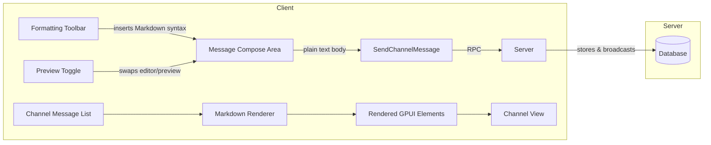

# Design: Rich Text Formatting in Channel Messages

## 1. Overview

Channel chat messages in Sim are currently sent and displayed as plain text via the `SendChannelMessage`/`ChannelMessage` protobuf types. Sim's `markdown` crate already provides a full Markdown rendering pipeline (`pulldown-cmark` parser, GPUI element tree output, syntax highlighting, mermaid support). This design reuses that crate to render channel messages, and adds a minimal formatting toolbar to the message composition UI.

**Key decisions:**

- **Render path**: Reuse existing `markdown` crate's `render_markdown` logic to convert `ChannelMessage.body` into GPUI styled elements. No new Markdown parser needed.
- **Compose mode**: Keep the composition input as plain text (so the proto field stays `string body`). Add a live preview toggle or toolbar with Markdown insertion helpers.
- **Backend changes**: None to the `ChannelMessage` proto; only the rendering and composition UI on the client side. The server is not involved in formatting.

## 2. Architecture



### Components

| Component | Responsibility |
|---|---|
| `ChannelMessageList` | Existing message list; renders each `ChannelMessage` |
| `MarkdownRenderer` | Existing `markdown` crate; converts `&str` to `Vec<AnyElement>` |
| `ComposeArea` | Message input (plain text `Editor` or textarea) |
| `FormattingToolbar` | Floating toolbar with bold/italic/code/link/quote buttons |
| `PreviewPane` | Toggle-able live-preview of the composed message |

## 3. Components and Interfaces

### 3.1 Message Rendering (ChannelMessage → rendered output)

**Purpose**: Render `ChannelMessage.body` as formatted Markdown in the channel message list.

**Current state**: Messages are rendered as plain `SharedString` labels.

**New implementation**:

```rust
// In collab_ui (or wherever channel messages are rendered)
use markdown::render_markdown;

fn render_channel_message(message: &ChannelMessage, cx: &mut App) -> Vec<AnyElement> {
    let elements = render_markdown(
        &message.body,
        markdown::RenderOptions {
            syntax_highlight: true,
            render_links: true,
            render_images: true,
            max_image_width: Some(Pixels(400.0)),
            ..Default::default()
        },
        cx,
    );
    elements
}
```

**Dependencies**: `markdown` crate (already available)

**No changes to**: `ChannelMessage` proto, `SendChannelMessage` flow, server.

### 3.2 Compose Area Formatting Toolbar

**Purpose**: Help users apply Markdown formatting without remembering syntax.

**Interface**:

```rust
pub struct FormattingToolbar {
    /// Currently selected text range (if any) in the compose editor.
    selection: Option<Range<usize>>,
    /// Active formatting toggles based on cursor position.
    active_formats: FormatFlags,
}

#[derive(Default)]
pub struct FormatFlags {
    bold: bool,
    italic: bool,
    code: bool,
    strikethrough: bool,
}

impl FormattingToolbar {
    /// Inserts Markdown markers around the selection, or at cursor.
    pub fn apply_format(
        &self,
        format: FormatKind,
        editor: &mut Editor,
        window: &mut Window,
        cx: &mut App,
    );
}

pub enum FormatKind {
    Bold,          // **text**
    Italic,        // *text*
    Code,          // `text`
    Strikethrough, // ~~text~~
    Blockquote,    // > text
    Link,          // [text](url)
    CodeBlock,     // ```\ntext\n```
    BulletList,    // - text
    NumberedList,  // 1. text
}
```

**Responsibility**: The toolbar observes the current editor selection/cursor and shows active/inactive button states. On click, it inserts or wraps Markdown syntax.

**UX integration**: The toolbar appears as a floating row above the message input when it has focus and non-empty selection, or as a persistent icon bar.

### 3.3 Source/Preview Toggle

**Purpose**: Let users verify formatted output before sending.

**Interface**:

```rust
pub enum ComposeMode {
    Source,  // Raw Markdown editing
    Preview, // Live rendered preview (read-only)
}

pub struct ComposeArea {
    mode: ComposeMode,
    source_editor: Entity<Editor>,
    preview: MarkdownPreview,
}
```

When `mode == Preview`, the `source_editor` is hidden and `preview` shows the rendered output. The user can toggle with Ctrl+Shift+P or a button.

## 4. Data Models

**No new data models.** The `ChannelMessage.body` remains a `string` containing Markdown text. Rendering is purely a client-side concern.

```
// Existing proto (unchanged)
message ChannelMessage {
    uint64 id = 1;
    string body = 2;          // Now contains Markdown (was plain text)
    uint64 timestamp = 3;
    uint64 sender_id = 4;
    Nonce nonce = 5;
    repeated ChatMention mentions = 6;
    optional uint64 reply_to_message_id = 7;
    optional uint64 edited_at = 8;
}
```

## 5. Correctness Properties

### Property 5.1: No-breaking behavior for plain text

_For any_ `ChannelMessage.body` containing no Markdown syntax, `render_channel_message()` SHALL produce the same visual output as the current plain-text rendering.

**Validates: Requirement 1.5**

### Property 5.2: Safe rendering

_For any_ `ChannelMessage.body`, `render_channel_message()` SHALL never panic, and SHALL sanitize JavaScript URLs, `javascript:` protocol links, and raw HTML.

**Validates: Requirement 1.4**

### Property 5.3: Markdown feature completeness

_For any_ `ChannelMessage.body` containing valid Markdown syntax, `render_channel_message()` SHALL render bold, italic, strikethrough, inline code, code blocks with language-specific syntax highlighting, blockquotes, ordered/unordered lists, headings (h1-h6), links, and images.

**Validates: Requirement 1.1**

### Property 5.4: Formatting toolbar correctness

_For any_ user selection in the compose editor, applying a format via the toolbar SHALL produce syntactically valid Markdown that, when rendered, produces the intended visual effect.

**Validates: Requirement 1.2**

## 6. Error Handling

| Error | Handling |
|---|---|
| Malformed Markdown | Render best-effort; invalid constructs show as literal text |
| Extremely long messages (>10K chars) | Cap rendering complexity; truncate at configurable limit |
| Broken images in rendered messages | Show placeholder with broken-image icon |
| Unclosed code fences | Render open fence with scrollable overflow; no crash |
| Toolbar applied to empty selection | Insert Markdown markers with cursor between them (e.g., `****` with cursor in middle) |

## 7. Testing Strategy

- **Unit tests**: `markdown` crate already has parsing tests. Add tests for edge-case Markdown (nested formatting, mixed languages in code blocks).
- **Snapshot tests**: Render known Markdown strings and compare output element trees.
- **Integration tests**: Send messages with Markdown, verify they render correctly in the channel view.
- **Property tests**: Round-trip Markdown through parser → render → verify no crash for random inputs.
