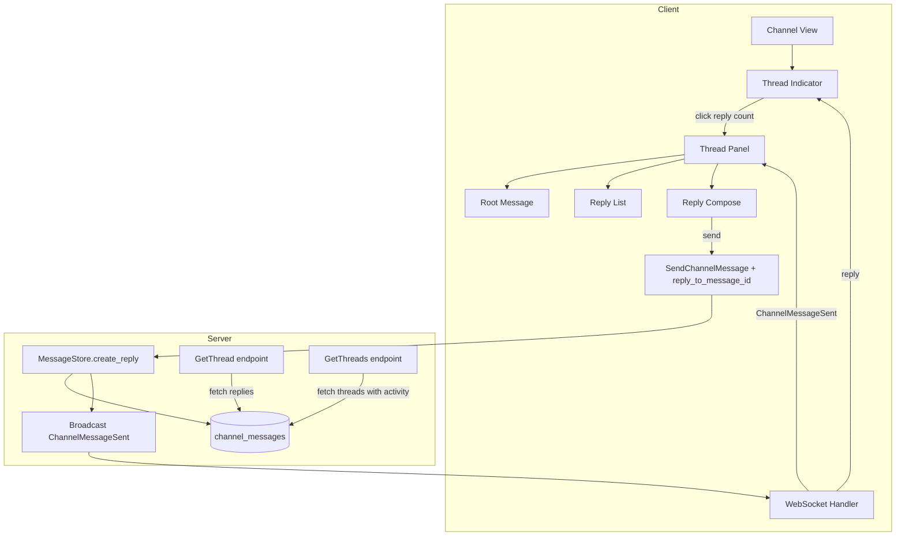

# Design: Message Threading in Channels

## 1. Overview

Sim channel messages currently exist as a flat list. The `SendChannelMessage` proto already has a `reply_to_message_id` field, but there is no dedicated thread view or UI for browsing replies. This design adds a thread panel (right sidebar) that aggregates replies to a root message, with real-time updates and unread indicators.

**Key decisions:**

- **Reuse existing proto**: `reply_to_message_id` already exists on `SendChannelMessage` and `ChannelMessage`. No proto changes needed for the core data model.
- **Thread panel**: A new panel type (not a separate window) — opens in the right sidebar area, similar to how the assistant panel works.
- **Server-side aggregation**: The server provides `GetThread` and `GetThreads` endpoints to fetch replies for a root message and list threads with activity.
- **Real-time**: New replies are pushed via existing `ChannelMessageSent` WebSocket event; the thread panel appends them in real-time.
- **Unread tracking**: Track per-thread read status using existing channel message read tracking infrastructure.

## 2. Architecture



### Components

| Component | Responsibility |
|---|---|
| `ThreadIndicator` | Shows "N replies" below root message; clickable to open thread panel |
| `ThreadPanel` | Right-side panel showing root message + replies + compose |
| `ThreadStore` (server) | Aggregates replies for GetThread/GetThreads, tracks thread metadata |
| `UnreadTracker` | Marks threads with unread replies |

## 3. Components and Interfaces

### 3.1 Protobuf Changes

```protobuf
// New endpoint messages
message GetThread {
    uint64 channel_id = 1;
    uint64 message_id = 2;
}

message GetThreadResponse {
    ChannelMessage root_message = 1;
    repeated ChannelMessage replies = 2;
}

message GetThreads {
    uint64 channel_id = 1;
}

message GetThreadsResponse {
    repeated ThreadSummary threads = 1;
}

message ThreadSummary {
    uint64 root_message_id = 1;
    uint32 reply_count = 2;
    uint64 latest_reply_at = 3;
    repeated uint64 participant_user_ids = 4;
    bool has_unread = 5;
}

// Add to existing UpdateChannelMessage to include thread info
// (no changes needed to core message proto - reply_to_message_id already exists)
```

### 3.2 ThreadIndicator UI

```rust
pub struct ThreadIndicator {
    message_id: u64,
    reply_count: u32,
    has_unread: bool,
    participants: Vec<Arc<User>>,
}

impl ThreadIndicator {
    pub fn render(&self, cx: &mut App) -> AnyElement {
        // Shows: "[N replies]" if count > 0
        // Shows: "[avatar1 avatar2] N replies" with participant avatars
        // Shows: blue dot if has_unread
        // Clicking opens the ThreadPanel
    }
}
```

**Integration**: `ThreadIndicator` is rendered below each channel message when `reply_count > 0`. It is part of the message rendering pipeline.

### 3.3 ThreadPanel

```rust
pub struct ThreadPanel {
    channel_id: ChannelId,
    root_message: ChannelMessage,
    replies: Vec<ChannelMessage>,
    compose_editor: Entity<Editor>,
    loaded: bool,
    loading_task: Option<Task<()>>,
}

impl ThreadPanel {
    /// Open a thread for a given root message.
    pub fn open(
        channel_id: ChannelId,
        root_message_id: u64,
        window: &mut Window,
        cx: &mut App,
    ) -> Task<Result<()>>;

    /// Render the thread panel content.
    pub fn render(&mut self, window: &mut Window, cx: &mut Context<Self>) -> impl IntoElement {
        // Layout:
        // ┌─────────────────────────┐
        // │ Thread header (X close) │
        // ├─────────────────────────┤
        // │ Root message (pinned)   │
        // ├─────────────────────────┤
        // │ Reply 1                 │
        // │ Reply 2                 │
        // │ ...scrollable...        │
        // ├─────────────────────────┤
        // │ Compose area            │
        // └─────────────────────────┘
    }
}
```

The ThreadPanel opens as a dockable panel in the workspace (right side). It is implemented as a new `Entity<T>` that can be toggled via workspace panel infrastructure.

### 3.4 ThreadStore (Server)

```go
type ThreadStore struct {
    db *sqlx.DB
}

// GetThread fetches all replies for a root message, ordered chronologically.
func (s *ThreadStore) GetThread(ctx context.Context, messageID uint64) ([]ChannelMessage, error)

// GetThreads returns all thread summaries for a channel (messages with replies).
func (s *ThreadStore) GetThreads(ctx context.Context, channelID uint64) ([]ThreadSummary, error)

// GetReplyCount returns the number of replies to a message.
func (s *ThreadStore) GetReplyCount(ctx context.Context, messageID uint64) (uint32, error)
```

### 3.5 Thread Unread Tracking

Unread tracking for threads reuses the existing channel message read state system. When a user opens a thread panel, all replies in that thread are marked as read. The `has_unread` flag on `ThreadSummary` is computed as: replies exist with `timestamp > last_read_timestamp` for the current user.

## 4. Data Models

### 4.1 No new database tables

Threading reuses the existing `channel_messages` table. The `reply_to_message_id` column establishes the parent-child relationship.

```
channel_messages (existing)
├── id                 BIGINT PRIMARY KEY
├── channel_id         BIGINT
├── sender_id          BIGINT
├── body               TEXT
├── reply_to_message_id BIGINT NULL  ← FK to parent message
├── created_at         TIMESTAMP
├── edited_at          TIMESTAMP NULL
└── ...
```

### 4.2 New server-side query

```sql
-- Fetch replies for a thread, ordered chronologically
SELECT * FROM channel_messages 
WHERE channel_id = $1 AND reply_to_message_id = $2 
ORDER BY created_at ASC;

-- Fetch threads with reply count for a channel
SELECT 
    reply_to_message_id AS root_message_id,
    COUNT(*) AS reply_count,
    MAX(created_at) AS latest_reply_at
FROM channel_messages 
WHERE channel_id = $1 AND reply_to_message_id IS NOT NULL
GROUP BY reply_to_message_id
ORDER BY latest_reply_at DESC
LIMIT 50;
```

### 4.3 `ThreadSummary` (client-side)

```rust
pub struct ThreadSummary {
    pub root_message: Arc<ChannelMessage>,
    pub reply_count: u32,
    pub latest_reply_at: chrono::DateTime<chrono::Utc>,
    pub participants: Vec<Arc<User>>,
    pub has_unread: bool,
}
```

## 5. Correctness Properties

### Property 5.1: Thread membership correctness

_For any_ `ChannelMessage` where `reply_to_message_id` is set to a non-existent message ID, the server SHALL return an error.

**Validates: Requirement 3.1**

### Property 5.2: Real-time thread updates

_For any_ reply sent in a thread, all channel participants with the thread panel open SHALL see the new reply appended within 500ms.

**Validates: Requirement 3.2**

### Property 5.3: Thread panel state consistency

_For any_ user who opens a thread panel, the displayed root message SHALL be the same as the message that was clicked, and the replies SHALL include all replies to that root message.

**Validates: Requirement 3.1**

### Property 5.4: Unread indicator accuracy

_For any_ thread with replies newer than the user's last read timestamp for that thread, `has_unread` SHALL be `true`.

**Validates: Requirement 3.3**

## 6. Error Handling

| Error | Handling |
|---|---|
| Root message deleted before thread opens | Show "This message has been deleted" placeholder in thread panel |
| Network failure loading thread | Retry with exponential backoff; show loading spinner; after 3 failures show error state |
| Reply sent to deleted root message | Allow reply (the root message placeholder remains visible) |
| Very deep threads (1000+ replies) | Paginate thread loading: load first 50, show "Load earlier replies" button |
| Concurrent reply from another user | Handle via existing optimistic UI pattern — append locally first, reconcile on server ack |

## 7. Testing Strategy

- **Unit tests**: ThreadStore.GetThread, ThreadStore.GetThreads queries
- **Integration tests**: Send root message → send reply → verify GetThread returns reply → verify ThreadIndicator shows count
- **UI tests**: ThreadPanel rendering with various reply counts, unwrap/read state transitions, compose and send reply within thread panel
- **Real-time tests**: Two clients both viewing same thread; client A sends reply; verify client B sees it appear
