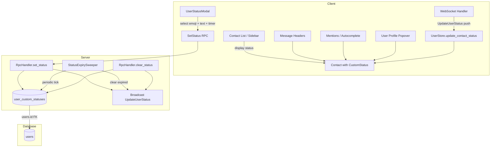
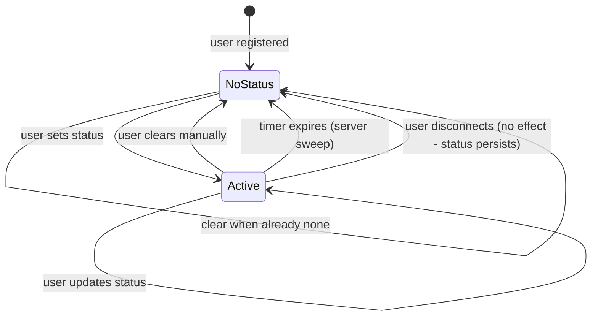

# Design: Custom User Status

## 1. Overview

Baymax currently exposes a binary online/busy presence model via the `Contact` struct (`online: bool`, `busy: bool` in `client::user`). Users have no way to communicate fine-grained availability such as "In a meeting", "Out sick", or "Working remotely". This design adds a custom user status feature — an optional emoji + short text label that users can set, with an optional auto-clear timer, persisted server-side and synced to all connected clients in real time.

### Key Architectural Decisions

| Decision | Choice | Rationale |
|---|---|---|
| **Storage** | New `user_custom_statuses` table (Postgres) | Status is user-global (not per-channel), so it belongs on the `users`-adjacent table rather than in a per-channel table. A separate table avoids bloating the `users` row and simplifies TTL-based expiration. |
| **Real-time sync** | Two new proto messages: `SetStatus` (request) and `UpdateUserStatus` (push) | Follows the existing request/push pattern used by `ChannelMessageSent` / `ChannelMessageUpdate`. Status changes are broadcast to all connected clients via WebSocket. |
| **Client-side state** | `status: Option<CustomStatus>` field on the `Contact` struct | The `Contact` struct already carries user presence (`online`, `busy`). Adding `custom_status` here keeps all presence-related data in one place and is naturally broadcast via the existing `update_contacts` mechanism. Alternatively, a new `UserStatusStore` entity could be created, but piggybacking on `Contact` minimizes new infrastructure. |
| **Auto-clear** | Server-side scheduled task | The server checks expired statuses on a periodic tick (every ~30s) and clears them. Timer resolution of ~30s is sufficient because auto-clear durations are coarse (30min, 1hr, etc.). No per-user timers needed. |
| **Presets** | Hardcoded on the client | Presets are static and small (7 items). They are defined as a constant array in the UI crate to avoid a round-trip to the server. |
| **Emoji picker** | Default system emoji picker component | Reuse existing emoji infrastructure from the `channel-reactions` feature. |

### Trade-offs Considered

- **Adding a new field vs. separate entity**: Adding `status` to `Contact` is simpler but means the custom status is coupled to the contact sync cycle. A separate `UserStatusStore` entity would be cleaner but requires new subscription/observation infrastructure. For v1, coupling to `Contact` is acceptable since status is closely related to presence.
- **Server-side TTL vs. client-side timer**: Server-side expiration is more reliable (survives client disconnect) and avoids clock-skew issues. The trade-off is that the server needs a periodic sweep, adding a small load. Each sweep is a single `UPDATE ... WHERE expires_at < NOW()` query — negligible overhead.
- **Push to all clients vs. pull-on-demand**: Broadcasting status changes to all connected clients ensures the UI is always up-to-date without polling. The cost is bandwidth: each status update is ~200 bytes * number of connected clients. This is acceptable for typical Baymax usage (dozens to low hundreds of clients).

## 2. Architecture

### Component Relationship Diagram



### Data Flow

1. **Setting a status**: User opens `UserStatusModal` → picks emoji + types text + selects "Clear after" timer → clicks Save → client sends `SetStatus` request → server inserts/updates `user_custom_statuses` row → server broadcasts `UpdateUserStatus` push to all connected clients → each client's `UserStore` receives the push and updates the `Contact.custom_status` field → UI reactively re-renders.

2. **Auto-clear (server sweep)**: `StatusExpirySweeper` runs every 30s → queries `user_custom_statuses WHERE expires_at < NOW()` → deletes expired rows → broadcasts `UpdateUserStatus { user_id, status: None }` for each expired status.

3. **Manual clear**: User clicks "Clear status" → client sends `ClearStatus` (or `SetStatus { status: None }`) → server deletes row → broadcasts `UpdateUserStatus` with empty status.

4. **Initial load on connect**: When a client connects, the server includes current custom statuses in the existing `UpdateContacts` push (or an initial `UpdateUserStatuses` batch).

### External Integrations

- **Proto definitions** (new messages in `baymax.proto`): `SetStatus` (request), `SetStatusResponse` (response), `ClearStatus` (request), `UpdateUserStatus` (push), `UpdateUserStatuses` (batch for initial load).
- **Database migration**: New `user_custom_statuses` table.
- **Collab RPC handlers**: New handlers registered in the RPC dispatch table.
- **Proto registration**: New messages registered in `proto::messages!()` and `proto::request_messages!()` macros.

## 3. Components and Interfaces

### 3.1 Protobuf Messages (`crates/proto/proto/baymax.proto`)

```protobuf
message SetStatus {
    optional string emoji = 1;       // e.g., "calendar", "wave", unicode emoji
    optional string text = 2;        // max 100 chars
    optional uint64 clear_after_minutes = 3;  // null = never, otherwise minutes
}

message SetStatusResponse {}

message ClearStatus {}

message UpdateUserStatus {
    uint64 user_id = 1;
    optional UserCustomStatus status = 2;  // null means cleared
}

message UpdateUserStatuses {
    repeated UpdateUserStatus statuses = 1;  // batch for initial load
}

message UserCustomStatus {
    string emoji = 1;
    string text = 2;
    optional uint64 expires_at = 3;  // unix timestamp, null = never
}
```

**Envelope registration** (add to `oneof payload` in `baymax.proto`):

```protobuf
SetStatus set_status = 250;
SetStatusResponse set_status_response = 251;
ClearStatus clear_status = 252;
UpdateUserStatus update_user_status = 253;
UpdateUserStatuses update_user_statuses = 254;
```

### 3.2 Proto Registration (`crates/proto/src/proto.rs`)

Add to `messages!()`:
```rust
(SetStatus, Foreground),
(SetStatusResponse, Foreground),
(ClearStatus, Foreground),
(UpdateUserStatus, Foreground),
(UpdateUserStatuses, Foreground),
(UserCustomStatus, Foreground),
```

Add to `request_messages!()`:
```rust
(SetStatus, SetStatusResponse),
(ClearStatus, SetStatusResponse),  // Reuse response type
```

### 3.3 Server-side RPC Handlers (`crates/collab/src/rpc.rs`)

#### `handle_set_status`

**Purpose**: Persist the user's custom status and broadcast the change.

```rust
async fn handle_set_status(
    request: TypedEnvelope<proto::SetStatus>,
    session: MessageContext,
) -> Result<()> {
    // 1. Validate: text length <= 100 chars
    // 2. Upsert into user_custom_statuses
    // 3. If clear_after_minutes is set, compute expires_at = now + duration
    // 4. Broadcast UpdateUserStatus to all connected sessions
    // 5. Respond with SetStatusResponse
}
```

**Contract**:
- Input: `proto::SetStatus` with optional `emoji`, `text` (≤100 chars), `clear_after_minutes`
- Validates text length, emoji format (must be known unicode emoji or valid emoji name)
- Returns `Err(anyhow!(...))` on validation failure
- On success, broadcasts `UpdateUserStatus` to all connections and responds with `Ok`

#### `handle_clear_status`

**Purpose**: Remove the user's custom status.

```rust
async fn handle_clear_status(
    request: TypedEnvelope<proto::ClearStatus>,
    session: MessageContext,
) -> Result<()> {
    // 1. Delete from user_custom_statuses WHERE user_id = session.user_id
    // 2. Broadcast UpdateUserStatus { user_id, status: None } to all sessions
    // 3. Respond with SetStatusResponse
}
```

**Contract**:
- Idempotent: clearing when no status exists is a no-op (returns success)
- Broadcasting `status: None` signals removal to clients

#### `StatusExpirySweeper`

**Purpose**: Periodically clear expired custom statuses.

```rust
pub struct StatusExpirySweeper {
    db: Arc<Database>,
    executor: Executor,
}

impl StatusExpirySweeper {
    pub fn new(db: Arc<Database>, executor: Executor) -> Self;
    
    /// Start the background sweep loop. Runs every 30 seconds.
    pub fn start(self) -> Task<()>;
    
    /// Sweep all expired statuses.
    /// Returns list of user_ids whose status was cleared.
    async fn sweep(&self) -> Result<Vec<UserId>>;
}
```

**Contract**:
- Queries `DELETE FROM user_custom_statuses WHERE expires_at < NOW() RETURNING user_id`
- For each cleared user_id, broadcasts `UpdateUserStatus { user_id, status: None }`
- Errors are logged but do not halt the sweep loop

### 3.4 Client-side: `UserStore` Changes (`crates/client/src/user.rs`)

#### `Contact` struct extension

```rust
#[derive(Debug, PartialEq)]
pub struct Contact {
    pub user: Arc<User>,
    pub online: bool,
    pub busy: bool,
    pub custom_status: Option<CustomStatus>,  // NEW
}

#[derive(Debug, Clone, PartialEq)]
pub struct CustomStatus {
    pub emoji: Option<SharedString>,
    pub text: SharedString,
    pub expires_at: Option<i64>,  // unix timestamp, for display only
}
```

#### `UserStore` new methods

```rust
impl UserStore {
    /// Apply an incoming UpdateUserStatus to the contact list.
    fn update_user_status(&mut self, user_id: u64, status: Option<CustomStatus>);
    
    /// Send a SetStatus request to the server.
    pub fn set_status(
        &mut self,
        emoji: Option<SharedString>,
        text: SharedString,
        clear_after_minutes: Option<u64>,
        cx: &mut Context<Self>,
    ) -> Task<Result<()>>;
    
    /// Send a ClearStatus request to the server.
    pub fn clear_status(
        &mut self,
        cx: &mut Context<Self>,
    ) -> Task<Result<()>>;
}
```

**New message handler registrations** (in `UserStore::handle_message_to_client`):
- `UpdateUserStatus` → `self.update_user_status(update.user_id, update.status)`
- `UpdateUserStatuses` → iterate and call `update_user_status` for each

### 3.5 UI Components (`crates/collab_ui/`)

#### `UserStatusModal`

**Purpose**: Modal dialog for setting/clearing the custom status.

```rust
pub struct UserStatusModal {
    emoji: Option<SharedString>,
    text: SharedString,
    clear_after: ClearAfterOption,
    user_store: Entity<UserStore>,
    current_user_id: LegacyUserId,
    presets: Vec<StatusPreset>,
}

#[derive(Clone, Copy, PartialEq)]
pub enum ClearAfterOption {
    Never,
    ThirtyMinutes,
    OneHour,
    FourHours,
    Today,
    ThisWeek,
}

pub struct StatusPreset {
    pub emoji: &'static str,
    pub label: &'static str,     // Display text
    pub text: &'static str,      // Status text to set
}

impl UserStatusModal {
    pub fn new(user_store: Entity<UserStore>, cx: &mut WindowContext) -> Self;
    pub fn render(&mut self, window: &mut Window, cx: &mut Context<Self>) -> impl IntoElement;
    
    fn on_select_preset(&mut self, preset: &StatusPreset, cx: &mut Context<Self>);
    fn on_select_emoji(&mut self, emoji: &str, cx: &mut Context<Self>);
    fn on_text_input(&mut self, text: &str, cx: &mut Context<Self>);
    fn on_save(&mut self, window: &mut Window, cx: &mut Context<Self>);
    fn on_clear(&mut self, window: &mut Window, cx: &mut Context<Self>);
}
```

**Render layout**:
- Header: "Set a status"
- Preset grid (2 columns x 4 rows): each row is an emoji + label button
- Divider
- Custom section: emoji picker button + text input (max 100 chars, character counter)
- "Clear after" dropdown: Never, 30 minutes, 1 hour, 4 hours, Today, This week
- Footer: Save button + Clear status button (if status already set) + Cancel

#### `StatusDisplay` (reusable widget)

**Purpose**: Renders a user's custom status as emoji + muted text, used in multiple contexts.

```rust
pub struct StatusDisplay {
    pub status: Option<CustomStatus>,
}

impl StatusDisplay {
    pub fn new(status: Option<&CustomStatus>) -> Self;
}

impl RenderOnce for StatusDisplay {
    fn render(self, _window: &mut Window, cx: &mut App) -> impl IntoElement;
}
```

**Renders**: When `status` is `Some`, shows `{emoji} {text}` in muted/secondary color. Otherwise, renders nothing (zero-width element).

#### Integration points

| UI Location | Component | Integration |
|---|---|---|
| Channel sidebar (contact list) | `CollabPanel::render_contact` | Add `StatusDisplay` below the user name/avatar |
| Message headers | `ChannelView` / message header | Add `StatusDisplay` below the sender's name |
| Mentions autocomplete | `Picker` delegate | Add `StatusDisplay` in the match row |
| User profile popover | Profile popover | Add `StatusDisplay` in the popover body |
| Avatar menu | User avatar context menu | Add "Set a status" menu item |

### 3.6 Dependencies Between Components

| Component | Depends On | Reason |
|---|---|---|
| `SetStatus` RPC handler | `user_custom_statuses` table | Persists the status |
| `UpdateUserStatus` broadcast | `ConnectionPool` | Sends push to all connected sessions |
| `StatusExpirySweeper` | `Database` + `Executor` | Queries DB and schedules broadcasts |
| `UserStore` | `proto::UpdateUserStatus` handler | Receives pushes and updates `Contact` |
| `UserStatusModal` | `UserStore`, `EmojiPicker` | Sends requests, reads current status |
| `StatusDisplay` | `Contact.custom_status` | Reads and renders the status |

## 4. Data Models

### 4.1 Database Table (`user_custom_statuses`)

```sql
CREATE TABLE user_custom_statuses (
    user_id INTEGER PRIMARY KEY REFERENCES users(id) ON DELETE CASCADE,
    emoji VARCHAR(100),
    status_text VARCHAR(100) NOT NULL,
    expires_at TIMESTAMP,           -- NULL means never expires
    updated_at TIMESTAMP NOT NULL DEFAULT NOW()
);

CREATE INDEX idx_user_custom_statuses_expires_at
    ON user_custom_statuses (expires_at)
    WHERE expires_at IS NOT NULL;
```

**Design rationale**:
- `PRIMARY KEY` on `user_id`: One status per user (upsert semantics).
- `emoji` is nullable: A plain-text status without an emoji is valid.
- `status_text` is `NOT NULL`: A custom status entry always has text. The emoji is optional decoration.
- Partial index on `expires_at` where non-null: Efficiently finds expired rows during the sweep.
- `ON DELETE CASCADE`: If a user is deleted, their status goes with them.

### 4.2 Client-side Model

```rust
// In client/src/user.rs
#[derive(Debug, Clone, PartialEq)]
pub struct CustomStatus {
    pub emoji: Option<SharedString>,  // unicode emoji or emoji shortcode
    pub text: SharedString,           // the status text (max 100 chars)
    pub expires_at: Option<i64>,      // unix timestamp, for UI display only
}
```

### 4.3 Proto Model

```protobuf
message UserCustomStatus {
    string emoji = 1;
    string text = 2;
    optional uint64 expires_at = 3;
}
```

### 4.4 Validation Constraints

| Field | Constraint |
|---|---|
| `text` | Required, max 100 characters, must be valid UTF-8 |
| `emoji` | Optional, must be a recognized emoji (unicode or valid shortcode name) |
| `clear_after_minutes` | If set, must be one of: 30, 60, 240, or a value that maps to end-of-day/end-of-week |
| `user_id` | Must reference an existing user (FK constraint) |

### 4.5 State Transitions



### 4.6 Persistence Strategy

- **Server**: Status is persisted in Postgres (`user_custom_statuses` table). Survives server restarts and client disconnects.
- **Client**: Status is held in-memory on the `Contact` struct. No local persistence — on reconnect, the server sends the current statuses via the `UpdateUserStatuses` batch or the existing `UpdateContacts` message.
- **Cache**: No special caching layer. The existing contact sync mechanism handles distribution.

## 5. Correctness Properties

### Property 5.1: Status text length limit

_For any_ `SetStatus` request with `text` exceeding 100 characters, the system SHALL reject the request with a validation error.

**Validates: Requirement 8.1 (AC 2)**

### Property 5.2: Emoji present in status set

_For any_ emoji value submitted on a `SetStatus` request, the system SHALL accept a valid unicode emoji or accepted shortcode name, and SHALL reject unknown emoji values.

**Validates: Requirement 8.1 (AC 2)**

### Property 5.3: Clear after timer expiration

_For any_ user with an `expires_at` timestamp in the past, the system SHALL clear that user's status and broadcast the removal within 30 seconds of expiration.

**Validates: Requirement 8.2 (AC 1)**

### Property 5.4: Manual clear idempotency

_For any_ user who sends a `ClearStatus` request, regardless of whether they currently have a status set, the system SHALL ensure their status is removed and return success.

**Validates: Requirement 8.2 (AC 2)**

### Property 5.5: Default presence after clear

_For any_ user whose custom status is cleared (manually or via expiry), the system SHALL revert to showing only the standard online/offline/busy presence indicator.

**Validates: Requirement 8.2 (AC 3)**

### Property 5.6: Real-time broadcast on status change

_For any_ user who changes their custom status (set, update, or clear), the system SHALL broadcast an `UpdateUserStatus` message to all connected clients within 500ms.

**Validates: Requirement 8.1 (AC 5), Requirement 8.3 (AC 3)**

### Property 5.7: Status display in all designated UI locations

_For any_ user with a custom status set, the system SHALL display the emoji + text in a muted/secondary color in channel member lists, direct message headers, mentions/autocomplete popover, and user profile popover.

**Validates: Requirement 8.3 (AC 1, AC 2)**

### Property 5.8: Preset availability

_For any_ user who opens the "Set a status" modal, the system SHALL provide at minimum these presets: "In a meeting", "Out sick", "Working remotely", "On vacation", "In a call", "Away", "Busy".

**Validates: Requirement 8.1 (AC 4)**

### Property 5.9: One status per user

_For any_ user_id, there SHALL be at most one row in `user_custom_statuses`.

**Validates: Requirement 8.1 (AC 5)**

### Property 5.10: Cascade on user deletion

_For any_ deleted user, their custom status row in `user_custom_statuses` SHALL be automatically deleted.

**Validates: Requirement 8.1 (AC 5)**

## 6. Error Handling

### 6.1 RPC Error Scenarios

| Error | Trigger | Handling |
|---|---|---|
| **Text too long** | `SetStatus.text` > 100 chars | Reject with `Err(anyhow!("Status text exceeds maximum length of 100 characters"))`. Client shows inline validation error. |
| **Invalid emoji** | `SetStatus.emoji` is not recognized | Reject with `Err(anyhow!("Emoji '{name}' is not recognized"))`. Client validates against emoji dataset before sending, so this is a safety net. |
| **Invalid clear_after value** | `SetStatus.clear_after_minutes` is not one of the allowed durations | Reject with descriptive error. Client uses a dropdown with fixed values, so this should not occur in practice. |
| **User not found** | Internal FK violation | Log error, return `Err`. This is an invariant violation — should never happen for authenticated requests. |
| **Session not authenticated** | Request arrives without a valid session | Reject with `Err(anyhow!("not authenticated"))`. Standard RPC middleware handles this. |

### 6.2 UI Error Scenarios

| Error | Trigger | Handling |
|---|---|---|
| **Save network failure** | `SetStatus` request times out or connection lost | Show toast: "Failed to save status — check your connection". Retry button available. |
| **Clear network failure** | `ClearStatus` request fails | Optimistic UI: clear status immediately on click, then reconcile on server response. If server fails, restore previous status and show toast. |
| **Concurrent status edit** | User opens modal while another client changes status | Modal reads current status on open. If status changes while modal is open, the underlying contact updates but the modal shows stale data. User sees the latest on save. No conflict resolution needed — last write wins (standard for user profile data). |

### 6.3 Server-side Error Scenarios

| Error | Trigger | Handling |
|---|---|---|
| **DB write failure** | Cannot upsert `user_custom_statuses` | Log error, return `Err` to client. Do NOT broadcast `UpdateUserStatus`. |
| **Broadcast failure** | Some connections are dropped during broadcast | Broadcast is best-effort. `ConnectionPool` handles disconnections gracefully. Failed sends are logged at trace level. |
| **Sweeper query failure** | Temporary DB outage during expiry sweep | Log error, skip current sweep cycle. Next sweep runs 30s later. |
| **Sweeper broadcast failure** | Same as above | Log error and continue. Expired statuses remain in DB until next successful sweep + broadcast. |

### 6.4 State Recovery

| Scenario | Recovery |
|---|---|
| **Client reconnects** | Server sends `UpdateUserStatuses` (batch) or includes statuses in the existing `UpdateContacts` message during the reconnection handshake. |
| **Server restart** | Statuses are persisted in Postgres. On startup, the `StatusExpirySweeper` begins sweeping immediately. Client reconnections will load current statuses as above. |
| **Race: user clears status while sweeper runs** | Both operations delete the row. The second `DELETE` affects zero rows — no error, both broadcast, the second broadcast confirms the cleared state. |

## 7. Testing Strategy

### 7.1 Unit Tests

| Test | Files | What It Verifies |
|---|---|---|
| `test_set_status_validation` | `crates/collab/src/rpc.rs` | Rejects text > 100 chars; accepts valid input |
| `test_set_status_persistence` | `crates/collab/src/db/` | Verifies upsert creates/updates row correctly |
| `test_clear_status_idempotent` | `crates/collab/src/rpc.rs` | Clearing a non-existent status returns success |
| `test_expiry_sweeper` | `crates/collab/src/` | Verifies expired rows are deleted and broadcasts are sent |
| `test_expiry_sweeper_no_expired` | `crates/collab/src/` | Sweep with no expired rows produces no broadcasts |
| `test_contact_custom_status_field` | `crates/client/src/user.rs` | `update_user_status` correctly sets/clears `Contact.custom_status` |
| `test_update_user_statuses_batch` | `crates/client/src/user.rs` | Batch initialization populates all contacts correctly |
| `test_clear_after_duration_parsing` | `crates/collab/src/` | Each `ClearAfterOption` maps to correct minutes value |

### 7.2 Integration Tests

| Test | What It Verifies |
|---|---|
| **Set status flow** | Client A sets status → Server broadcasts `UpdateUserStatus` → Client B receives it → Client B's UI shows the new status. |
| **Clear status flow** | Client A clears status → Server broadcasts → Client B sees status removed. |
| **Auto-expiry flow** | Set status with 1-minute expiry → Wait 70 seconds → Both clients see status cleared. |
| **Reconnect sync** | Client A sets status → Client B disconnects → Client B reconnects → Client B receives current status in initial batch. |
| **Multiple clients** | 3 clients: Client A sets status → Clients B and C both receive the update. |
| **Concurrent set/clear** | Client A and Client B both set different statuses for the same user (from different sessions — should not be possible in practice, but tests the server's robustness). |

### 7.3 Property-Based Tests

| Property | Test Approach |
|---|---|
| **Property 5.1** (text length) | Generate random strings up to 200 chars; verify rejection boundary at 100. |
| **Property 5.3** (timer expiry) | Generate random future timestamps; verify status is cleared after the timestamp passes. |
| **Property 5.4** (clear idempotency) | Generate sequences of `set` and `clear` operations; verify `clear` always succeeds and leaves the user in the "no status" state. |
| **Property 5.9** (one status per user) | Generate concurrent `SetStatus` requests for the same user; verify exactly one row exists after. |

### 7.4 UI Tests

| Test | What It Verifies |
|---|---|
| `UserStatusModal` renders presets | All 7 presets are visible and clickable |
| `UserStatusModal` text input | Character counter updates, Save disabled when text > 100 chars |
| `UserStatusModal` clear_after dropdown | All 6 options selectable, "Never" is default |
| `StatusDisplay` renders correctly | Emoji + text shown in muted color; hidden when status is `None` |
| Avatar menu "Set a status" action | Menu item is present and opens the modal |
| Status shown in contact list | Contact with custom status shows the status below their name |
| Status shown in mentions autocomplete | User row in autocomplete shows the status text |

### 7.5 Performance Considerations

- The `StatusExpirySweeper` runs every 30s with a simple `DELETE ... WHERE expires_at < NOW() RETURNING user_id` query — negligible DB load.
- `UpdateUserStatus` broadcasts are proportional to the number of connected clients. For a server with N connected clients and a status change rate of R per second, the bandwidth is `N * R * ~200 bytes/second`. At N=500, R=0.1 (one change per 10s average), this is ~10KB/s — well within WebSocket capacity.
- No additional memory allocation beyond the existing `Contact` struct and the ~500 bytes per `CustomStatus`.

---

## Migration Plan

### Database Migration

New migration file: `crates/collab/migrations/XXXXXX_add_custom_user_status.sql`

```sql
CREATE TABLE user_custom_statuses (
    user_id INTEGER PRIMARY KEY REFERENCES users(id) ON DELETE CASCADE,
    emoji VARCHAR(100),
    status_text VARCHAR(100) NOT NULL,
    expires_at TIMESTAMP,
    updated_at TIMESTAMP NOT NULL DEFAULT NOW()
);

CREATE INDEX idx_user_custom_statuses_expires_at
    ON user_custom_statuses (expires_at)
    WHERE expires_at IS NOT NULL;
```

### Proto Deployment Order

1. Add proto messages and register in `proto.rs`
2. Add `oneof payload` entries to `baymax.proto`
3. Deploy collab server (new RPC handlers, sweeper)
4. Deploy client update (new UI, new message handlers)

This order ensures the server can handle the new messages before clients start sending them.
