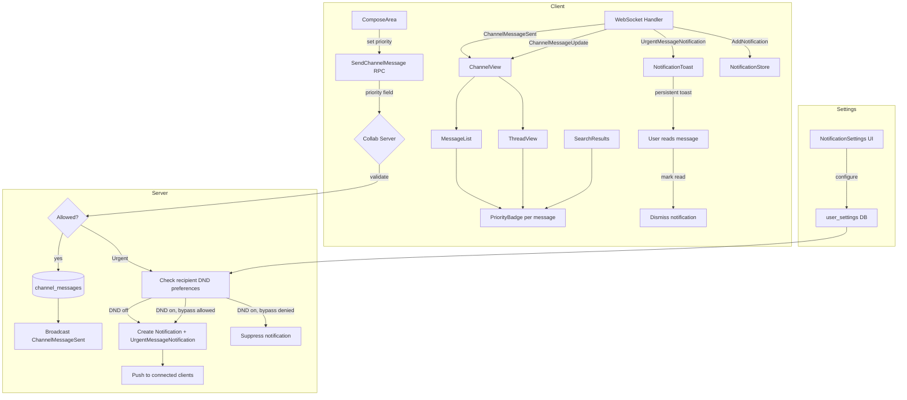

# Design: Message Priorities

## 1. Overview

Channel messages in Baymax currently have no urgency indicators. This design adds message priorities — a flag on channel messages indicating whether they are Normal, Important, or Urgent. Important messages receive a yellow/amber visual indicator. Urgent messages receive a red visual indicator and trigger special notification handling (persistent, dismissible notifications that respect DND configuration).

**Key decisions:**

- **Proto changes**: Add a `priority` enum field to `SendChannelMessage` (input) and `ChannelMessage` (output). Add `ChannelMessagePriority` enum (`Normal=0`, `Important=1`, `Urgent=2`). New `UrgentMessageNotification` push message for server-triggered persistent notifications.
- **Database**: No new table — priority is stored as a smallint column (`priority`) on `channel_messages`.
- **Priority is set at send time**: Once sent, priority is immutable (like the message body after send). Editing a message preserves the original priority.
- **Notifications flow through existing infrastructure**: Urgent messages add a `Notification` entry in the server's `notifications` table, which is pushed to clients via the existing `AddNotification` proto message. A new push message `UrgentMessageNotification` carries the channel context needed for in-app toast behavior.
- **DND integration**: The server checks the recipient's DND preference before delivering urgent notifications. The preference is stored as a user-level setting (new `notification_preferences` or extended `user_settings`), defaulting to "respect DND" (i.e., urgent notifications are suppressed when DND is on).
- **Visual indicators use GPUI styled elements**: A priority badge rendered as a colored icon + optional label before the message timestamp. Themed via the existing color scheme downstream of the theme (e.g., `.text_color(gpui::amber())` and `.text_color(gpui::red())`).

## 2. Architecture



### Components

| Component | Responsibility |
|---|---|
| `ComposeArea` | Priority selector (dropdown/button group) in the message compose area |
| `PriorityBadge` | Renders colored indicator icon/badge on messages in channel, threads, and search |
| `UrgentNotificationToast` | Persistent in-app toast for urgent messages; links to the channel/message |
| `NotificationStore` | Existing store; receives urgent notifications as `AddNotification` events |
| `MessageStore` / `ChannelStore` | Stores messages with priority; supplies priority data to renderers |
| `NotificationSettings` | UI for configuring urgent message behavior w.r.t. DND |

## 3. Components and Interfaces

### 3.1 Protobuf Changes

```protobuf
// New enum for message priority levels
enum ChannelMessagePriority {
    Normal = 0;
    Important = 1;
    Urgent = 2;
}

// Extended: add priority to outbound message
message SendChannelMessage {
    uint64 channel_id = 1;
    string body = 2;
    Nonce nonce = 3;
    repeated ChatMention mentions = 4;
    optional uint64 reply_to_message_id = 5;
    ChannelMessagePriority priority = 6;  // defaults to Normal
}

// Extended: add priority to the persisted message model
message ChannelMessage {
    uint64 id = 1;
    string body = 2;
    uint64 timestamp = 3;
    uint64 sender_id = 4;
    Nonce nonce = 5;
    repeated ChatMention mentions = 6;
    optional uint64 reply_to_message_id = 7;
    optional uint64 edited_at = 8;
    ChannelMessagePriority priority = 9;  // defaults to Normal
}

// Extended: add priority to UpdateChannelMessage (read-only, for consistency)
message UpdateChannelMessage {
    uint64 channel_id = 1;
    uint64 message_id = 2;
    Nonce nonce = 4;
    string body = 5;
    repeated ChatMention mentions = 6;
    // NOTE: priority is NOT editable — remains as originally set
}

// New push message: urgent message notification with channel context
message UrgentMessageNotification {
    uint64 channel_id = 1;
    uint64 message_id = 2;
    uint64 sender_id = 3;
    string message_preview = 4;  // first ~150 chars of body
}
```

### 3.2 Server-side: Message Priority Handling

```go
// Extension to existing ChannelMessagesStore
type ChannelMessagesStore struct {
    db *sqlx.DB
}

// Priority is set at insert time and is immutable.
func (s *ChannelMessagesStore) InsertMessage(ctx context.Context, params InsertMessageParams) (*ChannelMessage, error) {
    // ... existing logic ...
    // priority column defaults to 0 (Normal)
}
```

**Database migration**:

```sql
ALTER TABLE channel_messages
    ADD COLUMN priority SMALLINT NOT NULL DEFAULT 0;  -- 0=Normal, 1=Important, 2=Urgent

-- Optional: index for querying urgent messages by user (if needed for notification sweep)
CREATE INDEX idx_channel_messages_priority ON channel_messages(channel_id, priority);
```

**Urgent notification dispatch** (server, in the `SendChannelMessage` handler):

```go
func (s *Server) handleSendChannelMessage(ctx context.Context, msg *proto.SendChannelMessage, sender UserID) error {
    // 1. Validate and insert (existing flow, now with priority)
    channelMsg, err := s.store.InsertMessage(ctx, ...)
    
    // 2. Broadcast to channel (existing)
    s.broadcastToChannel(channelMsg.ChannelID, &proto.ChannelMessageSent{Message: channelMsg})
    
    // 3. If Urgent, push notifications
    if msg.Priority == proto.ChannelMessagePriority_Urgent {
        s.dispatchUrgentNotifications(ctx, channelMsg, sender)
    }
}

func (s *Server) dispatchUrgentNotifications(ctx context.Context, msg *ChannelMessage, sender UserID) error {
    members := s.store.GetChannelMembers(ctx, msg.ChannelID)
    for _, member := range members {
        if member.UserID == sender { continue }
        
        preferences := s.store.GetUserNotificationPreferences(ctx, member.UserID)
        
        // Check DND: skip if DND is active and user chose not to bypass
        if preferences.IsDND && !preferences.BypassDNDForUrgent {
            continue
        }
        
        // Create notification entry in DB
        notification := s.store.CreateNotification(ctx, &Notification{
            RecipientID: member.UserID,
            Kind:        "urgent_message",
            EntityID:    msg.ID,
            Content:     fmt.Sprintf("Urgent message from %s in #%s", sender.Name, msg.ChannelName),
        })
        
        // Push to connected clients
        s.pushToUser(member.UserID, &proto.AddNotification{Notification: notification})
        s.pushToUser(member.UserID, &proto.UrgentMessageNotification{
            ChannelID:      msg.ChannelID,
            MessageID:      msg.ID,
            SenderID:       uint64(sender),
            MessagePreview: truncate(msg.Body, 150),
        })
    }
}
```

### 3.3 PrioritySelector (Client — ComposeArea)

```rust
pub struct PrioritySelector {
    selected_priority: ChannelMessagePriority,
    expanded: bool,
}

impl PrioritySelector {
    /// Render a compact dropdown/button group below the message input area.
    pub fn render(&mut self, cx: &mut App) -> AnyElement {
        div()
            .flex()
            .gap(DynamicSpacing::Small.rems(cx))
            .child(self.priority_button(ChannelMessagePriority::Normal, cx))
            .child(self.priority_button(ChannelMessagePriority::Important, cx))
            .child(self.priority_button(ChannelMessagePriority::Urgent, cx))
    }

    fn priority_button(&self, priority: ChannelMessagePriority, cx: &App) -> Button {
        // Normal: no highlight
        // Important: amber/yellow outline
        // Urgent: red outline + icon
    }

    pub fn set_priority(&mut self, priority: ChannelMessagePriority) {
        self.selected_priority = priority;
    }

    pub fn selected_priority(&self) -> ChannelMessagePriority {
        self.selected_priority
    }
}

// Integration in compose area:
// ComposeArea holds a PrioritySelector and passes selected_priority
// into the SendChannelMessage RPC call.
```

### 3.4 PriorityBadge (Client — Message Display)

```rust
pub struct PriorityBadge {
    priority: ChannelMessagePriority,
}

impl PriorityBadge {
    /// Render the priority indicator icon/badge.
    pub fn render(&self, cx: &App) -> AnyElement {
        match self.priority {
            ChannelMessagePriority::Normal => div().into_any(),
            ChannelMessagePriority::Important => {
                div()
                    .flex()
                    .gap(DynamicSpacing::XXSmall.rems(cx))
                    .child(Icon::new(IconName::AlertTriangle))
                    .child(Label::new("Important"))
                    .text_color(cx.theme().colors().warning)  // amber/yellow
                    .into_any()
            }
            ChannelMessagePriority::Urgent => {
                div()
                    .flex()
                    .gap(DynamicSpacing::XXSmall.rems(cx))
                    .child(Icon::new(IconName::AlertOctagon))
                    .child(Label::new("Urgent"))
                    .text_color(cx.theme().colors().error)  // red
                    .into_any()
            }
        }
    }
}

/// Integration point: In ChannelView::render_message, thread reply render,
/// and search result item, call PriorityBadge::render before the timestamp.
```

**Visual mockup (main channel):**

```
┌──────────────────────────────────────────────┐
│ [Avatar] username  ⚠ Important  2:45 PM      │
│ This is an important announcement.            │
│ ──────────────────────────────────────────── │
│ [Avatar] username  🛑 Urgent    2:46 PM      │
│ Server is down!                               │
└──────────────────────────────────────────────┘
```

**Thread reply indicator (thread summary):**

```
┌──────────────────────────────────────────────┐
│ Thread: 3 replies  ⚠ Important               │
│ Last reply by user_b                          │
└──────────────────────────────────────────────┘
```

### 3.5 UrgentNotificationToast (Client — In-App Notification)

```rust
pub struct UrgentNotificationToast {
    channel_id: ChannelId,
    message_id: u64,
    sender_name: SharedString,
    preview: SharedString,
}

impl UrgentNotificationToast {
    /// Render a persistent toast at the top of the workspace.
    /// Stays visible until the user clicks (navigates to message) or dismisses.
    pub fn render(&self, window: &mut Window, cx: &mut App) -> AnyElement {
        div()
            .rounded_md()
            .bg(cx.theme().colors().error_background)
            .p(DynamicSpacing::Small.rems(cx))
            .child(
                h_flex()
                    .gap(DynamicSpacing::Default.rems(cx))
                    .child(Icon::new(IconName::AlertOctagon).color(Color::Error))
                    .child(Label::new(format!("Urgent from {}", self.sender_name)))
                    .child(Label::new(self.preview.clone()).text_ellipsis())
                    .child(
                        Button::new("dismiss", "Dismiss")
                            .on_click(cx.listener(move |_, _, window, cx| {
                                // Mark notification read, dismiss toast
                            }))
                    )
            )
    }
}
```

**Integration**: The `CollabPanel` or `Workspace` subscribes to `UrgentMessageNotification` (new handler via `client.add_message_handler`). When received, it creates and displays the `UrgentNotificationToast` as a persistent element. The toast is dismissed when the user navigates to the channel/message or clicks "Dismiss".

### 3.6 NotificationSettings (Client — Preferences UI)

```rust
// New section in the settings UI for notification preferences
pub struct UrgentNotificationSettings {
    /// When DND is enabled, should urgent messages still notify?
    bypass_dnd_for_urgent: bool,
}

impl UrgentNotificationSettings {
    pub fn render(&self, cx: &mut App) -> AnyElement {
        div()
            .child(Label::new("Urgent Messages"))
            .child(
                // Toggle: "Allow urgent notifications when Do Not Disturb is on"
                Toggle::new(
                    "bypass_dnd",
                    "Allow urgent notifications during Do Not Disturb",
                )
                .toggle_state(self.bypass_dnd_for_urgent)
                .on_click(cx.listener(|this, _, window, cx| {
                    this.bypass_dnd_for_urgent = !this.bypass_dnd_for_urgent;
                    // persist to user settings
                }))
            )
    }
}
```

**Settings integration**: This lives under a new `notifications` section in `settings.json`:

```json
{
  "notifications": {
    "urgent_messages": {
      "bypass_dnd": true
    }
  }
}
```

This maps to a new settings struct:

```rust
#[derive(Deserialize, Clone)]
pub struct NotificationSettingsContent {
    pub urgent_messages: Option<UrgentMessageSettingsContent>,
}

#[derive(Deserialize, Clone)]
pub struct UrgentMessageSettingsContent {
    pub bypass_dnd: Option<bool>,
}
```

### 3.7 Thread reply priority

Thread replies (`reply_to_message_id` is set) follow the same priority rules as top-level messages:

- **Send**: The `SendChannelMessage.priority` field is honored for replies.
- **Display**: The `PriorityBadge` renders on the reply in the thread view.
- **Notifications**: Urgent replies trigger the same `UrgentMessageNotification` flow.
- **Thread summary**: When displaying a thread summary (reply count badge in the main channel), the root message's priority is shown as an indicator next to the reply count.

## 4. Data Models

### 4.1 Server-side (database)

```
channel_messages
├── id            BIGINT  (PK)
├── channel_id    BIGINT  (FK → channels)
├── sender_id     BIGINT
├── body          TEXT
├── timestamp     BIGINT
├── nonce         VARCHAR
├── reply_to_message_id  BIGINT?  (FK → channel_messages)
├── edited_at     BIGINT?
├── priority      SMALLINT  ← NEW (0=Normal, 1=Important, 2=Urgent)
```

```
notifications
├── id            BIGINT  (PK)  — existing table
├── recipient_id  BIGINT
├── kind          VARCHAR  ← new kind: "urgent_message"
├── entity_id     BIGINT?  ← the channel_message.id
├── content       TEXT
├── is_read       BOOL
└── ... (existing fields)
```

### 4.2 Client-side (Rust types)

```rust
/// Mirrors proto ChannelMessagePriority
#[derive(Clone, Copy, Debug, PartialEq, Eq, PartialOrd, Ord)]
pub enum MessagePriority {
    Normal,
    Important,
    Urgent,
}

impl MessagePriority {
    pub fn color(&self, cx: &App) -> Option<gpui::Hsla> {
        match self {
            MessagePriority::Normal => None,
            MessagePriority::Important => Some(cx.theme().colors().warning),
            MessagePriority::Urgent => Some(cx.theme().colors().error),
        }
    }

    pub fn icon(&self) -> Option<IconName> {
        match self {
            MessagePriority::Normal => None,
            MessagePriority::Important => Some(IconName::AlertTriangle),
            MessagePriority::Urgent => Some(IconName::AlertOctagon),
        }
    }

    pub fn label(&self) -> Option<&'static str> {
        match self {
            MessagePriority::Normal => None,
            MessagePriority::Important => Some("Important"),
            MessagePriority::Urgent => Some("Urgent"),
        }
    }
}

// Extended client-side message model
pub struct ChannelMessage {
    pub id: u64,
    pub body: SharedString,
    pub timestamp: DateTime<Utc>,
    pub sender_id: u64,
    pub nonce: Option<String>,
    pub reply_to_message_id: Option<u64>,
    pub edited_at: Option<DateTime<Utc>>,
    pub priority: MessagePriority,  // NEW
}
```

## 5. Correctness Properties

### Property 5.1: Priority immutability

_For any_ sent `ChannelMessage` with a non-default priority, calling `UpdateChannelMessage` SHALL NOT change the `priority` field. Priority is fixed at creation time.

**Validates: Requirement 12.1**

### Property 5.2: Priority display consistency

_For any_ `ChannelMessage` with priority set to `Important` or `Urgent`, the `PriorityBadge` SHALL be rendered in the main channel view, thread replies, search results, and thread summaries.

**Validates: Requirements 12.3, 12.4**

### Property 5.3: Urgent notification delivery

_For any_ `SendChannelMessage` with `priority = Urgent`, the server SHALL create a notification entry and push `AddNotification` + `UrgentMessageNotification` to all connected channel members (excluding the sender), subject to each recipient's DND preference.

**Validates: Requirements 12.2.1, 12.2.2**

### Property 5.4: DND respect for urgent

_For any_ recipient with DND mode enabled, an urgent message SHALL only trigger a notification if the recipient's `bypass_dnd_for_urgent` preference is `true`. If the preference is `false`, the notification SHALL be suppressed.

**Validates: Requirement 12.2.2**

### Property 5.5: Urgent notification dismissal on read

_For any_ recipient who navigates to the channel containing an unread urgent message (via clicking the toast or directly), the corresponding persistent notification SHALL be dismissed.

**Validates: Requirement 12.2.3**

### Property 5.6: Thread reply priority handling

_For any_ thread reply (`SendChannelMessage` with `reply_to_message_id` set) with `priority = Urgent`, the server SHALL dispatch urgent notifications identically to top-level urgent messages.

**Validates: Requirement 12.4.3**

### Property 5.7: Priority preservation in thread summary

_For any_ thread whose root message has a non-default priority, the thread summary/reply count badge in the main channel SHALL display the root message's priority indicator.

**Validates: Requirement 12.4.2**

## 6. Error Handling

| Error | Handling |
|---|---|
| Invalid priority value in proto | Reject on server with `INVALID_ARGUMENT`; client validates before sending |
| Network failure on send with priority | Retry with exponential backoff (same as existing send flow). Dedup via `nonce`. Priority is preserved in the retry. |
| DND preference lookup failure | Log warning; default to suppressing notification (fail-safe) |
| Urgent message to a channel the user left | No-op (user is no longer a channel member; notification dispatch checks membership) |
| Toast dismissal race (user reads message milliseconds before toast arrives) | Idempotent — navigating to an already-read message is a no-op; toast dismisses gracefully |
| Server fails to create notification row | Log error; still deliver the in-app `UrgentMessageNotification` push (best-effort) |
| Priority field not set (backward compat) | Treat as `Normal` (0). Old clients sending without priority work unchanged. |

## 7. Testing Strategy

- **Unit tests (server)**: Validate that priority is stored and immutable on edit. Validate DND preference lookup and suppression logic.
- **Unit tests (client)**: `PriorityBadge` rendering for each priority level. `PrioritySelector` state transitions. Message model deserialization of priority from proto.
- **Integration tests**: Full send flow with each priority level → verify `ChannelMessageSent` contains priority → verify `UrgentMessageNotification` is pushed for urgent. Verify old clients (without priority field) send messages that are interpreted as `Normal`.
- **Integration tests (notification)**: Create DND-enabled user, send urgent message → verify no notification. Enable `bypass_dnd_for_urgent` → verify notification arrives.
- **UI tests**: `PriorityBadge` color and icon correctness in channel view, thread view, and search results. Toast rendering and dismiss behavior.
- **Concurrency tests**: Two urgent messages sent simultaneously; verify both notifications are delivered independently. Verify no duplicate notifications for same urgent message.
