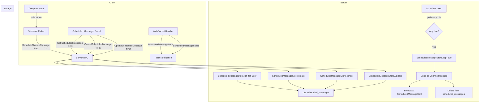
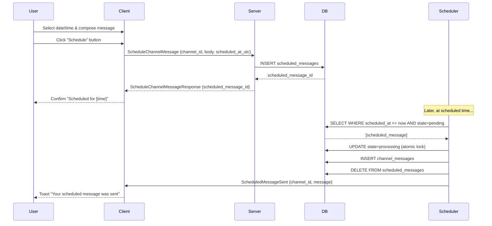

# Design: Scheduled Messages

## 1. Overview

Baymax channel messages are sent immediately upon composition. This design adds the ability to compose a message now and schedule it for future delivery (1 minute to 30 days ahead). Scheduled messages are persisted server-side, delivered by a background executor loop, and surfaced in a dedicated management view on the client.

**Key decisions:**

- **Proto changes**: New `ScheduleChannelMessage` RPC request, `CancelScheduledMessage`, `GetScheduledMessages`, and `UpdateScheduledMessage`. New push message `ScheduledMessageSent` for user notification. `ChannelMessage` proto gains an optional `scheduled_at` field.
- **Database**: New `scheduled_messages` table keyed by a `ScheduledMessageId`.
- **Delivery mechanism**: A lightweight server-side tokio loop spawned on `Server::start()` that polls for due messages every ~10 seconds, sends them, and broadcasts `ScheduledMessageSent` to the sender.
- **No real-time push on schedule creation**: Scheduling itself only requires an RPC response; delivery is async.
- **Timezones are client-side only**: All schedule times stored in UTC on the server. The client converts to/from the user's local timezone for display and input.
- **Permission model**: The same as sending a regular message — any channel member with the appropriate role can schedule.

### Why a polling loop instead of a job queue

The `collab` crate does not have a dedicated background job system (no `jobs/` directory). The existing patterns for async background work are `executor.spawn_detached` and `executor.sleep`. A polling loop is the simplest addition consistent with the existing architecture. If throughput grows, this can be replaced with a more sophisticated scheduler or job queue without changing the database or client protocols.

## 2. Architecture



### Components

| Component | Responsibility |
|---|---|
| `SchedulePicker` | Calendar/time picker widget in the compose area |
| `ScheduledMessageStore` (server) | CRUD for scheduled messages; due-message pop |
| `SchedulerLoop` (server) | Background async loop that delivers due messages |
| `ScheduledMessagesPanel` | Client-side list view for managing pending schedules |
| `ScheduledMessageSent` / `ScheduledMessageFailed` | Push messages to notify the sender |

### Flow: Scheduling a message



### Flow: Cancelling a scheduled message

```mermaid
sequenceDiagram
    participant User
    participant Client
    participant Server
    participant DB

    User->>Client: Open Scheduled Messages panel
    Client->>Server: GetScheduledMessages {}
    Server->>DB: SELECT WHERE sender_id=user_id ORDER BY scheduled_at
    DB-->>Server: [scheduled_messages]
    Server-->>Client: GetScheduledMessagesResponse {messages}
    Client-->>User: Show list of pending schedules
    
    User->>Client: Click "Cancel" on one
    Client->>Server: CancelScheduledMessage {scheduled_message_id}
    Server->>DB: DELETE WHERE id=X AND sender_id=user_id
    DB-->>Server: success
    Server-->>Client: Ack
    Client-->>User: Remove from list; toast "Scheduled message cancelled"
```

## 3. Components and Interfaces

### 3.1 Protobuf Changes

Add to `channel.proto`:

```protobuf
// ---- Schedule Messages ----

message ScheduleChannelMessage {
    uint64 channel_id = 1;
    string body = 2;
    uint64 scheduled_at = 3;   // UTC Unix timestamp (milliseconds)
    Nonce nonce = 4;
    repeated ChatMention mentions = 5;
}

message ScheduleChannelMessageResponse {
    uint64 scheduled_message_id = 1;
}

message CancelScheduledMessage {
    uint64 scheduled_message_id = 1;
    uint64 channel_id = 2;
}

message UpdateScheduledMessage {
    uint64 scheduled_message_id = 1;
    uint64 channel_id = 2;
    optional string body = 3;
    optional uint64 scheduled_at = 4;   // UTC Unix timestamp (milliseconds)
    repeated ChatMention mentions = 5;
}

message GetScheduledMessages {
    uint64 channel_id = 1;
}

message GetScheduledMessagesResponse {
    repeated ScheduledMessage messages = 1;
}

message ScheduledMessage {
    uint64 id = 1;
    uint64 channel_id = 2;
    string body = 3;
    uint64 sender_id = 4;
    uint64 scheduled_at = 5;   // UTC Unix timestamp (milliseconds)
    uint64 created_at = 6;     // UTC Unix timestamp (milliseconds)
    Nonce nonce = 7;
    repeated ChatMention mentions = 8;
}

message ScheduledMessageSent {
    uint64 channel_id = 1;
    ChannelMessage message = 2;
}

message ScheduledMessageFailed {
    uint64 scheduled_message_id = 1;
    uint64 channel_id = 2;
    string reason = 3;
}
```

Register the new messages in `proto.rs`:

```rust
// In the messages! macro call, add:
(ScheduleChannelMessage, Background),
(ScheduleChannelMessageResponse, Background),
(CancelScheduledMessage, Background),
(UpdateScheduledMessage, Background),
(GetScheduledMessages, Background),
(GetScheduledMessagesResponse, Background),
(ScheduledMessageSent, Foreground),
(ScheduledMessageFailed, Foreground),
```

And in the entity_messages section:

```rust
entity_messages!(
    {channel_id, Channel},
    ChannelMessageSent,
    ChannelMessageUpdate,
    RemoveChannelMessage,
    UpdateChannelMessage,
    UpdateChannelBuffer,
    UpdateChannelBufferCollaborators,
    ScheduledMessageSent,    // add
    ScheduledMessageFailed,  // add
);
```

### 3.2 ScheduledMessageStore (Server)

```rust
pub struct ScheduledMessageStore {
    db: Arc<Database>,
}

impl ScheduledMessageStore {
    /// Create a new scheduled message. Validates that the sender is a channel member.
    pub async fn create(
        &self,
        channel_id: ChannelId,
        sender_id: UserId,
        body: &str,
        scheduled_at: DateTime<Utc>,
        nonce: Nonce,
        mentions: Vec<ChatMention>,
    ) -> Result<ScheduledMessageId>;

    /// Cancel a pending scheduled message. Only the sender may cancel.
    /// Returns the deleted message's data for logging.
    pub async fn cancel(
        &self,
        scheduled_message_id: ScheduledMessageId,
        sender_id: UserId,
    ) -> Result<Option<ScheduledMessage>>;

    /// Update the body and/or scheduled time of a pending message.
    pub async fn update(
        &self,
        scheduled_message_id: ScheduledMessageId,
        sender_id: UserId,
        body: Option<&str>,
        scheduled_at: Option<DateTime<Utc>>,
        mentions: Option<Vec<ChatMention>>,
    ) -> Result<()>;

    /// List all pending scheduled messages for a user in a channel,
    /// ordered by scheduled_at ascending.
    pub async fn list_for_user(
        &self,
        user_id: UserId,
        channel_id: ChannelId,
    ) -> Result<Vec<ScheduledMessage>>;

    /// Atomically pop due messages: SELECT ... WHERE scheduled_at <= now
    /// AND state = 'pending', then UPDATE state = 'processing'.
    /// Returns the messages that the caller should deliver.
    pub async fn pop_due(&self) -> Result<Vec<ScheduledMessage>>;

    /// Delete a scheduled message after successful delivery.
    pub async fn delete_delivered(&self, id: ScheduledMessageId) -> Result<()>;

    /// Count pending messages for a user across all channels.
    /// Used for the sidebar badge indicator.
    pub async fn count_pending_for_user(&self, user_id: UserId) -> Result<usize>;
}
```

**Database table**:

```sql
CREATE TABLE scheduled_messages (
    id BIGSERIAL PRIMARY KEY,
    channel_id BIGINT NOT NULL REFERENCES channels(id) ON DELETE CASCADE,
    sender_id BIGINT NOT NULL,
    body TEXT NOT NULL,
    scheduled_at TIMESTAMP NOT NULL,
    created_at TIMESTAMP NOT NULL DEFAULT NOW(),
    state SMALLINT NOT NULL DEFAULT 0,  -- 0=pending, 1=processing, 2=sent, 3=failed
    nonce VARCHAR(255),
    mentions JSONB,
    -- populated when the message is actually sent
    delivered_message_id BIGINT REFERENCES channel_messages(id) ON DELETE SET NULL,
    failure_reason TEXT,
    updated_at TIMESTAMP NOT NULL DEFAULT NOW()
);

CREATE INDEX idx_scheduled_messages_due ON scheduled_messages (state, scheduled_at)
    WHERE state = 0;
CREATE INDEX idx_scheduled_messages_sender ON scheduled_messages (sender_id, channel_id)
    WHERE state = 0;
```

### 3.3 Scheduler Loop (Server)

The scheduler loop runs as a detached async task spawned during `Server::start()`:

```rust
// In Server::start(), add:
let scheduled_message_store = ScheduledMessageStore::new(app_state.db.clone());
let executor = self.app_state.executor.clone();
let peer = self.peer.clone();
let pool = self.connection_pool.clone();

executor.spawn_detached(async move {
    let mut interval = tokio::time::interval(Duration::from_secs(10));
    loop {
        interval.tick().await;
        let due_messages = match scheduled_message_store.pop_due().await {
            Ok(messages) => messages,
            Err(error) => {
                tracing::error!(?error, "failed to pop due scheduled messages");
                continue;
            }
        };

        for scheduled in due_messages {
            deliver_scheduled_message(
                &scheduled_message_store,
                &peer,
                &pool,
                scheduled,
            )
            .await
            .trace_err();
        }
    }
});
```

Delivery function:

```rust
async fn deliver_scheduled_message(
    store: &ScheduledMessageStore,
    peer: &Peer,
    pool: &parking_lot::Mutex<ConnectionPool>,
    scheduled: ScheduledMessage,
) -> Result<()> {
    // 1. Verify the sender still has access to the channel
    //    (if not, mark as failed and notify sender)
    let membership = db.check_channel_membership(
        scheduled.channel_id,
        scheduled.sender_id,
    ).await;

    let Ok(Some(role)) = membership else {
        store.mark_failed(scheduled.id, "no longer a channel member").await?;
        notify_sender(peer, pool, scheduled.sender_id,
            ScheduledMessageFailed { ... });
        return Ok(());
    };

    if !role.can_send_message() {
        store.mark_failed(scheduled.id, "insufficient permissions").await?;
        notify_sender(peer, pool, scheduled.sender_id,
            ScheduledMessageFailed { ... });
        return Ok(());
    }

    // 2. Send the message — inject it into the channel
    let message = db.insert_channel_message(
        scheduled.channel_id,
        scheduled.sender_id,
        &scheduled.body,
        &scheduled.mentions,
    ).await?;

    // 3. Broadcast to channel members
    let channel_message = proto::ChannelMessage {
        id: message.id.to_proto(),
        body: scheduled.body.clone(),
        sender_id: scheduled.sender_id.to_proto(),
        timestamp: message.timestamp.timestamp_millis() as u64,
        nonce: scheduled.nonce.map(|n| proto::Nonce { ... }),
        mentions: scheduled.mentions,
        scheduled_at: Some(scheduled.scheduled_at.timestamp_millis() as u64),
        ..Default::default()
    };

    let pool = pool.lock();
    for (conn_id, _role) in pool.channel_connection_ids(channel_root_id) {
        peer.send(conn_id, proto::ChannelMessageSent {
            channel_id: scheduled.channel_id.to_proto(),
            message: Some(channel_message.clone()),
        }).trace_err();
    }

    // 4. Notify the sender specifically
    peer.send(
        sender_conn_id,
        proto::ScheduledMessageSent {
            channel_id: scheduled.channel_id.to_proto(),
            message: Some(channel_message),
        },
    ).trace_err();

    // 5. Clean up
    store.delete_delivered(scheduled.id).await?;

    Ok(())
}

fn notify_sender(
    peer: &Peer,
    pool: &parking_lot::Mutex<ConnectionPool>,
    sender_id: UserId,
    message: impl EnvelopedMessage,
) {
    let pool = pool.lock();
    for conn_id in pool.user_connection_ids(sender_id) {
        peer.send(conn_id, message.clone()).trace_err();
    }
}
```

### 3.4 Server RPC Handler Registration

In `Server::new()`, add handlers:

```rust
.add_request_handler(schedule_channel_message)
.add_request_handler(cancel_scheduled_message)
.add_request_handler(update_scheduled_message)
.add_request_handler(get_scheduled_messages)
```

Handler for `schedule_channel_message`:

```rust
async fn schedule_channel_message(
    request: proto::ScheduleChannelMessage,
    response: Response<proto::ScheduleChannelMessage>,
    session: MessageContext,
) -> Result<()> {
    let channel_id = ChannelId::from_proto(request.channel_id);
    let sender_id = session.user_id();

    // Validate the scheduled time (1 min to 30 days ahead)
    let now = Utc::now();
    let scheduled_at = DateTime::from_timestamp_millis(request.scheduled_at as i64)
        .context("invalid timestamp")?;
    let min_time = now + Duration::minutes(1);
    let max_time = now + Duration::days(30);

    if scheduled_at < min_time {
        return Err(anyhow!("schedule time must be at least 1 minute in the future"))?;
    }
    if scheduled_at > max_time {
        return Err(anyhow!("schedule time must be within 30 days"))?;
    }

    // Validate channel membership and permission
    let db = session.db().await;
    db.check_user_can_send_message(channel_id, sender_id).await?;

    // Create the scheduled message
    let store = ScheduledMessageStore::new(db.deref().clone());
    let id = store.create(
        channel_id,
        sender_id,
        &request.body,
        scheduled_at,
        request.nonce.map(|n| Nonce { ... }),
        request.mentions,
    ).await?;

    response.send(proto::ScheduleChannelMessageResponse {
        scheduled_message_id: id.to_proto(),
    })?;
    Ok(())
}
```

### 3.5 Client: SchedulePicker

```rust
pub struct SchedulePicker {
    selected_date: Option<NaiveDate>,
    selected_time: Option<NaiveTime>,
    scheduled_at: Option<DateTime<FixedOffset>>,  // user's local time
    timezone: chrono_tz::Tz,
    popover_visible: bool,
}

impl SchedulePicker {
    /// Returns None if no time is selected, or the UTC timestamp.
    pub fn scheduled_at_utc(&self) -> Option<DateTime<Utc>>;

    /// Renders the button + popover.
    pub fn render(&mut self, window: &mut Window, cx: &mut App) -> AnyElement;

    /// Renders the calendar grid.
    fn render_calendar(&mut self, cx: &mut App) -> AnyElement;

    /// Renders time slots (hour:minute picker).
    fn render_time_picker(&mut self, cx: &mut App) -> AnyElement;

    /// Validates that the selected time is at least 1 minute ahead.
    fn validate(&self) -> Result<(), ScheduleError>;
}
```

The `SchedulePicker` renders as a small dropdown button next to the send button. When clicked, it shows a popover with:

```
┌───────── Schedule ─────────┐
│  [Calendar Grid]            │
│   Mo Tu We Th Fr Sa Su      │
│         1  2  3  4  5  6    │
│   7  8  9 10 11 12 13 14   │
│  ...                        │
│                             │
│  Time: [ 14 ] : [ 30 ]     │
│  ┌──────────────────────┐   │
│  │  Schedule for later  │   │
│  └──────────────────────┘   │
└─────────────────────────────┘
```

When a time is selected, the send button changes to show "Schedule" with a clock icon and the selected time. The button label changes from "Send" to "Schedule (tomorrow 14:30)".

### 3.6 Client: ScheduledMessagesPanel

```rust
pub struct ScheduledMessagesPanel {
    channel_id: ChannelId,
    messages: Vec<ScheduledMessage>,
    loading: bool,
    editing_message_id: Option<ScheduledMessageId>,
    edit_body: SharedString,
    edit_scheduled_at: Option<DateTime<FixedOffset>>,
}

impl ScheduledMessagesPanel {
    /// Fetches pending scheduled messages for the current channel.
    pub fn refresh(&mut self, cx: &mut App) -> Task<()>;

    /// Renders the panel as a list.
    pub fn render(&mut self, window: &mut Window, cx: &mut App) -> AnyElement;

    /// Opens the edit dialog for a scheduled message.
    fn start_edit(&mut self, id: ScheduledMessageId);

    /// Saves edits to an existing scheduled message.
    fn save_edit(&mut self, window: &mut Window, cx: &mut App);

    /// Cancels (deletes) a scheduled message.
    fn confirm_cancel(&mut self, id: ScheduledMessageId, cx: &mut App);

    /// Called when ScheduledMessageSent arrives; removes from list.
    fn on_message_sent(&mut self, id: ScheduledMessageId);
}
```

The panel is accessible from a "Scheduled" entry in the channel sidebar or from a button in the channel header area. It renders as a sliding panel or modal:

```
┌── Scheduled Messages ──┐
│                         │
│  Tomorrow 14:30         │
│  "Don't forget to ..."  │
│  [Edit] [Cancel]        │
│                         │
│  Jun 28, 09:00          │
│  "Meeting notes: ..."   │
│  [Edit] [Cancel]        │
│                         │
│  [+ New Schedule]        │
└─────────────────────────┘
```

### 3.7 Client: Sidebar Badge

The channel sidebar shows a small badge (e.g., clock icon + count) when the user has pending scheduled messages. This is computed from the `GetScheduledMessagesResponse` and maintained locally as a `usize` counter. The badge appears next to the "Scheduled" entry in the navigation.

## 4. Data Models

### 4.1 Server-side (database)

```
scheduled_messages
├── id                   BIGSERIAL PRIMARY KEY
├── channel_id           BIGINT NOT NULL (FK → channels.id ON DELETE CASCADE)
├── sender_id            BIGINT NOT NULL
├── body                 TEXT NOT NULL
├── scheduled_at         TIMESTAMP NOT NULL          (UTC)
├── created_at           TIMESTAMP NOT NULL DEFAULT NOW()
├── state                SMALLINT NOT NULL DEFAULT 0 (0=pending, 1=processing, 2=sent, 3=failed)
├── nonce                VARCHAR(255) NULLABLE
├── mentions             JSONB NULLABLE
├── delivered_message_id BIGINT NULLABLE (FK → channel_messages.id ON DELETE SET NULL)
├── failure_reason       TEXT NULLABLE
├── updated_at           TIMESTAMP NOT NULL DEFAULT NOW()

Index: (state, scheduled_at) WHERE state = 0
Index: (sender_id, channel_id) WHERE state = 0
```

### 4.2 Client-side (Rust model)

```rust
#[derive(Clone, Debug)]
pub struct ScheduledMessage {
    pub id: ScheduledMessageId,
    pub channel_id: ChannelId,
    pub sender_id: UserId,
    pub body: SharedString,
    pub scheduled_at: DateTime<Utc>,
    pub created_at: DateTime<Utc>,
    pub mentions: Vec<ChatMention>,

    /// Computed on client: display time in the user's timezone.
    pub display_time: DateTime<FixedOffset>,
}

#[derive(Clone, Debug, PartialEq, Eq, Hash)]
pub struct ScheduledMessageId(pub u64);
```

### 4.3 ChannelMessage extension

Add to the existing `ChannelMessage` proto:

```protobuf
message ChannelMessage {
    uint64 id = 1;
    string body = 2;
    uint64 timestamp = 3;
    uint64 sender_id = 4;
    Nonce nonce = 5;
    repeated ChatMention mentions = 6;
    optional uint64 reply_to_message_id = 7;
    optional uint64 edited_at = 8;

    // NEW: Populated when this message was delivered via a schedule.
    optional uint64 scheduled_at = 9;  // UTC Unix timestamp (milliseconds)
}
```

The `scheduled_at` field allows the client to display a "Scheduled" label on messages that were delivered via scheduling, distinguishing them from immediately-sent messages.

## 5. Correctness Properties

### Property 5.1: Schedule time bounds

_For any_ `ScheduleChannelMessage` request with `scheduled_at` less than 1 minute in the future or more than 30 days in the future, the server SHALL reject the request with a descriptive error.

**Validates: Requirement 11.1.3**

### Property 5.2: At-most-once delivery

_For any_ scheduled message that becomes due, the system SHALL deliver it to the channel at most once. The `state` transition (pending → processing → deletion) uses atomic `UPDATE ... WHERE state = pending` to prevent duplicate delivery.

**Validates: Requirement 11.1.4**

### Property 5.3: Sender-only cancel

_For any_ `CancelScheduledMessage` request, the server SHALL verify the requesting user's id matches `sender_id` on the scheduled message. If not, the request SHALL be rejected.

**Validates: Requirement 11.2.3**

### Property 5.4: Delivery permission re-validation

_For any_ delivered scheduled message, the server SHALL re-validate the sender's channel membership and role at delivery time. If the sender no longer has permission to post, the message SHALL NOT be delivered and the sender SHALL be notified.

**Validates: Requirement 11.3.2**

### Property 5.5: UTC storage

_For any_ scheduled message, the `scheduled_at` column in the database SHALL store the time in UTC. The client SHALL convert the user's local time to UTC before sending and convert UTC back to local time for display.

**Validates: Requirements 11.4.1, 11.4.2, 11.4.3**

### Property 5.6: Nonce uniqueness

_For any_ `ScheduleChannelMessage` request with a `nonce` that was already used by the same sender in the same channel, the server SHALL return the existing `scheduled_message_id` instead of creating a duplicate.

**Validates: Requirement 11.1.2** (prevent duplicate scheduling on retry)

### Property 5.7: Cascade delete on channel removal

_For any_ deleted channel, all scheduled messages in that channel SHALL be deleted (via `ON DELETE CASCADE`).

**Validates: Requirement 11.1.5**

### Property 5.8: Edit consistency

_For any_ `UpdateScheduledMessage` request, the server SHALL reject the request if the scheduled message's `state` is not `pending`. Edited timestamps SHALL be re-validated against the same 1-minute/30-day bounds as new schedules.

**Validates: Requirement 11.2.2**

## 6. Error Handling

| Error | Handling |
|---|---|
| Schedule time too soon / too far | Client-side validation before sending; server-side re-validation with descriptive error returned to the RPC response |
| Sender removed from channel before delivery | Scheduler marks message as `failed`, notifies sender via `ScheduledMessageFailed` push; client shows toast "Scheduled message failed — you no longer have access to that channel" |
| Sender's role changed (no longer can post) | Same as above; failure reason: "Insufficient permissions to post in this channel" |
| Channel deleted before delivery | `ON DELETE CASCADE` removes the scheduled message; sender is NOT notified (channel no longer exists) |
| Server restart / crash | Pending messages with `state = processing` are stale. Scheduler loop on restart re-processes them: it first resets any `processing` messages back to `pending` (with a grace period check) before polling for due messages |
| Database error on pop_due | Logged and retried on next scheduler tick (10s interval) |
| Network error on push notification to sender | Logged; message is already delivered; no user-visible consequence beyond the notification |
| Concurrent cancel + delivery race | The atomic `UPDATE ... WHERE state = pending` ensures only one wins. If cancel runs first, delivery finds no pending rows and does nothing. If delivery runs first, cancel finds no rows and returns success (idempotent) |
| Client re-sends ScheduleChannelMessage with same nonce | Server returns existing scheduled_message_id (idempotent via unique index on `(channel_id, sender_id, nonce)`) |
| Edit after delivery | Rejected with "scheduled message already delivered" |
| Nonce extraction from request | If `nonce` is not provided (e.g., legacy client), fall back to generating one server-side; log a warning |

## 7. Testing Strategy

### Unit tests

- `ScheduledMessageStore::create` — validates time bounds, nonce deduplication, creates row
- `ScheduledMessageStore::cancel` — sender-only check, idempotent cancel of already-sent message
- `ScheduledMessageStore::update` — reject updates on non-pending messages, field coalescing
- `ScheduledMessageStore::pop_due` — atomic state transition, ordering by `scheduled_at`, no double-pop
- `ScheduledMessageStore::count_pending_for_user` — correct count across channels
- `SchedulePicker::validate` — boundary conditions (59 seconds vs 61 seconds; 29 days vs 31 days)

### Integration tests

- Schedule → confirm row exists in DB → fast-forward time → confirm message appears in channel → confirm row deleted
- Schedule → cancel → confirm row deleted and message never appears
- Schedule → sender loses channel access → confirm message marked failed and `ScheduledMessageFailed` sent
- Multiple due messages at the same timestamp → confirm all delivered in order within a single tick
- Server restart scenario: seed `processing` state rows → restart → confirm they're reset to `pending` and re-delivered

### UI tests

- `SchedulePicker` rendering: calendar grid, time picker, validation error display
- `ScheduledMessagesPanel` rendering: list with empty state, list with items, edit dialog, cancel confirmation
- Send button label change: "Send" → "Schedule (tomorrow 14:30)" when time selected
- Sidebar badge display: badge count matches pending messages
- Timezone conversion: verify client stores UTC but displays local time

### Concurrency tests

- Simultaneous cancel + delivery from two threads on the same message; verify at-most-once
- Multiple concurrent `pop_due` calls (should not happen in the single-loop design, but guards matter)
- Rapid `create` + `update` from the same client; verify last-write-wins with no panics

### Integration test example (pseudocode)

```rust
#[gpui::test]
async fn test_schedule_and_deliver(cx: &mut TestAppContext) {
    let app_state = init_test_server(cx).await;
    let user = app_state.create_user("test_user", cx).await;
    let channel = app_state.create_channel("test-channel", user.id, cx).await;

    // Create a scheduled message
    let scheduled_at = Utc::now() + Duration::seconds(30);
    let id = app_state.schedule_message(
        channel.id, user.id, "Hello future!", scheduled_at, cx,
    ).await;

    // Verify it's pending
    let pending = app_state.list_scheduled(user.id, channel.id, cx).await;
    assert_eq!(pending.len(), 1);

    // Fast-forward past the scheduled time
    cx.advance_clock(Duration::seconds(35)).await;

    // Let the scheduler tick
    app_state.run_scheduler_tick(cx).await;

    // Verify the message was delivered to the channel
    let messages = app_state.get_channel_messages(channel.id, cx).await;
    assert_eq!(messages.len(), 1);
    assert_eq!(messages[0].body, "Hello future!");

    // Verify the scheduled message is no longer pending
    let pending = app_state.list_scheduled(user.id, channel.id, cx).await;
    assert_eq!(pending.len(), 0);
}
```
