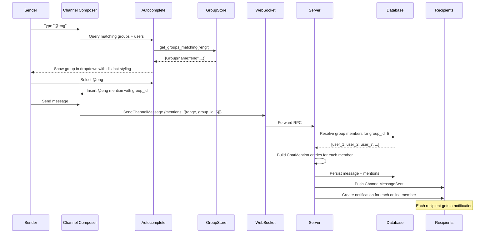
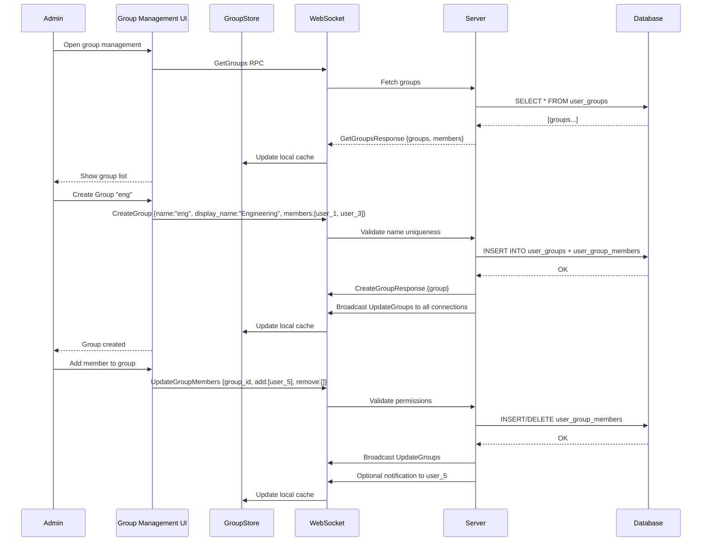

# Design: User Groups

## 1. Overview

Sim currently supports @mentioning individual users in channel messages (via `ChatMention { range, user_id }`), but there is no way to notify a collection of users at once. This design adds named user groups — collections of users within a workspace (e.g., `@eng`, `@design`, `@team-leads`) that can be @mentioned to notify all members simultaneously.

### Key Architectural Decisions

- **Proto evolution over new RPCs**: Extend the existing `ChatMention` proto to carry an optional `group_id` alongside `user_id`, and add a small set of group-management RPCs (`CreateGroup`, `UpdateGroupMembers`, `DeleteGroup`, `GetGroups`). A new push message (`UpdateGroups`) syncs group definitions to clients.

- **Database**: New `user_groups` and `user_group_members` tables, following the same `id_type!` / `sea_orm` Entity–Model pattern used by `channels` and `channel_members`. Groups are workspace-scoped.

- **Autocomplete integration**: Groups appear alongside individual users in the `@` autocomplete dropdown. The client `UserStore` is extended with a group registry (`GroupStore`) that caches group definitions and member sets.

- **Distinct visual styling**: Group @mentions render with a different color/style from individual user @mentions in the message composer and rendered messages, making them visually distinguishable at a glance.

- **Notification dispatch**: When a message containing a group mention is sent, the server resolves the group ID to its member set, then sends notifications to each online member individually (including the sender's connections). Group members who have muted the group or left it are excluded.

- **No auto-delete on empty**: Groups persist even when they have zero members (flagged as empty), allowing an admin to repopulate them later.

### Rationale

Groups are a natural extension of the existing `ChatMention` system. By adding an optional `group_id` field to the existing mention proto rather than introducing a separate group-mention envelope, we reuse the entire message-send, message-render, and notification pipeline with minimal changes. The group management CRUD is self-contained and mirrors the channel membership pattern, which the team already understands.

---

## 2. Architecture

### 2.1 Component Relationship Diagram

```mermaid
flowchart TB
    subgraph Client
        CC[Channel Composer]
        AC[Autocomplete Popup]
        MB[Message Bubble]
        GS[GroupStore<br/>Entity<GroupStore>]

        CC -->|@ query| AC
        AC -->|select group| CC
        CC -->|SendChannelMessage<br/>mentions[ChatMention + group_id]| WS[WebSocket]
        WS -->|UpdateGroups| GS
        WS -->|UpdateGroupMessage<br/>with group mentions| CC
        GS -->|lookup group| AC
        GS -->|lookup members| CC
    end

    subgraph Server
        CRUD[Group RPC Handlers<br/>CreateGroup / UpdateGroup<br/>DeleteGroup / GetGroups]
        MSG[Message Handlers<br/>send_channel_message]
        DB[(PostgreSQL<br/>user_groups<br/>user_group_members)]

        CRUD -->|update| DB
        MSG -->|resolve group mentions| DB
        DB -->|group member list| MSG
        MSG --> NP[Notification Pipeline]
        NP -->|AddNotification| WS
        CRUD -->|broadcast UpdateGroups| WS
    end

    subgraph Real-time
        WS ---|WebSocket| SERVER[Collab Server]
    end
```

### 2.2 Data Flow — Group @mention in a message



### 2.3 Data Flow — Group Management



---

## 3. Components and Interfaces

### 3.1 Protobuf Changes (`crates/proto/proto/channel.proto`)

#### 3.1.1 Extended ChatMention

```protobuf
message ChatMention {
  Range range = 1;
  uint64 user_id = 2;       // Existing: individual user mention
  uint64 group_id = 3;      // New: group mention (alternative to user_id)
}

// When group_id is set, user_id should be 0 and vice versa.
// The server resolves group_id to the list of member user_ids at send time.
```

#### 3.1.2 Group Management Messages

```protobuf
// ---- Group CRUD ----

message CreateGroup {
  string name = 1;               // Unique group name (alphanumeric + hyphens), e.g. "eng-team"
  string display_name = 2;       // Human-readable name, e.g. "Engineering Team"
  repeated uint64 member_ids = 3; // Initial members (creator is auto-added as admin)
}

message CreateGroupResponse {
  UserGroup group = 1;
}

message UpdateGroup {
  uint64 group_id = 1;
  optional string name = 2;           // Rename group
  optional string display_name = 3;   // Change display name
}

message UpdateGroupResponse {
  UserGroup group = 1;
}

message DeleteGroup {
  uint64 group_id = 1;
}

message DeleteGroupResponse {}

message GetGroups {}

message GetGroupsResponse {
  repeated UserGroup groups = 1;
}

// ---- Membership Management ----

message UpdateGroupMembers {
  uint64 group_id = 1;
  repeated uint64 add_user_ids = 2;
  repeated uint64 remove_user_ids = 3;
}

message UpdateGroupMembersResponse {
  UserGroup group = 1;
}

// ---- Leave Group (self-service) ----

message LeaveGroup {
  uint64 group_id = 1;
}

message LeaveGroupResponse {}

// ---- Real-time Sync ----

message UpdateGroups {
  repeated UserGroup groups = 1;
  repeated uint64 delete_group_ids = 2;
}

// ---- Data Types ----

message UserGroup {
  uint64 id = 1;
  string name = 2;
  string display_name = 3;
  uint64 admin_id = 4;               // User who created/manages the group
  repeated uint64 member_ids = 5;
  // member_ids is populated in responses and UpdateGroups, but not
  // in every context to avoid bloating messages — the client caches it.
}
```

#### 3.1.3 Changes to ChannelMessage

No structural changes needed. The existing `ChannelMessage` proto already has `repeated ChatMention mentions = 6;`. Since `ChatMention` now carries an optional `group_id`, existing messages with individual mentions are fully backward-compatible — they simply leave `group_id` as 0.

### 3.2 Server-side: GroupStore (`crates/collab/src/db/queries/groups.rs`)

Purpose: CRUD for user groups and membership. Lives alongside existing query files.

```rust
impl Database {
    /// Creates a new group. Validates name uniqueness within the workspace.
    /// Auto-adds the creator as admin.
    pub async fn create_group(
        &self,
        name: &str,
        display_name: &str,
        admin_id: UserId,
        member_ids: &[UserId],
    ) -> Result<GroupWithMembers>;

    /// Updates group metadata (name/display_name).
    pub async fn update_group(
        &self,
        group_id: GroupId,
        name: Option<&str>,
        display_name: Option<&str>,
    ) -> Result<GroupWithMembers>;

    /// Deletes a group and its membership rows.
    pub async fn delete_group(&self, group_id: GroupId) -> Result<()>;

    /// Returns all groups in the workspace, with member lists.
    pub async fn get_groups(&self) -> Result<Vec<GroupWithMembers>>;

    /// Returns a single group with members.
    pub async fn get_group(&self, group_id: GroupId) -> Result<Option<GroupWithMembers>>;

    /// Atomically adds and removes members from a group.
    /// Validates that the caller has admin permissions on the group.
    pub async fn update_group_members(
        &self,
        group_id: GroupId,
        add_ids: &[UserId],
        remove_ids: &[UserId],
    ) -> Result<GroupWithMembers>;

    /// Self-service: removes the caller from a group.
    pub async fn leave_group(&self, group_id: GroupId, user_id: UserId) -> Result<()>;

    /// Resolves all member user_ids for a given group_id.
    /// Used at send time to expand group mentions.
    pub async fn get_group_member_ids(&self, group_id: GroupId) -> Result<Vec<UserId>>;

    /// Returns all groups that a user is a member of.
    pub async fn get_groups_for_user(&self, user_id: UserId) -> Result<Vec<GroupWithMembers>>;

    /// Check if a group name is available.
    pub async fn is_group_name_available(&self, name: &str) -> Result<bool>;

    /// Returns total member count for a group.
    pub async fn group_member_count(&self, group_id: GroupId) -> Result<usize>;
}
```

#### Contract

| Method | Precondition | Postcondition |
|---|---|---|
| `create_group` | Name is unique, name matches `^[a-zA-Z0-9\-]+$`, member count ≤ max size | Rows inserted into `user_groups`, `user_group_members` |
| `update_group_members` | Caller is admin, all `add_ids` exist as users, new total ≤ max size | Rows inserted/deleted in `user_group_members` |
| `delete_group` | Caller is admin | Cascade delete all membership rows |
| `leave_group` | User is a member | Row deleted from `user_group_members` |

### 3.3 Server-side: RPC Handlers (`crates/collab/src/rpc.rs`)

New handlers registered in `Server::new()`:

```rust
// Registration:
.add_request_handler(create_group)
.add_request_handler(update_group)
.add_request_handler(delete_group)
.add_request_handler(get_groups)
.add_request_handler(update_group_members)
.add_request_handler(leave_group)
```

Each handler follows the existing pattern:

```rust
async fn create_group(
    request: proto::CreateGroup,
    response: Response<proto::CreateGroupResponse>,
    session: MessageContext,
) -> Result<()> {
    let db = session.db().await;
    // 1. Validate name format
    // 2. Check name uniqueness
    // 3. Check max size
    // 4. Create group
    // 5. Broadcast UpdateGroups to all connections
    // 6. Return response
}
```

### 3.4 Server-side: Group Mention Resolution in Message Send

When `send_channel_message` (or the equivalent new handler) processes mentions:

```rust
/// Expands group mentions into individual ChatMention entries.
/// Called at send time before persisting the message.
async fn expand_group_mentions(
    mentions: &[proto::ChatMention],
    db: &Database,
) -> Result<Vec<proto::ChatMention>> {
    let mut expanded = Vec::new();
    for mention in mentions {
        if mention.group_id != 0 {
            let member_ids = db.get_group_member_ids(GroupId::from_proto(mention.group_id)).await?;
            for uid in member_ids {
                expanded.push(proto::ChatMention {
                    range: Some(mention.range.clone()),
                    user_id: uid.to_proto(),
                    group_id: 0,
                    ..Default::default()
                });
            }
        } else {
            expanded.push(mention.clone());
        }
    }
    Ok(expanded)
}
```

### 3.5 Client-side: GroupStore (`crates/client/src/groups.rs`)

A new entity that caches group definitions and member sets, similar to `UserStore` for users.

```rust
pub struct GroupStore {
    groups: HashMap<u64, Arc<Group>>,      // group_id → Group
    by_name: HashMap<SharedString, Arc<Group>>, // group name → Group
    user_groups: HashMap<u64, Vec<Arc<Group>>>, // user_id → groups they belong to
    client: Weak<Client>,
    _subscriptions: Vec<Subscription>,
    weak_self: WeakEntity<Self>,
}

pub struct Group {
    pub id: u64,
    pub name: SharedString,           // e.g. "eng-team"
    pub display_name: SharedString,   // e.g. "Engineering Team"
    pub admin_id: u64,
    pub member_ids: Vec<u64>,
}
```

#### Key Methods

```rust
impl GroupStore {
    /// Initialize by fetching all groups from server.
    pub fn new(client: &Client, cx: &mut App) -> Entity<Self>;

    /// Handle incoming UpdateGroups push.
    fn handle_update_groups(&mut self, update: proto::UpdateGroups, cx: &mut App);

    /// Returns groups whose name or display_name matches the query prefix.
    pub fn search_groups(&self, query: &str) -> Vec<Arc<Group>>;

    /// Returns true if the given user is a member of the given group.
    pub fn is_member(&self, group_id: u64, user_id: u64) -> bool;

    /// Returns all groups for autocomplete display.
    pub fn all_groups(&self) -> Vec<Arc<Group>>;
}

impl EventEmitter<Event> for GroupStore {}
```

### 3.6 Client-side: Autocomplete Integration

The existing channel composer's `@` autocomplete is extended to query both `UserStore` and `GroupStore`:

```rust
// In channel_composer.rs or similar autocomplete logic:

fn query_autocomplete(query: &str, user_store: &UserStore, group_store: &GroupStore) -> AutocompleteResults {
    let users = user_store.search_users(query);
    let groups = group_store.search_groups(query);
    AutocompleteResults {
        users,
        groups, // Rendered with distinct styling
    }
}
```

The autocomplete popup renders group results with a visual indicator:
- A group icon (e.g., `IconName::Group` or a people icon) next to the group name
- Different background color or badge (e.g., a subtle purple tint vs. blue for users)
- Display format: `@group-name` (Group display name)

### 3.7 Client-side: Group Mention Rendering

When rendering a `ChannelMessage`, mentions with `group_id` set are displayed distinctly:

```rust
// In message bubble rendering:
fn render_mention(mention: &ChatMention, groups: &GroupStore) -> AnyElement {
    if mention.group_id != 0 {
        if let Some(group) = groups.get(mention.group_id) {
            // Rendered with group styling (e.g., purple/pink background)
            return label(group.display_name.clone())
                .style(MentionStyle::Group)
                .into_any();
        }
    }
    // Existing user mention rendering
    // ...
}
```

### 3.8 Client-side: Group Management UI

`GroupManagement` is a workspace modal opened from the Channels header. It observes
the shared `GroupStore`, so group pushes refresh its list and selected detail view.
It uses `UserStore::fuzzy_search_users` for both initial-member selection and
admin-only member additions; its mutation controls await the corresponding client
RPC and show request errors in the modal.

<!-- impl: crates/collab_ui/src/group_management.rs#GroupManagement -->

```rust
pub struct GroupManagement {
    groups: Vec<Arc<Group>>,
    selected_group: Option<Arc<Group>>,
    search_query: SharedString,
    creating: bool,
}

impl GroupManagement {
    pub fn new(cx: &mut App) -> Self;
    pub fn render(&mut self, window: &mut Window, cx: &mut Context<Self>) -> impl IntoElement;
}
```

The UI includes:
- **Group list sidebar**: Lists all groups with member counts
- **Group detail panel**: Shows member list with add/remove controls for admins
- **Create group dialog**: Name, display name, initial member picker
- **Member picker**: Searchable user list (reuses existing user search component)
- **Leave group button**: For non-admin members to remove themselves

---

## 4. Data Models

### 4.1 Database Tables

#### `user_groups`

```sql
CREATE TABLE user_groups (
    id SERIAL PRIMARY KEY,
    name VARCHAR(100) NOT NULL,
    display_name VARCHAR(255) NOT NULL,
    admin_id INTEGER NOT NULL REFERENCES users(id),
    created_at TIMESTAMP NOT NULL DEFAULT NOW(),
    updated_at TIMESTAMP NOT NULL DEFAULT NOW(),
    UNIQUE(name)
);

CREATE INDEX idx_user_groups_admin ON user_groups (admin_id);
CREATE INDEX idx_user_groups_name ON user_groups (name);
```

#### `user_group_members`

```sql
CREATE TABLE user_group_members (
    id SERIAL PRIMARY KEY,
    group_id INTEGER NOT NULL REFERENCES user_groups(id) ON DELETE CASCADE,
    user_id INTEGER NOT NULL REFERENCES users(id) ON DELETE CASCADE,
    created_at TIMESTAMP NOT NULL DEFAULT NOW(),
    UNIQUE(group_id, user_id)
);

CREATE INDEX idx_group_members_group ON user_group_members (group_id);
CREATE INDEX idx_group_members_user ON user_group_members (user_id);
```

### 4.2 SeaORM Entity Definitions

Following the existing pattern in `crates/collab/src/db/tables/`:

```rust
// crates/collab/src/db/tables/user_group.rs

use crate::db::{GroupId, UserId};
use sea_orm::entity::prelude::*;

#[derive(Clone, Debug, PartialEq, Eq, DeriveEntityModel)]
#[sea_orm(table_name = "user_groups")]
pub struct Model {
    #[sea_orm(primary_key)]
    pub id: GroupId,
    pub name: String,
    pub display_name: String,
    pub admin_id: UserId,
    pub created_at: chrono::NaiveDateTime,
    pub updated_at: chrono::NaiveDateTime,
}

impl ActiveModelBehavior for ActiveModel {}

#[derive(Copy, Clone, Debug, EnumIter, DeriveRelation)]
pub enum Relation {
    #[sea_orm(has_many = "super::user_group_member::Entity")]
    Members,
    #[sea_orm(
        belongs_to = "super::user::Entity",
        from = "Column::AdminId",
        to = "super::user::Column::Id"
    )]
    Admin,
}

impl Related<super::user_group_member::Entity> for Entity {
    fn to() -> RelationDef {
        Relation::Members.def()
    }
}
```

```rust
// crates/collab/src/db/tables/user_group_member.rs

use crate::db::{GroupId, GroupMemberId, UserId};
use sea_orm::entity::prelude::*;

#[derive(Clone, Debug, PartialEq, Eq, DeriveEntityModel)]
#[sea_orm(table_name = "user_group_members")]
pub struct Model {
    #[sea_orm(primary_key)]
    pub id: GroupMemberId,
    pub group_id: GroupId,
    pub user_id: UserId,
    pub created_at: chrono::NaiveDateTime,
}

impl ActiveModelBehavior for ActiveModel {}

#[derive(Copy, Clone, Debug, EnumIter, DeriveRelation)]
pub enum Relation {
    #[sea_orm(
        belongs_to = "super::user_group::Entity",
        from = "Column::GroupId",
        to = "super::user_group::Column::Id"
    )]
    Group,
    #[sea_orm(
        belongs_to = "super::user::Entity",
        from = "Column::UserId",
        to = "super::user::Column::Id"
    )]
    User,
}
```

### 4.3 New ID Types

```rust
// In crates/collab/src/db/ids.rs

id_type!(GroupId);
id_type!(GroupMemberId);
```

### 4.4 Migration

A new migration file `20260625000000_create_user_groups.sql`:

```sql
-- UP
CREATE TABLE user_groups (
    id SERIAL PRIMARY KEY,
    name VARCHAR(100) NOT NULL,
    display_name VARCHAR(255) NOT NULL,
    admin_id INTEGER NOT NULL REFERENCES users(id),
    created_at TIMESTAMP NOT NULL DEFAULT NOW(),
    updated_at TIMESTAMP NOT NULL DEFAULT NOW(),
    UNIQUE(name)
);

CREATE TABLE user_group_members (
    id SERIAL PRIMARY KEY,
    group_id INTEGER NOT NULL REFERENCES user_groups(id) ON DELETE CASCADE,
    user_id INTEGER NOT NULL REFERENCES users(id) ON DELETE CASCADE,
    created_at TIMESTAMP NOT NULL DEFAULT NOW(),
    UNIQUE(group_id, user_id)
);

CREATE INDEX idx_user_group_members_group ON user_group_members (group_id);
CREATE INDEX idx_user_group_members_user ON user_group_members (user_id);

-- DOWN
DROP TABLE IF EXISTS user_group_members;
DROP TABLE IF EXISTS user_groups;
```

### 4.5 Client-side Representation

```rust
// In crates/client/src/groups.rs

#[derive(Clone, Debug)]
pub struct Group {
    pub id: u64,
    pub name: SharedString,
    pub display_name: SharedString,
    pub admin_id: u64,
    pub member_ids: Vec<u64>,
}

pub enum GroupStoreEvent {
    GroupsUpdated,
    GroupMembershipChanged { group_id: u64, user_id: u64, added: bool },
}
```

---

## 5. Correctness Properties

Each property below is derived from one or more EARS-style acceptance criteria in the requirements document.

### Property 5.1: Group name uniqueness

_For any_ `(workspace_id, name)` pair, after a `CreateGroup` or `UpdateGroup` call with that name, the system SHALL reject the operation if a different group with the same name already exists in the same workspace.

**Validates: Requirement 9.1 AC4**

### Property 5.2: Group size limit

_For any_ `CreateGroup` or `UpdateGroupMembers` call, if the resulting member count would exceed the configured maximum (default 100), the system SHALL reject the operation.

**Validates: Requirement 9.1 AC5**

### Property 5.3: Member-only notification

_For any_ group @mention in a sent message, the system SHALL send notifications only to online members of the group who have not left the group, and SHALL NOT notify members who have left.

**Validates: Requirement 9.2 AC3, Requirement 9.2 AC4**

### Property 5.4: Creator is admin

_For any_ successful `CreateGroup` call, the creating user SHALL be recorded as the group admin and SHALL be a member of the group.

**Validates: Requirement 9.1 AC3**

### Property 5.5: Admin-only membership changes

_For any_ `UpdateGroupMembers` call by a non-admin user, the system SHALL reject the operation.

**Validates: Requirement 9.3 AC1**

### Property 5.6: Unique membership

_For any_ `(group_id, user_id)` pair, there SHALL be at most one row in `user_group_members`. Re-adding an existing member SHALL be a no-op.

**Validates: Requirement 9.3 AC1, AC2**

### Property 5.7: Clean leave

_For any_ user who calls `LeaveGroup`, the system SHALL remove their membership row and SHALL NOT include them in future notification dispatches for that group.

**Validates: Requirement 9.2 AC4**

### Property 5.8: Empty group persistence

_For any_ group whose last member is removed (via membership update or leave), the system SHALL NOT delete the group record and SHALL mark it as empty.

**Validates: Requirement 9.3 AC5**

### Property 5.9: Self-leave non-admin

_For any_ member (including non-admins) calling `LeaveGroup`, the system SHALL remove them even if they are the admin. If the admin leaves and there are other members, the group SHALL remain with no admin until another admin is appointed.

**Validates: Requirement 9.2 AC4**

### Property 5.10: Autocomplete includes groups

_For any_ `@query` typed in the message compose area, the autocomplete popup SHALL show groups whose name or display name matches the query, alongside individual users.

**Validates: Requirement 9.2 AC1**

### Property 5.11: Distinct group mention styling

_For any_ rendered channel message containing a group mention, the mention SHALL be visually distinguishable from individual user mentions (different color, icon, or badge).

**Validates: Requirement 9.2 AC2**

---

## 6. Error Handling

| Error | Handling |
|---|---|
| **Group name already exists** | Return `ALREADY_EXISTS` error; client shows "Group name is already taken" |
| **Group name invalid format** | Server validates against `^[a-zA-Z0-9\-]+$`; client pre-validates and shows inline error |
| **Max group size exceeded** | Return `INVALID_ARGUMENT` with current max; client shows "Group would exceed maximum size of {n}" |
| **User not found** (on member add) | Return `NOT_FOUND`; client shows "User not found" |
| **Group not found** | Return `NOT_FOUND`; client removes stale group from local cache and shows toast |
| **Permission denied** (non-admin tries membership change) | Return `PERMISSION_DENIED`; client hides management controls for non-admins |
| **User already a member** | `UpdateGroupMembers` is idempotent for adds — no-op, return success |
| **User not a member** (on remove/leave) | `UpdateGroupMembers` is idempotent for removes — no-op, return success |
| **Network failure** on group management RPC | Retry with exponential backoff (3 attempts). Show toast on final failure |
| **Race condition** (concurrent membership changes) | Handled by DB unique constraint and serializable transactions; conflict returns retryable error |
| **Message send with stale group** (group was deleted between autocomplete and send) | Server resolves group mentions at send time; if group is gone, return `NOT_FOUND` for the mention; client shows "Group no longer exists" and allows resending without the mention |

---

## 7. Testing Strategy

### 7.1 Unit Tests

| Test | Scope | Validates |
|---|---|---|
| `GroupStore::create_group` validates name format | `collab::db::queries::groups` | 5.1, 5.4 |
| `GroupStore::is_group_name_available` | `collab::db::queries::groups` | 5.1 |
| `GroupStore::create_group` enforces max size | `collab::db::queries::groups` | 5.2 |
| `GroupStore::update_group_members` validates admin | `collab::db::queries::groups` | 5.5 |
| `GroupStore::update_group_members` idempotent add | `collab::db::queries::groups` | 5.6 |
| `GroupStore::update_group_members` idempotent remove | `collab::db::queries::groups` | 5.6 |
| `GroupStore::leave_group` removes member | `collab::db::queries::groups` | 5.7 |
| `GroupStore::leave_group` on last member does not delete group | `collab::db::queries::groups` | 5.8 |
| `GroupStore::get_group_member_ids` returns correct set | `collab::db::queries::groups` | 5.3 |
| `expand_group_mentions` expands single group into N mentions | `collab::rpc` | 5.3 |
| `expand_group_mentions` preserves individual user mentions | `collab::rpc` | 5.3 |
| `expand_group_mentions` handles deleted group gracefully | `collab::rpc` | 6 |
| Group auto-complete search matches by name and display_name | `client::groups` | 5.10 |
| Group auto-complete search excludes non-matching groups | `client::groups` | 5.10 |
| `GroupStore::search_groups` is case-insensitive | `client::groups` | 5.10 |
| Group mention renders with distinct style | `collab_ui::message_bubble` | 5.11 |

### 7.2 Integration Tests

| Test | Description |
|---|---|
| **Full group lifecycle** | Create group → verify it appears in GetGroups → add members → verify member list → remove members → verify updated → delete group → verify removed |
| **Group @mention in message** | Create group with 3 members → send message with group mention → verify all 3 receive `ChannelMessageSent` + notification |
| **Mixed mentions** | Send message with both individual user mentions and group mentions → verify both expand correctly |
| **Group leave stops notifications** | User leaves group → send message with group mention → verify that user does NOT receive notification |
| **Concurrent membership add/remove** | Two admins simultaneously add different users → verify both succeed and final member list contains both |
| **Group management UI** | Open group management panel → create group → verify it appears in list → add member via picker → verify member count updates |

### 7.3 Property-Based Tests

| Property | Description |
|---|---|
| **Idempotent add** | Adding an already-present member N times yields the same state as adding once. |
| **Idempotent remove** | Removing an absent member N times yields the same state as removing once (no-op). |
| **Add-then-remove** | Adding a user then removing them yields the same state as if neither operation occurred. |
| **Remove-then-add** | Removing a user then adding them back yields the same state as a single add. |
| **Mention expansion round-trip** | Expanding a group mention into N individual mentions, then re-collecting by group_id back into the original set of (group_id → user_ids) mappings, preserves the original group_id-to-user mapping. |
| **Autocomplete prefix closure** | For any group (name, display_name), querying the first character of either yields at least that group in results. |

### 7.4 UI Test Considerations

- **Group management panel rendering**: Verify that the group list, member list, add/remove controls render correctly for admins vs. non-admins
- **Autocomplete rendering**: Verify groups appear with correct styling and icon in the @-autocomplete dropdown
- **Message rendering**: Verify group mentions render with distinct color/background in the message bubble
- **Empty state**: Verify "No groups yet" or "No members" states render correctly

---

## Appendix A: Files Changed

| File | Change |
|---|---|
| `crates/proto/proto/channel.proto` | Extend `ChatMention` with `group_id`; add `CreateGroup`, `CreateGroupResponse`, `UpdateGroup`, `UpdateGroupResponse`, `DeleteGroup`, `DeleteGroupResponse`, `GetGroups`, `GetGroupsResponse`, `UpdateGroupMembers`, `UpdateGroupMembersResponse`, `LeaveGroup`, `LeaveGroupResponse`, `UpdateGroups`, `UserGroup` messages |
| `crates/collab/src/db/ids.rs` | Add `GroupId` and `GroupMemberId` id types |
| `crates/collab/src/db/tables.rs` | Add `user_group` and `user_group_member` modules |
| `crates/collab/src/db/tables/user_group.rs` | New: SeaORM entity for `user_groups` table |
| `crates/collab/src/db/tables/user_group_member.rs` | New: SeaORM entity for `user_group_members` table |
| `crates/collab/src/db/queries/groups.rs` | New: Database query methods for group CRUD |
| `crates/collab/src/db/queries/mod.rs` | Re-export groups module |
| `crates/collab/src/rpc.rs` | Add 6 new RPC handlers; modify `send_channel_message` to expand group mentions |
| `crates/collab/migrations/20260625000000_create_user_groups.sql` | New: migration |
| `crates/client/src/groups.rs` | New: `GroupStore` entity for client-side caching |
| `crates/client/src/lib.rs` | Register `GroupStore` |
| `crates/collab_ui/src/group_management.rs` | New: Group management panel/view |
| `crates/collab_ui/src/composer.rs` | Extend autocomplete to query `GroupStore` alongside `UserStore` |
| `crates/collab_ui/src/message_bubble.rs` | Add group mention rendering with distinct style |
