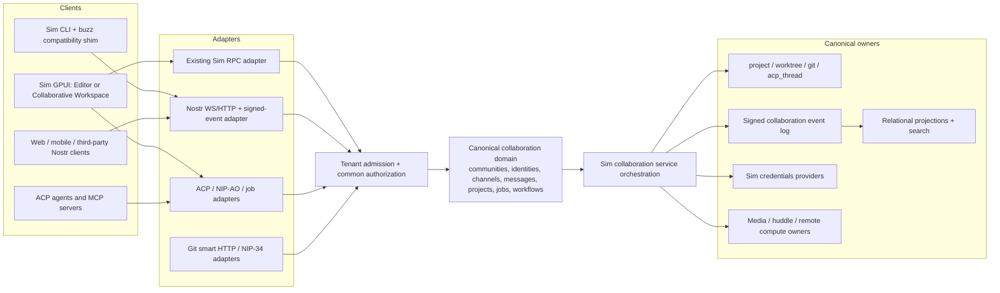
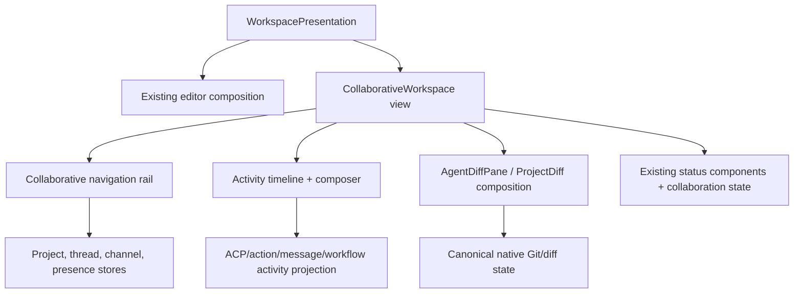
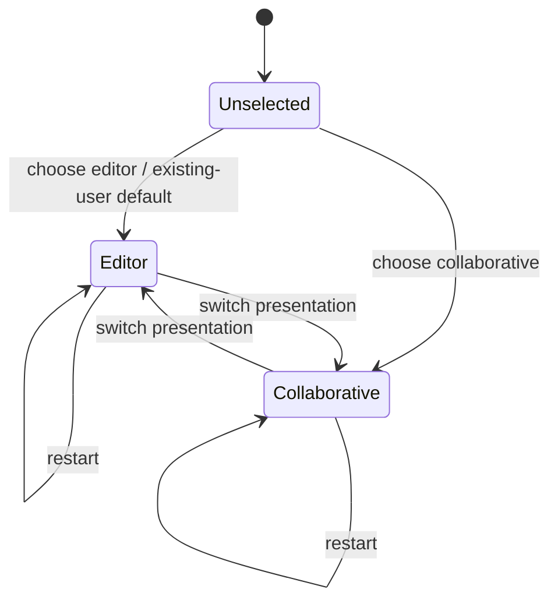

# Design: Collaborative Workspace and Buzz Consolidation

## Overview

The target is one Sim product with two native workspace presentations and one canonical owner per aggregate. Existing Sim workspace/project/Git/ACP components remain authoritative for local development. Buzz's signed-event collaboration semantics are ported into a UI-independent domain and service layer, while Nostr, existing Sim RPC, CLI, web, mobile and temporary legacy processes become adapters around that domain.

The transition is deliberately incremental. Milestone 1 ships a useful GPUI vertical slice without waiting for server consolidation. Later milestones add the canonical collaboration domain, protocol/service foundations and complete Buzz parity. A temporary Buzz-compatible service boundary is allowed only during migration; the final deployment owner is the Sim collaboration platform after ADR-001.

## Existing context

- `workspace`, `onboarding`, `sidebar` and `ui` already own GPUI windows, panes, docks, persistence, focus, themes and the first-run flow.
- `project`, `worktree`, `project_panel`, `git` and `git_ui` own local files, worktrees, repositories, index/working-tree state and native diff/review surfaces.
- `agent`, `acp_thread`, `action_log`, `agent_ui`, `agent_servers` and tool-permission stores own native agent execution, ACP sessions, transcripts, tool activity and cancellation. The approved ACP prompt-reentrancy spec remains binding.
- `channel`, `collab_ui`, `client`, `rpc`, `proto`, `session`, `livekit_client` and the `collab` service already implement accounts, channels, rooms, presence-like state, project sharing and production WebSocket/RPC/Postgres infrastructure.
- The existing `collab` binary uses Axum 0.6, SeaORM 1.1.10 and SQLx 0.8; Buzz currently uses Axum 0.8 and SQLx 0.9. Directly merging manifests before dependency alignment is unsafe, which motivates the bounded sidecar phase in `migration-plan.md`.
- Buzz's `buzz-core` is zero-I/O and contains the most complete audited signed-event/tenant rules. `buzz-relay` is the orchestration point around SQLx/Postgres, Redis, S3/Blossom, Git, workflows, audit, push and audio. Its desktop is React/Tauri and must not become a GPUI architecture template.
- Existing specs under `.agents/specs/goose-migration` and `.agents/specs/acp-thread-prompt-reentrancy` constrain agent infrastructure, tool permissions, prompt lifecycle and security. `telemetry-disabled-default` prevents Buzz-derived client code from re-enabling telemetry.

## Target architecture

The diagram shows logical ownership, not a requirement that all components run in one process. Adapters may be separate listeners or binaries; they cannot author independent domain state.

## Design decisions

### D1. Canonical domain by aggregate, not by legacy product

- **Responsibility:** Define commands, entities, stable IDs, state transitions, authorization inputs, projection events and versioning for communities, identities, channels/messages, shared projects/Git records, jobs, workflows, audit references, media/huddles and presence.
- **Integration:** The domain is UI-free and I/O-free. Existing Sim types remain canonical for local project/Git/ACP aggregates. Buzz-derived collaboration types are moved from `buzz-core` only where no suitable Sim type exists. Nostr encoding stays in a protocol adapter.
- **Rationale:** Neither current `proto` nor client-side `channel` is a suitable shared server/client domain owner, while copying `buzz-core` intact would preserve Buzz as a second product. A narrow collaboration-domain boundary is a justified new logical component.
- **Constraint:** Final crate names and the service topology require ADR-001 before product implementation beyond the vertical slice.

### D2. Provenance-aware authoritative records

Each aggregate declares one authoring source:

| Aggregate | Authority | Derived/compatibility state |
| --- | --- | --- |
| Local files/worktrees/index/diffs | Sim `project`/`worktree`/`git` | NIP-34 patches/status and timeline cards |
| Native ACP session/transcript/actions | `agent`/`acp_thread`/`action_log` | NIP-AO frames, channel messages and activity projections |
| Nostr-authored channel/message/social/workflow records | Verified signed event log | SQL search/timeline/member/read projections and GPUI stores |
| Service-issued membership, summaries and bounds | Authorized collaboration service | Relay-signed event representation and RPC payloads |
| Service account | Sim user/account service | Explicit Nostr-key bindings |
| Collaboration keys | Sim credentials provider | Pairing/backup/import formats |

Projection rows carry `source_kind`, `source_id`, `source_version`, `community_id` and `projected_at`. A projection cannot accept a direct write that bypasses its command/event authority. Drift checks rebuild or compare projections from authoritative records.

### D3. Protocol adapters preserve exact wire behavior

- **Nostr:** The adapter owns event serialization, signing/verification, kind/tag validation, filter translation, NIP-01 frames, NIP-11/05, NIP-42/98, NIP-CW cursors/overlays and all Buzz NIPs. It calls domain commands only after admission/auth. It may return signed compatibility projections without changing domain ownership.
- **Sim RPC:** Existing clients continue through `client`/`rpc`/`proto`. New collaborative RPC messages carry domain IDs and versions rather than Nostr JSON where no compatibility is required.
- **ACP/MCP:** Sim's native ACP runtime remains authoritative. Channel mentions, NIP-AO frames and signed jobs translate into session/job commands. MCP tools remain subject to Sim permissions and sandbox policy.
- **Git:** Git smart HTTP and NIP-34 translate hosted-repository operations and signed review records. Local repository state is never reconstructed from a chat projection.

Unknown versions fail before writes. Compatibility adapters are independently tested against Buzz fixtures and old clients.

### D4. One tenant context and authorization policy

Every ingress constructs an immutable `TenantContext` from trusted host/listener/deployment routing. Authentication yields a typed principal: Sim account, Nostr key, owner-attested agent, scoped token or service. A common policy evaluates community membership, role, channel membership, resource ownership, scopes and delegation conditions. Storage, search, cache, pub/sub, object and Git keys require the typed community value rather than accepting a raw client identifier.

The independent conformance checker remains unable to depend on production tenant or authorization reducers. Its trace format is extended at adapter seams only.

### D5. Persistence convergence

The transition starts with Buzz SQLx migrations and Sim SeaORM tables intact but fenced within one tenant model. Target storage uses one Postgres deployment and one migration authority; exact table consolidation is aggregate-specific:

- Preserve the signed `events` log and replacement/visibility indexes required by Nostr interoperability.
- Preserve Sim project/worktree/editor/ACP databases for their canonical local aggregates.
- Consolidate overlapping channel/member/room/user projection tables only after backfill and differential-read evidence.
- Keep Redis state derived and expiring; it is never migration authority.
- Preserve S3/Blossom objects and content hashes; rewrite metadata pointers only after verification.

All schema changes have forward/backward compatibility windows and checksums. Dual writes use an outbox with stable operation IDs, not two unrelated transactions. See `migration-plan.md`.

### D6. Native GPUI workspace composition

`workspace` owns a persisted `WorkspacePresentation` setting with `Editor` and `Collaborative`. It changes composition, not the active `Project` entity.

- The left rail groups pinned work, communities, projects/repositories/worktrees and active/history tasks. Items expose unread/running/waiting/failed/archived/completed states and presence.
- The top bar uses stable participant identities, share/invite actions, connection/sync/permission state and layout controls.
- The feed virtualizes semantic activity, supports anchored pagination, updates running rows in place and exposes raw data only on demand.
- The review pane composes existing `AgentDiffPane`, `ProjectDiff` and Git actions. Timeline links carry stable action/change IDs, not line-number-only references.
- The status surface composes community/project/worktree/branch/diff and agent/model/runtime/task/sync state from their canonical stores.

`screenshots/screenshot-1.png` and `screenshots/screenshot-2.png` are the canonical acceptance references at 1930×1262 and 1928×1298 respectively. Their source hashes are recorded in `source-inventory.md`. Layout tokens use Sim theme/spacing; reference geometry is expressed as constraints and resizable minima rather than hardcoded colors or a single fixed split.

### D7. Workspace presentation state machine

Switching captures navigation/pane presentation state and reuses the same workspace/project entities. If Collaborative initialization fails, Sim shows a recoverable error and permits Editor presentation without rewriting the saved choice unless the user changes it.

### D8. Communication and activity projections

Channel timelines and ACP transcripts remain distinct authoritative aggregates but render through one `ActivityItem` projection. Each item has stable source ID, class, actor, verb, object, lifecycle state, outcome, timestamp, community/project/thread association, visibility, detail handle and optional Git/action link. The projection is deterministic and idempotent:

- ACP/tool events map to message, thought, plan, file edit, shell, permission, error or generic classes.
- Nostr messages and system events map to human/agent message or platform-operation classes.
- Git/workflow/CI/moderation events map to consequence-weighted cards.
- Streaming fragments and lifecycle changes update one item by source ID.
- Unknown events render a truthful generic row plus raw details.

The channel window remains immutable cursor-chained history; live items overlay page zero and are reconciled after reconnect.

### D9. Identity and agent integration

Sim account IDs and Nostr keys are not interchangeable. A binding record includes account, community, pubkey, verification method, created/revoked timestamps and recovery policy. Signing occurs only through the credentials provider. Owner-attested agent keys remain separate principals.

Sim's ACP execution owns local sessions, cancellation, permissions and tools. Ported persona/team/PMA/engram/job records configure or refer to that runtime but cannot bypass it. Remote provider launches use the same session/job identifiers and permission envelopes. Provider output is hostile, secrets are separated from persisted configuration, and presence remains a bounded status signal rather than a management channel.

### D10. Git, workflows, audit and moderation

- `project` maps local repositories to NIP-34 coordinates and NIP-MP projects. A grouping assertion never changes repository permissions.
- Git smart HTTP/server storage is an additional hosting adapter whose authority is fixed by ADR-003. Native diffs always read canonical working/index/commit state.
- Workflows are durable domain runs. Trigger ingestion and action execution are separate; approval writes atomically transition waiting runs. Existing workflow stubs must be completed.
- Audit entries reference canonical operation IDs and form a per-community chain under a single writer lock. Client telemetry policy does not govern required server audit, but audit content is minimized and redacted.
- Moderation distinguishes personal mute, content action, identity archive, access revocation and community deletion.

### D11. Media, huddles, push, pairing and mesh

- Media metadata belongs to the collaboration domain; bytes live in the configured object store. Blossom remains a compatibility adapter.
- Huddle lifecycle is transport-neutral. Existing Sim LiveKit is preferred for native audio, while Buzz Opus can remain a versioned adapter pending ADR-004. Transcripts are channel records, not audio-transport state.
- NIP-PL leases authorize wake-only push. The gateway never forwards event content; clients reconnect and query authority.
- NIP-AB pairing transfers identity material into the canonical credentials provider and leaves no durable authority in the pairing relay.
- Iroh mesh membership/compute ads feed Sim remote-agent scheduling. Mesh execution is opt-in and never a silent fallback.

### D12. Companion clients and operational ownership

The mobile and web clients continue speaking Nostr during migration. The CLI gains Sim-owned commands with a `buzz` compatibility shim. Admin resources move to the consolidated service. Deployment charts, migrations, health endpoints, metrics and release artifacts move under Sim conventions only after differential tests pass. The React/Tauri desktop is frozen except for compatibility/security fixes during the migration and then retired.

## Data and interface models

| Model | Required fields/invariants |
| --- | --- |
| `TenantContext` | Trusted `community_id`, host/deployment binding, request correlation; impossible to construct from event tags alone |
| `Principal` | Account/key/service identity, verified credentials, owner attestation, scopes and community membership version |
| `DomainCommand` | Stable idempotency key, tenant, principal, expected version/predecessor, payload and originating adapter |
| `AuthoritativeRecord` | Stable aggregate ID/version, provenance, community, author and integrity reference |
| `ProjectionRecord` | Source kind/id/version, community, projection version, projected timestamp and rebuild cursor |
| `ActivityItem` | Stable source ID, semantic class, actor/verb/object/outcome, lifecycle, visibility and detail/Git links |
| `CompatibilityVersion` | Adapter protocol/version, minimum peer, enabled features and schema/event catalog revision |
| `MigrationCheckpoint` | Migration/version, tenant/shard, source cursor, target cursor, counts/hashes, status and rollback boundary |

## Error handling and recovery

- Validation/auth/tenant failures are terminal for the request and disclose no resource existence.
- Optimistic client writes have stable client operation IDs and visibly transition pending → accepted/rejected/reconciled.
- Reconnect fetches authoritative heads/windows before marking the workspace synchronized.
- Projection or search lag exposes freshness and does not override authoritative reads.
- Provider, workflow, media, voice and mesh failures are scoped to the affected action and preserve the surrounding conversation/workspace.
- Cancellation propagates to ACP tasks, subscriptions, subprocesses and network requests; detached tasks log errors through repository conventions.
- Migration failures stop the affected tenant/shard, retain checkpoints and invoke the rollback rule from `migration-plan.md`.

## Security and privacy

Threat-model boundaries include untrusted event JSON/tags, signed-but-unauthorized actors, replay, kindless ID/COUNT leakage, filter limits before authorization, host/tag tenant confusion, key backup/import, malicious provider binaries, MCP tool requests, webhook SSRF/redirects, media type confusion, search indexing, push amplification/content leakage, mesh peers, logs/telemetry and database operators.

Controls include exact schemas, signature/event-ID verification, bounded frames/bodies/outputs/queues, typed tenant labels, authorization before limit/ranking, storage-level search nulling, NIP-44 privacy gates, replay caches, protected keys/zeroization, Sim tool permissions/sandbox, SSRF private-range checks with redirects disabled, object path fencing, wake-only push, resource-limited opt-in mesh, redacted structured logs and independent conformance traces.

## Rollout and rollback

Rollout phases and gates are normative in `migration-plan.md`. Feature flags separately control workspace presentation, read adapters, write mirroring and client exposure. A user-facing workspace flag never changes server write authority. Rollback is permitted only before a documented point of no return or by restoring a complete snapshot and preventing divergent new writes.

## Testing strategy

- Unit/property tests for pure domain transitions, event/tag grammar, authorization, projections, reconciliation and migration checkpoints.
- GPUI tests for mode switching, focus, persistent layout, activity mutation, review links, accessibility and error states; use GPUI executor timers.
- Service integration tests with Postgres, Redis, S3-compatible storage and multiple replicas/communities.
- Differential old-Buzz versus consolidated-service tests using the independent test client and fixtures.
- Security/fault tests for cross-tenant reads, replay, provider output, SSRF, malformed media, process cancellation, database/cache/object partial failure and deletion recovery.
- Load tests for subscriptions, fan-out, channel windows, search, push queues, workflows, mesh and multi-agent orchestration.
- Mobile/web/CLI/admin compatibility tests across the published version matrix.
- Visual tests compare the expanded layout with `screenshots/screenshot-1.png` at 1930×1262 and the collapsed-review layout with `screenshots/screenshot-2.png` at 1928×1298, plus dark/high-contrast, zoom and narrow layouts derived from the same structural constraints.

## Requirements traceability

| Requirement | Design element | Verification |
| --- | --- | --- |
| 1.1, 1.2, 1.3, 1.4 | Source ledger, generated catalog and parity gate | Inventory drift CI and final coverage report |
| 2.1, 2.2, 2.3, 2.4 | D1-D2, provenance and bounded dual state | Ownership lint, drift/reconciliation and no-duplicate audit |
| 3.1, 3.2, 3.3, 3.4 | D6-D7 | GPUI onboarding/switch/restart/existing-user tests |
| 4.1, 4.2, 4.3, 4.4, 4.5 | D6 and visual strategy | GPUI accessibility/persistence and screenshot comparisons |
| 5.1, 5.2, 5.3, 5.4 | D3 | Golden wire fixtures and cross-client conformance |
| 6.1, 6.2, 6.3, 6.4 | D4 | Independent multitenant traces and negative access tests |
| 7.1, 7.2, 7.3, 7.4 | D9 and credential ownership | Identity lifecycle, keyring/import and provenance tests |
| 8.1, 8.2, 8.3, 8.4 | D3-D5 and recovery | Multi-replica/reconnect/backpressure/cancellation tests |
| 9.1, 9.2, 9.3, 9.4, 9.5 | D8, D11 | Messaging/privacy/paging/read/search/push E2E |
| 10.1, 10.2, 10.3, 10.4 | D10 and D6 review pane | NIP-34/Git/review/CI timeline scenarios |
| 11.1, 11.2, 11.3, 11.4, 11.5 | D9 | ACP/MCP/persona/memory/job/remote conformance |
| 12.1, 12.2, 12.3, 12.4 | D8 | Exhaustive activity projection and state-transition tests |
| 13.1, 13.2, 13.3, 13.4 | D10 | Workflow replay/approval/failure and audit-chain tests |
| 14.1, 14.2, 14.3, 14.4 | D11 | Media/Blossom and cross-transport huddle tests |
| 15.1, 15.2, 15.3, 15.4 | D10 and recovery | Moderation/retention/deletion fault injection |
| 16.1, 16.2, 16.3, 16.4 | D9, D11-D12 | Pair/provider/mesh/client compatibility suites |
| 17.1, 17.2, 17.3, 17.4 | D5 and migration plan | Versioned fixture imports, restart and rollback drills |
| 18.1, 18.2, 18.3, 18.4 | D3, D12 and migration plan | Version matrix, negotiation and retirement audit |
| 19.1, 19.2, 19.3, 19.4, 19.5 | Security, operations and D12 | Threat review, limits, observability, chart/release and telemetry tests |
| 20.1, 20.2, 20.3, 20.4 | Testing strategy and parity gate | Independent differential suite and final evidence ledger |
