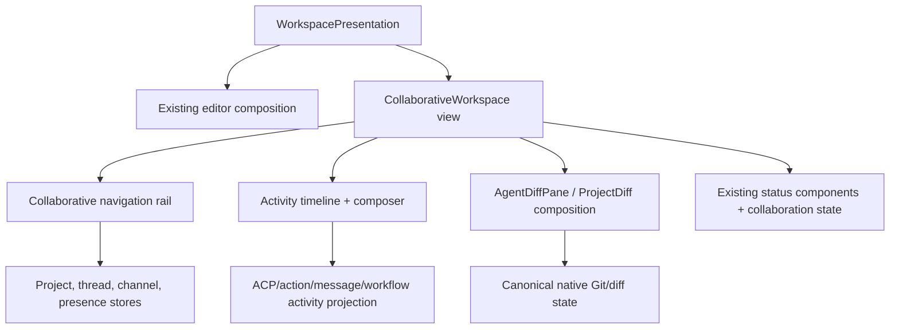
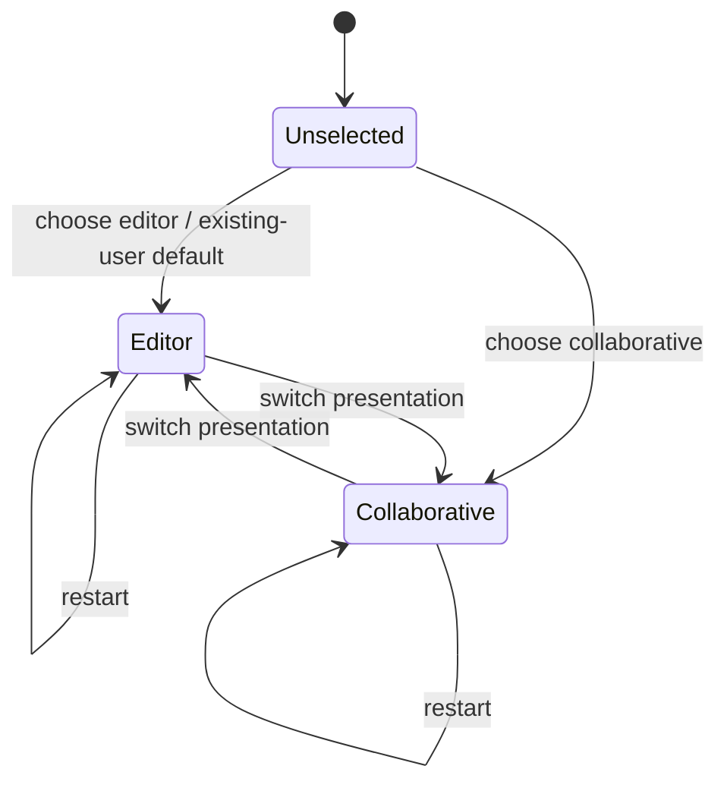

# Design: Collaborative Workspace and Buzz Consolidation

## Overview

The target is one Zed product with two native workspace presentations and one canonical owner per aggregate. Existing Zed workspace/project/Git/ACP components remain authoritative for local development. Buzz's signed-event collaboration semantics are ported into a UI-independent domain and service layer, while Nostr, existing Zed RPC, CLI, web, mobile and temporary legacy processes become adapters around that domain.

The transition is deliberately incremental. Milestone 1 ships a useful GPUI vertical slice without waiting for server consolidation. Later milestones add the canonical collaboration domain, protocol/service foundations and complete Buzz parity. A temporary Buzz-compatible service boundary is allowed only during migration; the final deployment owner is the Zed collaboration platform after ADR-001.

## Existing context

- `workspace`, `onboarding`, `sidebar` and `ui` already own GPUI windows, panes, docks, persistence, focus, themes and the first-run flow.
- `project`, `worktree`, `project_panel`, `git` and `git_ui` own local files, worktrees, repositories, index/working-tree state and native diff/review surfaces.
- `agent`, `acp_thread`, `action_log`, `agent_ui`, `agent_servers` and tool-permission stores own native agent execution, ACP sessions, transcripts, tool activity and cancellation. The approved ACP prompt-reentrancy spec remains binding.
- `channel`, `collab_ui`, `client`, `rpc`, `proto`, `session`, `livekit_client` and the `collab` service already implement accounts, channels, rooms, presence-like state, project sharing and production WebSocket/RPC/Postgres infrastructure.
- The existing `collab` binary uses Axum 0.6, SeaORM 1.1.10 and SQLx 0.8; Buzz currently uses Axum 0.8 and SQLx 0.9. Directly merging manifests before dependency alignment is unsafe, which motivates the bounded sidecar phase in `migration-plan.md`.
- Buzz's `buzz-core` is zero-I/O and contains the most complete audited signed-event/tenant rules. `buzz-relay` is the orchestration point around SQLx/Postgres, Redis, S3/Blossom, Git, workflows, audit, push and audio. Its desktop is React/Tauri and must not become a GPUI architecture template.
- Existing specs under `.agents/specs/goose-migration` and `.agents/specs/acp-thread-prompt-reentrancy` constrain agent infrastructure, tool permissions, prompt lifecycle and security. `telemetry-disabled-default` prevents Buzz-derived client code from re-enabling telemetry.

## Target architecture

The diagram shows logical ownership, not a requirement that all components run in one process. Adapters may be separate listeners or binaries; they cannot author independent domain state.

## Design decisions

### D1. Canonical domain by aggregate, not by legacy product

- **Responsibility:** Define commands, entities, stable IDs, state transitions, authorization inputs, projection events and versioning for communities, identities, channels/messages, shared projects/Git records, jobs, workflows, audit references, media/huddles and presence.
- **Integration:** The domain is UI-free and I/O-free. Existing Zed types remain canonical for local project/Git/ACP aggregates. Buzz-derived collaboration types are moved from `buzz-core` only where no suitable Zed type exists. Nostr encoding stays in a protocol adapter.
- **Rationale:** Neither current `proto` nor client-side `channel` is a suitable shared server/client domain owner, while copying `buzz-core` intact would preserve Buzz as a second product. A narrow collaboration-domain boundary is a justified new logical component.
- **Constraint:** Accepted ADR-001 fixes `collab` as the final service owner and permits only its documented bounded Nostr sidecar; implementation beyond the vertical slice must follow that dependency and removal boundary.

### D2. Provenance-aware authoritative records

Each aggregate declares one authoring source:

| Aggregate | Authority | Derived/compatibility state |
| --- | --- | --- |
| Local files/worktrees/index/diffs | Zed `project`/`worktree`/`git` | NIP-34 patches/status and timeline cards |
| Native ACP session/transcript/actions | `agent`/`acp_thread`/`action_log` | NIP-AO frames, channel messages and activity projections |
| Nostr-authored channel/message/social/workflow records | Verified signed event log | SQL search/timeline/member/read projections and GPUI stores |
| Service-issued membership, summaries and bounds | Authorized collaboration service | Relay-signed event representation and RPC payloads |
| Service account | Zed user/account service | Explicit Nostr-key bindings |
| Collaboration keys | Zed credentials provider | Pairing/backup/import formats |

Projection rows carry `source_kind`, `source_id`, `source_version`, `community_id` and `projected_at`. A projection cannot accept a direct write that bypasses its command/event authority. Drift checks rebuild or compare projections from authoritative records.

Projection checkpoints preserve the domain provenance vocabulary as bounded source system, record ID, optional source version, observation time and paired integrity reference; they add a projection-local version, reset generation, opaque 64-KiB resume cursor, projected time and closed drift state with optional authoritative/projection hashes. The community-leading source key is immutable and protected by forced RLS with the common restrictive tenant predicate. Every update must advance `projection_version` by exactly one or PostgreSQL raises a serialization failure, preventing a stale worker from overwriting a newer checkpoint even if it omitted a defensive version predicate. A reset may hold or increment its generation by one; an increment must atomically enter `reset_pending`, clear the cursor and record reset time, fencing pre-reset workers. Diverged state requires two distinct 32-byte hashes, clean state cannot retain an error, and all scan/source indexes lead with community. The rebuild orchestrator installs that tenant fence, loads bounded authoritative rows through an aggregate adapter, deterministically sorts and length-prefix-hashes source identity, source version, row count, row keys and payloads, replaces only the selected derived aggregate, reads it back and records equal clean hashes or unequal drift hashes plus a bounded content-free summary. Authority reads, projection replacement, comparison and checkpoint upsert share one transaction; adapter or storage failure rolls back the projection and checkpoint without an authority write. Re-running the same source therefore produces identical projection bytes and hashes while advancing only the optimistic checkpoint version. <!-- impl: crates/collab/migrations/20260820000300_collaboration_projections.up.sql --> <!-- impl: crates/collab/src/db/collaboration/rebuild.rs#ProjectionRebuilder --> <!-- impl: crates/collab/tests/collaboration_projection_rebuild.rs#collaboration_projection_rebuild_is_deterministic_and_does_not_mutate_authority -->

The UI-free `collaboration_domain` foundation represents canonical aggregate identity as an explicit community, aggregate type and UUID tuple; sharing a raw aggregate UUID across communities does not make the identities equal. Deterministic UUIDv5 import IDs preserve stable compatibility references without granting authority, while strictly positive ordered aggregate versions and bounded source provenance retain source system, record/version, observation and optional integrity metadata. These types perform no I/O, protocol decoding, authorization or GPUI work. <!-- impl: crates/collaboration_domain/src/identity_types.rs#ScopedAggregateId --> <!-- impl: crates/collaboration_domain/src/provenance.rs#Provenance -->

The lower-layer dependency contract is executable. `collaboration_domain` and `nostr_compat` declare their architectural layer, exact non-dev direct-dependency allowlist and the GPUI, storage and transport capability classes they forbid. The boundary checker includes normal and build dependencies, ignores dev-only fixture tooling, requires exact allowlist agreement and traverses locked Cargo metadata so an indirect forbidden package fails as decisively as a direct dependency. <!-- impl: script/check-collaboration-dependencies -->

### D3. Protocol adapters preserve exact wire behavior

- **Nostr:** The adapter owns event serialization, signing/verification, kind/tag validation, filter translation, NIP-01 frames, NIP-11/05, NIP-42/98, NIP-CW cursors/overlays and all Buzz NIPs. It calls domain commands only after admission/auth. It may return signed compatibility projections without changing domain ownership.
- **Zed RPC:** Existing clients continue through `client`/`rpc`/`proto`. New collaborative RPC messages carry domain IDs and versions rather than Nostr JSON where no compatibility is required.
- **ACP/MCP:** Zed's native ACP runtime remains authoritative. Channel mentions, NIP-AO frames and signed jobs translate into session/job commands. MCP tools remain subject to Zed permissions and sandbox policy.
- **Git:** Git smart HTTP and NIP-34 translate hosted-repository operations and signed review records. Local repository state is never reconstructed from a chat projection.

Unknown versions fail before writes. Compatibility adapters are independently tested against Buzz fixtures and old clients.

The Zed-owned command boundary carries one current contract version, stable operation ID, admitted tenant and principal, optimistic expected/predecessor versions, originating adapter and typed payload. Its receipt reports the authoritative version and an applied-or-duplicate disposition, allowing adapters to preserve idempotent protocol acknowledgements without an adapter-owned replay store. A `DomainCommandSink` is the only mutation-facing listener interface; its Postgres implementation owns the transaction around the injected canonical mutation, durable receipt and outbox operation. The Nostr ingress accepts only the current bounded adapter version, rejects invalid peer minimums before invoking the sink and consumes the existing admission token to construct the command. In-process and temporary-sidecar origins remain explicit for compatibility metrics, but both call the same sink contract; neither origin receives storage, migration or projection authority. <!-- impl: crates/collab/src/collaboration_command.rs#DomainCommand --> <!-- impl: crates/collab/src/collaboration_command.rs#DomainCommandReceipt --> <!-- impl: crates/collab/src/nostr/ingress.rs#VersionedNostrIngress --> <!-- impl: crates/collab/src/db/collaboration/outbox.rs#TransactionalCommandOutbox -->

NIP-42 connection authentication is a terminal state machine over one redacted 32-byte challenge and five-second response deadline. It verifies kind 22242 event ID, signature and ±60-second freshness through `nostr_compat`, requires exactly one matching challenge and normalized relay tag, optionally verifies one NIP-AA owner attestation, then atomically claims a community/event replay key before resolving a current authorized principal. The injected resolver owns active membership, binding and revocation reads; its output must remain in the row-zero tenant, match the event author and retain NIP-42 provenance. Success retains the actual key principal; timeout closes without a response, same-connection reauthentication and post-failure attempts preserve Buzz's closed reasons, and invalid, restricted or infrastructure outcomes map to bounded protocol dispositions without persisting or logging the AUTH event. The replay and resolver traits deliberately have no permissive default: Task 16.1 supplies shared expiring runtime storage and the membership repositories supply authoritative identity decisions. <!-- impl: crates/collab/src/nostr/auth.rs#NostrConnectionAuthenticator --> <!-- impl: crates/collab/src/nostr/auth.rs#NostrAuthReplayStore -->

REQ, COUNT and CLOSE parsing is bounded before any query or resource allocation: frames are at most 512 KiB, identifiers at most 256 bytes, requests at most ten filters, filter fields retain `nostr_compat` bounds and query limits clamp to 1,000 results per filter. An authenticated subscription session fixes one tenant, principal and connection ID; injected query and resource interfaces must consume that scope rather than reconstruct it from client data. REQ activates or generation-replaces at most 1,024 subscriptions, emits bounded historical EVENT frames followed by EOSE, and removes the active resource before a query failure is surfaced as CLOSED. COUNT never registers a live subscription and sees only the session tenant. CLOSE, connection cancellation and replacement release their exact resource tokens; failed release remains observable. These interfaces deliberately have no store or pub/sub default because Task 15.2 owns the event repository and Task 16.1 owns shared realtime fanout. <!-- impl: crates/collab/src/nostr/subscriptions.rs#NostrSubscriptionSession --> <!-- impl: crates/collab/src/nostr/subscriptions.rs#NostrSubscriptionQuery -->

EVENT ingest bounds and structurally parses one NIP-01 envelope, normalizes its compatibility representation to signed fields, and performs ID/signature, 256-KiB content, 512-KiB canonical-event and ±15-minute timestamp verification on the blocking executor. Malformed and cryptographically invalid events receive Buzz-compatible negative OK frames before a write. Except for NIP-59 gift wraps, the signed author must be the authenticated direct/bound Nostr key or owner-attested agent key; AUTH events cannot re-enter through EVENT. An accepted event becomes one typed command through the versioned ingress, with an operation ID deterministically derived from the trusted community and event ID. Applied and duplicate receipts map to exact positive OK/empty and OK/`duplicate:` frames; policy rejection and infrastructure failure map to bounded restricted/error responses. No adapter replay cache or event store exists at this boundary. <!-- impl: crates/collab/src/nostr/event_ingest.rs#NostrEventIngress --> <!-- impl: crates/collab/src/nostr/event_ingest.rs#NostrEventCommand -->

The native Nostr HTTP boundary owns an Axum router for content-negotiated `/`, `/info` and `/.well-known/nostr.json` plus a reusable NIP-98 authenticator for protected HTTP handlers. Only a canonical direct or explicitly trusted-forwarded Host may resolve a tenant; `X-Forwarded-Host`, request bodies and signed tags cannot select one. NIP-11 advertises the limits enforced by the WebSocket adapter and includes only bounded deployment metadata plus an optional same-tenant icon; unmapped hosts and directory outages receive the same generic document without tenant data. NIP-05 lowercases and bounds local names, performs one tenant-scoped directory read and returns the standard empty response for malformed, missing, foreign or unavailable records. NIP-98 decodes a bounded `Nostr` header, uses the shared signed-event parser and blocking verifier, requires kind 27235, ±60-second freshness, exact tenant-derived URL and method tags, and a matching body hash when present or required. It then atomically claims the tenant/event replay key for 120 seconds and resolves a current same-tenant NIP-98 principal. Host, signature, expiry, payload, replay, revocation and infrastructure failures all fail closed. Host/directory/replay/principal traits have no permissive defaults; production mounting waits for their canonical implementations rather than introducing a local directory or replay store. <!-- impl: crates/collab/src/nostr/http.rs#router --> <!-- impl: crates/collab/src/nostr/http.rs#Nip98Authenticator -->

Reconnect compatibility is connection-scoped: a replacement connection completes a fresh NIP-42 challenge, refetches the authoritative head and older cursor window independently, and rearms each live subscription against its new connection identifier. A failed older-window query closes and releases only that subscription while a successful head reaches EOSE and remains live, preserving the last trustworthy scope instead of collapsing freshness into one global boolean. A publish whose outcome was uncertain may be replayed with the same signed event; its community-and-event operation ID and positive `duplicate:` acknowledgement let the client replace the optimistic item and any historical/live echo by event ID. This is the adapter contract only: Task 15.4 must enforce the operation receipt transactionally and Task 16.1 must suppress duplicate local fan-out across replicas before production mounting. <!-- impl: crates/collab/tests/nostr_reconnect.rs#nostr_reconnect_reauthenticates_refetches_windows_and_rearms_subscriptions --> <!-- impl: crates/collab/tests/nostr_reconnect.rs#nostr_reconnect_reconciles_an_optimistic_event_without_a_duplicate_echo -->

The canonical signed-event table is owned by `collab` and keyed by `(community_id, event_id)` across sixteen community-hash partitions, so one signed event may be admitted independently to different communities without a global deduplication leak. Forced row-level policy with the common restrictive tenant predicate is installed on the partitioned parent and every directly addressable partition; an absent or mismatched `app.community_id` yields no access. The record retains full-range unsigned Nostr time as `numeric(20,0)`, bounded parsed fields, the exact canonical signature-input bytes, 64-byte signature and live-or-historical verification provenance. Accepted rows are update-immutable, while explicit deletion remains available to the later retention/deletion authority. Ephemeral classification is not a storable state. Community-leading chronological, kind, author-kind and addressable indexes preserve greatest-time then lowest-event-ID head selection without a second head store. The reversible SQLx migration pair is checksum-covered and does not run a production migration by itself. <!-- impl: crates/collab/migrations/20260820000100_collaboration_events.up.sql --> <!-- impl: crates/collab/tests/collaboration_event_migration.rs#collaboration_event_schema_preserves_bytes_and_head_order -->

The event repository accepts only a typed record whose event ID and Schnorr signature have passed `nostr_compat` verification under a state-matched policy: historical provenance requires the historical policy and live provenance requires an explicit bounded timestamp policy. Every transaction sets the admitted community as PostgreSQL's local row-zero tenant before reading or writing. Its write method additionally requires an opaque kind-bound persistence decision from the common policy boundary, so callers cannot substitute a public decision for private content. Ephemeral events return a non-persisted disposition before opening a transaction. Regular events insert once by community and event ID. Replaceable events first advance a durable coordinate watermark using greatest timestamp then lowest ID; an older candidate or exact deleted head is stale and never inserted, while an exact live candidate reaches the normal duplicate path. Visible filter queries return regular rows plus only each watermark's live addressable row, apply at most ten validated OR filters and 1,000 results in SQL, and preserve deterministic time/ID order; exact lookup remains available for retained authority and audit. Deletion clears a matching live pointer before physically removing immutable bytes, leaving the head order as a tombstone floor so older signed values cannot reappear. Returned rows are re-bound to the requested community and canonical bytes/ID before use. <!-- impl: crates/collab/src/db/collaboration/event_repository.rs#EventRepository --> <!-- impl: crates/collab/src/db/collaboration/event_repository.rs#query_statement -->

The event persistence policy resolves only cataloged relay kinds, retaining the deliberately defined-but-unused standard kind while excluding the internal media-upload application kind. Ephemeral kinds are always transient and search-excluded regardless of later delivery authorization. Durable private kinds require explicit adapter-supplied evidence for every catalog gate: author-only, recipient, result-reader and author-or-explicitly-shared compose without one gate satisfying another. Accepted private material can enter only an authorization-scoped index; it is never eligible for community search. Public kinds may enter the community index. The resulting decision carries its event kind in private state and exposes no payload, author, recipient or search text; policy errors are content- and kind-neutral. The repository revalidates the exact kind before any transaction, while the authorization layer remains responsible for deriving—not trusting—admission evidence from current principal and event semantics. <!-- impl: crates/collab/src/db/collaboration/persistence_policy.rs#EventPersistencePolicy --> <!-- impl: crates/collab/tests/collaboration_persistence_policy.rs#collaboration_persistence_policy_keeps_ephemeral_events_out_of_sql_and_search -->

The initial `nostr_compat` event boundary encodes the NIP-01 signature preimage as the exact compact UTF-8 JSON array `[0,pubkey,created_at,kind,tags,content]` and hashes those bytes with SHA-256. Public keys and event IDs admit only exact-length lowercase hexadecimal representations, timestamps remain unsigned 64-bit values and kinds remain unsigned 16-bit values. The adapter exposes canonical bytes and IDs without signing, key custody, verification, authorization, persistence or domain mutation; those remain separate downstream boundaries. <!-- impl: crates/nostr_compat/src/event.rs#CanonicalEvent::canonical_bytes --> <!-- impl: crates/nostr_compat/src/event.rs#CanonicalEvent::event_id -->

Signed-event verification remains a pure CPU boundary: it rejects content above 256 KiB and canonical preimages above 512 KiB before cryptography, applies an explicit historical-or-bounded timestamp policy, recomputes and compares the event ID, parses an x-only secp256k1 public key and verifies the BIP-340 Schnorr signature over the 32-byte ID. Historical import deliberately has no freshness window, while live admission supplies its policy; neither path can access signing keys or authorize/persist an event. <!-- impl: crates/nostr_compat/src/verification.rs#verify_signed_event -->

Filter evaluation validates at most ten OR-ed filters before matching; fields within a filter are AND-ed, event-ID prefixes are canonical lowercase hex, authors are exact keys, time bounds are inclusive and generic tag values are bounded. Buzz's stored-channel `#h` fallback applies only when the event carries no explicit `h` tag, so derived channel scope cannot override signed scope. Persistence classification separates regular, NIP-16 replaceable, ephemeral and NIP-33 parameterized-replaceable ranges. Replacement coordinates require exactly one `d` tag for NIP-33 events, reject mixed-coordinate selection and deterministically choose greatest `created_at` then lowest event ID. The same owned order key survives deletion as a tombstone/watermark floor, preventing an older signed value from being resurrected while permitting a genuinely newer value. <!-- impl: crates/nostr_compat/src/filter.rs#filters_match --> <!-- impl: crates/nostr_compat/src/head.rs#select_head --> <!-- impl: crates/nostr_compat/src/head.rs#HeadOrder -->

The frozen protocol catalog generates the native event-kind registry rather than allowing a second handwritten number table. Each of the 133 event kinds carries typed persistence, replacement, privacy and registration metadata; overlapping Buzz privacy controls remain combinable flags, and the internal media-upload application event remains distinguishable from relay events. Generation compares every scalar source constant and all four range boundaries against the catalog, rejects additions without a catalog classification, preserves the catalog's one deliberate `defined-unused` kind and formats deterministic Rust for drift checks. <!-- impl: crates/nostr_compat/src/generated_kinds.rs#EVENT_KINDS --> <!-- impl: .agents/specs/collaborative-workspace/scripts/generate-kind-registry.py#validate_inputs -->

Identity compatibility uses typed NIP-OA attestations, NIP-AA authentication presentations and NIP-IA requests, relay deltas and snapshots. OA conditions preserve their exact signed byte string while exposing parsed canonical clauses; full event provenance evaluates every clause, AA admission deliberately ignores `kind=` while evaluating timestamp clauses, request-borne IA owner proof evaluates timestamp clauses against the request, and latest-profile IA proof can pass no timestamp so it acts as the standing ownership declaration defined by NIP-IA. IA codecs enforce one protected marker and target, action-specific replacement rules, consent actor constraints, distinct request/proof references and bounded reason/content fields; snapshot parsing ignores invalid member entries as required while retaining valid relay-scoped identities. These codecs verify cryptographic ownership evidence but do not grant membership, mutate archive state or trust a relay signer; those remain authorization and reducer responsibilities. <!-- impl: crates/nostr_compat/src/buzz_nips/identity.rs#OwnerAttestation --> <!-- impl: crates/nostr_compat/src/buzz_nips/identity.rs#AgentAuthentication --> <!-- impl: crates/nostr_compat/src/buzz_nips/identity.rs#IdentityArchiveRequest --> <!-- impl: crates/nostr_compat/src/buzz_nips/identity.rs#IdentityArchiveDelta -->

Agent-configuration compatibility separates public NIP-AP projections from the private NIP-PMA aggregate. Persona projections enforce the plaintext slug grammar, content cap, explicit secret-field prohibition and exact absent-or-`shared=true` privacy gate; team catalogs use their distinct bounded coordinate grammar and recursively reject known private/local-only fields. Kind 30177 accepts both slim definition-linked content and legacy fat content without choosing field authority at the wire boundary. PMA validates a signed owner-authored outer envelope before ciphertext use, with exact tag grammar, positive safe generation, predecessor-at-generation-two CAS shape and active/deleted state. Strict decrypted-v1 parsing rejects duplicate/unknown core fields, validates RFC3339 bookkeeping, nsec checksum/key derivation, unconditional owner attestation, portable-field bounds, tombstone shape, signed 30175/30177 recovery IDs/signatures/coordinates and exact content hashes. Relay ingest is a compile-time false capability until the later privacy and transactional gates land; this module neither encrypts/decrypts NIP-44 bytes nor owns keys, persistence or aggregate submission. <!-- impl: crates/nostr_compat/src/buzz_nips/agent_config.rs#PersonaProjection --> <!-- impl: crates/nostr_compat/src/buzz_nips/agent_config.rs#PrivateManagedAgentEnvelope --> <!-- impl: crates/nostr_compat/src/buzz_nips/agent_config.rs#PrivateManagedAgentPayload -->

Agent activity compatibility keeps all NIP-44 content opaque at the wire boundary. NIP-AE derives the symmetric v2 conversation key from raw ECDH x-coordinate plus the `nip44-v2` HKDF-extract salt, blinds valid `core`/`mem/...` slugs with the versioned HMAC domain and validates a signed agent-authored envelope before accepting decrypted strict JSON or matching the body back to its coordinate. NIP-AM accepts only signed agent-authored, channel-free, owner-result-gated envelopes; decrypted metrics preserve absent-versus-zero counters, reject explicit-null cache/pricing fields, require cumulative correlation, constrain costs and billing identities and map future stop reasons to unknown. NIP-AO accepts signed ephemeral telemetry/control envelopes, enforces direction shape, exposes recipient-only visibility, treats future frame/control types as ignored and redacts kind-specific payload values from debug output. Encryption/decryption, zeroization and durable memory services remain the separately planned Task 30.1 boundary rather than being coupled to these pure codecs. <!-- impl: crates/nostr_compat/src/buzz_nips/agent_activity.rs#nip44_conversation_key --> <!-- impl: crates/nostr_compat/src/buzz_nips/agent_activity.rs#EngramEnvelope --> <!-- impl: crates/nostr_compat/src/buzz_nips/agent_activity.rs#AgentTurnMetricEnvelope --> <!-- impl: crates/nostr_compat/src/buzz_nips/agent_activity.rs#ObserverEnvelope -->

Communication-state compatibility keeps relay computation, durable scheduling and encrypted-content custody outside the wire codec. NIP-CW parses the opt-in filter only when `top_level` is exactly true, preserves the composite timestamp/event-id cursor, clamps row budgets and binds cryptographically verified relay overlays to the exact request cursor and channel. NIP-DV accepts only relay-authored snapshots whose `d` and `p` viewer agree with the authenticated reader, then exposes hidden channels as a set without changing membership. NIP-ER validates signed author-only addressable envelopes, canonical schedule/expiration tags and strict decrypted reminder bodies while leaving due delivery and NIP-44 to their later owners. NIP-RS validates one stable installation coordinate, preserves last-value duplicate-context compatibility, escape/unescape semantics, complete-or-tombstone override groups, componentwise-max convergence, primary-coordinate confinement, clear-wins canonical publication and checked counter exhaustion. It deliberately does not claim the full-state enumeration barrier, persistence, notifications or encryption responsibilities planned in later milestones. <!-- impl: crates/nostr_compat/src/buzz_nips/communication.rs#ChannelWindowRequest --> <!-- impl: crates/nostr_compat/src/buzz_nips/communication.rs#DmVisibilitySnapshot --> <!-- impl: crates/nostr_compat/src/buzz_nips/communication.rs#ReminderEnvelope --> <!-- impl: crates/nostr_compat/src/buzz_nips/communication.rs#ReadStateEnvelope --> <!-- impl: crates/nostr_compat/src/buzz_nips/communication.rs#OverrideRegister -->

The canonical read-state aggregate consumes only adapter-validated replicas decrypted for their owning principal and binds them to one community-and-owner scope; foreign owners and communities cannot merge or inspect state, and diagnostics expose counts rather than context identifiers. Frontiers and manual-unread registers join by componentwise maximum, parent frontiers participate only in effective-state evaluation, and clear wins counter ties. A potentially incomplete NIP-RS load may be merged for conservative reads but cannot advance, override or publish state; reconnect can only restore mutation authority by replacing it with a newly complete aggregate. Canonical publication co-locates every override with its frontier, emits live triples or permanent counter-floor tombstones, and refuses counter wrap. NIP-44 encryption, relay enumeration/fencing, persistence and key custody remain adapter/service responsibilities. <!-- impl: crates/collaboration_domain/src/read_state.rs#ReadState --> <!-- impl: crates/collaboration_domain/src/read_state.rs#OwnerReadStateReplica -->

Local collaborative message drafts are persisted only in Zed's native SQLite key-value store and never enter an event, outbox, relay or server-owned aggregate. Each store instance is fixed to one canonical principal, with independent namespaces for the canonical community and channel and exact keys for either the channel composer or a canonical thread-root event. Loads are synchronous for composer restoration, writes and deletion are asynchronous and error-reporting, whitespace-only content clears the exact draft, and channel deletion clears that channel's namespace without touching another channel, community or account. The stored document is strictly versioned, unsent content is redacted from diagnostics, and constructing a new store over the same database restores offline drafts without granting any server authority. <!-- impl: crates/collab_ui/src/draft_store.rs#DraftStore --> <!-- impl: crates/collab_ui/src/draft_store.rs#DraftLocation -->

The canonical reminder aggregate consumes only NIP-ER replicas already signature-checked, decrypted and bound to their owning principal by an adapter, then scopes them to one community and owner. Heads converge by NIP-01 replacement ordering, including the lowest-event-id tie break, while local create/update/dismiss operations preserve pending schedule shape and the 30–90 day terminal cleanup window used by Buzz. Due polling enforces `not_before` against the local clock even after an early relay signal, persists the handled head so restart and duplicate delivery cannot notify it twice, retries temporarily unavailable targets and permanently suppresses reminders whose target or own retention window has expired. Target visibility/expiry is an explicit input from the canonical authorization and retention owner and cannot grant access. Records and diagnostics redact the private identifier, target, note, schedule and handled event. Encryption, relay enumeration, persistence, timers, native notification policy and terminal-event publication remain adapter/service responsibilities. <!-- impl: crates/collaboration_domain/src/reminder.rs#Reminder --> <!-- impl: crates/collaboration_domain/src/reminder.rs#OwnerReminderReplica -->

Direct-message compatibility admits only a cryptographically verified NIP-59 kind-1059 outer envelope with exactly one canonical `p` recipient and a canonical bounded NIP-44 v2 ciphertext. The wire codec intentionally has no plaintext or key-custody input: ciphertext can be exposed only through an explicit wire accessor, while debug output is redacted and indexing is unconditionally excluded. Filter admission treats kindless filters as capable of matching gift wraps and therefore requires one exact self-`#p`; result admission independently requires the authenticated reader to equal the signed outer recipient. This preserves Buzz's supported opaque gift-wrap boundary without claiming NIP-44 encryption, decryption, DM membership or persistence authority. <!-- impl: crates/nostr_compat/src/dm.rs#GiftWrapEnvelope --> <!-- impl: crates/nostr_compat/src/dm.rs#authorize_gift_wrap_filters -->

Project and workflow compatibility separates signed representation from authority and execution. NIP-GS accepts only the exact three-line LF armor and canonical compact v1 JSON, bounds base64, decoded envelope and Git payload bytes, binds timestamp plus optional NIP-OA bytes into the domain-separated hash and verifies the commit signature independently from the reported owner-attestation status. NIP-MP validates signed project coordinates against the shared Buzz ingest fixtures, preserves colon-bearing repository discriminators and opaque relay hints, treats unknown visibility as listed, and never converts grouping into repository ownership or push authority. NIP-WP validates the signed image-only mutation value and clear shape but leaves admin/owner admission, community persistence and public NIP-11 projection with their canonical service owners. Git CLI invocation, secret-key loading/zeroization, project folding, exhaustive enumeration, workflow execution and workspace-profile authorization therefore remain outside this pure codec boundary. <!-- impl: crates/nostr_compat/src/buzz_nips/project_workflow.rs#GitSignatureEnvelope --> <!-- impl: crates/nostr_compat/src/buzz_nips/project_workflow.rs#compute_git_signing_hash --> <!-- impl: crates/nostr_compat/src/buzz_nips/project_workflow.rs#ProjectEnvelope --> <!-- impl: crates/nostr_compat/src/buzz_nips/project_workflow.rs#WorkspaceProfileCommand -->

Push-lease compatibility treats NIP-PL as an expiring, author-private authorization document rather than a notification payload. The signed outer codec closes public tags to `d`, `expiration`, `exec` and optional `alt`, binds the authenticated author, enforces descriptor content/lifetime limits and never uses encrypted origin data for tenant selection. Strict decrypted v1 parsing rejects duplicate or unknown fields at every depth, separates complete active leases from minimal inactive tombstones, requires positive safe generations and byte-equal server-resolved origins, and validates app-profile transport binding plus bounded subscription/filter grammar. Positive filters must be narrowed by self-`#p`, exact authors or descriptor-grammar channels, use only eligible kinds and registered urgency, while ignore filters may only subtract. This boundary neither decrypts NIP-44 nor owns replacement watermarks, persistence, matching, outbox, fixed wake bodies, gateways, platform tokens, notification policy or provider delivery. <!-- impl: crates/nostr_compat/src/buzz_nips/push_lease.rs#PushLeaseEnvelope --> <!-- impl: crates/nostr_compat/src/buzz_nips/push_lease.rs#PushLeasePlaintext --> <!-- impl: crates/nostr_compat/src/buzz_nips/push_lease.rs#LeaseFilter --> <!-- impl: crates/nostr_compat/src/buzz_nips/push_lease.rs#PushLeasePolicy -->

### D4. One tenant context and authorization policy

Every ingress constructs an immutable `TenantContext` from trusted host/listener/deployment routing. Authentication yields a typed principal: Zed account, Nostr key, owner-attested agent, scoped token or service. A common policy evaluates community membership, role, channel membership, resource ownership, scopes and delegation conditions. Storage, search, cache, pub/sub, object and Git keys require the typed community value rather than accepting a raw client identifier.

`TenantContext` has private fields and no default or deserialization path. It can be established only from a bounded `TrustedTenantRoute` branded as a direct host, trusted forwarded host, listener or deployment route; transport admission owns the corresponding catalog/proxy validation before creating that record. Channel mappings, token stamps, signed URLs, event tags and body fields are modeled separately as untrusted claims. They may corroborate the row-zero community but an absent trusted route or any conflict returns the same closed error text and produces no context. The context retains route class and a bounded canonical reference for later audit without exposing a payload constructor or tenant fallback. <!-- impl: crates/collaboration_domain/src/tenant.rs#TenantContext --> <!-- impl: crates/collaboration_domain/src/tenant.rs#TrustedTenantRoute -->

Successful authentication normalizes into one non-deserializable `AuthenticatedPrincipal` containing the row-zero community, a stable principal ID, one explicit kind and an explicit bounded scope set. Zed service accounts, direct or account-bound Nostr identities, owner-attested agents, scoped tokens and internal services remain distinct kinds. A direct Nostr proof does not imply a Zed account; account/profile metadata is attached only by hydrating an active verified binding from the same community. An agent principal requires a validated agent profile with matching owner-attestation provenance, and retains the actual agent author plus proof rather than substituting the owner. Token and service scopes preserve known and bounded forward-compatible values exactly, deduplicate them deterministically and never synthesize unrestricted access. <!-- impl: crates/collaboration_domain/src/principal.rs#AuthenticatedPrincipal --> <!-- impl: crates/collaboration_domain/src/principal.rs#PrincipalScopes -->

The common policy is a pure domain decision over the tenant, authenticated principal, required scope, typed resource, current versioned membership facts and optional exact delegation. It rejects tenant disagreement and missing scope first; scoped tokens act only as their recorded subject. Community and channel membership must be active and match separately supplied current versions, so stale cached roles fail closed. Channel-shaped resources cannot omit their channel coordinate, community owners do not bypass channel membership, bots have no implicit role hierarchy, and resource ownership never bypasses community membership, scope, or community/administration role gates. A non-revoked, unexpired delegation may grant exactly one action on one resource to one delegate at the current membership version; later admission-evidence work owns how that grant is verified and loaded. <!-- impl: crates/collaboration_domain/src/authorization.rs#authorize -->

Admission evidence narrows verified credential state into common-policy inputs without taking ownership of cryptography or durable concurrency. A scoped-token admission rejects expiry, revocation, scope widening, cross-tenant/token replay evidence, stale challenge versions and consumed challenges; success returns the scoped principal plus a next-version consumed challenge that the adapter must commit atomically before use. Bounded invite evidence rejects stale, revoked, expired and exhausted claims, increments only a new member's use count and leaves an existing member retry idempotent; the canonical repository must serialize and atomically persist the returned evidence and membership. NIP-AA derives a connection-lifetime membership snapshot only from an owner-attested agent and a current active owner membership. The snapshot identifies the agent, grants only relay-level member semantics, retains owner identity for quota/termination and never persists a membership row or inherits owner channel/admin privileges. Signature verification, bearer hashing, challenge issuance and repository compare-and-swap remain in their protocol and persistence adapters. <!-- impl: crates/collaboration_domain/src/admission_evidence.rs#ScopedTokenEvidence --> <!-- impl: crates/collaboration_domain/src/admission_evidence.rs#InviteAdmissionEvidence --> <!-- impl: crates/collaboration_domain/src/admission_evidence.rs#VirtualAgentMembershipEvidence -->

Tenant-scoped Zed RPC handlers enter through `collab::tenant_admission`: row-zero route binding maps every missing/payload-selected/conflicting tenant failure to one denial, then policy authorization must produce an owned `AuthorizedRpcRequest` before a database or handler closure can run. The token carries only the admitted tenant and principal and executes the supplied operation exactly once. Existing editor-only RPC remains on its current service-account session until an explicit community mapping exists; it is not assigned a fabricated default tenant. New Collaborative Workspace RPC surfaces cannot use that legacy path. <!-- impl: crates/collab/src/tenant_admission.rs#AuthorizedRpcRequest -->

The independent conformance checker remains unable to depend on production tenant or authorization reducers. Its trace format is extended at adapter seams only.

### D5. Persistence convergence

The transition starts with Buzz SQLx migrations and Zed SeaORM tables intact but fenced within one tenant model. Target storage uses one Postgres deployment and one migration authority; exact table consolidation is aggregate-specific:

- Preserve the signed `events` log and replacement/visibility indexes required by Nostr interoperability.
- Preserve Zed project/worktree/editor/ACP databases for their canonical local aggregates.
- Consolidate overlapping channel/member/room/user projection tables only after backfill and differential-read evidence.
- Keep Redis state derived and expiring; it is never migration authority.
- Preserve S3/Blossom objects and content hashes; rewrite metadata pointers only after verification.

All schema changes have forward/backward compatibility windows and checksums. Dual writes use an outbox with stable operation IDs, not two unrelated transactions. See `migration-plan.md`.

The Buzz signed-event importer is a bounded, migration-only writer into the canonical event log rather than a runtime event repository. It reconstructs the exact NIP-01 signature-input bytes from Buzz's stored fields, verifies the event ID and Schnorr signature under historical timestamp policy, rejects ephemeral source rows and binds every batch to one typed community before database I/O. Within one tenant-fenced transaction it inserts immutable historical rows idempotently, compares every conflict against the stored ID, canonical bytes and signature, and rebuilds addressable watermarks by greatest timestamp then lowest event ID. A deleted winning source row leaves a null live pointer while retaining the order floor. Source and read-back target hashes cover the ordered source sequence, ID, canonical bytes and signature; overlapping retry windows therefore prove equality instead of advancing a second authority. Checkpoint persistence remains owned by the migration checkpoint repository, so a crash between the event commit and checkpoint update safely replays as verified duplicates. <!-- impl: crates/collab/src/migration/buzz/events.rs#BuzzEventImporter --> <!-- impl: crates/collab/tests/buzz_event_import.rs#buzz_event_import_preserves_signed_bytes_heads_and_interruption_idempotency -->

Canonical community projections use community-leading keys for communities, community memberships, join-policy acceptances, channels, invites and channel memberships; the trusted routing host remains deliberately unique across the deployment. Memberships bind canonical principal UUIDs rather than treating Buzz public keys as a second identity authority; the migration adapter retains the exact Buzz row key and version in source provenance. Channels preserve Buzz's stream/forum/DM/workflow types while reserving the approved native ephemeral/huddle types, and every role, lifecycle, visibility, TTL, use limit and version has a database bound. Community-composite foreign keys prevent cross-tenant creators, members, channels or invites even before policy evaluation. Every table carries bounded source system/record/version/observation/integrity fields and a tenant-leading provenance index. A named permissive candidate policy is paired with a restrictive `app.community_id` policy because PostgreSQL otherwise denies all rows when only restrictive policies exist; the restrictive policy remains the effective forced-RLS tenant fence for the non-bypass request role. The migration is reversible without cascade and does not copy into Zed's incompatible legacy integer channel tables. <!-- impl: crates/collab/migrations/20260820000700_collaboration_channels.up.sql --> <!-- impl: crates/collab/tests/collaboration_channel_migration.rs#collaboration_channel_schema_enforces_live_tenant_isolation_and_rolls_down -->

Community-state import consumes a frozen Buzz schema-v30 snapshot after the checksummed Buzz source migrations have normalized any older deployment; unsupported or future shapes fail before target I/O and the untouched source remains rollback authority. Each bounded, strictly sequenced batch is fixed to one typed community and carries already-resolved canonical principal IDs plus the original Buzz public-key identity in its integrity input. The adapter validates community/channel/member/invite enums, bounds, timestamps, use counts, TTL pairs, UUIDs and lowercase key/policy encodings before opening a transaction. It inserts community, membership, policy acceptance, channel, invite and channel-membership rows in source dependency order without updating existing authority. Every target row stores `buzz`, the exact table/key source identity, schema version `30`, observation time and SHA-256 of the complete normalized source record. A conflict is accepted only when that provenance hash matches; otherwise the batch rolls back as divergence. Batch source and read-back target hashes include source sequence plus each row hash, making an overlapping post-crash window idempotent while retaining exact aggregate and membership versions for the external checkpoint owner. <!-- impl: crates/collab/src/migration/buzz/community_state.rs#BuzzCommunityStateImporter --> <!-- impl: crates/collab/tests/buzz_community_state_import.rs#buzz_community_state_import_preserves_versions_and_resumes_idempotently -->

Every canonical collaboration table that uses a restrictive community policy also declares one explicit permissive candidate policy. PostgreSQL ORs permissive policies first and then ANDs restrictive policies; a restrictive-only policy set admits no candidate rows even when `app.community_id` matches. The permissive policy is intentionally content-free (`true`) and grants nothing on its own because normal SQL privileges still apply and the forced restrictive community predicate must also pass. A catalog regression test covers identity, event parent/partitions, addressable heads, projection checkpoints, receipts/outbox, search documents and migration run/checkpoint tables, and a NOBYPASSRLS role proves same-tenant writes succeed while foreign reads/writes remain closed. <!-- impl: crates/collab/tests/collaboration_rls_policies.rs#collaboration_rls_allows_one_tenant_and_hides_it_from_another_request_role -->

Identity bindings are persisted as append-only versions keyed by `(community_id, binding_id, version)`, with a unique current head and community-composite predecessor/successor links. Restrictive forced row-level security reads the trusted transaction-local `app.community_id`; all indexes that can select an identity begin with the same community key. The table stores only public signing identity and bounded verification-evidence references—credential material and raw challenges remain in the credentials provider. The reversible SQLx artifact is safe to resolve locally, while production application remains subject to the existing Cloud migration authority and rollout gates. <!-- impl: crates/collab/migrations/20260815000100_collaboration_identity_bindings.up.sql --> <!-- impl: crates/collab/tests/identity_binding_migration.rs#identity_binding_migration_has_safe_forward_and_down_paths -->

The identity-binding repository accepts typed community and binding identifiers, supports PostgreSQL only, and wraps every read or append in a transaction that installs the trusted community as transaction-local RLS state. Queries retain explicit community predicates as a second fence. Appends lock the current head, require the caller's expected version and an exact successor version, clear only that locked head, and insert the validated domain record before committing; constraint races are closed as version conflicts and every other failed mutation rolls back. Hydration reconstructs the domain aggregate rather than returning unchecked rows, rejects malformed records and rechecks the requested community even after RLS. <!-- impl: crates/collab/src/identity/binding_repository.rs#IdentityBindingRepository --> <!-- impl: crates/collab/tests/identity_binding_repository.rs#identity_binding_repository_rejects_cross_tenant_rows -->

Transactional command persistence first installs the admitted community as transaction-local RLS state, then reserves `(community_id, operation_id)` with the command contract, principal, adapter, kind, SHA-256 fingerprint and optional optimistic versions. A successful reservation invokes exactly one injected canonical mutation on the same database transaction, inserts exactly one provenance-bearing outbox operation and completes the receipt with its authoritative version before commit. A conflicting reservation can observe only a previously committed complete receipt; it returns duplicate only when the stored command identity and fingerprint match and the corresponding outbox row exists. Reusing an operation ID for different content is rejected, while a mutation, enqueue, receipt or commit failure rolls back the whole unit. The outbox identity sequence supplies durable order, payloads and source metadata are bounded, delivery indexes and all keys lead with community, and both tables use forced RLS with the common restrictive tenant predicate. This is a composition boundary for canonical aggregate repositories, not an alternate authority or adapter replay cache. <!-- impl: crates/collab/src/db/collaboration/outbox.rs#TransactionalCommandOutbox --> <!-- impl: crates/collab/migrations/20260820000400_collaboration_outbox.up.sql --> <!-- impl: crates/collab/tests/collaboration_outbox.rs#collaboration_outbox_retry_returns_one_receipt_without_reapplying -->

Redis fan-out carries a strict versioned envelope, never authoritative content. The envelope binds one community to an ordered durable outbox sequence, bounded topic, canonical source system/record/version/observation provenance and SHA-256 of the payload that consumers must fetch from authority. It rejects unknown fields, unsupported versions, missing source versions, malformed lowercase hashes, oversized frames and noncanonical topics. A tenant-fixed bounded local deduplicator rejects tenant disagreement before mutation and suppresses local/Redis echoes by source system, ID and version rather than by transport delivery, so a genuinely newer canonical version remains visible. Eviction affects only duplicate optimization: reconnect/replay authority remains the outbox and canonical stores. The subscription bus registers an initializing subscriber before its authoritative cursor read, buffers concurrent live envelopes, then merges replay and buffer by strictly increasing outbox sequence while suppressing identical source versions. Active queues, replay batches, subscriber counts and initialization buffers are bounded; a full/closed subscriber is removed without blocking peers. Local delivery precedes best-effort transport publication, but every retry republishes even when its local source is already deduplicated, allowing recovery from Redis failure. Incoming transport bytes pass strict decoding and tenant admission. Subscription drop/cancel removes its registration synchronously, and shutdown drains registrations and closes receivers. Concrete Redis clients and Postgres outbox readers implement injected interfaces; neither receives domain authority. <!-- impl: crates/collab/src/pubsub/envelope.rs#FanoutEnvelope --> <!-- impl: crates/collab/src/pubsub/envelope.rs#LocalFanoutDeduplicator --> <!-- impl: crates/collab/src/pubsub/subscription_bus.rs#SubscriptionBus -->

Replica freshness is a tenant-fixed operational projection, not an alternate source of collaboration data. It combines Buzz-compatible epoch-scoped monotonic heartbeat evidence with authoritative/projection cursors and pub/sub availability. Missing or stale heartbeats, pub/sub loss, token regression and epoch change fail closed as disconnected while retaining the last trustworthy cursor; bounded projection lag is reported independently. After a disconnect, two consecutive fully healthy observations are required to move through recovering to healthy, preventing a single transient sample from presenting restored service. Repeated heartbeat tokens cannot refresh their age, impossible projection-ahead-of-authority observations are rejected, and the cursor exposed to clients and operators never regresses. <!-- impl: crates/collab/src/freshness.rs#ReplicaFreshnessTracker -->

Collaboration full-text search keeps signed-event text in the immutable event authority: a stored generated vector on `collaboration_events` uses Buzz's positive kind allowlist, and every other signed kind produces `NULL` regardless of query or repository policy. Its partial GIN index admits only non-null vectors, so ciphertext, private, restricted and unclassified signed kinds have no index entry. A separate rebuildable `collaboration_search_documents` projection is limited to non-event canonical resources such as projects, repositories, tasks, agents and workflows; database-generated vectors admit only community-visible rows, while authorized-restricted and excluded rows remain null. Both paths retain tenant-first keys and forced RLS. The indexer resolves an exact sequence from the authoritative transactional outbox only after binding tenant RLS and accepts one strict versioned canonical-document topic. Its closed payload admits either a bounded community-visible upsert or a content-free exclusion reason for deletion, retention expiry, restricted visibility or direct messages; unrelated topics never reach the projection. The durable outbox sequence is both the document ordering fence and a big-endian checkpoint cursor. Conditional upserts therefore make duplicate or delayed replay a no-op, while excluded tombstones retain the ordering floor so stale public text cannot be resurrected. A successful document change and its clean `collaboration_search` checkpoint advance commit together. The repository applies the common community-read policy and `collaboration:search` scope before opening a transaction, then binds tenant RLS and unions only non-null event vectors and community-visible canonical vectors before ranking, stable ordering, limit or offset. Full-text and trailing-token prefix modes preserve Buzz normalization with bounded text/page sizes. Results carry only event or provenance references for canonical refetch, never indexed content, and report the worst `collaboration_search` projection checkpoint as current, lagging or unavailable. A typed query facade preserves that ordering and freshness while classifying community, channel, member, project, message and additional canonical resource hits for native consumers. Canonical identities intentionally exclude source version, replaceable signed member profiles use the author's public key and messages use the immutable event ID, so edits do not replace list identity. Channel names use the same strict canonical-document outbox contract; a reversible derived-schema extension admits the channel type without changing signed-event or channel authority. Native search consumes only already-authorized, canonically refetched presentation rows, groups them beside existing file and project rows, exposes scope and freshness state and preserves keyboard selection by stable identity; unauthorized state structurally supplies no collaboration rows or scope, and the view owns no query, authorization or content store. This avoids a second transcript or signed-event content store while preserving Buzz's storage-level privacy backstop. <!-- impl: crates/collab/migrations/20260820000500_collaboration_search.up.sql --> <!-- impl: crates/collab/migrations/20260822000100_collaboration_search_channels.up.sql --> <!-- impl: crates/collab/src/search/indexer.rs#CollaborationSearchIndexer --> <!-- impl: crates/collab/src/search/repository.rs#CollaborationSearchRepository --> <!-- impl: crates/collab/src/search/query.rs#CollaborationSearchQueries --> <!-- impl: crates/search/src/collaboration_search.rs#CollaborationSearchView -->

### D6. Native GPUI workspace composition

`workspace` owns a persisted `WorkspacePresentation` setting with `Editor` and `Collaborative`. It changes composition, not the active `Project` entity.

- The left rail groups pinned work, communities, projects/repositories/worktrees and active/history tasks. Items expose unread/running/waiting/failed/archived/completed states and presence.
- The top bar uses stable participant identities, share/invite actions, connection/sync/permission state and layout controls.
- The feed virtualizes semantic activity, supports anchored pagination, updates running rows in place and exposes raw data only on demand.
- The review pane composes existing `AgentDiffPane`, `ProjectDiff` and Git actions. Timeline links carry stable action/change IDs, not line-number-only references.
- The status surface composes community/project/worktree/branch/diff and agent/model/runtime/task/sync state from their canonical stores.

The Milestone 1 native status projection reads the first canonical visible worktree and active repository directly from `Project`, derives repository/branch/dirty state and saturating Git diff totals, and accepts the current native review summary as the more precise diff-total source when one is available. The active ACP execution lifecycle maps to a bounded task presentation phase for running, waiting, failed and completed states; idle or unknown execution produces no false task state. The existing `StatusBar` mounts this projection only for Collaborative presentation, observes the canonical `Project` and `GitStore`, and retains no project, repository, diff or task authority. Missing repositories and detached heads remain explicit. <!-- impl: crates/workspace/src/collaborative_status.rs#CollaborativeStatusProjection --> <!-- impl: crates/workspace/src/collaborative_status.rs#CollaborativeStatus --> <!-- impl: crates/workspace/src/status_bar.rs#StatusBar::render_left_tools -->

Collaborative focus is coordinated by the existing `Workspace` because it already owns the sidebar focus boundary, Collaborative surface and status bar. Its ordered landmarks are navigation → timeline → composer → review when geometrically visible → status. The timeline, composer, native review and status surfaces expose GPUI focus handles without creating alternate UI state; the existing sidebar handle represents navigation. Forward and reverse actions move between these native handles, Tab/Shift-Tab dispatch those actions throughout the Collaborative presentation, terminal traversal falls back to the window focus chain, and restoring the presentation returns to the last still-available collaborative landmark. Narrow-window or user-collapsed review state is removed from the order, and Editor presentation ignores the collaborative actions. <!-- impl: crates/workspace/src/collaborative_focus.rs#CollaborativeFocusOrder --> <!-- impl: crates/workspace/src/workspace.rs#Workspace::collaborative_focus_regions --> <!-- impl: crates/workspace/src/collaborative_workspace.rs#CollaborativeWorkspace::focus_region_handles --> <!-- impl: crates/workspace/src/status_bar.rs#StatusBar::collaborative_focus_handle -->

The same native surfaces publish a stable accessibility contract rather than a parallel accessibility tree. Workspace, top controls, navigation, timeline, composer, review and status use persistent GPUI element IDs, semantic AccessKit roles and concise names; participant labels include bounded names and presence; activity rows combine semantic summary, class, lifecycle and outcome and expose detail expansion state. Running, waiting and completed task changes use status semantics, while agent, participant-provider and shell failures use alert semantics. Shell loading/retry and failure labels include affected scope, project status names include canonical repository/branch/diff/task projections, and collapsed review is absent from both focus and accessibility composition. <!-- impl: crates/workspace/src/collaborative_accessibility.rs#COLLABORATIVE_ACCESSIBILITY_CONTRACTS --> <!-- impl: crates/agent_ui/src/collaborative_timeline.rs#activity_accessibility_label --> <!-- impl: crates/workspace/src/collaborative_shell_state.rs#CollaborativeShellStatus --> <!-- impl: crates/workspace/src/collaborative_status.rs#CollaborativeStatus -->

Collaborative selection and back/forward history are owned by `workspace::collaborative_navigation`, below the sidebar and agent UI. Its typed targets retain canonical Zed project-group identity as ordered paths plus remote identity, while community/channel/thread and Buzz message/NIP-MP/NIP-34 entity identifiers remain opaque routing values until their canonical stores resolve them. Navigation mutates only after an availability resolver confirms the target, persists a bounded versioned history per existing `WorkspaceId`, and rejects malformed, ambiguous or extended `buzz://message|repo|project|pr|issue` links rather than silently interpreting them. Sidebar row conversion and dispatch remain an upper adapter responsibility, so the navigation state does not copy source entities. Project, repository and worktree activation resolves the live canonical `MultiWorkspace` hierarchy before changing the active workspace; task and pinned-thread activation resolves canonical `ThreadMetadata`, loads the existing ACP thread surface and records the same workspace-owned target. Missing sources fail visibly without recording a false selection. <!-- impl: crates/workspace/src/collaborative_navigation.rs#CollaborativeNavigation --> <!-- impl: crates/workspace/src/workspace.rs#Workspace::navigate_collaborative_to --> <!-- impl: crates/sidebar/src/collaborative_projects.rs#activate_project_target --> <!-- impl: crates/sidebar/src/collaborative_tasks.rs#activate_thread_target -->

Native review surfaces register through `workspace::collaborative_review`, a dependency-safe host that names semantic agent-change and project-change slots without depending on `agent_ui` or `git_ui`. A workspace accepts at most one `AnyView` per slot and only when it is bound to the workspace's exact canonical `Project` entity; mismatches and occupied slots fail explicitly without exposing project keys or remote credentials. Selection falls back deterministically to an available registered slot, stale unregistration tokens cannot remove a replacement, and collapsing the review region suppresses its selected view without unregistering it or copying diff state. Upper composition in `zed` observes the workspace's existing `ProjectDiff` and active `AgentPanel` thread, constructs the concrete adapters after GPUI releases the originating workspace update lease, and replaces registrations through their scoped tokens. `workspace` projects only the selected `AnyView` into `CollaborativeLayout`, preserving the native view entity and canonical Git or ACP state across selection, resize, collapse and restore. <!-- impl: crates/workspace/src/collaborative_review.rs#CollaborativeReviewHost --> <!-- impl: crates/workspace/src/workspace.rs#Workspace::register_collaborative_review_provider --> <!-- impl: crates/workspace/src/workspace.rs#Workspace::synchronize_collaborative_review_view --> <!-- impl: crates/workspace/src/collaborative_layout.rs#CollaborativeLayout::set_review_view --> <!-- impl: crates/zed/src/zed.rs#reconcile_collaborative_project_review --> <!-- impl: crates/zed/src/zed.rs#reconcile_collaborative_agent_review -->

The collaborative composer uses the same dependency-safe registration pattern. `workspace` owns a project-bound host and bottom-surface mount but no prompt, transcript or ACP session state. The `agent_ui` adapter supplies the active thread's existing native `MessageEditor`, validates that its `Project` is the workspace's exact canonical entity and routes submit and cancel through the editor's existing send and cancellation events. Upper composition in `zed` reconciles registration after active-thread changes; an absent thread renders the explicit unavailable surface, and project mismatch, occupied-provider and provider failures remain visible errors. Generation-bearing registration tokens prevent a stale unregistration from removing a replacement even when the same editor entity is reused. <!-- impl: crates/workspace/src/collaborative_composer.rs#CollaborativeComposerHost --> <!-- impl: crates/workspace/src/collaborative_composer.rs#CollaborativeComposerSurface --> <!-- impl: crates/agent_ui/src/collaborative_composer.rs#CollaborativeComposerAdapter --> <!-- impl: crates/zed/src/zed.rs#reconcile_collaborative_composer -->

Participant and execution chrome consume a workspace-owned display projection rather than ACP UI types. Human identities retain the canonical Zed user ID; agent identities use an opaque stable agent ID; display names, avatars and bounded presence are non-authoritative presentation fields. Execution view data carries phase plus optional model/runtime labels and a typed local, remote or unknown location, with explicit safe unknown labels. A workspace accepts one exact-project participant provider and represents provider absence, user-safe failure and ready data distinctly. Registration generations reject stale update/removal and provider replacement never creates identity, presence or session persistence. The collaborative top bar renders bounded native avatars and ready, failed or unavailable participant state; the existing status bar renders execution phase, model, runtime and location only while the Collaborative presentation is active. Workspace orchestration copies the provider's display projection into those surfaces after register, update, unregister and presentation transitions, while the provider host remains the sole workspace authority and Editor chrome remains unchanged. <!-- impl: crates/workspace/src/collaborative_participants.rs#CollaborativeParticipantViewData --> <!-- impl: crates/workspace/src/collaborative_participants.rs#CollaborativeParticipantHost --> <!-- impl: crates/workspace/src/workspace.rs#Workspace::register_collaborative_participant_provider --> <!-- impl: crates/workspace/src/workspace.rs#Workspace::synchronize_collaborative_participant_surfaces --> <!-- impl: crates/workspace/src/collaborative_top_bar.rs#CollaborativeTopBar --> <!-- impl: crates/workspace/src/status_bar.rs#CollaborativeParticipantStatus -->

The `agent_ui` participant adapter binds the active `ThreadView` to the workspace's exact `Project`, retains the thread entity ID as the ephemeral provider source and reads identity/display/icon metadata from the existing agent stores. It projects the current model selection, native Zed versus ACP runtime, ACP thread running/waiting/error/idle phase and the existing thread metadata's local or named remote connection. Missing metadata yields unknown location, missing threads remain unavailable and non-HTTP icon paths are not elevated into remote avatar URIs. The adapter returns workspace view data plus a provider value only; it does not observe, store or mutate the ACP thread, metadata database or remote connection. <!-- impl: crates/agent_ui/src/collaborative_participants.rs#CollaborativeParticipantAdapter -->

The upper Zed composition observes the active canonical `ThreadView`, converts it through the `agent_ui` adapter and owns one scoped workspace provider registration. Changes to model, runtime, execution phase or location update that registration in place; changing the active thread unregisters the prior generation before registering the replacement; losing the thread removes the provider and restores unavailable state. Equality checks suppress redundant surface updates, an observation subscription is replaced with the active thread, and stale registrations cannot remove a successor. This composition state retains only entity IDs, cloned display data and registration tokens; it adds no participant, presence, transcript or session persistence. <!-- impl: crates/zed/src/zed.rs#reconcile_collaborative_participants --> <!-- impl: crates/zed/src/zed.rs#apply_collaborative_participant_projection --> <!-- impl: crates/zed/src/zed.rs#observe_collaborative_participant_thread -->

The `agent_ui` review adapter constructs the existing native `AgentDiffPane` for the active canonical `AcpThread`, retains that thread's existing `ActionLog` identity, and registers the pane only against the same `Project` entity. A missing active thread is reported as unavailable, and project or action-log drift fails as stale instead of creating a fallback thread, diff, or action log. The upper Zed composition remains responsible for choosing the active thread and invoking registration. <!-- impl: crates/agent_ui/src/collaborative_review.rs#CollaborativeAgentReviewAdapter -->

The `git_ui` review adapter discovers an already-open native `ProjectDiff` from the workspace, retains the workspace's exact `Project` and current `GitStore` identities, and registers that existing view in the project-change slot. An unopened project diff remains explicitly unavailable, while cross-project reuse or Git-store replacement fails as stale; the adapter never constructs a fallback project, Git store, repository model or diff state. <!-- impl: crates/git_ui/src/collaborative_review.rs#CollaborativeProjectReviewAdapter -->

Timeline-to-review links are resolved by an ephemeral `agent_ui` index bound to the exact active `ActionLog` and `ProjectDiff` entity identities. Bindings use stable action or repository/change IDs plus opaque file and hunk IDs; the current index supplies the native `ProjectPath` and hunk range. Resolution follows a file move only when the stable file and hunk identities still match, and otherwise fails explicitly for replaced sources, stale changes/files or missing hunks. The index is a navigation projection, not a second diff or action-log authority. <!-- impl: crates/agent_ui/src/activity_diff_link.rs#ActivityDiffLinkResolver --> <!-- impl: crates/agent_ui/src/activity_diff_link.rs#ActivityDiffIndex -->

Review header and status consumers receive a workspace-owned `CollaborativeReviewSummary` projection containing the selected native provider slot/entity/revision, current file identities and `ProjectPath` navigation targets, plus aggregate additions and deletions. Selection and navigation require the caller's source token to match exactly; provider replacement, revision drift and removed files fail visibly instead of guessing by path. A strictly newer projection from the same provider may replace the value, including an explicit zero-change state. This value is display/navigation data only and never owns Git or diff mutations. <!-- impl: crates/workspace/src/collaborative_review_summary.rs#CollaborativeReviewSummary -->

Review mutations pass through the workspace-owned `route_collaborative_review_action` authorization boundary. It accepts the exact selected provider token and revision, the current native state and the actions exposed by that provider; agent changes admit keep/reject while project changes admit stage/review. Only after provider, revision, state, slot and capability checks succeed does the router invoke a caller-supplied native action. Conflicts, rejected or stale state, replaced providers, unavailable or invalid actions and native failures surface explicitly, and the workspace never reimplements the underlying `AgentDiffPane` or `ProjectDiff` mutation. <!-- impl: crates/workspace/src/collaborative_review_actions.rs#route_collaborative_review_action -->

`screenshots/screenshot-1.png` and `screenshots/screenshot-2.png` are the canonical acceptance references at 1930×1262 and 1928×1298 respectively. Their source hashes are recorded in `source-inventory.md`. Layout tokens use Zed theme/spacing; reference geometry is expressed as constraints and resizable minima rather than hardcoded colors or a single fixed split.

The checked-in native visual contract records those approved reference paths, hashes, viewport dimensions, required regions and review visibility. Its GPUI fixture is stored with the workspace specification target but executes inside the existing `sidebar` visual-test module, where the real `Sidebar` and `MultiWorkspace` can be composed without reversing the production `sidebar -> workspace` dependency or copying the rail into `workspace`. At each exact viewport it renders the native Collaborative presentation and asserts the rail, top bar, timeline, composer, status and optional review geometry; the collapsed case requires the review region to be absent and the timeline to occupy the full content layout. The user-provided reference artifacts are the explicit baseline approval. Their light-theme pixels are not copied into the contract: Zed theme tokens remain authoritative, and Task 10.7 supplies dark, high-contrast, zoom and narrow-window regressions. <!-- impl: crates/workspace/tests/fixtures/collaborative_workspace/visual-contract.json --> <!-- impl: crates/workspace/tests/visual/collaborative_workspace.rs#collaborative_workspace_visual_fixtures -->

### D7. Workspace presentation state machine

Switching captures navigation/pane presentation state and reuses the same workspace/project entities. If Collaborative initialization fails, Zed shows a recoverable error and permits Editor presentation without rewriting the saved choice unless the user changes it.

### D8. Communication and activity projections

Channel timelines and ACP transcripts remain distinct authoritative aggregates but render through one `ActivityItem` projection. Each item has stable source ID, class, actor, verb, object, lifecycle state, outcome, timestamp, community/project/thread association, visibility, detail handle and optional Git/action link. The projection is deterministic and idempotent:

- ACP/tool events map to message, thought, plan, file edit, shell, permission, error or generic classes.
- Nostr messages and system events map to human/agent message or platform-operation classes.
- Git/workflow/CI/moderation events map to consequence-weighted cards.
- Streaming fragments and lifecycle changes update one item by source ID.
- Unknown events render a truthful generic row plus raw details.

The channel window remains immutable cursor-chained history; live items overlay page zero and are reconciled after reconnect. PostgreSQL channel and recursive-thread reads authenticate before database work, set the tenant inside one transaction, and bind every continuation to the head request's microsecond snapshot. Composite timestamp/event-ID cursors make tied seconds lossless, deletion and edit history is reconstructed as of that snapshot, and the client-side stable window keeps live IDs separate until an authoritative reconnect head or chained continuation absorbs them. <!-- impl: crates/collab/src/messages/window_repository.rs#MessageWindowRepository --> <!-- impl: crates/collab/src/messages/window_repository.rs#StableChannelWindow -->

Optimistic message delivery is a client-side state machine keyed by the caller's stable operation ID and caller-owned authoritative event IDs. A retry advances one checked attempt counter without inserting another optimistic row; rejection remains visible until authority proves acceptance; and an accepted receipt or reconnect window replaces the optimistic row with one authoritative event. Historical and live echoes are suppressed through retained event-to-operation aliases, including both the original accepted event and a later server replacement, while explicit cleanup removes the operation and all of its aliases. The generic reconciler is compiled only for Multiplayer Zed and owns no transport, persistence, tenant admission or message rendering. <!-- impl: crates/collab_ui/src/message_reconciliation.rs#MessageReconciler -->

The native message timeline adapts repository-ordered immutable pages, live overlay records and optimistic operations into the same `ActivityItem` renderer used by ACP activity. Cursor chains reject gaps and non-advancing continuations; authoritative event versions replace edits or deletion state without duplicating rows; reply links, edit state and deterministic reaction groups remain semantic message detail; and human versus agent authorship remains explicit. Failed optimistic messages stay visible with their scoped reason until an accepted receipt or authoritative window replaces them. The adapter rebuilds one chronological projection transactionally, so a rejected page or reconciliation conflict cannot partially mutate the visible timeline, and is compiled only through `collab_ui/multiplayer-tools`. <!-- impl: crates/collab_ui/src/message_timeline.rs#MessageTimeline -->

Canonical message commands are UI-free collaboration-domain aggregates over one active canonical channel. Message create, edit and delete reuse the common conversation/channel policy, retain immutable signed-event sources and contiguous versions, hide deleted content without erasing audit history, and require matching owner-attestation provenance when an agent authors the message. Reactions are a separate per-message aggregate that calls the same message authorization boundary: one actor/value tuple can be active at a time, add/remove/reactivation history retains exact signed source references, 64-character NIP-25 payloads and 66-character wrapped NIP-30 shortcodes remain compatible, and a deleted target suppresses active groups while preserving history for reconciliation. Pins and private bookmarks share one immutable marker history without sharing visibility: pin/unpin commands require channel management authority, bookmark commands are keyed to their authenticated actor, and the read projection returns bookmark state only for that authenticated viewer. Deleted targets suppress both marker classes without erasing their independent removal history. Scheduled messages are author-owned aggregates with bounded clock skew and scheduling horizon, versioned one-shot execution claims, finite lease recovery and exact claim/result idempotency. Hydration derives the expected version from immutable author mutations and execution attempts before another executor can reclaim a due message after restart. <!-- impl: crates/collaboration_domain/src/message.rs#Message --> <!-- impl: crates/collaboration_domain/src/reaction.rs#ReactionSet --> <!-- impl: crates/collaboration_domain/src/message_marker.rs#MessageMarkers --> <!-- impl: crates/collaboration_domain/src/scheduled_message.rs#ScheduledMessage -->

Canonical DM membership is a UI-free, community-scoped aggregate with two to nine participants at open and a bounded immutable mutation history. Opening passes the common community write policy and requires the authenticated subject in the initial set; add, remove and leave pass the common channel policy and additionally require the subject to be an active participant, so community administration alone cannot mutate a DM. Removing oneself is forbidden in favor of an explicit leave, a voluntarily departed participant may reopen through current community authorization and historical participation, and a participant removed by another cannot self-rejoin. Fewer than two active participants closes the conversation, restoring the second reopens it, every applied transition advances exactly one version and hydration replays the complete history before accepting persisted state. Buzz's immutable participant-set channels remain compatibility representations for the later adapter rather than mutable source rows, while per-viewer hide/reopen presentation remains a separate NIP-DV projection. <!-- impl: crates/collaboration_domain/src/dm.rs#DirectMessage -->

Per-viewer DM visibility is persisted only as `hidden_at` on the authenticated viewer's canonical channel-membership row; it never mutates message projections, deletion tombstones or another participant's state. Hide and reopen authorize the exact active DM membership before opening a database transaction, reject delegated access to this private preference and advance the membership version with the state change. The relay-signed NIP-DV snapshot is derived as one complete, deterministically ordered set from active DM memberships for that same authenticated viewer. Removed participants, inactive channels and non-DM channels are filtered before rows are returned, and the count is computed only from the already-authorized result rather than by a separately observable count query. <!-- impl: crates/collab/src/messages/dm_visibility.rs#DmVisibilityRepository -->

The native DM view derives its navigation row and complete participant presentation from one canonical `DirectMessage`, and it is constructible only for an active participant. Hiding removes only the viewer's navigation row while preserving participant and timeline state. The view delegates message ordering, optimistic reconciliation and reconnect-page validation to the shared native `MessageTimeline`; reconnect builds a replacement timeline off to the side and swaps it only after every authoritative page validates. Encrypted-message failures expose only a closed reason category plus event, sender and time metadata, never ciphertext or plaintext. If an authoritative reconnect shows that the viewer was removed, the view atomically clears its navigation, participants, failures and timeline before denying further operations. <!-- impl: crates/collab_ui/src/dm_view.rs#DmView -->

NIP-CW thread structure is a UI-free collaboration-domain graph keyed by immutable Nostr event IDs. Reply ancestry validates same-channel parents, optional root markers, cycles and Buzz's depth-100 ceiling before producing nodes; deleted events remain structural ancestors but do not contribute to reply pages or summaries. Thread pages use strict `(created_at ASC, event_id ASC)` composite continuation with a bounded row budget, summaries retain active direct/descendant counts and the ten most recent distinct participants, and auxiliary closure returns a stable unique maximum of 1,000 caller-scoped reaction/edit/delete events per each of its two protocol-defined hops. Channel-window storage queries, access scoping and relay overlay encoding remain with their later repository and compatibility owners. <!-- impl: crates/collaboration_domain/src/thread.rs#ThreadGraph -->

### D9. Identity and agent integration

Zed account IDs and Nostr keys are not interchangeable. A binding record includes account, community, pubkey, verification method, created/revoked timestamps and recovery policy. Signing occurs only through the credentials provider. Owner-attested agent keys remain separate principals.

The binding aggregate represents the existing Zed service account as an opaque numeric reference rather than importing `client::User`, and represents the Nostr author independently as verified 32-byte identity data. Community and profile are mandatory scope; verification evidence is bounded and referenced rather than stored as a challenge or secret; policy, actor, audit and optimistic versions remain explicit. Validated hydration closes state/timestamp/link combinations, migration-only evidence cannot authorize a live signer, only `active` can sign, and active-set validation enforces the ADR-002 tuple and community-local human-owner uniqueness rules without correlating authority across communities. <!-- impl: crates/collaboration_domain/src/account_binding.rs#AccountBinding --> <!-- impl: crates/collaboration_domain/src/account_binding.rs#validate_active_bindings -->

Canonical binding persistence is the `collab` PostgreSQL repository, not the credentials provider or a Buzz store. It preserves every lifecycle version and revocation as an append-only domain record, uses optimistic head replacement within the tenant-scoped transaction and exposes closed tenant, conflict, malformed-record and availability failures without leaking database details into user-facing text. Signing-key operations continue to resolve authority through the lifecycle abstraction; the repository owns public binding truth only and never reads or writes protected key material. <!-- impl: crates/collab/src/identity/binding_repository.rs#IdentityBindingRepository::append_version -->

Human and agent profiles retain one immutable Nostr author inside mandatory community/profile scope. Agent ownership is optional provenance, but any claimed owner requires matching bounded owner-to-agent attestation evidence and never substitutes the owner as author. Metadata, status and typed social-list projections retain their signed source author; profile updates cannot change author or human/agent kind. NIP-IA visibility is a current state per relay signer and target, so archiving hides forward-looking discovery only on that relay and leaves profile/event authorship intact. <!-- impl: crates/collaboration_domain/src/profile.rs#IdentityProfile --> <!-- impl: crates/collaboration_domain/src/profile.rs#validate_profile_update -->

Buzz signing-key import is a read-only compatibility source feeding Zed's canonical credentials provider. Its production entry point derives current time locally, binds a short-lived domain-separated challenge to community, service account, profile, expected x-only public key, source identifier and destination handle, then verifies both source possession and protected-store read-back. NSEC, hexadecimal and canonical raw inputs normalize to a 32-byte protected value; owned buffers are zeroized, logs and errors carry no secret, an existing conflicting destination is never overwritten, and a failed new read-back is removed or reported as an explicit cleanup failure. The compatibility source has no deletion operation, so activation and later migration confirmation—not import—own retirement of the Buzz copy. <!-- impl: crates/zed_credentials_provider/src/nostr_import.rs#import_buzz_signing_key -->

Signing-key lifecycle coordinates protected credential writes with optimistic identity mutations without making either store subordinate to the other. Generation and rotation probe the protected provider before requesting fallible OS entropy, persist and challenge-verify a new secret, then commit validated binding/profile records. A definite commit rejection removes the uncommitted credential; an unknown commit outcome retains it and exposes only its credential identifier for reconciliation. Because profile authorship is immutable, rotation versions the old binding to `rotated`, preserves the old profile and signed projections, and creates a distinct empty successor profile plus active successor binding; agent ownership must be freshly attested for the new author. Revocation and archive version only canonical binding authority and retain protected material for historical Nostr decryption. Every signing lookup re-reads the current community-scoped binding from the repository before resolving its credential, so stale `Active` objects cannot sign after a transition. <!-- impl: crates/zed_credentials_provider/src/nostr_lifecycle.rs#create_signing_identity --> <!-- impl: crates/zed_credentials_provider/src/nostr_lifecycle.rs#rotate_signing_identity --> <!-- impl: crates/zed_credentials_provider/src/nostr_lifecycle.rs#resolve_active_signing_credential -->

Signing-key backup compatibility uses Buzz's exact bounded NIP-49 `ncryptsec` representation without retaining Buzz's file or secret-store ownership. Export first resolves the current binding through the lifecycle repository, verifies the protected credential against that public identity and performs the scrypt operation on the background executor. Restore bounds input and KDF cost before password work, verifies the decrypted public key against explicit community/account/profile scope, refuses conflicting destinations and uses the canonical protected-store write/read-back/cleanup kernel. Passwords and recovered key bytes are zeroized where owned, and closed error classes never include passwords, ciphertext or secret material. <!-- impl: crates/zed_credentials_provider/src/nostr_backup.rs#create_nostr_backup --> <!-- impl: crates/zed_credentials_provider/src/nostr_backup.rs#restore_nostr_backup -->

Zed's ACP execution owns local sessions, cancellation, permissions and tools. Ported persona/team/PMA/engram/job records configure or refer to that runtime but cannot bypass it. Remote provider launches use the same session/job identifiers and permission envelopes. Provider output is hostile, secrets are separated from persisted configuration, and presence remains a bounded status signal rather than a management channel.

Canonical presence is a UI- and I/O-free collaboration-domain projection fixed to one community, principal and bound Nostr public key. It accepts only adapter-verified events authored by that exact key and authenticated room observations for the same tenant/principal, orders each source independently and retains offline/disconnect tombstones so delayed updates cannot resurrect liveness. Online wins over away across live sources; clearing or expiry affects only its source, and every active signed or room observation expires within 180 seconds unless refreshed. Construction and updates require the current explicit community membership, while archive or terminal revocation clears all source state and forces offline; presence exposes no authorization decision and cannot manufacture membership, permissions or execution authority. Signature verification, account-binding resolution, room authentication, clocks, persistence, fan-out and UI freshness timers remain with their approved adapters and owners. <!-- impl: crates/collaboration_domain/src/presence.rs#PresenceProjection --> <!-- impl: crates/collaboration_domain/src/presence.rs#SignedPresenceObservation::from_verified_event -->

Typing is a separate collab-owned lossy derived-state store over verified kind-20002 events, not a field of durable presence or a Redis authority. Admission requires the event author to equal the authenticated Nostr/agent identity, exactly one canonical channel tag, a current direct channel read/write membership through the common policy and a current tenant/principal-bound connection generation; delegated resource authority cannot impersonate typing. Each connection/device is an independent source, while reads collapse its live sources by principal. Reconnect replaces only the prior generation of that connection, stale generations and event order cannot refresh state, and disconnect removes the exact source synchronously. The normative token bucket admits two publications per second with burst ten, active state expires after 60 seconds, replay floors disappear by 120 seconds, and fixed caps bound connections and retained entries. Kind metadata keeps every typing event transient and search-excluded, so reconnect requires a new live publication and neither the event repository nor Redis receives a durable row. Cross-replica transports may fan out an admitted live event but never replay it as authoritative state. <!-- impl: crates/collab/src/presence/typing.rs#TypingIndicatorStore --> <!-- impl: crates/collab/tests/collaboration_typing.rs#typing_events_produce_zero_durable_rows -->

Native navigation consumes awareness through a sidebar-owned, lossy display projection keyed by the existing stable navigation identity. Approved adapters supply already-authoritative unread/manual-unread revisions, reminder schedules and bounded presence/typing observations; the projection adds no protocol, authorization or persistence authority. Per-source connection generations and monotone sequences fence reconnects and duplicates, newer durable revisions win across devices, and ephemeral participants collapse by identity with online winning over away. Partial streams render stale/retrying state, disconnect and reconnect clear only the affected source's ephemeral observations, and the last trustworthy durable presentation remains visible with offline/recovering status. GPUI executor timers expire presence, typing and reminder transitions, while the existing pinned, project and task rows share status badges and an accessibility label. <!-- impl: crates/sidebar/src/collaborative_awareness.rs#CollaborativeAwarenessStore --> <!-- impl: crates/sidebar/src/collaborative_awareness.rs#render_collaborative_awareness -->

Notification eligibility is a pure collaboration-domain decision over a stable community/source/recipient/surface delivery identity. Current community and, when applicable, channel membership must match that tenant, recipient and channel before private participation, self-author, read state, mute or device permission is considered. Missing or unavailable read authority fails closed; mentions may override a personal mute only after access checks. Native and push permissions are independent, and a caller-supplied canonical delivered lookup suppresses duplicates per surface so adapters record only successful delivery in their approved store. The policy carries no notification content, persistence or delivery operation, and source records remain redacted in diagnostics. <!-- impl: crates/collaboration_domain/src/notification_policy.rs#decide_notification -->

The native notification adapter is enabled only with `multiplayer-tools` and converts an eligible native decision into GPUI's existing system-notification primitive. Community-visible previews are nonempty and bounded, while private records have no content-bearing constructor and always render a fixed reconnect-and-open prompt. Notification tags are SHA-256 derivations of the stable delivery identity rather than raw source or recipient values. Activations resolve an existing typed `CollaborativeNavigationTarget` through an injected canonical availability owner; a bounded one-shot target map drops stale entries and a missing target performs no navigation. The adapter reports application posting, not an operating-system delivery receipt, and leaves canonical delivery recording to its caller. <!-- impl: crates/notifications/src/collaboration.rs#CollaborationNotificationDispatcher -->

### D10. Git, workflows, audit and moderation

- `project` maps local repositories to NIP-34 coordinates and NIP-MP projects. A grouping assertion never changes repository permissions.
- Git smart HTTP/server storage is an additional hosting adapter whose authority is fixed by ADR-003. Native diffs always read canonical working/index/commit state.
- Workflows are durable domain runs. Trigger ingestion and action execution are separate; approval writes atomically transition waiting runs. Existing workflow stubs must be completed.
- Audit entries reference canonical operation IDs and form a per-community chain under a single writer lock. Client telemetry policy does not govern required server audit, but audit content is minimized and redacted.
- Moderation distinguishes personal mute, content action, identity archive, access revocation and community deletion.

### D11. Media, huddles, push, pairing and mesh

- Media metadata belongs to the collaboration domain; bytes live in the configured object store. Blossom remains a compatibility adapter.
- Huddle lifecycle is transport-neutral. Existing Zed LiveKit is preferred for native audio, while Buzz Opus can remain a versioned adapter pending ADR-004. Transcripts are channel records, not audio-transport state.
- Huddle security binds every start/join/callback/frame/transcript to one trusted community, canonical generation and participant identity. LiveKit grants are room/action/participant scoped and short lived; the Buzz v1/v2 gateway retains only bounded connection/codec state and cannot sustain a legacy-only room. Raw audio and device telemetry remain ephemeral, transcription requires visible current consent and provenance, and local TTS/STT models plus imported voices are hash/size/path/cancellation fenced. Terminal cleanup closes tracks, devices, bridge peers, workers, subscriptions and tokens, while stale generation work cannot reopen a room or publish text. <!-- impl: .agents/specs/collaborative-workspace/security/huddle.md#security-invariants --> <!-- impl: .agents/specs/collaborative-workspace/security/huddle.md#boundary-checklist -->
- NIP-PL leases authorize wake-only push. The gateway never forwards event content; clients reconnect and query authority.
- Push admission is split into a provider-neutral canonical lease/outbox boundary and a last-hop installation/provider boundary. Trusted community/origin, current read authorization, lease generation/expiry and endpoint authority are rechecked before send; durable work is community-scoped, idempotent and bounded. The relay supplies only an opaque capability, stable request ID and expiration, while the APNs adapter constructs the exact registered reconnect body and reduces provider responses to closed outcomes. App Attest challenges/assertion counters, encrypted endpoint custody, replay/quota reservations, revocation races, retry exhaustion and unsupported-provider failure are threat-modeled independently. <!-- impl: .agents/specs/collaborative-workspace/security/push.md#security-invariants --> <!-- impl: .agents/specs/collaborative-workspace/security/push.md#boundary-checklist -->
- NIP-AB pairing transfers identity material into the canonical credentials provider and leaves no durable authority in the pairing relay.
- Iroh mesh membership/compute ads feed Zed remote-agent scheduling. Mesh execution is independently default-off at deployment, community, user and device boundaries; a current same-community/self-hosted trust decision and bilateral consent are necessary before one canonical Zed job can acquire a fenced executor/resource lease. Attested boot identities, bounded versioned frames, tenant binding and canonical session/job generations reject foreign, replayed, stale and duplicate work, while gossip and capacity advertisements remain non-authoritative hints. Scheduling applies locally enforced model/resource ceilings and community-local weighted fairness; shared inference conveys only explicitly classified context and never implies tools, credentials or host access. No-capacity, denial, partition, unknown outcome and failure remain visible without silent provider fallback, and rollback drains/cancels without rerouting. <!-- impl: .agents/specs/collaborative-workspace/security/mesh.md#security-invariants --> <!-- impl: .agents/specs/collaborative-workspace/security/mesh.md#boundary-checklist -->

### D12. Companion clients and operational ownership

The mobile and web clients continue speaking Nostr during migration. The CLI gains Zed-owned commands with a `buzz` compatibility shim. Admin resources move to the consolidated service. Deployment charts, migrations, health endpoints, metrics and release artifacts move under Zed conventions only after differential tests pass. The React/Tauri desktop is frozen except for compatibility/security fixes during the migration and then retired.

The operational-limit registry is the normative bridge from security bounds to deployment evidence: each connection, frame, queue, retry, freshness, migration, logging and execution limit has one enforcement owner, bounded metric, alert/stop threshold and verification leaf. Health separates process liveness from authority/schema/version readiness, observability stays on private listeners with closed-cardinality labels, and content/secret canaries are release-stop signals. Zed's existing telemetry settings remain the sole client telemetry policy; disabling them produces zero telemetry HTTP while local logs and required server operational observability remain available. <!-- impl: .agents/specs/collaborative-workspace/security/operational-limits.md#limit-registry --> <!-- impl: .agents/specs/collaborative-workspace/security/operational-limits.md#required-dashboards-and-stop-signals -->

### D13. Compile-time `multiplayer-tools` capability boundary

`crates/zed` owns the sole public `multiplayer-tools` Cargo feature and does not include it in `default`. It forwards to same-named internal composition features on `workspace`, `onboarding`, `sidebar`, `agent_ui`, `git_ui`, `channel`, `collab_ui` and `zed_credentials_provider`; these internal features are implementation details, not independently supported release profiles. Multiplayer-only dependencies such as `collaboration_domain` and future Buzz protocol/service crates are optional at their first shared-crate consumer. Cargo-tree checks start from `zed` with `--no-default-features` so workspace feature unification from unrelated packages cannot masquerade as isolation.

| Classification | Always-compiled owner | Feature behavior |
| --- | --- | --- |
| Shared canonical state | Editor, `project`, `worktree`, `git`, ACP/session, base credentials/settings/collaboration | Compiled identically in both configurations; no duplicate flagged representation |
| Disabled-build compatibility shim | `settings::WorkspacePresentation` and bounded capability/version representation | Reads `collaborative` values but resolves effective presentation to Editor without persisting the fallback |
| Native multiplayer composition | Collaborative GPUI modules in `workspace`, onboarding choice, sidebar rail, agent/Git adapters and `zed` registration | Compiled and registered only through forwarded `multiplayer-tools` features |
| Buzz-derived domain/protocol/service | `collaboration_domain`, `nostr_compat`, relay adapters, importers and exclusive migrations/jobs | Optional or built only by an explicit multiplayer service/release profile; never activated by a shared crate's default feature |
| Deployment-only multiplayer capability | Buzz compatibility services, charts, migrations, assets and companion-client endpoints | Controlled by the same release capability and advertised in readiness/version metadata |

Workspace settings retain the persisted preference as compatibility data. A single effective-presentation boundary maps Collaborative to Editor in Standard Zed without writing settings or KVP state; serialization preserves the requested value. Flagged builds use the persisted value again. Unsupported actions or protocol operations are rejected at capability admission before tenant/resource resolution, using one closed error class. Feature-off application composition does not register collaborative actions, views, services, handlers or background reconciliation.

Build and release verification treats `cargo check/test/clippy -p zed --no-default-features` and the same commands with `--features multiplayer-tools` as separate supported products. A dependency-tree deny check proves that default Zed has no `collaboration_domain`, `nostr_compat` or later catalogued multiplayer-only dependency. Package smoke checks inspect produced artifacts and release invocations, not only hidden UI state. <!-- impl: crates/zed/Cargo.toml#features -->

The implemented boundary has four enforcement layers:

1. `crates/zed/Cargo.toml` owns the only public feature and forwards to narrow internal composition features. Shared crates keep their normal APIs and default behavior; their exclusive modules are admitted at crate or module registration boundaries.
2. `workspace::multiplayer_capability` is the always-compiled compatibility shim. It preserves presentation serialization, advertises build availability and returns one closed `NotIncludedInBuild` result before tenant or resource lookup. It contains no Buzz-domain dependency.
3. `script/multiplayer-build-profile` defines explicit Standard and Multiplayer package metadata and rejects known exclusive payloads from Standard artifacts. `script/check-multiplayer-tools` builds, tests, lints, smoke-checks and inspects the dependency tree for each profile.
4. The generated `multiplayer_tools_standard` and `multiplayer_tools_multiplayer` CI jobs run the full profile harness independently and are mandatory inputs to `tests_pass`; workspace feature unification in another job cannot satisfy either profile.

Feature classification follows semantic ownership in the capability audit. Directory placement, a `collab`-like crate name, or use by Collaborative Workspace is not evidence that a component is multiplayer-only. Each implementation leaf must classify every written artifact as shared, gated, disabled-build compatibility, or deployment-controlled. A mixed leaf must split independently reviewable owners and sequence overlapping manifests, schema files and registrations. Introduction of a new exclusive dependency or payload updates the corresponding deny/inspection catalog in the same leaf. <!-- impl: script/check-multiplayer-tools --> <!-- impl: script/multiplayer-build-profile -->

## Data and interface models

| Model | Required fields/invariants |
| --- | --- |
| `TenantContext` | Trusted `community_id`, host/deployment binding, request correlation; impossible to construct from event tags alone |
| `Principal` | Account/key/service identity, verified credentials, owner attestation, scopes and community membership version |
| `DomainCommand` | Stable idempotency key, tenant, principal, expected version/predecessor, payload and originating adapter |
| `AuthoritativeRecord` | Stable aggregate ID/version, provenance, community, author and integrity reference |
| `ProjectionRecord` | Source kind/id/version, community, projection version, projected timestamp and rebuild cursor |
| `ActivityItem` | Stable source ID, semantic class, actor/verb/object/outcome, lifecycle, visibility and detail/Git links |
| `CompatibilityVersion` | Adapter protocol/version, minimum peer, enabled features and schema/event catalog revision |
| `MigrationCheckpoint` | Migration/version, tenant/shard, source cursor, target cursor, counts/hashes, status and rollback boundary |

## Error handling and recovery

- Validation/auth/tenant failures are terminal for the request and disclose no resource existence.
- Optimistic client writes have stable client operation IDs and visibly transition pending → accepted/rejected/reconciled.
- Reconnect fetches authoritative heads/windows before marking the workspace synchronized.
- Projection or search lag exposes freshness and does not override authoritative reads.
- Provider, workflow, media, voice and mesh failures are scoped to the affected action and preserve the surrounding conversation/workspace.
- Cancellation propagates to ACP tasks, subscriptions, subprocesses and network requests; detached tasks log errors through repository conventions.
- Migration failures stop the affected tenant/shard, retain checkpoints and invoke the rollback rule from `migration-plan.md`.

Buzz imports use one globally unique run assignment bound to exactly one community and source revision, with tenant/shard/stream checkpoints beneath it. Each checkpoint persists separate monotonic source and target cursor sequences plus bounded opaque continuation tokens, independently monotonic scanned/imported/skipped/failed counts, optional 32-byte source/target hashes, a version-fenced lifecycle and the named last rollback boundary. Same-sequence token changes, same-progress integrity changes, count/cursor regression, invalid status edges and stale writers fail in both the Rust transition and PostgreSQL guard. Interruptions retain exact progress and can resume only from that cursor; optimistic versions reject a second stale worker. Crossing an irreversible boundary is immutable and prohibits a rolled-back status. Both run assignments and checkpoints use forced tenant RLS, and cross-tenant checkpoint reuse rejects before I/O when a typed record is present. <!-- impl: crates/collab/src/migration/buzz/checkpoint.rs#MigrationCheckpoint --> <!-- impl: crates/collab/src/migration/buzz/checkpoint.rs#MigrationCheckpointRepository --> <!-- impl: crates/collab/migrations/20260820000600_collaboration_migration_checkpoints.up.sql -->

## Security and privacy

Threat-model boundaries include untrusted event JSON/tags, signed-but-unauthorized actors, replay, kindless ID/COUNT leakage, filter limits before authorization, host/tag tenant confusion, key backup/import, malicious provider binaries, MCP tool requests, webhook SSRF/redirects, media type confusion, search indexing, push amplification/content leakage, mesh peers, logs/telemetry and database operators.

Controls include exact schemas, signature/event-ID verification, bounded frames/bodies/outputs/queues, typed tenant labels, authorization before limit/ranking, storage-level search nulling, NIP-44 privacy gates, replay caches, protected keys/zeroization, Zed tool permissions/sandbox, SSRF private-range checks with redirects disabled, object path fencing, wake-only push, resource-limited opt-in mesh, redacted structured logs and independent conformance traces.

Tenant, identity and protocol admission follows one mandatory sequence: transport ceilings; trusted listener/proxy provenance; row-zero tenant derivation; bounded authentication parsing, cryptographic request binding and shared replay; independently verified principal and active identity binding; current membership/role/scope/resource authorization; tenant-scoped least-privilege transaction; then finite redacted output and cleanup. Event tags, channel mappings, token stamps and signed URLs may agree with or narrow the trusted tenant but never select it. Storage enforces the same boundary through community-bearing tables, constraints, projections and audit heads plus non-owner/NOBYPASSRLS request roles and transaction-local tenant state. The complete threat ledger assigns host confusion, existence/count/error oracles, RLS assumptions, replica replay, key custody/lifecycle, system signing, audit and compatibility risks to focused negative leaves and the final independent security gate. <!-- impl: .agents/specs/collaborative-workspace/security/tenant-identity.md#security-invariants --> <!-- impl: .agents/specs/collaborative-workspace/security/tenant-identity.md#mandatory-admission-sequence -->

## Rollout and rollback

Rollout phases and gates are normative in `migration-plan.md`. Feature flags separately control workspace presentation, read adapters, write mirroring and client exposure. A user-facing workspace flag never changes server write authority. Rollback is permitted only before a documented point of no return or by restoring a complete snapshot and preventing divergent new writes.

## Testing strategy

- Unit/property tests for pure domain transitions, event/tag grammar, authorization, projections, reconciliation and migration checkpoints.
- GPUI tests for mode switching, focus, persistent layout, activity mutation, review links, accessibility and error states; use GPUI executor timers.
- The deterministic review regression fixture binds a native provider and stable review projection to an existing `Project` backed by a fake Git repository, verifies collapse/restore and file-link identity, invokes staging only through the authorized native callback, observes the canonical repository status transition and rejects the stale pre-refresh action token. The same source runs from the default workspace library test suite and as a test-support integration target under all-feature validation. <!-- impl: crates/workspace/tests/collaborative_review.rs#collaborative_review -->
- Service integration tests with Postgres, Redis, S3-compatible storage and multiple replicas/communities.
- The collaboration storage recovery drill creates a uniquely named database from `COLLAB_TEST_DATABASE_URL`, applies the exact event/head/checkpoint/outbox migrations and removes the database after the result is captured. A real PostgreSQL trigger interrupts outbox insertion and proves the canonical mutation, receipt and outbox all roll back; the retry applies once and a second replay deduplicates. A repeatable-read transaction supplies a deterministic lagging-observer snapshot while the primary projection rebuild advances and retains authority. Rolling the derived checkpoint schema down and up must preserve signed-event, command and outbox authority, after which a clean rebuild recreates the checkpoint. This drill also guards transaction-local RLS configuration against mock-only parameter type behavior. <!-- impl: crates/collab/tests/collaboration_storage_recovery.rs#collaboration_storage_recovery_preserves_authority_across_failures -->
- Differential old-Buzz versus consolidated-service tests using the independent test client and fixtures.
- Custom-NIP conformance is closed over the 16 authoritative Buzz NIP documents and their golden/malformed vectors in the six pure codec modules. The integration catalog fails when a document or either vector class is unregistered, while its independent frozen-corpus pass uses only public event verification, replacement-head and generated privacy-registry APIs and pins wire/relay artifact hashes; it imports no relay or product reducer. <!-- impl: crates/nostr_compat/tests/buzz_nips.rs#buzz_nips_catalog_registers_every_document_and_vector_pair --> <!-- impl: crates/nostr_compat/tests/buzz_nips.rs#buzz_nips_frozen_event_manifest_matches_public_verification -->
- Security/fault tests for cross-tenant reads, replay, provider output, SSRF, malformed media, process cancellation, database/cache/object partial failure and deletion recovery.
- The independent multitenant trace contract drives the real tenant/RPC admission gate for two communities and audits closed observations across RPC, Nostr, database, cache, search, object, Git and count seams. It proves denied foreign tenants execute no operation, tenant-bearing lookups cannot retrieve a foreign identifier, counts remain tenant-local and foreign/missing/denied probes share one outward result and timing class. Adapter leaves scheduled after this contract must emit these observations from their live seams; the checker intentionally owns no production reducer or storage helper. <!-- impl: crates/collab/tests/multitenant_conformance.rs#multitenant_conformance_reports_no_content_id_count_or_timing_class_leaks -->
- The independent DM privacy trace crosses two users between two communities and audits event, filter, visibility-count, search, notification and log observations with checker-owned types. Signed gift-wrap parsing, exact self-recipient filter admission, owner-scoped visibility snapshots, unconditional codec indexing exclusion, storage-level kind exclusion and debug redaction are exercised through their production boundaries. Until Task 22 installs notification policy and delivery owners, the trace freezes Buzz's byte-exact recipient-only wake body as a conformance observation rather than a second sender; the later live search/push conformance leaf must drive that same oracle from its adapters. Mutation cases prove the checker rejects plaintext, event existence, foreign identifiers/counts, search hits, nonparticipant wakes and incomplete coverage. <!-- impl: crates/collab/tests/dm_privacy_conformance.rs#two_users_and_two_communities_report_no_dm_privacy_leak --> <!-- impl: crates/collab/tests/dm_privacy_conformance.rs#independent_checker_rejects_every_dm_leak_class -->
- Load tests for subscriptions, fan-out, channel windows, search, push queues, workflows, mesh and multi-agent orchestration.
- Mobile/web/CLI/admin compatibility tests across the published version matrix.
- Visual tests compare the expanded layout with `screenshots/screenshot-1.png` at 1930×1262 and the collapsed-review layout with `screenshots/screenshot-2.png` at 1928×1298, plus dark/high-contrast, zoom and narrow layouts derived from the same structural constraints.
- The Milestone 1 display regression installs a sentinel high-contrast theme through `GlobalTheme`, increases the native UI rem size, and requires every collaborative landmark to remain rendered. It then narrows below the native timeline-plus-review minimum, requires full-width timeline fallback, and widens again to prove the still-requested review pane returns. A process-style root-view replacement under the same `WorkspaceId` verifies that the selected presentation, resized/collapsed review state, active thread target and back/forward history reload from canonical settings/KVP state without copying the Project. A source contract rejects scheduled animation APIs in the current static Collaborative surfaces, so reduced-motion users receive no decorative motion, and rejects literal color constructors across the workspace, rail and timeline surfaces so high-contrast behavior remains theme-owned. <!-- impl: crates/workspace/tests/collaborative_workspace.rs#collaborative_workspace_theme_zoom_and_narrow_window --> <!-- impl: crates/workspace/tests/collaborative_workspace.rs#collaborative_workspace_restart_restores_presentation_state --> <!-- impl: crates/workspace/tests/collaborative_workspace.rs#collaborative_workspace_reduced_motion_and_theme_token_contract -->

## Requirements traceability

| Requirement | Design element | Verification |
| --- | --- | --- |
| 1.1, 1.2, 1.3, 1.4 | Source ledger, generated catalog and parity gate | Inventory drift CI and final coverage report |
| 2.1, 2.2, 2.3, 2.4 | D1-D2, provenance and bounded dual state | Ownership lint, drift/reconciliation and no-duplicate audit |
| 3.1, 3.2, 3.3, 3.4 | D6-D7 | GPUI onboarding/switch/restart/existing-user tests |
| 4.1, 4.2, 4.3, 4.4, 4.5 | D6 and visual strategy | GPUI accessibility/persistence and screenshot comparisons |
| 5.1, 5.2, 5.3, 5.4 | D3 | Golden wire fixtures and cross-client conformance |
| 6.1, 6.2, 6.3, 6.4 | D4 | Independent multitenant traces and negative access tests |
| 7.1, 7.2, 7.3, 7.4 | D9 and credential ownership | Identity lifecycle, keyring/import and provenance tests |
| 8.1, 8.2, 8.3, 8.4 | D3-D5 and recovery | Multi-replica/reconnect/backpressure/cancellation tests |
| 9.1, 9.2, 9.3, 9.4, 9.5 | D8, D11 | Messaging/privacy/paging/read/search/push E2E |
| 10.1, 10.2, 10.3, 10.4 | D10 and D6 review pane | NIP-34/Git/review/CI timeline scenarios |
| 11.1, 11.2, 11.3, 11.4, 11.5 | D9 | ACP/MCP/persona/memory/job/remote conformance |
| 12.1, 12.2, 12.3, 12.4 | D8 | Exhaustive activity projection and state-transition tests |
| 13.1, 13.2, 13.3, 13.4 | D10 | Workflow replay/approval/failure and audit-chain tests |
| 14.1, 14.2, 14.3, 14.4 | D11 | Media/Blossom and cross-transport huddle tests |
| 15.1, 15.2, 15.3, 15.4 | D10 and recovery | Moderation/retention/deletion fault injection |
| 16.1, 16.2, 16.3, 16.4 | D9, D11-D12 | Pair/provider/mesh/client compatibility suites |
| 17.1, 17.2, 17.3, 17.4 | D5 and migration plan | Versioned fixture imports, restart and rollback drills |
| 18.1, 18.2, 18.3, 18.4 | D3, D12 and migration plan | Version matrix, negotiation and retirement audit |
| 19.1, 19.2, 19.3, 19.4, 19.5 | Security, operations and D12 | Threat review, limits, observability, chart/release and telemetry tests |
| 20.1, 20.2, 20.3, 20.4 | Testing strategy and parity gate | Independent differential suite and final evidence ledger |
| 21.1, 21.2, 21.3, 21.4, 21.5, 21.6, 21.7, 21.8, 21.9 | D13 | Dual build/test/lint/package matrix, dependency-tree denial, GPUI availability/fallback/re-enable scenarios and capability-negotiation tests |
