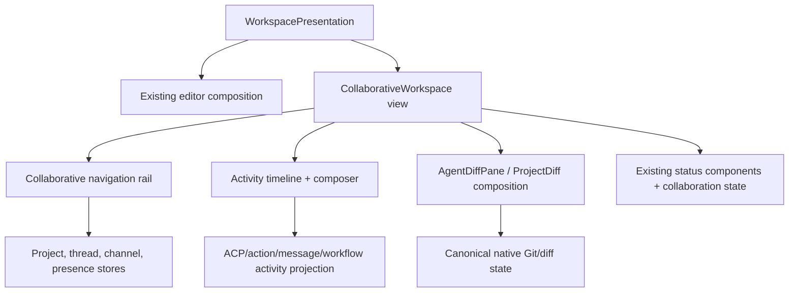
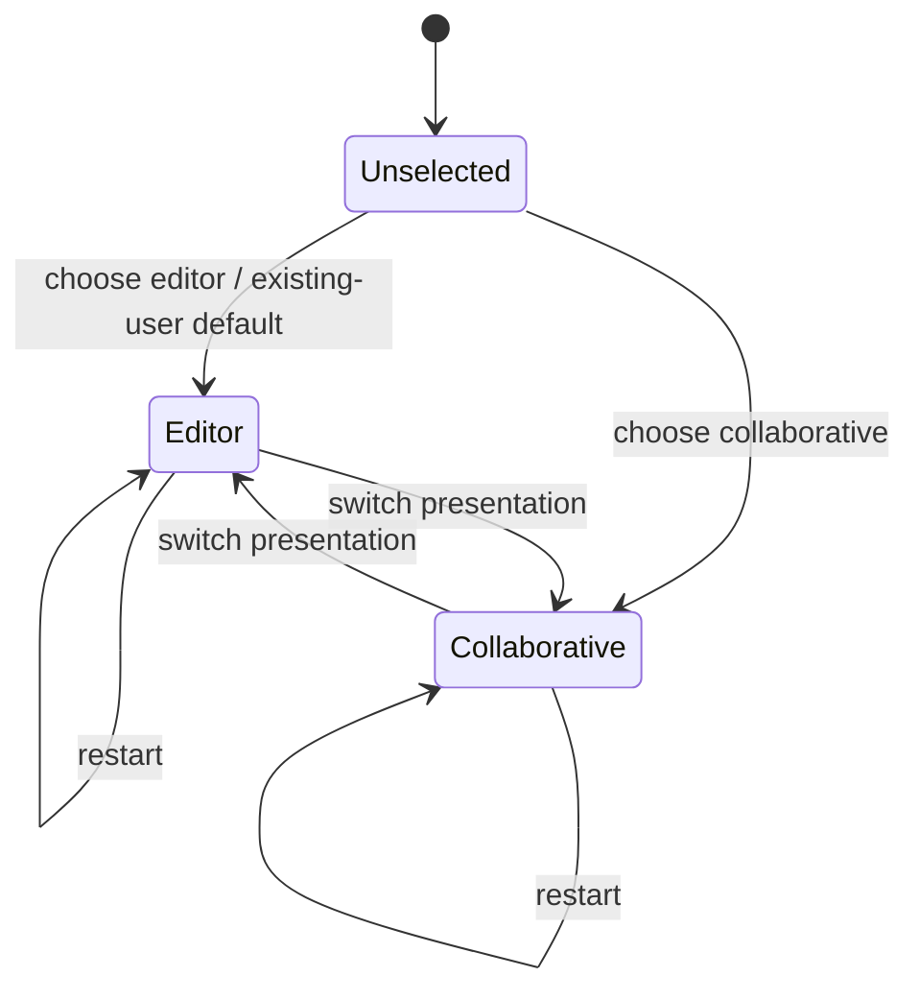

# Design: Collaborative Workspace and Buzz Consolidation

## Overview

The target is one Zed product with two native workspace presentations and one canonical owner per aggregate. Existing Zed workspace/project/Git/ACP components remain authoritative for local development. Buzz's signed-event collaboration semantics are ported into a UI-independent domain and service layer, while Nostr, existing Zed RPC, CLI, web, mobile and temporary legacy processes become adapters around that domain.

The transition is deliberately incremental. Milestone 1 ships a useful GPUI vertical slice without waiting for server consolidation. Later milestones add the canonical collaboration domain, protocol/service foundations and complete Buzz parity. A temporary Buzz-compatible service boundary is allowed only during migration; the final deployment owner is the Zed collaboration platform after ADR-001.

## Existing context

- `workspace`, `onboarding`, `sidebar` and `ui` already own GPUI windows, panes, docks, persistence, focus, themes and the first-run flow.
- `project`, `worktree`, `project_panel`, `git` and `git_ui` own local files, worktrees, repositories, index/working-tree state and native diff/review surfaces.
- `agent`, `acp_thread`, `action_log`, `agent_ui`, `agent_servers` and tool-permission stores own native agent execution, ACP sessions, transcripts, tool activity and cancellation. The approved ACP prompt-reentrancy spec remains binding.
- `channel`, `collab_ui`, `client`, `rpc`, `proto`, `session`, `livekit_client` and the `collab` service already implement accounts, channels, rooms, presence-like state, project sharing and production WebSocket/RPC/Postgres infrastructure.
- The existing `collab` binary uses Axum 0.6, SeaORM 1.1.10 and SQLx 0.8; Buzz currently uses Axum 0.8 and SQLx 0.9. Directly merging manifests before dependency alignment is unsafe, which motivates the bounded sidecar phase in `migration-plan.md`.
- Buzz's `buzz-core` is zero-I/O and contains the most complete audited signed-event/tenant rules. `buzz-relay` is the orchestration point around SQLx/Postgres, Redis, S3/Blossom, Git, workflows, audit, push and audio. Its desktop is React/Tauri and must not become a GPUI architecture template.
- Existing specs under `.agents/specs/goose-migration` and `.agents/specs/acp-thread-prompt-reentrancy` constrain agent infrastructure, tool permissions, prompt lifecycle and security. `telemetry-disabled-default` prevents Buzz-derived client code from re-enabling telemetry.

## Target architecture

The diagram shows logical ownership, not a requirement that all components run in one process. Adapters may be separate listeners or binaries; they cannot author independent domain state.

## Design decisions

### D1. Canonical domain by aggregate, not by legacy product

- **Responsibility:** Define commands, entities, stable IDs, state transitions, authorization inputs, projection events and versioning for communities, identities, channels/messages, shared projects/Git records, jobs, workflows, audit references, media/huddles and presence.
- **Integration:** The domain is UI-free and I/O-free. Existing Zed types remain canonical for local project/Git/ACP aggregates. Buzz-derived collaboration types are moved from `buzz-core` only where no suitable Zed type exists. Nostr encoding stays in a protocol adapter.
- **Rationale:** Neither current `proto` nor client-side `channel` is a suitable shared server/client domain owner, while copying `buzz-core` intact would preserve Buzz as a second product. A narrow collaboration-domain boundary is a justified new logical component.
- **Constraint:** Accepted ADR-001 fixes `collab` as the final service owner and permits only its documented bounded Nostr sidecar; implementation beyond the vertical slice must follow that dependency and removal boundary.

### D2. Provenance-aware authoritative records

Each aggregate declares one authoring source:

| Aggregate | Authority | Derived/compatibility state |
| --- | --- | --- |
| Local files/worktrees/index/diffs | Zed `project`/`worktree`/`git` | NIP-34 patches/status and timeline cards |
| Native ACP session/transcript/actions | `agent`/`acp_thread`/`action_log` | NIP-AO frames, channel messages and activity projections |
| Nostr-authored channel/message/social/workflow records | Verified signed event log | SQL search/timeline/member/read projections and GPUI stores |
| Service-issued membership, summaries and bounds | Authorized collaboration service | Relay-signed event representation and RPC payloads |
| Service account | Zed user/account service | Explicit Nostr-key bindings |
| Collaboration keys | Zed credentials provider | Pairing/backup/import formats |

Projection rows carry `source_kind`, `source_id`, `source_version`, `community_id` and `projected_at`. A projection cannot accept a direct write that bypasses its command/event authority. Drift checks rebuild or compare projections from authoritative records.

Projection checkpoints preserve the domain provenance vocabulary as bounded source system, record ID, optional source version, observation time and paired integrity reference; they add a projection-local version, reset generation, opaque 64-KiB resume cursor, projected time and closed drift state with optional authoritative/projection hashes. The community-leading source key is immutable and protected by forced RLS with the common restrictive tenant predicate. Every update must advance `projection_version` by exactly one or PostgreSQL raises a serialization failure, preventing a stale worker from overwriting a newer checkpoint even if it omitted a defensive version predicate. A reset may hold or increment its generation by one; an increment must atomically enter `reset_pending`, clear the cursor and record reset time, fencing pre-reset workers. Diverged state requires two distinct 32-byte hashes, clean state cannot retain an error, and all scan/source indexes lead with community. The rebuild orchestrator installs that tenant fence, loads bounded authoritative rows through an aggregate adapter, deterministically sorts and length-prefix-hashes source identity, source version, row count, row keys and payloads, replaces only the selected derived aggregate, reads it back and records equal clean hashes or unequal drift hashes plus a bounded content-free summary. Authority reads, projection replacement, comparison and checkpoint upsert share one transaction; adapter or storage failure rolls back the projection and checkpoint without an authority write. Re-running the same source therefore produces identical projection bytes and hashes while advancing only the optimistic checkpoint version. <!-- impl: crates/collab/migrations/20260820000300_collaboration_projections.up.sql --> <!-- impl: crates/collab/src/db/collaboration/rebuild.rs#ProjectionRebuilder --> <!-- impl: crates/collab/tests/collaboration_projection_rebuild.rs#collaboration_projection_rebuild_is_deterministic_and_does_not_mutate_authority -->

The UI-free `collaboration_domain` foundation represents canonical aggregate identity as an explicit community, aggregate type and UUID tuple; sharing a raw aggregate UUID across communities does not make the identities equal. Deterministic UUIDv5 import IDs preserve stable compatibility references without granting authority, while strictly positive ordered aggregate versions and bounded source provenance retain source system, record/version, observation and optional integrity metadata. These types perform no I/O, protocol decoding, authorization or GPUI work. <!-- impl: crates/collaboration_domain/src/identity_types.rs#ScopedAggregateId --> <!-- impl: crates/collaboration_domain/src/provenance.rs#Provenance -->

The lower-layer dependency contract is executable. `collaboration_domain` and `nostr_compat` declare their architectural layer, exact non-dev direct-dependency allowlist and the GPUI, storage and transport capability classes they forbid. The boundary checker includes normal and build dependencies, ignores dev-only fixture tooling, requires exact allowlist agreement and traverses locked Cargo metadata so an indirect forbidden package fails as decisively as a direct dependency. <!-- impl: script/check-collaboration-dependencies -->

### D3. Protocol adapters preserve exact wire behavior

- **Nostr:** The adapter owns event serialization, signing/verification, kind/tag validation, filter translation, NIP-01 frames, NIP-11/05, NIP-42/98, NIP-CW cursors/overlays and all Buzz NIPs. It calls domain commands only after admission/auth. It may return signed compatibility projections without changing domain ownership.
- **Zed RPC:** Existing clients continue through `client`/`rpc`/`proto`. New collaborative RPC messages carry domain IDs and versions rather than Nostr JSON where no compatibility is required.
- **ACP/MCP:** Zed's native ACP runtime remains authoritative. Channel mentions, NIP-AO frames and signed jobs translate into session/job commands. MCP tools remain subject to Zed permissions and sandbox policy.
- **Git:** Git smart HTTP and NIP-34 translate hosted-repository operations and signed review records. Local repository state is never reconstructed from a chat projection.

Unknown versions fail before writes. Compatibility adapters are independently tested against Buzz fixtures and old clients.

The Zed-owned command boundary carries one current contract version, stable operation ID, admitted tenant and principal, optimistic expected/predecessor versions, originating adapter and typed payload. Its receipt reports the authoritative version and an applied-or-duplicate disposition, allowing adapters to preserve idempotent protocol acknowledgements without an adapter-owned replay store. A `DomainCommandSink` is the only mutation-facing listener interface; its Postgres implementation owns the transaction around the injected canonical mutation, durable receipt and outbox operation. The Nostr ingress accepts only the current bounded adapter version, rejects invalid peer minimums before invoking the sink and consumes the existing admission token to construct the command. In-process and temporary-sidecar origins remain explicit for compatibility metrics, but both call the same sink contract; neither origin receives storage, migration or projection authority. <!-- impl: crates/collab/src/collaboration_command.rs#DomainCommand --> <!-- impl: crates/collab/src/collaboration_command.rs#DomainCommandReceipt --> <!-- impl: crates/collab/src/nostr/ingress.rs#VersionedNostrIngress --> <!-- impl: crates/collab/src/db/collaboration/outbox.rs#TransactionalCommandOutbox -->

NIP-42 connection authentication is a terminal state machine over one redacted 32-byte challenge and five-second response deadline. It verifies kind 22242 event ID, signature and ±60-second freshness through `nostr_compat`, requires exactly one matching challenge and normalized relay tag, optionally verifies one NIP-AA owner attestation, then atomically claims a community/event replay key before resolving a current authorized principal. The injected resolver owns active membership, binding and revocation reads; its output must remain in the row-zero tenant, match the event author and retain NIP-42 provenance. Success retains the actual key principal; timeout closes without a response, same-connection reauthentication and post-failure attempts preserve Buzz's closed reasons, and invalid, restricted or infrastructure outcomes map to bounded protocol dispositions without persisting or logging the AUTH event. The replay and resolver traits deliberately have no permissive default: Task 16.1 supplies shared expiring runtime storage and the membership repositories supply authoritative identity decisions. <!-- impl: crates/collab/src/nostr/auth.rs#NostrConnectionAuthenticator --> <!-- impl: crates/collab/src/nostr/auth.rs#NostrAuthReplayStore -->

REQ, COUNT and CLOSE parsing is bounded before any query or resource allocation: frames are at most 512 KiB, identifiers at most 256 bytes, requests at most ten filters, filter fields retain `nostr_compat` bounds and query limits clamp to 1,000 results per filter. An authenticated subscription session fixes one tenant, principal and connection ID; injected query and resource interfaces must consume that scope rather than reconstruct it from client data. REQ activates or generation-replaces at most 1,024 subscriptions, emits bounded historical EVENT frames followed by EOSE, and removes the active resource before a query failure is surfaced as CLOSED. COUNT never registers a live subscription and sees only the session tenant. CLOSE, connection cancellation and replacement release their exact resource tokens; failed release remains observable. These interfaces deliberately have no store or pub/sub default because Task 15.2 owns the event repository and Task 16.1 owns shared realtime fanout. <!-- impl: crates/collab/src/nostr/subscriptions.rs#NostrSubscriptionSession --> <!-- impl: crates/collab/src/nostr/subscriptions.rs#NostrSubscriptionQuery -->

EVENT ingest bounds and structurally parses one NIP-01 envelope, normalizes its compatibility representation to signed fields, and performs ID/signature, 256-KiB content, 512-KiB canonical-event and ±15-minute timestamp verification on the blocking executor. Malformed and cryptographically invalid events receive Buzz-compatible negative OK frames before a write. Except for NIP-59 gift wraps, the signed author must be the authenticated direct/bound Nostr key or owner-attested agent key; AUTH events cannot re-enter through EVENT. An accepted event becomes one typed command through the versioned ingress, with an operation ID deterministically derived from the trusted community and event ID. Applied and duplicate receipts map to exact positive OK/empty and OK/`duplicate:` frames; policy rejection and infrastructure failure map to bounded restricted/error responses. No adapter replay cache or event store exists at this boundary. <!-- impl: crates/collab/src/nostr/event_ingest.rs#NostrEventIngress --> <!-- impl: crates/collab/src/nostr/event_ingest.rs#NostrEventCommand -->

The native Nostr HTTP boundary owns an Axum router for content-negotiated `/`, `/info` and `/.well-known/nostr.json` plus a reusable NIP-98 authenticator for protected HTTP handlers. Only a canonical direct or explicitly trusted-forwarded Host may resolve a tenant; `X-Forwarded-Host`, request bodies and signed tags cannot select one. NIP-11 advertises the limits enforced by the WebSocket adapter and includes only bounded deployment metadata plus an optional same-tenant icon; unmapped hosts and directory outages receive the same generic document without tenant data. NIP-05 lowercases and bounds local names, performs one tenant-scoped directory read and returns the standard empty response for malformed, missing, foreign or unavailable records. NIP-98 decodes a bounded `Nostr` header, uses the shared signed-event parser and blocking verifier, requires kind 27235, ±60-second freshness, exact tenant-derived URL and method tags, and a matching body hash when present or required. It then atomically claims the tenant/event replay key for 120 seconds and resolves a current same-tenant NIP-98 principal. Host, signature, expiry, payload, replay, revocation and infrastructure failures all fail closed. Host/directory/replay/principal traits have no permissive defaults; production mounting waits for their canonical implementations rather than introducing a local directory or replay store. <!-- impl: crates/collab/src/nostr/http.rs#router --> <!-- impl: crates/collab/src/nostr/http.rs#Nip98Authenticator -->

Reconnect compatibility is connection-scoped: a replacement connection completes a fresh NIP-42 challenge, refetches the authoritative head and older cursor window independently, and rearms each live subscription against its new connection identifier. A failed older-window query closes and releases only that subscription while a successful head reaches EOSE and remains live, preserving the last trustworthy scope instead of collapsing freshness into one global boolean. A publish whose outcome was uncertain may be replayed with the same signed event; its community-and-event operation ID and positive `duplicate:` acknowledgement let the client replace the optimistic item and any historical/live echo by event ID. This is the adapter contract only: Task 15.4 must enforce the operation receipt transactionally and Task 16.1 must suppress duplicate local fan-out across replicas before production mounting. <!-- impl: crates/collab/tests/nostr_reconnect.rs#nostr_reconnect_reauthenticates_refetches_windows_and_rearms_subscriptions --> <!-- impl: crates/collab/tests/nostr_reconnect.rs#nostr_reconnect_reconciles_an_optimistic_event_without_a_duplicate_echo -->

The canonical signed-event table is owned by `collab` and keyed by `(community_id, event_id)` across sixteen community-hash partitions, so one signed event may be admitted independently to different communities without a global deduplication leak. Forced row-level policy with the common restrictive tenant predicate is installed on the partitioned parent and every directly addressable partition; an absent or mismatched `app.community_id` yields no access. The record retains full-range unsigned Nostr time as `numeric(20,0)`, bounded parsed fields, the exact canonical signature-input bytes, 64-byte signature and live-or-historical verification provenance. Accepted rows are update-immutable, while explicit deletion remains available to the later retention/deletion authority. Ephemeral classification is not a storable state. Community-leading chronological, kind, author-kind and addressable indexes preserve greatest-time then lowest-event-ID head selection without a second head store. The reversible SQLx migration pair is checksum-covered and does not run a production migration by itself. <!-- impl: crates/collab/migrations/20260820000100_collaboration_events.up.sql --> <!-- impl: crates/collab/tests/collaboration_event_migration.rs#collaboration_event_schema_preserves_bytes_and_head_order -->

The event repository accepts only a typed record whose event ID and Schnorr signature have passed `nostr_compat` verification under a state-matched policy: historical provenance requires the historical policy and live provenance requires an explicit bounded timestamp policy. Every transaction sets the admitted community as PostgreSQL's local row-zero tenant before reading or writing. Its write method additionally requires an opaque kind-bound persistence decision from the common policy boundary, so callers cannot substitute a public decision for private content. Ephemeral events return a non-persisted disposition before opening a transaction. Regular events insert once by community and event ID. Replaceable events first advance a durable coordinate watermark using greatest timestamp then lowest ID; an older candidate or exact deleted head is stale and never inserted, while an exact live candidate reaches the normal duplicate path. Visible filter queries return regular rows plus only each watermark's live addressable row, apply at most ten validated OR filters and 1,000 results in SQL, and preserve deterministic time/ID order; exact lookup remains available for retained authority and audit. Deletion clears a matching live pointer before physically removing immutable bytes, leaving the head order as a tombstone floor so older signed values cannot reappear. Returned rows are re-bound to the requested community and canonical bytes/ID before use. <!-- impl: crates/collab/src/db/collaboration/event_repository.rs#EventRepository --> <!-- impl: crates/collab/src/db/collaboration/event_repository.rs#query_statement -->

The event persistence policy resolves only cataloged relay kinds, retaining the deliberately defined-but-unused standard kind while excluding the internal media-upload application kind. Ephemeral kinds are always transient and search-excluded regardless of later delivery authorization. Durable private kinds require explicit adapter-supplied evidence for every catalog gate: author-only, recipient, result-reader and author-or-explicitly-shared compose without one gate satisfying another. Accepted private material can enter only an authorization-scoped index; it is never eligible for community search. Public kinds may enter the community index. The resulting decision carries its event kind in private state and exposes no payload, author, recipient or search text; policy errors are content- and kind-neutral. The repository revalidates the exact kind before any transaction, while the authorization layer remains responsible for deriving—not trusting—admission evidence from current principal and event semantics. <!-- impl: crates/collab/src/db/collaboration/persistence_policy.rs#EventPersistencePolicy --> <!-- impl: crates/collab/tests/collaboration_persistence_policy.rs#collaboration_persistence_policy_keeps_ephemeral_events_out_of_sql_and_search -->

The initial `nostr_compat` event boundary encodes the NIP-01 signature preimage as the exact compact UTF-8 JSON array `[0,pubkey,created_at,kind,tags,content]` and hashes those bytes with SHA-256. Public keys and event IDs admit only exact-length lowercase hexadecimal representations, timestamps remain unsigned 64-bit values and kinds remain unsigned 16-bit values. The adapter exposes canonical bytes and IDs without signing, key custody, verification, authorization, persistence or domain mutation; those remain separate downstream boundaries. <!-- impl: crates/nostr_compat/src/event.rs#CanonicalEvent::canonical_bytes --> <!-- impl: crates/nostr_compat/src/event.rs#CanonicalEvent::event_id -->

Signed-event verification remains a pure CPU boundary: it rejects content above 256 KiB and canonical preimages above 512 KiB before cryptography, applies an explicit historical-or-bounded timestamp policy, recomputes and compares the event ID, parses an x-only secp256k1 public key and verifies the BIP-340 Schnorr signature over the 32-byte ID. Historical import deliberately has no freshness window, while live admission supplies its policy; neither path can access signing keys or authorize/persist an event. <!-- impl: crates/nostr_compat/src/verification.rs#verify_signed_event -->

Filter evaluation validates at most ten OR-ed filters before matching; fields within a filter are AND-ed, event-ID prefixes are canonical lowercase hex, authors are exact keys, time bounds are inclusive and generic tag values are bounded. Buzz's stored-channel `#h` fallback applies only when the event carries no explicit `h` tag, so derived channel scope cannot override signed scope. Persistence classification separates regular, NIP-16 replaceable, ephemeral and NIP-33 parameterized-replaceable ranges. Replacement coordinates require exactly one `d` tag for NIP-33 events, reject mixed-coordinate selection and deterministically choose greatest `created_at` then lowest event ID. The same owned order key survives deletion as a tombstone/watermark floor, preventing an older signed value from being resurrected while permitting a genuinely newer value. <!-- impl: crates/nostr_compat/src/filter.rs#filters_match --> <!-- impl: crates/nostr_compat/src/head.rs#select_head --> <!-- impl: crates/nostr_compat/src/head.rs#HeadOrder -->

The frozen protocol catalog generates the native event-kind registry rather than allowing a second handwritten number table. Each of the 133 event kinds carries typed persistence, replacement, privacy and registration metadata; overlapping Buzz privacy controls remain combinable flags, and the internal media-upload application event remains distinguishable from relay events. Generation compares every scalar source constant and all four range boundaries against the catalog, rejects additions without a catalog classification, preserves the catalog's one deliberate `defined-unused` kind and formats deterministic Rust for drift checks. <!-- impl: crates/nostr_compat/src/generated_kinds.rs#EVENT_KINDS --> <!-- impl: .agents/specs/collaborative-workspace/scripts/generate-kind-registry.py#validate_inputs -->

Identity compatibility uses typed NIP-OA attestations, NIP-AA authentication presentations and NIP-IA requests, relay deltas and snapshots. OA conditions preserve their exact signed byte string while exposing parsed canonical clauses; full event provenance evaluates every clause, AA admission deliberately ignores `kind=` while evaluating timestamp clauses, request-borne IA owner proof evaluates timestamp clauses against the request, and latest-profile IA proof can pass no timestamp so it acts as the standing ownership declaration defined by NIP-IA. IA codecs enforce one protected marker and target, action-specific replacement rules, consent actor constraints, distinct request/proof references and bounded reason/content fields; snapshot parsing ignores invalid member entries as required while retaining valid relay-scoped identities. These codecs verify cryptographic ownership evidence but do not grant membership, mutate archive state or trust a relay signer; those remain authorization and reducer responsibilities. <!-- impl: crates/nostr_compat/src/buzz_nips/identity.rs#OwnerAttestation --> <!-- impl: crates/nostr_compat/src/buzz_nips/identity.rs#AgentAuthentication --> <!-- impl: crates/nostr_compat/src/buzz_nips/identity.rs#IdentityArchiveRequest --> <!-- impl: crates/nostr_compat/src/buzz_nips/identity.rs#IdentityArchiveDelta -->

Agent-configuration compatibility separates public NIP-AP projections from the private NIP-PMA aggregate. Persona projections enforce the plaintext slug grammar, content cap, explicit secret-field prohibition and exact absent-or-`shared=true` privacy gate; team catalogs use their distinct bounded coordinate grammar and recursively reject known private/local-only fields. Kind 30177 accepts both slim definition-linked content and legacy fat content without choosing field authority at the wire boundary. PMA validates a signed owner-authored outer envelope before ciphertext use, with exact tag grammar, positive safe generation, predecessor-at-generation-two CAS shape and active/deleted state. Strict decrypted-v1 parsing rejects duplicate/unknown core fields, validates RFC3339 bookkeeping, nsec checksum/key derivation, unconditional owner attestation, portable-field bounds, tombstone shape, signed 30175/30177 recovery IDs/signatures/coordinates and exact content hashes. Relay ingest is a compile-time false capability until the later privacy and transactional gates land; this module neither encrypts/decrypts NIP-44 bytes nor owns keys, persistence or aggregate submission. <!-- impl: crates/nostr_compat/src/buzz_nips/agent_config.rs#PersonaProjection --> <!-- impl: crates/nostr_compat/src/buzz_nips/agent_config.rs#PrivateManagedAgentEnvelope --> <!-- impl: crates/nostr_compat/src/buzz_nips/agent_config.rs#PrivateManagedAgentPayload -->

Agent activity compatibility keeps all NIP-44 content opaque at the wire boundary. NIP-AE derives the symmetric v2 conversation key from raw ECDH x-coordinate plus the `nip44-v2` HKDF-extract salt, blinds valid `core`/`mem/...` slugs with the versioned HMAC domain and validates a signed agent-authored envelope before accepting decrypted strict JSON or matching the body back to its coordinate. NIP-AM accepts only signed agent-authored, channel-free, owner-result-gated envelopes; decrypted metrics preserve absent-versus-zero counters, reject explicit-null cache/pricing fields, require cumulative correlation, constrain costs and billing identities and map future stop reasons to unknown. NIP-AO accepts signed ephemeral telemetry/control envelopes, enforces direction shape, exposes recipient-only visibility, treats future frame/control types as ignored and redacts kind-specific payload values from debug output. Key custody, durable memory services and network publication remain outside these pure codecs. <!-- impl: crates/nostr_compat/src/buzz_nips/agent_activity.rs#nip44_conversation_key --> <!-- impl: crates/nostr_compat/src/buzz_nips/agent_activity.rs#EngramEnvelope --> <!-- impl: crates/nostr_compat/src/buzz_nips/agent_activity.rs#AgentTurnMetricEnvelope --> <!-- impl: crates/nostr_compat/src/buzz_nips/agent_activity.rs#ObserverEnvelope -->

The NIP-AE memory codec composes that validated body/envelope boundary with standard NIP-44 v2 encryption without taking custody of a persistent key. Only an agent secret can construct a new encrypted record; decryption first derives the supplied reader identity and admits only the declared agent or owner before authenticating ciphertext and re-deriving the blinded slug coordinate. Coordinates are exact canonical `30174:<agent>:<d>` values plus an explicit owner scope, ciphertext diagnostics are redacted and malformed or cross-owner input fails closed. Relay scope is a bounded, transport-free value: usable agent-advertised NIP-65 write relays take precedence over fallback relays, WebSocket URLs use canonical equality while retaining their advertised connection form, and rotation exposes the prior/new union that must receive current heads before a departing relay is decommissioned. Storage, relay queries, publication, signing and migration execution remain with later owners. <!-- impl: crates/nostr_compat/src/agent_memory.rs#encrypt_engram_for_owner --> <!-- impl: crates/nostr_compat/src/agent_memory.rs#EngramRelayScope -->

Canonical encrypted memory persistence is an `agent`-owned multiplayer domain on the shared application SQLite database. It stores only the exact owner/agent/blinded-slug coordinate, immutable signed-event identity and creation time, canonical NIP-44 ciphertext, its SHA-256 integrity reference and a positive versioned retention state; no storage API accepts plaintext or secret material. Reads require the authenticated owner to match the coordinate before I/O, hide records at their exact expiry boundary and reparse both event and ciphertext while verifying the saved digest before returning recovery evidence. Addressable writes follow greatest-creation-time then lowest-event-ID replacement order; identical retries do not overwrite saved bytes. Retention expiry uses an exact generation compare-and-swap and can only shorten visibility. Owner-key rotation accepts an already re-encrypted replacement for the same agent under a distinct owner, then atomically expires the old coordinate and inserts the replacement; exact retries are idempotent, while stale generations and conflicting replacement events leave both states unchanged. Publication, encryption, decryption, keys and later cross-store retention workers remain outside this repository. <!-- impl: crates/agent/src/memory.rs#AgentMemoryRepository -->

Managed-agent lifecycle snapshots are likewise an `agent`-owned, multiplayer-gated shared-SQLite domain. Each immutable owner/agent snapshot stores bounded canonical persona and optional team JSON plus the exact validated private managed-agent runtime record, with closed source-version/predecessor provenance and separate SHA-256 component and aggregate integrity. Stable snapshot IDs make exact retries idempotent, comparisons disclose only which component changed and diagnostics redact all documents and runtime state. Restore never rewrites authority directly: it requires the caller's current private runtime record and exact expected version, then returns a verified historical bundle for the existing managed-agent compare-and-swap owner to apply as a new version. Compaction requires the exact current snapshot head, verifies every source row first, writes and reads back an owner-scoped journal containing the removed IDs and chain digest, and only then deletes older rows in the same savepoint while always retaining the head and requested recent history. Corrupt or stale state leaves the original rows intact. This private local lifecycle exposes no portable exporter; later migration/export adapters must apply their own explicit disclosure policy and revalidate imported persona/team documents. <!-- impl: crates/agent/src/snapshot.rs#ManagedAgentSnapshotRepository -->

Private per-turn usage accounting is a separate `agent`-owned, multiplayer-gated shared-SQLite domain, not client telemetry. An agent secret encrypts a validated, observed-usage NIP-AM payload directly to its distinct owner with NIP-44 v2 while plaintext buffers are zeroized; the resulting canonical kind-44200 event contains only the exact `p` and `agent` tags and can be signed by the existing event owner. Local rows retain owner/agent/event identity, the strict payload needed for private accounting, ciphertext, independent SHA-256 integrity references and generation-fenced expiry. Append-only event IDs make exact retries idempotent and conflicting retries closed. Aggregation prefers deltas recomputed from ordered session cumulative values, uses a reliable reported turn only when no prior cumulative baseline exists, preserves unknown counters rather than treating them as zero and rejects duplicate sequence positions or overflow. Owner exports expose ciphertext and coarse envelope/retention metadata only; debug output redacts both local payload and wire ciphertext. The module has no telemetry emitter or client integration, so disabling Zed telemetry leaves local accounting available without creating outbound telemetry. Relay publication, signing, provider-billing reconciliation and cross-store import remain with their existing or later owners. <!-- impl: crates/agent/src/usage.rs#AgentUsageRepository -->

Buzz agent-state materialization is an owner-profile-scoped, multiplayer-gated migration boundary over the staged desktop plan and the canonical encrypted-memory, managed-snapshot and private-usage repositories. The adapter recomputes the complete staging plan before I/O, requires one explicit retained-source marker per record and accepts only caller-supplied canonical records that already carry the exact owner, agent, event, ciphertext, retention and private-runtime evidence needed by their owning repositories. This is deliberate: Task 17.9 retains sanitized JSON and hash-only archive evidence, not decryption keys or missing plaintext, so the migration never guesses or fabricates canonical state. It admits one exact usage record only for its matching archived kind-44200 event, retains kind-24200 evidence without inventing a durable observer store and allows snapshot writes only from staged snapshot shapes. Each canonical write is read back before a per-record receipt commits source content/privacy hashes and a redacted target manifest; verified record receipts short-circuit retries before canonical mutation, while the final batch receipt binds the original source/staged/privacy checkpoint to the aggregate target hash. Partial batches therefore resume from the first unverified record. Rollback evidence keeps execution, automatic start and credential use disabled and requires the untouched original source to remain recovery authority; the adapter performs no source deletion, decryption, key custody, relay publication or activation. <!-- impl: crates/zed/src/migration/buzz/agent_state.rs#BuzzAgentStateImporter -->

Agent-observer ingress adds policy around that pure NIP-AO codec without executing ACP or taking custody of keys. It admits only signed kind-24200 frames with exact closed tags and canonical opaque NIP-44 v2 ciphertext, derives telemetry versus control from the sender/agent/recipient route, authenticates the exact recipient, requires an adapter-supplied current owner relationship and freshness-gates controls. Live subscriptions are recipient-exact and cannot request history. After a caller decrypts the content, the adapter validates bounded typed telemetry or `cancel_turn`, maps channel identifiers to UUIDs and safely ignores future frame and telemetry kinds. NIP-44 encryption/decryption, key zeroization, ACP execution, buffering and persistence remain owned by later adapters and services. <!-- impl: crates/nostr_compat/src/agent_observer.rs#AgentObserverFrame --> <!-- impl: crates/nostr_compat/src/agent_observer.rs#authorize_agent_observer_filters -->

Native ACP observer publication is a bounded in-memory projection from one channel-scoped native session into NIP-AO telemetry values. Monotonic per-session sequence numbers and stable turn/action identifiers let consumers detect drops and update one action item from pending through terminal state; a bounded 800-entry source window suppresses transport retries and identical action-state retries, while resolved turns and terminal actions reject later mutation. Protocol reads and writes publish only method and structural presence metadata, never IDs, parameters, results, errors, prompt text or credentials, so the adapter cannot become a second transcript. Native stop reasons, including cancellation, become one terminal `session_resolved` frame. The adapter validates identifiers and the NIP-AO plaintext ceiling but does not sign, encrypt, publish, persist or own ACP execution. <!-- impl: crates/acp_thread/src/collaboration_observer.rs#CollaborationObserverAdapter --> <!-- impl: crates/acp_thread/src/collaboration_observer.rs#NativeCollaborationObserverEvent -->

Collaboration session coordination maps one community-scoped channel, thread or job identity onto Zed's native ACP session identifier without owning an agent transcript or execution engine. Resolution reserves a generation-fenced lease before asynchronous session creation, returns that same reservation to idempotent retries and returns the existing native session for resume only to the current executor. A reverse binding prevents one native session from representing two collaboration identities, while a competing executor cannot create or resume the claimed identity. Failed creation can release only its current reservation; cancellation requires a capability derived from the same active executor generation and removes the binding only after the native cancellation path reports completion. Native `AgentConnection`, `AcpThread` and `ThreadStore` remain the execution, process-lifecycle and transcript owners. <!-- impl: crates/agent/src/collaboration_session.rs#CollaborationSessionRegistry --> <!-- impl: crates/agent/src/collaboration_session.rs#CollaborationCancellationAuthorization -->

Accepted-job execution composes that native session registry with a mandatory tenant-bound execution-authority capability rather than importing the server-side PostgreSQL repository into the desktop agent. The coordinator acquires an exact job-version/executor lease, creates or resumes the single job-scoped ACP session and publishes one deterministic lease-derived progress command before dispatching the bounded prompt to the native runtime. Completion, failure and cancellation are checked against both the recovery deadline and current lease generation before any terminal side effect; cancellation additionally uses the existing native-session cancellation capability. A crash leaves the lease and in-progress command intact, rejects takeover before `recovery_after`, then permits a new generation to resume the same native session. Terminal commands use stable lease-derived operation IDs, repository idempotency suppresses uncertain retries and terminal reloads clean up any surviving owned lease without re-running the prompt. The authority and runtime traits own no implementation state: service/RPC composition supplies canonical job/lease operations, while `AgentConnection`, ACP threads and their task lifecycle remain the only execution owner. <!-- impl: crates/agent/src/jobs.rs#JobExecutionCoordinator --> <!-- impl: crates/agent/src/jobs.rs#JobExecutionAuthority --> <!-- impl: crates/agent/src/jobs.rs#NativeJobRuntime -->

Delegated child-job orchestration extends that authority boundary without adding a recursive executor or a desktop job store. A child request must already have passed the canonical job-transition and delegation policy, including exact parent/child binding, resource narrowing and bounded acyclic ancestry; the orchestrator then verifies a nonterminal parent, delegates atomic creation to canonical authority and reloads the exact initial history plus ancestry before exposing success. An exact retry resolves to the existing child, so only the canonical Task 31.5 lease path can execute it. Direct-child aggregation validates unique same-tenant edges, waits while any child is nonterminal, completes the parent only when every child completes and fails it when any child fails or is cancelled. Parent cancellation propagates deterministic per-job cancellation commands to nonterminal direct children before cancelling the parent, and terminal reloads make retries idempotent. Buzz's Harbor orchestra remains compatibility evidence for message-level one-step assignment, reporting and verification; it supplies no durable job graph, retry, cancellation or ancestry authority. <!-- impl: crates/agent/src/job_delegation.rs#DelegatedJobOrchestrator --> <!-- impl: crates/agent/src/job_delegation.rs#AuthorizedChildJobRequest --> <!-- impl: crates/agent/src/job_delegation.rs#JobDelegationAuthority -->

Collaboration mention routing consumes a canonical message, a current common-policy authorization request, a resolved direct or bounded team target and the current collaboration-session lease. It validates exact conversation/write scope, tenant and channel membership through the shared authorization policy, rechecks human/scoped-token/owner-attested-agent authorship shape and exposes no routing state before authorization succeeds. Addressed visible content becomes one native ACP `PromptRequest` for the lease-bound session; an active dispatch makes the session busy, the same source event is suppressed in flight and in a bounded completion window, abort permits retry and generation fencing prevents stale completion from clearing newer work. The router does not call an ACP process, append a second transcript, resolve teams or invent membership evidence; those remain the native execution and canonical domain owners. <!-- impl: crates/agent/src/collaboration_mention.rs#CollaborationMentionRouter --> <!-- impl: crates/agent/src/collaboration_mention.rs#ResolvedCollaborationMentionTarget -->

Buzz development-tool compatibility is a pure, fail-closed translation into Zed's existing native tool schemas rather than a second executor. Shell, text/image reads, unique edits, grep and one-level directory listings retain the native registry's availability, permission, sandbox and cancellation owners; Buzz todo replacements become bounded ACP plan state rather than a parallel todo store. Paths are strict project-relative paths, requests and outputs are bounded and mapped arguments or plan contents are redacted from diagnostics. Legacy-only `replace_all`, recursive tree rendering and remote/data-URL image acquisition reject instead of silently weakening native edit or path/SSRF policy; the Task 28.6 differential gate confirms that these cases remain on the temporary Buzz boundary until explicit parity or retirement approval. <!-- impl: crates/agent/src/buzz_tool_compat.rs#BuzzToolCompatibilityMapper -->

ACP/MCP lifecycle conformance is independent of both production implementations: a test-owned frozen reference harness captures the retained Buzz agent busy-prompt, crash invalidation, retry, tool-owner and observer contracts, then compares the same observable transitions against the native session, mention, tool and observer adapters. A reentrant prompt reports busy without consuming its source event; crash handling aborts the dispatch, emits one cancelled terminal frame, releases both session directions and permits the same event under a fresh executor generation. Tool denial and cancellation happen before native dispatch, observer retries consume no sequence and terminal turns cannot reopen. This evidence does not import or execute Buzz reducers, create a compatibility queue or claim parity for the explicitly rejected legacy-only tool cases. <!-- impl: crates/agent/tests/buzz_acp_conformance.rs#buzz_acp_conformance_reentrant_prompt_crash_and_queue_retry -->

Communication-state compatibility keeps relay computation, durable scheduling and encrypted-content custody outside the wire codec. NIP-CW parses the opt-in filter only when `top_level` is exactly true, preserves the composite timestamp/event-id cursor, clamps row budgets and binds cryptographically verified relay overlays to the exact request cursor and channel. NIP-DV accepts only relay-authored snapshots whose `d` and `p` viewer agree with the authenticated reader, then exposes hidden channels as a set without changing membership. NIP-ER validates signed author-only addressable envelopes, canonical schedule/expiration tags and strict decrypted reminder bodies while leaving due delivery and NIP-44 to their later owners. NIP-RS validates one stable installation coordinate, preserves last-value duplicate-context compatibility, escape/unescape semantics, complete-or-tombstone override groups, componentwise-max convergence, primary-coordinate confinement, clear-wins canonical publication and checked counter exhaustion. It deliberately does not claim the full-state enumeration barrier, persistence, notifications or encryption responsibilities planned in later milestones. <!-- impl: crates/nostr_compat/src/buzz_nips/communication.rs#ChannelWindowRequest --> <!-- impl: crates/nostr_compat/src/buzz_nips/communication.rs#DmVisibilitySnapshot --> <!-- impl: crates/nostr_compat/src/buzz_nips/communication.rs#ReminderEnvelope --> <!-- impl: crates/nostr_compat/src/buzz_nips/communication.rs#ReadStateEnvelope --> <!-- impl: crates/nostr_compat/src/buzz_nips/communication.rs#OverrideRegister -->

The canonical read-state aggregate consumes only adapter-validated replicas decrypted for their owning principal and binds them to one community-and-owner scope; foreign owners and communities cannot merge or inspect state, and diagnostics expose counts rather than context identifiers. Frontiers and manual-unread registers join by componentwise maximum, parent frontiers participate only in effective-state evaluation, and clear wins counter ties. A potentially incomplete NIP-RS load may be merged for conservative reads but cannot advance, override or publish state; reconnect can only restore mutation authority by replacing it with a newly complete aggregate. Canonical publication co-locates every override with its frontier, emits live triples or permanent counter-floor tombstones, and refuses counter wrap. NIP-44 encryption, relay enumeration/fencing, persistence and key custody remain adapter/service responsibilities. <!-- impl: crates/collaboration_domain/src/read_state.rs#ReadState --> <!-- impl: crates/collaboration_domain/src/read_state.rs#OwnerReadStateReplica -->

Local collaborative message drafts are persisted only in Zed's native SQLite key-value store and never enter an event, outbox, relay or server-owned aggregate. Each store instance is fixed to one canonical principal, with independent namespaces for the canonical community and channel and exact keys for either the channel composer or a canonical thread-root event. Loads are synchronous for composer restoration, writes and deletion are asynchronous and error-reporting, whitespace-only content clears the exact draft, and channel deletion clears that channel's namespace without touching another channel, community or account. The stored document is strictly versioned, unsent content is redacted from diagnostics, and constructing a new store over the same database restores offline drafts without granting any server authority. <!-- impl: crates/collab_ui/src/draft_store.rs#DraftStore --> <!-- impl: crates/collab_ui/src/draft_store.rs#DraftLocation -->

The canonical reminder aggregate consumes only NIP-ER replicas already signature-checked, decrypted and bound to their owning principal by an adapter, then scopes them to one community and owner. Heads converge by NIP-01 replacement ordering, including the lowest-event-id tie break, while local create/update/dismiss operations preserve pending schedule shape and the 30–90 day terminal cleanup window used by Buzz. Due polling enforces `not_before` against the local clock even after an early relay signal, persists the handled head so restart and duplicate delivery cannot notify it twice, retries temporarily unavailable targets and permanently suppresses reminders whose target or own retention window has expired. Target visibility/expiry is an explicit input from the canonical authorization and retention owner and cannot grant access. Records and diagnostics redact the private identifier, target, note, schedule and handled event. Encryption, relay enumeration, persistence, timers, native notification policy and terminal-event publication remain adapter/service responsibilities. <!-- impl: crates/collaboration_domain/src/reminder.rs#Reminder --> <!-- impl: crates/collaboration_domain/src/reminder.rs#OwnerReminderReplica -->

The canonical inbox is a pure rebuildable projection, never a second message or reminder store. It binds one community/viewer to the canonical read aggregate, consumes borrowed canonical messages plus adapter-resolved stable conversation/read contexts and mention/reply relationships, and consumes only reminders readable by that same owner. Inputs are bounded and conflicting message/source/reminder duplicates fail closed; exact duplicates are idempotent. Deleted and self-authored messages do not become rows, external records group by stable conversation, and the oldest unread record is the representative while aggregate categories preserve activity, mention and reply reasons. Pending reminders enrich a represented target conversation or become stable standalone rows without retaining private target, note or message content. Potentially incomplete read state stays visible on the projection and evaluates conservatively; persistence, protocol parsing, authorization, scheduling, notification delivery and GPUI rendering remain with their approved owners. <!-- impl: crates/collaboration_domain/src/inbox.rs#InboxProjection -->

The native inbox and pulse surface consumes complete canonical `InboxProjection` and activity-projection snapshots for exactly one inbox scope. Revision numbers must advance, inbox scope and every pulse community must match, pulse inputs are bounded and duplicate stable activity identities must be byte-equivalent; invalid snapshots fail without replacing the last trustworthy rows. Inbox activity, unread, mention, reply and reminder filters and pulse person, agent and system filters are local presentation choices. Paging is bounded and resets when the selected mode or filter changes, while GPUI's virtual list owns only the currently visible page. Loading and empty states are distinct, and reconnect failure marks the retained projection stale or retrying instead of clearing it or inventing new authority. The view stores no message content beyond the canonical inbox rows, persists nothing and does not perform authorization, refetch, notification or activity reduction. <!-- impl: crates/collab_ui/src/inbox_pulse.rs#InboxPulseView -->

The canonical forum is a visibility-gated borrowed projection over one canonical forum `Channel` and its canonical `Message` records; it never copies message content into a forum store. Original message event IDs remain the stable post, comment, parent and root links across edits, while the existing thread graph retains deleted ancestors structurally and omits deleted comments from summaries and pages. Post pages sort by descending creation time then ascending event ID, and continuation resumes strictly after that pair so same-second rows and concurrently arriving newer posts cannot skip or repeat older rows; comment pages reuse the thread graph's ascending timestamp/event-ID cursor. Buzz forum votes remain ordinary immutable signed observations rather than a new replaceable protocol kind. Each vote is admitted through the canonical current write policy for its target post or comment, and the projection selects one observation per voter/target by greatest timestamp then lowest event ID before deriving counts, score and the viewer's direction. Archived forums remain readable but cannot accept votes; deleted or expired forums are unavailable. Protocol parsing/signature checks, event persistence, membership authority and GPUI rendering remain with their existing owners. <!-- impl: crates/collaboration_domain/src/forum.rs#ForumProjection --> <!-- impl: crates/collaboration_domain/src/forum.rs#ForumVote::cast -->

The native forum view snapshots only bounded presentation rows from that borrowed projection, retaining the exact community, channel, viewer and continuation cursors needed to reject a foreign or differently archived refresh. Adapter-resolved author presentations prevent raw principal identifiers from becoming labels, while post detail reuses the canonical native message timeline for comments and reply ancestry. The local composer validates `MessageContent` and emits typed create-post or create-comment requests; vote controls likewise emit the target event and direction without optimistically changing canonical counts. Adapter-projected permissions and archived state gate every write, and paging/open requests are surfaced as view events so the GPUI entity never stores a borrowed projection, fetches records, performs authorization or persists a second forum model. <!-- impl: crates/collab_ui/src/forum.rs#ForumView --> <!-- impl: crates/collab_ui/src/forum.rs#ForumAction -->

Canonical custom emoji remain member-authored NIP-30 replaceable set records, not mutable message fields or a relay-owned palette. Each record is scoped to one community and resolved owner, contains a bounded unique set of normalized lowercase shortcodes and validated HTTP(S) asset references, and replaces only that owner's prior head by signed timestamp and event-ID ordering. The rebuildable community palette unions current owner heads, collapses shortcode collisions by newest set then lexicographically smallest asset URL and lets an omitted entry remove only its owner's contribution. Custom reactions keep independent historical authority: their canonical `ReactionValue` remains in the existing reaction aggregate, while a matching embedded reaction-event asset tag supplies rendering even after palette removal. Resolution validates tags against active reaction event IDs, deterministically selects the earliest active embedded asset and requires an embedded asset for Buzz's 66-character wrapped values; a current palette entry is only a presentation fallback for shorter custom values. Upload MIME inspection, signature/tag parsing, membership mapping, event persistence, media fetching and UI image decoding remain adapter responsibilities. <!-- impl: crates/collaboration_domain/src/custom_emoji.rs#CustomEmojiPalette --> <!-- impl: crates/collaboration_domain/src/custom_emoji.rs#CustomEmojiPalette::resolve_reaction_group -->

Canonical product feedback is a private, channel-less community aggregate rather than an ordinary message, timeline event or public projection. Submission requires the exact feedback-write scope and current community membership, retains the signed source, resolved submitter and bounded private body, and redacts private submission context from diagnostics. A closed submitted/reviewing/resolved/declined workflow uses optimistic versions, monotonic operator sources and idempotent operation IDs; only current community owners or administrators with the exact feedback-management scope may read its status or mutate it, and read-shaped authority cannot perform a mutation. The operator-safe projection exposes only category, workflow state and reason, signed event identity, version and update time—never body, submitter or private attachment/diagnostic context. Protocol kind/tag and attachment validation, encrypted or sidecar persistence, deployment-admin routing, media custody and operator UI remain adapter/service responsibilities. <!-- impl: crates/collaboration_domain/src/feedback.rs#Feedback --> <!-- impl: crates/collaboration_domain/src/feedback.rs#FeedbackStatusView -->

Social-surface reconnect recovery always rebuilds from canonical domain records rather than replaying presentation state as authority. Inbox and pulse retain their last accepted bounded snapshot while offline or retrying and replace it only with a strictly newer scope-matching snapshot; forum reconnect creates a new owned presentation snapshot from a fresh borrowed projection; custom emoji and feedback rehydrate deterministically from their canonical records. Foreign scope, invalid activity, missing forum presentation, foreign emoji and unauthorized feedback status inputs fail before replacing the last trusted presentation. <!-- impl: crates/collab_ui/tests/social_surfaces.rs#social_surfaces_rebuild_after_offline_reconnect --> <!-- impl: crates/collab_ui/tests/social_surfaces.rs#social_surfaces_fail_closed_without_replacing_trusted_state -->

Direct-message compatibility admits only a cryptographically verified NIP-59 kind-1059 outer envelope with exactly one canonical `p` recipient and a canonical bounded NIP-44 v2 ciphertext. The wire codec intentionally has no plaintext or key-custody input: ciphertext can be exposed only through an explicit wire accessor, while debug output is redacted and indexing is unconditionally excluded. Filter admission treats kindless filters as capable of matching gift wraps and therefore requires one exact self-`#p`; result admission independently requires the authenticated reader to equal the signed outer recipient. This preserves Buzz's supported opaque gift-wrap boundary without claiming NIP-44 encryption, decryption, DM membership or persistence authority. <!-- impl: crates/nostr_compat/src/dm.rs#GiftWrapEnvelope --> <!-- impl: crates/nostr_compat/src/dm.rs#authorize_gift_wrap_filters -->

Project and workflow compatibility separates signed representation from authority and execution. NIP-GS accepts only the exact three-line LF armor and canonical compact v1 JSON, bounds base64, decoded envelope and Git payload bytes, binds timestamp plus optional NIP-OA bytes into the domain-separated hash and verifies the commit signature independently from the reported owner-attestation status. NIP-MP validates signed project coordinates against the shared Buzz ingest fixtures, preserves colon-bearing repository discriminators and opaque relay hints, treats unknown visibility as listed, and never converts grouping into repository ownership or push authority. NIP-WP validates the signed image-only mutation value and clear shape but leaves admin/owner admission, community persistence and public NIP-11 projection with their canonical service owners. Git CLI invocation, secret-key loading/zeroization, project folding, exhaustive enumeration, workflow execution and workspace-profile authorization therefore remain outside this pure codec boundary. <!-- impl: crates/nostr_compat/src/buzz_nips/project_workflow.rs#GitSignatureEnvelope --> <!-- impl: crates/nostr_compat/src/buzz_nips/project_workflow.rs#compute_git_signing_hash --> <!-- impl: crates/nostr_compat/src/buzz_nips/project_workflow.rs#ProjectEnvelope --> <!-- impl: crates/nostr_compat/src/buzz_nips/project_workflow.rs#WorkspaceProfileCommand -->

NIP-34 repository compatibility is likewise a pure signed-event representation boundary. Kind 30617 codecs preserve bounded multi-value web, clone, relay and maintainer tags, the earliest-unique-commit marker, subordinate-fork metadata, hashtags and bounded future tags while enforcing the migrated Buzz repository identifier grammar and exact kind-30617 coordinates. Kind 30618 codecs admit only safe full `refs/heads/*` and `refs/tags/*` names, SHA-1 or SHA-256 object IDs and a symbolic branch `HEAD`; kinds 1630–1633 preserve root/revision, repository, recipient, patch and merged/applied commit references with status-specific validation. Encoding or parsing these signals never reads, moves or establishes a local or hosted ref, selects a provider, grants repository permission or substitutes for ADR-003's authoritative manifest/provider result. <!-- impl: crates/nostr_compat/src/nip34_repository.rs#RepositoryAnnouncement --> <!-- impl: crates/nostr_compat/src/nip34_repository.rs#RepositoryState --> <!-- impl: crates/nostr_compat/src/nip34_repository.rs#RepositoryStatusEvent -->

Immutable NIP-34 forge collaboration uses the same boundary. Kind 1617 patch codecs preserve bounded format-patch content, root/revision linkage, repository/recipient references and optional stable-commit metadata while requiring paired commit/`r` references. Kinds 1618/1619 encode PR tips and updates with fetch locations, exact NIP-22 root references, optional channel/branch/merge-base metadata and repository-owner notification; kind 1621 preserves issue subject/labels. Git-scoped kind-1111 comments require a NIP-34 patch, PR or issue root, distinguish top-level equality from nested comment parents and cross-check root/parent authors, while a status-target validator binds the status root, author recipient and optional repository coordinate to one typed forge thread. These codecs do not apply patches, verify object reachability, mutate hosted review state, infer status authorization or replace the selected hosted authority. <!-- impl: crates/nostr_compat/src/nip34_collaboration.rs#GitPatch --> <!-- impl: crates/nostr_compat/src/nip34_collaboration.rs#GitPullRequest --> <!-- impl: crates/nostr_compat/src/nip34_collaboration.rs#GitIssue --> <!-- impl: crates/nostr_compat/src/nip34_collaboration.rs#GitComment -->

Canonical project-group metadata consumes only an adapter-verified signed NIP-MP head and preserves its signer plus signed source as container provenance. Its address is the signer-and-slug pair; bounded display metadata, optional opaque channel reference and listed/unlisted state belong only to that container. Member repository coordinates retain each NIP-34 owner and verbatim discriminator, including colon-bearing discriminators and unresolved cross-owner references, and normalize into deterministic coordinate order without interpreting opaque relay hints. Duplicate coordinates fail even when their hints differ, unknown visibility remains listed and zero-member groups remain valid. The model contains no local path, worktree, remote, repository permission, Git operation or filesystem capability; project signing, grouping and channel metadata grant no member-repository authority. Signed-event parsing remains in `nostr_compat`, Zed `Project` remains the local project/worktree owner, and community persistence/navigation binding are later adapter tasks. <!-- impl: crates/collaboration_domain/src/project_group.rs#ProjectGroup --> <!-- impl: crates/collaboration_domain/src/project_group.rs#RepositoryCoordinate -->

Local collaboration repository bindings resolve a current Zed `RepositoryId` through the canonical `Project`/`GitStore`, then discard that transient handle in favor of Zed's existing disk identity derived from the common Git directory. Normal and linked worktrees therefore converge on the same repository identity across project reopen, while submodules retain their independent work-directory identity. A binding pairs only that opaque local identity with the validated hosted NIP-34 coordinate; remote URLs, worktrees, Git mutation and filesystem access remain in their existing Zed owners, and a missing live repository fails explicitly instead of reviving stale state. Persistence and tenant-scoped project-group membership remain later adapter responsibilities. <!-- impl: crates/project/src/collaboration_repository.rs#CollaborationRepositoryIdentity --> <!-- impl: crates/project/src/collaboration_repository.rs#CollaborationRepositoryBinding -->

Tenant-local project-group persistence is a versioned projection of the canonical signed NIP-MP head, identified by source event ID and created-at version so it can be rebuilt and compared with the observed head for drift. Immutable group versions retain the signer-and-slug identity, while independently versioned current repository and channel bindings preserve history and represent removal with explicit tombstones. Repository coordinates store their own NIP-34 owner separately from the project signer, so cross-owner grouping conveys no repository authority. The projection contains no local path, worktree, remote URL or filesystem state; those remain exclusively in Zed's local project and Git stores. Every project, repository and channel row is community-fenced through forced row-level security, and exact group-version foreign keys keep bindings attributable to the signed head that produced them. <!-- impl: crates/collab/migrations/20260822000300_collaboration_projects.up.sql -->

Hosted Git persistence assigns one stable repository ID to each tenant-local kind-30617 owner/discriminator coordinate and stores exactly one optimistic authority version selecting either Zed-hosted NIP-34 or a complete external provider instance/owner/repository tuple. Only Zed-hosted records can acquire one opaque storage handle; the schema contains no bucket, credential, local path or remote URL and leaves manifest/ref state to the object-store adapter and selected authority. Explicit `read`, `write` and `admin` grants are unique per repository and current community principal, record their granting principal and require an explicit revocation transition; repository ownership, project signing and channel membership create no grant rows. Repository, handle and grant lifecycle timestamps are closed and auditable, every table uses forced restrictive community RLS, and rollback removes only these dependent tables in foreign-key order without cascading into membership or community authority. <!-- impl: crates/collab/migrations/20260822000400_collaboration_git.up.sql -->

The hosted repository registry composes the canonical authorization policy with repository grants rather than becoming another membership or scope oracle. Every request first proves the exact trusted tenant, repository resource, Git scope/action, current membership and scoped-token subject; the same tenant-bound transaction then locks or reads the active repository and requires an explicit grant, with `admin` satisfying write/read and `write` satisfying read. Repository creation by a canonical community owner/admin atomically installs only that actor's initial admin grant, later grants require an active same-community principal, rename preserves the stable repository ID behind an optimistic authority version, and archive atomically revokes active grants and closes any Zed-hosted storage handle before closing the repository. External-provider records coexist without storage handles or provider credentials, and authorization failure does not reveal whether the repository, authority or grant exists. <!-- impl: crates/collab/src/git/repository_registry.rs#HostedRepositoryRegistry -->

Sim-hosted Git storage is a bounded adapter over the authorized active repository record and its opaque storage handle. All pointer, manifest and packed-object keys are generated from fixed versioned segments plus typed community, repository and storage-handle IDs; no remote coordinate, ref name, credential or caller path enters an object-store key. Packed objects and canonical manifests are repository-local, create-only SHA-256 objects and are re-read with streaming byte limits and digest verification, including idempotent create collisions. A single bounded pointer names the current manifest and is updated only by `If-None-Match: *` or exact opaque-ETag `If-Match`; a stale or foreign snapshot returns a typed concurrent-update result, SDK retries are disabled for conditional writes, and success is returned only after the backend accepts the pointer write. Manifests use closed versioned JSON with bounded refs and object sets, validated Git ref/object grammar, an exact parent digest and verified existence/integrity of every named packed object before publication. Missing, malformed, oversized or cross-tenant state fails closed without exposing storage paths, and archived or external-provider repositories cannot instantiate this adapter. Smart-HTTP hydration, Git reachability/push policy and client responses remain downstream owners. <!-- impl: crates/collab/src/git/object_store.rs#GitObjectStore -->

Git smart-HTTP reads authorize the exact repository read through the hosted registry before validating or decoding a request, reading object storage or starting Git, so denied/private repositories and missing ref pointers expose the same generic absence while corrupt state below an accepted pointer remains a service failure. Each authorized discovery or fetch hydrates one ephemeral bare repository from its immutable snapshot: verified packs are written and indexed before validated refs, non-empty graphs pass Git connectivity checking before upload-pack can observe them, and temporary state is removed with the request. Only stateless `git upload-pack` is available; strict media type and bounded Git-protocol inputs, compressed and decoded request caps, repository/advertisement/result limits, a fail-fast subprocess semaphore, scrubbed Git configuration, timeouts with child termination and bounded output collection that still drains the pipe prevent unbounded work and deadlock. This adapter returns typed transport-independent responses for later route wiring and owns no receive-pack, ref mutation or push policy. <!-- impl: crates/collab/src/git/smart_http_read.rs#GitSmartHttpReadService -->

Git smart-HTTP writes independently require the exact repository write grant before request validation, decoding, storage or Git work; denied repositories therefore share the read path's generic absence and perform no backend operation. Stateless receive-pack runs only in a parent-snapshot ephemeral repository under bounded compressed/decoded input, response, repository, process and timeout limits, with fast-forward-only or explicitly force-enabled policy applied by Git itself. A changed workspace must expose bounded validated refs, pass connectivity verification and yield a complete reachable pack before the adapter writes its immutable object; the sole commit point is then an exact CAS from the snapshot receive-pack observed to a manifest naming that pack. Rejected and no-op pushes publish nothing, a concurrent winner returns conflict without a success response, and orphaned immutable packs are left only for the later object-lifecycle owner. Every push request requires a non-nil canonical operation ID, and its typed receipt binds that audit attribution to the observed parent and committed manifest (or to a rejected attempt) for the later tamper-evident audit repository; this adapter does not create an alternate audit chain. Global HTTP routing, provider-hosted writes, branch-protection workflows and audit persistence remain their separately planned owners. <!-- impl: crates/collab/src/git/smart_http_write.rs#GitSmartHttpWriteService -->

The NIP-98 Git credential helper is a bounded, read-only bridge from Git's out-of-process credential protocol to the canonical protected signing record. It ignores non-`get` actions and non-Nostr challenges, requires the caller's `authtype` capability, reconstructs only an HTTP(S) repository-root URL and refuses to touch the keyring unless the exact request authority is explicitly listed in repository configuration. One canonical `zed-nostr://credential/v1/...` identifier selects the record through platform readers that match Zed's existing macOS, Linux and Windows credential layouts; no environment secret, plaintext keyfile, source migration or credential mutation path exists. The stored secret must be exactly 32 bytes and derive the public-key username stored with it before kind 27235 is signed, while an optional validated NIP-OA tag is included inside that signature. Success emits only Git's ephemeral Nostr credential fields; missing, locked, denied, malformed and signing failures have stable distinct exit classes and fixed secret-free diagnostics. Credential lifecycle and selection remain canonical in Zed: the helper neither chooses nor rotates the configured identifier, and it exposes no lifecycle mutation path. <!-- impl: tools/git_credential_nostr/src/git_credential_nostr.rs#run_with -->

The NIP-GS Git signing helper shares that read-only protected-record adapter and accepts only Git's bounded x509 signing and verification invocation shapes. Signing requires the configured canonical credential to contain one raw 32-byte secret whose derived public key matches both its stored username and Git's requested hex or npub key ID; optional owner attestation is parsed and verified through the canonical NIP-OA codec before its bytes enter the signature. The canonical NIP-GS codec alone owns the versioned hash, compact envelope, exact three-line armor and cryptographic verification, while the helper owns bounded stdin/signature-file I/O and Git's GnuPG-compatible status lines. Verification never opens protected storage, altered objects produce `BADSIG`, structural signatures produce `ERRSIG`, and `TRUST_FULLY` remains an explicitly advisory match to repository `user.signingkey`. Fixed exit classes and secret-free diagnostics distinguish invocation/I/O, locked storage, missing credentials, invalid signing material and failed verification; no environment key, plaintext keyfile, lifecycle mutation, trust-root or repository authorization path exists. <!-- impl: tools/git_sign_nostr/src/git_sign_nostr.rs#run_with -->

Git-hosting conformance is measured at observable protocol boundaries rather than by sharing an implementation fixture. A real Git client performs repeated pushes and a fresh clone against both an independent `git http-backend` reference server and the consolidated smart-HTTP services over equivalent repository state, then compares the resulting ref and worktree bytes. The same suite round-trips canonical NIP-34 patches and exercises the retained NIP-98 and NIP-GS helper entry points, including the rule that verification performs no protected-storage read. Negative fixtures prove read/write denial and external-provider rejection occur before hosted object access. This test harness owns no production routing, storage, authorization, credential or provider behavior. <!-- impl: crates/collab/tests/git_conformance.rs#git_conformance_legacy_and_consolidated_servers_clone_and_push --> <!-- impl: crates/collab/tests/git_conformance.rs#git_conformance_patch_authentication_and_signing_round_trip --> <!-- impl: crates/collab/tests/git_conformance.rs#git_conformance_permissions_and_external_provider_fail_before_storage -->

Branch collaboration identity is the tenant-scoped repository ID, one validated full `refs/heads/*` name and a positive recreation generation; its commit link is an exact lowercase SHA-1 or SHA-256 object ID. The generation advances only by deriving a new active record from an archived one, so deleting or merging a branch and later reusing its Git name cannot revive the old channel identity or overwrite its history. Active head updates preserve the accepted previous/current pair and the caller-supplied fast-forward or force classification; merge metadata preserves source head, target branch and resulting commit through archival. Every mutation is fenced by both aggregate version and expected head, and stale commands are atomic. This pure state machine consumes facts only after the selected hosted authority accepts them: it does not inspect Git graphs, move refs, decide push/merge permission, create channels or emit timeline events. <!-- impl: crates/collaboration_domain/src/branch_activity.rs#BranchCollaboration --> <!-- impl: crates/collaboration_domain/src/branch_activity.rs#BranchCollaborationIdentity -->

Branch-channel creation reuses the canonical channel aggregate and `collaboration_channels` table. Only an active branch plus a community-manage authorization can reach storage; the adapter proposes a private stream and derives its channel UUID from the complete tenant, repository, branch-ref and recreation-generation identity. The PostgreSQL primary key linearizes concurrent insert-or-read attempts, while a stored full SHA-256 identity fingerprint detects a theoretical UUID collision or unrelated pre-existing row. The transaction establishes the RLS tenant before insert and reread, and an archived or conflicting channel fails closed instead of being replaced. Retries and reconnects may observe an existing channel's current presentation fields and original creator but cannot create a second row, change membership or transfer repository authority. <!-- impl: crates/collab/src/git/branch_channel.rs#BranchChannelService --> <!-- impl: crates/collab/src/git/branch_channel.rs#branch_channel_id -->

Immutable branch activity is projected only from a successful receive-pack receipt whose manifest CAS was applied and produced a published-manifest digest. A creation must be the active first branch version; an update must be one consecutive active version whose stored prior/current commits exactly match the before/after snapshots and whose fast-forward or force classification was already supplied by the accepted Git owner. The projector revalidates that the push context names the same tenant and repository, resolves or recovers the generation-scoped channel, then emits a deterministic operation-and-branch-scoped event containing actor, channel, branch version, commit links and both manifest digests. An idempotent sink may return the identical event on retry but must reject a conflicting payload. No-op/rejected pushes, stale snapshots and missing published manifests stop before channel or sink work, and these derived events never establish a ref or Git success. <!-- impl: crates/collab/src/git/branch_activity.rs#BranchActivityProjector --> <!-- impl: crates/collab/src/git/branch_activity.rs#BranchActivityEvent -->

Accepted merge and delete transitions archive the exact generation-scoped branch channel in place through canonical channel management authorization, tenant RLS, a row lock and optimistic channel-version fencing. The update changes only channel lifecycle, version and timestamp, retaining its stable ID, binding fingerprint, creator, memberships and all immutable conversation or review references. The later merged-to-archived branch transition is an idempotent channel no-op; stale or nonconsecutive branch/channel state fails closed. Reusing an archived Git branch name verifies the old generation is still archived before Task 26.2 binds the next active generation to a distinct channel, so reopening never restores or overwrites historical state. <!-- impl: crates/collab/src/git/branch_lifecycle.rs#BranchLifecycleService -->

Branch recovery treats immutable activity append and interactive channel binding as distinct lifecycle intents. A delayed accepted ref event may resolve the exact archived generation channel after the same canonical create authorization, tenant RLS and complete binding-fingerprint validation used during creation; it may neither reactivate that channel nor accept deleted, expired or mismatched rows. Duplicate and reordered activity therefore converge through stable event IDs even when lifecycle delivery wins first, while stale lifecycle commands remain fenced and ref reuse creates a separate generation channel. Reconnect reconstructs adapters from canonical channel rows and an idempotent activity sink, then safely replays the same facts without changing event cardinality or channel state. <!-- impl: crates/collab/src/git/branch_channel.rs#BranchChannelService::resolve_for_activity --> <!-- impl: crates/collab/tests/branch_channel_recovery.rs#branch_channel_recovery_converges_reordered_duplicate_delayed_and_reconnect_traces -->

Canonical review state is scoped to one generation-specific branch identity, repository and review ID. Each immutable patch revision binds a sequential revision number to exact base/head commits and its author; comments bind one revision and the corresponding base or head commit to a validated relative file path, content-derived hunk ID, diff side and nonempty line range. Review decisions retain the exact revision, head commit and approver, while a later decision by that approver replaces only their decision on that revision and any new revision supersedes every earlier approval. Merge readiness is a deterministic projection over the latest per-approver decisions for the current revision: it exposes the exact approval IDs the merge may reference, remains blocked by current change requests or an insufficient distinct approval count and rejects stale revision or commit queries. Revision, comment and decision mutation is version-fenced, bounded and idempotent by stable record ID; this state machine does not inspect diffs, authorize reviewers, verify signed events, persist projections or perform a merge. <!-- impl: crates/collaboration_domain/src/review.rs#Review --> <!-- impl: crates/collaboration_domain/src/review.rs#Review::merge_readiness -->

Canonical CI status is a versioned check suite bound to one exact review revision and head commit. Its workflow definition/run link, check-run IDs and artifact references remain explicit records; links accept only bounded HTTPS presentation targets and confer no fetch, redirect or execution authority. Each run moves from pending to running or directly to one terminal success, failure or cancellation state, may never reopen, and retains bounded output plus unique bounded artifact links. Suite status remains nonterminal while any run is pending/running, then resolves conservatively to failure, cancellation or success. Every mutation is suite/run-version fenced, terminal writes reject a stale commit before state changes and exact record retries converge. Provider labels and output are treated as untrusted text: allocation and inspection are capped, non-display control bytes are removed, UTF-8 is truncated only on character boundaries and the record exposes whether sanitization or truncation occurred. This boundary neither launches workflows, fetches links/artifacts, interprets markup, verifies provider signatures nor owns retention, secrets or process cleanup. <!-- impl: crates/collaboration_domain/src/ci_status.rs#CiCheckSuite --> <!-- impl: crates/collaboration_domain/src/ci_status.rs#CiOutputText::from_untrusted -->

Tenant-local review persistence stores the bounded canonical review aggregate as one current projection and its CI suites as generation-scoped derived rows. Replacement is fenced by review aggregate version: a newer revision atomically replaces the current projection while retaining every revision, comment and decision carried by the aggregate; an older version is rejected, and the same version cannot change review state. Exact projection replay increments the generation and rebuilds missing or stale CI rows from the supplied provenance-bearing snapshot. Canonically ordered SHA-256 hashes cover the JSONB review and suite payloads so database key reordering cannot create false corruption, while loaded row metadata is cross-checked against repository, revision, commit and aggregate identities. Every table is community-keyed behind forced row-level security, and provenance records source system, record, version, observation time and optional integrity reference. These projections contain no patch bytes, diff, index, worktree, ref or other Git working state; those remain with the native Git owners. <!-- impl: crates/collab/src/git/review_repository.rs#ReviewProjectionRepository --> <!-- impl: crates/collab/migrations/20260823000100_collaboration_git_review.up.sql -->

Code collaboration activity is a pure Multiplayer presentation projection over canonical branch, patch, review and CI records. Every known event derives its community, repository, branch, review, revision, commit, actor or workflow identity from the domain record and emits one stable `ActivityItem` with leading verb, object and outcome plus typed entity and Git-change links. Branch create, fast-forward, force-update, merge and delete; patch submission; inline comment; approval and change request; and pending, running, successful, failed and cancelled CI states have explicit semantics. Unknown Git, workflow or CI kinds remain visible through a bounded generic item with an unknown outcome and raw-detail handle rather than disappearing or inventing behavior. CI suites retain one stable item and advance from pending/running to a terminal outcome by aggregate version; immutable approval decisions remain successful historical facts and are not rewritten when later work supersedes them. The optional domain dependency and module exist only under `multiplayer-tools`, and the projector owns no event ingestion, persistence, Git state, review state or workflow execution. <!-- impl: crates/agent_ui/src/activity_git.rs#project_code_activity --> <!-- impl: crates/agent_ui/src/activity_git.rs#CollaborationCodeActivity -->

Project-group navigation resolution is a read-only adapter over the current signed group, its current persisted bindings and the live native `Project`. It emits the exact existing `ProjectGroupKey`, repository work-directory and `WorktreeId` values consumed by workspace navigation, so restart history continues to be authored only by `workspace::collaborative_navigation`. Repository membership resolves through stable common-Git-directory identity: every open linked checkout becomes a native target, while a missing clone remains an explicit unavailable member rather than a fabricated path or dropped coordinate. Channel projection requires an exact signed-reference match and emits a canonical community/channel pair only while the channel is active; absent or inactive channels degrade to no link. Archived project groups fail before any target can be recorded, and stale, foreign or duplicate bindings fail closed. The adapter does not mutate projects, repositories, worktrees, channels, Git state or navigation history. <!-- impl: crates/project/src/collaboration_navigation.rs#Project::resolve_collaboration_navigation -->

Push-lease compatibility treats NIP-PL as an expiring, author-private authorization document rather than a notification payload. The signed outer codec closes public tags to `d`, `expiration`, `exec` and optional `alt`, binds the authenticated author, enforces descriptor content/lifetime limits and never uses encrypted origin data for tenant selection. Strict decrypted v1 parsing rejects duplicate or unknown fields at every depth, separates complete active leases from minimal inactive tombstones, requires positive safe generations and byte-equal server-resolved origins, and validates app-profile transport binding plus bounded subscription/filter grammar. Positive filters must be narrowed by self-`#p`, exact authors or descriptor-grammar channels, use only eligible kinds and registered urgency, while ignore filters may only subtract. This boundary neither decrypts NIP-44 nor owns replacement watermarks, persistence, matching, outbox, fixed wake bodies, gateways, platform tokens, notification policy or provider delivery. <!-- impl: crates/nostr_compat/src/buzz_nips/push_lease.rs#PushLeaseEnvelope --> <!-- impl: crates/nostr_compat/src/buzz_nips/push_lease.rs#PushLeasePlaintext --> <!-- impl: crates/nostr_compat/src/buzz_nips/push_lease.rs#LeaseFilter --> <!-- impl: crates/nostr_compat/src/buzz_nips/push_lease.rs#PushLeasePolicy -->

### D4. One tenant context and authorization policy

Every ingress constructs an immutable `TenantContext` from trusted host/listener/deployment routing. Authentication yields a typed principal: Zed account, Nostr key, owner-attested agent, scoped token or service. A common policy evaluates community membership, role, channel membership, resource ownership, scopes and delegation conditions. Storage, search, cache, pub/sub, object and Git keys require the typed community value rather than accepting a raw client identifier.

`TenantContext` has private fields and no default or deserialization path. It can be established only from a bounded `TrustedTenantRoute` branded as a direct host, trusted forwarded host, listener or deployment route; transport admission owns the corresponding catalog/proxy validation before creating that record. Channel mappings, token stamps, signed URLs, event tags and body fields are modeled separately as untrusted claims. They may corroborate the row-zero community but an absent trusted route or any conflict returns the same closed error text and produces no context. The context retains route class and a bounded canonical reference for later audit without exposing a payload constructor or tenant fallback. <!-- impl: crates/collaboration_domain/src/tenant.rs#TenantContext --> <!-- impl: crates/collaboration_domain/src/tenant.rs#TrustedTenantRoute -->

Successful authentication normalizes into one non-deserializable `AuthenticatedPrincipal` containing the row-zero community, a stable principal ID, one explicit kind and an explicit bounded scope set. Zed service accounts, direct or account-bound Nostr identities, owner-attested agents, scoped tokens and internal services remain distinct kinds. A direct Nostr proof does not imply a Zed account; account/profile metadata is attached only by hydrating an active verified binding from the same community. An agent principal requires a validated agent profile with matching owner-attestation provenance, and retains the actual agent author plus proof rather than substituting the owner. Token and service scopes preserve known and bounded forward-compatible values exactly, deduplicate them deterministically and never synthesize unrestricted access. <!-- impl: crates/collaboration_domain/src/principal.rs#AuthenticatedPrincipal --> <!-- impl: crates/collaboration_domain/src/principal.rs#PrincipalScopes -->

The common policy is a pure domain decision over the tenant, authenticated principal, required scope, typed resource, current versioned membership facts and optional exact delegation. It rejects tenant disagreement and missing scope first; scoped tokens act only as their recorded subject. Community and channel membership must be active and match separately supplied current versions, so stale cached roles fail closed. Channel-shaped resources cannot omit their channel coordinate, community owners do not bypass channel membership, bots have no implicit role hierarchy, and resource ownership never bypasses community membership, scope, or community/administration role gates. A non-revoked, unexpired delegation may grant exactly one action on one resource to one delegate at the current membership version; later admission-evidence work owns how that grant is verified and loaded. <!-- impl: crates/collaboration_domain/src/authorization.rs#authorize -->

Admission evidence narrows verified credential state into common-policy inputs without taking ownership of cryptography or durable concurrency. A scoped-token admission rejects expiry, revocation, scope widening, cross-tenant/token replay evidence, stale challenge versions and consumed challenges; success returns the scoped principal plus a next-version consumed challenge that the adapter must commit atomically before use. Bounded invite evidence rejects stale, revoked, expired and exhausted claims, increments only a new member's use count and leaves an existing member retry idempotent; the canonical repository must serialize and atomically persist the returned evidence and membership. NIP-AA derives a connection-lifetime membership snapshot only from an owner-attested agent and a current active owner membership. The snapshot identifies the agent, grants only relay-level member semantics, retains owner identity for quota/termination and never persists a membership row or inherits owner channel/admin privileges. Signature verification, bearer hashing, challenge issuance and repository compare-and-swap remain in their protocol and persistence adapters. <!-- impl: crates/collaboration_domain/src/admission_evidence.rs#ScopedTokenEvidence --> <!-- impl: crates/collaboration_domain/src/admission_evidence.rs#InviteAdmissionEvidence --> <!-- impl: crates/collaboration_domain/src/admission_evidence.rs#VirtualAgentMembershipEvidence -->

Tenant-scoped Zed RPC handlers enter through `collab::tenant_admission`: row-zero route binding maps every missing/payload-selected/conflicting tenant failure to one denial, then policy authorization must produce an owned `AuthorizedRpcRequest` before a database or handler closure can run. The token carries only the admitted tenant and principal and executes the supplied operation exactly once. Existing editor-only RPC remains on its current service-account session until an explicit community mapping exists; it is not assigned a fabricated default tenant. New Collaborative Workspace RPC surfaces cannot use that legacy path. <!-- impl: crates/collab/src/tenant_admission.rs#AuthorizedRpcRequest -->

The independent conformance checker remains unable to depend on production tenant or authorization reducers. Its trace format is extended at adapter seams only.

### D5. Persistence convergence

The transition starts with Buzz SQLx migrations and Zed SeaORM tables intact but fenced within one tenant model. Target storage uses one Postgres deployment and one migration authority; exact table consolidation is aggregate-specific:

- Preserve the signed `events` log and replacement/visibility indexes required by Nostr interoperability.
- Preserve Zed project/worktree/editor/ACP databases for their canonical local aggregates.
- Consolidate overlapping channel/member/room/user projection tables only after backfill and differential-read evidence.
- Keep Redis state derived and expiring; it is never migration authority.
- Preserve S3/Blossom objects and content hashes; rewrite metadata pointers only after verification.

All schema changes have forward/backward compatibility windows and checksums. Dual writes use an outbox with stable operation IDs, not two unrelated transactions. See `migration-plan.md`.

The Buzz signed-event importer is a bounded, migration-only writer into the canonical event log rather than a runtime event repository. It reconstructs the exact NIP-01 signature-input bytes from Buzz's stored fields, verifies the event ID and Schnorr signature under historical timestamp policy, rejects ephemeral source rows and binds every batch to one typed community before database I/O. Within one tenant-fenced transaction it inserts immutable historical rows idempotently, compares every conflict against the stored ID, canonical bytes and signature, and rebuilds addressable watermarks by greatest timestamp then lowest event ID. A deleted winning source row leaves a null live pointer while retaining the order floor. Source and read-back target hashes cover the ordered source sequence, ID, canonical bytes and signature; overlapping retry windows therefore prove equality instead of advancing a second authority. Checkpoint persistence remains owned by the migration checkpoint repository, so a crash between the event commit and checkpoint update safely replays as verified duplicates. <!-- impl: crates/collab/src/migration/buzz/events.rs#BuzzEventImporter --> <!-- impl: crates/collab/tests/buzz_event_import.rs#buzz_event_import_preserves_signed_bytes_heads_and_interruption_idempotency -->

Canonical community projections use community-leading keys for communities, community memberships, join-policy acceptances, channels, invites and channel memberships; the trusted routing host remains deliberately unique across the deployment. Memberships bind canonical principal UUIDs rather than treating Buzz public keys as a second identity authority; the migration adapter retains the exact Buzz row key and version in source provenance. Channels preserve Buzz's stream/forum/DM/workflow types while reserving the approved native ephemeral/huddle types, and every role, lifecycle, visibility, TTL, use limit and version has a database bound. Community-composite foreign keys prevent cross-tenant creators, members, channels or invites even before policy evaluation. Every table carries bounded source system/record/version/observation/integrity fields and a tenant-leading provenance index. A named permissive candidate policy is paired with a restrictive `app.community_id` policy because PostgreSQL otherwise denies all rows when only restrictive policies exist; the restrictive policy remains the effective forced-RLS tenant fence for the non-bypass request role. The migration is reversible without cascade and does not copy into Zed's incompatible legacy integer channel tables. <!-- impl: crates/collab/migrations/20260820000700_collaboration_channels.up.sql --> <!-- impl: crates/collab/tests/collaboration_channel_migration.rs#collaboration_channel_schema_enforces_live_tenant_isolation_and_rolls_down -->

Community-state import consumes a frozen Buzz schema-v30 snapshot after the checksummed Buzz source migrations have normalized any older deployment; unsupported or future shapes fail before target I/O and the untouched source remains rollback authority. Each bounded, strictly sequenced batch is fixed to one typed community and carries already-resolved canonical principal IDs plus the original Buzz public-key identity in its integrity input. The adapter validates community/channel/member/invite enums, bounds, timestamps, use counts, TTL pairs, UUIDs and lowercase key/policy encodings before opening a transaction. It inserts community, membership, policy acceptance, channel, invite and channel-membership rows in source dependency order without updating existing authority. Every target row stores `buzz`, the exact table/key source identity, schema version `30`, observation time and SHA-256 of the complete normalized source record. A conflict is accepted only when that provenance hash matches; otherwise the batch rolls back as divergence. Batch source and read-back target hashes include source sequence plus each row hash, making an overlapping post-crash window idempotent while retaining exact aggregate and membership versions for the external checkpoint owner. <!-- impl: crates/collab/src/migration/buzz/community_state.rs#BuzzCommunityStateImporter --> <!-- impl: crates/collab/tests/buzz_community_state_import.rs#buzz_community_state_import_preserves_versions_and_resumes_idempotently -->

Every canonical collaboration table that uses a restrictive community policy also declares one explicit permissive candidate policy. PostgreSQL ORs permissive policies first and then ANDs restrictive policies; a restrictive-only policy set admits no candidate rows even when `app.community_id` matches. The permissive policy is intentionally content-free (`true`) and grants nothing on its own because normal SQL privileges still apply and the forced restrictive community predicate must also pass. A catalog regression test covers identity, event parent/partitions, addressable heads, projection checkpoints, receipts/outbox, search documents and migration run/checkpoint tables, and a NOBYPASSRLS role proves same-tenant writes succeed while foreign reads/writes remain closed. <!-- impl: crates/collab/tests/collaboration_rls_policies.rs#collaboration_rls_allows_one_tenant_and_hides_it_from_another_request_role -->

Identity bindings are persisted as append-only versions keyed by `(community_id, binding_id, version)`, with a unique current head and community-composite predecessor/successor links. Restrictive forced row-level security reads the trusted transaction-local `app.community_id`; all indexes that can select an identity begin with the same community key. The table stores only public signing identity and bounded verification-evidence references—credential material and raw challenges remain in the credentials provider. The reversible SQLx artifact is safe to resolve locally, while production application remains subject to the existing Cloud migration authority and rollout gates. <!-- impl: crates/collab/migrations/20260815000100_collaboration_identity_bindings.up.sql --> <!-- impl: crates/collab/tests/identity_binding_migration.rs#identity_binding_migration_has_safe_forward_and_down_paths -->

The identity-binding repository accepts typed community and binding identifiers, supports PostgreSQL only, and wraps every read or append in a transaction that installs the trusted community as transaction-local RLS state. Queries retain explicit community predicates as a second fence. Appends lock the current head, require the caller's expected version and an exact successor version, clear only that locked head, and insert the validated domain record before committing; constraint races are closed as version conflicts and every other failed mutation rolls back. Hydration reconstructs the domain aggregate rather than returning unchecked rows, rejects malformed records and rechecks the requested community even after RLS. <!-- impl: crates/collab/src/identity/binding_repository.rs#IdentityBindingRepository --> <!-- impl: crates/collab/tests/identity_binding_repository.rs#identity_binding_repository_rejects_cross_tenant_rows -->

Transactional command persistence first installs the admitted community as transaction-local RLS state, then reserves `(community_id, operation_id)` with the command contract, principal, adapter, kind, SHA-256 fingerprint and optional optimistic versions. A successful reservation invokes exactly one injected canonical mutation on the same database transaction, inserts exactly one provenance-bearing outbox operation and completes the receipt with its authoritative version before commit. A conflicting reservation can observe only a previously committed complete receipt; it returns duplicate only when the stored command identity and fingerprint match and the corresponding outbox row exists. Reusing an operation ID for different content is rejected, while a mutation, enqueue, receipt or commit failure rolls back the whole unit. The outbox identity sequence supplies durable order, payloads and source metadata are bounded, delivery indexes and all keys lead with community, and both tables use forced RLS with the common restrictive tenant predicate. This is a composition boundary for canonical aggregate repositories, not an alternate authority or adapter replay cache. <!-- impl: crates/collab/src/db/collaboration/outbox.rs#TransactionalCommandOutbox --> <!-- impl: crates/collab/migrations/20260820000400_collaboration_outbox.up.sql --> <!-- impl: crates/collab/tests/collaboration_outbox.rs#collaboration_outbox_retry_returns_one_receipt_without_reapplying -->

Redis fan-out carries a strict versioned envelope, never authoritative content. The envelope binds one community to an ordered durable outbox sequence, bounded topic, canonical source system/record/version/observation provenance and SHA-256 of the payload that consumers must fetch from authority. It rejects unknown fields, unsupported versions, missing source versions, malformed lowercase hashes, oversized frames and noncanonical topics. A tenant-fixed bounded local deduplicator rejects tenant disagreement before mutation and suppresses local/Redis echoes by source system, ID and version rather than by transport delivery, so a genuinely newer canonical version remains visible. Eviction affects only duplicate optimization: reconnect/replay authority remains the outbox and canonical stores. The subscription bus registers an initializing subscriber before its authoritative cursor read, buffers concurrent live envelopes, then merges replay and buffer by strictly increasing outbox sequence while suppressing identical source versions. Active queues, replay batches, subscriber counts and initialization buffers are bounded; a full/closed subscriber is removed without blocking peers. Local delivery precedes best-effort transport publication, but every retry republishes even when its local source is already deduplicated, allowing recovery from Redis failure. Incoming transport bytes pass strict decoding and tenant admission. Subscription drop/cancel removes its registration synchronously, and shutdown drains registrations and closes receivers. Concrete Redis clients and Postgres outbox readers implement injected interfaces; neither receives domain authority. <!-- impl: crates/collab/src/pubsub/envelope.rs#FanoutEnvelope --> <!-- impl: crates/collab/src/pubsub/envelope.rs#LocalFanoutDeduplicator --> <!-- impl: crates/collab/src/pubsub/subscription_bus.rs#SubscriptionBus -->

Replica freshness is a tenant-fixed operational projection, not an alternate source of collaboration data. It combines Buzz-compatible epoch-scoped monotonic heartbeat evidence with authoritative/projection cursors and pub/sub availability. Missing or stale heartbeats, pub/sub loss, token regression and epoch change fail closed as disconnected while retaining the last trustworthy cursor; bounded projection lag is reported independently. After a disconnect, two consecutive fully healthy observations are required to move through recovering to healthy, preventing a single transient sample from presenting restored service. Repeated heartbeat tokens cannot refresh their age, impossible projection-ahead-of-authority observations are rejected, and the cursor exposed to clients and operators never regresses. <!-- impl: crates/collab/src/freshness.rs#ReplicaFreshnessTracker -->

Collaboration full-text search keeps signed-event text in the immutable event authority: a stored generated vector on `collaboration_events` uses Buzz's positive kind allowlist, and every other signed kind produces `NULL` regardless of query or repository policy. Its partial GIN index admits only non-null vectors, so ciphertext, private, restricted and unclassified signed kinds have no index entry. A separate rebuildable `collaboration_search_documents` projection is limited to non-event canonical resources such as projects, repositories, tasks, agents and workflows; database-generated vectors admit only community-visible rows, while authorized-restricted and excluded rows remain null. Both paths retain tenant-first keys and forced RLS. The indexer resolves an exact sequence from the authoritative transactional outbox only after binding tenant RLS and accepts one strict versioned canonical-document topic. Its closed payload admits either a bounded community-visible upsert or a content-free exclusion reason for deletion, retention expiry, restricted visibility or direct messages; unrelated topics never reach the projection. The durable outbox sequence is both the document ordering fence and a big-endian checkpoint cursor. Conditional upserts therefore make duplicate or delayed replay a no-op, while excluded tombstones retain the ordering floor so stale public text cannot be resurrected. A successful document change and its clean `collaboration_search` checkpoint advance commit together. The repository applies the common community-read policy and `collaboration:search` scope before opening a transaction, then binds tenant RLS and unions only non-null event vectors and community-visible canonical vectors before ranking, stable ordering, limit or offset. Full-text and trailing-token prefix modes preserve Buzz normalization with bounded text/page sizes. Results carry only event or provenance references for canonical refetch, never indexed content, and report the worst `collaboration_search` projection checkpoint as current, lagging or unavailable. A typed query facade preserves that ordering and freshness while classifying community, channel, member, project, message and additional canonical resource hits for native consumers. Canonical identities intentionally exclude source version, replaceable signed member profiles use the author's public key and messages use the immutable event ID, so edits do not replace list identity. Channel names use the same strict canonical-document outbox contract; a reversible derived-schema extension admits the channel type without changing signed-event or channel authority. Native search consumes only already-authorized, canonically refetched presentation rows, groups them beside existing file and project rows, exposes scope and freshness state and preserves keyboard selection by stable identity; unauthorized state structurally supplies no collaboration rows or scope, and the view owns no query, authorization or content store. This avoids a second transcript or signed-event content store while preserving Buzz's storage-level privacy backstop. <!-- impl: crates/collab/migrations/20260820000500_collaboration_search.up.sql --> <!-- impl: crates/collab/migrations/20260822000100_collaboration_search_channels.up.sql --> <!-- impl: crates/collab/src/search/indexer.rs#CollaborationSearchIndexer --> <!-- impl: crates/collab/src/search/repository.rs#CollaborationSearchRepository --> <!-- impl: crates/collab/src/search/query.rs#CollaborationSearchQueries --> <!-- impl: crates/search/src/collaboration_search.rs#CollaborationSearchView -->

### D6. Native GPUI workspace composition

`workspace` owns a persisted `WorkspacePresentation` setting with `Editor` and `Collaborative`. It changes composition, not the active `Project` entity.

- The left rail groups pinned work, communities, projects/repositories/worktrees and active/history tasks. Items expose unread/running/waiting/failed/archived/completed states and presence.
- The top bar uses stable participant identities, share/invite actions, connection/sync/permission state and layout controls.
- The feed virtualizes semantic activity, supports anchored pagination, updates running rows in place and exposes raw data only on demand.
- The review pane composes existing `AgentDiffPane`, `ProjectDiff` and Git actions. Timeline links carry stable action/change IDs, not line-number-only references.
- The status surface composes community/project/worktree/branch/diff and agent/model/runtime/task/sync state from their canonical stores.

The Milestone 1 native status projection reads the first canonical visible worktree and active repository directly from `Project`, derives repository/branch/dirty state and saturating Git diff totals, and accepts the current native review summary as the more precise diff-total source when one is available. The active ACP execution lifecycle maps to a bounded task presentation phase for running, waiting, failed and completed states; idle or unknown execution produces no false task state. The existing `StatusBar` mounts this projection only for Collaborative presentation, observes the canonical `Project` and `GitStore`, and retains no project, repository, diff or task authority. Missing repositories and detached heads remain explicit. <!-- impl: crates/workspace/src/collaborative_status.rs#CollaborativeStatusProjection --> <!-- impl: crates/workspace/src/collaborative_status.rs#CollaborativeStatus --> <!-- impl: crates/workspace/src/status_bar.rs#StatusBar::render_left_tools -->

Collaborative focus is coordinated by the existing `Workspace` because it already owns the sidebar focus boundary, Collaborative surface and status bar. Its ordered landmarks are navigation → timeline → composer → review when geometrically visible → status. The timeline, composer, native review and status surfaces expose GPUI focus handles without creating alternate UI state; the existing sidebar handle represents navigation. Forward and reverse actions move between these native handles, Tab/Shift-Tab dispatch those actions throughout the Collaborative presentation, terminal traversal falls back to the window focus chain, and restoring the presentation returns to the last still-available collaborative landmark. Narrow-window or user-collapsed review state is removed from the order, and Editor presentation ignores the collaborative actions. <!-- impl: crates/workspace/src/collaborative_focus.rs#CollaborativeFocusOrder --> <!-- impl: crates/workspace/src/workspace.rs#Workspace::collaborative_focus_regions --> <!-- impl: crates/workspace/src/collaborative_workspace.rs#CollaborativeWorkspace::focus_region_handles --> <!-- impl: crates/workspace/src/status_bar.rs#StatusBar::collaborative_focus_handle -->

The same native surfaces publish a stable accessibility contract rather than a parallel accessibility tree. Workspace, top controls, navigation, timeline, composer, review and status use persistent GPUI element IDs, semantic AccessKit roles and concise names; participant labels include bounded names and presence; activity rows combine semantic summary, class, lifecycle and outcome and expose detail expansion state. Running, waiting and completed task changes use status semantics, while agent, participant-provider and shell failures use alert semantics. Shell loading/retry and failure labels include affected scope, project status names include canonical repository/branch/diff/task projections, and collapsed review is absent from both focus and accessibility composition. <!-- impl: crates/workspace/src/collaborative_accessibility.rs#COLLABORATIVE_ACCESSIBILITY_CONTRACTS --> <!-- impl: crates/agent_ui/src/collaborative_timeline.rs#activity_accessibility_label --> <!-- impl: crates/workspace/src/collaborative_shell_state.rs#CollaborativeShellStatus --> <!-- impl: crates/workspace/src/collaborative_status.rs#CollaborativeStatus -->

Collaborative selection and back/forward history are owned by `workspace::collaborative_navigation`, below the sidebar and agent UI. Its typed targets retain canonical Zed project-group identity as ordered paths plus remote identity, while community/channel/thread and Buzz message/NIP-MP/NIP-34 entity identifiers remain opaque routing values until their canonical stores resolve them. Navigation mutates only after an availability resolver confirms the target, persists a bounded versioned history per existing `WorkspaceId`, and rejects malformed, ambiguous or extended `buzz://message|repo|project|pr|issue` links rather than silently interpreting them. Sidebar row conversion and dispatch remain an upper adapter responsibility, so the navigation state does not copy source entities. Project, repository and worktree activation resolves the live canonical `MultiWorkspace` hierarchy before changing the active workspace; task and pinned-thread activation resolves canonical `ThreadMetadata`, loads the existing ACP thread surface and records the same workspace-owned target. Missing sources fail visibly without recording a false selection. <!-- impl: crates/workspace/src/collaborative_navigation.rs#CollaborativeNavigation --> <!-- impl: crates/workspace/src/workspace.rs#Workspace::navigate_collaborative_to --> <!-- impl: crates/sidebar/src/collaborative_projects.rs#activate_project_target --> <!-- impl: crates/sidebar/src/collaborative_tasks.rs#activate_thread_target -->

Native review surfaces register through `workspace::collaborative_review`, a dependency-safe host that names semantic agent-change and project-change slots without depending on `agent_ui` or `git_ui`. A workspace accepts at most one `AnyView` per slot and only when it is bound to the workspace's exact canonical `Project` entity; mismatches and occupied slots fail explicitly without exposing project keys or remote credentials. Selection falls back deterministically to an available registered slot, stale unregistration tokens cannot remove a replacement, and collapsing the review region suppresses its selected view without unregistering it or copying diff state. Upper composition in `zed` observes the workspace's existing `ProjectDiff` and active `AgentPanel` thread, constructs the concrete adapters after GPUI releases the originating workspace update lease, and replaces registrations through their scoped tokens. `workspace` projects only the selected `AnyView` into `CollaborativeLayout`, preserving the native view entity and canonical Git or ACP state across selection, resize, collapse and restore. <!-- impl: crates/workspace/src/collaborative_review.rs#CollaborativeReviewHost --> <!-- impl: crates/workspace/src/workspace.rs#Workspace::register_collaborative_review_provider --> <!-- impl: crates/workspace/src/workspace.rs#Workspace::synchronize_collaborative_review_view --> <!-- impl: crates/workspace/src/collaborative_layout.rs#CollaborativeLayout::set_review_view --> <!-- impl: crates/zed/src/zed.rs#reconcile_collaborative_project_review --> <!-- impl: crates/zed/src/zed.rs#reconcile_collaborative_agent_review -->

The collaborative composer uses the same dependency-safe registration pattern. `workspace` owns a project-bound host and bottom-surface mount but no prompt, transcript or ACP session state. The `agent_ui` adapter supplies the active thread's existing native `MessageEditor`, validates that its `Project` is the workspace's exact canonical entity and routes submit and cancel through the editor's existing send and cancellation events. Upper composition in `zed` reconciles registration after active-thread changes; an absent thread renders the explicit unavailable surface, and project mismatch, occupied-provider and provider failures remain visible errors. Generation-bearing registration tokens prevent a stale unregistration from removing a replacement even when the same editor entity is reused. <!-- impl: crates/workspace/src/collaborative_composer.rs#CollaborativeComposerHost --> <!-- impl: crates/workspace/src/collaborative_composer.rs#CollaborativeComposerSurface --> <!-- impl: crates/agent_ui/src/collaborative_composer.rs#CollaborativeComposerAdapter --> <!-- impl: crates/zed/src/zed.rs#reconcile_collaborative_composer -->

Participant and execution chrome consume a workspace-owned display projection rather than ACP UI types. Human identities retain the canonical Zed user ID; agent identities use an opaque stable agent ID; display names, avatars and bounded presence are non-authoritative presentation fields. Execution view data carries phase plus optional model/runtime labels and a typed local, remote or unknown location, with explicit safe unknown labels. A workspace accepts one exact-project participant provider and represents provider absence, user-safe failure and ready data distinctly. Registration generations reject stale update/removal and provider replacement never creates identity, presence or session persistence. The collaborative top bar renders bounded native avatars and ready, failed or unavailable participant state; the existing status bar renders execution phase, model, runtime and location only while the Collaborative presentation is active. Workspace orchestration copies the provider's display projection into those surfaces after register, update, unregister and presentation transitions, while the provider host remains the sole workspace authority and Editor chrome remains unchanged. <!-- impl: crates/workspace/src/collaborative_participants.rs#CollaborativeParticipantViewData --> <!-- impl: crates/workspace/src/collaborative_participants.rs#CollaborativeParticipantHost --> <!-- impl: crates/workspace/src/workspace.rs#Workspace::register_collaborative_participant_provider --> <!-- impl: crates/workspace/src/workspace.rs#Workspace::synchronize_collaborative_participant_surfaces --> <!-- impl: crates/workspace/src/collaborative_top_bar.rs#CollaborativeTopBar --> <!-- impl: crates/workspace/src/status_bar.rs#CollaborativeParticipantStatus -->

The `agent_ui` participant adapter binds the active `ThreadView` to the workspace's exact `Project`, retains the thread entity ID as the ephemeral provider source and reads identity/display/icon metadata from the existing agent stores. It projects the current model selection, native Zed versus ACP runtime, ACP thread running/waiting/error/idle phase and the existing thread metadata's local or named remote connection. Missing metadata yields unknown location, missing threads remain unavailable and non-HTTP icon paths are not elevated into remote avatar URIs. The adapter returns workspace view data plus a provider value only; it does not observe, store or mutate the ACP thread, metadata database or remote connection. <!-- impl: crates/agent_ui/src/collaborative_participants.rs#CollaborativeParticipantAdapter -->

The upper Zed composition observes the active canonical `ThreadView`, converts it through the `agent_ui` adapter and owns one scoped workspace provider registration. Changes to model, runtime, execution phase or location update that registration in place; changing the active thread unregisters the prior generation before registering the replacement; losing the thread removes the provider and restores unavailable state. Equality checks suppress redundant surface updates, an observation subscription is replaced with the active thread, and stale registrations cannot remove a successor. This composition state retains only entity IDs, cloned display data and registration tokens; it adds no participant, presence, transcript or session persistence. <!-- impl: crates/zed/src/zed.rs#reconcile_collaborative_participants --> <!-- impl: crates/zed/src/zed.rs#apply_collaborative_participant_projection --> <!-- impl: crates/zed/src/zed.rs#observe_collaborative_participant_thread -->

The `agent_ui` review adapter constructs the existing native `AgentDiffPane` for the active canonical `AcpThread`, retains that thread's existing `ActionLog` identity, and registers the pane only against the same `Project` entity. A missing active thread is reported as unavailable, and project or action-log drift fails as stale instead of creating a fallback thread, diff, or action log. The upper Zed composition remains responsible for choosing the active thread and invoking registration. <!-- impl: crates/agent_ui/src/collaborative_review.rs#CollaborativeAgentReviewAdapter -->

The `git_ui` review adapter discovers an already-open native `ProjectDiff` from the workspace, retains the workspace's exact `Project` and current `GitStore` identities, and registers that existing view in the project-change slot. An unopened project diff remains explicitly unavailable, while cross-project reuse or Git-store replacement fails as stale; the adapter never constructs a fallback project, Git store, repository model or diff state. <!-- impl: crates/git_ui/src/collaborative_review.rs#CollaborativeProjectReviewAdapter -->

Collaborative review anchors bind the canonical repository, review, patch revision, selected base/head commit, stable file identity, hunk identity and diff side to one exact native `ProjectDiff` source identity. A caller populates a bounded in-memory index only with current native `ProjectPath` and hunk ranges or explicit deleted-file facts; the adapter rejects duplicate and contradictory entries and owns no Git objects, patch bytes, diff computation or mutation. Resolution fails visibly as stale when the project, Git store, `ProjectDiff`, repository, review, revision, commit, file or hunk no longer matches. A stable file found at a new path resolves as moved, a removed file resolves as deleted, and a native conflicting hunk resolves as conflicting instead of exposing stage/review actions as safe. Exact and moved results retain the native project path and point range consumed by the existing unified/split diff surface. <!-- impl: crates/git_ui/src/collaborative_review.rs#CollaborativeReviewAnchor --> <!-- impl: crates/git_ui/src/collaborative_review.rs#CollaborativeReviewDiffIndex --> <!-- impl: crates/git_ui/src/collaborative_review.rs#CollaborativeReviewDiffResolution -->

Collaborative Git activity cards consume the canonical `ActivityItem` projection and an optional native review-diff resolution without retaining Git, workflow or review state. Git, review, workflow and CI records render explicit pending, running, terminal, conflict, stale and deleted states; immutable approvals remain terminal activity rather than becoming mutable CI state. Progressive details disclose canonical workflow, change and resolved native hunk context on demand. Stage and review actions appear only for exact or moved native targets with a matching project-change action context, carry the exact source revision token and pass through the existing workspace authorization boundary; conflicting, stale and deleted outcomes remain visibly blocked. <!-- impl: crates/collab_ui/src/git_activity.rs#GitActivityCard --> <!-- impl: crates/collab_ui/src/git_activity.rs#GitActivityCard::route_native_action -->

The patch-to-merge conformance path composes the existing owners without adding an orchestration authority: an agent-authored canonical patch and anchored review comment project into timeline cards, the native project-change token routes the exact review action, CI advances through its canonical pending/running/success states and a current human approval yields ready review state before the canonical branch transition records the merge. A replacement revision fails the old readiness query, while stale and conflicting native resolutions expose their terminal card states and reject every native action request; the untouched branch remains active in both blocked variants. <!-- impl: crates/collab_ui/tests/patch_review_merge.rs#patch_review_merge_converges_and_blocks_unsafe_variants -->

Timeline-to-review links are resolved by an ephemeral `agent_ui` index bound to the exact active `ActionLog` and `ProjectDiff` entity identities. Bindings use stable action or repository/change IDs plus opaque file and hunk IDs; the current index supplies the native `ProjectPath` and hunk range. Resolution follows a file move only when the stable file and hunk identities still match, and otherwise fails explicitly for replaced sources, stale changes/files or missing hunks. The index is a navigation projection, not a second diff or action-log authority. <!-- impl: crates/agent_ui/src/activity_diff_link.rs#ActivityDiffLinkResolver --> <!-- impl: crates/agent_ui/src/activity_diff_link.rs#ActivityDiffIndex -->

Review header and status consumers receive a workspace-owned `CollaborativeReviewSummary` projection containing the selected native provider slot/entity/revision, current file identities and `ProjectPath` navigation targets, plus aggregate additions and deletions. Selection and navigation require the caller's source token to match exactly; provider replacement, revision drift and removed files fail visibly instead of guessing by path. A strictly newer projection from the same provider may replace the value, including an explicit zero-change state. This value is display/navigation data only and never owns Git or diff mutations. <!-- impl: crates/workspace/src/collaborative_review_summary.rs#CollaborativeReviewSummary -->

Review mutations pass through the workspace-owned `route_collaborative_review_action` authorization boundary. It accepts the exact selected provider token and revision, the current native state and the actions exposed by that provider; agent changes admit keep/reject while project changes admit stage/review. Only after provider, revision, state, slot and capability checks succeed does the router invoke a caller-supplied native action. Conflicts, rejected or stale state, replaced providers, unavailable or invalid actions and native failures surface explicitly, and the workspace never reimplements the underlying `AgentDiffPane` or `ProjectDiff` mutation. <!-- impl: crates/workspace/src/collaborative_review_actions.rs#route_collaborative_review_action -->

`screenshots/screenshot-1.png` and `screenshots/screenshot-2.png` are the canonical acceptance references at 1930×1262 and 1928×1298 respectively. Their source hashes are recorded in `source-inventory.md`. Layout tokens use Zed theme/spacing; reference geometry is expressed as constraints and resizable minima rather than hardcoded colors or a single fixed split.

The checked-in native visual contract records those approved reference paths, hashes, viewport dimensions, required regions and review visibility. Its GPUI fixture is stored with the workspace specification target but executes inside the existing `sidebar` visual-test module, where the real `Sidebar` and `MultiWorkspace` can be composed without reversing the production `sidebar -> workspace` dependency or copying the rail into `workspace`. At each exact viewport it renders the native Collaborative presentation and asserts the rail, top bar, timeline, composer, status and optional review geometry; the collapsed case requires the review region to be absent and the timeline to occupy the full content layout. The user-provided reference artifacts are the explicit baseline approval. Their light-theme pixels are not copied into the contract: Zed theme tokens remain authoritative, and Task 10.7 supplies dark, high-contrast, zoom and narrow-window regressions. <!-- impl: crates/workspace/tests/fixtures/collaborative_workspace/visual-contract.json --> <!-- impl: crates/workspace/tests/visual/collaborative_workspace.rs#collaborative_workspace_visual_fixtures -->

### D7. Workspace presentation state machine

Switching captures navigation/pane presentation state and reuses the same workspace/project entities. If Collaborative initialization fails, Zed shows a recoverable error and permits Editor presentation without rewriting the saved choice unless the user changes it.

### D8. Communication and activity projections

Channel timelines and ACP transcripts remain distinct authoritative aggregates but render through one `ActivityItem` projection. Each item has stable source ID, class, actor, verb, object, lifecycle state, outcome, timestamp, community/project/thread association, visibility, detail handle and optional Git/action link. The projection is deterministic and idempotent:

- ACP/tool events map to message, thought, plan, file edit, shell, permission, error or generic classes.
- Nostr messages and system events map to human/agent message or platform-operation classes.
- Git/workflow/CI/moderation events map to consequence-weighted cards.
- Streaming fragments and lifecycle changes update one item by source ID.
- Unknown events render a truthful generic row plus raw details.

NIP-AO activity projection begins only after the signed envelope, owner relationship, recipient, NIP-44 decryption and decrypted schema have passed the `nostr_compat` ingress boundary. The Multiplayer-only projector accepts that typed ingress plus a canonical agent actor and outer event ID; it never accepts ciphertext and does not copy arbitrary decrypted payload values. `turn_started` and `session_resolved` share one agent/session/turn identity and advance by the observer sequence, with only a closed stop-reason vocabulary affecting terminal semantics. `acp_read` and `acp_write` become truthful generic protocol activity with no method, parameters, prompt or result content, avoiding a duplicate transcript. The canonical channel and session become typed links/context, while control frames and future NIP-AO kinds retain the protocol's required ignore behavior instead of contradicting it with a fabricated generic record. The projection owns no decryption, buffering, transcript, execution, persistence or raw protocol rendering. <!-- impl: crates/agent_ui/src/activity_observer.rs#project_agent_observer_activity --> <!-- impl: crates/agent_ui/src/activity_observer.rs#ObserverActivityProjectionContext -->

Canonical collaboration activity uses the immutable original Nostr event ID for a message row, the community/principal pair for a presence row and the community/job pair for a delegated-work row. Message edits and deletion retain that original identity while the detail handle advances to the current signed event; a reply remains a typed link on the same row rather than becoming a second transcript record. Fused presence snapshots advance through a caller-supplied authoritative projection version so online, away, disconnected and waiting-for-user states can replace one row and later resume. Canonical job versions similarly advance one delegated-work row from request and acceptance through running or a completed, cancelled or failed outcome. Actor display data, reply ancestry and the presence sequence/wait signal are resolved presentation inputs because the message, presence and job aggregates intentionally do not own those UI concerns; every supplied principal is checked against the canonical aggregate before projection. The adapter owns no message timeline, presence store, job executor, reconciliation authority or persistence. <!-- impl: crates/agent_ui/src/activity_collaboration.rs#project_message_activity --> <!-- impl: crates/agent_ui/src/activity_collaboration.rs#project_presence_activity --> <!-- impl: crates/agent_ui/src/activity_collaboration.rs#project_job_activity -->

The Multiplayer platform catalog delegates canonical Git, review and CI records to the existing code-activity projector and accepts a bounded versioned presentation envelope for workflow, moderation and system outcomes whose authoritative aggregates land in later milestones. Its closed version-one registry covers pending/running/approval/completed/failed/cancelled workflows, opened/resolved/dismissed reports, applied/lifted restrictions and connected/disconnected/timed-out/failed system states. Approval and moderation-review waits rise to permission cards; connectivity and execution failures rise to error cards; routine progress remains platform/lifecycle activity. Workflow and moderation records require canonical community scope, registered source families must match and run/report/restriction identities become typed links. A future kind or nonzero future schema version retains stable source identity and only a raw-source handle behind a truthful generic row, never inferred semantics or payload. This adapter owns no workflow or moderation state, raw event bytes, executor, policy, audit or persistence. <!-- impl: crates/agent_ui/src/activity_platform.rs#project_platform_activity --> <!-- impl: crates/agent_ui/src/activity_platform.rs#RegisteredPlatformEventKind -->

Cross-source reconciliation is explicit rather than heuristic: the caller supplies one validated correlation ID and canonical row ID for streaming, compatibility and authoritative projections of the same action. Every source first passes the canonical single-source reducer, and immutable source-to-correlation, canonical-to-correlation, actor and context fences prevent unrelated actions from collapsing. Visibility can only narrow as provenance is added. An authoritative terminal record outranks inferred timeout or disconnect records; otherwise terminal state, occurrence/projection time, intervention urgency and provenance provide a deterministic winner. Late authoritative completion may therefore replace a compatibility timeout, while a later authoritative running record can make a disconnected row visibly resume. The reconciler exposes all contributing source identities, advances one presentation version only when the canonical row changes and owns no correlation discovery, source aggregate, transport, persistence or rendering. <!-- impl: crates/agent_ui/src/activity_reconciliation.rs#ActivityReconciler -->

The Multiplayer activity timeline renders every canonical projection through one native semantic-card presentation. Message, operation, search, file-edit, command, test, thought, plan, permission, error, lifecycle, raw and suppressed records receive explicit labels and lifecycle-aware tones; waiting-for-user remains visible as an attention state rather than looking idle. Details are progressively disclosed, with typed native handles summarized separately from a raw-protocol provenance rail that lists every reconciled contributing source without exposing payload bytes. Permission review, error inspection and waiting-state resume controls emit typed intervention requests to the timeline owner; the card never approves, retries, navigates or assumes authority itself. Unknown and future records remain truthful raw cards, while virtualized row identity and expansion state stay owned by the existing timeline. <!-- impl: crates/agent_ui/src/collaborative_activity_cards.rs#CollaborativeActivityCard --> <!-- impl: crates/agent_ui/src/collaborative_timeline.rs#CollaborativeTimelineEvent -->

Activity-catalog conformance is checked above the individual projector tests through one Multiplayer integration inventory. It constructs every maintained ACP, NIP-AO, accepted protocol-message, Git/review/CI, delegated-job and registered platform fixture through the real public projection boundaries, then requires an exact closed family count, unique fixture and canonical source identities, nonblank actor/verb/object/outcome semantics, one reducer insertion and duplicate replay suppression. The message cases are bound directly to the accepted legacy and v2 event names and bytes in the versioned protocol fixtures, so compatibility drift cannot silently produce an empty or duplicate feed row. <!-- impl: crates/agent_ui/tests/activity_catalog.rs#activity_catalog_maps_every_fixture_exactly_once_without_blanks -->

The channel window remains immutable cursor-chained history; live items overlay page zero and are reconciled after reconnect. PostgreSQL channel and recursive-thread reads authenticate before database work, set the tenant inside one transaction, and bind every continuation to the head request's microsecond snapshot. Composite timestamp/event-ID cursors make tied seconds lossless, deletion and edit history is reconstructed as of that snapshot, and the client-side stable window keeps live IDs separate until an authoritative reconnect head or chained continuation absorbs them. <!-- impl: crates/collab/src/messages/window_repository.rs#MessageWindowRepository --> <!-- impl: crates/collab/src/messages/window_repository.rs#StableChannelWindow -->

Optimistic message delivery is a client-side state machine keyed by the caller's stable operation ID and caller-owned authoritative event IDs. A retry advances one checked attempt counter without inserting another optimistic row; rejection remains visible until authority proves acceptance; and an accepted receipt or reconnect window replaces the optimistic row with one authoritative event. Historical and live echoes are suppressed through retained event-to-operation aliases, including both the original accepted event and a later server replacement, while explicit cleanup removes the operation and all of its aliases. The generic reconciler is compiled only for Multiplayer Zed and owns no transport, persistence, tenant admission or message rendering. <!-- impl: crates/collab_ui/src/message_reconciliation.rs#MessageReconciler -->

The native message timeline adapts repository-ordered immutable pages, live overlay records and optimistic operations into the same `ActivityItem` renderer used by ACP activity. Cursor chains reject gaps and non-advancing continuations; authoritative event versions replace edits or deletion state without duplicating rows; reply links, edit state and deterministic reaction groups remain semantic message detail; and human versus agent authorship remains explicit. Failed optimistic messages stay visible with their scoped reason until an accepted receipt or authoritative window replaces them. The adapter rebuilds one chronological projection transactionally, so a rejected page or reconciliation conflict cannot partially mutate the visible timeline, and is compiled only through `collab_ui/multiplayer-tools`. <!-- impl: crates/collab_ui/src/message_timeline.rs#MessageTimeline -->

Canonical message commands are UI-free collaboration-domain aggregates over one active canonical channel. Message create, edit and delete reuse the common conversation/channel policy, retain immutable signed-event sources and contiguous versions, hide deleted content without erasing audit history, and require matching owner-attestation provenance when an agent authors the message. Reactions are a separate per-message aggregate that calls the same message authorization boundary: one actor/value tuple can be active at a time, add/remove/reactivation history retains exact signed source references, 64-character NIP-25 payloads and 66-character wrapped NIP-30 shortcodes remain compatible, and a deleted target suppresses active groups while preserving history for reconciliation. Pins and private bookmarks share one immutable marker history without sharing visibility: pin/unpin commands require channel management authority, bookmark commands are keyed to their authenticated actor, and the read projection returns bookmark state only for that authenticated viewer. Deleted targets suppress both marker classes without erasing their independent removal history. Scheduled messages are author-owned aggregates with bounded clock skew and scheduling horizon, versioned one-shot execution claims, finite lease recovery and exact claim/result idempotency. Hydration derives the expected version from immutable author mutations and execution attempts before another executor can reclaim a due message after restart. <!-- impl: crates/collaboration_domain/src/message.rs#Message --> <!-- impl: crates/collaboration_domain/src/reaction.rs#ReactionSet --> <!-- impl: crates/collaboration_domain/src/message_marker.rs#MessageMarkers --> <!-- impl: crates/collaboration_domain/src/scheduled_message.rs#ScheduledMessage -->

Canonical DM membership is a UI-free, community-scoped aggregate with two to nine participants at open and a bounded immutable mutation history. Opening passes the common community write policy and requires the authenticated subject in the initial set; add, remove and leave pass the common channel policy and additionally require the subject to be an active participant, so community administration alone cannot mutate a DM. Removing oneself is forbidden in favor of an explicit leave, a voluntarily departed participant may reopen through current community authorization and historical participation, and a participant removed by another cannot self-rejoin. Fewer than two active participants closes the conversation, restoring the second reopens it, every applied transition advances exactly one version and hydration replays the complete history before accepting persisted state. Buzz's immutable participant-set channels remain compatibility representations for the later adapter rather than mutable source rows, while per-viewer hide/reopen presentation remains a separate NIP-DV projection. <!-- impl: crates/collaboration_domain/src/dm.rs#DirectMessage -->

Per-viewer DM visibility is persisted only as `hidden_at` on the authenticated viewer's canonical channel-membership row; it never mutates message projections, deletion tombstones or another participant's state. Hide and reopen authorize the exact active DM membership before opening a database transaction, reject delegated access to this private preference and advance the membership version with the state change. The relay-signed NIP-DV snapshot is derived as one complete, deterministically ordered set from active DM memberships for that same authenticated viewer. Removed participants, inactive channels and non-DM channels are filtered before rows are returned, and the count is computed only from the already-authorized result rather than by a separately observable count query. <!-- impl: crates/collab/src/messages/dm_visibility.rs#DmVisibilityRepository -->

The native DM view derives its navigation row and complete participant presentation from one canonical `DirectMessage`, and it is constructible only for an active participant. Hiding removes only the viewer's navigation row while preserving participant and timeline state. The view delegates message ordering, optimistic reconciliation and reconnect-page validation to the shared native `MessageTimeline`; reconnect builds a replacement timeline off to the side and swaps it only after every authoritative page validates. Encrypted-message failures expose only a closed reason category plus event, sender and time metadata, never ciphertext or plaintext. If an authoritative reconnect shows that the viewer was removed, the view atomically clears its navigation, participants, failures and timeline before denying further operations. <!-- impl: crates/collab_ui/src/dm_view.rs#DmView -->

NIP-CW thread structure is a UI-free collaboration-domain graph keyed by immutable Nostr event IDs. Reply ancestry validates same-channel parents, optional root markers, cycles and Buzz's depth-100 ceiling before producing nodes; deleted events remain structural ancestors but do not contribute to reply pages or summaries. Thread pages use strict `(created_at ASC, event_id ASC)` composite continuation with a bounded row budget, summaries retain active direct/descendant counts and the ten most recent distinct participants, and auxiliary closure returns a stable unique maximum of 1,000 caller-scoped reaction/edit/delete events per each of its two protocol-defined hops. Channel-window storage queries, access scoping and relay overlay encoding remain with their later repository and compatibility owners. <!-- impl: crates/collaboration_domain/src/thread.rs#ThreadGraph -->

### D9. Identity and agent integration

Zed account IDs and Nostr keys are not interchangeable. A binding record includes account, community, pubkey, verification method, created/revoked timestamps and recovery policy. Signing occurs only through the credentials provider. Owner-attested agent keys remain separate principals.

The binding aggregate represents the existing Zed service account as an opaque numeric reference rather than importing `client::User`, and represents the Nostr author independently as verified 32-byte identity data. Community and profile are mandatory scope; verification evidence is bounded and referenced rather than stored as a challenge or secret; policy, actor, audit and optimistic versions remain explicit. Validated hydration closes state/timestamp/link combinations, migration-only evidence cannot authorize a live signer, only `active` can sign, and active-set validation enforces the ADR-002 tuple and community-local human-owner uniqueness rules without correlating authority across communities. <!-- impl: crates/collaboration_domain/src/account_binding.rs#AccountBinding --> <!-- impl: crates/collaboration_domain/src/account_binding.rs#validate_active_bindings -->

Canonical binding persistence is the `collab` PostgreSQL repository, not the credentials provider or a Buzz store. It preserves every lifecycle version and revocation as an append-only domain record, uses optimistic head replacement within the tenant-scoped transaction and exposes closed tenant, conflict, malformed-record and availability failures without leaking database details into user-facing text. Signing-key operations continue to resolve authority through the lifecycle abstraction; the repository owns public binding truth only and never reads or writes protected key material. <!-- impl: crates/collab/src/identity/binding_repository.rs#IdentityBindingRepository::append_version -->

Human and agent profiles retain one immutable Nostr author inside mandatory community/profile scope. Agent ownership is optional provenance, but any claimed owner requires matching bounded owner-to-agent attestation evidence and never substitutes the owner as author. Metadata, status and typed social-list projections retain their signed source author; profile updates cannot change author or human/agent kind. NIP-IA visibility is a current state per relay signer and target, so archiving hides forward-looking discovery only on that relay and leaves profile/event authorship intact. <!-- impl: crates/collaboration_domain/src/profile.rs#IdentityProfile --> <!-- impl: crates/collaboration_domain/src/profile.rs#validate_profile_update -->

Buzz signing-key import is a read-only compatibility source feeding Zed's canonical credentials provider. Its production entry point derives current time locally, binds a short-lived domain-separated challenge to community, service account, profile, expected x-only public key, source identifier and destination handle, then verifies both source possession and protected-store read-back. NSEC, hexadecimal and canonical raw inputs normalize to a 32-byte protected value; owned buffers are zeroized, logs and errors carry no secret, an existing conflicting destination is never overwritten, and a failed new read-back is removed or reported as an explicit cleanup failure. The compatibility source has no deletion operation, so activation and later migration confirmation—not import—own retirement of the Buzz copy. <!-- impl: crates/zed_credentials_provider/src/nostr_import.rs#import_buzz_signing_key -->

Signing-key lifecycle coordinates protected credential writes with optimistic identity mutations without making either store subordinate to the other. Generation and rotation probe the protected provider before requesting fallible OS entropy, persist and challenge-verify a new secret, then commit validated binding/profile records. A definite commit rejection removes the uncommitted credential; an unknown commit outcome retains it and exposes only its credential identifier for reconciliation. Because profile authorship is immutable, rotation versions the old binding to `rotated`, preserves the old profile and signed projections, and creates a distinct empty successor profile plus active successor binding; agent ownership must be freshly attested for the new author. Revocation and archive version only canonical binding authority and retain protected material for historical Nostr decryption. Every signing lookup re-reads the current community-scoped binding from the repository before resolving its credential, so stale `Active` objects cannot sign after a transition. <!-- impl: crates/zed_credentials_provider/src/nostr_lifecycle.rs#create_signing_identity --> <!-- impl: crates/zed_credentials_provider/src/nostr_lifecycle.rs#rotate_signing_identity --> <!-- impl: crates/zed_credentials_provider/src/nostr_lifecycle.rs#resolve_active_signing_credential -->

Signing-key backup compatibility uses Buzz's exact bounded NIP-49 `ncryptsec` representation without retaining Buzz's file or secret-store ownership. Export first resolves the current binding through the lifecycle repository, verifies the protected credential against that public identity and performs the scrypt operation on the background executor. Restore bounds input and KDF cost before password work, verifies the decrypted public key against explicit community/account/profile scope, refuses conflicting destinations and uses the canonical protected-store write/read-back/cleanup kernel. Passwords and recovered key bytes are zeroized where owned, and closed error classes never include passwords, ciphertext or secret material. <!-- impl: crates/zed_credentials_provider/src/nostr_backup.rs#create_nostr_backup --> <!-- impl: crates/zed_credentials_provider/src/nostr_backup.rs#restore_nostr_backup -->

Zed's ACP execution owns local sessions, cancellation, permissions and tools. Ported persona/team/PMA/engram/job records configure or refer to that runtime but cannot bypass it. Remote provider launches use the same session/job identifiers and permission envelopes. Provider output is hostile, secrets are separated from persisted configuration, and presence remains a bounded status signal rather than a management channel.

Remote-agent provider discovery is filesystem-only and never loads or executes provider code. It scans the current executable directory, `PATH` entries and the user's local binary directory in that order for executable `buzz-backend-<id>` candidates, with provider IDs restricted to `[a-z0-9][a-z0-9_-]*`. The first candidate for an ID is selected while later duplicates and malformed or unusable candidates remain observable for diagnostics. Only an executable whose canonical target remains inside the bundled executable directory is trusted automatically; environment and user-local candidates remain explicitly untrusted. Callers resolve an operation against the current discovery report and cached executable references must still match its canonical path, closing stale-path substitution. Protocol version one must be declared explicitly, but staging, invocation, bounded output parsing and provider configuration remain owned by the hostile-output boundary in the next leaf. <!-- impl: crates/remote/src/agent_provider_discovery.rs#AgentProviderDiscoveryReport::discover -->

Provider invocation is one GPUI-background-executor-tracked process group or Windows job per operation, with a one-MiB request/stdout ceiling, 64-KiB stderr ceiling, ten-second info deadline, ten-minute deploy deadline and two-second post-exit pipe-drain bound. Each cap or deadline terminates the complete process tree and cancels the bounded readers. A nonzero exit rejects all stdout before parsing; a successful exit must contain exactly one strict operation-specific JSON object with no unknown fields, explicit protocol version one and bounded nonempty display strings. Provider failures are typed but remain untrusted. Every returned string and diagnostic is recursively scrubbed of request environment values of at least four bytes and recognizable `nsec1` or `sprt_tok_` tokens before it can cross the boundary. Staging exact provider bytes and mapping accepted deploy responses into lifecycle state remain with the next leaf. <!-- impl: crates/remote/src/agent_provider_protocol.rs#invoke_agent_provider -->

The remote-agent provider lifecycle resolves the approved executable against the current discovery set, copies and SHA-256 hashes it into a private non-writable staging directory, holds a replacement-denying execution guard and runs info negotiation before the secret-bearing deploy against those same bytes. One identity-scoped lifecycle admits one numbered deployment generation; a repeated deploy while deployed returns the existing record without invoking the provider, while a cancelled, timed-out or otherwise failed deploy-stage operation becomes explicitly `DeploymentUncertain` until another identity-derived reconciliation deploy resolves it. Inspection exposes canonical lifecycle state only and reports that presence and provider inspection/termination are unsupported rather than inventing substrate status. Buzz v1 termination sends one injected owner-authorized shutdown request and remains `TerminationRequested` until the later job/session/presence owner confirms the exact provider agent ID; there is no undocumented provider kill operation. <!-- impl: crates/remote/src/agent_provider_lifecycle.rs#RemoteAgentProviderLifecycle -->

Remote-provider deploy preparation retains only typed scalar project configuration and redacted protected-credential or process-environment references. Configuration is capped at twenty fields and 64 KiB, has no null/nested value representation and rejects secret-like field words; an optional numeric field is therefore omitted or a JSON number, never an empty string silently reinterpreted downstream. Immediately before deployment, the agent owner resolves only the named credentials, zeroizes owned source buffers, converts the canonical 32-byte signing key to NSEC and proves its x-only public key matches the selected lowercase agent identity. Missing, empty, malformed, mismatched or unavailable credentials fail before provider execution with reference- and value-free diagnostics. At most 256 explicitly referenced environment entries, 64 KiB each and 512 KiB total, enter both legacy and resolved launch maps; the provider protocol redactor derives exact identity, authorization and environment values from the ephemeral request before hostile output can cross back. The durable template has no literal secret fields or serialization surface, and the provider configuration cannot carry a credential. <!-- impl: crates/agent/src/remote_provider_config.rs#RemoteProviderDeployTemplate -->

Provider-backed execution is an adapter around the canonical job coordinator, not another executor owner. A remote binding fixes the community/job, assigned executor and derived job-scoped ACP session identity; construction additionally requires the canonical presence principal and Nostr key to match that executor and both the provider lifecycle and reference-only deploy-template identity. The job coordinator acquires its fenced executor lease and claims or resumes the ACP session before the runtime resolves current credential references and invokes deployment, so a terminal replay cannot read credentials, launch or publish again and a disconnect retains the lease/session for canonical recovery. Cancellation first stops the owned session, then sends the lifecycle's owner-authorized shutdown request; only an exact provider-agent disconnect confirmation finalizes termination. Inspection combines canonical lifecycle state, execution phase, session/deployment identity, explicit provider capability gaps and the bounded signed-presence snapshot. Presence freshness advances through never-observed, fresh, stale or offline display states, but no presence value launches, cancels, transfers, confirms or releases execution authority. <!-- impl: crates/agent/src/remote_execution.rs#RemoteExecutionCoordinator --> <!-- impl: crates/agent/src/remote_execution.rs#RemoteExecutionRuntime -->

Provider conformance is pinned by a hermetic executable fixture carrying the canonical Kubernetes v1 info schema and full launch shape through the real discovery, bounded protocol and staged lifecycle path. It proves two pre-secret info exchanges before the only deploy, secret-free configuration discovery, digest-pinned bounded-lifetime launch data with owner and presence enabled, and strict replay without another process. Separate hostile fixtures prove an absent protocol version cannot reach deploy and request-derived secret echoes remain redacted. Cancellation must remove the staged executable directory and stop both the provider and its descendant process; an uncertain deployment remains explicit for reconciliation. The Agent-owned job/result/cancellation/disconnect binding remains covered at its owning layer rather than creating a reverse Remote-to-Agent dependency. <!-- impl: crates/remote/tests/agent_provider_conformance.rs#agent_provider_conformance_l1_l3_launch_and_exactly_once_deployment --> <!-- impl: crates/remote/tests/agent_provider_conformance.rs#agent_provider_conformance_cancellation_cleans_process_tree_and_staging -->

Workflow definitions are an I/O-free, versioned domain input and cannot activate work or resolve credentials. The v1 parser retains Buzz's message, reaction, diff, schedule and webhook triggers plus all seven action shapes, but rejects unknown versions, triggers, actions, fields, extra action fields, YAML tags, anchors and aliases before producing a definition. Encoded bytes, YAML depth/nodes, step count, strings, conditions, templates, headers, durations and timeouts all have hard ceilings; cron syntax uses the same normalized five-to-seven-field interpretation as Buzz. Definitions contain only named opaque credential references, sensitive outbound headers require typed references, secret-like body assignments cannot carry literals and conditions or destination fields cannot inspect secrets. Missing retry configuration means never retry; enabled exponential retry requires finite attempts and elapsed time, positive ordered backoff, full jitter and a closed transient-failure taxonomy that excludes permission and approval outcomes. Later services own activation, credential resolution, trigger admission, evaluation, authorization, durable attempts and side effects. <!-- impl: crates/collaboration_workflow/src/definition.rs#WorkflowDefinition --> <!-- impl: crates/collaboration_workflow/src/definition.rs#RetryPolicy -->

Durable workflow storage separates one stable tenant-scoped definition identity, immutable content-addressed definition versions and one optimistic current-version head. A definition is either community scoped or bound to one exact canonical project-group version; creators and version authors are canonical community members, and every imported version retains bounded source provenance. Each run pins the exact immutable definition version admitted by one unique trigger operation, while normalized step rows preserve definition order, stable step identity, an idempotent operation ID, bounded outcome data and the attempt count. Retry rows start at attempt two, admit only the parser's closed transient-failure classes, retain one operation ID per scheduled attempt and encode scheduled, claimed and terminal timestamps without deleting history. Community-leading composite keys, cross-record foreign keys and forced restrictive row-level security prevent tenant or definition-version drift before the repository layer. Approval requests, trigger evaluation, action effects and transition authorization remain with their later owners. <!-- impl: crates/collab/migrations/20260824000100_collaboration_workflows.up.sql -->

The workflow repository installs its typed community as transaction-local RLS state before every query or mutation. Definition publication serializes one validated canonical JSON shape, hashes its exact bytes, stores an immutable sequential version and advances the current head through an expected revision; reconstruction revalidates the canonical form and checksum rather than trusting database JSON. Trigger admission returns the existing definition-pinned run only for an exact replay and otherwise creates the run plus all ordered step operation identities in one transaction. Run reconstruction loads steps and retry history as one bounded checkpoint, preserving waiting-approval and repair states across restart. Every step mutation validates a closed state/attempt transition, checks an active non-expired run-lease generation, then compare-and-swaps both step and run version in one transaction; stale workers cannot commit after recovery. Run leases retain monotonically increasing generations and bounded heartbeat, expiry and recovery timestamps, with one active generation per run behind the same tenant fence. Retry writes use exact operation/provenance equality and a closed transient class. Approval records and decisions, trigger evaluation and action side effects remain with Tasks 34.6, 34.3–34.4 and 34.5 respectively. <!-- impl: crates/collab/src/workflows/repository.rs#WorkflowRepository --> <!-- impl: crates/collab/migrations/20260824000200_collaboration_workflow_run_leases.up.sql -->

Workflow event admission accepts only a bounded verified-event projection whose tenant, author and channel match an allowed common-policy `messages:write` decision, then independently rechecks the immutable workflow creator's current `workflows:run` authority. Message and diff conditions run through a fail-fast blocking pool capped at twice available CPU between two and thirty-two workers, with a 4 KiB context and 100 ms wall deadline; false is a typed filter while parse, type, saturation and timeout failures cannot become false or create a run. Schedule evaluation uses database time as authority, reports worker skew without consulting it for a fire decision and derives exact cron or epoch-aligned interval instants after a durable evaluation cursor. A missing cursor initializes without retroactive execution; later scans cover at most twenty-four hours, retain the sixteen newest fires and expose skipped or pre-window backlog. Event IDs and scheduled instants derive tenant/workflow-stable trigger, run and step operation IDs, so replicas converge on one repository claim, and the repository rejects a definition version once its head has advanced. <!-- impl: crates/collab/src/workflows/triggers.rs#WorkflowTriggerAdmission --> <!-- impl: crates/collab/src/workflows/triggers.rs#evaluate_schedule -->

Inbound workflow webhooks use a header-only HMAC-SHA-256 contract over an explicit protocol domain, trusted community, immutable workflow identity, timestamp, bounded idempotency key and declared body digest. The referenced credential is late-bound, redacted and zeroed after use; signature and current-owner authorization complete before the body stream is polled. A five-minute freshness window, ten-second pre-claim deadline and streaming 1 MiB ceiling precede digest verification and a closed top-level scalar-field schema whose hostile names cannot collide with server trigger fields. Only then does the signed idempotency key derive the same tenant/workflow-stable repository claim used by other triggers, so an exact replay returns the durable run while changed bytes cannot reuse its operation. Outbound webhook transport remains a distinct boundary: one shared policy requires HTTPS on port 443, rejects credentials and fragments, times out DNS, rejects the whole answer set when any IPv4/IPv6 address is private or special-use, pins one validated address for the request, preserves TLS hostname verification and builds a no-proxy/no-redirect client. <!-- impl: crates/collab/src/workflows/webhook.rs#WorkflowWebhookAdmission --> <!-- impl: crates/collab/src/workflows/webhook.rs#WebhookNetworkPolicy -->

Workflow action execution accepts only the exact active immutable definition version, running durable run/step and lease fence supplied by the repository worker. Templates resolve scalar trigger and prior-step namespaces once under a 64 KiB rendered-field ceiling; missing, structural, recursive and oversized values fail before permission admission. Immediately before every local side effect, an injected canonical authority rechecks the current workflow creator, tenant, lease and exact action target, then the action-specific canonical command owner receives the creator actor plus the durable step operation ID. Command receipts must return that same ID, duplicate receipts remain truthful duplicates and bounded outputs contain no raw credentials. Message, DM, topic and reaction never use relay HTTP or environment credentials. Outbound webhook actions reuse the HTTPS-only DNS-pinned no-proxy/no-redirect policy, reserve the idempotency header for the service, cap request/response bytes and record only status, digest, size, content type and credential reference versions; credentials resolve after authorization and destination validation and are zeroed after request construction. Permission and permanent failures cannot retry, closed transient classes map to the versioned retry taxonomy and an ambiguous delivery requires repair. Approval is returned as a typed suspension input for the approval owner and bounded delays are cancellable by dropping their task. <!-- impl: crates/collab/src/workflows/actions.rs#WorkflowActionExecutor --> <!-- impl: crates/collab/src/workflows/actions.rs#CanonicalWorkflowCommandSink -->

The canonical approval repository turns a leased running approval step into one durable pending request, waiting step/run checkpoint, released lease and notification outbox intent in a single tenant-scoped transaction. Its public request ID is deterministic from the immutable workflow/run/step identity, while a separately generated 256-bit capability is stored only as SHA-256 and zeroed after caller use. Eligibility is a closed policy over any active non-bot member, owner, owner-or-administrator or one exact principal; unknown role/mention spellings fail closed. A grant or deny resolves the effective scoped-token subject, requires `workflows:approve`, locks and rechecks current membership, prohibits creator self-approval and compare-and-sets the exact pending approval plus matching waiting run/version/step before atomically completing/cancelling the step, queuing/cancelling the run and writing a durable resume/cancel intent. Expiry uses the same one-shot path without a human actor. Exact operation replays are duplicates, competing decisions conflict and the persistent outbox exposes pending intents after restart without detached work becoming authoritative. <!-- impl: crates/collab/src/workflows/approval.rs#WorkflowApprovalRepository --> <!-- impl: crates/collab/migrations/20260824000300_collaboration_workflow_approvals.up.sql -->

The workflow recovery conformance suite rebuilds trigger, executor, repository and approval owners across explicit process boundaries. Event admission first fails on an injected database outage and then converges on the same run identity; missed cron fires and signed webhook deliveries likewise become one claim under replay. Canonical action recovery models a dependency applying the durable step operation before losing its receipt, so a restarted executor reauthorizes the current owner and observes one duplicate effect, while ambiguous delivery remains repair-only and a cancelled checkpoint admits no later dispatch. Timeout retry records are exact duplicates after repository reconstruction, and a stale pre-recovery lease cannot checkpoint. Approval outbox failure rolls back the whole decision transaction; reconstructed grant and deny races each retain one terminal outcome plus one recoverable resume or cancel intent. Public action errors remain bounded and credential values remain redacted throughout failure recovery. <!-- impl: crates/collab/tests/workflow_recovery.rs -->

The native workflow task surface is a Multiplayer-only presentation adapter over caller-supplied canonical checkpoints; it owns no workflow definition, run, approval, retry, capability or authorization state and has no dependency on the deployment service. Its bounded envelope requires one exact definition version, positive head/run revisions, contiguous steps, in-range approval references and a pending approval only beside its matching waiting run and step. Definitions expose identity, version, lifecycle and scope; runs and steps retain exact state, attempt and retry information; historical grant and deny decisions stay terminal; and an eligible pending request emits grant/deny intents carrying the exact community, workflow, run, approval and expected run version for the service boundary to reauthorize. Raw service error messages are deliberately discarded before rendering; a bounded stable code selects a closed public summary, while affected scope and the last trustworthy checkpoint remain visible. Partial or unavailable projections retain that checkpoint and expose a projection-refresh request rather than inventing workflow execution authority. The module is compiled only through `tasks_ui/multiplayer-tools`, forwarded from the sole public `zed/multiplayer-tools` feature. <!-- impl: crates/tasks_ui/src/workflows.rs#WorkflowTaskSurface --> <!-- impl: crates/tasks_ui/src/workflows.rs#WorkflowTaskProjection -->

Canonical signed-job lifecycle is a pure collaboration-domain aggregate reconstructed from its complete ordered command history. A request fixes one non-nil community/job identity, requester and target executor at aggregate version one. Every later accept, progress, result, cancel or error must advance exactly one version without timestamp regression; an accepted executor must be the requested target and remains fixed for all progress and successful-result transitions. Exact operation replays at any historical version are unchanged, while reuse of an operation ID for different bytes, version collisions, gaps and stale commands fail closed. Cancel and error may terminalize any nonterminal job for later policy-controlled actors, while completion requires prior acceptance; every non-replay update after completed, cancelled or failed is rejected. The aggregate retains the complete command history needed for durable version reconstruction but no prompt, result or error content. Authentication, transition authorization, delegation ancestry, executor leases, payload custody, protocol signatures, persistence and native task/session execution remain with their planned owners. <!-- impl: crates/collaboration_domain/src/job.rs#Job -->

Durable job storage uses one tenant-scoped current head plus immutable command-version rows keyed by contiguous canonical version and uniquely attributed operation ID. A bounded ancestry closure records at most one ancestor at each depth for a child, rejects self-links, caps depth at eight and indexes both descendant-chain and direct-child traversal; cycle and authorization decisions remain in the later domain policy and repository transaction. Executor lease history is generation keyed and bound to the exact job version that admitted execution. A partial unique index permits at most one active executor lease per job, while acquired, heartbeat, expiry, recovery-after and release timestamps preserve the fences needed for transactional crash recovery without deleting prior generations. Every table is community-keyed behind forced restrictive row-level security, composite foreign keys prevent cross-tenant references and the reverse migration drops dependents in exact order without cascade. The schema carries principals and lifecycle metadata only; signed payload bytes, prompts, results and errors remain outside these tables. <!-- impl: crates/collab/migrations/20260823000200_collaboration_jobs.up.sql -->

The canonical job repository installs the admitted community as transaction-local RLS state before every query or mutation and reconstructs each aggregate from its complete immutable command history, checking the denormalized head before returning it. Request creation writes the head, first version and root-to-parent ancestry atomically; exact retries return a duplicate disposition only when both command and ancestry match. Later transitions lock the head, apply the domain state machine and compare-and-swap the previous head version, so concurrent accepts serialize and a lost optimistic update rolls the inserted version back. Executor leases require the exact accepted or in-progress job version and assigned executor, allocate monotonically increasing generations, preserve expired generations and fence heartbeat/release by community, job, version, generation, lease and executor. A replacement is allowed only after `recovery_after`; every read and lease path retains the same typed tenant boundary and no payload content enters persistence. <!-- impl: crates/collab/src/jobs/repository.rs#JobRepository -->

Job transition authorization is a pure fail-closed policy evaluated against the exact current aggregate and command before any lease or write. Tenant identity, `jobs:write`, effective scoped-token subject and command actor are mandatory for every path. Current active community membership admits owners and administrators broadly and limits members to their own requests/cancellations or their assigned execution; current team evidence admits only its explicit coordinator/executor transition set, while owner-attested agents require team or delegation evidence. Service authority is an expiring, revocable grant bound to one principal, job version and transition set. Delegation additionally binds the current membership version, exact parent/child and delegate, an expiring transition set and a resource subset; ancestry is same-tenant, unique, cycle-free and capped at eight, with request admission capped at 16 active children and 256 active community jobs without blocking terminal cleanup. Every resource set is canonical, duplicate-free and capped at 64 identifiers, and can only narrow from the caller envelope through the job to the delegation. Team settings and resource resolution remain with their owning layers; the lower domain consumes explicit current evidence rather than importing settings or payload custody. <!-- impl: crates/collaboration_domain/src/job_authorization.rs#authorize_job_transition -->

The signed-job compatibility adapter maps Buzz's retained regular kinds 43001–43006 onto the canonical request, accept, progress, result, cancel and error commands without becoming an authorization, storage or execution owner. It verifies the complete signed event under the caller's explicit timestamp policy before reading fields; requires one exact tenant `h`, job, positive version and request-only target `p` tag; rejects every unknown, duplicate or malformed tag; resolves signer and target public keys through injected canonical identity evidence; converts Nostr seconds to checked milliseconds; and derives the operation UUID deterministically from community plus event ID. Ordered parent tags become same-tenant canonical ancestry only when they are unique, non-self and no deeper than eight. The inverse encoder emits the same canonical tag order and requires lossless whole-second timestamps, while opaque prompt/progress/result/error content stays separately accessible and redacted from diagnostics rather than entering the job aggregate. This one-way protocol-to-domain dependency remains I/O-free and passes the enforced collaboration boundary. <!-- impl: crates/nostr_compat/src/jobs.rs#parse_signed_job_event --> <!-- impl: crates/nostr_compat/src/jobs.rs#canonical_job_event -->

Persona packs enter the canonical settings boundary through a pure, in-memory parser: callers supply the manifest and bounded pack-relative file contents, while filesystem discovery, runtime launch and UI state remain outside it. The manifest is authoritative for persona order; persona YAML is strict; missing values inherit pack defaults; explicit empty collections override them; trigger objects replace rather than deep-merge; and thread/broadcast reply behavior falls back to the Buzz-compatible built-ins. Duplicate identities or MCP server names, unsafe paths, malformed frontmatter and oversized content fail closed. Pack instructions remain separate from persona prompts, persona versions fall back to the pack version, and the public identity grammar is the canonical lowercase NIP-AP slug rather than Buzz's wider legacy spelling. Parsed MCP and hook declarations are inert configuration metadata and do not confer execution authority. <!-- impl: crates/agent_settings/src/persona.rs#parse_persona_pack -->

Agent-team settings are likewise pure records rather than an authorization or execution owner. A team member binds one active agent public key, its exact upstream-verified owner-attestation evidence, a local or published persona reference and a bounded role; duplicate or revoked identities and owner/agent mismatches fail closed. Changing team ownership is atomic only with exactly one replacement attestation for every member and no extras. Public catalog records use an explicit share-only schema: standalone persona projections and owner-authored team projections, with ordered embedded persona/member definitions for NIP-AP compatibility. They contain no filesystem source, environment, credential, runtime process or private managed-agent state. Public-key and proof identifiers retain canonical lowercase Nostr hex, while team coordinates retain NIP-AP's distinct non-empty, no-whitespace/control, 64-character grammar. Signature and revocation verification remain with the canonical identity owner; this settings boundary consumes its evidence and current status. <!-- impl: crates/agent_settings/src/team.rs#AgentTeamRecord --> <!-- impl: crates/agent_settings/src/team.rs#PublicAgentCatalogRecord -->

Private managed-agent settings contain bounded runtime, provider and model identifiers plus environment bindings that can only name an inherited process variable or a protected-credential reference; no constructor or enum variant accepts a literal environment or secret value. Diagnostics redact every environment source and credential identifier. The pure PMA record binds distinct owner and agent identities to one current event and positive JavaScript-safe generation, requires no predecessor exactly at generation one and an exact predecessor thereafter, and supports validated hydration for later persistence. Replacement and tombstone transitions compare both the caller's expected generation and event ID before atomically advancing one generation and retaining the former event as the predecessor. Stale updates leave the record unchanged, duplicate event IDs and generation exhaustion fail closed, and tombstones cannot be updated or resurrected through this boundary. Encryption, credential resolution, filesystem persistence, runtime launch and signed aggregate submission remain with their approved owners. <!-- impl: crates/agent_settings/src/managed_agent.rs#PrivateManagedAgentRecord --> <!-- impl: crates/agent_settings/src/managed_agent.rs#ManagedAgentConfiguration -->

Public agent sharing crosses a one-way, transport-neutral domain projection rather than importing the GPUI-backed settings crate into the lower layer. A private catalog source supplies explicit shareable persona/team fields alongside managed-agent versions, environment and credential references, backend/source references and response allowlists. The output schema can express only standalone persona projections, sanitized team metadata and embedded member persona definitions; embedded definitions omit local/publication slugs, and the catalog has no managed-agent or private-reference field. Owner, attestation, coordinate, role, text, member and catalog bounds are revalidated before any output is returned. A closed field classification rejects every private class explicitly, while compile-time exhaustive test destructuring makes additions to any private input record update the redaction proof. Protocol encoding, shared-tag policy, settings adaptation and persistence remain outside this pure projection. <!-- impl: crates/collaboration_domain/src/agent_config.rs#project_public_agent_catalog --> <!-- impl: crates/collaboration_domain/src/agent_config.rs#AgentProjectionField -->

Managed-agent persistence is an `agent`-owned domain on the shared application SQLite database. Private snapshots store exact owner/agent identity, generation and event provenance beside a versioned JSON document that can be hydrated only through the validated settings constructors; malformed, mismatched or unknown-version records fail closed and remain available for recovery. Updates compare both expected generation and event identity in one savepoint, advance by exactly one generation, and invalidate any derived public projection atomically. Public projections persist only the already-redacted JSON plus source generation/event, deterministic revision and projection time; owner mismatch, deleted sources, stale rebuilds and private-shaped keys are rejected. Missing projections are rebuildable from the current private record, while credential resolution, encryption, signed event publication and runtime launch remain with their approved owners. <!-- impl: crates/agent/src/managed_agents.rs#ManagedAgentRepository -->

Native agent management is a multiplayer-gated, focusable GPUI surface over the canonical settings, projection and persistence owners. It lists personas, teams and managed agents in a theme-token-based narrow-window scroll layout; native buttons emit explicit create/edit/share requests so the eventual form host remains the single modal owner. Validated drafts update persona and team records locally, while private managed-agent creation and editing use the shared repository and exact version compare-and-swap; a stale write reloads current state and remains visibly conflicted. Sharing invokes the one-way redaction projection and stores only its public result. Credential and process-environment references are never rendered—the UI exposes only their count and explicit privacy copy—and validation, revoked owner-attested agent identity, storage availability and share state receive distinct visible feedback. <!-- impl: crates/agent_ui/src/collaborative_agent_settings.rs#CollaborativeAgentSettings -->

Canonical presence is a UI- and I/O-free collaboration-domain projection fixed to one community, principal and bound Nostr public key. It accepts only adapter-verified events authored by that exact key and authenticated room observations for the same tenant/principal, orders each source independently and retains offline/disconnect tombstones so delayed updates cannot resurrect liveness. Online wins over away across live sources; clearing or expiry affects only its source, and every active signed or room observation expires within 180 seconds unless refreshed. Construction and updates require the current explicit community membership, while archive or terminal revocation clears all source state and forces offline; presence exposes no authorization decision and cannot manufacture membership, permissions or execution authority. Signature verification, account-binding resolution, room authentication, clocks, persistence, fan-out and UI freshness timers remain with their approved adapters and owners. <!-- impl: crates/collaboration_domain/src/presence.rs#PresenceProjection --> <!-- impl: crates/collaboration_domain/src/presence.rs#SignedPresenceObservation::from_verified_event -->

Typing is a separate collab-owned lossy derived-state store over verified kind-20002 events, not a field of durable presence or a Redis authority. Admission requires the event author to equal the authenticated Nostr/agent identity, exactly one canonical channel tag, a current direct channel read/write membership through the common policy and a current tenant/principal-bound connection generation; delegated resource authority cannot impersonate typing. Each connection/device is an independent source, while reads collapse its live sources by principal. Reconnect replaces only the prior generation of that connection, stale generations and event order cannot refresh state, and disconnect removes the exact source synchronously. The normative token bucket admits two publications per second with burst ten, active state expires after 60 seconds, replay floors disappear by 120 seconds, and fixed caps bound connections and retained entries. Kind metadata keeps every typing event transient and search-excluded, so reconnect requires a new live publication and neither the event repository nor Redis receives a durable row. Cross-replica transports may fan out an admitted live event but never replay it as authoritative state. <!-- impl: crates/collab/src/presence/typing.rs#TypingIndicatorStore --> <!-- impl: crates/collab/tests/collaboration_typing.rs#typing_events_produce_zero_durable_rows -->

Native navigation consumes awareness through a sidebar-owned, lossy display projection keyed by the existing stable navigation identity. Approved adapters supply already-authoritative unread/manual-unread revisions, reminder schedules and bounded presence/typing observations; the projection adds no protocol, authorization or persistence authority. Per-source connection generations and monotone sequences fence reconnects and duplicates, newer durable revisions win across devices, and ephemeral participants collapse by identity with online winning over away. Partial streams render stale/retrying state, disconnect and reconnect clear only the affected source's ephemeral observations, and the last trustworthy durable presentation remains visible with offline/recovering status. GPUI executor timers expire presence, typing and reminder transitions, while the existing pinned, project and task rows share status badges and an accessibility label. <!-- impl: crates/sidebar/src/collaborative_awareness.rs#CollaborativeAwarenessStore --> <!-- impl: crates/sidebar/src/collaborative_awareness.rs#render_collaborative_awareness -->

Notification eligibility is a pure collaboration-domain decision over a stable community/source/recipient/surface delivery identity. Current community and, when applicable, channel membership must match that tenant, recipient and channel before private participation, self-author, read state, mute or device permission is considered. Missing or unavailable read authority fails closed; mentions may override a personal mute only after access checks. Native and push permissions are independent, and a caller-supplied canonical delivered lookup suppresses duplicates per surface so adapters record only successful delivery in their approved store. The policy carries no notification content, persistence or delivery operation, and source records remain redacted in diagnostics. <!-- impl: crates/collaboration_domain/src/notification_policy.rs#decide_notification -->

The native notification adapter is enabled only with `multiplayer-tools` and converts an eligible native decision into GPUI's existing system-notification primitive. Community-visible previews are nonempty and bounded, while private records have no content-bearing constructor and always render a fixed reconnect-and-open prompt. Notification tags are SHA-256 derivations of the stable delivery identity rather than raw source or recipient values. Activations resolve an existing typed `CollaborativeNavigationTarget` through an injected canonical availability owner; a bounded one-shot target map drops stale entries and a missing target performs no navigation. The adapter reports application posting, not an operating-system delivery receipt, and leaves canonical delivery recording to its caller. <!-- impl: crates/notifications/src/collaboration.rs#CollaborationNotificationDispatcher -->

### D10. Git, workflows, audit and moderation

- `project` maps local repositories to NIP-34 coordinates and NIP-MP projects. A grouping assertion never changes repository permissions.
- Git smart HTTP/server storage is an additional hosting adapter whose authority is fixed by ADR-003. Native diffs always read canonical working/index/commit state.
- Workflows are durable domain runs. Trigger ingestion and action execution are separate; approval writes atomically transition waiting runs. Existing workflow stubs must be completed.
- Audit entries reference canonical operation IDs and form a per-community chain under a single writer lock. Client telemetry policy does not govern required server audit, but audit content is minimized and redacted.
- The canonical audit preimage is a domain-separated, length-prefixed binary record binding community, sequence, operation, action, optional actor, outcome, millisecond timestamp, sorted typed fields and the exact predecessor. Free-form payload values are absent; bounded identifiers are redacted in diagnostics, sensitive field classes accept only closed structural redaction markers, and validated deserialization cannot bypass either normalization or redaction. Genesis, canonical predecessor and imported Buzz-head bridge are distinct encodings, so a repository can serialize one community writer and verify the chain without treating imported history as a native predecessor. The SHA-256 chain is tamper-evident rather than key-authenticated and does not claim protection against a database administrator rewriting the entire chain. <!-- impl: crates/collaboration_domain/src/audit.rs#AuditEntry --> <!-- impl: crates/collaboration_domain/src/audit.rs#AuditFields -->
- Audit persistence stores immutable entries under `(community_id, sequence)`, unique community-local operation and hash identities, and an exact self-foreign-key from every native predecessor to `sequence - 1`. A first native entry is sequence one; an imported first entry instead binds the supported source, positive source sequence and 32-byte source head. One forced-RLS head row per community references an existing entry and can update only to the next entry whose predecessor is its prior hash. Forced-RLS export cursors reference an exact entry and advance through optimistic versions without rewind or deletion. Entry mutation/deletion and head deletion are rejected by database triggers. The repository establishes transaction-local tenant state before any query, takes a transaction-scoped namespaced advisory lock for one community before locking its head, compares an exact expected head and commits entry plus head atomically. This also serializes competing genesis writers, where no head row yet exists to lock. Reads reconstruct bounded ordered segments through the canonical domain verifier; export starts strictly after a typed cursor, and cursor advancement uses exact version/sequence/hash CAS. Cross-community heads and cursors fail before database work. <!-- impl: crates/collab/migrations/20260824000400_collaboration_audit.up.sql --> <!-- impl: crates/collab/src/audit/repository.rs#AuditRepository -->
- Security and administrative producers enter that repository through one non-deserializable event boundary. Authentication, membership, moderation, workflow and migration variants require the producer's existing non-nil operation identity; successful authentication and every administrative variant additionally require an admitted same-community actor. Actions, actor kinds, authentication methods and failure classes are closed tokens, while target, workflow, moderation and migration references are typed identifiers or counters. No free-form detail, credential, request body or error string is representable. The recorder rechecks the event community against the current tenant before delegating the exact expected head and canonical record to the chain repository; it neither generates replacement operation IDs nor owns producer transactions. <!-- impl: crates/collab/src/audit/events.rs#AuditEventRecorder --> <!-- impl: crates/collab/src/audit/events.rs#SecurityAuditEvent -->
- Tenant usage accounting is a privacy-minimized projection in that same chain, not a replacement for the owner-local NIP-AM repository and not client telemetry. Agent-job, private agent-turn and workflow-run records retain the producer's stable operation ID and a community/kind-bound SHA-256 source digest. Private turn projection contains only that digest and outcome: owner/agent keys, event ID, ciphertext, model, session, token counts and cost remain with the encrypted `agent` owner. Job and workflow projections add only bounded attempt, duration and step counters. Exact retries use the audit table's tenant-local operation index, reconstruct and compare the canonical record, and recover a concurrent stale-head loser as a duplicate; conflicting operation reuse stays closed. Export scans the common chain in order, omits non-usage entries from its typed payload while advancing through their verified head, and aggregates only checked closed counters. The module exposes a disabled-by-design telemetry marker and no emitter. <!-- impl: crates/collab/src/audit/usage.rs#UsageAccounting --> <!-- impl: crates/collab/src/audit/repository.rs#AuditRepository::load_operation -->
- Moderation distinguishes personal mute, content action, identity archive, access revocation and community deletion.
- Community moderation is a pure, versioned domain contract over three separate aggregates. An active member with the exact report scope may file a private report with a closed reason and event, principal or blob target; optional reporter context is bounded and redacted from diagnostics. Only a current owner or administrator with the exact administration scope may resolve a report or change a restriction, and every accepted transition retains its non-nil operation, actor and occurrence time. Ban and timeout state remain independent, with permanent or expiring bans and strict timeout expiry evaluated without mutating history. Restriction commands recheck the target membership version, protect owners from every actor and protect administrators from peer administrators. A personal mute is instead owned and versioned by the muting member, cannot create a community restriction and cannot be changed by an administrator on the member's behalf. Exact retries are unchanged, conflicting operation reuse, stale aggregate/actor/target versions, cross-tenant shapes and malformed rehydration fail closed with content-free errors. Persistence, common-boundary enforcement, audit writes and notices remain later service responsibilities. <!-- impl: crates/collaboration_domain/src/moderation.rs#ModerationReport --> <!-- impl: crates/collaboration_domain/src/moderation.rs#ModerationRestriction --> <!-- impl: crates/collaboration_domain/src/moderation.rs#PersonalMute -->
- Canonical moderation persistence separates immutable reports, attributed actions and one-time resolutions from version-history tables for community restrictions, member-owned personal mutes, identity archives and community archives. Every table carries a bounded source system/record/version/observation tuple plus optional paired integrity evidence, so imported Buzz rows and native Zed commands retain a rebuildable canonical source rather than becoming an unversioned projection. Same-community foreign keys bind reporters, actors and targets to memberships; every administrative action additionally references its unique canonical audit-chain operation. Forced restrictive row-level policy is installed on all seven tables. Partial unique indexes admit one current restriction, mute or archive state while retaining every retired version; a generic trigger permits only an exact current-to-retired flag change and rejects all deletion or historical mutation. Reports, actions and resolutions are fully immutable, and one community-local resolution row closes a report at version two. The reversible migration owns no repository, enforcement policy, notification or automatic report action. <!-- impl: crates/collab/migrations/20260824000500_collaboration_moderation.up.sql --> <!-- impl: crates/collab/tests/collaboration_moderation_migration.rs#collaboration_moderation_schema_enforces_live_uniqueness_history_tenants_and_rollback -->
- Common moderation authorization composes after the existing tenant, scope, membership, role, resource and delegation policy and issues a new opaque decision only from explicit authoritative snapshots. A snapshot distinguishes a confirmed absence from a current row, an unavailable authority and contradictory current state, so a lookup failure or duplicate head cannot become unrestricted access. Restriction and archive rows must match the admitted community and effective principal, including a scoped token's subject. An active ban denies every operation, an active timeout denies mutations until its strict expiry, an archived identity has no active authority and an archived community is read-only. A historical read separately retains the exact attributed principal even when that author's current identity is archived; it never restores the archived author as the requester. Stable diagnostic codes expose only closed denial classes. Repositories and transport adapters remain responsible for obtaining the snapshots and must not fall back to the older moderation-free decision at a collaborative boundary. <!-- impl: crates/collaboration_domain/src/moderation_policy.rs#authorize_with_moderation --> <!-- impl: crates/collaboration_domain/src/moderation_policy.rs#ModerationSnapshot -->

### D11. Media, huddles, push, pairing and mesh

- Media metadata belongs to the collaboration domain; bytes live in the configured object store. Blossom remains a compatibility adapter.
- Huddle lifecycle is transport-neutral. Existing Zed LiveKit is preferred for native audio, while Buzz Opus can remain a versioned adapter pending ADR-004. Transcripts are channel records, not audio-transport state.
- Huddle security binds every start/join/callback/frame/transcript to one trusted community, canonical generation and participant identity. LiveKit grants are room/action/participant scoped and short lived; the Buzz v1/v2 gateway retains only bounded connection/codec state and cannot sustain a legacy-only room. Raw audio and device telemetry remain ephemeral, transcription requires visible current consent and provenance, and local TTS/STT models plus imported voices are hash/size/path/cancellation fenced. Terminal cleanup closes tracks, devices, bridge peers, workers, subscriptions and tokens, while stale generation work cannot reopen a room or publish text. <!-- impl: .agents/specs/collaborative-workspace/security/huddle.md#security-invariants --> <!-- impl: .agents/specs/collaborative-workspace/security/huddle.md#boundary-checklist -->
- NIP-PL leases authorize wake-only push. The gateway never forwards event content; clients reconnect and query authority.
- The provider-neutral `PushLease` aggregate scopes one redacted installation address to a community and owner, binds active authority to nonzero lease/endpoint generations and an opaque 32-byte capability reference, and accepts only strictly newer active replacements or revocation tombstones. Expired, revoked, stale-generation, stale-endpoint and wrong-capability wakes fail closed. Revocation retains the prior active expiry so the aggregate can calculate NIP-PL's replay-safe watermark window, while reactivation requires a still-higher generation. An authorized `PushWake` exposes only the fixed `Reconnect` payload state; NIP-PL parsing, signed-event replacement ordering, persistence, matching, raw grants, provider bodies and delivery remain with their approved adapters. <!-- impl: crates/collaboration_domain/src/push_lease.rs#PushLease -->
- Canonical push persistence keeps one effective lease at the community/owner/installation address, references its immutable signed kind-30350 event and stores only bounded encrypted capability/subscription envelopes plus a key identifier and opaque capability digest. Active and tombstone column shapes are mutually exclusive, nonzero safe lease/endpoint generations are explicit, the prior active expiry survives revocation and endpoint disablement is generation-local state. Wake jobs are community-led, address-bound and idempotent by both stable request ID and capability/source-event pair; their closed claim/terminal states contain no application payload, preview, URL, ciphertext or extensible content. Both tables use forced restrictive tenant RLS, and rollback drops the dependent wake jobs before leases without cascading into canonical events or membership. <!-- impl: crates/collab/migrations/20260822000200_collaboration_push.up.sql -->
- The canonical push repository rejects typed cross-community access before I/O, installs the exact tenant inside every transaction and maps persisted rows back through the provider-neutral lease aggregate. Lease writes preserve only strictly newer generations and require encrypted authority for active records while revocation atomically clears it. Wake admission selects through the current enabled lease and treats only an exact stored identity as an idempotent retry; queue claims join that same generation, endpoint and capability authority, recover only expired claims under `SKIP LOCKED`, increment attempts and fence terminal completion by the current unexpired claim. Claimed work exposes routing identity and the fixed reconnect authorization only, never application content or a provider payload. <!-- impl: crates/collab/src/push/outbox.rs#PushOutboxRepository -->
- The push executor claims at most 16 jobs for 30 seconds, obtains a fresh clock reading at each send boundary, rechecks caller-injected current read/community authority and then revalidates the exact durable lease, endpoint generation, capability and claim immediately before provider contact. The provider contract receives only a stable request ID, opaque capability reference, generations, expiration and the fixed reconnect signal. Accepted work completes under the same claim; only an exact matching permanent endpoint result may conditionally disable that generation. Transient, authorization-unavailable and configuration failures release a deterministic jittered retry within a one-hour ceiling, while attempt eight, expiry, lost authority and stale provider generations terminate in closed content-free outcomes. Any claim, disposition or endpoint bookkeeping failure is returned to the worker so bounded claim recovery remains visible. <!-- impl: services/push_gateway/src/executor.rs#PushGatewayExecutor -->
- The ADR-005 platform boundary advertises only the existing `buzz-ios-production` and `buzz-ios-sandbox` APNs profile identifiers; FCM, UnifiedPush, webhook and desktop transports are closed unsupported values. The endpoint authority resolves the executor's opaque SHA-256 capability reference through a Buzz-compatible sealed grant, rechecks its relay delegation generation, endpoint epoch and expiration, then opens the separately encrypted 32-byte APNs token with current-plus-predecessor keyrings whose material may not overlap. App Attest pins Apple's production root and configured application identifier, bounds attestation/assertion CBOR and UTF-8 transcripts, and commits a single-use challenge plus strictly increasing assertion counter through an injected atomic durable store boundary. The APNs adapter selects a separately configured production or sandbox URL/topic/credential, caches ES256 provider tokens for less than 50 minutes, sends only the byte-pinned reconnect body with fixed push type/priority, bounds provider error bodies, refreshes an expired credential once and reduces every response to the common sanitized outcome. Existing Buzz profile strings, grant/token AEAD domains, sealed-grant schema and endpoint hashes remain byte-compatible for staged migration. <!-- impl: services/push_gateway/src/platform.rs#ApprovedPushProfile --> <!-- impl: services/push_gateway/src/platform/grant.rs#SealedEndpointAuthority --> <!-- impl: services/push_gateway/src/platform/app_attest.rs#AppAttestAdapter --> <!-- impl: services/push_gateway/src/platform/apns.rs#ApnsProvider -->
- The push-gateway Helm contract is disabled by default and its checked-in production values remain intentionally unrenderable until a release system supplies an immutable image digest, HTTPS public origin and environment-owned authority references. An enabled release exposes only the public listener, keeps liveness/readiness/metrics on the pod-private listener, applies fixed body/concurrency/timeout/claim/attempt ceilings, bounded runtime/migration resources, a disruption budget and scoped network policy, and wires only the two approved APNs profiles. Runtime DML, migration DDL, App Attest root and per-profile APNs credentials remain Secret references rather than chart data; migration and runtime database identities cannot alias. Forward upgrades run one time-bounded pre-upgrade migration at the canonical collaboration schema floor. Rollback selects a previous digest only after declaring compatibility with that floor, never renders a migration or down-migrates, and therefore retains authoritative data for the prior binary. <!-- impl: deploy/collaboration/push-gateway/templates/deployment.yaml --> <!-- impl: deploy/collaboration/push-gateway/templates/migration-job.yaml --> <!-- impl: deploy/collaboration/push-gateway/tests/render.sh -->
- The mixed-version search and notification privacy conformance trace treats Buzz-compatible and consolidated-Zed provenance as an exact cross-product over repository, indexer, native presentation, notification and push-executor observations. Its checker-owned outcomes require authorization before storage/provider work, storage-level private exclusion before ranking/limit, reference-only authorized search, generic private previews, closed cross-community suppression and the byte-exact reconnect payload. It rejects private content and source identifiers from every rendered observation and fails incomplete client/surface coverage, so no tested adapter can substitute its own privacy oracle. <!-- impl: crates/collab/tests/search_push_privacy.rs#audit_privacy_trace --> <!-- impl: crates/collab/tests/search_push_privacy.rs#mixed_version_search_authorizes_and_excludes_private_content_before_limit --> <!-- impl: crates/collab/tests/search_push_privacy.rs#mixed_version_search_presentation_and_native_notification_are_sanitized --> <!-- impl: crates/collab/tests/search_push_privacy.rs#mixed_version_push_is_wake_only_and_rejects_foreign_claims_before_provider -->
- Push admission is split into a provider-neutral canonical lease/outbox boundary and a last-hop installation/provider boundary. Trusted community/origin, current read authorization, lease generation/expiry and endpoint authority are rechecked before send; durable work is community-scoped, idempotent and bounded. The relay supplies only an opaque capability, stable request ID and expiration, while the APNs adapter constructs the exact registered reconnect body and reduces provider responses to closed outcomes. App Attest challenges/assertion counters, encrypted endpoint custody, replay/quota reservations, revocation races, retry exhaustion and unsupported-provider failure are threat-modeled independently. <!-- impl: .agents/specs/collaborative-workspace/security/push.md#security-invariants --> <!-- impl: .agents/specs/collaborative-workspace/security/push.md#boundary-checklist -->
- NIP-AB pairing transfers identity material into the canonical credentials provider and leaves no durable authority in the pairing relay.
- Iroh mesh membership/compute ads feed Zed remote-agent scheduling. Mesh execution is independently default-off at deployment, community, user and device boundaries; a current same-community/self-hosted trust decision and bilateral consent are necessary before one canonical Zed job can acquire a fenced executor/resource lease. Attested boot identities, bounded versioned frames, tenant binding and canonical session/job generations reject foreign, replayed, stale and duplicate work, while gossip and capacity advertisements remain non-authoritative hints. Scheduling applies locally enforced model/resource ceilings and community-local weighted fairness; shared inference conveys only explicitly classified context and never implies tools, credentials or host access. No-capacity, denial, partition, unknown outcome and failure remain visible without silent provider fallback, and rollback drains/cancels without rerouting. <!-- impl: .agents/specs/collaborative-workspace/security/mesh.md#security-invariants --> <!-- impl: .agents/specs/collaborative-workspace/security/mesh.md#boundary-checklist -->

### D12. Companion clients and operational ownership

The mobile and web clients continue speaking Nostr during migration. The CLI gains Zed-owned commands with a `buzz` compatibility shim. Admin resources move to the consolidated service. Deployment charts, migrations, health endpoints, metrics and release artifacts move under Zed conventions only after differential tests pass. The React/Tauri desktop is frozen except for compatibility/security fixes during the migration and then retired.

The operational-limit registry is the normative bridge from security bounds to deployment evidence: each connection, frame, queue, retry, freshness, migration, logging and execution limit has one enforcement owner, bounded metric, alert/stop threshold and verification leaf. Health separates process liveness from authority/schema/version readiness, observability stays on private listeners with closed-cardinality labels, and content/secret canaries are release-stop signals. Zed's existing telemetry settings remain the sole client telemetry policy; disabling them produces zero telemetry HTTP while local logs and required server operational observability remain available. <!-- impl: .agents/specs/collaborative-workspace/security/operational-limits.md#limit-registry --> <!-- impl: .agents/specs/collaborative-workspace/security/operational-limits.md#required-dashboards-and-stop-signals -->

### D13. Compile-time `multiplayer-tools` capability boundary

`crates/zed` owns the sole public `multiplayer-tools` Cargo feature and does not include it in `default`. It forwards to same-named internal composition features on `workspace`, `onboarding`, `sidebar`, `agent_ui`, `git_ui`, `channel`, `collab_ui` and `zed_credentials_provider`; these internal features are implementation details, not independently supported release profiles. Multiplayer-only dependencies such as `collaboration_domain` and future Buzz protocol/service crates are optional at their first shared-crate consumer. Cargo-tree checks start from `zed` with `--no-default-features` so workspace feature unification from unrelated packages cannot masquerade as isolation.

| Classification | Always-compiled owner | Feature behavior |
| --- | --- | --- |
| Shared canonical state | Editor, `project`, `worktree`, `git`, ACP/session, base credentials/settings/collaboration | Compiled identically in both configurations; no duplicate flagged representation |
| Disabled-build compatibility shim | `settings::WorkspacePresentation` and bounded capability/version representation | Reads `collaborative` values but resolves effective presentation to Editor without persisting the fallback |
| Native multiplayer composition | Collaborative GPUI modules in `workspace`, onboarding choice, sidebar rail, agent/Git adapters and `zed` registration | Compiled and registered only through forwarded `multiplayer-tools` features |
| Buzz-derived domain/protocol/service | `collaboration_domain`, `nostr_compat`, relay adapters, importers and exclusive migrations/jobs | Optional or built only by an explicit multiplayer service/release profile; never activated by a shared crate's default feature |
| Deployment-only multiplayer capability | Buzz compatibility services, charts, migrations, assets and companion-client endpoints | Controlled by the same release capability and advertised in readiness/version metadata |

Workspace settings retain the persisted preference as compatibility data. A single effective-presentation boundary maps Collaborative to Editor in Standard Zed without writing settings or KVP state; serialization preserves the requested value. Flagged builds use the persisted value again. Unsupported actions or protocol operations are rejected at capability admission before tenant/resource resolution, using one closed error class. Feature-off application composition does not register collaborative actions, views, services, handlers or background reconciliation.

Build and release verification treats `cargo check/test/clippy -p zed --no-default-features` and the same commands with `--features multiplayer-tools` as separate supported products. A dependency-tree deny check proves that default Zed has no `collaboration_domain`, `nostr_compat` or later catalogued multiplayer-only dependency. Package smoke checks inspect produced artifacts and release invocations, not only hidden UI state. <!-- impl: crates/zed/Cargo.toml#features -->

The implemented boundary has four enforcement layers:

1. `crates/zed/Cargo.toml` owns the only public feature and forwards to narrow internal composition features. Shared crates keep their normal APIs and default behavior; their exclusive modules are admitted at crate or module registration boundaries.
2. `workspace::multiplayer_capability` is the always-compiled compatibility shim. It preserves presentation serialization, advertises build availability and returns one closed `NotIncludedInBuild` result before tenant or resource lookup. It contains no Buzz-domain dependency.
3. `script/multiplayer-build-profile` defines explicit Standard and Multiplayer package metadata and rejects known exclusive payloads from Standard artifacts. `script/check-multiplayer-tools` builds, tests, lints, smoke-checks and inspects the dependency tree for each profile.
4. The generated `multiplayer_tools_standard` and `multiplayer_tools_multiplayer` CI jobs run the full profile harness independently and are mandatory inputs to `tests_pass`; workspace feature unification in another job cannot satisfy either profile.

Feature classification follows semantic ownership in the capability audit. Directory placement, a `collab`-like crate name, or use by Collaborative Workspace is not evidence that a component is multiplayer-only. Each implementation leaf must classify every written artifact as shared, gated, disabled-build compatibility, or deployment-controlled. A mixed leaf must split independently reviewable owners and sequence overlapping manifests, schema files and registrations. Introduction of a new exclusive dependency or payload updates the corresponding deny/inspection catalog in the same leaf. <!-- impl: script/check-multiplayer-tools --> <!-- impl: script/multiplayer-build-profile -->

## Data and interface models

| Model | Required fields/invariants |
| --- | --- |
| `TenantContext` | Trusted `community_id`, host/deployment binding, request correlation; impossible to construct from event tags alone |
| `Principal` | Account/key/service identity, verified credentials, owner attestation, scopes and community membership version |
| `DomainCommand` | Stable idempotency key, tenant, principal, expected version/predecessor, payload and originating adapter |
| `AuthoritativeRecord` | Stable aggregate ID/version, provenance, community, author and integrity reference |
| `ProjectionRecord` | Source kind/id/version, community, projection version, projected timestamp and rebuild cursor |
| `ActivityItem` | Stable source ID, semantic class, actor/verb/object/outcome, lifecycle, visibility and detail/Git links |
| `CompatibilityVersion` | Adapter protocol/version, minimum peer, enabled features and schema/event catalog revision |
| `MigrationCheckpoint` | Migration/version, tenant/shard, source cursor, target cursor, counts/hashes, status and rollback boundary |

## Error handling and recovery

- Validation/auth/tenant failures are terminal for the request and disclose no resource existence.
- Optimistic client writes have stable client operation IDs and visibly transition pending → accepted/rejected/reconciled.
- Reconnect fetches authoritative heads/windows before marking the workspace synchronized.
- Projection or search lag exposes freshness and does not override authoritative reads.
- Provider, workflow, media, voice and mesh failures are scoped to the affected action and preserve the surrounding conversation/workspace.
- Cancellation propagates to ACP tasks, subscriptions, subprocesses and network requests; detached tasks log errors through repository conventions.
- Migration failures stop the affected tenant/shard, retain checkpoints and invoke the rollback rule from `migration-plan.md`.

Buzz imports use one globally unique run assignment bound to exactly one community and source revision, with tenant/shard/stream checkpoints beneath it. Each checkpoint persists separate monotonic source and target cursor sequences plus bounded opaque continuation tokens, independently monotonic scanned/imported/skipped/failed counts, optional 32-byte source/target hashes, a version-fenced lifecycle and the named last rollback boundary. Same-sequence token changes, same-progress integrity changes, count/cursor regression, invalid status edges and stale writers fail in both the Rust transition and PostgreSQL guard. Interruptions retain exact progress and can resume only from that cursor; optimistic versions reject a second stale worker. Crossing an irreversible boundary is immutable and prohibits a rolled-back status. Both run assignments and checkpoints use forced tenant RLS, and cross-tenant checkpoint reuse rejects before I/O when a typed record is present. <!-- impl: crates/collab/src/migration/buzz/checkpoint.rs#MigrationCheckpoint --> <!-- impl: crates/collab/src/migration/buzz/checkpoint.rs#MigrationCheckpointRepository --> <!-- impl: crates/collab/migrations/20260820000600_collaboration_migration_checkpoints.up.sql -->

## Security and privacy

Threat-model boundaries include untrusted event JSON/tags, signed-but-unauthorized actors, replay, kindless ID/COUNT leakage, filter limits before authorization, host/tag tenant confusion, key backup/import, malicious provider binaries, MCP tool requests, webhook SSRF/redirects, media type confusion, search indexing, push amplification/content leakage, mesh peers, logs/telemetry and database operators.

Controls include exact schemas, signature/event-ID verification, bounded frames/bodies/outputs/queues, typed tenant labels, authorization before limit/ranking, storage-level search nulling, NIP-44 privacy gates, replay caches, protected keys/zeroization, Zed tool permissions/sandbox, SSRF private-range checks with redirects disabled, object path fencing, wake-only push, resource-limited opt-in mesh, redacted structured logs and independent conformance traces.

Tenant, identity and protocol admission follows one mandatory sequence: transport ceilings; trusted listener/proxy provenance; row-zero tenant derivation; bounded authentication parsing, cryptographic request binding and shared replay; independently verified principal and active identity binding; current membership/role/scope/resource authorization; tenant-scoped least-privilege transaction; then finite redacted output and cleanup. Event tags, channel mappings, token stamps and signed URLs may agree with or narrow the trusted tenant but never select it. Storage enforces the same boundary through community-bearing tables, constraints, projections and audit heads plus non-owner/NOBYPASSRLS request roles and transaction-local tenant state. The complete threat ledger assigns host confusion, existence/count/error oracles, RLS assumptions, replica replay, key custody/lifecycle, system signing, audit and compatibility risks to focused negative leaves and the final independent security gate. <!-- impl: .agents/specs/collaborative-workspace/security/tenant-identity.md#security-invariants --> <!-- impl: .agents/specs/collaborative-workspace/security/tenant-identity.md#mandatory-admission-sequence -->

## Rollout and rollback

Rollout phases and gates are normative in `migration-plan.md`. Feature flags separately control workspace presentation, read adapters, write mirroring and client exposure. A user-facing workspace flag never changes server write authority. Rollback is permitted only before a documented point of no return or by restoring a complete snapshot and preventing divergent new writes.

## Testing strategy

- Unit/property tests for pure domain transitions, event/tag grammar, authorization, projections, reconciliation and migration checkpoints.
- GPUI tests for mode switching, focus, persistent layout, activity mutation, review links, accessibility and error states; use GPUI executor timers.
- The deterministic review regression fixture binds a native provider and stable review projection to an existing `Project` backed by a fake Git repository, verifies collapse/restore and file-link identity, invokes staging only through the authorized native callback, observes the canonical repository status transition and rejects the stale pre-refresh action token. The same source runs from the default workspace library test suite and as a test-support integration target under all-feature validation. <!-- impl: crates/workspace/tests/collaborative_review.rs#collaborative_review -->
- Service integration tests with Postgres, Redis, S3-compatible storage and multiple replicas/communities.
- The collaboration storage recovery drill creates a uniquely named database from `COLLAB_TEST_DATABASE_URL`, applies the exact event/head/checkpoint/outbox migrations and removes the database after the result is captured. A real PostgreSQL trigger interrupts outbox insertion and proves the canonical mutation, receipt and outbox all roll back; the retry applies once and a second replay deduplicates. A repeatable-read transaction supplies a deterministic lagging-observer snapshot while the primary projection rebuild advances and retains authority. Rolling the derived checkpoint schema down and up must preserve signed-event, command and outbox authority, after which a clean rebuild recreates the checkpoint. This drill also guards transaction-local RLS configuration against mock-only parameter type behavior. <!-- impl: crates/collab/tests/collaboration_storage_recovery.rs#collaboration_storage_recovery_preserves_authority_across_failures -->
- Differential old-Buzz versus consolidated-service tests using the independent test client and fixtures.
- Custom-NIP conformance is closed over the 16 authoritative Buzz NIP documents and their golden/malformed vectors in the six pure codec modules. The integration catalog fails when a document or either vector class is unregistered, while its independent frozen-corpus pass uses only public event verification, replacement-head and generated privacy-registry APIs and pins wire/relay artifact hashes; it imports no relay or product reducer. <!-- impl: crates/nostr_compat/tests/buzz_nips.rs#buzz_nips_catalog_registers_every_document_and_vector_pair --> <!-- impl: crates/nostr_compat/tests/buzz_nips.rs#buzz_nips_frozen_event_manifest_matches_public_verification -->
- Security/fault tests for cross-tenant reads, replay, provider output, SSRF, malformed media, process cancellation, database/cache/object partial failure and deletion recovery.
- The independent multitenant trace contract drives the real tenant/RPC admission gate for two communities and audits closed observations across RPC, Nostr, database, cache, search, object, Git and count seams. It proves denied foreign tenants execute no operation, tenant-bearing lookups cannot retrieve a foreign identifier, counts remain tenant-local and foreign/missing/denied probes share one outward result and timing class. Adapter leaves scheduled after this contract must emit these observations from their live seams; the checker intentionally owns no production reducer or storage helper. <!-- impl: crates/collab/tests/multitenant_conformance.rs#multitenant_conformance_reports_no_content_id_count_or_timing_class_leaks -->
- The independent DM privacy trace crosses two users between two communities and audits event, filter, visibility-count, search, notification and log observations with checker-owned types. Signed gift-wrap parsing, exact self-recipient filter admission, owner-scoped visibility snapshots, unconditional codec indexing exclusion, storage-level kind exclusion and debug redaction are exercised through their production boundaries. Until Task 22 installs notification policy and delivery owners, the trace freezes Buzz's byte-exact recipient-only wake body as a conformance observation rather than a second sender; the later live search/push conformance leaf must drive that same oracle from its adapters. Mutation cases prove the checker rejects plaintext, event existence, foreign identifiers/counts, search hits, nonparticipant wakes and incomplete coverage. <!-- impl: crates/collab/tests/dm_privacy_conformance.rs#two_users_and_two_communities_report_no_dm_privacy_leak --> <!-- impl: crates/collab/tests/dm_privacy_conformance.rs#independent_checker_rejects_every_dm_leak_class -->
- Load tests for subscriptions, fan-out, channel windows, search, push queues, workflows, mesh and multi-agent orchestration.
- The Task 22.12 local search/push component gate pins native PostgreSQL 14 provenance and production-SQL workload contracts. It bounds document-plus-checkpoint indexing, authorization-before-ranking search with freshness aggregation, exact 16-wake `SKIP LOCKED` claims, expired-claim recovery, fenced projection repair and physical-replica catch-up. Restricted search rows remain vector-null and outside candidate ranking. Passing this single-host floor does not approve production cutover: its diagnostic broad-hit late fraction, integrated percentiles, multi-host recovery and external-provider telemetry remain mandatory Task 45.4 inputs. <!-- impl: test-results/collaborative-workspace/search-push-plan.md#approved-budgets-and-results -->
- Mobile/web/CLI/admin compatibility tests across the published version matrix.
- Visual tests compare the expanded layout with `screenshots/screenshot-1.png` at 1930×1262 and the collapsed-review layout with `screenshots/screenshot-2.png` at 1928×1298, plus dark/high-contrast, zoom and narrow layouts derived from the same structural constraints.
- The Milestone 1 display regression installs a sentinel high-contrast theme through `GlobalTheme`, increases the native UI rem size, and requires every collaborative landmark to remain rendered. It then narrows below the native timeline-plus-review minimum, requires full-width timeline fallback, and widens again to prove the still-requested review pane returns. A process-style root-view replacement under the same `WorkspaceId` verifies that the selected presentation, resized/collapsed review state, active thread target and back/forward history reload from canonical settings/KVP state without copying the Project. A source contract rejects scheduled animation APIs in the current static Collaborative surfaces, so reduced-motion users receive no decorative motion, and rejects literal color constructors across the workspace, rail and timeline surfaces so high-contrast behavior remains theme-owned. <!-- impl: crates/workspace/tests/collaborative_workspace.rs#collaborative_workspace_theme_zoom_and_narrow_window --> <!-- impl: crates/workspace/tests/collaborative_workspace.rs#collaborative_workspace_restart_restores_presentation_state --> <!-- impl: crates/workspace/tests/collaborative_workspace.rs#collaborative_workspace_reduced_motion_and_theme_token_contract -->

## Requirements traceability

| Requirement | Design element | Verification |
| --- | --- | --- |
| 1.1, 1.2, 1.3, 1.4 | Source ledger, generated catalog and parity gate | Inventory drift CI and final coverage report |
| 2.1, 2.2, 2.3, 2.4 | D1-D2, provenance and bounded dual state | Ownership lint, drift/reconciliation and no-duplicate audit |
| 3.1, 3.2, 3.3, 3.4 | D6-D7 | GPUI onboarding/switch/restart/existing-user tests |
| 4.1, 4.2, 4.3, 4.4, 4.5 | D6 and visual strategy | GPUI accessibility/persistence and screenshot comparisons |
| 5.1, 5.2, 5.3, 5.4 | D3 | Golden wire fixtures and cross-client conformance |
| 6.1, 6.2, 6.3, 6.4 | D4 | Independent multitenant traces and negative access tests |
| 7.1, 7.2, 7.3, 7.4 | D9 and credential ownership | Identity lifecycle, keyring/import and provenance tests |
| 8.1, 8.2, 8.3, 8.4 | D3-D5 and recovery | Multi-replica/reconnect/backpressure/cancellation tests |
| 9.1, 9.2, 9.3, 9.4, 9.5 | D8, D11 | Messaging/privacy/paging/read/search/push E2E |
| 10.1, 10.2, 10.3, 10.4 | D10 and D6 review pane | NIP-34/Git/review/CI timeline scenarios |
| 11.1, 11.2, 11.3, 11.4, 11.5 | D9 | ACP/MCP/persona/memory/job/remote conformance |
| 12.1, 12.2, 12.3, 12.4 | D8 | Exhaustive activity projection and state-transition tests |
| 13.1, 13.2, 13.3, 13.4 | D10 | Workflow replay/approval/failure and audit-chain tests |
| 14.1, 14.2, 14.3, 14.4 | D11 | Media/Blossom and cross-transport huddle tests |
| 15.1, 15.2, 15.3, 15.4 | D10 and recovery | Moderation/retention/deletion fault injection |
| 16.1, 16.2, 16.3, 16.4 | D9, D11-D12 | Pair/provider/mesh/client compatibility suites |
| 17.1, 17.2, 17.3, 17.4 | D5 and migration plan | Versioned fixture imports, restart and rollback drills |
| 18.1, 18.2, 18.3, 18.4 | D3, D12 and migration plan | Version matrix, negotiation and retirement audit |
| 19.1, 19.2, 19.3, 19.4, 19.5 | Security, operations and D12 | Threat review, limits, observability, chart/release and telemetry tests |
| 20.1, 20.2, 20.3, 20.4 | Testing strategy and parity gate | Independent differential suite and final evidence ledger |
| 21.1, 21.2, 21.3, 21.4, 21.5, 21.6, 21.7, 21.8, 21.9 | D13 | Dual build/test/lint/package matrix, dependency-tree denial, GPUI availability/fallback/re-enable scenarios and capability-negotiation tests |
