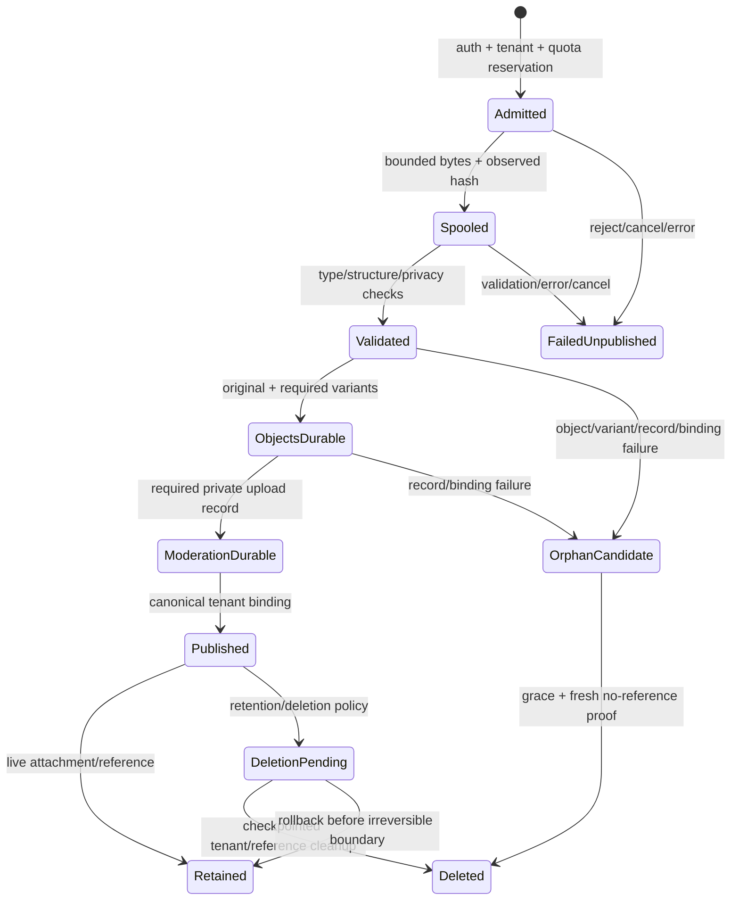

# Media storage and rendering threat model

## Scope and authority

This review covers authenticated media admission, upload streaming, content validation, metadata and thumbnail generation, tenant-scoped object storage, Blossom compatibility, downloads and ranges, native rendering, link previews, moderation records, retention and orphan cleanup. It satisfies acceptance criteria 14.1, 14.2, 19.1 and 19.2 for CAP-031.

Canonical ownership remains unchanged:

- `crates/collaboration_domain` owns media/attachment identity, tenant binding, variants and message links, but never object credentials or raw bytes.
- `crates/collab` owns authenticated admission, validation orchestration, canonical object metadata, storage access and retention checkpoints.
- The configured object store owns bytes only. An object key, hash hit, bucket listing or provider URL never grants read authority.
- `crates/media` and existing native UI components own decoding/rendering after server-side admission. They do not become an upload validator or collaboration metadata store.
- `crates/nostr_compat` owns Blossom wire/URL compatibility over the canonical domain and store. It cannot address the bucket directly or bypass tenant authorization.
- Canonical credentials providers and deployment secret owners supply object-store credentials to the service. Clients receive neither bucket credentials nor broad presigned capability.

Voice/huddle audio transport and transcription are Task 4.7. This document covers stored audio/video attachments and link-preview fetching, not live room transport.

## Source evidence and current gaps

- `projects/buzz/crates/buzz-media/src/auth.rs` verifies signed Blossom kind 24242 events, verb, expiration, freshness, server host and blob hash/scope.
- `upload.rs` validates and hashes before publication, streams video through a temporary file, writes content-addressed bytes and publishes a tenant sidecar last as the serve gate.
- `validation.rs` sniffs bytes rather than trusting `Content-Type`; structurally rejects metadata channels, polyglot/trailing data and unsupported codecs; limits images to 25 megapixels, video to configured bytes, 600 seconds and 3840x2160; caps MP4 top-level atoms, total boxes and nesting.
- `storage.rs` keeps shared raw CAS bytes separate from community-scoped `_meta/{community}/{sha}.json` bindings, collapses missing/failed foreign sidecar reads for public serving, pages listings and surfaces partial/versioned deletion outcomes.
- `bucket_index.rs` uses strict key shapes, a bounded paginated sweep and an `Unknown` class rather than guessing ownership.
- `upload_record.rs` keeps optional uploader/network facts in private append-only records, derives community from `TenantContext` and accepts only a single public IP from an explicitly trusted edge header.
- `thumbnail.rs` decodes and re-encodes images after structural validation, but derived-image work still requires concurrency, frame and output bounds.
- Current `crates/media` is primarily low-level macOS CoreMedia/CoreVideo/Metal binding code. It assumes valid framework objects and contains assertion-shaped FFI helpers; it is not a safe parser for arbitrary uploaded bytes and must be wrapped by fallible, resource-bounded collaboration rendering.
- Buzz relay currently documents no persistent per-pubkey storage quota. Buzz upload comments also defer orphan-blob cleanup, and body-limit classification relies partly on matching upstream error text. These are gaps to close, not semantics to preserve.

## Protected assets

1. Tenant/community confidentiality, including blob existence, size, type, attachment links and moderation facts.
2. Object-store credentials, bucket topology, internal endpoints and provider error details.
3. Integrity of content hashes, metadata, variants, ranges and message-to-attachment references.
4. Service and client availability: request memory, temporary disk, CPU, decoder memory, GPU surfaces, storage/listing operations and cleanup queues.
5. User device safety: no stored XSS, auto-executed attachment, unsafe external navigation, malicious filename/header or decoder-triggered process crash.
6. Location/privacy metadata, uploader identity/IP records, private thumbnails and retained/deleted content.
7. Retention/deletion correctness across shared CAS bytes and tenant-owned bindings.
8. Blossom compatibility without turning legacy URLs or signatures into a cross-tenant authority channel.

## Trust assumptions

- Declared MIME, filename, extension, dimensions, duration, hash header, URL, sidecar JSON, object metadata, range and link-preview response are hostile.
- A valid signature authenticates a principal and request; authorization, tenant scope, freshness, hash binding, quota and content validation are still required.
- Object storage and decoders may fail partially. A compromised storage administrator is outside application containment, but read-time integrity verification and non-public credentials detect or limit application-visible corruption.
- Native framework objects are trusted only after a fallible decoder has produced them from admitted bytes under limits. FFI return codes, dimensions, planes, indexes and pointers are still validated before use.
- Edge-derived uploader IP is trustworthy only when the deployment strips client copies and writes the configured header. Otherwise collection stays disabled/fail-empty.
- Cryptographic hash collision is treated as infeasible, but hash-keyed writes remain immutable/verified so accidental or malicious overwrites cannot silently substitute bytes.

## Security invariants

### INV-MED-01 — authorize before body, existence or range

Resolve the immutable tenant from trusted routing, authenticate the principal and authorize community/resource scope before buffering a request body, querying tenant metadata, returning a count/head/range or revealing whether a hash exists. Authentication errors remain non-enumerating.

### INV-MED-02 — bytes do not carry tenant authority

Raw CAS bytes may be shared by content identity, but an authorized tenant-owned attachment binding is required for every read. Client paths, URLs, extensions, tags and provider metadata never select community. Caches include tenant/authorization state and cannot turn a global hash hit into visibility.

### INV-MED-03 — validation precedes publication

Compute the observed hash and type from bounded bytes, apply structural/codec/metadata validation, generate bounded derived variants and write any mandatory moderation record before publishing the canonical tenant metadata binding. Only the final binding makes an object servable.

### INV-MED-04 — one canonical media state

Canonical metadata records the tenant, hash, observed type, size, variants, provenance and message links. Blossom descriptors and URLs are projections. Object provider metadata, client attachment JSON and legacy sidecars cannot independently change canonical state.

### INV-MED-05 — credentials never cross to clients

Object credentials are service-side, least-privilege and late-bound from deployment secret owners. Public URLs terminate at an authenticated Zed/compatibility endpoint. Storage errors are redacted; logs never contain credentials, signed capability headers, private object paths or collected IP values.

### INV-MED-06 — every parser and renderer is bounded and fallible

Byte size, decompressed pixels, dimensions, frames, duration, tracks, boxes, nesting, metadata, text, variants, concurrent decodes, temporary disk, response ranges and render/GPU allocation have limits before allocation. Malformed media yields a scoped error/placeholder, never a panic or application crash.

### INV-MED-07 — active content stays inert

Only explicitly supported image/video types render inline. Generic files download with safe generated filenames, `Content-Disposition: attachment`, `X-Content-Type-Options: nosniff` and restrictive CSP. SVG, script and executables remain blocked. HTML/PDF or other downloads are never loaded into an application WebView unless a later separately threat-modeled renderer is approved.

### INV-MED-08 — cleanup proves ownership and liveness

Retention/orphan cleanup deletes only strict known writer shapes carrying canonical provenance, after a grace period and a fresh reachability check. It preserves raw/derived bytes referenced by any live tenant binding, checkpoints partial results, fails closed on unknown/versioned storage and resumes idempotently.

### INV-MED-09 — failure does not publish partial state

Body, validation, variant, moderation, object and metadata failures remain visible and retryable. Orphaned bytes/variants are unservable and recorded for bounded cleanup. A retry never deletes a concurrent upload's shared content and never reports success from a sidecar whose bytes are missing.

## Threat register

| Threat ID | Attack or failure | Required control | Assigned evidence |
|---|---|---|---|
| T-MED-001 | Unauthenticated/chunked body forces buffering, hashing or temporary-disk use | Authenticate, tenant-resolve, authorize, rate/concurrency-admit and validate headers before reading body | 38.2, 38.7, 45.2 |
| T-MED-002 | Signed token is replayed, stale, wrong verb, wrong host, wrong hash or lacks tenant membership | Verify signature/event ID, exact verb, bounded age/expiry, server host, hash/scope and current membership; add replay/idempotency policy | 38.2, 38.6, 38.7 |
| T-MED-003 | Client path/tag/URL selects another community's metadata or object key | Derive tenant and all owned prefixes from trusted context; exact hash/extension grammar; never concatenate raw path | 38.1, 38.4, 38.6, 45.2 |
| T-MED-004 | Shared CAS hash exposes existence/size/type across communities | Require tenant attachment binding before HEAD/GET/range; collapse foreign/missing/backend errors without timing/count oracle | 38.4, 38.7, 45.2 |
| T-MED-005 | `Content-Type`/extension disguises SVG, script, executable, audio or video as an image/file | Sniff magic bytes and structural container; route only supported types; generic path rejects recognized media and active/executable formats | 38.3, 38.7 |
| T-MED-006 | Polyglot, trailing bytes, alternate track or private metadata carries executable/location/covert data | Structural allowlist; reject unknown/duplicate metadata chunks, trailing payload, alternate/timed tracks and noncanonical boxes | 38.3, 38.7, 45.2 |
| T-MED-007 | Decompression bomb, huge dimensions, animation frames or crafted parser recursion exhausts CPU/RAM | Pre-decode geometry plus byte/pixel/frame/box/depth/concurrency/deadline limits; isolate CPU work and reject unknown geometry | 38.3, 38.5, 45.2 |
| T-MED-008 | Lying/missing `Content-Length` exceeds request or temporary-disk budget | Enforce streaming byte counter independent of headers; reserve tenant/global temp quota; cancel and remove partial file | 38.2, 38.3, 38.7 |
| T-MED-009 | Slow upload/download holds connection, file, decoder or storage slot indefinitely | Idle/total deadlines, bounded concurrency, backpressure and cancellation propagation through body/temp/object streams | 38.2–38.5, 45.2 |
| T-MED-010 | Hash header authenticates different bytes or storage returns corrupted/substituted data | Compute hash while streaming; compare before commit; immutable/create-only object write; verify length/hash on import and read according to policy | 38.3, 38.4, 38.7 |
| T-MED-011 | Attacker overwrites a content-addressed key or races metadata publication | Conditional create/verified-identical semantics; canonical operation ID; publish tenant binding only after durable object/variant checks | 38.4, 38.7 |
| T-MED-012 | Thumbnail/blurhash decoder crashes, expands excessively or leaks original metadata | Use admitted bytes, bounded fallible decoder, re-encode clean variant, cap dimensions/bytes/time/concurrency and strip metadata | 38.3, 38.5, 45.2 |
| T-MED-013 | Native CoreMedia/CoreVideo/Metal wrapper panics or trusts invalid plane/index/dimension | Validate framework status/pointers/planes/ranges, replace assertion paths with errors at collaboration boundary and cap GPU surfaces | 38.5, 38.7, 45.2 |
| T-MED-014 | Generic HTML/PDF/SVG or deceptive filename becomes stored XSS/code execution | Block active types; force unapproved types to inert attachment with nosniff/CSP/safe filename; never navigate WebView automatically | 38.3, 38.5, 38.7 |
| T-MED-015 | Link preview follows redirects to loopback/cloud metadata or returns active/oversized content | Re-resolve every hop, block private/reserved IPs, restrict schemes/ports, cap redirects/body/decompression/time and sanitize extracted fields | 38.5, 45.2 |
| T-MED-016 | Range underflow/overflow, multi-range amplification or invalid content length leaks/crashes | Parse one supported range against authorized canonical size with checked arithmetic and a maximum response span; correct 206/416 | 38.4, 38.6, 38.7 |
| T-MED-017 | Storage credentials/internal endpoint leak through URL, presign, logs or backend error | Service proxy, credential provider/deployment secret, least-privilege bucket policy and redacted generic errors | 38.2, 38.4, 44.1, 45.2 |
| T-MED-018 | HTTP object endpoint permits plaintext TLS downgrade or unsafe redirect | Production HTTPS/TLS verification; endpoint/config validation; no client-visible redirect to internal object store | 38.2, 38.4, 44.1, 45.2 |
| T-MED-019 | Re-upload idempotency bypasses moderation or quota accounting | Record every accepted upload operation, including existing-byte short-circuit; charge policy by operation/owner and stored logical bytes | 38.2, 38.4, 38.7 |
| T-MED-020 | Spoofed edge header records wrong uploader IP or exposes it publicly | Collection off by default; trust only deployment-stripped named header; accept one public IP; private retention/access; never response/activity/log | 38.2, 38.4, 45.2 |
| T-MED-021 | Partial object/variant/record/metadata write publishes unscanned or missing media | Ordered publish gate, durable operation state, unservable orphan classification and retry/cleanup checkpoint | 38.4, 38.7, 45.3 |
| T-MED-022 | Orphan collector deletes a concurrent upload or shared bytes referenced elsewhere | Grace window, operation/generation provenance, fresh reachability across every tenant binding and conditional delete | 37.5, 38.4, 45.3 |
| T-MED-023 | Unknown key shape, malformed pagination or bucket versioning causes incomplete/destructive cleanup | Strict taxonomy, bounded pagination, no partial snapshot, fail closed on unknown/version artifacts and record recovery action | 37.5, 38.4, 45.3 |
| T-MED-024 | Durable upload flood consumes unbounded tenant/fleet storage despite request limits | Persistent principal/tenant logical-byte/object quotas, reservation before body, reconciliation after failure and visible 429/retry | 38.2, 38.4, 45.2 |
| T-MED-025 | Cache key omits tenant/authorization/variant and serves a prior user's result | Tenant/resource/version-aware caches; authorization before lookup; revoke/delete invalidation; private response caching policy | 38.4, 38.5, 38.7 |
| T-MED-026 | Legacy Blossom URL/alias bypasses canonical validation or exposes raw bucket layout | Strict adapter grammar and auth; resolve canonical metadata; identical headers/ranges/errors; no legacy direct storage writes after cutover | 38.6, 38.7, 45.1 |
| T-MED-027 | Imported Buzz metadata points at absent, wrong-hash or foreign-tenant objects | Stage as untrusted; verify hash/type/size/binding before publication; quarantine failure; idempotent retry and rollback | 17.9, 38.4, 38.7, 45.3 |
| T-MED-028 | Deleted/retained message and attachment state diverge from object/variant/search state | Authoritative reference graph, checkpointed phase order, shared-reference protection and resumable convergence | 37.2, 37.5, 37.7, 45.3 |

## Boundary checklist

Every boundary specifies abuse cases, resource bounds and focused implementation-test owners. Task 4.4 supplies approved operational numbers where this review names a required bound without an existing safe constant.

### MED-01 — upload authentication and admission

- **Entry:** HTTP/Blossom upload request before body read.
- **Authority:** trusted host/listener creates tenant; signed principal plus current membership/resource policy authorizes upload.
- **Abuse cases:** auth oracle, replay, wrong host/hash/verb, missing membership, forged length, rate/concurrency/storage exhaustion.
- **Resource bounds:** header/event bytes and nesting, auth age/expiry, request rate, concurrent uploads, maximum declared bytes and persistent principal/tenant reservation.
- **Secret/privacy control:** no object credentials or internal path in admission; generic auth failures; trusted-edge facts are optional/private.
- **Failure/cancellation:** rejected admission reads no body; cancellation releases reservation/concurrency token and records no successful operation.
- **Assigned tests:** Task 38.2 covers unauthorized, wrong tenant, oversize, replay and expired admission; Task 38.7 exercises legacy/current auth errors; Task 45.2 covers amplification and oracle cases.

### MED-02 — streaming body, hash and temporary file

- **Entry:** authorized request body to bounded stream/spool.
- **Authority:** immutable admission carries tenant, principal, operation ID, allowed type class and reserved quota.
- **Abuse cases:** chunked overflow, slowloris, stream error, disk fill, temp-path race, cancellation leak and hash mismatch.
- **Resource bounds:** byte counter independent of length, chunk/buffer size, upload idle/total time, per-upload and fleet temp bytes/files, open descriptors and concurrent spools.
- **Secret/privacy control:** private random temp file with restrictive permissions; filename contains no user text/hash before verification; no raw body logging.
- **Failure/cancellation:** close/unlink partial temp state, release reservation and surface typed failure; no object/metadata publication.
- **Assigned tests:** Tasks 38.2 and 38.3 cover absent/lying length, over-limit stream, slow/error/cancel, hash mismatch and temp cleanup; Task 45.2 injects resource exhaustion.

### MED-03 — MIME, structure, codec and privacy validation

- **Entry:** bounded bytes/temp file plus claimed metadata.
- **Authority:** observed bytes decide type/hash; client claims are comparison data only.
- **Abuse cases:** polyglot, alternate tracks, EXIF/XMP/location, trailing payload, recursive boxes, zero timescale, unsupported codec, executable or active content.
- **Resource bounds:** existing preservation floors include 25 megapixels, 600-second video, 3840x2160 video, 1,024 top-level atoms, 100,000 MP4 boxes and depth 32; Task 4.4 owns concurrency/deadline and any tightened upload byte limits.
- **Secret/privacy control:** reject noncanonical metadata channels before publication; snapshot-manifest exceptions are exact, single and separately schema-bounded.
- **Failure/cancellation:** CPU work is cancellable/bounded; parser panic becomes typed invalid-media failure; invalid bytes remain unservable and temp state is cleaned.
- **Assigned tests:** Task 38.3 corpus covers polyglot, truncated, oversized, hash mismatch and supported files; Task 38.7 freezes old/new classification and errors.

### MED-04 — derived thumbnail/metadata generation

- **Entry:** already admitted image/video plus canonical hash/type.
- **Authority:** server recomputes dimensions/duration/variant hash; client-supplied thumbnail URL/blurhash/dimensions are ignored.
- **Abuse cases:** decompression/frame bomb, decoder crash, huge thumbnail, metadata retention, variant collision and partial write.
- **Resource bounds:** decoded pixels/frames, CPU deadline, concurrent decoders, memory, output dimensions/bytes and number of variants.
- **Secret/privacy control:** re-encode metadata-free variants; derived URLs are canonical projections without credentials.
- **Failure/cancellation:** no tenant binding is published when a mandatory variant fails; optional variant failure is explicitly represented and never points to absent data.
- **Assigned tests:** Tasks 38.3 and 38.5 cover decode bombs, corrupt media, metadata stripping, thumbnail failure, missing variant and bounded output.

### MED-05 — canonical metadata and object-store commit

- **Entry:** validated original, variants, moderation facts and tenant/principal operation.
- **Authority:** canonical metadata binding is the serve gate; object provider state and legacy sidecars are not domain authority.
- **Abuse cases:** cross-tenant key, overwrite/race, missing blob, partial PUT, provider error leak, quota drift and duplicate operation.
- **Resource bounds:** key/metadata/variant count, object bytes, storage request deadline/retry, queue, per-principal/tenant/fleet quotas and reconciliation batch.
- **Secret/privacy control:** least-privilege credentials service-side; key grammar from typed tenant/hash; private moderation records in a non-serve namespace.
- **Failure/cancellation:** ordered writes and operation checkpoint; orphan is unservable; retry verifies existing bytes; quota reservation reconciles; no concurrent shared-object delete.
- **Assigned tests:** Task 38.4 covers duplicate hash, tenant fence, missing object and safe cleanup; Task 38.7 covers partial failure and compatibility; Task 45.3 covers interrupted convergence.

### MED-06 — authorized download, HEAD and range serving

- **Entry:** current or legacy URL/hash/range request.
- **Authority:** trusted tenant plus current attachment/resource permission and canonical metadata; blob existence alone is insufficient.
- **Abuse cases:** existence/timing oracle, range amplification/overflow, type confusion, stored XSS, cache bleed and corrupted object.
- **Resource bounds:** path/header/range grammar, one approved range, maximum span, streaming buffer, download concurrency/rate and idle/total deadline.
- **Secret/privacy control:** proxy response contains no storage credentials/internal endpoint; foreign/absent metadata collapses safely; private caching headers.
- **Failure/cancellation:** abort object stream and release slot; midstream failure terminates response without changing metadata or fabricating complete length.
- **Assigned tests:** Tasks 38.4, 38.6 and 38.7 cover ranges, missing/foreign object, headers, alias, auth, cache and provider failure.

### MED-07 — Blossom compatibility adapter

- **Entry:** BUD-compatible signed auth, upload/get route and legacy media alias.
- **Authority:** adapter validates wire semantics then calls MED-01/MED-06; it does not own data or credentials.
- **Abuse cases:** unsupported verb/version, duplicate scope tags, host normalization confusion, long-lived token, path alias traversal and failure-frame divergence.
- **Resource bounds:** event/tag/path bytes/count/depth, freshness/expiry, body/range limits inherited from canonical operation and bounded response JSON.
- **Secret/privacy control:** client signature/capability is scoped to exact server/hash operation and redacted from logs; descriptor URLs contain no provider credentials.
- **Failure/cancellation:** canonical operation cancellation/rollback applies; protocol error is compatible but never reveals extra authorization state.
- **Assigned tests:** Task 38.6 covers signed upload/get/range/alias/auth/errors; Task 38.7 differentially tests old/new clients; Task 45.1 runs independent protocol gates.

### MED-08 — native attachment decoding and GPUI rendering

- **Entry:** authorized canonical attachment metadata and bounded bytes/variant.
- **Authority:** supported renderer selected from observed canonical MIME; metadata cannot select arbitrary code/WebView/path.
- **Abuse cases:** malformed decoder input, unsafe FFI result, huge frame/GPU texture, autoplay/resource loop, active content, deceptive link/file action and accessibility denial.
- **Resource bounds:** encoded/decoded bytes, dimensions, frames, duration, texture memory, concurrent renders, animation rate and lifecycle/cache budget.
- **Secret/privacy control:** tenant-scoped fetch/cache; no private filesystem/object URL; sanitized labels and no automatic external navigation/download execution.
- **Failure/cancellation:** fallible decoder/FFI checks render a placeholder and release textures/streams/tasks; pane/message remains usable.
- **Assigned tests:** Task 38.5 covers thumbnail/unsupported/missing/accessibility states; Task 38.7 uses malformed native fixtures; Task 45.2 requires no panic/crash/leak.

### MED-09 — link-preview fetch and presentation

- **Entry:** URL from an authorized message/attachment.
- **Authority:** URL is hostile content; preview fetch receives no message/user credentials and grants no navigation permission.
- **Abuse cases:** SSRF, DNS rebinding, redirect to private range, oversized/compressed response, tracking leak, active HTML/script and deceptive target.
- **Resource bounds:** schemes/ports/redirects, DNS/IP checks each hop, response/compressed/decompressed bytes, parse depth/text/images, deadline, concurrency/cache TTL.
- **Secret/privacy control:** isolated fetch identity, no cookies/auth/referrer/private IP, sanitized text/image proxy and visible final origin.
- **Failure/cancellation:** cancel/timeout closes response; failure yields a plain safe link card, not retry storm or hidden navigation.
- **Assigned tests:** Task 38.5 covers preview fallback and safe rendering; Task 45.2 covers SSRF/redirect/rebinding, size and cancellation.

### MED-10 — retention, deletion, moderation and orphan cleanup

- **Entry:** canonical retention/deletion checkpoint or scheduled orphan/taxonomy sweep.
- **Authority:** canonical reference graph and tenant lifecycle; key prefix alone is not deletion authority.
- **Abuse cases:** delete shared bytes, race in-flight upload, incomplete pagination, unknown key coercion, versioning delete marker, forged moderation record and privacy over-retention.
- **Resource bounds:** page/batch/object caps, deadline, bounded unknown-key sample, retry/backoff, grace age and cleanup concurrency.
- **Secret/privacy control:** uploader/IP facts are private, scoped and retained/deleted by approved policy; cleanup logs stable IDs/counts, not object contents/IPs/credentials.
- **Failure/cancellation:** checkpoint every phase; partial/versioned/unknown result halts safely; retry is idempotent; rollback preserves still-referenced bytes and explains manual recovery.
- **Assigned tests:** Tasks 37.2, 37.5, 37.7, 38.4, 45.2 and 45.3 cover shared references, true orphans, unknown taxonomy, versioned bucket, interrupted storage and privacy.

## Required resource-limit handoff to Task 4.4

| Limit family | Required dimensions |
|---|---|
| Admission | auth/header/event bytes/tags, request rate, concurrent uploads, principal/tenant logical bytes/objects and reservation TTL |
| Body/spool | per-type encoded bytes, chunk/buffer, idle/total time, temporary bytes/files/descriptors and concurrent spools |
| Validation | pixels, dimensions, animation frames, duration, tracks, atoms/boxes/depth, parser CPU time and concurrent validators |
| Derivation/render | variants, output bytes/dimensions, concurrent decoders, decode memory/CPU, textures/GPU memory, animation rate and cache |
| Storage | request/retry deadline, queue, key/metadata sizes, range span, streaming buffer/concurrency and integrity-check policy |
| Preview | schemes/ports/redirects, response/decompressed bytes, parse depth, concurrency, deadline and cache TTL |
| Cleanup | listing page/fleet cap, batch, unknown sample, grace age, concurrency, retry/backoff and stale-checkpoint threshold |

Existing Buzz values listed in MED-03 are preservation ceilings where applicable, not proof that target operational limits are complete.

## Cleanup state machine

Rules:

1. Only `Published` is servable.
2. An `OrphanCandidate` is never deleted merely because its tenant binding is currently absent; cleanup waits beyond the maximum in-flight operation window and checks every live tenant/reference.
3. Shared original/variant bytes survive while any authorized canonical binding references their content identity.
4. Unknown key shapes, incomplete listings, provider version artifacts or missing fresh reference evidence halt deletion.
5. Cleanup and retention use stable operation/checkpoint IDs so cancellation, crash and retry converge without double-deleting or losing audit evidence.

## Error and response policy

- Authentication failures use one generic response; authorization failure may be distinguished only after valid identity without revealing foreign resource existence.
- Invalid/unsupported/oversized media returns a stable client error with no parser/backend details.
- Object/decoder/internal failures return generic service errors to clients and redacted structured diagnostics to operators.
- Range failures distinguish syntactic/unsatisfiable range only after authorization.
- A thumbnail/link-preview failure does not make the message disappear. The UI shows a safe fallback and retry where retry is bounded and meaningful.
- Cancellation, partial upload and partial cleanup expose the actual state/recovery action; no successful descriptor points at absent or unpublished bytes.

## Compatibility and migration rules

1. Existing Buzz raw objects, tenant sidecars, upload records, descriptors and aliases are migration inputs, not permanent parallel state.
2. Import recomputes/verifies byte hash, observed type, size and tenant binding before publishing canonical metadata. Failed or ambiguous records are quarantined with source evidence.
3. During compatibility, old and new URLs resolve through the same canonical authorization, range, headers and object store. There is no dual media authority.
4. Temporary copied bytes require a manifest, integrity comparison, observability, rollback pointer and deletion task. A copied object is not authoritative until its canonical metadata switches.
5. Blossom compatibility remains long-term only at the wire adapter. Buzz object/sidecar writers retire after Tasks 38.7, 45.1 and the migration/cutover gates pass.

## Assumptions, residual risks and explicit gaps

1. The durable principal/tenant quota required by T-MED-024 does not exist in the audited Buzz path. Request size and concurrency limits are insufficient; Task 38.2/38.4 must add reservation/reconciliation before production upload cutover.
2. Buzz intentionally leaves failed fresh-upload blobs/variants for a future grace-period GC to avoid deleting a concurrent same-hash upload. The target must implement the proved cleanup path in Tasks 37.5/38.4 rather than deleting eagerly or accepting permanent residue.
3. Buzz video body-limit mapping checks upstream error text as a fallback. Target correctness must use a typed limiter/error boundary; string matching may remain compatibility diagnostics only.
4. Shared CAS makes cross-tenant deduplication observable to privileged storage operators and potentially through timing if admission/serve paths differ. Public APIs must equalize authorization behavior; storage-operator confidentiality is an infrastructure trust boundary.
5. Generic HTML is safe only while attachment/nosniff/CSP and no-WebView-navigation remain jointly enforced. A future inline document renderer requires a new threat review.
6. `crates/media` unsafe wrappers are low-level platform bindings. Task 38.5 must add fallible bounds and tests; a framework assertion or invalid pointer/plane must not be reachable as an application crash from collaboration media.
7. Optional uploader IP collection creates sensitive moderation data. Its lawful basis, access, retention and deletion policy require the moderation/retention owners; the safe default remains off.
8. Exact service concurrency, temp-disk, decoder/GPU, preview and cleanup numeric budgets remain Task 4.4 work. Missing values fail readiness rather than becoming unlimited.

## Requirements traceability

| Acceptance criterion | Controls | Boundaries | Implementation/test leaves |
|---|---|---|---|
| 14.1 | INV-MED-01–INV-MED-06, INV-MED-08–INV-MED-09; T-MED-001–T-MED-013, T-MED-016–T-MED-025, T-MED-027–T-MED-028 | MED-01–MED-07, MED-10 | 17.9, 37.2, 37.5, 38.1–38.4, 38.6–38.7, 45.2–45.3 |
| 14.2 | INV-MED-03–INV-MED-07; T-MED-012–T-MED-016, T-MED-025–T-MED-026 | MED-04, MED-06–MED-09 | 38.1, 38.3, 38.5–38.7, 45.1–45.2 |
| 19.1 | Threat register T-MED-001–T-MED-028 | MED-01–MED-10 | 4.4, 37.5, 38.2–38.7, 45.1–45.3 |
| 19.2 | INV-MED-01–INV-MED-09 and all boundary resource/secret/failure controls | MED-01–MED-10 | 4.4, 38.2–38.7, 44.1, 45.2–45.3 |

## Review completion criteria

This review remains satisfied only while:

- every new upload, decoder, renderer, preview, store or cleanup boundary is added to MED-01–MED-10 with explicit resource and negative tests;
- no client, adapter or cache can address shared CAS bytes without a current tenant-owned canonical binding;
- no supported media type reaches native decoding without observed-type and structural validation;
- no compatibility path exposes object credentials, raw bucket paths or weaker authorization/headers;
- Task 45.2 reports passing negative evidence for every T-MED threat and Task 45.3 reports interruption/recovery evidence before cutover.
