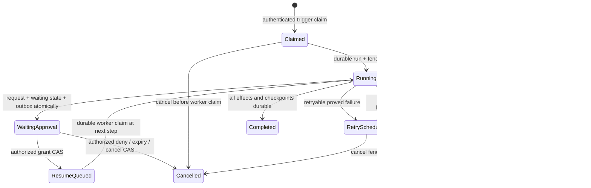

# Workflow and webhook execution threat model

## Scope and authority

This review covers versioned workflow definitions, event/cron/inbound-webhook triggers, condition and template evaluation, durable run admission, step dispatch, outbound webhooks, retries, cancellation, approval suspension/resumption, audit evidence and compatibility migration. It satisfies acceptance criteria 13.2, 13.3, 19.1 and 19.2 for CAP-027.

Canonical ownership remains unchanged:

- `crates/collaboration_workflow` owns the I/O-free definition, condition, retry and run-state model. Definitions cannot execute actions or store secrets.
- `crates/collab` owns authenticated trigger admission, durable run/step/approval state, leases, retries, cancellation, action orchestration and audit linkage.
- Existing canonical collaboration commands own message, DM, channel, reaction, agent-job and other product mutations. A workflow executor is a caller of those commands, never a second permission or persistence path.
- Zed's credentials provider owns webhook and action secrets. Definitions contain opaque secret references; resolved values are late-bound for one attempt and are never projected, persisted in traces or returned to clients.
- `crates/nostr_compat` owns signed workflow/approval event compatibility. Wire events authenticate requests but cannot independently mutate run or approval state.
- The canonical audit writer owns tamper-evident records keyed by stable operation IDs. Workflow logs and activity projections are bounded, redacted views rather than authority.

Exact service/database placement remains subject to ADR-001. This review does not choose that topology and does not authorize a second workflow engine during migration.

## Source evidence and current gaps

- `projects/buzz/crates/buzz-workflow/src/schema.rs` supports message, reaction, diff, schedule and webhook triggers plus seven actions. Validation currently covers a non-empty name/step list, unique restricted step IDs and schedule syntax/minimum interval. It does not bound definition size, step count, templates, headers, timeouts or retry policy, and it accepts literal outbound headers such as `Authorization`.
- `projects/buzz/crates/buzz-workflow/src/executor.rs` bounds condition text to 4,096 bytes and wall time to 100 ms, caps delay at 270 seconds, applies a per-step timeout and caps outbound webhook response bodies at 1 MiB. The timed-out `spawn_blocking` condition continues running, so the input bound is essential and an executor-wide CPU/concurrency bound is still required.
- Buzz outbound webhook code resolves all addresses, rejects any private/reserved result, pins the chosen public address, disables proxies and redirects and uses a 10-second request timeout. It does not require HTTPS, restrict methods/ports or header names, cap request/template output, classify non-success HTTP status as failure, or provide durable retry/idempotency semantics.
- `projects/buzz/crates/buzz-relay/src/api/bridge.rs`, `router.rs` and `webhook_secret.rs` implement the actual inbound `/hooks/{id}` route. The route binds community from the host, uses a 1 MiB router body cap, verifies a UUID bearer secret in constant time, rechecks current owner authority and returns an asynchronous run ID. Query-string secrets remain supported and can leak through infrastructure logs/history; there is no replay nonce, per-hook rate budget or trigger idempotency key.
- Webhook secrets are stored inside the workflow definition JSON and its definition hash. API helpers strip the field from normal responses, but canonical target storage must use the credentials provider rather than retain plaintext secret material in domain JSON.
- The event and schedule paths recheck the workflow owner's current membership, require elevated authority for exfiltration-capable definitions and use a durable scheduled-fire claim across replicas. Event-trigger run creation still requires an explicit stable dedup/operation contract, and schedule catch-up policy is not a versioned definition property.
- Only `send_message` uses the relay `ActionSink`. `send_dm` and `set_channel_topic` return `NotImplemented`; reaction execution performs an HTTP loopback with environment credentials; builds without `reqwest` report reaction/webhook work as a completed step with `skipped: true`. These are migration gaps, not compatible successful outcomes.
- `RequestApproval` returns a random token, but `WorkflowEngine::finalize_run` deliberately marks the run failed instead of creating an approval record or `waiting_approval` state. Separate Buzz database and relay command code can store hashed approval tokens and process grant/deny events, but no audited execution path creates the required record. The grant/deny update and event persistence also use separate transactions/connections despite a comment claiming atomicity, and resume/cancel occurs after commit in a detached task. The target must consolidate this dead split path rather than preserve it.
- Existing approval authorization accepts `any`/empty or an exact pubkey. Role and mention forms advertised by the schema fail closed and current membership/role is not re-evaluated for the supported `any` case. Self-approval and separation-of-duty policy are not modeled.
- Buzz has no workflow retry definition or durable attempt/lease/checkpoint model. A failed action moves the run to failed, while a crash can leave `pending`, `running` or an already-committed external side effect without deterministic recovery.

## Protected assets

1. Community/project confidentiality, including message bodies, webhook payloads, workflow definitions, conditions, run inputs/outputs and approval notes.
2. Integrity of canonical messages, channel state, Git/project state, agent jobs, workflow versions, run/step state, approvals and audit records.
3. Webhook bearer secrets, action credentials, signing keys, provider tokens and sensitive template values.
4. Tenant isolation and current principal authority at trigger, action, approval and retry time.
5. Exactly-once logical effects: a retry, replay, crash or competing replica must not duplicate an action or skip an approval gate.
6. Service availability: parser/evaluator CPU, scheduler/worker capacity, queues, database leases, outbound sockets, response buffers and audit/log volume.
7. Truthful user-visible state. `completed`, `skipped`, `waiting`, `failed`, `cancelled` and `retrying` must correspond to durable reality.
8. Compatibility with signed Buzz workflow/approval events without allowing the adapter to become a second state machine.

## Trust assumptions

- Workflow YAML/JSON, webhook path/query/header/body, signed event content/tags, schedule configuration, condition/template text, action output, HTTP response and approval note are hostile.
- A valid signature or webhook secret authenticates one request; it does not prove tenant membership, owner standing authority, freshness, idempotency, action permission or approval eligibility.
- Workflow authors may be malicious and authorized. Definition validation must still prevent resource exhaustion, secret literals, unsafe destinations and authority laundering.
- DNS, proxies and remote HTTP services are hostile and may change between resolution and connection, redirect, stall, stream indefinitely or reflect secrets.
- Database, queue, process and network operations may fail between any two durable writes. Correctness cannot depend on an in-memory task reaching its next statement.
- Clock skew exists across replicas. Durable claims and database time establish ordering; client clocks and worker-local maps do not.
- Compatibility clients can be old, duplicated or replayed. Event IDs and adapter versions are inputs to canonical idempotency, never permission shortcuts.

## Security invariants

### INV-WF-01 — immutable tenant and version provenance

Trusted routing/event provenance fixes the community before workflow lookup. Every definition version, trigger claim, run, step, approval, action attempt and audit record carries that tenant plus stable workflow/version/run/operation IDs. IDs from payloads never select another tenant or silently switch definition versions.

### INV-WF-02 — validate and bound before activation

Definitions are parsed with byte/depth/alias limits, reject unknown fields/actions, bound steps/templates/conditions/headers/timeouts/retries and prohibit literal secrets. Saving and enabling are separate authorized operations; an invalid, unsupported or compatibility-only action cannot become active.

### INV-WF-03 — every trigger is authenticated, authorized and idempotent

Event, schedule, webhook and manual triggers authenticate their source, recheck current workflow-owner authority and atomically claim a stable trigger key before creating one run. Duplicate, reordered or replayed input returns the existing outcome without creating another logical execution.

### INV-WF-04 — actions use canonical commands and current permissions

Immediately before each side effect, the executor verifies the tenant lifecycle fence, workflow/version status, owner identity and current target permission. Every action calls the same canonical command as an interactive user/agent, with an explicit workflow actor/provenance envelope. No loopback credential, relay signer or adapter bypasses authorization.

### INV-WF-05 — effects and checkpoints have one operation identity

Each action attempt carries a deterministic logical operation ID derived from tenant/run/step/definition version. Canonical idempotent commands persist that key with their effect. Non-idempotent external effects require an explicit provider idempotency contract or are never automatically retried after an ambiguous result.

### INV-WF-06 — approvals are durable, one-shot and fail closed

Reaching an approval step atomically persists the waiting run, approval request, exact definition/step/version, eligibility policy, expiry and hashed capability. Exactly one currently authorized grant/deny/expiry transition wins by compare-and-set. Resume/cancel is durably enqueued in the same transaction and cannot skip, replay or apply to a different run/version.

### INV-WF-07 — retries are explicit, bounded and permission preserving

Retry policy is versioned and bounded by action class, attempts, elapsed deadline and backoff/jitter. Every retry rechecks tenant, workflow, owner, target, secret version and approval state. Exhaustion records a redacted terminal failure; it never changes failure into success or bypasses a gate.

### INV-WF-08 — secrets are references, late-bound and non-observable

Definitions, trigger context, templates, step outputs, errors, audit, activity and compatibility events contain only secret reference IDs or redacted markers. Workers resolve the minimum secret immediately before one authorized use, prevent secret-derived values from entering expressions/output, and drop material on completion/cancel.

### INV-WF-09 — cancellation and crash recovery converge

Cancellation revokes the run lease, aborts cancellable evaluation/network/action work and prevents any later unclaimed step from starting. A sweeper reclaims expired leases and classifies ambiguous effects using operation records. Restarts deterministically resume, retry, compensate or require operator action; they never guess success.

### INV-WF-10 — observed state is truthful and bounded

Run/step states, errors, response excerpts and audit entries are bounded and redacted. An unimplemented, feature-disabled, timed-out, non-success or ambiguous action cannot be recorded as completed. Unknown legacy states remain visible as compatibility/repair-required states.

## Threat register

| Threat ID | Attack or failure | Required control | Assigned evidence |
|---|---|---|---|
| T-WF-001 | Host, workflow UUID or payload selects a workflow in another community | Bind tenant from trusted listener/host or verified event before scoped lookup; generic absence response; tenant keys on every record | 34.4, 34.9, 45.2 |
| T-WF-002 | Oversized/deep YAML, aliases, steps, maps or strings exhaust parser/memory | Pre-parse byte limit, safe YAML mode, depth/node/alias/step/string/header bounds and definition validation fixtures | 34.1, 45.2 |
| T-WF-003 | Unknown field/action/version is ignored or later gains dangerous meaning | Deny unknown fields/actions/versions; canonical version negotiation and inactive quarantine | 34.1, 43.2, 45.1 |
| T-WF-004 | Literal API token or secret is persisted in definition/header/body | Permit typed secret references only; scan/reject literal secret fields; migrate existing secrets to credential records | 17.7, 34.1, 34.9, 45.2 |
| T-WF-005 | Malicious template expands trigger/output into an unbounded request, message or header | Bound source and rendered bytes per field; reject unresolved/recursive tokens and invalid destination/header characters | 34.1, 34.5, 45.2 |
| T-WF-006 | Condition expression consumes CPU or timed-out blocking jobs accumulate | Bound bytes/AST/depth/functions, dedicated bounded evaluator pool, wall/CPU deadline and saturation rejection | 34.1, 34.3, 45.2 |
| T-WF-007 | Webhook body/key spoofs reserved trigger/step variables or injects expression names | Exact body schema; bounded key grammar/count/value; namespace separation; server fields override hostile fields | 34.4, 45.2 |
| T-WF-008 | Event trigger is unsigned, unauthorized, wrong kind/channel or recursively emitted by a workflow | Verify event/id/signature/schema/tenant/membership; exact trigger predicate; mark and suppress recursive workflow output | 34.3, 45.1, 45.2 |
| T-WF-009 | Replayed/duplicate/out-of-order event creates duplicate runs | Atomic tenant/workflow/version/event trigger claim and existing-run response | 34.3, 34.9, 34.8 |
| T-WF-010 | Replica clock skew or restart double-fires/misses a schedule | Database-time deterministic fire key, unique claim, bounded catch-up and restart fixtures | 34.3, 34.8, 45.5 |
| T-WF-011 | Unbounded schedule catch-up creates a thundering herd | Versioned catch-up policy with maximum windows/runs, per-tenant queue budget and visible skipped backlog | 34.1, 34.3, 44.3, 45.5 |
| T-WF-012 | Inbound webhook bearer is absent, guessed, logged or replayed | High-entropy credential-provider secret, constant-time verify, header-only target protocol, rotation, rate limit and optional signed timestamp/idempotency key | 34.4, 34.8, 45.2 |
| T-WF-013 | Query-string secret leaks through proxy/history during compatibility | Deprecate query secret, redact at ingress/proxy, negotiate support floor, rotate after suspected exposure and remove by compatibility gate | 34.4, 43.2, 43.8, 45.2 |
| T-WF-014 | Webhook request body or slow client exhausts memory/connections | Authenticate/admit before body, streaming byte counter, body/key/depth limits, idle/total deadline, rate/concurrency budget | 34.4, 44.3, 45.2 |
| T-WF-015 | Outbound URL targets loopback, private/reserved, link-local, metadata or unsafe scheme/port | HTTPS allow policy, scheme/port/host validation, all-address private-range denial, DNS pinning and no proxy | 34.5, 45.2 |
| T-WF-016 | Redirect, DNS rebinding or mixed public/private answer bypasses SSRF gate | Disable redirects or revalidate every hop; reject if any answer unsafe; pin connection and verify TLS hostname | 34.5, 45.2 |
| T-WF-017 | Author controls `Host`, `Authorization`, forwarding or hop-by-hop headers | Header allowlist/denylist, valid name/value/total bounds; service-owned host/content length; secret refs for credentials | 34.1, 34.5, 45.2 |
| T-WF-018 | Remote webhook streams huge/compressed response, stalls or returns active/sensitive content | Header/stream/decompressed byte, idle/total time and content-type bounds; store redacted structured excerpt only | 34.5, 45.2 |
| T-WF-019 | HTTP 4xx/5xx or feature-disabled webhook/reaction is recorded completed | Typed success/failure policy; unsupported build fails validation/readiness; no `skipped` success placeholder | 34.1, 34.5, 34.8 |
| T-WF-020 | Workflow uses relay/environment credentials or HTTP loopback to bypass canonical permissions | Remove loopback action path; call canonical command with workflow actor and current permission envelope | 34.5, 45.2 |
| T-WF-021 | Owner is removed/demoted or workflow disabled after trigger but before action/retry | Recheck tenant fence, definition version/status, owner and target permission immediately before every attempt | 34.5, 34.8, 45.2 |
| T-WF-022 | Crash between external effect and step checkpoint duplicates a retry | Stable operation ID/provider idempotency; transactional local command; ambiguous external result never auto-retried without proof | 34.5, 34.8, 45.5 |
| T-WF-023 | Retry policy is absent, infinite, zero-delay or applied to permanent/permission failure | Validate bounded attempts/elapsed time/exponential backoff+jitter and explicit retryable taxonomy | 34.1, 34.5, 34.8 |
| T-WF-024 | Retry resolves a different/rotated secret or target without audit | Pin permitted secret reference/target policy in definition version; record resolved secret version, never value; reauthorize | 34.5, 35.3, 45.2 |
| T-WF-025 | Cancellation races a worker and later steps/effects continue | Fenced run lease/cancel generation checked before dispatch and commit; propagate cancellation to evaluator/network/tool | 34.8, 45.5 |
| T-WF-026 | Crash leaves run forever pending/running/waiting or detached resume is lost | Durable leases/outbox, heartbeat/sweeper, resumable checkpoints and explicit ambiguous-state repair | 34.8, 34.9, 44.5, 45.5 |
| T-WF-027 | Approval token is forged, stored plaintext, logged or usable across tenant/run/step/version | Random capability stored hashed; bind lookup and signed decision to tenant/run/step/version; redact everywhere | 34.6, 35.3, 45.2 |
| T-WF-028 | Two grant/deny/expiry decisions race and both cause transitions | One database transaction with pending-state CAS, command-event dedup, run transition and durable resume/cancel outbox | 34.6, 34.8, 45.2 |
| T-WF-029 | Unauthorized, revoked, self or stale-role principal approves | Resolve explicit eligibility from current canonical identity/membership at decision time; separation-of-duty/self-approval policy | 34.6, 45.2 |
| T-WF-030 | Approval applies after definition edit, run cancel, timeout or earlier failure | Bind immutable version/step and require waiting run/current gate; stale decisions reject without side effect | 34.6, 34.8, 45.2 |
| T-WF-031 | Grant skips approval step or denial leaves downstream work runnable | Persist approval output and next-step checkpoint atomically; denial/expiry terminally fences run; recovery exercises both paths | 34.6, 34.8 |
| T-WF-032 | Action output/error/note exposes secrets or unbounded remote content in trace/activity/audit | Typed output projection, field/byte limits, structured redaction and private raw-detail access policy | 34.5, 34.7, 35.3, 45.2 |
| T-WF-033 | Cross-tenant or noisy workflow monopolizes worker, DB, HTTP or audit capacity | Per-tenant/global queue/concurrency/fairness limits, admission backpressure, bounded logs and cancellation | 34.3–34.5, 44.3, 45.5 |
| T-WF-034 | Compatibility adapter directly writes runs/approvals or accepts weaker legacy authority | Adapter verifies/maps to canonical commands; one domain state machine; differential negative tests and version gate | 34.6, 43.2, 45.1, 45.2 |
| T-WF-035 | Import/dual-run creates two engines or duplicate effects | Import definitions/runs once, shadow without effects, reconcile by stable IDs, cut over one executor and retire Buzz writers | 17.7, 34.9, 46.4, 48.2 |
| T-WF-036 | Audit/log tampering hides bypass, retry or ambiguous effect | Stable operation IDs, canonical redaction and per-community tamper-evident chain for every decision/outcome | 35.1–35.3, 45.2 |

## Boundary checklist

Every boundary below names its authority, hostile input, resource controls, failure/recovery behavior and focused test owner. Task 4.4 supplies approved numeric operational budgets where this review requires a bound without a safe frozen value.

### WF-01 — definition parse, validation and activation

- **Entry:** YAML/JSON or imported Buzz definition before persistence/enablement.
- **Authority:** authenticated community/project administrator; parser yields an immutable canonical version and secret references only.
- **Abuse cases:** parser bomb, unknown version/action, literal secret, recursive/unbounded template, invalid timeout/retry, unsupported compatibility action and privilege-laundering definition.
- **Resource bounds:** definition bytes, YAML depth/nodes/aliases, steps, strings, maps/headers, condition/template AST and total rendered ceilings.
- **Secret control:** reject literal credential fields; resolve references only at execution; redact imported `_webhook_secret` while moving it to credentials storage.
- **Failure/recovery:** invalid definitions are inert with path-specific bounded errors; import quarantine retains source evidence; activation is explicit and auditable.
- **Assigned tests:** Task 34.1 covers supported/unknown versions, parser limits, secret literals, unsupported actions and retry bounds; Tasks 17.7/34.9 cover import and persistence; Task 45.2 runs hostile fixtures.

### WF-02 — signed event and manual trigger admission

- **Entry:** verified collaboration event or authorized manual-run command.
- **Authority:** trusted tenant provenance plus current trigger/workflow/owner authorization; event signature is authentication only.
- **Abuse cases:** wrong kind/channel/tenant, spoofed author, recursive event, duplicate/replay, disabled version, revoked owner and race across replicas.
- **Resource bounds:** event/frame/tag/content limits, trigger evaluations per event, per-tenant run queue, concurrency and dedup retention.
- **Secret control:** trigger context contains allowed bounded fields only; private event content follows its original visibility and is not broadly projected.
- **Failure/recovery:** atomic trigger claim returns existing run on replay; lookup/auth failure creates no run; queue rejection is visible/retryable under policy.
- **Assigned tests:** Tasks 34.3/34.9 cover trigger filtering, authorization, duplicates and claims; Task 34.8 covers restart; Tasks 45.1/45.2 cover protocol and cross-tenant negatives.

### WF-03 — schedule claim and catch-up

- **Entry:** scheduler evaluation against enabled immutable definitions.
- **Authority:** database time and tenant-scoped unique fire key; worker-local time/map is optimization only.
- **Abuse cases:** clock skew, restart/replica double-fire, missed window, invalid timezone/cron, sub-minute flood and unbounded catch-up.
- **Resource bounds:** tick work, workflows scanned, catch-up windows/runs, claims per tenant, queue/concurrency and schedule horizon.
- **Secret control:** schedule records contain no credentials or trigger payload.
- **Failure/recovery:** claim before run; failed claim creates no action; crash recovery resumes from durable claim/run relation and reports orphan claims.
- **Assigned tests:** Tasks 34.1/34.3 cover syntax, skew, catch-up and duplicate replicas; Task 34.8 covers claim/run crash points; Task 45.5 covers scheduler load/fairness.

### WF-04 — inbound webhook authentication and admission

- **Entry:** `/hooks/{id}` request before body buffering or workflow existence disclosure.
- **Authority:** trusted host selects tenant; credential-provider secret (and optional signed timestamp/idempotency contract) authenticates trigger; current owner authority is rechecked.
- **Abuse cases:** tenant enumeration, secret guessing/leak/replay, query logging, oversized/slow/invalid JSON, reserved key spoofing, disabled workflow and request flood.
- **Resource bounds:** path/header/query/body bytes, JSON depth/keys/value bytes, auth attempts, per-hook/principal/IP rate, concurrency, idle/total deadline and replay window.
- **Secret control:** header-only target protocol, constant-time verification, secret rotation/version, ingress redaction and no secret in definition/API/log/activity.
- **Failure/recovery:** auth happens before body; generic missing/unauthorized shape; atomic idempotency claim; cancellation creates no partial run; accepted response returns durable run ID.
- **Assigned tests:** Task 34.4 covers tenant, signature/secret, replay, oversize, timeout, key namespace and disabled/revoked cases; Task 34.8 covers crash after claim; Task 45.2 covers oracle/amplification.

### WF-05 — condition and template evaluation

- **Entry:** immutable step plus bounded trigger context and prior typed step outputs.
- **Authority:** fixed allowlisted evaluator functions and fields; expressions cannot perform I/O, inspect secrets or choose tenant/permission authority.
- **Abuse cases:** CPU/memory bomb, type confusion, namespace collision, unknown/unclosed template, output injection, secret reference expansion and log injection.
- **Resource bounds:** expression/template bytes and AST, evaluation CPU/wall time, bounded worker pool, input/output fields and aggregate rendered bytes.
- **Secret control:** secret values never enter context; sensitive outputs are non-templateable or explicitly classified/redacted.
- **Failure/recovery:** false is a truthful skip; parse/type/timeout/saturation is a typed step failure, never false or success; cancellation stops admission of further evaluator work.
- **Assigned tests:** Tasks 34.1/34.3 cover grammar, namespaces, functions, limits and false/error distinction; Task 34.8 covers timeout/restart; Task 45.2 covers evaluator saturation.

### WF-06 — durable run repository, lease and checkpoint

- **Entry:** accepted trigger claim or due retry/resume.
- **Authority:** tenant-scoped repository owns run/step/attempt state and fenced worker lease; executor memory is a cache.
- **Abuse cases:** duplicate worker, stale lease commit, cross-version resume, lost trigger context, unbounded trace, stuck run and unauthorized cancellation.
- **Resource bounds:** active/history rows, trace/output/error bytes, attempts, lease/heartbeat, queue age, recovery batch and retention.
- **Secret control:** typed/redacted context and outputs only; no resolved credential; database errors/logs use stable IDs.
- **Failure/recovery:** every transition is compare-and-set; expired leases are reclaimed; ambiguous effects enter explicit repair state; cancellation increments a fence generation.
- **Assigned tests:** Task 34.9 owns scoped schema/repository/leases; Task 34.8 injects crash, stale lease, cancellation and restart; Tasks 44.5/45.5 observe stuck/duplicate execution.

### WF-07 — canonical action dispatcher

- **Entry:** leased run step with immutable version, workflow actor, tenant and deterministic operation ID.
- **Authority:** action-specific canonical command and current permission service; executor cannot sign/persist/loop back around it.
- **Abuse cases:** removed owner, cross-channel target, forged actor, unsupported action, duplicate effect, environment credential, oversized input/output and downstream partial failure.
- **Resource bounds:** action input/output, per-step/overall deadline, command concurrency, downstream queue and action-specific limits inherited from canonical owner.
- **Secret control:** minimum late-bound secret passed through protected request fields; logs/traces receive reference/version and redacted outcome only.
- **Failure/recovery:** unsupported/disabled is terminal; transactional local command deduplicates operation ID; ambiguous external outcome follows action policy; cancellation fences later commit where supported.
- **Assigned tests:** Task 34.5 completes every supported action through canonical commands and tests permissions/failures/idempotency; Task 34.8 covers partial/crash outcomes; Task 45.2 tests bypass attempts.

### WF-08 — outbound webhook transport

- **Entry:** authorized `call_webhook` action with resolved target policy, bounded request and optional secret references.
- **Authority:** hardened service HTTP client; URL/template cannot opt out of SSRF/TLS/redirect/header policy.
- **Abuse cases:** unsafe scheme/port, private or mixed DNS, rebinding, redirect, proxy bypass, hostile headers, request/response amplification, stall, non-success and reflected secret.
- **Resource bounds:** URL/header/request/response/decompressed bytes, DNS answers, redirects (target zero unless approved), connection/idle/total time, sockets/concurrency and retry attempts.
- **Secret control:** verify TLS hostname; no system proxy; header allowlist; redact request/response; credentials resolved for this attempt only and never template outputs.
- **Failure/recovery:** 3xx is failure under no-redirect policy; success status policy is explicit; bounded response closes early; ambiguous delivery retries only with configured provider idempotency.
- **Assigned tests:** Task 34.5 covers HTTPS, DNS/private/mixed/rebinding, redirect, proxy, headers, body, timeout, response and status; Task 34.8 covers ambiguous delivery/retry; Task 45.2 runs SSRF negatives.

### WF-09 — approval request and decision

- **Entry:** `request_approval` step or signed compatibility grant/deny event.
- **Authority:** canonical repository transaction plus current identity/membership/role policy; adapter only maps verified wire input.
- **Abuse cases:** token theft/forgery, cross-tenant/run/version reference, `any` bypass, self approval, revoked role, duplicate/racing decisions, stale/expired/cancelled run and approval-note injection.
- **Resource bounds:** approvers/roles, request/note bytes, pending approvals per tenant/principal, expiry, decision attempts and notification fan-out.
- **Secret control:** random token stored hashed and never logged; public request exposes an opaque canonical request ID, not reusable plaintext capability unless protocol requires it.
- **Failure/recovery:** waiting run+request+outbox commit atomically; pending CAS permits exactly one grant/deny/expiry; resume/cancel job is durable/idempotent; stale decisions have no effect.
- **Assigned tests:** Task 34.6 covers grant/deny/expiry races, role revocation, self policy, duplicate event, restart and version mismatch; Task 34.8 covers transaction crash points; Tasks 45.1/45.2 cover wire/authorization negatives.

### WF-10 — retry, cancellation, recovery and truthful publication

- **Entry:** failed/expired attempt, cancellation request, expired lease or completed canonical transition.
- **Authority:** versioned retry policy plus repository/outbox; activity/audit projections consume durable facts only.
- **Abuse cases:** infinite/zero-delay retry, permission retry, duplicate side effect, stale worker commit, lost detached task, secret/error leak and false completed state.
- **Resource bounds:** attempts, total elapsed time, exponential backoff/jitter, recovery batch, queue age, retained trace/error and projection update rate.
- **Secret control:** error taxonomy and excerpts are redacted before persistence; privileged diagnostics remain access-controlled and bounded.
- **Failure/recovery:** retryable/permanent/ambiguous classification is explicit; exhaustion terminal; cancellation/denial fences all future steps; sweeper exposes rather than hides unresolved ambiguity.
- **Assigned tests:** Task 34.8 is the deterministic failure/recovery suite; Task 34.7 checks truthful UI states; Tasks 35.3/44.5 bind audit/observability; Task 45.5 verifies duplicate-free orchestration.

### WF-11 — protocol compatibility and migration bridge

- **Entry:** Buzz workflow/approval events, imported definitions/runs/secrets and compatibility responses during transition.
- **Authority:** compatibility adapter and importer call the same canonical commands/repository; only one executor may produce effects for a workflow version.
- **Abuse cases:** weaker legacy auth, unknown version, duplicate old/new event, plaintext secret import, two active schedulers/executors and irreversible cutover with unreconciled runs.
- **Resource bounds:** event/import bytes and rows, compatibility versions, shadow queue, reconciliation batch, observation window and bounded error report.
- **Secret control:** import secrets directly to credentials storage with forced rotation policy; fixtures contain no secret material; adapters redact legacy query/header values.
- **Failure/recovery:** import checkpoint/rollback; shadow execution suppresses effects; cutover fences old writers before enabling new workers; unresolved records block cutover and source retirement.
- **Assigned tests:** Tasks 17.7/34.9 cover import and canonical state; Tasks 43.2/43.8/45.1 cover version/wire compatibility; Tasks 46.4/48.2 own cutover and retirement.

## Required resource-limit handoff to Task 4.4

| Limit family | Required dimensions |
|---|---|
| Definition | encoded bytes, YAML nodes/depth/aliases, steps, strings, maps/headers, expression/template AST and rendered aggregate |
| Trigger admission | event/body/header/query bytes, webhook auth attempts/rate, replay window, schedules scanned, catch-up windows/runs and tenant queue |
| Evaluation | expression bytes/AST/depth/functions, CPU/wall time, blocking-pool concurrency/queue and output bytes |
| Run repository | active/history/pending approvals, trace/context/output/error bytes, lease/heartbeat, queue age, recovery batch and retention |
| Action execution | per-action/overall deadline, input/output, concurrency, downstream queue, operation-key retention and cancellation grace |
| HTTP | schemes/ports/DNS answers/redirects, headers/request/response/decompressed bytes, connect/idle/total time, sockets and retry attempts |
| Approval | approvers/roles, request/note bytes, pending count, expiry, decision rate and notification fan-out |
| Retry/recovery | attempts, total elapsed deadline, backoff/jitter, ambiguous-state age, sweeper batch/rate and observability thresholds |

Frozen Buzz values (4,096-byte condition input, 100 ms condition wall time, 270-second delay cap, 300-second default step timeout, 10-second outbound request timeout and 1 MiB inbound/outbound bodies) are preservation evidence, not proof that target limits are complete or suitable. Task 4.4 must assign an owner, metric, alert and focused verification for final values.

## Run and approval state machine

Rules:

1. No transition out of `WaitingApproval` occurs without one pending-state compare-and-set tied to the same tenant, run, immutable definition version and step.
2. Grant/deny event persistence, approval transition and durable resume/cancel enqueue are one transaction. An asynchronous worker executes the already-durable intent; it is not the intent's source of truth.
3. A worker lease and cancellation generation fence every step. A stale worker cannot checkpoint or begin the next action.
4. `Completed` requires durable action outcomes and checkpoints. Unsupported, feature-disabled, non-success HTTP and `skipped: true` placeholders are never completion.
5. `RepairRequired` is visible and blocks automatic retry when an external side effect may have occurred without a provable idempotency result.

## Error, redaction and response policy

- Tenant/auth failures reveal neither workflow nor community existence. Valid authenticated callers may receive stable validation/conflict/rate-limit classes without backend details.
- Definition errors identify a bounded field path and rule, never echo the full definition, secret literal or hostile payload.
- Step failures persist stable action/error codes, retryability, attempt and a bounded redacted message. Raw HTTP bodies, credentials, authorization headers and trigger content are excluded from logs/audit by default.
- Inbound webhook acceptance returns a durable canonical run ID. A queue or persistence failure is not `202`; a replay returns the original run identity under the idempotency contract.
- Outbound HTTP status handling is explicit. Redirects, policy violations, timeouts, over-limit responses and configured non-success statuses are failures, not successful output.
- Cancellation, waiting approval, retry, ambiguity and service unavailability are distinct states in API/activity/UI. Recovery actions are shown only when currently authorized.

## Compatibility and migration rules

1. Buzz definitions, runs, approvals and embedded webhook secrets are migration inputs. The canonical importer preserves stable source identifiers/version hashes and moves secret values directly into credentials storage without writing them to fixtures, traces or domain JSON.
2. No permanent dual execution is allowed. During shadow validation the canonical engine may evaluate and compare decisions, but it suppresses all side effects and approvals until the Buzz executor is fenced for that workflow/tenant.
3. Event, schedule and webhook ingress may temporarily route through adapters, but all routes converge on one trigger-claim/run repository. A legacy run ID maps to exactly one canonical run ID.
4. Query-string webhook secrets are a time-bounded compatibility boundary. Negotiation, redaction, rotation and removal are covered by Tasks 34.4, 43.2, 43.8 and the compatibility gate; new clients use the approved header/signature contract.
5. Buzz approval kinds remain wire-compatible only through verified adapters. Their current dead split between engine finalization and relay handlers is not retained as a second state machine.
6. Cutover requires zero unexplained trigger/action/approval divergence, no unresolved ambiguous effects, passing recovery/security gates, an old-writer fence, rollback checkpoints and an observation window. Source retirement remains separately authorized.

## Assumptions, contradictions and residual risks

1. The task metadata named `projects/buzz/crates/buzz-relay/src/workflow-sink.rs`; the repository path is `workflow_sink.rs`. The actual inbound route and secret logic also live in `api/bridge.rs`, `router.rs` and `webhook_secret.rs`. Task 4.5 corrects its read evidence without changing scope.
2. Buzz's approval implementation is internally contradictory: executor results advertise suspension, the database/relay contain grant/deny/resume machinery, but the common finalizer never creates a pending approval and instead fails the run. Task 34.6 must implement one atomic canonical path; no existing Buzz path is considered complete parity.
3. Buzz grant/deny code comments that command-event persistence and approval update are atomic, but the update uses the database wrapper outside the open event transaction. Resume/cancel is also a detached post-commit task. Target tests must inject every transaction/outbox crash boundary.
4. The schema advertises mentions/roles such as `@release-manager`, while the handler only permits empty/`any` or an exact pubkey and fails closed otherwise. Product policy for eligible roles, `any`, self-approval and separation of duties must be expressed in Task 34.6's approved domain behavior; this review does not widen authorization.
5. Existing outbound webhook SSRF controls are valuable preservation evidence, but HTTP URLs, arbitrary methods/headers and success treatment remain too permissive. Task 34.5 must preserve the strong DNS/proxy/redirect controls while closing those gaps.
6. There is no complete retry or ambiguous-effect contract in Buzz. Automatic retry must remain disabled for a new action class until its idempotency and failure taxonomy are implemented and tested.
7. The approval capability token is UUID v4 and hashed at rest in Buzz. The target may use a stronger opaque token format, but wire compatibility must expose only the approved identifier/hash representation and preserve non-replay semantics.
8. Exact queue, evaluator-pool, HTTP concurrency, retry, catch-up and recovery budgets remain Task 4.4 work. Missing approved values fail readiness rather than becoming unlimited.

## Requirements traceability

| Acceptance criterion | Controls | Boundaries | Implementation/test leaves |
|---|---|---|---|
| 13.2 | INV-WF-01, INV-WF-05–INV-WF-10; T-WF-025–T-WF-031, T-WF-034–T-WF-036 | WF-06, WF-09–WF-11 | 34.6–34.9, 35.1–35.3, 43.2, 45.1–45.2, 45.5 |
| 13.3 | INV-WF-02–INV-WF-10; T-WF-002–T-WF-026, T-WF-030–T-WF-036 | WF-01–WF-11 | 34.1, 34.3–34.9, 35.3, 44.3, 44.5, 45.2, 45.5 |
| 19.1 | Threat register T-WF-001–T-WF-036 | WF-01–WF-11 | 4.4, 17.7, 34.1–34.9, 35.1–35.3, 43.2, 43.8, 45.1–45.2, 45.5 |
| 19.2 | INV-WF-01–INV-WF-10 and every boundary's resource, secret, failure and recovery controls | WF-01–WF-11 | 4.4, 17.7, 34.1, 34.3–34.9, 35.3, 43.8, 44.3, 44.5, 45.2, 45.5 |

## Review completion criteria

This review remains satisfied only while:

- every trigger, evaluator, action, approval, retry and compatibility boundary maps to one canonical owner and a bounded negative/recovery test;
- every action uses current canonical permission enforcement and stable operation identity, with no relay credential or loopback bypass;
- an approval grant/deny/expiry is one atomic, one-shot transition with durable resume/cancel intent and restart evidence;
- no secret value enters a definition, trace, activity item, audit record, fixture or log;
- no unsupported, feature-disabled, non-success, timed-out or ambiguous action is reported completed;
- Task 45.2 reports passing evidence for every T-WF threat and Task 45.5 reports duplicate-free crash/retry/cancellation orchestration before cutover.
