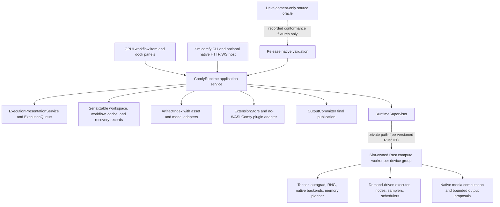

# Design: Native Rust/GPUI Comfy behavioral parity

## Architecture outcome

Production Sim owns the complete control and compute path. ComfyUI and the other source applications are development-time evidence and conformance oracles only. No production service, binary, package, setting, menu, CLI path, or dependency launches, connects to, bundles, or manages a Python ComfyUI process, and no Python/JavaScript compatibility extension executes.



The worker is part of Sim and is isolated only to contain GPU faults and large model-memory lifetimes. GPUI uses typed commands and entities, not public HTTP/WebSocket loopback. The optional compatibility host and headless CLI use the same runtime services and never forward to another server.

## Backend strategy decision by subsystem

| Subsystem | Existing/bundled Python process | External Comfy server | Reimplement in Rust | Hybrid | Deliberately defer | Decision |
| --- | --- | --- | --- | --- | --- | --- |
| Graph validation, queue, cache, recovery | Rejected in production | Rejected in production | Required | Rust worker plus GPUI control plane only | No | Native demand-driven executor |
| Tensor operations, autograd, RNG | Rejected | Rejected | Required | Sim facade over certified native Rust backends is allowed | Unsupported device rows stay explicit until certified | Native Sim-owned contract |
| Model formats and 94 families | Rejected | Rejected | Required | Native Rust plus reviewed vendor driver/codec FFI is allowed | A row may remain gated but not omitted | Native ArtifactIndex and ModelStore |
| 44 samplers, 9 schedulers, 33 latent formats | Rejected | Rejected | Required | No algorithm substitution | No | Exact Rust implementations |
| Built-in and API nodes | Rejected | Rejected | Required | Native provider plugins for external services | Unapproved cloud mutation may defer | Per-node native closure |
| Python/JavaScript extensions | Rejected | Rejected | Replacement API required | Rust source plugins plus WASM Component Model | Imperative unsupported hooks remain placeholders | Versioned Rust/WASM API |
| HTTP/WebSocket and comfy-cli automation | Rejected proxy | Rejected forwarding | Required | Optional native host/headless process | Unapproved cloud operations may defer | Native compatibility surface |
| Source runtime | Development oracle only | Development oracle only | Recorded fixture consumers are Rust | Reverse development dependency only | Hardware/account oracle runs may remain unavailable | Never production |

This selection maximizes production independence, crash containment, explicit security, and deterministic ownership, but it also makes operator/autograd breadth, 94 model-family implementations, all device backends, and extension migration first-class delivery costs. Current Sim support therefore remains `missing` or `conflicting`; a planned component is not evidence of equivalence.

## Component and ownership map

| Capability | Rust/GPUI owner | Execution/lifetime boundary | Durable state | Visible error owner |
| --- | --- | --- | --- | --- |
| Workflow editing | `ComfyWorkflowItem` GPUI entity | Foreground commands; background parse/layout | Lossless workflow document and workspace item | Workflow item and notification center |
| Graph context menus | `GraphContextActionBinding` and `GraphWorkspaceItem::dispatch_context_action`; mutations in `GraphCommandEngine` | Foreground sealed availability, input, confirmation, and dispatch; eight generated prerequisites at exact production adapters | No independent context persistence | Graph workspace item, modal layer, and shared notification owner |
| Node library/settings/assets | Dock-panel entities | Foreground filtering; background indexes | Runtime profile, settings, ArtifactIndex | Owning panel plus operation record |
| Queue/history/attempts | `ComfyRuntime` application service | Foreground reducer over monotonic native events | DB attempts, queue/history, commits | Execution/queue/history panels |
| Worker/device/model execution | `RuntimeSupervisor` plus Rust worker | Private IPC; worker task tree; device fences | Worker identity and recovery journal, never live tensors | Execution attempt and diagnostics panel |
| Tensor/model/plugin handles | Worker-owned tables | Invocation/attempt scoped; revoked on cancel/crash | Artifact/plugin identities only | Node-addressable execution error |
| HTTP/WebSocket/CLI | `comfy_api` and `sim comfy` | Background Rust server/CLI tasks | API policy, idempotency, audit metadata | Client response plus local diagnostics |
| Rust/WASM plugins | `comfy_plugin_host` | Bounded Wasmtime stores or linked Rust components | Manifest, digest, grants, mappings | Node/plugin manager and attempt |
| Updates/downloads | Journaled operation services | Owned background tasks | Operation journal, snapshot, verified artifact | Operations/update panels |
| Conformance oracle | `comfy_test_support` only | Development process isolated from production crates | Fingerprinted normalized fixtures | Test report only |

`comfy_test_support::oracle` exclusively owns source provenance, normalization, tolerance, comparison, process recording, and release-boundary validation. Source and ABI DTOs may be copied into its checked-in fixture corpus only with byte digests and environment provenance. The superseded `comfy_oracle` crate is not a workspace member, dependency, or validation target; production and release tests consume only checked-in fixtures and never compile paths into `projects/comfy`.

## Native data and execution flow

1. A lossless workflow document loads and retains every known and unknown field. Legacy plugin identifiers are projected through deterministic mappings without rewriting stored data.
2. `PromptCompiler` binds the compiled/plugin registry, validates typed ports and values, computes output reachability, and produces an immutable demand-driven DAG.
3. `ExecutionSupervisor` creates a new attempt and journal record, selects a device group and memory plan, and sends a bounded snapshot over private IPC.
4. The worker demands lazy inputs, schedules dependency-ready nodes, runs tensor/model/sampler/plugin work, and emits monotonic typed events. Cache identity includes implementation, demanded dependencies, artifacts/patches, backend/dtype, plugin digest/API, configuration, and compatibility token.
5. Previews cross IPC as bounded encoded payloads. Final effects use prepare/commit transactions; cancellation, worker loss, OOM, plugin fault, or application crash before commit cannot create a successful output/history record.
6. GPUI reducers update visible panels and graph overlays. Public HTTP/WebSocket clients receive a projection of the same state, not a second executor.

`sim comfy` is a focused adapter over these owners, not a second runtime, queue, asset index, persistence layer, capability model, or transaction service. Its `NativeExecutionPlan` sends discovery, redacted environment presence, and selected native-profile reporting through side-effect-free local projections; help is generated from the checked catalogs; and supported automation uses `NativeHeadlessService` plus `NativeRuntimeApiHost`. The CLI never exposes environment values and never applies source engine configuration. A catalog-native path whose canonical service belongs to a later executable task returns a fail-closed response naming that exact task; it may not fall through to an unowned unavailable facade, silently ignore a behavior-changing parameter, or map to an unrelated endpoint. The headless adapter therefore represents only native, migration, and task-owned deferred mappings/results; no public generic unavailable mapping or CLI operation is constructable. Source architecture conflicts and source-deferred network/account operations retain explicit migration/defer dispositions, and no disposition may launch a Python, ComfyUI, Node, or browser process. <!-- impl: crates/sim/src/comfy_cli.rs#NativeExecutionPlan -->

## Persistence, failure, and recovery

Live tensors, device streams, plugin handles, and in-flight kernels are never durable. Durable records include immutable prompts, attempts, registry/config versions, artifact and plugin identities, cache metadata, completed cache/output commits, cancellation state, worker identity, and explicitly restartable operation checkpoints. After a crash, arbitrary kernels are interrupted; verified downloads and explicitly restartable provider tasks may resume. Cancellation remains `cancelling` until non-preemptible device fences finish, while late values are discarded.

Errors are typed by validation, backend, device, memory, model format/family, sampler, node, plugin, provider, protocol, codec, permission, conflict, cancellation, timeout, and recovery phase. Every asynchronous failure reaches an owning entity and durable operation/attempt state; no fallible result is silently discarded.

## Security and compatibility boundaries

Model parsers are bounded and the PyTorch compatibility reader permits weights-only structures without executable pickle reducers. WASM plugins receive opaque invocation-scoped handles and separately granted filesystem, network, secrets, clock, randomness, model, output, UI, and route capabilities. Native vendor/codec FFI is isolated in platform adapters with packaging, signing, licensing, and unsafe review. The native API host binds loopback by default and applies authentication, authorization, TLS/CORS, request limits, safe paths, idempotency, and plugin-route grants before side effects.

Legacy resolution order is workflow-pinned mapping, explicit user mapping, signed compatibility registry, one unique installed mapping, then unresolved placeholder. Saving rewrites an identifier only after explicit acceptance and records provenance/version. Python, JavaScript, DOM, LiteGraph imperative callbacks, arbitrary web directories, raw GPU pointers, and stable Rust dylib ABI are outside the production compatibility boundary.

## Performance and platform strategy

The CPU reference backend anchors exact semantics, and CPU plus Apple Metal are the certified baseline backends. CUDA, ROCm, DirectML, XPU, NPU, and MLU adapters publish per-operation/dtype/layout/memory matrices while their unavailable hardware observations remain external release-certification gates. CoreX compiles only as a fail-closed zero-symbol optional adapter reporting canonical typed Unbound; proprietary enablement belongs to the separate future comfy-corex-enablement specification. A future WGPU backend is outside this source parity baseline and must not be called DirectML or MPS merely because it uses D3D12 or Metal. Expensive parsing, indexing, hashing, layout, codecs, model loading, and execution stay off the GPUI foreground thread. Progress and preview rendering coalesce while terminal event ordering is retained.

## Decisions

### D1: Use a native Rust production boundary

Production execution lives in Sim-owned Rust crates and Sim-owned Rust workers. ComfyUI is permitted only in development test support and is mechanically absent from release dependency graphs and runtime paths. The existing macOS, Linux, and Windows bundle owners build, place, and sign or strip the canonical `comfy-worker` binary beside the Sim executable; `comfy_runtime::WorkerLaunchConfig` is the sole packaged-worker path resolver, and desktop and CLI consumers request that checked sibling configuration without retaining filename-dependent path-resolution logic, path search, downloader, browser, external-server, Python, Node, or alternate-worker fallback. A versioned CLI report may expose the platform filename as boundary data, but it owns no location, validation, or launch policy.

### D2: Negotiate a versioned native runtime profile

A runtime profile records content roots, backend and device policy, memory policy, plugin set and grants, API-host policy, provider scope, and compatibility versions. It does not contain a ComfyUI execution endpoint.

### D3: Isolate lossless protocol and document types

Workflow, prompt, HTTP, WebSocket, CLI, plugin, and private-worker types preserve unknown fields where safe. comfy_runtime::WorkflowFormatDocument is the sole raw workflow parse, lossless-byte retention, format classification, recursive validation, and migration-provenance owner; the editable GraphDocument and template, plugin-mapping, execution, storage, and wire representations are checked projections that never repeat document validation or mutate the source implicitly. The workflow owner retains exact original bytes, exact string or numeric identifiers, unknown JSON values, and the locations of Python non-finite tokens. Typed adapters keep wire compatibility separate from runtime entities; the superseded comfy_types WorkflowDocument parser is removed.

### D4: Replace ConnectionManager with RuntimeSupervisor

RuntimeSupervisor owns worker process identities, device groups, private protocol health, and registry versions only. NativeApiServer and NativeHeadlessService own native API lifecycle; RuntimeSupervisor has no API-host or model-index readiness marker. ExecutionPresentationService plus ExecutionQueue are the pure canonical reducer for queue/history state and invariants, while ExecutionPresentationOwner is the sole serialized production mutation and persistence coordinator around that reducer. NativeExecutionController prepares an inert bounded actuator activation, the owner durably commits the resulting profile projection, and only then may the controller activate worker work; a failed prepare or persistence write leaves the live reducer and worker unchanged. The controller leases acknowledged work from the same owner and applies typed worker results through its durable canonical event allocator. Neither supervisor nor controller owns a second prompt queue. GPUI and API event bridges verify and project already-applied events instead of reducing them again. <!-- impl: crates/comfy_runtime/src/execution_presentation.rs#ExecutionPresentationOwner -->

### D5: Model mutable operations as journaled state machines

Backend, model, plugin, registry, codec, update, download, and worker lifecycle operations use prepare, progress, commit, cancel, fail, and recover states with durable operation IDs. ExecutionPresentationService produces the bounded versioned prompt/attempt recovery projection containing exact queued plans and ordering, the next-attempt cursor, completed request identities, recent command receipts, source revision, and retained retry plans. ExecutionPresentationOwner stages every production command, acknowledgement, reconciliation, status change, and actuator event under one mutation gate; it persists the full projection before swapping live state, signals cancellation, or committing a prepared actuator activation. ComfyRuntimeDb validates and atomically replaces the profile envelope and all attempt envelopes through one savepoint, rejects stale or conflicting same-revision projections, and permits only an otherwise-identical monotonic source-revision advance. GPUI, API, controller, and headless restart paths clone the same `SharedExecutionPresentationService` owner handle, and UI bootstrap plus CLI restore the full envelope through that owner rather than loading attempts alone. OutputCommitter owns prepared and committed output-transaction state and retains bounded opaque projection metadata in each durable receipt; the native controller maps that metadata into canonical output events while holding the execution mutation lease across validation, publication, asset registration, and durable projection. A committed receipt whose projection write failed is reconciled exactly once on restart. RecoveryJournal stores only immutable attempt-scoped facts derived from genuine checked OutputCommitReceipt values. Restart restores queued work once, interrupts running or cancelling attempts without implicit retry, rolls back every uncommitted transaction through OutputCommitter, and preserves terminal history without duplicating prompt or commit ownership. <!-- impl: crates/comfy_runtime/src/execution_presentation.rs#ExecutionPresentationOwner --> <!-- impl: crates/comfy_runtime/src/persistence.rs#ComfyRuntimeDb --> <!-- impl: crates/comfy_runtime/src/output_committer.rs#OutputCommitter --> <!-- impl: crates/comfy_runtime/src/recovery.rs#RecoveryJournal -->

### D6: Use a lossless workflow document with explicit adapters

WorkflowFormatDocument is the authoritative immutable source document and retains legacy and current JSON, unknown nodes and fields, widgets, links, metadata, plugin mappings, and storage provenance. GraphDocument is its editable domain projection and owns graph mutation semantics, not a second raw parser or schema validator. Import gives templates priority, then workflow, API prompt, and A1111 parameters without executing; graph-to-prompt conversion wraps array literals, removes or resolves disabled nodes, applies virtual projections, and keeps exact textual IDs. Template instantiation records provenance, requirements, missing nodes, and a new document identity. A typed execution projection never destructively rewrites on open.

### D7: Make graph mutations serializable commands

The graph workspace item applies typed commands for nodes, links, widgets, selection, groups, layout, subgraphs, clipboard, undo, and redo. Commands own focus and accessibility consequences and are separately serializable from prompts.

### D8: Make compiled and signed manifests authoritative

`comfy_nodes::NodeRegistry` is the sole owner of bounded parsing, identity/feature collision validation, and immutable projection for the registered and inactive built-in node catalogs. A signature-verified `comfy_plugin_sdk::PluginNode` is the corresponding component-node metadata authority. `comfy_model::ModelRegistry` is the sole owner for the backend-model catalog, typed source fields, and ambiguous read-side lookup candidates. `ObjectInfoRegistry` and `EarlySliceRegistry` are checked projections from `NodeRegistry`; they do not reconstruct or validate a second contract. None of these read-side registries decides executable identity, accepts mutable plugin registration, loads models, or dispatches code. `comfy_runtime::NativeNodeRegistry` is the sole executable node binding and dispatch owner; its `RuntimeNodePresentation` is an atomic checked projection of exact signed component display/category/output-port metadata beside the executable descriptor, never a second metadata source. Runtime descriptors and API object-info are focused adapters from the applicable canonical catalog or signed manifest plus its exact compiled implementation binding; they may not invent metadata or validation. Only a compiled native implementation registered there or a signature-verified plugin projection from the Task 21 sealed adapter may become executable. Built-ins remain present when a namespaced plugin declares the same node identifier, and failed multi-node verified registration is atomic. Source object-info is a conformance wire format, never a production authority.

### D9: Represent execution attempts independently

Prompt, attempt, worker, queue, history, cache, and output identities are distinct. The attempt reducer accepts only legal state transitions and strictly increasing native event sequences, rejects every event after a terminal state, and represents retry with a new attempt ID plus an explicit source-attempt reference so stale progress and late cancellation cannot mutate newer attempts. `AttemptEvent.sequence` is the sole canonical execution sequence; WebSocket delivery and reconnect sequence values are bounded wire projections and never become execution-state owners.

### D10: Serve HTTP and WebSocket compatibility natively

A profile-scoped Rust compatibility host projects native commands, state, assets, queue, history, and event-bus transitions onto every cataloged HTTP and WebSocket contract. `NativeRuntimeHttpServices` is a focused adapter for the enabled prompt, queue, history, interrupt, jobs, health, system-statistics, object-info, model, and typed asset-root families; it uses the shared execution owner and an injected sealed native-API asset-read grant rather than owning state or constructing a plugin-broker grant; every later-owned family is advertised as an explicit unavailable capability before dispatch. `NativeRuntimeApiHost` installs that adapter, publishes queue status after acknowledged mutations, projects the same `ExecutionEventBus` into execution presentation and client-scoped WebSocket delivery, and rebuilds bounded reconnect status, active execution, progress, output, and terminal history from the shared presentation state. `NativeApiServer` alone owns the bounded TCP listener and its independent connection limit, constructs an actual rustls server stream whenever TLS is required, applies tungstenite frame/message limits before complete-message allocation, rejects ambiguous HTTP framing and security headers, preserves the encoded path until `NativeHttpRouter` decodes captured parameters exactly once, decodes query components through the same canonical decoder, and coordinates shutdown without an external server. After emitting a WebSocket close frame, the transport retains the connection until the peer acknowledges the close, reaches a bounded read timeout, or performs a recognized post-close teardown; concurrent ping/data frames cannot make a clean native shutdown surface as a connection reset. `ApiSecurityGate` alone decides exact-origin CORS, bearer authentication and authorization, bounded request/concurrency/rate policy, authenticated-principal-bound plugin identity/digest/capability grants through the injected profile `PermissionPolicy`, reverse-proxy policy, remote TLS policy, and preflight admission before dispatch. `security::IdempotencyLedger` is the sole mutation-transition owner; `ArtifactIdempotencySnapshotStore` delegates containment and atomic private replacement to `ArtifactRoot`, while `NativeApiHost` coordinates dispatch and canonical `ExecutionPresentationOwner` command-receipt reconciliation. Durable idempotency and operation records use SHA-256 namespaces over profile, authenticated principal, plugin identity, canonical operation, and request content; preparation is persisted before side effects, ambiguous or interrupted records cannot be evicted, terminal responses replay, and lost responses require reconciliation. `NativeWebSocketEventBus::ClientSession` is the sole live authenticated-session owner; WebSocket sessions reject duplicate live identities, namespace requested client IDs by authenticated principal, target source-compatible execution/preview/output/error events only to the initiating client, retain interruption broadcasts, bound active sequence/session state without evicting unresolved attempts, and retain visible bridge diagnostics without stopping later event delivery. GPUI never calls this host internally and the host never proxies to ComfyUI. <!-- impl: crates/comfy_api/src/comfy_api.rs#NativeRuntimeApiHost --> <!-- impl: crates/comfy_api/src/services.rs#NativeRuntimeHttpServices --> <!-- impl: crates/comfy_api/src/transport.rs#NativeApiServer --> <!-- impl: crates/comfy_api/src/http.rs#NativeHttpRouter --> <!-- impl: crates/comfy_api/src/websocket.rs#NativeWebSocketEventBus --> <!-- impl: crates/comfy_api/src/security.rs#ApiSecurityGate -->

### D11: Make native artifact namespaces authoritative

ArtifactRoot and ArtifactIndex own path containment, checked parent creation, every-component link rejection, stable canonical-path root identity, capability-relative private reads/writes/removals/moves, enumeration, selected-root refresh, digests, availability transitions, verified handles, bounded private-state replacement, and the base restart snapshot for typed input, output, temporary, model, plugin, cache, and snapshot namespaces. Every root is revalidated when admitted to an index and before a capability parent is opened, and snapshots restore only through independently configured trusted roots; direct root/index domain deserialization cannot bypass that boundary. AssetRoots maps profile namespaces and multiple configured model roots to those canonical roots; AssetService applies the one runtime authorization decision and adds mutations, safe views, metadata, tags, and persisted enrichment over one injected profile-scoped handle without a second path validator, scanner, digest index, availability state, or physical file-operation owner. ModelStore receives that exact read-side index for each authorized parse/map/cache operation. OutputCommitter alone decides and journals prepare/final publication for the same AssetIdentity, delegates physical contained publication to ArtifactRoot, persists its journal through ArtifactRoot, registers the shared AssetService in the publication rollback hook before any reference is visible, and may enumerate only final-directory filenames to reserve the Comfy-compatible collision counter without storing an asset record, digest, or availability state. Verified final moves publish an already-opened, sealed, rehashed destination-side handle with reject-only semantics; Unix replacement fails closed and remains separate from ArtifactRoot's canonical atomic byte-write replacement. Temporary and output roots are authoritative single-writer namespaces, detected source-name replacement returns PartialMove, and the design makes no unsupported POSIX conditional-unlink or hostile same-UID cleanup claim. HTTP and plugin paths are checked DTO projections of those services. <!-- impl: crates/comfy_model/src/artifact_index.rs#ArtifactIndex --> <!-- impl: crates/comfy_runtime/src/assets.rs#AssetService --> <!-- impl: crates/comfy_runtime/src/output_committer.rs#OutputCommitter -->

AssetService additionally owns exact-name transactional writes and authorized enumeration over the injected ArtifactIndex without exposing that index. ModelStore receives index-backed model access only through authorized AssetService operations. `SubgraphBlueprintLibrary` is a focused graph-to-asset adapter: it exports and decodes the canonical graph blueprint domain type, delegates authorization, containment, replacement, rollback, indexing, reads, enumeration, and persistence to AssetService, and derives a bounded GPUI node-library projection refreshed after every publication or reload. Before calling the AssetService commit operation, the adapter rejects an individual exported blueprint larger than the graph domain's single `MAX_PUBLISHED_SUBGRAPH_BLUEPRINT_BYTES` 16 MiB representation bound, reloads and accounts from canonical `AssetRecord.byte_size` for every tagged asset including malformed, misplaced, oversized, and unreadable entries under one AssetService lock, and performs replacement-aware preflight of the projected 1,024-entry and 64 MiB aggregate catalog limits. Canonical graph export may construct an in-memory candidate over the asset limit so this exact asset-owner preflight remains executable, while public/external blueprint decoding rejects the same raw-byte bound before parsing and then passes through the bounded GraphClipboard decoder; persisted reads remain bounded by AssetService. Therefore a publication that cannot be reloaded after restart cannot become visible or mutate the canonical asset service. The adapter owns no path validator, filesystem transaction, or asset index. <!-- impl: crates/comfy_runtime/src/subgraph_blueprints.rs#SubgraphBlueprintLibrary -->

### D12: Replace Python and JavaScript extensions with Rust/WASM

Curated native plugins use a versioned Rust source trait. Third-party plugins use a dedicated WASM Component Model host with WIT as the stable binary ABI, explicit ports, capability grants, resource bounds, and deterministic legacy mappings. `comfy_plugin_host::LegacyMappingResolver` is the sole legacy plugin-identity registry and precedence owner. It accepts only signature-authorized manifest candidates, bounds lossless legacy workflow payloads, and projects exact typed port aliases plus explicit old-widget, input rename/fixed-value, and output-index translations from the signed manifest sidecar. The additive sidecar fields do not change the existing WIT 1.0 `legacy-mapping` identity record. `comfy_plugin_sdk::UiContribution` is the sole signed frontend-contribution declaration, `ComponentHost` and `ExtensionStore` retain verification and lifecycle ownership, and Sim exposes only a live read-only installed-plugin adapter to `comfy_ui`. The generated 59-row frontend disposition ledger classifies every hook as declarative Rust/WASM, legacy identifier mapping, lossless placeholder, or named defer; unknown surfaces, malformed schemas, and every member of an ambiguous duplicate-identity set retain exact bounded payloads in accessible placeholders. Neither the adapter nor GPUI projection grants capabilities, dispatches actions, owns settings, persists extension state, or executes JavaScript, DOM, LiteGraph, browser, Python, or source-runtime code. An unresolved node remains a lossless placeholder until an explicit rewrite is accepted. The resolver never imports Python or creates a plugin/provider execution path.

### D13: Keep accounts and providers behind explicit adapters

Authentication, secrets, cloud, paid APIs, tasks, costs, and entitlements remain provider-scoped and disabled without approved contracts. ProviderPolicy is the sole provider endpoint, profile, subject, and credential-scope authorization owner; a protocol actuator receives only its sealed AuthorizedProviderRequest and may perform transport-syntax conversion but cannot repeat URL-security or authorization decisions. Provider plugins cannot inherit ambient filesystem, network, model, or secret authority.

The Sim provider actuator consumes the sealed `AuthorizedProviderRequest::endpoint` directly. It may construct the HTTP request and attach an already-authorized secret, but it must not parse hosts, schemes, or ports again; `ProviderPolicy` remains the only URL-security decision owner.

### D14: Snapshot before owned updates and verify before commit

Application, backend, codec, model, compatibility-registry, and plugin updates are staged, integrity-checked, quiesced, verified, and atomically committed or rolled back from a documented snapshot boundary.

### D15: Map capabilities to idiomatic GPUI surfaces

The graph is a workspace item; durable operational views are dock panels; bounded editors and confirmations are modals or popovers; status, errors, actions, menus, key contexts, and focus ownership remain visible entities. `catalogs/native-command-dispositions.csv`, `catalogs/native-menu-dispositions.csv`, `catalogs/native-component-dispositions.csv`, `catalogs/native-execution-dispositions.csv`, and `catalogs/frontend-extension-dispositions.csv` are the sole exact placement, executable-state, typed-action, and owner ledgers for their Frontend command, menu, component, execution, and extension rows; `comfy_ui::generated_command_catalog`, `comfy_ui::generated_keybinding_catalog`, `comfy_ui::generated_menu_catalog`, `comfy_ui::generated_execution_catalog`, and `comfy_ui::generated_frontend_extension_catalog` are generated typed production projections. The generated keybinding projection and `default-comfy.json` are typed and JSON boundary adapters from the same 34 source rows and one generated key-context identity; production graph focus consumes that identity, and editable graph controls add the generated exclusion context, rather than either boundary owning parallel literals. Command-backed menus adapt explicitly to the canonical command row and must match its owner and placement; boundary labels and keymap strings map to the same typed `NativeAction`. Signed declarative plugin contributions may describe only the generated typed UI surfaces; they never create a parallel command, keybinding, menu, settings, action-dispatch, capability, or persistence owner. Graph run-mode state transitions are owned only by the focused graph action tree; workspace execution actions resolve their canonical dock target through one adapter and surface a visible unavailable notification instead of silently discarding an action. Production Sim builds its Comfy menu from that registry, while deferred rows retain a named later owner and no executable action. No runtime string heuristic, copied component-domain table, hard-coded production menu, copied Task-18 subset array, duplicate state-transition handler, or second ownership registry is permitted. The graph-shell foundation owns registration and reconciliation only; the graph-context task owns the exact graph/canvas/node/group/selection/reroute/slot/subgraph surfaces assigned by that ledger. `GraphContextActionBinding` is the sealed exact feature/source/item/surface/action identity and `GraphWorkspaceItem::dispatch_context_action` is the sole context availability, stale-invocation, input, confirmation, and dispatch transition owner; shell actions and rendered entries must delegate to it. The eight generated infrastructure identities are focused fail-closed prerequisites consumed at their real production registry, adapter, conversion, merge, dropdown, and native-render boundaries, not standalone services or deferred rows.

`GraphPropertiesPanel` is the sole durable node-property editor, and its controls plus the context property submenu share one checked typed-property adapter before dispatching `GraphCommandEngine`; a graph-local inspector or independent JSON mutation path is forbidden. Subgraph publication prompts in the workspace modal layer, exports deterministic minimal bytes from the canonical graph domain, performs background publication through `SubgraphBlueprintLibrary`, requires an exact-name overwrite confirmation, and refreshes only the derived GPUI catalog. An app-level detached completion coordinator, rather than the workspace item, owns the post-commit projection: item teardown requests cancellation through the canonical token and may discard item-local feedback, but a canonical asset commit that already won the race is still projected before completion delivery. The catalog projection is owned only by the module-private `native_asset_projection::GlobalNativeAssetServices`; `native_subgraph_catalog` is its crate-only immutable accessor, and `replace_native_subgraph_catalog` is the sole mutation adapter. That adapter validates the active profile, replaces the derived catalog, and uses `cx.defer` to advance `GlobalNativeSubgraphCatalogRevision` only after the mutation context unwinds, so GPUI observers receive a revision notification without recursive entity or global mutation.

The eight infrastructure rows are consumed prerequisites rather than standalone services: COMFY-MENU-155 `RegisterMenuGroup` gates group assembly, COMFY-MENU-156 `CommandAdapter` gates exact sealed action binding, COMFY-MENU-157 `CoreMenuLoader` gates registry loading, COMFY-MENU-159 `TranslatedRegistryItems` gates catalog-label projection, COMFY-MENU-160 `DropdownRenderer` gates construction of the shared GPUI dropdown, COMFY-MENU-164 `ContextMenuConverter` gates typed entry conversion, COMFY-MENU-165 `MergedMoreOptions` gates the combined surface projection, and COMFY-MENU-166 `NativeContextRenderer` gates the production graph renderer. Their generated identities fail closed at those call sites and own no parallel registry, validation, rendering, or state transition.

### D16: Use typed settings and versioned persistence

Runtime profiles, graph documents, attempts, cache metadata, artifact-index enrichment, plugin mappings, grants, journals, and settings use versioned schemas and explicit migrations in existing Sim persistence services. SettingsStore is the only native runtime-profile configuration persistence, precedence, selection, and observation owner; NativeRuntimeSettings is a checked projection used by Sim's production initialization adapter and owns no storage or watcher. Sim's non-persistent NativeComfyRuntimeBinding compares every behavior-bearing checked profile and plugin-security field, excluding display-only and retained unknown fields, so a same-identity settings edit replaces affected asset, worker, and component-host adapters without replacing canonical execution-presentation history. NativeRuntimeProfile::disabled_migration_replacement is the sole constructor for a safe disabled profile derived from legacy evidence; migration adapters may not construct parallel profiles or inherit roots, API exposure, plugin authority, or executable lifecycle state. Invalid settings retain the parseable selected profile as a disconnected error scope and never recover another profile. ComfyRuntimeDb stores only the canonically validated execution-state projection: one bounded per-profile execution envelope plus its attempt envelopes, replaced atomically by ExecutionPresentationOwner, and one canonical inactive legacy-migration result. It does not store runtime-profile configuration, workspace topology, or an independent queue state machine. Indexed identities are immutable and checked against their envelope. Historical profile, workspace, generic-mapping, redundant legacy-projection, and pre-canonical-validation attempt stores are append-only migration inputs moved to explicit quarantine without data loss; no production consumer may write them. Desktop topology, item identity, restoration ordering, and row transactions are owned only by workspace::SerializableItem, SerializableItemRegistry, and WorkspaceDb; GraphWorkspaceItem and ComfyWorkflowDb are focused adapters. GraphWorkspaceItem schema 3 stores bounded engine, read-only source, and save-journal bytes as compact base64 fields, migrates supported schema-1/2 numeric arrays, and restores only through an actual WorkspaceDb topology open and registry callback. A failed adapter write reaches the caller and leaves the prior WorkspaceDb item row intact. The outer item envelope owns only its aggregate byte bound; WorkflowSaveCoordinator alone records and validates content-addressed base, local, and external revisions, prepared operation identity, save-journal size, and authority transitions. External drift prevents overwrite, restart interrupts an uncommitted prepare, and compare, reload, keep, or save-copy recovery retains the local bytes. Publication prepare, upload, fail, retry, copy, and commit transitions retain the same local revision until a remote revision is confirmed. The canonical artifact snapshot, asset enrichment, and OutputCommitter journal are separately versioned, profile-bound, size/count-bounded, atomically replaced through ArtifactRoot, and rejected before use when malformed, duplicated, or path-invalid. <!-- impl: crates/comfy_runtime/src/output_committer.rs#OutputJournal -->

Public per-attempt execution save, delete, or replacement entry points are forbidden because they bypass the full-profile revision and persistence-before-swap boundary. `ExecutionPresentationOwner` exposes explicit immutable queries and durable mutation methods, never a mutable reducer guard or `Deref` escape.

### D17: Enforce layered trust boundaries

Native API exposure, archives, paths, model formats, plugin code, provider content, secrets, native FFI, codecs, and worker IPC each have explicit validation and permissions with the D41 owner making each decision once. AssetService validates profile, subject, namespace, and operation grants before delegating path resolution to ArtifactRoot; native API snapshot persistence also delegates traversal, link rejection, changed-parent detection, synchronization, and atomic replacement to ArtifactRoot; ArtifactRoot rejects traversal and every encountered symbolic link; safe views force active HTML/SVG/script/CSS content to attachment and recheck size/mtime or content digests across reads and commits. No workflow, wire DTO, artifact, API header, or plugin manifest can self-grant executable ambient authority. <!-- impl: crates/comfy_model/src/artifact_index.rs#ArtifactRoot --> <!-- impl: crates/comfy_runtime/src/permissions.rs -->

SDK signing-key, manifest, and signature-key identifiers use the exact lowercase, nonempty, nonconsecutive-separator authority grammar enforced by the runtime trust and permission owners. ABI validation preserves that grammar and does not create an independent trust namespace.

### D18: Bound tasks and make cancellation structural

Foreground GPUI work is short and fallible. Background tasks and workers are owned by stored handles or supervisors; every layer observes the same comfy_types::CancellationToken while focused adapters retain typed cancel, interrupt, timeout, and worker-loss reasons. A worker failure DTO may report failure observations, but it cannot choose a canonical cancelled transition; the controller must bind any cancellation disposition to the active attempt's token and durable termination intent. The native executor checks cancellation before resolving dependencies, before each node and mapped-list item, and after awaited node work; cancellation or failure rolls back prepared effects and exposes no partial output set. Workers and plugins emit bounded output proposals only. OutputCommitter alone decides and journals native preview and saved-image batch publication, while ArtifactRoot alone performs each capability-relative physical publication. A later-effect failure, final-journal-write failure, or cancellation reverses every earlier publication in that batch, while startup removes final and staged files through ArtifactRoot from an interrupted publication and records recovery receipts before identities may be reused. Explicit cancel, interrupt, and live worker-loss intent remain distinct and durable through recovery. <!-- impl: crates/comfy_types/src/cancellation.rs#CancellationToken --> <!-- impl: crates/comfy_runtime/src/output_committer.rs#OutputCommitter -->

### D19: Validate with deterministic source-derived fixtures

A development oracle records source-fingerprinted schemas, tensors, gradients, schedules, trajectories, media, protocols, errors, and recovery. Release tests consume normalized fixtures without source runtimes.

### D20: Generate catalogs, registries, and closure reports

The ordered `regenerate_all.py` pipeline runs every checked-in extractor and derived-artifact generator twice and fails on byte drift, collisions, or unexplained deltas. Base ComfyUI and Frontend catalogs that lack checked-in extractors are explicitly checksum-locked source snapshot inputs with target-only columns excluded from the source digest; they are never misreported as regenerable outputs, and a baseline refresh requires an explicit manifest update plus source reconciliation. Generated module discovery and repository source audits classify macOS `._*` AppleDouble entries as filesystem metadata rather than Rust or specification sources, including when the sidecar has an `.rs` or `.md` suffix; every other registered source remains subject to exact one-to-one closure, digest, UTF-8, collision, and ownership checks.

### D21: Treat failure and recovery as domain state

Validation, compile, execution, cache, effect, recovery, worker, backend, device, memory, plugin, provider, codec, persistence, permission, timeout, cancellation, crash, interruption, and conflict failures are typed states with visible recovery, not transient notification strings. Production execution presentation starts with an explicit disconnected Rust controller: runtime-backed actions reject without mutation until an owning native runtime registers its controller and event/output providers. Output restart reconciliation distinguishes prepared interruption, destination conflict, committed-missing, committed-corrupt, and recovered commit-after-rename; it removes only verified staging files and never treats a partial stage as a final asset. <!-- impl: crates/comfy_runtime/src/output_committer.rs#OutputOperationState -->

### D22: Separate logs, diagnostics, and telemetry

Operational logs and diagnostics are bounded, sanitized, inspectable, and locally retained. Telemetry is separately consented, redacted, rate-limited, and never a prerequisite for execution or recovery.

### D23: Scope profiles, windows, and resources explicitly

Runtime profiles scope devices, workers, models, queues, history, outputs, secrets, plugins, providers, API hosts, and windows. Handles carry profile and attempt identity so cross-profile leakage is rejected. Graph execution controls retain an explicit associated attempt; interrupt, retry, error navigation, progress, previews, and output projection never fall back to another workflow's latest profile attempt, and navigation changes invalidate stale nested projections.

### D24: Use explicit compatibility migrations

Legacy workflows, profiles, paths, node identifiers, extension data, Desktop state, and format versions remain lossless until an explicit migration is accepted. Legacy frontend payloads are bounded and retained byte-exact in an accessible `LegacyExtensionPlaceholder`; classification or display never rewrites them, and only an explicitly selected native replacement may do so. `comfy_runtime::legacy_connections` is the sole owner of superseded external-Comfy connection decoding, recursive secret removal, inactive-record validation, schema upgrade, safe disabled native-profile projection, and conversion presentation. It retains only a canonical display-only HTTP(S) origin and exposes no executable URL adapter. `ComfyRuntimeDb` remains the sole immutable persistence owner for the checked migration result, while `NativeRuntimeProfile` is only the settings-domain projection; model-root, API-host, plugin-mapping, and workflow conversions remain inactive until their respective ArtifactRoot/AssetService, NativeApiExposure, LegacyMappingResolver, and WorkflowFormatDocument owners receive explicit acceptance. The superseded generic `migrations` module is removed. Separately, the native workflow registry detects legacy reroutes, proxy widgets, KSampler values, renderer scale, unknown numeric workflow versions, draft storage, node definitions, and LOD settings; the reroute adapter matches the checked-in connected, branching, input-floating, and output-floating source fixtures. An accepted workflow migration applies atomically to a clone, retains the original source document, preserves unknown data or quarantines unresolved proxy data, and persists mapping provenance and version.

`comfy_runtime::legacy_installations` is the sole owner of bounded legacy Python/Git/Comfy installation evidence, recursive sanitization delegation, read-only/inactive validation, lifecycle refusal, and conversion presentation. It never probes a location, starts or manages a process, opens a connection, persists a record, validates a path, mutates an index, parses a workflow, or commits an output. Its opaque location and content strings are evidence only: model roots route to ArtifactRoot/AssetService, workflow stores to WorkflowFormatDocument, output stores to OutputCommitter/AssetService, settings to SettingsStore through the sole disabled NativeRuntimeProfile constructor, and extension references to LegacyMappingResolver. On decode, the native replacement must equal that constructor's complete canonical projection and the retained location hint must remain canonical display-only evidence; altered authority fields or executable-looking locations fail closed. Every conversion requires explicit acceptance by that owner.

LegacyMappingResolver alone owns legacy plugin identifier precedence (`workflow pin`, `explicit user choice`, `signed registry`, then `unique installed component`), ambiguity, provenance, and rewrite acceptance. The SDK `LegacyMapping` sidecar and `PluginPort` values are signature-covered declarations; its bounded translation fields overlay the default identity/index projection without removing unmentioned ports, and conflicting authorized records for one target remain ambiguous unless target, compatibility, and provenance are identical. `ComponentLegacyMapping` preserves the existing WIT 1.0 identity-only record. The `LegacyNodeReference` aggregate byte bound includes its identifier and all opaque payload fields before resolution; it is a bounded lossless input representation, and `LegacyCompatibilityProjection` is a read-only adapter. None may persist a mapping, authorize a provider, call a provider, or mutate a workflow.

### D25: Define a Sim-owned tensor facade

`Tensor` is an immutable value handle over reference-counted `Storage`; mutation requires a unique `TensorWrite` lease and copy-on-write otherwise. `TensorDescriptor` is the sole descriptor-validation owner. Its private checked `Vec<u64>` dimensions and `Vec<i64>` strides plus offset, dtype, layout, device, and `StreamId` cannot be constructed except through checked constructors; accessors expose immutable slices, and checked view construction rejects overflow and overlap that is not explicitly read-only. Rust/WIT SDK DTOs, plugin-host handles, runtime commands, and worker projections map through checked `From`/`TryFrom` adapters into this canonical descriptor and never repeat shape, stride, offset, device, stream, or byte-length validation. `TensorDescriptor::minimum_backing_byte_length` and `validate_backing_byte_length` are the only backing-span validators; SDK `TensorValue` delegates to them, while runtime `NativeTensorHandle` has private fields plus checked construction and deserialization and the store verifies only its content identity, kind, and descriptor equality. `PrimitiveOperation` and `BackendCapabilityMatrix` are the closed domain vocabulary and support owner; append-only `WorkerPrimitiveOperationV2` is only its exhaustive private-worker DTO projection, and the V1 projection remains frozen for wire compatibility. `TensorBackend` exposes allocation, copy, event/fence, scalar fill and scalar-binary, unary, binary, reduction, indexing, resize, convolution, linear-algebra, and custom-kernel operations through Sim types only. The correctness-first CPU backend uses aligned Rust buffers plus the workspace-pinned `half`, `bytemuck`, and `rayon` crates; no Candle, Burn, LibTorch, or vendor type crosses the facade. `comfy_tensor/build.rs` is the crate-local module-manifest and compiled operation-resolution registry owner: it scans `src/ops/*.rs` plus paired `src/operation_resolutions/*.rs`, rejects invalid, unpaired, or duplicate module names, and emits sorted compile-time includes without shared breadth-file edits. <!-- impl: crates/comfy_tensor/src/comfy_tensor.rs#TensorDescriptor --> <!-- impl: crates/comfy_plugin_sdk/src/comfy_plugin_sdk.rs#TensorDescriptor -->

`comfy_tensor::DType` plus `dtypes` and `promotion` are the sole numeric identity, storage-width, catalog-name, scalar-codec, float8-representation, and PyTorch-compatible promotion owners. `WorkerDType` is an append-only private-worker DTO, plugin descriptor dtype tags are stable ABI projections, and `CpuBackend` delegates scalar encoding to the canonical codec. None repeats numeric validation or creates a second domain dtype.

`comfy_tensor::generated_comfy_operator_indirection_01::cast_to_exact_native` is the sole Tensor-level dtype-transfer owner: it owns checked logical traversal, alias-versus-copy behavior, device and stream admission, cancellation boundaries, and backend publication while delegating every scalar decode and encode to `DType`. Model modules may infer a target dtype/device but must call this owner and cannot repeat conversion, storage, or security rules. `generated_comfy_operator_indirection_02::cast_to_input_exact_native` is only the source-compatible input-dtype/device projection into that owner.

### D26: Specify operations, autograd, and RNG exactly

The 600-row source-usage inventory is a discovery ledger, not an implementation signature table: 511 callable candidates, 7 imported non-tensor call dispositions, 67 namespace/value references, 15 type references, and every receiver-unverified candidate must first be resolved or explicitly reclassified. Generated `native-tensor-operation-contracts.csv`, per-row source-fingerprinted fixtures, and `operation_contracts.rs` records are an immutable discovery baseline keyed by stable operation/overload ID and record canonical target, call style, observed parameters/outputs, normative rules, call sites, fixture, reference semantic, exact later owner task, exact expected resolution module, and release-closure state. An imported non-tensor disposition retains its stable discovery ID and owner partition but is non-executable, cannot receive a compiled tensor resolution, and records the imported canonical receiver so the source feature may reuse its true native owner without a fake tensor kernel. Every namespace/value/type reference target is represented by a closed category-specific Rust enum and `TypedReferenceContract` has private construction; unknown or forged targets cannot enter the facade. Unavailable dynamic or unpinned external semantics remain honest blocked callable baselines rather than generic dispatch facades. Each exact later executable operation leaf exclusively writes a paired typed `src/operation_resolutions/*.rs` slice containing the full concrete `ResolvedOperationContract`, its declared owner, baseline overload/fixture digest, distinct concrete overload, and a safe repository-relative evidence-fixture path plus digest; a reference-only or imported-disposition leaf must not declare or compile such a slice. The evidence path must resolve under the leaf's disjoint `comfy_test_support/fixtures/tensor_operations/<module>/` directory, and its digest must differ from the unresolved discovery fixture. One crate-private validator shared by the build script and tensor table parses bounded strict parameter/output/evidence JSON, rejects placeholder semantics, validates the generator-owned owner-to-module mapping, rejects symlinks in every path component, canonicalizes the exact module root, hashes the physical fixture, and compares every identity/signature/semantic field. The build script emits Cargo rerun dependencies plus a private seal only after that validation; production catalog lookup consumes the sealed compiled record and never requires the repository fixture tree. The build-generated compiled registry accepts a transition only from its matching blocked callable baseline and rejects duplicates, unknown/non-callable/reference/external-disposition IDs, wrong owners or modules, empty or placeholder semantics, unsafe or missing evidence, reused discovery digests, or baseline/evidence mismatch; it never mutates or rewrites the discovery ledger. The effective catalog projection and `OperationContractId::cataloged` accept a callable only after exactly one build-sealed compiled resolution exists. Task 7 permits zero compiled resolutions while proving all blockers are non-dispatchable and owned; the later compute integration closure requires every one of 511 baseline blockers to have exactly one compiled resolution, every one of 7 external dispositions to remain non-dispatchable, and verifies every cited concrete evidence fixture during compilation. Executable evidence from Task 67 onward additionally carries a versioned source profile and nonempty typed, bounded observations for representative inputs, outputs, errors, aliases, derivatives, and cancellation precedence; the canonical strict parser rejects prose-only replacement, unknown fields, empty observation sets, and malformed source fingerprints while schema-compatible earlier evidence may omit the extension until reopened. `Tensor` alone owns stable logical `TensorId` values and a shared `MutationLineage`: handle clones, views, detach, data aliases, and copy-on-write storage replacement retain the required identity and lineage, while true copies and factory outputs receive new checked state; physical `StorageId` values never key autograd. `AutogradTape` alone owns logical leaf binding, saved witnesses, retained or terminal reverse traversal, cancellation, and release. `CheckpointRecord` alone owns checkpoint saved inputs, mutation witnesses, needs-grad state, validation, and release; `CheckpointExecution` alone owns ephemeral forward outputs, forward/recompute modes, autocast replay, shallow-view reconstruction, output-arity comparison, callable lifecycle, and recomputation. `GradientStore` alone publishes, replaces, exposes, and zeros caller-visible leaf gradients; operation and checkpoint adapters cannot retain a second tape, checkpoint state store, mutation counter, or gradient map. Versioned RNG profiles implement source-compatible MT19937 CPU state and Philox4x32-10 device counters; streams are addressed by workflow, attempt, node, output, phase, batch, and retry identity, and retries reuse or advance only according to the cataloged phase contract. <!-- impl: crates/comfy_tensor/src/operation_contracts.rs#ResolvedOperationContract -->

Mixed float8 promotion is rejected with a typed unsupported capability because PyTorch exposes no implicit mixed float8 promotion contract. Scalar conversion uses checked integer bounds, truncation toward zero for finite float-to-integer casts, round-to-nearest-even float8 encoding, preserved NaN/inf semantics where the format defines them, and typed non-representable errors elsewhere.

The 36-row autograd catalog closes only through a strict source-fingerprinted fixture registry keyed by every stable autograd ID and seven exact custom-function contracts. Enumeration is never executable evidence: validation runs the mapped canonical owner for every row and rejects missing, duplicate, prose-only, unreferenced, or unexecuted observations. The QuantLinear row binds `.agents/specs/comfy-parity/fixtures/quant-linear-source-oracle.json` by exact path and recorded SHA-256, structurally rejects schema, owner, case deletion, rename, or duplication mutations, and executes all 22 strict cases through the canonical comfy_model adapter in aggregate comfy_test_support coverage. Custom functions compose generated canonical tensor kernels and caller-authorized workspace; no adapter may retain private matrix, contraction, indexing, reduction, allocation, checkpoint-execution, reverse-traversal, gradient-publication, or quantization implementations. Exact source arity includes nondifferentiable and metadata slots, and every function declares and tests a higher-order policy.

### D27: Use certified native backend adapters

`cpu` is always available and implements reference semantics in Rust. CPU and Apple Metal are the certified baseline backends. Deterministic CPU conformance and fail-closed verification of any supplied CPU attestation are implementation-completion gates; creation or refresh of a signed CPU hardware attestation is an external release-certification gate and never requires private signing material for implementation completion. Other accelerator hardware observations are conditional external release-certification gates and cannot be reported as passes on an unavailable host. The CPU capability matrix advertises batch matrix multiplication for F32, F16, and BF16 only because its native kernel decodes each input through the canonical DType codec, accumulates deterministically in f32, re-encodes the selected output dtype, and rejects mixed dtypes, invalid geometry, cancellation, and capacity failure before publishing an output. Its hyperbolic-tangent primitive likewise admits F32, F16, and BF16, evaluates the decoded value with deterministic f32 semantics, re-encodes the input dtype, and preserves typed atomic failure. Cargo features isolate `cuda`, `rocm`, `metal`, `directml`, `xpu`, `npu`, `mlu`, and `corex` behind local adapter crates. `Cargo.toml [workspace.dependencies]` is the sole third-party version and workspace-feature owner; each adapter manifest is only a target-gated consumer, and the exact package/version/source/target/feature/reason projection is checked by `validate_backend_dependencies.py` against Cargo.lock and `catalogs/native-backend-dependencies.json`. `comfy_tensor::DeviceId` is the sole device identity and source-device parser owner, `comfy_types` owns typed-unavailable and binding-status boundary facts, and `comfy_tensor::TensorBackend` plus `BackendCapabilityMatrix` remain the sole semantic execution and capability/property owners; each `comfy_backend_*` crate is only the focused vendor ABI, loader, unsafe-call, and package adapter. Each adapter's versioned `AbiManifest`, symbol/layout records, and loader errors are serialization and unsafe-boundary DTOs only: they map explicitly to `NativeFfiContract` and `NativeBackendBindingStatus`, never own certificate, device, capability, or availability state, and receive one separate authoritative-ownership concern so identically named DTOs across vendor crates cannot become competing generic services. The pinned public CoreX source delegates its IXRT headers to an external SDK and supplies neither reviewed IXRT 0.8 nor IXBLAS declarations. Until lawfully supplied headers, exact signatures, layouts, and normalized digests are independently reviewed, `comfy_backend_corex` owns only a zero-symbol provenance and structural-package observation boundary: runtime loading is absent, every certificate projection is rejected, and binding remains unconditionally `Unbound`. All work requiring proprietary IXRT/IXBLAS headers, CoreX libraries, signing material, or CoreX hardware is owned by the separate future `.agents/specs/comfy-corex-enablement/` specification and is not an executable completion dependency of this pack. Existing Sim and GPUI Windows library-loading and DirectX rendering call sites retain their platform/UI ownership and are not a DirectML compute adapter; DirectML reuses the canonical workspace `windows` binding while owning only its D3D12/DXGI/COM/WinTrust ABI boundary. The concrete backend table fixes binding strategy, ABI floor, targets, libraries, discovery, packaging, licensing, signing, and unavailable behavior. One serialized vendor-dependency task owns all eight adapter dependency sections, any workspace dependency addition, a machine-readable dependency ledger, the sole post-foundation Cargo.lock update, and the aggregate `VAL-DEVICE-001` binding/capability artifact. The aggregate validator executes with every adapter feature enabled, records CPU readiness and every typed-unavailable adapter without skipped rows, and leaves ABI, implementation, and hardware closure to their declared tasks. Parallel backend-foundation leaves may then own only disjoint build logic, checked ABI declarations/symbol/layout manifests, unsafe wrappers, and package metadata; they are forbidden from changing Cargo manifests or Cargo.lock. Every concrete backend leaf must add its feature-gated production module edge through the existing `comfy_tensor/build.rs` generated-root include and a top-level Cargo integration-test harness for its nested backend test; a backend source file that is only present on disk is not implementation evidence. Concrete backend kernel leaves depend both on their ABI foundation where applicable and on the stabilized Task 44 TensorBackend, operation-selection, attention, activation, normalization, linear, convolution, device-identity, capability/property, tensor-view, execution-mode, and memory-accounting adapter owners; feature scoping permits those leaves to proceed in parallel only after that shared semantic boundary is complete. Missing targets, libraries, symbols, signatures, versions, or licenses return typed unavailable errors. A future WGPU adapter is outside this baseline and may advertise only WGPU.

`comfy_tensor::generated_accelerated_attention_kernel_01` is the sole checked attention-mechanics owner for dimensions, mask broadcasting, NHD/HND indexing, stable softmax, bottom-right causal alignment, cancellation boundaries, and analytical VJP/JVP. Its four focused external-contract wrappers expose explicit native CPU f32 fallback semantics and return typed unavailable for non-CPU devices; they own no backend selection or certification state. `comfy_model::attention` maps its public request and mask DTOs into that checked invocation and remains the sole owner of backend selection, fallback authorization and reporting, workspace/chunk policy, and model-facing errors. `comfy_tensor::generated_activation_normalization_functional_01` is likewise the sole checked operation-level owner for the ten functional activation/normalization contracts, including axes, affine broadcasting, training-stat transactions, stable reductions, exact SiLU forward ordering, alias/mutation behavior, cancellation, and analytical gradients. Existing `CpuBackend` scalar unary dispatch remains the scalar ReLU/Sigmoid primitive owner; the functional owner reuses it for ReLU and the SiLU derivative while preserving SiLU's pinned direct-division forward order. The native-diffusion tensor slice becomes a focused Tensor/CpuBackend adapter into the checked functional kernels. Sage/Flash and xFormers may use an optimized adapter only when `BackendCapabilityMatrix` certifies the exact contract; otherwise an explicit allow-fallback request uses the canonical exact native SDP kernel, while a forbid-fallback request returns typed unavailable.

`comfy_tensor::generated_comfy_operator_indirection_01` is the sole checked linear and one-to-three-dimensional convolution mechanics owner, including grouped, dilated, transposed geometry, zero/reflect/replicate/circular padding coordinates, deterministic f32 arithmetic, cancellation, and analytical VJP/JVP over one connection map. `CpuBackend::convolution` is a focused `TensorBackend` projection into that owner; it validates backend tensors, decodes F32/F16/BF16 through the canonical dtype codec, maps the public operation geometry once, leases only caller-authorized workspace, preserves the caller's `ExecutionContext`, and never owns a second loop, padding rule, workspace policy, or capability claim. `comfy_model::NativeModule`, the source-compatible Conv1d constructor, image/native-diffusion tensor paths, and certified accelerator backends are focused lifecycle or Tensor-projection adapters. `NativeModule` remains the sole parameter and mixed-precision cast-generation owner: before an image module is published it recursively prepares every parameter and floating registered buffer through the canonical cast lifecycle, preserves integral buffers, and commits the selected execution dtype/device as one checked generation. Checkpoint storage may therefore be F16 or BF16 while the admitted CPU image execution target remains F32. Each backend capability matrix is the sole authority for executable dtype/device combinations. `comfy_model::vae` owns image execution-target admission: the authorized `AssetService` delegates to it before `ModelStore` loading, direct image builders repeat that same canonical binding check, and CPU image targets remain F32-only until every operation in the image execution closure is certified for lower precision. Source causal Conv3d autopad may project the weight before delegation but owns no convolution equation, allocator, backend capability, or memory policy.

`comfy_runtime::NativeFfiRegistry` remains the sole native-library authorization and certificate issuer. Each `comfy_backend_*` crate owns only focused discovery, reviewed ABI declarations, and the explicit unsafe loader. A runtime feature adapter must open each candidate without following a final symlink, enforce one discovery root and a bounded regular-file size, copy the exact bytes into a sealed immutable platform image, parse required exports without loading or executing the candidate, obtain and retain one registry certificate per library, recheck ABI and unsafe-owner identity, and only then call the backend's unsafe loader with retained-image handles. Backend loaders reject ordinary filesystem paths; caller metadata, discovery success, compilation, or an ABI manifest cannot self-certify availability. The ROCm foundation parses the loader-consumed ELF64 `PT_LOAD` and sole `PT_DYNAMIC` segments rather than trusting section metadata, requires the dynamic symbol section to map the exact `DT_SYMTAB`/`DT_STRTAB` bytes, rejects RPATH/RUNPATH, requires each candidate's `DT_SONAME` to equal its fixed discovered filename, and initially permits only the fixed reviewed system SONAME allowlist. The real-adapter leaf admits a vendor `DT_NEEDED` edge only by resolving its exact non-symlink image inside the same approved SDK root, reading the dependency's pre-provisioned nonempty `NativeFfiContract`, recursively validating its loader-consumed identity, adding it to a complete explicit acyclic graph, and certifying and sealing every exact image. The backend loads that graph leaves-first in one isolated glibc link-map namespace, rejects cycles unless a separately proven cycle contract exists, and enumerates the complete namespace to require an exact one-to-one certified SONAME/retained-descriptor mapping for every vendor object and edge while rejecting unregistered, missing, duplicate, or ambient same-SONAME objects. Hashing, ELF tables and strings, source reads, and sealed-image writes have bounded cooperative cancellation checkpoints. The adapter uses sealed memfd images and exact `/proc/self/fd/<fd>` remaps, closing both path-replacement and in-place-write races between certification and `dlopen`. It calls the reviewed HIP initialization and driver-version APIs before device enumeration, enforces the 6.1 driver/runtime floor, and derives bounded instance device properties only from reviewed safe ABI projections. One opaque shared certified ROCm session retains the runtime, registry certificates, sealed descriptors, bounded allocations, streams, and events for their required lifetime; `comfy_tensor` consumes only safe Sim-owned handles and cannot depend on or duplicate runtime trust. Production backend selection is explicit and instance-derived from that certified session, never from feature compilation or a process-global binding flag. Completion-grade ABI evidence is distinct from an ordinary offline build: it requires the nine complete pinned ROCm 6.1.2 headers, including hip_common.h and the memcpy-kind-defining driver_types.h, exact declaration-range verification, real C layout measurements, x86_64-linux C11 static assertions, generated Rust measurements, and a durable proof artifact; without those inputs the compiled state is explicitly `Unavailable`, never self-certified. Its compiler subprocesses are build-time proof tools, classified separately from production runtime launchers and never reachable from shipped Sim execution. Signed metadata-package admission parses the reviewed policy and canonical coverage, verifies every required file's type, size, SHA-256 and sorted path, rejects symlinks, nonregular entries, extras and AMD runtime payloads both before and after native cryptographic verification, and maps only to a separately installed canonical SDK root. The separately reviewed, versioned `ffi-contracts-v1.json` is required inside that signature coverage and supplies bounded sorted exact contracts for every primary and recursive dependency; runtime discovery may consume those contracts but may never synthesize trust from the SDK it is about to load.

Wave 39 callable tables are lifetime-bound implementation details, not reusable DTOs. Private `DirectMlSymbols`, `MluSymbols`, and `NativeNpuSymbols` values are non-cloneable and non-copyable and exist only inside their non-cloneable retained-certificate composites (`CertifiedDirectMlExecutionInputs`, `MluCallSurface`, and `OwnedNpuCore`). DirectML's reviewed unsafe calls are split between its loader and execution modules but remain one crate-owned boundary recorded as `comfy_backend_directml::{loader,execution}`; no runtime, tensor, worker, package, or test adapter may copy a callable table or invoke those function pointers independently.


The NPU trust adapter preserves the reviewed ABI rather than inventing a vendor signature. `NativeFfiRegistry` admits `libascendcl.so` only as a callable nonempty-symbol contract. Because the pinned reviewed manifest contains no callable `libruntime.so` declaration, that exact sealed image is admitted only as a digest/ABI/owner dependency contract with `required_by = ascendcl`; dependency contracts cannot satisfy callable symbol lookup or callable authorization, and the runtime image is loaded before the AscendCL callable image.

ROCm package trust has one explicit adapter chain. `comfy_runtime::RocmPackageVerificationKey` alone owns the signer-bound Ed25519 decision and the `sim-comfy-rocm-package-v1` domain/framing; plugin keys cannot authorize backend packages. `comfy_backend_rocm::loader` remains the sole secure package-tree, canonical coverage, symlink/entry, immutable revalidation, separately installed SDK-root, and signed catalog-digest admission owner, but makes no cryptographic trust decision. Only after both owners succeed does the strict schema-1 `RocmFfiContractCatalogDto` map exact primary and `rocm-dependency:<soname>` rows into canonical `NativeFfiContract` values and the sole `NativeFfiRegistry`. `NativeRocmPackageSettings` is a lossless public-key/root projection through `SettingsStore`; it persists no private signing material. The schema-2 package policy and manifest use a canonical JSON Ed25519 receipt, include `ffi-contracts-v1.json` in exact coverage, and the packager only copies a separately reviewed catalog: it neither invokes an external verifier nor derives contracts from the installed SDK.

For every accelerator, `comfy_runtime/<backend>` selects only the focused ABI adapter, `comfy_tensor/<backend>` selects only semantic execution, the private `comfy_worker/<backend>` feature is the sole production layer that combines both, `comfy_test_support/<backend>` selects only tensor conformance except that its Metal feature also selects the existing runtime verifier solely for development hardware certification, and Sim's host feature selects only runtime/profile presentation. The dependency ledger and packaged release boundary require these exact forwarding boundaries and reject any production cross-layer ownership shortcut; the test-only Metal edge cannot select a production profile, issue a certificate, or make a device available.

Metal package trust uses the same authoritative boundaries through a distinct focused adapter chain. `comfy_backend_metal` owns only the reviewed Metal/MPS/MPSGraph ABI declarations, immutable Apple system-framework provenance observations, Objective-C class/selector/encoding checks, target-specific readiness and tensor-operations metallib admission, and explicit unsafe calls; GPUI's renderer and media's CVMetalTexture bridge remain UI/media owners and are never compute authorization sources. `comfy_runtime::MetalPackageVerificationKey` alone owns the signer-bound Ed25519 decision and distinct `sim-comfy-metal-package-v1` domain/framing. A strict versioned Metal FFI-contract DTO fixes the framework identities, minimum macOS/Metal versions, target, required classes/selectors and encodings, both source and metallib digests, and unsafe owners before mapping into the sole `NativeFfiRegistry`. Framework discovery, successful device creation, compilation, code-signing state, and package metadata cannot self-certify availability. `NativeMetalPackageSettings` is a lossless public-key/root projection through `SettingsStore` and persists no private signing material; one signed package coverage binds the separately reviewed catalog, both ABI declarations and reviewed bindings, both sources, and both precompiled metallibs. The package command only validates and assembles those inputs and never derives authorization from the installed SDK or live Objective-C runtime.

The Metal execution-resource prerequisite extends that focused vendor boundary without modifying the observation-only Metal foundation manifest: a separate versioned execution ABI fixes the reviewed device, queue, buffer, command-buffer, blit, library, pipeline, compute-encoder, completion, error, arithmetic-metallib, and Objective-C return-nullability contract. Its development-time SDK verifier rehashes every pinned execution header and compares every exact Objective-C runtime method encoding and reviewed nullable-return classification before packaging; it neither probes device availability nor authorizes production execution. `comfy_backend_metal::MetalRuntime` alone owns those calls and retained metallib bytes; its focused unsafe owner invokes nullable resource selectors as raw pointers, rejects nil, and only then constructs non-null metal foreign types or references. It exposes only bounded Sim-owned `MetalAllocation`, `MetalStream`, `MetalEvent`, `MetalDeviceProperties`, and `MetalExecutionError` values to `comfy_tensor`, and no `metal` crate type crosses the boundary. Device names are bounded before admission, and public diagnostic payloads are opaque bounded values. The same prerequisite makes `BackendStorage` plus `Tensor::backend_storage` the sole tensor-to-native-handle projection and makes crate-private `BackendResourceRegistry` and the single-lock `BackendEventTracker` the sole bounded stream/resource, sequence, completion-watermark, cancellation-retirement, stream-validation, and drop-outside-lock owners. The tracker retains at most its configured number of persistent stream cursors and encodes a nonzero 16-bit cursor slot plus a 48-bit per-stream counter in each fence, so exact stream provenance and indefinitely repeatable completed waits require no unbounded retired-event ledger; pending events and cursors transition under one mutex, while retired native values drop only after that mutex is released. ROCm migrates to those owners before Metal can consume them. The initial `MetalTensorBackend` matrix contains exactly twelve deterministic rows: contiguous F16 and F32 allocation-output, copy-input, copy-output, binary-Add input, and binary-Add output rows plus record-event and wait-event. No other dtype, layout, primitive, MPSGraph operation, or readiness kernel is advertised. It reuses `BackendWorkspaceAuthority`, `BackendMemoryTracker`, `CachedAllocationOwner`, `CancellationToken`, `DeviceId`, `StreamId`, `EventFence`, and `NativeDeviceProperties`; it creates no Metal-specific planner, authority, device registry, capability owner, cancellation token, GPUI device, media texture cache, or fallback policy. CPU-to-Metal copies validate canonical contiguous layout and acquire an exact canonical staging lease before cloning source bytes or creating destination resources; Metal-to-Metal copies use the same workspace owner, while offset transfers allocate the full checked backing span and zero every gap. Cancellation after native event creation waits for command completion, retires the native event outside the tracker lock, discards the late output, and returns `Cancelled`; non-cancelled OOM, command failure, and device loss remain distinct typed results, while ABI, certification, symbol, and pipeline initialization failures map to typed unavailability. For MPS compatibility reporting, host physical RAM and Metal's `recommendedMaxWorkingSetSize` remain distinct facts: the former is the canonical source-visible total-memory projection, while the latter is only the device allocation ceiling combined with the configured worker limit.

The retained immutable-file rule applies to file-backed third-party native libraries. Apple system framework executables may reside only in the signed dyld shared cache and therefore cannot be copied into a sealed descriptor without replacing the platform trust model. The Metal runtime adapter instead requests distinct `NativeFfiRegistry` system-framework certificates over fixed `/System/Library` install names, `RTLD_FIRST` handle isolation, `dladdr` symbol provenance, `class_getImageName` class provenance, exact reviewed selector encodings, and the macOS 13/Metal 3 platform floor. The registry remains the sole issuer; `comfy_backend_metal` only supplies observations and consumes the certificates. The packaged readiness and tensor-operations metallibs remain ordinary exact-byte signed-package content; the verified adapter retains both byte vectors and their registry-issued certificates for the complete lifetime of any later Metal runtime session.

Production selection has one resource owner. `WorkerLaunchConfig::for_packaged_worker_profile` maps the canonical `NativeRuntimeProfile` into the exact CPU or signed accelerator `WorkerBackendSelection`; desktop and headless adapters may not reinterpret the device or supply a fallback. The worker's focused construction adapter delegates package verification, exact contract provisioning, discovery, certification, retained native loading, OS/device probing, and any backend-specific readiness operation to `comfy_runtime` and the focused vendor runtime, then passes the resulting backend and its paired authority into `comfy_worker::WorkerBackendSession`. That session alone retains `Arc<dyn TensorBackend>` with `BackendWorkspaceAuthority`, runs workspace reservation, allocation, transfer, native kernel, event, wait, and accounting-convergence readiness before `Ready`, and publishes the full instance matrix. `RuntimeSupervisor` owns process negotiation and accepts only a requested readiness subset of that matrix; `NativeExecutionController::start` completes that negotiation before UI or headless registration can publish `Ready`. Protocol 7 carries bounded `WorkerNativeDeviceProperties` beside the capability rows; conversion in `comfy_tensor` reconstructs the device identity and delegates semantic validation to canonical `NativeDeviceProperties`, including distinct physical capacity and device allocation ceiling, so the DTO owns only wire bounds. Unsupported graph rows become typed backend unavailability before memory preflight or CPU image/diffusion executor construction; no production adapter may retry on CPU. The controller attaches the exact accepted device name and architecture, physical memory, device ceiling, configured effective memory ceiling, zero post-readiness usage, memory policy, and matrix counts to the canonical Started event; `AttemptPresentation` persists that read-only projection and GPUI renders the facts without repeating capability or allocator validation. Worker restart kills and drops the old process/session and repeats certification, backend-specific readiness, backend-neutral readiness, and negotiation before the replacement reaches `Ready`. <!-- impl: crates/comfy_worker/src/supervisor.rs#WorkerBackendSession --> <!-- impl: crates/comfy_runtime/src/runtime_supervisor.rs#WorkerLaunchConfig --> <!-- impl: crates/comfy_runtime/src/execution_presentation.rs#EffectiveNativeBackendState -->

The dependent Metal production-integration leaf extends that same selection boundary with a signed-Metal variant; it does not create another session owner. Before Ready it retains the registry-certified framework provenance and signed metallib, constructs the canonical Metal TensorBackend and paired BackendWorkspaceAuthority, and executes an actual workspace-reservation, buffer, transfer, command-buffer, readiness-kernel, event, wait, and accounting-convergence probe. Missing target, trust contract, framework, class, selector encoding, macOS/Metal floor, device, MPS support, metallib digest, or readiness function is typed unavailable before graph dispatch, and unsupported rows never retry through CPU.

Unix native-library image admission has one shared retained-image boundary. The crate-private `comfy_runtime::trust::CapturedNativeLibraryImage` alone opens a candidate with `O_NOFOLLOW`, requires one bounded nonempty regular file, retains the source descriptor, checks descriptor identity and metadata stability around a cancellable full-image SHA-256 read, and owns the immutable captured bytes. Its `seal` transition alone copies those exact bytes into a memfd, rewinds it, applies and verifies the complete immutable seal set, and produces `RetainedNativeLibraryImage`, which alone owns the descriptor lifetime and exact `/proc/self/fd/<fd>` loader path. MLU and ROCm keep only their focused discovery-root, signed-contract, ABI, ELF, dependency-graph, certificate, DTO, and typed-error adapters and must consume this owner rather than repeat capture, hashing, sealing, or loader-path behavior. Future Unix vendor certification adapters, including NPU, must reuse the same boundary. DirectML remains a justified Windows retained-module adapter because its certified `HMODULE` and Win32 image-loading semantics do not map to Unix memfd descriptors.

Huawei Ascend NPU follows the same focused boundary. `comfy_runtime::native_ffi_npu` is the focused signed-package and registry-certificate adapter: it delegates canonical receipt verification and sealed Unix image retention to `comfy_runtime::trust`, delegates certificate issuance to `NativeFfiRegistry`, retains the exact certified images and loader handles, and projects the profile's exact device ordinal into the vendor session without owning capability, readiness, or fallback policy. `comfy_backend_npu::NpuExecutionSession` alone owns the reviewed AscendCL execution calls and the opaque allocation, stream, event, context, selected device, physical-capacity, and deterministic teardown state. `RegistryCertifiedNpuImages` is a non-cloneable one-way projection that retains an external `Arc<dyn Any + Send + Sync>` certification bundle; its unsafe constructor is confined to the loader, accepts only the exact retained `libascendcl.so` and `libruntime.so` handles supplied by the runtime certification adapter, and cannot discover, verify, sign, or authorize them. The crate-private `OwnedNpuCore` is the sole raw-pointer and unsafe-call owner and the sole reviewed Send projection; no vendor pointer crosses into the safe session or tensor layer. `NpuTensorBackend` alone adapts that safe session into the canonical tensor matrix, device properties, storage, workspace, accounting, resource registry, event state, and cancellation semantics. `WorkerBackendSelection` is a path-free launch projection; `WorkerBackendSession` alone retains the selected tensor backend with its paired `BackendWorkspaceAuthority` and performs the pre-Ready transaction; and `RuntimeSupervisor` alone owns worker process negotiation, replacement, and restart recertification. The generic worker protocol DTO and GPUI presentation are checked projections of canonical domain values and own no validation, persistence, security, or availability state. Feature compilation, the fake conformance core, discovery success, or an always-Unbound adapter cannot self-certify production availability, and any failure in the exact trust-to-readiness chain returns typed NPU unavailability before graph dispatch without constructing or retrying a CPU backend.
Intel XPU uses that same single-owner chain without introducing a second session, workspace, capability, or trust service. `comfy_runtime::native_ffi_xpu` is the focused signed-package, strict-contract, discovery, retained-image, and registry-certificate projection; it delegates package and path security to the canonical trust owners and certificate issuance to `NativeFfiRegistry`. `comfy_backend_xpu::XpuExecutionSession` alone owns the reviewed Level Zero and oneDNN calls and opaque vendor resources. `XpuTensorBackend` alone maps the certified instance into canonical `DeviceId`, `NativeDeviceProperties`, `BackendCapabilityMatrix`, storage, workspace, memory-accounting, semantic stream, and event owners. `WorkerBackendSelection::Xpu` carries only the public package authority and ordinal to the private worker; `WorkerBackendSession` retains the sole `Arc<dyn TensorBackend>` and paired `BackendWorkspaceAuthority`, runs the existing real pre-Ready transaction, and publishes the instance-derived matrix through the existing protocol DTOs. Runtime supervision, controller projection, GPUI, CLI, recovery, and persistence remain consumers of those canonical values. Missing trust, target, ABI, exact image, symbol, version, device, capability row, or readiness effect returns typed XPU unavailability before dispatch; feature compilation and package structure never authorize execution, and there is no CPU retry or relabeling.


NVIDIA CUDA uses one owned execution chain. `RegistryCertifiedCudaImages` is the one-way unsafe projection of exact retained images and a certification-retention bundle supplied by the `NativeFfiRegistry` adapter. Crate-private `OwnedCudaCore` alone owns CUDA Driver, NVRTC, cuBLASLt, and cuDNN symbols; the context, stream, module, function, library contexts, allocations, unsafe calls, and deterministic teardown. `comfy_backend_cuda::CudaExecutionSession` is the sole public safe native-resource owner, serializes that core through one mutex, owns cancellation-aware allocation, transfer, F32 Add, event synchronization, typed OOM and device-loss mapping, and exports no vendor pointer. The former borrowed, thread-bound `CudaRuntime` and its public resource wrappers are removed rather than retained as a parallel service. The development-only fake core is reachable only through the backend crate's `test-support` feature and exercises the same safe session without discovering, certifying, binding, or claiming availability. `CudaTensorBackend` is a focused adapter into canonical `DeviceId`, `NativeDeviceProperties`, `BackendCapabilityMatrix`, storage, `BackendMemoryTracker`, `BackendWorkspaceAuthority`, `BackendResourceRegistry`, `BackendEventTracker`, and `comfy_types::CancellationToken`; it advertises F16 allocation/copy and F32 Add exactly matching the reviewed packaged PTX and never fabricates F16 arithmetic. `NativeFfiRegistry` remains the sole certificate issuer and `NativeBackendBindingStatus` remains the binding-state DTO. `WorkerBackendSelection::Cuda` is only the public package-authority and ordinal launch projection. The worker delegates verification and certified-session creation to `comfy_runtime`, constructs `CudaTensorBackend`, and transfers that backend with its paired authority into the one `WorkerBackendSession`, whose existing real readiness transaction is the sole pre-Ready resource probe. `RuntimeSupervisor`, the generic protocol DTO, controller projection, CLI, GPUI, persistence, and recovery consume the canonical matrix and properties without owning validation or availability. Replacement workers drop the old process and resources, then repeat the exact trust, loader, device, readiness, and negotiation chain. Missing evidence or hardware stays typed unavailable and cannot trigger CPU retry or relabeling.

`comfy_runtime::native_ffi_cuda` is the sole focused CUDA trust-to-session adapter. `CudaPackageVerificationKey` selects only the signer-bound `sim-comfy-cuda-package-v1` Ed25519 domain and delegates receipt verification to `NativePackageVerificationAuthority`; plugin keys cannot cross-authorize it. `ArtifactRoot`, `capture_native_package`, and `validate_native_package_coverage` remain the only package path, bounded-capture, stability, and coverage owners. `capture_native_library_image` and `RetainedNativeLibraryImage` remain the only exact no-follow image capture, digest, Linux sealing, Windows locked-snapshot, and retained-descriptor owners. The CUDA adapter validates a separately reviewed strict four-row Driver/NVRTC/cuBLASLt/cuDNN catalog only after package verification, maps it once into `NativeFfiContract`, uses `NativeFfiRegistry` as the sole certificate issuer, opens only retained exact images, and retains certificates, images, and loader handles through the complete `CudaExecutionSession` lifetime. Package structure, a compiled feature, installed SDK, discovered libraries, test support, or a local signature observation cannot grant availability.


### D28: Plan and account for device memory

`comfy_worker::MemoryPlanner` and `AttemptMemoryController` are the sole attempt reservation, pressure-replan, reduced-workspace-retry, fence, and terminal-OOM policy owners. `MemoryPlacementInventory` is a checked planning-metadata adapter only: it never allocates tensor or model storage. `comfy_tensor::BackendWorkspaceAuthority` is the sole non-serializable backend-bound workspace-authorization issuer for every exact certified backend; compatibility names may only alias that implementation and state. Each exact `TensorBackend` remains the sole actual allocation and capacity-accounting owner for its `DeviceId`. `comfy_model::ModelStore` remains the sole verified lazy-mmap and parsed-model cache owner, and `comfy_types::CancellationToken` remains the sole cooperative cancellation owner. `NativeRuntimeProfile::memory_policy` is the persisted user choice; Sim and `NativeExecutionControllerConfig` carry it without resolution into the path-free `NativeImageWorkerPlan`, and worker preflight alone resolves its effective mode and inserts that exact configuration into the execution cache token. Worker preflight consumes only the canonical backend memory snapshot, so rejected preflight cannot reserve storage or dispatch the graph. All reservations use checked bytes and are tagged as weights, patches, activations, workspaces, staging, previews, cache, codecs, or outputs. A plan reserves immutable weights first, mandatory workspaces second, attempt activations third, and a ten-percent or 256 MiB safety margin, whichever is larger. Topology durable baselines represent allocator-owned bytes observed before policy-local resources and count once toward capacity; losing a device revokes both its uncommitted policy resources and its observed baseline from the effective snapshot. Pressure reclaim is transactional and evicts transient previews, decoded media, unpinned cache entries, offloadable activations, then inactive model pages in LRU order; pinned/in-flight/fenced storage is never evicted. Layer/group offload may target verified mmap pages, pinned host staging, or pageable host memory. Preferred multi-device placement uses peer copy when certified and otherwise exposes pinned or pageable host staging; every transfer reports exact bytes, and host-staging routes fail before placement when their canonical host budget is insufficient. One pressure re-plan plus one reduced-workspace retry is allowed only when each attempt lowers the committed byte target; otherwise OOM becomes terminal. A preflight OOM completes the accepted attempt with an actionable non-cancelled failure while the worker remains healthy; it never becomes a process restart. Cancellation waits on named fences, discards late values, and must converge accounting to the durable baseline within the validation budget. <!-- impl: crates/comfy_worker/src/memory_modes.rs#AttemptMemoryController --> <!-- impl: crates/comfy_tensor/src/operation.rs#BackendWorkspaceAuthority --> <!-- impl: crates/comfy_model/src/model_store.rs#ModelStore -->

An `AttemptMemoryController` plan decides the sole bounded workspace byte ceiling for an attempt. The controller is non-cloneable and issues exactly one opaque, non-cloneable, non-serializable `PlannedWorkspaceAuthorization`; its private byte value can only be derived from the plan's sole Workspace reservation, and issuance freezes further pressure or reduced-workspace replanning for that attempt. `BackendWorkspaceAuthority` is the one backend-neutral implementation paired with an exact certified backend and its shared capacity tracker; CPU compatibility names are aliases, not a second issuer or state. After successful preflight, `WorkerSession::authorize_planned_workspace` consumes that token and alone asks the selected backend's paired issuer to seal precisely the planned value. The production bridge never accepts a caller-supplied byte count. A backend cannot mint an authorization, and neither an operation adapter nor a wire DTO can construct or bind one. `ExecutionContext::scratch` carries that immutable authority, not an allocation or a caller assertion. The exact `TensorBackend` consumes it through unique checked RAII leases, charges its existing capacity tracker exactly once alongside Tensor storage, rejects unbound/foreign/over-authorization or concurrent over-capacity before output mutation or native call, and releases the charge on success, cancellation, fault, allocation failure, device loss, or drop. Tensor-operation adapters calculate checked byte requirements and request those leases; they may not allocate potentially large untracked scratch vectors, construct a zero ceiling for nonzero workspace, or own retry state. The controller's one lowering reduced-workspace transition remains the only retry owner.

Attention's `workspace_limit_bytes` is an already-authorized per-call ceiling consumed by bounded checked score-row/chunk arithmetic through that same backend lease. It is not a reservation, allocator, capacity counter, retry policy, cache, or second MemoryPlanner. Quantized model storage likewise remains a focused immutable model-weight representation and never owns backend allocation or ModelStore caching.

Linear algebra parts 01 and 02 and neural-network-functional part 01 expose one caller-`ExecutionContext` entry point for every executable operation. `CpuBackend::workspace_vec` and `CpuWorkspaceVec` remain the only owners of their temporary matrix, pivot, gradient, tangent, embedding-renormalization, frequency, and staging allocations. SVD reuses the part-one symmetric eigensolver and shares in-place Gram, transpose, matrix-product, and orthonormal-basis mechanics between its leased forward and derivative paths; norm, cross, rearrangement, attention, sigmoid, and index-select adapters call their existing canonical context owners. Returned tensors and returned value vectors remain owned results, not scratch. `Tensor::linear_element_bytes` is the sole allocation-free logical-linear traversal adapter over checked `TensorDescriptor` shape, strides, offset, dtype, and storage bounds; math adapters use it for fresh and arbitrary strided reads instead of rebuilding data-sized index staging or repeating layout validation. Cancellation-only and synthesized zero-scratch compatibility signatures do not exist in the release surface. <!-- impl: crates/comfy_tensor/src/comfy_tensor.rs#Tensor::linear_element_bytes --> <!-- impl: crates/comfy_tensor/src/ops/linear_algebra_02.rs#svd_with_context_exact_native --> <!-- impl: crates/comfy_tensor/src/ops/neural_network_functional_01.rs#embedding_with_context_exact_native -->

Native image and diffusion execution use the same authority without a model- or media-local memory subsystem. `comfy_worker::AttemptMemoryController` remains the sole planner/retry owner, and `WorkerSession` uses the selected backend's paired `BackendWorkspaceAuthority` exactly once after preflight. `NodeContext` carries that sealed authorization into `comfy_runtime::native_execution_controller`, whose bridge creates the one canonical `ExecutionContext`; tensor kernels, `NativeModule`, vision/model adapters, the SD15 slice, native sampler, and PNG encoding receive that context and request exact backend leases for temporary host staging. Vision batch and instance normalization delegate their equations to the canonical `comfy_tensor` functional owner; the vision adapter only copies the canonical returned values into its explicitly leased model-staging buffer. Tensor/model/RNG handles and encoded or decoded media returned across the boundary remain owned domain results, while `OutputCommitter` alone publishes output bytes. No production adapter may mint workspace authority, synthesize `ScratchReservation::none`, repeat cancellation state, or select behavior from the authorized byte count. <!-- impl: crates/comfy_runtime/src/native_execution_controller.rs#native_image_tensor_context --> <!-- impl: crates/comfy_model/src/vision_models.rs#batch_normalize --> <!-- impl: crates/comfy_media/src/png.rs#encode_png_frame_with_policy_and_context -->

### D29: Isolate compute in a private Rust worker

The supervisor spawns a separately packaged `comfy-worker` Rust binary with inherited stdin/stdout and stderr-only sanitized logs. IPC protocol version 7 is a little-endian u32 length prefix plus `postcard` payload; its decoder pre-reads and rejects the leading protocol version before deserializing a changed payload, with a 16 MiB frame cap and a 4 MiB cap on every encoded application event so previews cannot bypass their bound. `Hello`, `HelloAck`, `Ready`, `Execute`, `Cancel`, opaque `Event`, typed `Lifecycle`, bounded `OutputProposal`, `Heartbeat`, `Shutdown`, `Fatal`, registry-deployment acknowledgement, and bounded typed registry-deployment rejection messages carry profile, worker, request, attempt, sequence, registry, and canonical capability identities. `comfy_types::WorkerLifecycleEvent` is the sole lifecycle-acknowledgement wire owner; the worker maps session transitions into it, RuntimeSupervisor binds each acknowledgement to the originating request kind, and application controllers decode only `Event` payloads in their own versioned schema. Malformed application bytes can never be accepted as lifecycle state. Both sides reject identity drift, stale scopes, gaps, duplicate sequences, raw host paths, typed roots, and transitive serialized path-bearing plans. A candidate plugin registry is signature- and authorization-verified and every component is compiled before the worker atomically swaps both source and compiled registry state or acknowledges it. Verification and compilation failures return a bounded typed rejection, discard only the candidate, preserve the prior committed generation, and leave the process able to execute that generation; no acknowledgement or fatal exit can precede verification. Execute carries only bounded host-read input bytes keyed by logical asset identity; output proposals carry bounded opaque content plus checked native-image metadata. JSON-valued UI results cross postcard only through a bounded native-image wire DTO containing encoded JSON bytes; checked adapters map it to and from canonical `ExecutionReport::ui_outputs`, and the DTO owns no execution state or validation policy. `ComponentLimits` remains the sole memory, table, instance, fuel, epoch, value, port, and capability-limit owner: the prepared worker invocation serializes that canonical value, the worker validates it before use, and its compiled-registry cache is keyed by exact limit equality so private-worker and in-process execution cannot diverge through a worker-local default. Failed worker execution retains the typed failure class and carries only a non-empty, control-filtered, 4,096-character maximum trap diagnostic; the host maps it back to the canonical plugin error without inventing or discarding the cause. The worker may produce bytes, hashes, metadata, and logical output identities but never stages, renames, or commits a host file. RuntimeSupervisor owns typed process/protocol health, bounded sanitized stderr retention, and stored reader/log/monitor tasks; it delegates prompt state to ExecutionPresentationService and final publication to OutputCommitter. Heartbeats run every two seconds; three misses mark the worker lost; graceful shutdown gets five seconds before process-tree termination. A compatible lost or degraded worker is eligible for at most one automatic replacement after a 250 ms backoff, after which recovery is explicitly terminal rather than a restart loop. Platform process ownership uses Sim's process abstraction and Windows Job Objects/process groups plus worker stdin-EOF convergence so parent death cannot leave an executing orphan.

### D30: Build one safe ArtifactIndex with focused asset and model adapters

ArtifactRoot and ArtifactIndex are the sole owners of canonical contained roots, relative-path and every-component symlink validation, exact-file approved imports, capability-relative private reads/writes/removals/moves, enumeration, SHA-256/size/mtime identity, deterministic added/modified/missing/restored transitions, retained missing records, verified handles, and bounded restart snapshots bound to independently configured trusted roots. Contained publication copies from a stable verified source handle into an owner-created destination temp, verifies expected digest, size, and identity immediately around the atomic publication primitive, and fails closed for root, ancestor, parent, source-name, source-inode, destination-name, and temporary-name replacement without deleting an unrelated replacement. AssetRoots maps profile-scoped namespaces to canonical ArtifactRoots; AssetService wraps the shared ArtifactIndex with authorization, mutation, view, content-type, metadata, and tag behavior and persists only enrichment plus the canonical index snapshot. ModelStore is a parser, mapping, and cache adapter that receives the canonical read-side ArtifactIndex for each operation; it owns no index clone, second root, scanner, path validator, digest or availability state, mutable refresh, persistence snapshot, or physical file-operation owner. Parsing, lazy reads, and read-only private mappings consume ArtifactIndex-verified handles so path replacement cannot combine metadata, digests, or tensor bytes from different files; loaded-model handles remain store-scoped and are rejected after their source identity changes. ModelStore exposes immutable file slices and keeps resident-byte accounting, cache entries, and operation history bounded. Native parsers enforce configurable defaults of 16 MiB manifest/config size, depth 64, one million tensors, 64 GiB per tensor, checked aggregate bytes, 64 KiB names, and no archive links or duplicate canonical paths. Safetensors validates exact contiguous ranges; GGUF v2/v3 uses exact current GGML block layouts and excludes alignment padding; JSON, the safe extra-model-paths YAML subset, SentencePiece wire data, and tiktoken ranks are bounded. The weights-only PyTorch reader accepts raw restricted pickle and stored ZIP/ZIP64 archives, primitive scalars/collections, persistent storage references, ordered dictionaries, exact tensor and parameter wrappers, and cataloged quantized rebuilds. GLOBAL/STACK_GLOBAL/REDUCE/BUILD targets use an explicit allowlist; code-loading, import, extension, executable object-construction, unknown opcode/target, nesting, and memo-clone amplification are rejected before unbounded allocation. Parser limits, the exact allowlist, and the derived eight-times-manifest decoded-allocation ceiling are versioned fixtures; unsupported compression and unavailable mappings return typed errors. ModelStore alone issues opaque store-scoped VerifiedSentencePieceVocabulary and VerifiedEmbeddingArchivePayload values after reopening the exact ArtifactIndex-verified file; formats owns the one restricted stored-ZIP fallback parser and canonical storage-dtype normalization, while tokenizer adapters can only project those values and cannot accept caller rows, raw archives, fabricated handles, or mixed-store payloads.

### D31: Describe every model family and patch graph

`CatalogModelDescriptor` losslessly preserves every model-ledger row, source status, and all candidates for ambiguous source identifiers without claiming execution. `comfy_model::model_family` is the sole stable family identity, source-ordered registration, checked parsed-fact admission and storage-dtype normalization, UNet-prefix and consecutive-block selection, key-derived prefixed-native, standalone-native, and Diffusers layout admission, layout-to-state-plan selection including bounded probe-derived owned plans, native/diffusers configuration normalization, explicit registered-only or base-fallback policy, configuration/profile selection, typed tokenizer/CLIP-target selection boundary, scored resolution and ambiguity rejection, descriptor, transactional multi-component state-dictionary mapping, checked build, shape-reduced forward-program, checkpoint, dtype/device, and family-memory owner. `ModelParsedFacts` and its tensor/format fact members are bounded DTOs at that boundary; they do not parse, cache, index, persist, or load tensor payloads. Tokenizer and CLIP candidates contain checked qualified native target identifiers plus bounded typed data-only configuration facts; raw Python expressions, calls, unpacking, or executable source text are rejected at the production boundary. Its checked transformation plans recursively revalidate every deserialized selector bound, predicate, source key, and dimension expression before admission, reject current-selected-tensor dimensions in operations without a selected-tensor evaluation context, and provide bounded key predicates and rewrites, move/drop/repeatable-copy/route, typed original-or-staged references, per-selected-tensor checked dimension expressions, selector-driven branching with per-output post-transforms, split, narrow, concat/assembly, transpose, permute, reshape, expand, conditional canonical tensor operations, constant/arange generation, checked add/multiply/exact-divide dimension expressions, explicit unmatched-key disposition, exact required-component schema coverage plus a schema for every plan-targeted optional component, optional-component absent/present semantics, declared component and required-key closure, cancellation, and atomic commit. Architecture rows select only immutable checked signatures, static plan data, or compiled row-owned function pointers that receive the already bounded ModelProbe and return an owned plan. The canonical registry invokes and revalidates every probe-derived plan against the selected family's declared components before any transaction; selectors cannot read files, parse artifacts, own family matching, publish state, or repeat tensor mechanics. `ModelStore::family_probe` is the sole focused adapter from an existing store-scoped `LoadedModel`: it projects immutable cached tensor and format metadata into `ModelParsedFacts`, delegates admission and every selector to `model_family`, and performs no artifact read, reparse, second cache, family match, normalization, state transformation, build, execution, or publication. Its typed probe errors are adapter DTOs rather than a competing validation domain. The development-only AST generator records an exact source-fingerprinted 94-row projection in source ordinal order without importing or executing ComfyUI. `PatchGraph` is the sole ordered typed patch-payload validation, base binding, target slicing and padding, copy-on-write application, rollback, and cache-digest owner for DenseDiff, Set, LoRA, LoHa, LoKr, OFT, GLoRA, BOFT, DORA, nested, and model-as-LoRA semantics. `comfy_model::patches` alone owns checked key loading and parsing plus model/CLIP merge and quantized-operation mapping into canonical owners; `comfy_model::quantization` alone owns quantized codecs, storage, content identity, and caller-context materialization. `comfy_model::conditioning` alone owns immutable conditioning values, masks, regions, preparation, concatenation compatibility, window inputs, and conditioning identities. `comfy_model::clip` alone owns bounded weighted token batches, CLIP execution plans, native tokenizer/text-encoder execution, encodings, and their cache identities while importing model-family target selection and ModelStore artifacts. `comfy_model::vae` alone owns VAE descriptors, execution/tile plans, encode/decode execution, and cache identities while importing canonical latent transforms. `comfy_model::controlnet` alone owns immutable control/adapter chains, hint preparation, strengths, result slots, merge order, and identities. A focused `comfy_sampler::guidance` adapter alone composes canonical conditioning with SamplingProfile and sampler transactions for CFG and hook order; it cannot own conditioning validation, sigma/time equations, sampler state, tensor math, workspace, trace, callback publication, or cancellation. The generated source-fingerprinted conditioning-contract catalog is the exact closure ledger for these domains; backend-model rows are not accepted as a substitute inventory. `comfy_model::latent_format` remains the sole latent identity, geometry, transform, empty-construction, preview, cancellation, and typed-error owner. Focused multi-row architecture adapters may own only shared immutable source-derived configuration normalization; `comfy_model::cogvideox_family` is the one CogVideoX layout, shape/configuration, patch-default, and 1.0/1.5 latent-profile adapter, while the I2V, Inpaint, and T2V rows retain only channel-specific identity, detection, plans, and programs. Generated `src/families/*.rs` and `src/latent_formats/*.rs` modules contain immutable definitions and focused selectors only. `comfy_model/build.rs` emits the one sorted compile-time registry/test manifest; a distinct post-row closure rejects an empty, partial, duplicated, skipped, or provenance-incomplete 94-family result, so foundation validation cannot pass vacuously.

`comfy_model::cosmos_family` is the sole shared Cosmos native-layout, GeneralDIT/Predict2 marker-separation, packed-channel, geometry/patch-default, architecture/model-size profile, and Predict2 positional/memory configuration adapter. Cosmos family rows retain only immutable identity, source ordinal, discriminator, image/video mode, architecture, component-prefix state plan, and forward program, and delegate typed configuration validation to that adapter.

`comfy_model::flux_chroma_family` is the sole shared owner of the pinned Flux/Flux2/Chroma/ChromaRadiance detector branch's layout/prefix admission, key-norm variants, shape extraction, block counting, marker precedence, and common configuration facts. Flux, Flux2, FluxInpaint, FluxSchnell, Chroma, and ChromaRadiance rows retain immutable identity and source-specific transforms, plans, profiles, and programs while delegating shared detector/configuration validation and reusing the canonical Flux/Flux2 latent owners.

`comfy_model::model_family` is the sole production owner of model-layout admission and state-plan selection. It derives a checked `PrefixedNative`, `StandaloneNative`, or `Diffusers` layout from bounded parsed tensor keys and immutable row-supplied signatures; caller metadata may neither select nor override a layout. Ambiguous, partial, and unsupported layouts fail typed before a state transaction begins. `ModelStore::family_probe` remains a projection-only adapter from cached parsed facts, while family adapters provide immutable signatures and consume the canonical layout result without parsing, caching, validating paths, transforming tensors, or committing state.

Family identity may use an exact bounded value from parser-owned checkpoint format metadata only where the pinned source explicitly declares tensor-state compatibility with another family and therefore provides no key/shape discriminator. The current cases are WAN21 CausalAR and WAN21 FlowRVS: the base-WAN tensor signature must match first, then parsed checkpoint metadata must contain respectively the exact boolean `transformer.causal_ar=true` or the exact bounded `transformer.model_type="flow_rvs"` selector. Missing, false or different, malformed, caller-injected, or unrelated metadata fails closed. These values distinguish compatible families but cannot select or override model layout, state plan, tensor dimensions, dtype/device support, or any executable behavior outside the immutable row; any additional weight-compatible exception requires a normative specification update. Arbitrary caller metadata and convenience fields remain non-authoritative.

Shared architecture adapters are focused immutable extensions of that owner. `comfy_model::sdxl_family` owns the SDXL/Refiner/KOALA/SSD/Segmind configuration and common CLIP/state facts while importing the canonical SDXL latent. `comfy_model::kandinsky5_family` owns Kandinsky5 base/image discrimination and common model facts while importing canonical Flux and HunyuanVideo latents. `comfy_model::ltx_family` owns LTXV/LTXAV discrimination and dynamic memory projection while importing canonical LTX latents. `comfy_model::sd2_family` owns SD2/Lotus/Unclip discrimination and common standard-UNet/CLIP/state facts while importing the canonical SD15 latent. The Flux adapter additionally owns source-supported Flux Diffusers conversion and LongCat-versus-Flux precedence. Row modules retain only source ordinal, identity, specialization, source-specific conditioning, and named checkpoints.

The COMFY-MODEL-0140 `WAN21_FlowRVS` row is the sole batch-shared owner of `Wan21ExtendedConfiguration`, bounded base-WAN tensor-shape extraction, transformer-configuration reconciliation, consecutive block depth, and the checked WAN memory factor for COMFY-MODEL-0140 through COMFY-MODEL-0143. `WAN21_FunControl2V`, `WAN21_HuMo`, and `WAN21_I2V` import that immutable projection and retain only their source-specific discriminator, identity, state plan, conditioning, and forward checkpoints. This row-local sharing does not own parsing, cache, model-layout or state-plan selection, tensor mechanics, memory authorization, device policy, or cancellation state.

`comfy_model::model_family` also owns one bounded post-parse weight-statistic profile hook: its typed request and observation domain owns name/count/device/dtype admission, finite-result validation, statistic dispatch, and checked threshold comparison. `ModelStore::observe_weight_statistics_with_context` is only a focused adapter from an existing store-scoped loaded handle and ArtifactIndex-verified tensor range through caller-authorized CpuBackend upload; it stages all observations before publication. `comfy_tensor::torch_std_with_context_exact_native` remains the sole reduction equation, traversal, workspace, allocation, and cancellation implementation. No family adapter may substitute caller metadata, reparse an artifact, cache payloads, allocate untracked workspace, or repeat device/cancellation policy. This is the only production path for source conditions such as SD2.0's measured output-block population standard deviation.

The remaining audited shared owners follow the same boundary: `lumina_zimage_family` owns Lumina2/ZImage/pixel-space precedence and common facts; `omnigen2_boogu_family` owns Omnigen2/Boogu common facts and executable source memory factors; `pixeldit_pid_family` owns PixelDiT/PiD precedence and checked adaLN mapping; `pixart_family` owns Alpha/Sigma discrimination and the pinned Diffusers QKV mapping; and `qwen_image_family` owns reusable Qwen conditioning and block-prefix facts. RT_DETR_v4 remains row-local and delegates coordinate conversion to the canonical tensor kernel. None of these adapters owns parsing/cache, tensor mechanics, RNG, device capability, patch commit, attempt memory, persistence, or cancellation state.

`comfy_model::quantization` is the sole INT8 tensorwise, TensorCore FP8 E4M3/E5M2 tensorwise, MXFP8 group-32, NVFP4 group-16, input-scale, padding, storage, and checked mixed-per-layer metadata v1 quantize/dequantize owner. `QuantLinearScale` represents default, explicit, and source-compatible recalculated scale policy, and `QuantLinearLayout::from_source_name` maps the legacy `TensorCoreFP8Layout` identifier to E4M3. `comfy_model::quantized_autograd` is only the six-input QuantLinear saved-state and VJP adapter: it delegates quantization to that owner and tensor conversion, linear algebra, mutation witnesses, cancellation, and release to canonical comfy_tensor owners. Mixed metadata is rejected before decode above one MiB and after decode above 4,096 layers, in addition to its per-layer name, algorithm, and dtype checks. `comfy_tensor::generated_accelerated_attention_kernel_01` is the sole attention dimension, mask-broadcast, indexing, exact native math, and gradient owner; `comfy_model::attention` is its focused model adapter and sole backend-selection, workspace, explicit-fallback, and model-error policy owner. `comfy_tensor::generated_activation_normalization_functional_01` owns operation-level activation/normalization validation, reductions, training-stat commits, mutation/alias semantics, and gradients; native-diffusion and scalar backend paths delegate without copying that policy. These owners consume canonical DType and CancellationToken behavior and leave parsing/cache to ModelStore, tensor allocation/capabilities to TensorBackend, attempt memory policy to MemoryPlanner, persistence to existing owners, and publication to OutputCommitter.

`comfy_model::NativeModule` and `NativeOperationSet` are the sole model-operator lifecycle owners for unloaded construction, exact parameter-shape admission, atomic dense or quantized load, transactional prefetch visibility, monotonic cast generations, one-shot leases, and mixed-precision module selection. Quantized values remain owned by `comfy_model::quantization`; model files and caching remain owned by `ModelStore`; cast and kernel mechanics remain in `comfy_tensor`. The source VBAR path maps to transactional native prefetch and does not introduce a transport, allocator, cache, memory manager, or second model store.

Depth-dependent state conversion remains inside the same owner. A compiled row may supply an immutable `ModelFamilyStatePlanProbeSelector` function pointer that receives only the already bounded and validated `ModelProbe` and returns an owned `ModelStateTransformPlan`. `ModelFamilyRegistry::resolve` invokes it after family and source-contract admission, recursively revalidates every returned selector, rewrite, dimension, target, and component against the chosen definition, and binds the result into `ResolvedModelFamily` before any transaction. The selector cannot read or parse an artifact, consult caller layout metadata, allocate tensor storage, execute a transform, commit mapped state, or bypass `ModelStateTransaction`. PixArt's consecutive-depth Diffusers QKV assembly is the initial consumer; native and Diffusers layouts use the same resolved-plan boundary.


`comfy_model::clip_text_encoders::TextEncoderArchitectureRegistry` is the sole versioned routing and contract-ownership table for the 398 generated text-encoder architecture rows: `checked` validates the immutable versioned contract table, `owner_for` binds every pinned source path and symbol to exactly one checked native owner (T5, decoder, multimodal, or composite), and `identity_sha256` derives one registry identity from the version, owner facts, source segments, and composite contracts. It owns no backend, module, RNG, cache, store, transaction, or forward implementation; the four focused text-encoder modules and `comfy_model::clip` retain their equation, graph, and execution ownership.


The patch-domain ownership split below supersedes the earlier broad shorthand that assigned merge and quantized-replacement semantics to `PatchGraph`. `comfy_model::PatchGraph` owns only immutable ordered payload validation, base binding, checked slicing and padding, copy-on-write application and rollback, and digest identity. `comfy_model::weight_adapter` owns the source-facing adapter registry plus trainable and bypass runtime plans, while delegating saved tensors, mutation witnesses, reverse traversal, and gradient publication to the canonical `comfy_tensor` autograd owners. Trainable construction stages the caller's `RngTransaction`, consumes only the caller-authorized workspace, and commits the staged RNG state only after every parameter is validated and uploaded. Its public boundary remains `&dyn TensorBackend`; the canonical backend capability projection identifies the exact CPU reference backend for the currently implemented composite autograd rule, and every other backend is rejected typed before tape or output mutation rather than copied to CPU. `comfy_model::patches` owns only checked key discovery, load diagnostics, model/CLIP merge mapping, and quantized-operation mapping into those canonical owners. `comfy_model::quantization` alone owns quantized codecs, storage, canonical content identity, and caller-`ExecutionContext` materialization; weight adapters retain the quantized value until execution and invoke that owner rather than decoding storage themselves. The selected `TensorBackend` and caller-authorized workspace remain the only device execution and allocation owners. No patch adapter may eagerly decode quantized storage, authorize scratch, select a CPU fallback, or retain a second commit transaction.

The generated backend-conditioning ledger is the exact source-digest manifest for `PatchGraph`: its Task 358 subset contains only the five shared base equations, the three top-level patch-dispatch equations, and each BOFT, GLoRA, LoHa, LoKr, LoRA, and OFT `calculate_weight` method. Every manifest row binds its full-source and selected-symbol SHA-256 values to the `comfy_model::patch_graph` owner, Task 358, and the PatchGraph validation surface. Adapter classes plus trainable/bypass behavior remain with `comfy_model::weight_adapter`; load, parse, merge-map, and quantized-operation-map rows remain with `comfy_model::patches`. Generation rejects missing, extra, duplicate, or retargeted PatchGraph rows.

Patch execution has an explicit checked compute-boundary policy derived by the focused `comfy_worker::EffectiveMemoryMode` adapter: normal patching uses the canonical `lora_compute_dtype` decision, while LowVram deferred patching uses the current execution weight dtype as the pinned `intermediate_dtype`. `PatchGraph` consumes that typed decision and applies it consistently to base staging, every nested/family payload, DORA normalization, and the single final output cast; repeated operations on one target retain the selected intermediate dtype throughout their ordered sequence and cast to storage dtype exactly once after the final target operation. Multi-operation nonlinear BF16 fixtures must distinguish that behavior from per-operation storage casts. The graph's structural identity may remain independent of residency policy, but every applied-model cache identity binds the resolved compute-boundary decision and intermediate/storage dtypes so byte-distinct Normal and LowVram results cannot collide. `PatchGraph` does not infer residency mode, silently force F32, or let tests fabricate a LowVram path by manually changing the input dtype outside the production adapter. `EffectiveMemoryMode` exposes only the dependency-free residency projection that selects configured-dtype versus current-weight-dtype behavior; `comfy_model::PatchComputeBoundary` remains the sole checked dtype decision owner. `comfy_test_support`, which already depends on both crates, maps that production projection explicitly into the checked model boundary and drives the real PatchGraph, so `comfy_worker` has no model dependency and no later manifest writer, reverse dependency, second memory-mode type, or duplicate dtype validator is introduced. A `test-support`-only `MappedModelWeights::from_test_parts` validates the digest and delegates to the private canonical constructor so cross-crate conformance can exercise the integrated adapter; it is not a production parser, constructor bypass, or cache owner. `comfy-parity-conditioning-guidance-adapter` remains disjoint because its sampling-guidance writes stay in `comfy_sampler`.

The complete checked float compute matrix is executable: the configured Normal boundary accepts and applies only the source-valid F16 and F32 `lora_compute_dtype` results, while the current-weight LowVram/NoVram boundary accepts and applies F16, BF16, or F32 storage dtypes. Other dtypes fail typed before publication. Worker integration proves configured F16 and F32 plus current-weight BF16 over the same ordered nonlinear graph, retains the selected intermediate dtype across repeated target operations, casts once to BF16 storage, and produces deterministic bytes and applied cache identities.

### D32: Use a demand-driven native DAG executor

`NativeNode` exposes a static descriptor plus a cancellable `execute(NodeContext, InputSet) -> NodeFuture<OutputSet>`; inputs and outputs are keyed by explicit port IDs. `PromptCompiler` validates exact string identifiers, ports, widgets, links, values, hidden inputs, lazy dependencies, list/cardinality rules, blockers, cycles, and output reachability before producing an immutable plan that preserves unknown prompt and node fields. Hidden prompt and extra-PNG-info inputs are injected from the immutable API prompt and submission metadata rather than trusting user widgets. The compiler records a static non-lazy demand closure, while execution resolves lazy inputs only when the node requests them. Nodes declare `Pure`, `ReadsArtifact`, `WritesArtifact`, `Provider`, or `ExclusiveDevice` effect class; the scheduler maps lists deterministically with repeat-last broadcast semantics, expands compiled subgraphs into bounded namespaced child scopes, and owns structural cancellation per execution. Cache keys use canonical CBOR-equivalent field ordering over implementation/version, demanded input hashes, artifact/patch digests, backend/dtype, plugin digest/API, RNG phase, configuration, registry generation, and compatibility token. API routes submit canonical commands to this executor and never publish effects themselves. Effects prepare first and OutputCommitter alone commits one durable atomic publication batch only after successful execution; failure, cancellation, journal-write failure, or restart rolls back every prepared or partially published effect and exposes no partial output set. <!-- impl: crates/comfy_runtime/src/prompt_compiler.rs#PromptCompiler --> <!-- impl: crates/comfy_runtime/src/executor.rs#ExecutionEngine --> <!-- impl: crates/comfy_runtime/src/output_committer.rs#OutputCommitter -->


Runtime persistence has no restartable in-flight autograd checkpoint type. `comfy_tensor::CheckpointRecord` and `CheckpointExecution` are deliberately non-serializable, process-local recomputation state and cannot enter `ComfyRuntimeDb`, `RecoveryJournal`, cache metadata, execution presentation, worker protocol, or output receipts. A worker loss interrupts the current tensor/autograd computation; a later attempt starts through the canonical prompt compiler, execution engine, cache, and attempt lifecycle rather than resuming an autograd tape or checkpoint callable. `RecoveryJournal` retains only immutable facts derived from checked `OutputCommitReceipt` values and cannot prepare, commit, or replay a kernel. The currently restartable operations are the separately typed, explicitly persisted runtime operations described by their owning services; there is no generic operation-checkpoint persistence service.

### D33: Implement exact samplers, schedulers, and RNG phases

Each sampler and scheduler identifier owns a separate or explicitly shared algorithm-family Rust module with no alias substitution. A source alias that changes only a checked family option remains a focused adapter over that family owner; CPU and accelerator aliases never cross stochastic-generation placement boundaries. `comfy_sampler::sampling_profile` owns checked projections of both Comfy's generic `get_ancestral_step` sigma-down/up coefficients and the shared CONST/rectified-flow ancestral sigma-down/renoise coefficients, and every ancestral sampler consumes them rather than retaining a row-local formula. The `dpmpp_2m_sde` family module is the sole 2M-SDE equation owner for midpoint/Heun correction and explicit CPU-seeded-transfer/native-input-device Brownian placement; the GPU and Heun rows only validate identity and select the checked family option/placement, with ABI-distinct RNG checkpoints proving the boundary. The dpmpp_3m_sde and dpmpp_sde families likewise own their equations while their GPU rows only select native-input-device Brownian placement. Every native-input-device selector reaches `BackendCapabilityMatrix` before opening the canonical compatibility RNG transaction, while CPU-source Brownian variants use CPU-seeded-transfer placement and never mint an alternate availability decision. The existing native-diffusion Euler module remains the sole Euler equation traversal: its deterministic `sample_euler` entry point is preserved as a wrapper, its checked generalized entry point owns source-exact churn/noise and callback timing, and crate-private checked prediction/derivative/callback plus advance helpers are shared with the ancestral adapter. The generated `euler` row is only the immutable definition and focused adapter; `euler_ancestral` owns only standard/CONST rescale, traversal, and noise around the canonical ancestral coefficients. The generalized `seeds_2` module is the sole SEEDS-2 and exponential-Heun traversal, intermediate-stage, callback, cancellation, commit, and stochastic RNG-transaction owner; `exp_heun_2_x0` and `exp_heun_2_x0_sde` are checked r=1 DTO/error adapters. Shared exponential-integrator phi functions remain owned by `sampling_profile`, and native noise-device admission remains owned by `native_diffusion`. Generated descriptors bind the identifier to equations, supported prediction/guidance modes, scheduler inputs, RNG phases, callback points, and cancellation sites. The canonical sampling-foundation test parses the pinned `KSAMPLER_NAMES` literal and derives every present registry sampler's zero-based source ordinal, so a row cannot validate a self-consistent but incorrect ordinal through its own fixture. Golden fixtures store every sigma, noise tensor identity, denoiser input/output, latent intermediate, callback, and terminal error for analytical tiny models; CPU comparison is exact where the source is exact and otherwise uses the row's recorded tolerance. `comfy_sampler/build.rs` is the crate-local module-manifest owner for `src/algorithms/*.rs` and `src/schedulers/*.rs`; it rejects invalid or duplicate module names and emits sorted compile-time includes and manifest identities.

`res_multistep` is the sole RES sampler-family owner for Euler and multistep equations, guided/unconditional history selection, callback ordering, failure-atomic latent commits, sigma traversal, ancestral coefficients, and compatibility RNG traversal. `res_multistep_cfg_pp`, `res_multistep_ancestral`, and `res_multistep_ancestral_cfg_pp` are focused identity/options/DTO adapters only: they select checked eta/noise/CFG++ options, map plain or canonical `CfgPpDenoiserOutput` results, and delegate every family-owned transition to that one implementation.

`sa_solver` is the sole stochastic-Adams predictor/corrector equation, coefficient, bounded history, short-schedule behavior, callback, RNG-traversal, cancellation, and commit owner; `sa_solver_pece` only selects the checked PECE family option. `seeds_2` is the sole generalized SEEDS-2 traversal, intermediate-stage, phi solver-selection, and stochastic-noise owner. The earlier `exp_heun_2_x0` and `exp_heun_2_x0_sde` identities remain focused r=1 option/error adapters into that generalized owner rather than retaining parallel loops; their existing public DTOs remain compatibility boundary representations with explicit checked mappings. `sampling_profile` owns the shared exponential-integrator phi functions and `native_diffusion` owns native noise-device capability admission; sampler rows call those owners instead of redefining either policy.

`uni_pc` is the sole UniPC B(h) family owner for sigma-domain normalization, half-log-SNR history, first- through third-order predictor/corrector coefficients, lower-order initialization/finalization, callback timing, cancellation, and failure-atomic latent commits. Its immutable `&[f32]` boundary keeps the caller's requested schedule and trace unchanged while an internal effective schedule replaces only a terminal exact zero with 0.001; it intentionally does not reproduce the incidental PyTorch slice-view mutation. The canonical SamplingPlan rejects a one-entry zero-step schedule before algorithm dispatch, while two-entry and longer schedules preserve the source order-zero and multistep behavior. `uni_pc_bh2` is only a checked identity/error adapter selecting the source `bh2` B(h) basis; it cannot retain a second traversal, coefficient solver, history, callback, or commit implementation.

Before sampler or scheduler breadth, `comfy_sampler::sampler` is the sole stable sampler identity and definition, source-order registry, sampling-plan validation, canonical callback payload, failure-atomic fixed-step and bounded adaptive-attempt transaction, trace, and callback-order owner. `SamplingProgress` carries the canonical step, total, sigma, sigma-hat, and next-sigma callback facts for every fixed-step row; rows may set the equation-derived sigma-hat but cannot define a second progress or observation DTO. `CfgPpDenoiserOutput` and its descriptor validator are the sole guided/unconditional denoiser-result contract; algorithm rows may retain compatibility type aliases and map validation failures into row-specific errors but cannot define another pair or descriptor check. Multi-evaluation rows obtain a must-use observed-step token so the canonical owner emits the pinned callback before row-specific midpoint denoisers or RNG draws and commits the final latent only afterward. Adaptive rows submit checked low/high proposals, denoiser evaluations, optional stochastic noise, error, step size, and accepted candidate to the canonical bounded session; that session alone owns attempt limits, accepted/rejected counters, duplicate rejected latent history, callback publication, completion tolerance, and final trace. `comfy_sampler::scheduler` is the sole scheduler identity and definition, source-order/default registry, request validation, denoise/start/end slicing, and penultimate-sigma-policy owner. Its checked SamplingPlan adapter is the only sampler-identity-to-policy mapping and selects source-exact penultimate removal for dpm_2, dpm_2_ancestral, uni_pc, and uni_pc_bh2. `comfy_sampler::sampling_profile` alone owns the profile identity and contract, model sigma grids, max-denoise classification, sigma-to-model-time mapping, prediction interpretation, initial-noise scaling, model-input scaling, standard-versus-CONST half-log-SNR conversion, CONST first-sigma adjustment through the model's percentage mapping, checked model noise-scale composition, and the checked generic standard plus CONST/rectified-flow ancestral coefficients. Runtime retains the raw latent for prediction interpretation, derives initial-noise scaling from the checked profile's max-denoise decision, passes a separately scaled immutable model input plus canonical model time into `comfy_model`, and never reconstructs a sampling equation; the model returns only its guided prediction. The development fixture generator and generated stochastic rows delegate the same profile methods rather than copying their equations or model policy. `comfy_sampler::noise` owns noise-phase identity, the one compatibility-noise address adapter, stable prompt/node-addressed sampler phases, Brownian interval addresses, and sampler noise traces; `comfy_tensor::rng_profiles::compat` alone owns compatibility contracts, request validation, seed/placement policy, and compatibility transaction opening over the canonical `RngStream`. Generated row modules contain immutable definitions, compatibility metadata, and algorithm-specific equations only; shared validation, progress/callback DTOs, tracing, schedule slicing, sampling-profile classification, ancestral coefficients, compatibility-request state, RNG routing, workspace, cancellation, and commit mechanics remain canonical. Explicit family-owner mappings make 2M-SDE, 3M-SDE, DPM++ SDE, Euler, Euler CFG++, and exponential-Heun aliases consume their sole equation loop rather than duplicating it, and every native-device noise selector reaches the canonical backend capability matrix before opening a transaction. A tokenized production-source ownership gate ignores comments and ordinary/raw literals, normalizes raw and Unicode-prefixed identifiers, resolves qualified aliases and unbounded statement-local UFCS, checks private and public declarations independently of formatting, and rejects competing trace/progress/observation/noise-request/cancellation types, all direct compatibility request/address/stream references, and direct or aliased compatibility-transaction opening in every generated sampler row. Fail-closed audited bang-macro, attribute, derive, and path-attribute allowlists prevent expansion or out-of-directory helpers from concealing a second owner or constructor.

The ownership gate recursively scans every Rust source under the sampler algorithms tree and rejects symlinks, so nested `mod` helpers cannot escape the same declaration, shared-name alias, RNG-symbol, associated-open, macro, attribute, and derive rules. Allowed bang macros must be unqualified and unshadowed by imports; any associated `::open` constructor in a generated row is rejected in favor of an injected canonical service. Adversarial tests also reject re-exporting an innocuously named row type as a canonical trace, progress, observation, noise-request, or cancellation-token name.

Pinned-source ordering and injection boundaries are observable compatibility behavior. DDIM is a focused identity/noise adapter over the sole native-diffusion Euler traversal; adaptive and fast samplers share one DPMSolver first-, second-, and third-order equation owner while retaining distinct traversal and acceptance policy. A source short-schedule return occurs before option validation, device admission, Brownian construction, or RNG transaction creation when the pinned function returns there. Where the source constructs Brownian noise after that return, the Rust family constructs the canonical transaction/tree at the same boundary even when `eta` or effective noise later gates every draw. Finite signed `eta`, noise scale, and solver controls are accepted whenever the pinned source defines their arithmetic; sign-sensitive draw conditions remain explicit rather than being replaced by a nonnegative validation policy. Fallible ancestral coefficients are computed before publishing a callback when the source orders them that way. ER-SDE accepts an injected checked noise-scaler adapter, applies it at every source call site, derives noise placement from the input device, and delegates device admission to the canonical capability matrix.

### D34: Implement nodes as disjoint native families

Every registered node row maps to one descriptor, implementation, and fixture set. The portable built-in execution contract, typed value and handle vocabulary, descriptor DTOs, cache and effect requests, cancellation context, native implementation trait, and executable/provider/unavailable binding variants live below the runtime registry in `comfy_nodes`; `comfy_runtime::NativeNodeRegistry` remains the sole executable binding, validation, and dispatch owner and atomically adapts those generated bindings into the canonical prompt, cache, effect, persistence, and recovery path. Before any family leaf executes, the shared schema-v2 contract losslessly and boundedly represents source type names, defaults, numeric constraints, steps, choices, multiline and widget flags, tooltips, force/raw-link/advanced behavior, dynamic inputs, and ordered outputs; one exhaustive source-type projection decides value and handle identity for runtime, plugins, API, UI, and leaves. Public canonical tensor, model, conditioning, media, artifact, provider-task, and 3D payloads retain the one concrete object behind the runtime store, and leaves resolve or publish only those sealed payload variants rather than raw `Any` or runtime-private wrappers. Behavioral socket values such as noise sources, guiders, and samplers retain their executable strategy behind lower-domain typed payloads; a passive record or caller-supplied digest cannot stand in for executable state. Runtime-owned services enter a family only through sealed checked handles and focused asset, provider, and prepared-effect adapters, so node modules cannot create another model, tensor, media, provider, asset, workspace, queue, cache, persistence, effect, or authorization owner. Each checked-in node module declares a non-empty, simple-string `pub const NODE_DESCRIPTOR_IDS: &[&str]` and exports the shared family-binding contract; `comfy_nodes/build.rs` deterministically scans `src/slices/*.rs` and `src/families/*.rs`, emits sorted module, descriptor, and family-binding manifests into `OUT_DIR`, and rejects invalid module names plus duplicate module/descriptor IDs. This lets each disjoint family leaf compile and execute focused contract tests before final breadth closure without concurrently editing the crate root. The foundation explicitly supports bounded dynamic inputs, checked type unions, typed opaque values, source-executable deprecated rows without silently enabling source-inactive rows, provider-required bindings through the verified provider/plugin boundary, and descriptor-only unavailable preservation. The early slice registry contains exactly the five image nodes and then the six diffusion nodes; the final generated registry reconciles every row, executable/provider/unavailable binding, production runtime projection, and object-info projection. The four shared schema, compute-value, asset/effect, and provider-invocation foundations serialize before every family leaf because their public contracts and production consumers are common read/write boundaries; semantic feature mapping still records schema for all 789 registered rows, compute values for 575 executable rows, asset/effect services for the 189 executable rows selected by the conservative media/effect predicate, and provider invocation for 214 cloud/paid rows. Registered cloud/paid rows are ProviderRequired; every other registered row remains executable even when deprecated, while only rows from the separate inactive catalog are unavailable. Deprecation and experimental state are presentation metadata and never binding disposition.

The pinned `sd15-tiny-v1` foundation has three focused implementation boundaries. `comfy_tensor::generated_native_diffusion` owns only checked CPU f32 tensor kernels over canonical `Tensor`/`CpuBackend`; it defines no tensor, allocator, cancellation state, or memory policy. `comfy_model::generated_native_diffusion` owns SD15 source-shape detection, full SD1 byte-BPE tokenization, the reduced-equation CLIP/UNet/VAE/latent slice, and topology-derived weight contracts; model bytes enter only through `ModelStore::read_tensors`, attention enters only through `comfy_model::attention`, and reduced-artifact admission is compiled only behind the `test-support` feature and constructed by `comfy_test_support::NativeDiffusionFixture`. `comfy_sampler::generated_native_diffusion` owns only normal-scheduler construction, Euler stepping, and normal-noise mapping over canonical `RngStream`; it accepts a model denoiser callback and owns no model, RNG state, tensor allocation, queue, cache, persistence, or transaction. The checked fixture generator is development-only and cannot become a production dependency. Fixture validation requires exact catalog membership, live SHA-256 agreement for every pinned source-provenance entry, byte-stable regeneration, and typed rejection of malformed key and shape contracts.

The pinned diffusion vertical slice is a focused adapter over existing Sim execution ownership. `NativeNodeRegistry` binds the five diffusion adapters plus the already canonical `SaveImage` node, `ExecutionEngine` remains the sole dependency scheduling, cache-key, cancellation, event, and effect-transition owner, and `NativeImageExecutor` supplies only attempt-local typed handles and the diffusion registry/configuration token. The worker reuses `WorkerSession`, `AttemptMemoryController`, canonical `comfy_types::CancellationToken`, and the existing native execution job path; it does not create a second queue, cache, runtime, process host, allocator, persistence layer, or transaction manager. `NativeDiffusionProvider` is an admission adapter into `ModelStore` and `Sd15TinyModel`, not a model-loading or cache owner; the only reduced-artifact implementation lives in `comfy_test_support` and is passed to the fixture worker binary, while production `comfy-worker` has no reduced-fixture provider. `SaveImage` prepares the existing opaque output proposal and host-side `OutputCommitter` alone validates, publishes, registers, persists, and recovers it. Descriptor validation is shared with the native image slice, and GPUI compiles and queues through the existing `ExecutionUiModel`/`ExecutionPresentationService` path. Boundary handles, worker events, and GPUI plan requests are serialization or presentation DTOs that map explicitly to these canonical domain owners and own no validation, persistence, security check, or commit transition.

The native KSampler runtime boundary is an orchestration adapter, not a second sampling domain. It maps checked node inputs and the attempt-scoped tensor RNG address into the canonical `comfy_sampler` plan, sampling profile, scheduler request, and session, then projects canonical trace events into the existing execution engine. It may not own sampler/scheduler selection rules, sigma construction, initial-noise equations, prediction interpretation, step transitions, retry identity, callback order, or final output publication. The sampler adapter converts sigma to canonical model time before calling the model and interprets the returned guided prediction afterward; the model slice owns neither SD15 beta/sigma nor sigma-to-time equations and has no dependency on `comfy_sampler`. `comfy_tensor` remains the sole tensor/backend/workspace/RNG-state owner, `comfy_types::CancellationToken` remains the sole cooperative cancellation state, the execution engine remains the outer graph/cache/effect owner, and `OutputCommitter` remains the only final publication owner.

### D35: Use explicit plugin ports and legacy mappings

First-party plugins implement checked `RustComfyPlugin` and `RustNodeInstance` source traits over the same manifest, port, value, handle, cancellation, and error types as `sim:comfy-plugin@1.0.0`; no stable Rust dylib ABI is promised. The canonical type-ID registry maps immutable `namespace:name@major` IDs to exactly one publisher namespace, wire-schema identity, scalar/tensor/artifact/model representation, and legacy-alias set; duplicate ID, namespace, alias, representation, or schema ownership fails closed. The WIT manifest is a typed projection of nodes, ports, capabilities, UI contributions, routes, legacy mappings, and bounded scalar-default trees, and typed encoded values cross ports without an opaque JSON/byte manifest or value-validation escape hatch. Native handles retain exactly one concrete object behind the closed `NativeStoredPayload` boundary; lower-domain payload owners derive canonical type, semantic digest, and resident accounting, while the signed plugin adapter receives only a checked neutral view or an exact imported handle. Plugin-supplied metadata or ABI bytes cannot construct tensor, model, media, artifact, or executable sampler state, and ambiguous, stale, wrong-role, or forged handles fail before publication without a second store or JSON value tunnel. `comfy_plugin_sdk::UiContribution` is the signature-covered frontend ABI DTO. Only verified `InstalledPlugin` records may be projected through Sim's live `ComponentHostRouter` adapter into `comfy_ui`; known surface identifiers become typed read-only declarative views, while unknown or malformed entries and every member of an ambiguous duplicate-identity set preserve the exact bounded schema payload and identity in a visible placeholder. The projection cannot authorize, install, dispatch, persist, or execute extension code. A host-owned invocation reports each port's kind, exact canonical type ID, serialization, cardinality, presence, and length; indexed scalar reads, opaque value takes, checked output creation, pushes, and explicit finish-presence support required, optional, empty, singular, and list ports for every value family with transfer/revocation rules. The SDK capability vocabulary and manifest quotas are versioned ABI request DTOs with checked mappings into sealed runtime grants and independent host-owned `CapabilityLimits` ceilings. `comfy_plugin_host` owns only no-WASI invocation quotas, opaque handles, revocation, invocation leasing, and invocation-local proposal buffers; preflight denial, cancellation, deadline, operation, handle, and known-size failures occur before service access, and bounded `CapabilityServiceContext` is passed to injected services. Filesystem, network/provider, secret, clock, randomness, model, final output publication, sanitized log, declarative UI-state, and route calls delegate to their D41 production owners, and the ABI `output-commit` operation yields a `PluginOutputProposal` rather than publishing a file. `extension_host::ExtensionStore` owns installation and component lifecycle, while `InstalledComponent::checked` alone validates the lifecycle identifier and in-memory pair bounds and `InstalledComponentBinding` only maps that canonical identity/version to signed plugin identity/version/digest/provenance. Signed manifests declare exact ports, requested grants, quotas, UI/routes, and legacy mappings but cannot confer authority. Major versions must match, minor features are negotiated, undeclared or ungranted calls fail before mutation or effects, and quotas/cancellation/rollback apply to every host call. Checked-in no-WASI echo and fuel-hang components are reproducibly built from pinned Rust sources and exercise successful create/invoke/drop/finish, all value families, cancellation, capabilities, traps, and fuel interruption. Resolution order is workflow pin, explicit user choice, signed registry, unique installed mapping, then a preserved placeholder; opening never rewrites data.

SDK authority identifiers are checked ABI inputs that preserve the runtime authority grammar; the SDK owns serialization and signing construction, while runtime trust and permission services remain the only authorization owners.

### D36: Use a bounded native media registry

Versioned Rust readers and writers cover image, HDR, mask, audio, video, metadata, preview, and 3D contracts. comfy_media::MetadataDocument is the sole generic embedded-metadata identification, parse, limit, diagnostic, source-byte retention, and metadata-write owner; comfy_media::png, workflow import, and asset services are focused adapters and may not repeat carrier parsing or writing. Metadata inspection identifies content before extension and bounds PNG/APNG text and compressed iTXt, WebP and AVIF EXIF, SVG CDATA, FLAC, MP3, Ogg/Opus, WebM EBML, MP4/MOV/M4V, GLB, latent/safetensors, EXR write-only, and PLY non-carrier behavior with typed diagnostics and exact source-byte retention. Asset indexing streams the complete digest while retaining only the configured metadata prefix, so large accepted assets remain indexable without unbounded allocation. PNG, SVG, GLB, safetensors, and OpenEXR writes preserve unrelated content, implement the cataloged metadata-suppression exceptions, and repair EXR absolute chunk offsets. Reviewed native FFI is allowed; required paths do not launch FFmpeg or another transcoder command. <!-- impl: crates/comfy_media/src/metadata.rs#MetadataDocument -->

### D37: Keep the Comfy oracle development-only

Oracle launchers and adapters are reverse development dependencies. Every recorded fixture carries source fingerprint and environment provenance; production crates and packages contain neither launcher nor live-source requirement.

### D38: Map comfy-cli to native lifecycle services

A native `sim comfy` command family and headless host use the same runtime services as GPUI. Commands, flags, schemas, events, errors, configuration, downloads, and lifecycle states receive explicit native, migration, or defer mappings. The generated parameter ledger retains source annotations, scalar types, nullability, per-occurrence arity, total cardinality, repeatability, exact Enum choices, explicit parser callbacks/autocompletion/metavars, paired boolean spellings, defaults, and static-extraction limitations so native parsing and invalid-input validation do not infer missing contracts.

### D39: Enforce implementation and release closure gates

Release readiness requires per-row implementation evidence, forward/reverse traceability, source-file closure, platform/backend certification, isolated native E2Es, accessibility, security, recovery, performance, and the strict spec validator. Model-family row evidence is emitted only by the canonical test-harness writer into one deterministic artifact per fixture; row adapters supply immutable identity and case projections but never own evidence schema, serialization, or publication mechanics. `VAL-NATIVE-BOUNDARY-001` closes the packaged-path slice only after dependency/reverse-dependency inspection, all three platform bundle scripts, signed/stripped companion-worker placement, default settings, menu and CLI behavior, binary strings, source APIs, legacy refusal, private IPC, empty PATH, absent source roots, zero external-engine activity, native readiness, first-slice execution, and shutdown all pass with no residual gate or skip.


Implementation closure and release certification are distinct gates. This pack certifies CPU and Apple Metal as its baseline: CPU closes through deterministic native conformance plus fail-closed trust-anchor verification of any supplied signed attestation, while Metal retains its already observed signed hardware certificate. Creating or refreshing the signed CPU attestation requires external lab signing material and is not an executable implementation task. Live hardware observations for optional accelerators remain named external release-certification gates and cannot block `--require-complete`, promote an unavailable row, or be marked complete without the exact target evidence. Proprietary CoreX ABI, library, signing, integration, and hardware work is transferred to `.agents/specs/comfy-corex-enablement/`; this pack closes CoreX only as the compiled zero-symbol adapter whose sole observable state is canonical typed `Unbound`.

### D40: Keep API nodes in native provider sandboxes

API nodes are native provider implementations or versioned Rust/WASM components with explicit network, secret, upload, cost, polling, and cancellation grants. A signature-covered publisher binding set names the canonical node class, source feature, native contract digest, transport/materializer schema, and exact implementation namespace. A distinct host-authenticated activation envelope binds that publisher set to the verified component snapshot and authorization generation. The host activates only the complete validated set for one namespace in a cloned NativeNodeRegistry; missing, extra, duplicate, stale, mixed-namespace, or mismatched claims leave the declared provider-required descriptors intact and executable dispatch unavailable. Paid dispatch requires a host-issued cost acceptance bound to the principal, profile, prompt digest, provider binding digest, evaluated maximum, expiry, and nonce. ProviderPolicy remains the sole endpoint, profile, subject, and credential authorization owner, and the plugin receives neither the acceptance authority nor ambient credentials. Native plans pin the verified provider registry generation and sorted binding digests. RuntimeSupervisor multiplexes attempt- and node-scoped capability sessions to the committed worker deployment; a deployment change or restart invalidates the executor, cache identity, sessions, and stale handles before another call. Provider components exchange invocation-scoped receipts rather than serialized native handles, paths, payload objects, or secrets. App-side services resolve those receipts against the exact attempt store, encode canonical inputs through their lower-domain owners, and materialize completely validated responses through the same owners before attempt-local publication. Metadata-only tensor, model, media, or artifact descriptions cannot allocate native state. A model result must reuse an exact sealed imported model unless a canonical model-family owner explicitly materializes the response. A ProviderTask result is a signed-namespace NativeProviderPayload with bounded ABI bytes and owner-derived digests. The complete output batch is validated before publication, and cancellation or a later failure reverses every staged publication and proposal. Offline, disabled, absent, ungranted, secretless, unaccepted, expired, stale, cancelled, malformed, oversized, trapped, timed-out, or worker-lost states retain workflow and object-info data. Any condition known before authorization makes zero actuator calls; any failure after an authorized request publishes no handle, cache entry, effect, output, or durable success. Paid-request idempotency binds profile, prompt, attempt, node, request ordinal, provider binding, and request digest so recovery never blindly duplicates an external mutation.

### D41: Assign one authoritative owner to foundational behavior

Every state transition, persistence record, security decision, path check, index mutation, queue ordering rule, cancellation signal, and final output commit has exactly one authoritative production owner recorded in the generated ownership catalog. The canonical owners are comfy_types::CancellationToken for cooperative cancellation state; comfy_types::normalize_json_non_finite for Python-token compatibility normalization; comfy_runtime::WorkflowFormatDocument for raw workflow parsing, lossless retention, validation, and migration provenance; comfy_media::MetadataDocument for generic embedded-metadata carrier parsing and writes; GraphCommandEngine for graph mutation, atomic history, and editable workspace projection; ExecutionPresentationService plus ExecutionQueue for the pure profile prompt/attempt reducer, attempt identity, queue invariants, canonical event sequencing, output recovery/removal eligibility and projection state, and attempt cancellation-token identity, with ExecutionPresentationOwner as the sole production mutation gate, durable projection coordinator, prepared-actuator commit boundary, restart hydrator, and output-operation projection transaction coordinator, while ExecutionUiModel owns only GPUI active-profile selection, diagnostics, notification batching, bounded event subscriptions, stored cancellable operation tasks, and checked operation dispatch over the same shared owner; SettingsStore for native runtime-profile configuration persistence, precedence, selection, and observation with NativeRuntimeSettings and Sim initialization as checked read-only adapters; ComfyRuntimeDb only for the atomically replaced, canonically validated execution profile-and-attempt projection and one inactive legacy-migration result per immutable identity; workspace::SerializableItem, SerializableItemRegistry, and WorkspaceDb for desktop topology, restoration dispatch, and row transactions, with GraphWorkspaceItem and ComfyWorkflowDb as focused compact-schema adapters; WorkflowSaveCoordinator for workflow/provider byte authority, journal bounds, and save/conflict/recovery transitions, while GraphWorkspaceItem only orchestrates project::Project and fs::Fs file effects and must keep its persisted engine and save journal equivalent; comfy_model::ArtifactRoot and ArtifactIndex for protected roots, canonical-path root identities, path validation, scanning, digests, availability transitions, verified/private reads, private replacement, and the base index snapshot; comfy_model::formats and restricted_pickle for model archive and executable-content validation; AssetRoots and one injected profile-scoped AssetService handle only for profile/namespace mapping, the sole bounded `sim-asset` reference conversion, authorization, mutation, verified reads, views, metadata, tags, enrichment, and access to that same index, with raw root and resolution methods crate-private or explicitly test-support-only so normal production dependencies cannot retrieve paths; ModelStore only for model parsing/mapping/cache when AssetService supplies that validated index; `AssetService::load_image_vae_with_context` is the focused production image-VAE adapter that reuses `load_model`, derives architecture selection and `VaeDescriptor` from the private canonical artifact record, and delegates admission to `comfy_model::vae_image` without exposing or cloning the index; one shared OutputCommitter for final filesystem publication, durable receipt projection metadata, prepared output-removal staging, rollback, restart reconciliation, and its journal, with shared AssetService index registration and ExecutionPresentationOwner durable projection inside the same removal/publication sagas; RecoveryJournal only for immutable attempt-scoped facts derived from OutputCommitReceipt and never for prompt phases or independent transaction validation; RuntimeSupervisor for the worker process/protocol boundary; comfy_runtime::PermissionPolicy for Comfy profile/subject authorization and the exhaustive `CapabilityKind` boundary conversion; PluginTrustPolicy for canonical plugin signing-payload verification; ProviderPolicy for profile-scoped provider request authorization while credentials_provider::CredentialsProvider alone stores secret bytes; NativeFfiRegistry for certified native-library contracts; ExternalNavigationPolicy for Comfy-originated navigation authorization, with GPUI panels acting only after a successful policy decision tied to a user gesture; comfy_plugin_sdk for versioned ABI DTOs; extension_host::ComponentRuntime for the Comfy no-WASI Wasmtime Component Model engine/cache/epoch configuration and raw component byte compilation; extension_host's existing generic WASI editor-extension engine, extension_cli's standalone development engine, and language's tree-sitter engine remain justified non-Comfy owners and are never used by Comfy invocation; extension_host::ExtensionStore plus `InstalledComponent::checked` for installed component inventory, lifecycle, identifier containment, and in-memory pair bounds; extension_host::CapabilityGranter remains the existing editor-extension manifest/grant checker for process execution, downloads, and npm installation and is never consulted by Comfy execution; ComponentHostRouter is the focused profile-switching lifecycle adapter and retains only an immutable path-free replay snapshot supplied by ExtensionStore, never a lifecycle validator or persistence owner; and comfy_plugin_host owns only typed WIT linking and preinstantiation, no-WASI invocation ceilings, handles, leasing, proposal buffers, and revocation over sealed PermissionPolicy/PluginTrustPolicy grants, with AssetPluginCapabilityServices delegating to the shared AssetService, CapabilityServiceContext as bounded call context, InstalledComponentBinding as a checked identity/provenance mapping, ComponentState as a derived revocable snapshot, and none as a second lifecycle or capability-service owner; NativeNodeRegistry for actual executable node instances and their implementation namespace/version, while NodeRegistry owns catalog metadata and API/runtime projections may only join descriptors to present executable entries; ApiSecurityGate for transport authentication/CORS/TLS/rate and preflight admission; security::IdempotencyLedger for API mutation transitions with ArtifactRoot-backed snapshot persistence and ExecutionPresentationOwner receipts for reconciliation; NativeApiServer for the native compatibility listener; NativeHttpRouter for HTTP matching/projection; NativeWebSocketEventBus for authenticated session and delivery state; http::decode_uri_component for one-pass request-target decoding; and BackendCapabilityMatrix for backend support. SafeVirtualPath, plugin root/path strings, `WorkerOutputProposal`/its private wire representation, `NativeImageOutputProposal`, other worker plan/result DTOs, and WorkerLifecycle are bounded wire/session representations with checked mappings to canonical domain types and no path, queue, persistence, security, or publication authority. NativeImageProposalCoordinator, plugin OutputProposalBuffer, and PluginOutputProposal may stage invocation-local proposals only; `NativeImageOutputProposal::from_worker_proposal` maps once to canonical OutputProposal, while PluginOutputPublicationAdapter performs one checked attempt-scoped DTO conversion into OutputCommitter; neither owns commit, security decision, or recovery state. Each native vendor adapter is a focused ABI boundary beneath NativeFfiRegistry, NativeBackendBindingStatus, and BackendCapabilityMatrix: comfy_backend_xpu and comfy_backend_cuda alone own their reviewed declarations, retained certified-image loading, unsafe calls, opaque resources, and structural packages; comfy_backend_corex owns only the verified public-source provenance record, discovery observations, typed missing-evidence state, and zero-symbol structural package until the separate `.agents/specs/comfy-corex-enablement/` specification admits and validates reviewed IXRT/IXBLAS declarations. Same-named vendor manifest, discovery, certificate-projection, and error DTOs are explicitly separate boundary representations and never second trust, binding, capability, persistence, or transaction owners. Historical duplicate tables are migration inputs or quarantine only, never active owners. Boundary DTOs and focused adapters may remain only with checked mappings to these owners. Production code may not self-grant, repeat validation or commit rules, send roots or host paths over worker IPC, accept caller-supplied verification booleans, retain an unconsumed canonical snapshot, or retain an unconsumed parallel service. <!-- impl: crates/comfy_test_support/tests/ownership_consolidation.rs#val_ownership_001 --> NativeSourceTypeProjection alone owns the exhaustive case-sensitive source socket mapping; NativeStoredPayload is the only closed native handle-store value sum; NativeHandleStoreGeneration alone owns staging, commit, lease, generation, and resident-accounting transitions; and comfy_tensor, comfy_model, comfy_sampler, and comfy_media own validation, semantic digest, and resident projection for their explicit payload variants.

Generated `comfy_tensor::generated_backend_*` modules are the only compile-time edges for semantic device adapters kept under `src/backends`; each feature-gated `src/ops/backend_*.rs` file is a focused include adapter and owns no backend state, capability decision, allocation, security check, or persistence. CPU adapter rows delegate to the canonical `cpu_backend::CpuBackend`; vendor semantic adapters delegate ABI calls and opaque native resources to their one `comfy_backend_*` crate while reusing `BackendCapabilityMatrix`, `BackendWorkspaceAuthority`, `BackendMemoryTracker`, `BackendResourceRegistry`, and `BackendEventTracker` as the sole semantic resource owners.

For production Metal selection, `SettingsStore` remains the sole profile and package-authority owner; `WorkerBackendSelection` is only its path-free launch projection; `RuntimeSupervisor` alone owns process launch, protocol negotiation, restart, and replacement readiness; `NativeFfiRegistry` alone issues framework and metallib certificates; `comfy_backend_metal::MetalRuntime` alone admits both certified metallibs, executes the readiness kernel, and owns opaque native handles; `MetalTensorBackend` alone maps that retained runtime into the canonical tensor capability, allocation, workspace, resource, event, and cancellation owners; and `WorkerBackendSession` alone retains the selected backend/authority pair and performs the backend-neutral readiness transaction. `NativeExecutionController::start` completes worker negotiation before any GPUI or headless caller may publish `Ready`, and every restart constructs and recertifies a new worker session. `NativeDeviceProperties` is the canonical domain value for distinct host physical capacity and device allocation ceiling; protocol DTOs and `EffectiveNativeBackendState` are checked projections only. The Metal runtime's bounded `sysctlbyname` calls are a justified platform-observation adapter for the macOS floor and host physical memory because the existing `system_specs` observer is private to Sim and depends on GPUI; they own no cached settings, device inventory, allocation policy, or persistence. Metal resources retain the certified runtime through native-handle teardown, so no allocation, stream, event, command queue, metallib, or certificate can outlive the selected session.

Tensor and autograd state follow the same one-owner rule. `comfy_tensor::Tensor` alone owns checked stable `TensorId` construction and shared `MutationLineage` transitions; `StorageId` identifies only physical backing storage and cannot key autograd state. `comfy_tensor::AutogradTape` alone owns logical leaf binding, saved mutation witnesses, retained and terminal reverse traversal, cancellation, and release. `comfy_tensor::CheckpointRecord` alone owns checkpoint saved inputs, mutation witnesses, needs-grad state, validation, and release; `comfy_tensor::CheckpointExecution` alone owns ephemeral forward outputs, forward/recompute modes, autocast replay, shallow-view reconstruction, output-arity comparison, callable lifecycle, and recomputation. `comfy_tensor::GradientStore` alone owns caller-visible leaf-gradient publication, replacement, lookup, and zeroing. Operation, factory, detach/data, checkpoint, custom-function, training, and optimizer adapters must delegate to those owners and cannot retain a second identity, version counter, leaf registry, tape, checkpoint state store, gradient map, or publication transaction.

`AutogradTape` also owns scoped enabled/no-grad/inference recording transitions; generated mode functions are typed boundary projections and cannot create a second stack. `FunctionContext` is the sole custom-function pre-record saved-state adapter and delegates every mutation witness to `SavedTensor`; binding transfers reverse traversal to `AutogradTape`, while terminal backward, cancellation, failure, or drop releases the context. `CheckpointExecution` is the sole forward/recompute mode, autocast snapshot, shallow-view, and callable-release engine; source `CheckpointFunction`, `OffloadCheckpointFunction`, and nonreentrant checkpoint APIs are focused arity adapters over it and `CheckpointRecord`. `AutocastPolicy` is the sole immutable mixed-precision scope value. Custom adapters must call generated tensor operations with the caller's `ExecutionContext` and cannot allocate private workspaces or repeat their equations.

For workspace security specifically, `comfy_tensor::BackendWorkspaceAuthority` is the sole backend-bound scratch authorization implementation for CPU and every certified accelerator. Each exact backend retains only allocation and accounting, while `WorkerSession::authorize_planned_workspace` consumes the one opaque post-preflight `PlannedWorkspaceAuthorization` and delegates its private ceiling to the paired issuer; neither is a second authorization-policy owner and no production adapter accepts a caller byte count.

Tasks 310 through 314 used bounded migration-only compatibility entries while their callers were converted. Task 315 removes those entries, all production zero-scratch construction, and every operation-local authorizer; the release boundary accepts only caller-owned `ExecutionContext` values sealed by the canonical worker/authority chain.

LegacyInstallationMigrationResult and its import DTO are bounded read-only boundary representations. `comfy_runtime::legacy_installations` alone validates that evidence and refuses source lifecycle requests, while delegating recursive secret removal to `legacy_connections` and the disabled replacement profile to `NativeRuntimeProfile`; it owns no filesystem, path, index, workflow, settings persistence, output transaction, worker, or network behavior.

`comfy_plugin_host::LegacyMappingResolver` is the single legacy plugin mapping owner. Signature-covered `comfy_plugin_sdk::LegacyMapping` sidecar values and `PluginPort` values are immutable inputs; `ComponentLegacyMapping` remains the stable identity-only WIT 1.0 projection. `MappingCandidate` retains the sealed `PluginAuthorization`; provider projections reuse `comfy_runtime::Capability::from_plugin_request` for canonical scope validation and retain no authorization or actuator. `ProviderPolicy` and `PluginCapabilityBroker` remain the only provider decision and invocation owners. A separate `python_legacy`, provider registry, compatibility database, or mapping persistence service is forbidden.

Ownership is enforced at the public API boundary as well as by definition counts: canonical internals cannot expose mutable guards, raw index handles, partial persistence mutations, or direct lifecycle implementations that bypass the owner. `ComponentHostRouter` is the sole Comfy `ComponentLifecycleAdapter` implementation. A worker failure `cancelled` bit is an untrusted bounded observation and must map through the active attempt's canonical token and durable termination intent before a terminal transition. `SubgraphBlueprintLibrary` and its GPUI catalog are focused, refreshed AssetService projections and own no index, security decision, path check, or persistence transaction. `GraphContextActionBinding` is the sealed graph-context feature identity, and `GraphWorkspaceItem::dispatch_context_action` is the only context availability, stale-invocation, input, confirmation, and action-transition entry point; shell and rendered-menu adapters must call it rather than repeating those transitions.

The production component path is one closed chain: ExtensionStore validates and bounds the installed manifest/component pair, ComponentHost verifies the signed manifest and seals a path-free generation, ComponentHostRouter retains that immutable replay snapshot, and PrivateWorkerPluginExecutor serially transfers the deployment and invocation to RuntimeSupervisor. The outer framed worker envelope remains Postcard; invocation and result payload DTOs use independently bounded JSON because the versioned plugin value union uses tagged serialization that Postcard cannot represent. WorkerCapabilityBridge maps only bounded `PluginServiceWireRequest`/`PluginServiceWireResponse` bytes and holds no service, authorization, path, persistence, or commit state. `PluginCapabilityBroker` is the sole invocation-scoped service coordinator: it checks sealed PermissionPolicy capabilities, delegates exact provider decisions to ProviderPolicy, reaches the shared AssetService/ArtifactIndex and ModelStore, obtains narrowly scoped secret bytes through the credentials actuator, reads SystemClock, and leases RngTransaction state that commits only after invocation success. The Sim provider and credential bridges are effect adapters over the existing HttpClient and `sim_credentials_provider`; they cannot authorize requests or persist a parallel secret inventory. Worker loss aborts the active broker session, discards uncommitted RNG state, resets the actor, and causes the next invocation to launch a fresh worker and redeploy the latest verified generation. Plugins and workers may return proposals only; PluginOutputPublicationAdapter maps them into the sole OutputCommitter, which alone publishes, journals, rolls back, and reconciles final outputs. <!-- impl: crates/comfy_plugin_host/src/private_worker.rs#PrivateWorkerPluginExecutor --> <!-- impl: crates/comfy_runtime/src/plugin_services.rs#PluginCapabilityBroker --> <!-- impl: crates/comfy_worker/src/plugin_runtime.rs#WorkerCapabilityBridge --> <!-- impl: crates/sim/src/comfy_plugin_services.rs#private_worker_boundary -->

One `NativeNodeRegistry` snapshot derived from that ComponentHost generation is consumed rather than reconstructed at each boundary. GPUI retains it through ComponentHostRouter and places the same deployment on native-worker startup; `NativeRuntimeApiHost::with_registry` passes it into `NativeRuntimeHttpServices`; and the headless factory consumes that API host without creating a second registry. For signed component nodes, `RuntimeNodePresentation` is populated atomically from the exact verified `PluginNode` display name, category, and ordered output-port names beside its executable descriptor. API compatibility projection enumerates every comprehensive executable, provider-required, and unavailable binding. Built-ins join the canonical `NodeRegistry`/`ObjectInfoRegistry`, whose checked `source_file` projection supplies the exact compatibility `python_module` (`nodes`, `comfy_extras.<stem>`, or `comfy_api_nodes.<stem>`); inactive rows retain that defining-source provenance plus their explicit reason without implying Python execution or registration. Signed plugins absent from the built-in catalog use their checked implementation namespace. Missing built-in metadata or presentation, a plugin without a signed namespace, or an accidentally unbound executable entry fails closed, and the API never invents component metadata or source identity. Explicit `conformance_in_process` mode remains development/test-only and never becomes a production fallback. <!-- impl: crates/sim/src/sim.rs#initialize_native_comfy_components --> <!-- impl: crates/comfy_runtime/src/executor.rs#NativeNodeRegistry --> <!-- impl: crates/comfy_plugin_host/src/registry_adapter.rs#registry_with_installed_plugins --> <!-- impl: crates/comfy_api/src/comfy_api.rs#NativeRuntimeApiHost --> <!-- impl: crates/comfy_api/src/services.rs#project_component_node -->

The pre-breadth ownership audit fixes these reuse and separation decisions as normative:

| Concern | Authoritative production owner | Permitted focused adapter or stable boundary | Forbidden parallel ownership |
| --- | --- | --- | --- |
| Queue ordering, attempts, and terminal transitions | `ExecutionQueue`, `ExecutionPresentationService`, and durable gate `ExecutionPresentationOwner` | GPUI/API/CLI DTOs and controller actuators | `NativeQueue`, local attempt allocators, mutable owner guards, or adapter-side reducers |
| Cooperative cancellation | `comfy_types::CancellationToken`, bound to the canonical attempt | Typed reason wrappers and the untrusted worker failure observation | A second token, controller cancellation state, or worker-selected cancellation |
| Runtime settings | `SettingsStore` | `NativeRuntimeSettings` read-only projection and Sim bootstrap | A Comfy settings database or watcher |
| Runtime execution persistence | `ComfyRuntimeDb`, called through `ExecutionPresentationOwner` | Versioned full-profile envelopes | Public per-attempt save, replace, or delete entry points |
| Workspace topology and item rows | `workspace::SerializableItem`, `SerializableItemRegistry`, and `WorkspaceDb` | `GraphWorkspaceItem` and `ComfyWorkflowDb` compact-schema adapters | A runtime workspace store, topology owner, or second row transaction |
| Workflow byte authority and conflict recovery | `WorkflowSaveCoordinator` | Project/filesystem effect orchestration in `GraphWorkspaceItem` | An independent save journal or external-revision state |
| Generic contained paths and private state | `comfy_model::ArtifactRoot` | `AssetRoots` namespace/identity mapping; raw path access is crate-private or test-support-only; focused archive parsers | Public production raw-root/resolution APIs, `TypedRoot`, generic secure-path helpers, or adapter-side containment checks |
| Asset scan, digest, availability, and base snapshot | `comfy_model::ArtifactIndex` | One profile-scoped `AssetService` for authorization, exact writes, enrichment, and views | Public index handles, copied records, or a second scanner/persisted index |
| Model parsing and parsed-model cache | `ModelStore`, entered through authorized AssetService operations | Typed model handles | A plugin/worker model inventory or second model index/cache |
| Attempt memory planning, workspace authorization, allocation accounting, and OOM recovery | `comfy_worker::MemoryPlanner` and non-cloneable `AttemptMemoryController` for planning/retry and one opaque `PlannedWorkspaceAuthorization`; one paired non-cloneable `comfy_tensor::BackendWorkspaceAuthority` implementation for the sole backend-bound authorization check and seal; the exact selected `TensorBackend` for checked workspace leases and its one shared allocation/capacity tracker; mmap/cache remains in `ModelStore`, and cancellation remains in `comfy_types::CancellationToken` | `WorkerSession::authorize_planned_workspace` consumes the one post-preflight token and binds it to the selected backend's paired authority; `ExecutionContext::scratch` carries the immutable operation ceiling; CPU compatibility aliases own no state; `MemoryPlacementInventory` supplies planning metadata; operation adapters supply checked byte requirements; `WorkerSession::memory_snapshot` is read-only | A cloneable plan/token or raw-byte production authorization bridge, a backend-specific parallel authority, a backend or operation adapter minting authorization, an inert or caller-invented scratch reservation, zero authorization for nonzero work, untracked large workspace, a second allocator/capacity tracker/model cache/cancellation token/retry state machine, or policy-local storage allocation |
| Source memory-stat projection | `MemoryPlacementInventory` accounting state and immutable `MemoryAccountingSnapshot` | Task 44 NPU, Task 54 XPU, Task 63 MLU, and Task 64 CUDA/ROCm memory-stat key mappings; Task 55 MLU, Task 60 CUDA, and Task 64 NPU free/total projections plus IPC-only collection after exact capability/device validation | A tensor-local memory service, caching-allocator state, IPC commit path, or copied allocation counters |
| Source device-count and memory-summary projection | `MemoryTopology` for configured device inventory and `MemoryAccountingSnapshot` for current bytes | Task 45 XPU count and CUDA/ROCm diagnostic strings, Task 56 MLU availability/free-total adapters, Task 57 NPU count, Task 58 NPU availability, and Task 60 XPU availability after exact device-kind validation | A tensor-local device registry, allocator probe, copied inventory, or external runtime query |
| Mixed-precision gradient scaling | `comfy_tensor::NativeGradScaler` beside `AutogradTape` | Task 46 constructor plus caller-owned optimizer step decision; tensors still mutate only through `TensorWrite` | A training-node scaler, copied optimizer state, global non-finite flag, or second autograd tape |
| Logical tensor identity and mutation lineage | `comfy_tensor::Tensor`, `TensorId`, `MutationLineage`, and `TensorWrite` | Views, detach/data aliases, saved witnesses, checkpoint records, and physical `StorageId` observations | A storage-keyed leaf registry, copy-on-write-only version counter, adapter identity, or second mutation lineage |
| Reverse traversal | `comfy_tensor::AutogradTape` | Operation adapters over a caller-owned tape | A wrapper-owned leaf registry, saved witness list, or reverse traversal |
| Checkpoint saved state and release | `comfy_tensor::CheckpointRecord` for saved inputs/witnesses/needs-grad/release; `comfy_tensor::CheckpointExecution` for ephemeral outputs/modes/autocast/recompute/callable lifecycle | Operation and breadth checkpoint wrappers with focused source arity only | A wrapper-owned saved-input/version/descriptor/needs-grad list, recompute engine, or release transition |
| Gradient publication and zeroing | `comfy_tensor::GradientStore` | Tape results and optimizer/training adapters that request checked publication | A breadth-local gradient map, tensor field, optimizer gradient sink, or second publication transaction |
| Native model compilation and cache identity | `comfy_runtime::NativeCompilePolicy`, `NativeCompileGuardPolicy`, `NativeCompiledModel`, and the existing `ExecutionEngine` backend/configuration cache dimensions | Task 46 typed mapping of the observed source guard, source backend/mode mapping, and checked invocation wrapper; unimplemented options fail typed | Python Dynamo/Inductor execution, an identity facade, accepted-but-ignored options, a second graph compiler cache, or model-owned cache key |
| Native module weight parametrizations | `comfy_model::NativeModule` generation and parameter lifecycle | Task 46 weight-norm representation, materialization, and remove-parametrizations facade; Task 49 weight-norm construction and Task 60 spectral-normalization construction reuse it | A tensor-local module, copied parameter store, independent generation, or adapter-side materialization commit |
| Tensor allocation and allocator cache | The one certified `TensorBackend` implementation for an exact `DeviceId`, through `CachedAllocationOwner` | `MemoryPlacementInventory` stages matching accounting metadata; Task 46 MPS coordinates backend release before one accounting publication; Task 47 projects the versioned allocator identity; and Task 62 CUDA/ROCm empty-cache delegates the same private worker transaction | A worker allocator, metadata-only success, external runtime probe, adapter-owned cache state, or second allocator-name registry |
| Core elementwise primitives and scalar mutation | `CpuBackend` for certified unary/binary/fill traversal, `DType` for scalar codecs and `DecodedScalar::is_nonzero` truth semantics, and `TensorWrite` for copy-on-write publication | Tasks 47-59 method/function boundary adapters and analytical maps; count-nonzero, argwhere, nonzero, masking, and conditional adapters decode once and delegate canonical truth; Task 55 reuses canonical lerp composition, `UnaryOperation::Signum`, and Task 54 exact is-close/clamp semantics; Task 58 appends tangent and atan2, Task 59 appends arc-tangent and stable log-add-exp, Task 60 appends arc-hyperbolic-tangent, Task 64 exp/neg plus repeated sin and addcmul adapters, and Task 65 repeated floor/arccos/exp/lerp plus zeros-like fill adapters delegate the same primitive or earlier operation owners | Copied sine/exponential/negate/square-root/divide/minimum/round/sinc/sign/maximum/lerp/tangent/atan2/arc-tangent/log-add-exp/atanh/clamp kernels, a second scalar codec or truth predicate, direct storage mutation, or adapter-owned fill transaction |
| Tensor broadcast geometry | `CpuBackend::binary_broadcast_shape` and crate-visible `broadcast_indices` | Multi-input operations compose the binary owner; operation and gradient adapters translate only their typed boundary errors | A leaf-local broadcast validator, coordinate mapper, promotion rule, or storage publication path |
| Explicit device selection and device properties | `BackendCapabilityMatrix`, its validated `NativeDeviceProperties`, canonical `native_device_name_exact_for_kinds`, and canonical `native_select_device_exact` validation | Task 47 functional CUDA/ROCm and Task 65 functional XPU matrix selection; Tasks 47/54/61/65 device-name adapters plus Task 62 DirectML naming project exact matching properties; Task 48 projects XPU properties; Task 55 projects CUDA BF16 support; Task 56 projects certified cuDNN-version unavailability; runtime callers carry the selected matrix explicitly | Process-global current-device state, a second device registry, environment probing, repeated leaf-local property/selection validation, or adapter-owned device names |
| Tensor stream allocation and synchronization | `NativeStreamRegistry` for device-qualified allocation plus `ExecutionContext`, `StreamId`, exact-device `TensorBackend` event fences, and canonical `synchronize_device_exact_native` validation | Task 49/54 current-stream projections, Task 60 XPU synchronization, Task 61 XPU stream, Task 62 CUDA/ROCm stream, and Task 63 duplicate CUDA stream plus CUDA synchronization source adapters | A process-global stream, leaf-local identifier allocator, adapter-owned fence counter, repeated synchronization state transitions, device-wide busy wait, or external-runtime synchronization probe |
| Deterministic-algorithm execution policy | `comfy_tensor::DeterministicAlgorithmsPolicy`; certified operation membership remains in `BackendCapabilityMatrix` | Task 55 source setter returns an immutable execution-scoped policy and plugin manifest declarations map explicitly at invocation | A process-global compatibility switch, copied deterministic-operation set, silently ignored policy, or plugin DTO owning runtime enforcement |
| Autograd mode, leaf participation, and checkpoint replay | `AutogradTape` for leaf participation and graph state, `GradientMode` for recording mode, plus canonical `Tensor::storage_version` and copy-on-write storage for saved-input integrity | Task 48 returns explicit inference mode and focused checked replay; Task 54 returns explicit `GradientMode::Enabled`; Task 60 requires-grad maps storage identity into the caller-owned tape; Task 64 backward consumes that one-shot tape and its grad-enabled query projects the explicit mode | A thread-local or process-global mode stack, a second tape or leaf registry, adapter-owned tensor versions, hidden Python callbacks, or unchecked replay |
| Adam-family optimizer state | Task 52 `NativeAdamW` for constructor state and step counters over Task 44's functional AdamW equation/publication owner | The later `NativeAdam` contract fixes source Adam defaults and zero weight decay while delegating every state transition and step projection | A second Adam equation, moment collection, step counter, tensor publication transaction, optimizer registry, or cancellation token |
| RMSprop optimizer state | Task 66 `NativeRmsprop` | Native training orchestration supplies canonical parameter and gradient tensors; `Tensor` and `CpuBackend` retain storage and allocation | A second RMSprop equation, square/gradient average, momentum buffer, step counter, parameter publication transaction, optimizer registry, or cancellation token |
| Tensor rearrangement traversal | Task 67 `NativeRearrangePlan` and its checked symbolic/view-or-fresh executor | Task 67 fixed patch-embedding `Rearrange` and Task 68 general einops parsing build immutable plans, including zero-length symbolic axes; `TensorDescriptor` alone decides that zero-element layouts are writable and non-overlapping while `Tensor` retains stride, storage, and logical element access | A second rearrangement traversal, unchecked axis parser, copied scalar codec, parser-owned empty storage, or adapter-owned overlap validation |
| Flat-kernel morphology | Task 67 `native_morphology_exact` | Task 67 opening, closing, and gradient plus Task 68 dilation, erosion, and top-hat and Task 69 bottom-hat select the canonical operation; the owner implements Kornia 0.8.2 flat-mask orientation, flipped dilation neighborhood, and finite `-1e4`/`+1e4` geodesic sentinels, while callers may transpose BHWC/BCHW through tensor views | Separate dilation/erosion windows, adapter-side mask flipping or geodesic-border rules, or backend-local morphology state |
| Checked bilinear sampling | Task 67 `checked_bilinear_weights` with explicit `RoiAlign` and `ZeroPadding` boundary policies | ROI Align owns ROI grid averaging; Task 68 deformable convolution owns offsets, masks, groups, and reduction; Task 68 RAFT correlation indexing owns pyramid coordinates only; both reuse the same checked neighbors, weights, and coordinate derivatives | Separate ROI/deform/grid bilinear neighbor traversal, unchecked coordinates, or adapter-owned boundary clipping |
| General einops syntax | Task 68 `NativeEinopsRecipe`; Task 67 retains `NativeRearrangePlan` and execution | The parser owns ASCII axis grammar, ellipsis expansion, unit axes, checked length binding/inference, and maps into symbolic atomic-axis plans; representable plans return canonical read-only tensor views | Per-pattern handwritten permutations, per-element parser-owned plans, a second movement executor, or parser-owned storage/publication |
| Native color conversion | Task 68 `map_color_inputs` arity-aware traversal with focused pinned RGB/Lab/YCbCr equations | One- and two-input forward/JVP/VJP adapters supply only exact staged equations or analytical Jacobians; `Tensor`, `DType`, and `CpuBackend` retain logical reads, scalar decoding, and publication | A second color traversal, generic color framework, folded coefficients with different rounding, or adapter-owned storage |
| Native Canny edge pipeline | Task 68 `canny_exact_native` | Canonical convolution performs reflect Gaussian and replicate Sobel filtering; Canny owns magnitude, quantized direction, non-maximum suppression, thresholding, and stable hysteresis | A second convolution/filter engine, external Kornia runtime, hidden backend fallback, or edge-node-owned cancellation/publication |
| Native deformable convolution | Task 68 `NativeDeformConv2dPlan` and `deform_conv2d_exact_native` | Task 67 checked zero-padded bilinear weights supply samples and coordinate derivatives; forward/JVP/VJP share checked geometry while ordinary convolution remains the fixed-grid owner | A second bilinear sampler, copied ordinary convolution service, partial gradient facade, or model-local deform transaction |
| Native audio filtering, resampling, and mel projection | Task 67 canonical biquad traversal, bandlimited resample plan, and mel filter-bank composition over the existing native STFT and Hann owners | Equalizer and treble coefficient adapters in Task 67 and bass in Task 69; MelSpectrogram in Task 67 and MelScale in Task 69; `comfy_model::alias_free_activation` retains its model-local fixed-ratio anti-alias module | A second recurrence traversal, arbitrary-rate resampler, mel bank, STFT/window implementation, external audio runtime, or adapter-owned DSP cache |
| Native vision sampling and conversion | `TensorBackend::resize`, `ImageTensor`, and `Rgb8ImageTensor`; Task 67 ROI Align/image-to-tensor and Task 68 tensor-to-RGB8 for their distinct contracts | Torchvision signature/dtype/layout adapters; `Rgb8ImageTensor` is a checked HWC U8 view over canonical Tensor storage and media consumers borrow its bytes for drawing/codecs | A second generic resize sampler, `Vec<u8>` raster owner in tensor operations, PIL/Python image bridge, adapter-owned tensor storage, or duplicated ROI interpolation traversal |
| Native torchvision model architectures | `comfy_model::vision_models::{NativeEfficientNetV2S, NativeRaftLarge}` extending canonical `NativeModule`; `ArtifactIndex` and `ModelStore` retain verified checkpoint identity and bytes | Task 68 resolution DTOs point to constructors; `load_vision_state_from_model_store` maps exact metadata/bytes into canonical tensors before strict atomic module loading; focused adapters own schemas and deterministic eval-only forward, delegate batch/instance equations to canonical tensor normalization, and delegate zero-weight decisions and bias execution to `NativeModule` | Tensor-local model descriptors, metadata-only constructors, incorrect training-mode execution, zero-weight-only forwards, model-owned paths/downloads, copied normalization, duplicate parameter stores, or external torchvision execution |
| Source allocator cache transactions | Private worker `device_empty_cache_exact_native` over `MemoryPlacementInventory` and exact-device `CachedAllocationOwner` | Task 46 MPS, Task 53 XPU, Task 54 NPU, Task 59 MLU, and Task 62 CUDA/ROCm namespace adapters | An adapter-owned accounting commit, allocator state, direct eviction, or metadata-only success |
| Subgraph blueprint publication | Canonical graph blueprint domain plus the `AssetService` transaction after per-entry and replacement-aware aggregate preflight | `SubgraphBlueprintLibrary`; detached app-level post-commit projection coordinator; module-private `GlobalNativeAssetServices`; crate-only immutable catalog access; sole mutation adapter `replace_native_subgraph_catalog`; deferred revision notification | An item-owned post-commit projection, graph-local writer, path checker, asset index, durable catalog, second GPUI mutation path, or preflight after commit |
| Final output publication and rollback | `OutputCommitter` | Worker/plugin bounded proposal DTOs and the checked plugin publication adapter | Worker/plugin/recovery final rename, commit journal, or transaction manager |
| Tensor archive content generation | `comfy_tensor::generated_elementwise_or_runtime_operation_03::torch_save_exact_native` for the bounded observed `torch.save` archive bytes; `OutputCommitter` remains the only publication owner | `TorchArchiveValue` is a serialization-specific tree whose tensor leaves are canonical `Tensor` handles and whose bytes may enter a later checked output proposal | Direct path access, rename, journal, final commit, a runtime value registry, or Python pickle execution |
| Recovery facts | `RecoveryJournal` over checked `OutputCommitReceipt` identities | Restart reconciliation through `OutputCommitter` and `ExecutionPresentationOwner` | Prepare/commit authority or independent transaction validation |
| Installed component lifecycle | `extension_host::ExtensionStore` and `InstalledComponent::checked` | Sole Comfy lifecycle adapter `ComponentHostRouter` | Direct `ComponentHost` lifecycle implementation or copied installed inventory |
| Comfy Component Model engine/cache/epoch | `extension_host::ComponentRuntime` | Plugin invocation ceilings, handles, and revocation | A second Wasmtime engine/cache/epoch owner or WASI fallback |
| Comfy authorization and trust | `PermissionPolicy`, `PluginTrustPolicy`, and `ProviderPolicy`; secret bytes in `CredentialsProvider` | SDK/API DTOs, host quotas, and exhaustive checked mappings | Self-grants, copied decisions, or caller verification booleans |
| Plugin asset/model/provider/clock/RNG access | `PluginCapabilityBroker` as the sole invocation coordinator over `AssetService`/`ArtifactIndex`, `ModelStore`, `PermissionPolicy`/`ProviderPolicy`, `CredentialsProvider`, `SystemClock`, and `RngTransaction` | `PluginCapabilityServices`, `WorkerCapabilityBridge`, and Sim provider/credential effect adapters with bounded operation context | A plugin/worker resource inventory, repeated authorization, copied responses/secrets/models, or parallel clock/RNG state |
| Native node execution and metadata | `NativeNodeRegistry` for executable bindings, `NodeRegistry` for built-in catalog metadata, and the verified `PluginNode` for component metadata | `RuntimeNodeDescriptor`, atomic checked `RuntimeNodePresentation`, API projection, and legacy identifier maps | Descriptor-only executability, API-invented metadata, or copied node metadata |
| Native graph-context dispatch | `GraphContextActionBinding` plus `GraphWorkspaceItem::dispatch_context_action`; graph mutation remains in `GraphCommandEngine` | Generated action/source/item/surface enums, rendered-menu and shell adapters, and eight generated prerequisite bindings consumed at exact production boundaries | A second feature registry, availability/input/confirmation transition, shell publication path, or inert infrastructure facade |
| Private worker lifecycle and protocol | `RuntimeSupervisor`; `PrivateWorkerPluginExecutor` is the serial actor and domain state remains in the host owners above | Content-addressed path-free registry chunks, Postcard envelopes, bounded JSON plugin invocation/result DTOs, and session observation | Host roots/paths, resource inventories, persistence, authorization, fallback in-process execution, or final commit on the worker |
| Native API transport | `NativeApiServer` | `NativeApiServerConfig`, rustls, and tungstenite framing with an independent connection limit | Sim RPC/proxy/debug/extension transports, forwarding, or request-limit reuse as a connection owner |
| Native API security admission | `ApiSecurityGate` over the injected profile `PermissionPolicy` | HTTP/WebSocket/preflight contexts and plugin-route DTO mapping | Host-side CORS/TLS/proxy decisions or an API-private `PermissionPolicy` |
| Native API idempotency | `security::IdempotencyLedger`; `ExecutionPresentationOwner` owns reconciliation facts and `ArtifactRoot` owns private replacement | `NativeApiHost` coordination, `ArtifactIdempotencySnapshotStore`, and `http::MutationIdentity` | A router-local ledger, raw-path snapshot transaction, synthetic side-effect counter, or adapter-owned receipt state |
| Native API HTTP routing | `NativeHttpRouter` | `NativeServiceRequest`/response projections and `NativeRuntimeHttpServices` delegation | Authentication, queue mutation, persistence, path security, indexing, or effect publication in the router |
| Native API WebSocket sessions | `NativeWebSocketEventBus::ClientSession` | Canonical attempt-event payload projection in `NativeRuntimeApiHost` | Host principal maps, public arbitrary event publication, or delivery sequence as execution state |
| Native API request-target decoding | `http::decode_uri_component` plus `match_http_route` captured-parameter boundary | `transport::parse_target` raw origin-form split and query adapter | Transport path decoding followed by router decoding, or a second percent decoder |
| Dtype identity, storage codecs, truth, and promotion | `comfy_tensor::DType`, `DecodedScalar::is_nonzero`, `dtypes`, and `promotion` | Append-only `WorkerDType`, plugin descriptor tags, operation-contract source mappings, and CpuBackend/operation delegation | A second domain dtype, scalar codec, truth predicate, float8 validator, or promotion table |
| Tensor storage, descriptors, and views | `comfy_tensor::Tensor`, `TensorDescriptor`, and `TensorWrite`; `normalize_narrow_range`, `TensorDescriptor::narrowed_view`, and `Tensor::narrow_read_only` own checked narrow geometry and read-only aliasing | Checked worker/plugin DTO mappings, Task 44 `view_as_complex`, Task 45 checked host-address/staged mutation, Task 54 logical `tolist`, Task 55 preserve-format `empty_like`, Task 57 detach/copy-on-write plus checked strided `view_as_real` reinterpretation, Task 58 focused diag/generic byte-preserving axis reversal/searchsorted traversals, Task 59 checked tile traversal, Task 60 tensor-split and CPU IndexSpec narrow delegation, Task 62 immutable `Arc<[u64]>` shape plus sort/equality adapters, Task 64 checked read-only unfold geometry plus scatter/gather derivatives, Task 65 read-only `t` plus preserve-format `zeros_like`, and indexing/masking narrow adapters | Repeated shape/stride/offset/range/byte-bound validation, writable aliasing, raw non-host pointers, or a second storage/view/allocation owner |
| Shape and layout transformation | `TensorDescriptor::reshaped_view`, `reinterpreted_dtype_view`, and `permuted_view` for compatible reshape, aligned dtype reinterpretation, squeeze, transpose, and general permutation admission; Task 60 tensor-split for all size/list partitioning, narrow views, and gradient scatter; Task 51 concatenate; Task 59 tile; Task 63 broadcast; Task 68 einops grammar/repeat; Task 86 compatible shape helpers and the single repeat-interleave traversal; `generated_comfy_operator_indirection_01::map_padded_coordinate` for zero/reflect/replicate/circular source coordinates; CpuBackend for exact padding workspace and publication | Tasks 86-88 expose exact method/function identities and only normalize source signatures or compose canonical owners. Task 87 maps `repeat` to Task 59 tile, `cat` to Task 51 concatenate, `split`/`unbind` to Task 60 narrow views, reshape/flatten/movedim to Task 86, stack to Task 86 unsqueeze plus Task 51 concatenate, and permutation views to `TensorDescriptor`. Task 88 maps method permute/transpose/squeeze to descriptor views, method split to Task 60, squeeze VJP to Task 86 reshape, and functional pad to the canonical padding-coordinate owner with leaf-local arbitrary-rank staging and analytical scatter | A second descriptor, storage owner, shape traversal, split/concatenate/tile/einops or padding-coordinate implementation, allocator, workspace, cancellation token, or adapter-owned publication |
| Integral bitwise traversal | Task 52 `NativeBitwiseOperation` and `bitwise_binary_with_context_exact_native` over canonical `DType`, promotion, Tensor access, cast, and backend publication | Task 52 XOR and the later migrated AND and OR contracts select one enum variant and operation identity | A leaf-local bitwise traversal, repeated promotion/cast/codec logic, or adapter-owned storage publication |
| Cumulative scan traversal | Task 53 `NativeCumulativeOperation` and `cumulative_with_context_exact_native` over canonical `DType`, Tensor access, and backend publication | Task 53 cumsum and the later cumprod contract select sum/product identities; their focused VJP/JVP adapters reuse the same axis and tensor owners | A second prefix traversal, repeated dtype-default policy, adapter-owned accumulator codec, or external tensor runtime |
| Primitive reduction and vector-norm semantics | `comfy_tensor::ReductionOperation` and `ReductionSpec` for primitive reduction, `TensorBackend::reduction` plus the certified `CpuBackend` for reduction dispatch/traversal, and Task 73 `linear_algebra_01` for vector-norm math and optional-axis expansion | Task 83 `reduction_01` owns exact-PyTorch reduction axis/shape/dtype/correction adapters and analytical maps; Task 84 `reduction_02` owns function/overload facades, source boolean/integral sum-to-I64 mapping, tensor-tensor minimum delegation, and a `torch.norm` facade; Task 74 and Tasks 84-85 all delegate omitted norm axes plus forward/VJP/JVP to Task 73, while Task 85 owns only the type-confirmed `Tensor.norm` method boundary; `WorkerReductionOperationV1` is an ABI-stable boundary mapping | A leaf-local generic reduction traversal, second capability registry, repeated primitive forward shape/dtype checks, copied norm traversal or optional-axis validator, adapter-owned allocation/publication, or external tensor runtime |
| Cartesian-product traversal | Task 66 `cartesian_prod_exact_native` over canonical `DType`, logical `Tensor` element access, and `CpuBackend` publication | The cataloged DINO position-grid path supplies two I64 vectors and consumes the fresh product tensor through canonical view/expand/clone behavior | A second mixed-radix traversal, scalar codec, storage owner, allocator, or external tensor runtime |
| Autograd execution mode | `comfy_tensor::GradientMode` | Explicit execution-context values, Task 44 inference query, Task 45 `NoGrad`, Task 48 inference, and Task 54 enabled projections | A process-global or thread-local compatibility flag |
| Model-weight quantization | `comfy_model::quantization` | ModelStore/parser bytes plus native-operation and quantized-autograd consumers | Parser-owned quantization, PatchGraph-owned materialization, a second tensor/storage allocator, model cache, or memory planner |
| Loaded model-weight statistic observations | `comfy_model::model_family` for bounded request/observation policy and statistic dispatch; canonical reduction remains `comfy_tensor::ReductionOperation::StandardDeviation`/`torch_std_with_context_exact_native` | `ModelStore::observe_weight_statistics_with_context` maps one existing store-scoped loaded handle and ArtifactIndex-verified range through caller-authorized CPU tensor execution; dependent families consume typed observations | Caller-supplied metadata statistics, a second parser/cache/index, copied standard-deviation equation/traversal, adapter-owned workspace/device/cancellation state, or partial observation publication |
| Attention kernel mechanics, policy, and fallback | `comfy_tensor::generated_accelerated_attention_kernel_01` for checked dimensions, mask broadcasting, NHD/HND indexing, stable softmax, causal alignment, and analytical VJP/JVP; `comfy_model::attention` for backend selection, fallback authorization/reporting, workspace/chunk policy, math-SDP reduction policy, ordered SDPA selection, and model-facing errors; optimized execution requires exact `BackendCapabilityMatrix` certification | Four external-contract wrappers, Task 55 math-SDP selection, Task 57 F16/BF16 reduction selection, Task 58 flash-SDP selection, Task 60 immutable ordered SDPA-kernel selection, and model-family tensor/mask projections into the checked tensor invocation plus an already-authorized workspace ceiling | Repeated shape/mask/numeric validation, process-global source setters, silent vendor substitution, a second backend capability matrix, allocator, cache, cancellation token, or memory planner |
| Functional activation and normalization mechanics | `comfy_tensor::generated_activation_normalization_functional_01` for checked shapes/axes/affine parameters, stable reductions, exact SiLU forward ordering, batch-stat transactions, operation-level mutation/alias rules, cancellation, VJP, and JVP; `CpuBackend` retains its existing scalar unary ReLU/Sigmoid primitives | Native-diffusion Tensor/CpuBackend upload/download wrappers; functional ReLU and SiLU-derivative calls plus Task 55 Tensor softmax projection delegate canonical mechanics | Copied layer/group/RMS/batch norm or softmax equations, a second operation-level SiLU/ReLU implementation, adapter-owned running-stat mutation, or unexecuted nested tests |
| Tensor dtype transfer | `comfy_tensor::generated_comfy_operator_indirection_01::cast_to_exact_native`, with scalar codecs in canonical `DType` | Model target inference, Tensor upload/projection helpers, `cast_to_input_exact_native`, Task 58 FloatTensor/long source adapters, and Task 59 bitwise promotion before focused AND traversal | Repeated scalar codecs, traversal, alias/copy policy, device admission, backend publication, or cancellation state |
| Linear and convolution mechanics | `comfy_tensor::generated_comfy_operator_indirection_01` for established exact equations and `TensorBackend::linear_algebra` for certified primitive dispatch | `NativeModule`, source-compatible Conv1d construction, native-diffusion Tensor adapters, causal Conv3d weight projection, Task 55 addmm transpose/scalar/input projection, and Task 58 baddbmm scalar/broadcast composition over canonical batch matrix multiplication | Copied equations, shape/index/padding policy, gradient maps, allocator, backend matrix, or memory planner |
| Generalized linear-algebra mechanics | `comfy_tensor::generated_linear_algebra_01` for checked matrix-batch geometry, the sole `EinsumPlan`, `WorkspaceLuFactor`, QR, symmetric eigendecomposition, read-only last-two-axis transpose, exact operation facades, and analytical VJP/JVP behavior | Task 73 cross facades delegate Task 63's canonical cross traversal; `CpuBackend` retains certified primitive batch-matrix-multiply dispatch; Task 74 imports the canonical transpose and symmetric eigensolver for BMM/SVD without copying mechanics | A second contraction plan, matrix geometry validator, LU/solve factorization, QR/eigensolver traversal, transpose validator, cancellation check, workspace allocator, or publication owner |
| BMM, norm, and SVD source mechanics | `CpuBackend` for certified primitive `BatchMatrixMultiply`; `generated_linear_algebra_01` for norm reduction, transpose, and symmetric eigendecomposition; `generated_linear_algebra_02` for the checked BMM facade/analytical maps and sole `SvdGeometry`, reduced-factor representation, forward traversal, JVP, and VJP | Task 58 baddbmm retains only scalar/broadcast composition; Task 74 norm maps optional dimensions into Task 73; SVD composes the Task 73 eigensolver | A second batch-multiply primitive, norm reduction, transpose/eigensolver, SVD geometry/factor/traversal, cancellation state, workspace allocator, or publication owner |
| Neural-network functional source mechanics | `generated_neural_network_functional_01` for cosine, embedding option/renormalization/frequency, checked fold/unfold geometry, GLU, one-hot, and softplus mechanics | Linear delegates Task 11; attention delegates Task 43; sigmoid delegates Task 50; embedding selection delegates Task 51; pixel shuffle/unshuffle delegates Task 67 rearrangement | Copied linear, attention, sigmoid, index-select, rearrangement, cancellation, workspace, storage, or publication behavior |
| Neural-network module part-one source mechanics | `comfy_model::NativeModule` for all module/buffer/child/parameter/generation state; `generated_neural_network_module_01` only for average-pool, PReLU, and smooth-L1 equations; canonical tensor owners for imported math | Task 77 constructors map into `NativeModule`; Conv1d delegates Task 11, normalization/SiLU/softmax delegate Task 29, tanh delegates Task 20, and Upsample delegates canonical resize plus `CpuBackend::resize_vjp` | A tensor-local module lifecycle, child or buffer state, copied convolution/normalization/activation/interpolation equations, a second resize coordinate transform, or adapter-owned storage/publication |
| Neural-network module part-two source mechanics | `comfy_model::NativeModule` for parameters, running statistics, projection children, generations, and atomic publication; Task 77 rank-generic pooling; Task 29 normalization/activation; Task 11 convolution/linear; Task 76 embedding; Task 43 attention | `generated_neural_network_module_02` owns only Huber-to-smooth-L1 scaling, sequence-major attention layout mapping, and replication-padding traversal over the canonical replicate-coordinate mapper | A second module lifecycle, copied pooling/normalization/convolution/linear/embedding/attention equations, adapter-owned running statistics or child commits, or a second padding-coordinate validator |
| Neural-network module part-three source mechanics | `comfy_model::NativeModule` for ModuleDict/ModuleList/parameter/child/generation state; canonical convolution, activation, loss, autograd, and pixel-rearrangement owners; Task 77 pooling geometry; Task 78 padding geometry | `generated_neural_network_module_03` owns only deterministic MaxPool2d selection and the ReLU6 upper cap while every other operation is a focused adapter | A second module lifecycle, autograd tape, pooling or padding geometry, copied imported kernel, adapter-owned state, or duplicate commit path |
| Neural-network module part-four source mechanics | `comfy_model::NativeModule` for base Module identity, training propagation, generations, children, and publication; `RngStream`/`RngTransaction` for Dropout entropy and checkpoint advancement; Task 77 pooling; Task 29 activation; Task 50 Sigmoid; canonical Tensor identity/storage | `generated_neural_network_module_04` owns only MSELoss equations and Dropout mask application; its other boundaries are focused adapters | A second module or training lifecycle, RNG/checkpoint owner, pooling or activation equation, Tensor identity/storage owner, adapter-side random commit, or copied Sigmoid mechanics |
| Native model-operator lifecycle | `comfy_model::NativeModule` and `NativeOperationSet` | `ModelStore`-supplied tensors, canonical quantized values, source VBAR mapped to transactional native prefetch, zero-initialization, weight/spectral-normalization, and constructor facades | A second unloaded-module state machine, parameter cache/store, cast lease, prefetch transport, generation owner, capability model, or operation selector |

The numeric, kernel, and model-operator ownership closure assigns `comfy_tensor::DType`/`dtypes`/`promotion`, `comfy_model::quantization`, canonical attention mechanics in `comfy_tensor::generated_accelerated_attention_kernel_01`, attention policy in `comfy_model::attention`, functional activation/normalization mechanics in `comfy_tensor::generated_activation_normalization_functional_01`, Tensor casting plus linear/convolution mechanics in `comfy_tensor::generated_comfy_operator_indirection_01`, generalized contraction and matrix-factorization mechanics in `comfy_tensor::generated_linear_algebra_01`, BMM source-boundary and SVD mechanics in `comfy_tensor::generated_linear_algebra_02`, Task 76 cosine/embedding/fold-unfold/GLU/one-hot/softplus source mechanics in `comfy_tensor::generated_neural_network_functional_01`, Task 77 rank-generic average-pool/PReLU/smooth-L1 equations in `comfy_tensor::generated_neural_network_module_01`, Task 78 Huber scaling/sequence-major attention layout/replication traversal in `comfy_tensor::generated_neural_network_module_02`, Task 79 deterministic max selection/ReLU6 capping in `comfy_tensor::generated_neural_network_module_03`, Task 80 MSELoss/Dropout mask application in `comfy_tensor::generated_neural_network_module_04`, `RngStream`/`RngTransaction` for all Dropout entropy and checkpoint advancement, resize coordinates and transpose interpolation in the canonical backend resize owner, and checked module lifecycle plus operation selection in `comfy_model::NativeModule`/`NativeOperationSet` as non-overlapping authoritative owners. Tasks 77-80 store buffers, children, parameters, training state, running statistics, generations, and transactional sequential, attention-projection, or RNG-aware publication only in `NativeModule`; their pooling, convolution, normalization, activation, linear, embedding, attention, identity, sigmoid, tanh, and Upsample source facades import established tensor owners. Linear-algebra part two imports part-one norm, read-only transpose, and symmetric eigensolver behavior but cannot duplicate their validation, traversal, cancellation, workspace, or publication semantics. Neural-network functional linear, attention, sigmoid, index-select, and pixel-rearrangement facades import their established canonical owners without repeating validation or mechanics. Module source facades select inputs, apply their explicitly assigned local equations, or construct modules only: they do not own cast traversal, padding/index equations, normalization math, RNG generation/checkpoints, capability state, parameter persistence, or transactions. Worker/plugin dtype values are boundary mappings, model-format parsing and ModelStore do not quantize or own module transitions, native-diffusion wrappers own no copied normalization/linear/convolution equations, source VBAR maps to native transactional prefetch without a new subsystem, and attention workspace bounds never become an allocator or planner.

Task 44 is the stabilized shared semantic boundary for concrete vendor kernel leaves. It extends the canonical Tensor view owner for checked read-only dtype reinterpretation, keeps inference state in `GradientMode`, keeps library certification in `BackendCapabilityMatrix`, delegates NPU source keys to the worker's `MemoryAccountingSnapshot`, and performs functional AdamW as an all-list staging transaction over caller-owned optimizer state. Concrete CUDA, ROCm, Metal, DirectML, XPU, NPU, and MLU kernels in this pack depend on that boundary and may not reintroduce any of those services or validations. CoreX has no kernel leaf in this pack: its compiled zero-symbol adapter remains canonically `Unbound`, and any future kernel must consume this same boundary only through `.agents/specs/comfy-corex-enablement/` after its proprietary ABI gates pass.

Task 45 extends only focused compatibility adapters. `TensorWrite` remains the sole mutation lease and receives add/clamp results only after complete staging; `Tensor` remains the host-address and storage-bound owner; canonical convolution mechanics remain in `generated_comfy_operator_indirection_01`; scalar Sigmoid dispatch remains in `CpuBackend`; `GradientMode` remains the sole no-grad state; and `MemoryTopology` plus `MemoryAccountingSnapshot` remain the configured-device and current-memory fact owners. The observed `torch.save` adapter owns bounded deterministic PyTorch archive content generation only. It accepts a serialization-specific tree with canonical Tensor leaves and returns bytes; it never accepts a path, creates a directory, publishes an artifact, journals, or commits. `OutputCommitter` remains the sole final publication owner, and the later training-dataset node must map its canonical node values into this archive boundary and then into a checked output proposal.

Task 46 adds no parallel foundation. `NativeGradScaler` is part of the canonical autograd owner and coordinates caller-owned optimizer mutation through an explicit run/skip decision. `NativeCompilePolicy` seals source configuration into the existing `ExecutionEngine` cache dimensions; the observed `skip_torch_compile_dict` callable maps to `NativeCompileGuardPolicy`, every unimplemented option fails typed, and `NativeCompiledModel` is a checked native invocation wrapper, never a Python compiler bridge or identity claim. CUDA-graphs policy fails closed unless an exact CUDA/ROCm capability matrix carries certified native device properties. `NativeModule` alone stores, materializes, and removes weight normalization under its generation transition; the later weight-norm contract must call that owner. `MemoryTopology` supplies CUDA/ROCm counts and availability. The exact-device `TensorBackend` remains the sole allocator/cache owner through `CachedAllocationOwner`; the MPS facade stages `MemoryPlacementInventory` metadata, calls that backend, and publishes accounting only after allocator success. Kaiming consumes `RngTransaction`; method-style equality keeps a distinct boundary overload identifier while delegating to the Task 44 scalar owner; ReLU delegates the functional activation owner; and all remaining scalar representation stays in `DType`. Worker envelopes remain the identity authority for queued progress: a background reader may already have accepted a later terminal frame before an earlier bounded-channel progress frame is consumed, so adapters validate the queued frame's profile, prompt, attempt, and monotonic sequence instead of inferring its identity from the latest snapshot.

Task 48 is a focused compatibility layer over existing tensor and device owners. `CpuBackend` remains the sole certified owner of divide, minimum, sine, square-root, broadcasting, and fill traversal; `DType` alone decodes item/count values and encodes constants and integer results; and canonical Tensor copy-on-write publishes `zero_` and `constant_` only after complete staged fills. Analytical divide and minimum VJP/JVP maps reduce broadcast gradients without creating an autograd tape. `CachedAllocationOwner` exposes the versioned identity of the allocator it already owns, so the CUDA namespace adapter cannot query a second registry. CUDA/ROCm selection returns the exact configured `BackendCapabilityMatrix` and rejects duplicate identities instead of mutating process-global state, while XPU names come only from the matching validated `NativeDeviceProperties`. Every public adapter accepts the caller-owned `ExecutionContext<'_>` and checks its canonical cancellation token before validation, allocation, staging, mutation, or device publication. The later source-boundary sine spelling is a stateless ABI facade that delegates this canonical implementation. No adapter probes hardware, owns device inventory, writes raw storage, or repeats scalar, cancellation, path, security, transaction, or persistence behavior.

Task 49 continues the same ownership boundary. Source method/function spellings for acos, sigmoid, divide, and square-root delegate to their established native owners with distinct ABI identifiers. Round and normalized sinc extend the canonical `UnaryOperation`/`CpuBackend` primitive set and its exhaustive `WorkerUnaryOperationV1` wire mapping instead of creating a side registry. Boolean conversion and the one canonical flat-unique sorter use `DType` codecs plus canonical Tensor logical access/publication; the later generic unique boundary reuses both this `UniqueResult` and flat sorter when no dimension is supplied, retaining only its distinct dimension and consecutive traversal. Rounded divide reuses canonical broadcast division and floor traversal. `GradientMode` remains the only inference/no-grad owner, JIT tracing is an explicit false native-runtime fact, and checkpoint execution retains only copy-on-write input handles and storage versions before caller-supplied native replay. XPU properties are cloned only from the exact matching `BackendCapabilityMatrix`. Every public Task 49 adapter checks caller-owned canonical cancellation before validation, delegation, allocation, replay, or publication. The adapter owns no global mode, device registry, tensor version, Python callback runtime, cancellation service, or second elementwise backend.

Task 50 preserves one owner for each reused foundation. Expm1 and tanh are source-boundary facades over their established native primitives; log1p and reciprocal square root extend the one `UnaryOperation`/`CpuBackend` registry and exhaustive worker wire mapping. `DType` owns argwhere truth decoding, canonical broadcasting owns addcdiv geometry, and Tensor plus the injected backend own all output storage and atomic publication. `NativeSgd` owns only SGD hyperparameters and caller-visible momentum state, staging every parameter and buffer before one commit; it does not replace the distinct canonical AdamW or RMSprop algorithms. `NativeModule` remains the only weight-normalization lifecycle owner and the exact source function is a lifetime-preserving adapter. `TensorPrintOptions` is an explicit bounded value without global or thread-local state. XPU current-stream compatibility validates `BackendCapabilityMatrix` identity and projects the caller's `ExecutionContext<'_>` stream without a second stream registry. The imported `torch.Tensor.cumprod` row resolves exclusively to `numpy.cumprod` and remains a typed non-dispatchable external disposition; the separately owned `torch.cumprod` operation is unaffected. Every public adapter checks canonical caller-owned cancellation before validation, delegation, staging, or publication.

Task 51 keeps source compatibility behind existing owners. `DType` performs scalar decoding; `Tensor`, `TensorWrite`, and `CpuBackend` retain storage, copy-on-write publication, allocation, and workspace accounting; `UnaryOperation` and the earlier log/expm1 adapters retain primitive unary semantics; and `AutogradTape::backward` plus the injected `GradientReducer` remain the only reverse-traversal and accumulation owners. This leaf owns only checked byte wrapping, generic concatenation and its split derivatives, ordered index selection and scatter-add, deterministic dimension median selection, signed-axis quarter turns, requested-leaf gradient projection, and exact capability projections over caller-supplied matrices. Later `torch.concat` and `Tensor.square` spellings delegate to this leaf's concatenate and square owners instead of repeating traversal. MPS availability and MLU current-device compatibility never probe the environment or keep process-global state. Every public Task 51 adapter checks canonical caller-owned cancellation before validation, delegation, allocation, traversal, or publication.

Task 52 is a focused compatibility layer over canonical tensor, device, optimizer, and model-format owners. `DType`, `Tensor`, `TensorWrite`, and `CpuBackend` alone own scalar codecs, storage, copy-on-write publication, allocation, and workspace accounting; `BinaryOperation`, canonical clamp and sigmoid, and the functional AdamW kernel own primitive equations and atomic tensor publication. `BackendCapabilityMatrix` alone validates NPU identity. `comfy_model::formats` plus `restricted_pickle` alone parse and validate PyTorch ZIP entries, CRC values, restricted pickle content, bounds, dtypes, and tensor rebuilds; `TorchArchiveLoader` is a path-free tensor-layer delegation boundary and `TorchArchiveFileLoader` is its checked model adapter. `NativeAdamW` owns only validated constructor hyperparameters, monotonic step counters, and canonical moment collections. Task 52 owns only source-compatible tensor construction, owned from-buffer snapshots, full-like fill, XOR operation selection, analytical maps, NPU projection, and inverse-normal mechanics. Every public Task 52 adapter checks canonical caller-owned cancellation before validation, delegation, allocation, staging, mutation, parsing, or publication, and no adapter owns a second archive parser, optimizer equation, capability matrix, tensor backend, transaction, persistence layer, path abstraction, or cancellation token.

Task 53 extends existing owners without adding a parallel runtime service. `DType` alone owns `IntegerInfo`, scalar codecs, and cumulative default-type classification; `UnaryOperation`, `BinaryOperation`, and `CpuBackend` own base-two logarithm and floating remainder execution; `AutocastPolicy` owns explicit request-scoped cache state; `TensorDescriptor` owns shape metadata; and the earlier flat-unique owner supplies flattened unique composition. `NativeCumulativeOperation` plus `cumulative_with_context_exact_native` are the sole checked dtype-aware prefix traversal and accumulator owner, with cumsum selecting sum while the later cumprod adapter selects product. Worker `MemoryTopology` alone owns MLU inventory, and the private `device_empty_cache_exact_native` transaction over `CachedAllocationOwner` plus `MemoryPlacementInventory` alone stages allocator release and accounting publication; the MLU count and XPU empty-cache functions are exact-kind adapters. Every public Task 53 boundary observes canonical cancellation before validation, allocation, traversal, delegation, mutation, or publication. No adapter owns a second dtype table, primitive registry, autocast global, shape service, unique sorter, device inventory, allocator cache, accounting transaction, persistence layer, or cancellation token.

Task 54's NativeAdam/sign leaf consolidates every foundation before adding behavior. Clamp, round, and zero fill delegate Tasks 52, 49, and 48 respectively; maximum dispatches the existing `BinaryOperation`; sign is appended to the same `UnaryOperation`, CPU capability table, and versioned worker mapping. `tolist` decodes through `DType` and logical `Tensor` access, `enable_grad` returns the explicit `GradientMode`, and `isclose` is a bounded composition over canonical broadcasting and Bool publication. `NativeAdam` contains `NativeAdamW` with zero decay and source defaults rather than owning equations, moments, counters, or publication. NPU naming reads only exact matching `NativeDeviceProperties`; NPU empty-cache and XPU statistics delegate the worker's private cache transaction and accounting projection authorities. Every public Task 54 adapter checks canonical caller-owned cancellation before validation, delegation, allocation, mutation, or publication. This leaf owns no device inventory, memory state, storage, persistence, security, path validation, queueing, or cancellation.

Task 55 reuses every established structural and execution owner. `TensorDescriptor`, `DType`, `BinaryOperation::Power`, Task 53 cumulative scan, Task 43 triangular masking, `AutocastPolicy`, `ExecutionContext`, `BackendCapabilityMatrix`, and `comfy_model::attention` retain metadata, scalar, primitive, scan, mask, policy, stream, device, and attention selection. Task 55 owns only checked STFT frame/FFT composition, deterministic top-k selection, their analytical maps, fan-in/fan-out arithmetic, and source-signature adapters. Every public Task 55 adapter checks canonical caller-owned cancellation before validation, delegation, allocation, traversal, or publication. It creates no second tensor descriptor, dtype codec, primitive registry, cumulative scan, triangular traversal, autocast state, stream registry, capability matrix, attention policy, persistence layer, or cancellation token.

Task 56 preserves those boundaries. The assigned `torch.Tensor.as_strided` discovery row is proven to be exclusively `numpy.lib.stride_tricks.as_strided` and remains a non-executable external disposition; Task 56 owns no fake Tensor method or resolution for it. `empty_like` delegates preserve-format geometry to `TensorDescriptor` and allocation to the exact backend. Lerp and sign use canonical backend primitives, allclose reduces Task 54's exact is-close result, addmm projects into the canonical linear equation, and Tensor softmax projects into the canonical functional normalization owner. `BackendCapabilityMatrix` remains the CUDA BF16 and deterministic-operation fact owner; immutable `DeterministicAlgorithmsPolicy` owns only execution-scoped allow/warn/reject selection and never mutates a global. MLU availability and free/total bytes read worker `MemoryTopology` and `MemoryAccountingSnapshot`. Quantile's stable native selection/interpolation and analytical maps are the only new numerical mechanics in this leaf. No Task 56 adapter owns storage, allocation, linear or softmax equations, device inventory, memory accounting, plugin manifest state, persistence, security, transactions, or cancellation.

Task 57 extends the same owners rather than adding a parallel tensor, device, attention, or memory subsystem. The assigned `torch.Tensor.log1p` discovery row is proven to be exclusively `numpy.log1p` and remains a non-executable external disposition; Task 57 owns no fake Tensor method or resolution for it. Detach shares canonical `Tensor` storage under its established copy-on-write contract; `mul_` stages canonical multiply output and publishes only after cancellation succeeds; abs and concat delegate their earlier exact operation owners. `Tensor::reinterpret_read_only` is the canonical checked extension for equal-byte-span dtype views, and `view_as_real` only derives the doubled strides, paired component dimension, and inverse gradient descriptor before delegating admission to that owner. `AutocastPolicy` remains the only enabled/dtype/cache state, `BackendCapabilityMatrix` reports no cuDNN version until a certified ABI can supply one, `comfy_model::attention` owns the immutable math-SDP reduction policy, and worker `MemoryTopology` owns NPU inventory. Stable argsort ordering and isposinf traversal are the only new leaf-local numerical mechanics. No Task 57 adapter owns storage, mutation leasing, primitive abs/multiply/concatenate equations, capability certification, attention dispatch, device discovery, persistence, security, transactions, or cancellation.

Task 58 preserves those boundaries after a whole-repository definition and production-call-site audit. FloatTensor and long delegate canonical upload/cast owners and `DType`; tangent and atan2 extend the existing unary/binary domain enums, certified `CpuBackend`, and versioned exhaustive worker mapping; baddbmm composes the existing `TensorBackend::linear_algebra` batch-matrix-multiply primitive with canonical scale/add dispatch. Ceil and ones_like delegate Tasks 44 and 52, `comfy_model::attention` owns immutable flash-SDP selection, and worker `MemoryTopology` owns NPU availability. Diag, generic byte-preserving axis reversal with a fliplr adapter, searchsorted, and analytical derivatives are focused leaf mechanics over canonical Tensor logical access and backend publication. No Task 58 adapter owns dtype identity, scalar codecs, cast traversal, primitive or linear-algebra registries, allocation, attention state, device discovery, persistence, security, transactions, or cancellation.

Task 59 preserves one owner for every foundational behavior. Tensor.add, Tensor.mul, and Tensor.square are source-signature adapters over canonical backend or earlier operation owners; arc-tangent and stable log-add-exp extend the existing `UnaryOperation`, `BinaryOperation`, `CpuBackend`, and exhaustive worker-wire mappings. `DType` and `promote_types` own bitwise scalar representation and promotion, while Kaiser construction and tile are focused checked traversals over canonical Tensor access and backend publication. `comfy_worker`'s private `device_empty_cache_exact_native` remains the sole allocator/accounting transaction and the MLU function is only an exact-device adapter. `comfy_runtime::NativeFfiRegistry` alone issues the sealed CUDA-runtime certificate consumed by `cudart_exact_native`, and `comfy_model::restricted_pickle` alone owns the immutable safe-global allowlist and request-scoped admission. No Task 59 adapter owns a second tensor backend, dtype, promotion table, cache, inventory, FFI capability model, pickle policy, process-global state, persistence, security decision, transaction, or cancellation token.

Task 60 continues those ownership boundaries. `AutogradTape` alone records leaf participation; `UnaryOperation`/`CpuBackend` own arc-hyperbolic-tangent and the existing clamp owner supplies clip; `MemoryTopology`, `MemoryAccountingSnapshot`, and `MemoryPlacementInventory` own CUDA/XPU facts plus transactional IPC-resource collection; `comfy_model::attention` owns immutable ordered SDPA kernel selection; `NativeModule` owns spectral-normalization registration, parameter state, generations, and materialization; `BackendCapabilityMatrix`, `ExecutionContext`, and `TensorBackend` event fences own XPU synchronization. The leaf implements only source signatures and generic byte-preserving roll/tensor-split traversal with analytical maps. The discovery row spelled `torch.Tensor.roll` is statically proven to be `numpy.roll`, so it is a non-dispatchable external disposition rather than a fake tensor kernel. No Task 60 adapter owns a second tape, primitive registry, device or memory inventory, IPC commit path, attention policy, parameter lifecycle, stream/event service, capability matrix, or cancellation token.

Task 61 introduces no new foundational owner. Tensor construction, dtype width, element counting, binary arithmetic, stable log-softmax, autocast state, custom-kernel identity and dispatch, and native compilation remain in their established owners. The activation/normalization owner implements distinct log-softmax maps: VJP subtracts `softmax(output) * sum(output_gradient)`, while JVP subtracts the axis reduction `sum(softmax(output) * input_tangent)` from every tangent value. `NativeStreamRegistry` is the single device-qualified stream allocator for XPU and later CUDA/ROCm adapters, while `BackendCapabilityMatrix`, `StreamId`, and `ExecutionContext` retain capability, identity, and invocation-context ownership. Every public Task 61 boundary observes caller-owned cancellation before validation, allocation, delegation, traversal, identifier consumption, or publication. The Task 61 leaf owns only checked bincount and bucketize traversal plus immutable source-signature adapters, and the whole-repository audit rejects a second constructor, dtype table, element counter, binary primitive, softmax reduction, autocast state, custom-kernel registry, compile policy, capability matrix, stream allocator, execution context, persistence layer, or cancellation token.

Task 62 preserves one owner per service after a whole-repository definition and production-call-site audit. `Arc<[u64]>` is only an immutable projection of `TensorDescriptor` shape metadata; Task 50 owns cosine, Task 47 owns division, Task 58 owns generic byte-preserving axis reversal, and Task 57 owns stable argsort ordering. `Tensor` and `CpuBackend` retain logical storage and publication; `BackendCapabilityMatrix`, `NativeDeviceProperties`, and `DeviceId` retain device facts and identity; `NativeStreamRegistry` allocates CUDA/ROCm streams; and the worker-private `device_empty_cache_exact_native` transaction coordinates `MemoryPlacementInventory` with `CachedAllocationOwner`. Task 62 owns only whole-tensor numeric equality, sort gather/scatter composition, and exact source-signature adapters. Every public Task 62 tensor or cache boundary observes the canonical caller-owned cancellation token before validation, delegation, traversal, identifier consumption, or transactional publication. Its `math.atan2` discovery row is an imported non-tensor disposition and creates no production tensor symbol, resolution, or fixture. No Task 62 adapter owns shape validation, primitive arithmetic, flip traversal, ordering, tensor storage, device discovery, stream identifiers, cache state, accounting commits, or cancellation.

Task 63 first consolidates repeated foundational behavior discovered by its mandatory ownership audit. `native_device_name_exact` is the sole exact-kind/capability/property validation path used by the earlier XPU, NPU, and MLU adapters and the new DirectML adapter. `synchronize_device_exact_native` is the sole exact-device capability, record-event, wait-event, and post-wait cancellation transition used by both XPU and CUDA/ROCm source adapters. `NativeStreamRegistry` remains the only stream identifier allocator; the repeated `torch.cuda.Stream` row delegates Task 62. `TensorDescriptor` plus `Tensor::view` alone validate zero-stride broadcast and swapaxes views; Task 58 owns flip; Task 56 owns softmax; and the canonical cast owner supplies Tensor.int. `NativeModule::Container` extends the existing module lifecycle for exact base initialization, while the focused native alias-free audio component embeds that canonical base and owns only its immutable Snake/SnakeBeta parameters plus normalized Kaiser-sinc buffers. Their public compatibility constructors preserve the source call shape and assign fixed internal identities instead of exposing synthetic layer-name parameters. `comfy_model::attention` retains immutable request-scoped memory-efficient SDP policy. Every public Task 63 tensor and model adapter observes the canonical caller-owned cancellation token before validation, delegation, traversal, identifier consumption, workspace use, or publication. Task 63 introduces only cross-product traversal and its analytical maps; no adapter owns a second module lifecycle, attention state, view validator, dtype conversion, stream allocator, event fence, device parser, storage, persistence, security, transaction, or cancellation token.

The structured backward/unfold leaf consolidates tensor mechanics before extending breadth. Task 52's `NativeBitwiseOperation` and `bitwise_binary_with_context_exact_native` are the one promoted integer/bool traversal used by XOR and the later AND and OR adapters. Task 53's `NativeCumulativeOperation` and `cumulative_exact_native` are the one dtype-aware prefix traversal used by cumsum and cumprod. `AutogradTape` plus `GradientReducer` alone own reverse traversal and accumulation; the backward method creates only the checked seed and filters the returned leaf sink, while `GradientMode` owns the request-scoped grad-enabled fact. `TensorDescriptor` and `Tensor::view` own unfold admission and read-only aliasing. CpuBackend and earlier exact operation owners supply exp, neg, sin, multiply, and add; the leaf owns only unfold/cumprod/Kronecker analytical maps and Kronecker indexing. `MemoryAccountingSnapshot::source_memory_stats` remains the sole memory-stat fact projection, with MLU a thin exact-kind adapter beside NPU and XPU. That leaf owns no second tape, mode stack, bitwise traversal, cumulative scan, view validator, scalar codec, promotion table, allocator, memory inventory, persistence, security decision, transaction, or cancellation token.

Task 65 is an adapter-only compatibility leaf after the ownership audit. Task 56 owns argsort and AutocastPolicy construction, Task 45 owns floor, Task 44 owns acos, Task 55 owns lerp, Task 62 owns swapaxes views, and Task 63 owns exp. `TensorDescriptor::preserving_format_for` plus the exact `TensorBackend::fill` own zeros-like layout admission and allocation. `BackendCapabilityMatrix`, `NativeDeviceProperties`, `native_device_name_exact_for_kinds`, and `native_select_device_exact` own CUDA/ROCm name validation and functional XPU selection; Task 47 CUDA selection is migrated to the same selector. `MemoryAccountingSnapshot`, `MemoryTopology`, and the private worker projection helpers remain the only CUDA-stat and NPU-free/total fact owners. The legacy CUDA autocast namespace only selects canonical CUDA policy defaults. No Task 65 adapter creates a second primitive, sort, view validator, autocast state, device registry, current-device global, memory counter, allocator, transaction, persistence layer, security decision, or cancellation token.

Task 66 closes the final two elementwise/runtime contracts without adding a generic optimizer framework. `cartesian_prod_exact_native` is the sole checked mixed-radix product traversal and copies canonical scalar encodings through `Tensor::element_bytes` into fresh `CpuBackend` storage; the cataloged DINO call is integral and forward-only. `NativeRmsprop` is the sole RMSprop hyperparameter, step, square-average, optional centered-average, and optional momentum state machine. It stages every parameter and state tensor before one publication phase, while canonical `Tensor`, `CpuBackend`, and `CancellationToken` retain storage, allocation, and cancellation ownership. Existing `NativeSgd` and `NativeAdamW` remain algorithm-specific owners rather than members of a new registry. No Python optimizer, external tensor runtime, second scalar codec, allocator, autograd tape, transaction service, persistence layer, or cancellation token is introduced.

Task 67 begins external-kernel compatibility only after the repository-wide definition and production-call-site audit. It owns one immutable rearrangement plan and executor shared by the fixed patch adapter and later general einops parsing, one flat-kernel morphology engine shared by every morphology facade in Tasks 67-69, one biquad recurrence traversal shared by equalizer/treble/bass coefficient adapters, one arbitrary-rate bandlimited resampler, and one mel-filter-bank composition over the existing native STFT and Hann implementations. `TensorBackend::resize` and `ImageTensor` remain the generic image-resize owners; the torchvision resize facade may only adapt shape, dtype, and source options. ROI Align retains its distinct ROI-coordinate interpolation and analytical maps, while image-to-tensor conversion accepts a bounded native byte buffer and never imports PIL or Python. Canonical `Tensor`, `TensorDescriptor`, `DType`, `CpuBackend`, `AutogradTape`, and `CancellationToken` retain storage, views, scalar encoding, allocation, gradient orchestration, and cancellation. The model-local fixed-ratio anti-alias path in `comfy_model::alias_free_activation` remains a focused architecture component and cannot become a second arbitrary-rate audio resampler. Tasks 68 and 69 depend on these owners and must delegate repeated mechanics rather than reimplement them.

The Wave 39 vendor execution boundary is likewise singular. `comfy_backend_mlu`, `comfy_backend_directml`, and `comfy_backend_npu` alone own their reviewed declarations, certificate-lifetime-bound non-cloneable callable tables, retained native handles, unsafe calls, opaque execution resources, deterministic teardown, and structural packages; DirectML's unsafe-call concern spans only its loader and execution modules. Same-named vendor manifest, discovery, certificate-projection, symbol-table, and error DTOs are explicitly separate boundary representations and never second trust, binding, capability, persistence, or transaction owners.

`comfy_test_support::device_certification` is the sole device-certificate schema, canonicalization, signature-verification, trust-anchor admission, and implementation-manifest owner. A certificate's embedded signer or key is evidence to compare, never its own trust root. Each lab adapter supplies an independently configured approved signer and public key and update mode accepts only an externally supplied PKCS#8 key matching that anchor; no test or generator may mint a fresh signer and then trust it. CPU certification binds one deterministic bounded transitive manifest covering the canonical build contract, operation/schema owners, CPU backend, every delegated Rust kernel/resolution/autograd/RNG source, shared certificate schema, and live harness. Manifest omission, source mutation, duplicate or unsafe path, symlink, drift, self-signing, and unknown signer fail closed. The private signing key remains outside the repository and is never evidence content.


For native conditioning and model execution, `comfy_model::conditioning` is the sole immutable conditioning-value, mask, region, preparation, concatenation-compatibility, percent-window-input, and conditioning-identity owner. `comfy_model::clip` is the sole bounded weighted-token-batch, tokenizer/text-encoder execution-plan, encoding, and execution-identity owner while importing model-family target selection and ModelStore artifacts. `comfy_model::vae` is the sole VAE descriptor, `VaeTilePlan`, native encode/decode, and execution-identity owner while importing canonical latent geometry and transforms. Its private `vae_tiling` module is only the source-derived tile traversal, feather-mask, and normalized-stitching mechanics adapter; the public `VaeTileAxisFormula` is an immutable checked VAE geometry value, and the adapter may neither own a second plan nor authorize workspace, allocate through a private backend, mint cancellation, retry, publish, or persist. A pass whose complete input fits one tile follows the source direct-assignment branch and does not allocate, multiply, or divide by a feather mask; multi-tile passes alone feather-accumulate and normalize. Every tile operation delegates storage, device/dtype/stream validation, allocation, replacement, events, caller-owned scratch leasing, and cancellation to `TensorBackend` and `ExecutionContext`; 1D extra-channel reshaping and channel preparation remain kernel-boundary adaptations inside the canonical VAE owner. `comfy_model::vae_architecture` is only the focused pinned-source adapter for diffusers state-dict key normalization, source-ordered architecture selection, and bounded loader/profile configuration; it maps every selected profile explicitly to canonical `VaeIdentity`, model-family, and latent-format values, constructs state only through `ModelStore` and `NativeModule`, and owns no artifact parsing, model cache, family/latent validation, tensor state, workspace, cancellation state, or publication. `comfy_model::controlnet` is the sole ControlNet/adapter-chain, hint, strength, fixed-result-slot, merge-order, and identity owner. The existing `PatchGraph` remains the sole ordered patch-payload validation, application, rollback, and digest owner; `comfy_model::patches` may only translate checked ModelStore/model-family mappings into PatchGraph operations. `comfy_sampler::guidance` is a focused CFG and hook-order adapter over canonical conditioning, SamplingProfile, sampler transactions, tensor operations, workspace, trace, callback publication, and cancellation owners. Its CFG1 optimization reproduces Python `math.isclose(scale, 1.0)` with the source default `1e-9` relative tolerance and no absolute tolerance, and its caller-supplied compatible-batch limit counts exact latent, resolved conditioning-tensor/list, and mask byte lengths without owning allocation or memory policy. It checks the canonical cancellation token immediately after every hook before validating or advancing to the next phase. Runtime cache DTOs map every immutable execution identity explicitly but own none of their validation. The generated source-fingerprinted conditioning-contract ledger is the exact closure inventory; backend-model rows cannot stand in for conditioning, CLIP, VAE, ControlNet, guidance, or patch coverage. The old SD1 tokenizer, tiny CLIP, and tiny VAE slice code must delegate to these owners and may not remain as parallel implementations.

The earlier split-DTO cache description is superseded by one checked, caller-cancellable `CanonicalNativeDiffusionCacheIdentities` snapshot spanning the model artifact, tokenizer, CLIP, VAE, and conditioning identities. Leaf owners validate their own canonical identities; the aggregate owns lowercase-SHA validation, model/tokenizer cross-binding, canonical conditioning-execution recomputation, exact matching, and fail-closed deserialization. `NativeDiffusionProvider::cache_identities` discovers this immutable snapshot without `ModelStore::load`, model materialization, private workspace, or a fresh cancellation token. Bundle construction derives the same aggregate from loaded execution state; warm and cold bundle paths revalidate it exactly, and handles plus cache dependencies consume the aggregate as their single authority. Split bundle getters are compatibility projections only.

The reduced native-diffusion integration has exactly one focused `comfy_runtime::Sd15GuidanceAdapter`. It maps raw checked CLIP tensor ports once into canonical SD15 `ConditioningSet` values, delegates every CFG decision, conditional/unconditional orchestration step, hook phase, compatible batch, and regional accumulation to `comfy_sampler::guidance`, and calls only `Sd15TinyModel::denoise_at_model_time`. The model slice exports canonical SD15 family and latent identities and contains no CFG validation or arithmetic. KSampler binds `GUIDANCE_ADAPTER_ID` into its pre-execution cache change token, keeps the caller `ExecutionContext` unchanged, and publishes a final tensor only after canonical guidance and Euler sampling succeed. Deterministic fixture generation and conformance tests call the same runtime adapter; they may not retain a test-local CFG path.

`comfy_model::clip::Sd1Tokenizer` is the sole SD1 vocabulary, merge-rank, byte-encoding, BPE traversal, shared prompt-bound constants, cancellation, and fixed-77 padding/token-sequence owner. It exposes one bounded untruncated content-token projection for multi-section consumers and one canonical fixed-context projection; adapters cannot first truncate to 75 content tokens and then pretend to section a long prompt. The native-diffusion slice re-exports the canonical type only for compatibility, and its `load_sd15_tokenizer` and `encode_sd15_prompt` functions provide only the checked SD15 descriptor, typed error mapping, and fixed-77-token projection. `clip_tokenizer::NativePromptTokenizer` is the single generic source-family owner for prompt weighting, configurable multi-section packing, special tokens, configurable padding, and word identities over canonical content tokens; it cannot parse or reconstruct the SD1 vocabulary, merges, byte decoder, shared bounds, or fixed-77 identity. Its packer must make bounded forward progress when a configured word threshold exceeds section capacity, preserve one word identity across forced splits, enforce the shared prompt bound before copying disabled-weight text, and preserve Comfy's comma fallback even when a stripped textual-inversion name is unavailable. `formats` and `ModelStore` alone parse and retain bounded SentencePiece ModelProto pieces with score/type facts and bind verified artifact identity inseparably to parsed bytes/tensors; caller-built toy vocabularies, record/handle re-pairing, raw `.bin` float reinterpretation, and adapter-local path/security validation are forbidden. Runtime, fixture, and tokenizer callers pass their existing canonical cancellation token. No same validation or state transition is implemented by both the fixed SD1 owner and the generic section adapter, and no duplicate tokenizer parser, traversal, allocator, cache, retry, workspace, persistence, or publication behavior remains in native-diffusion or clip_tokenizer. The later broad CLIP-owner consolidation removes the remaining tiny CLIP equations and binds execution cache identities after text-encoder and patch breadth, and may not reintroduce a tokenizer owner.

`comfy_model::vae_image` is the focused source-topology, checkpoint-key, and image-equation adapter beneath the canonical VAE domain. It may assemble and load only canonical `NativeModule` parameters, return only a checked `NativeVae`, and execute through the caller's `TensorBackend` and `ExecutionContext`; it owns no second identity, descriptor, tile plan, latent transform, model artifact read, workspace authority, cancellation token, retry loop, cache, persistence, or publication transaction. Operation-specific encode and decode geometry, including x4, batch-normalized latent packing, TAESD-128, and asymmetric Stable Cascade Stage C ratios, is an immutable checked value owned by `comfy_model::vae` and consumed by the one `VaeTilePlan` path rather than inferred incorrectly from a family latent-format ratio. TemporalAutoencodingEngine decode selects that canonical tiler's preserve-batch-group mode so every spatial tile retains the complete source batch-as-time group. Stage C reuses `vision_models::NativeEfficientNetV2S`; the vision owner alone validates explicit dotted sibling namespaces, atomically materializes F32/F16/BF16/I64 state, loads one canonical feature container, and executes its feature equations, while `vae_image` supplies only the checked Stage C source-prefix choice, mapper, and previewer composition. Image state admission has one immutable source-derived manifest path using the vision owner's dtype mapping; default, x4, batch-normalized, asymmetric-decoder, non-default-embed, and digest-bound explicit AutoencoderKL configurations derive exact state dimensions from retained configuration rather than checkpoint self-comparison. Softmax, group/batch/channel normalization, Stage C standardization, replication padding, pixel shuffle/unshuffle, convolution output geometry, and GELU equations are owned by the existing `comfy_tensor` functional/module/operator APIs; `vae_image` keeps only parameter lookup and architecture-specific checked adapters. `AssetService::load_image_vae_with_context` is the only production admission boundary: it reuses authorized `load_model`, its private canonical artifact record, `VaeArchitectureRegistry`, and `VaeDescriptor::checked_selection` before calling the image adapter, without exposing the index. The generic `NativeVae` entry points retain the caller's concrete `TensorBackend` type long enough to make a safe `Any::downcast_ref` projection of the exact `CpuBackend` instance for CPU-only architecture adapters; that projection must execute convolution through the canonical CPU backend adapter and the same `NativeModule` state, never through an image-local scalar kernel. Every target is checked against the selected backend's real dtype/device capability before state or output mutation; unsupported accelerators and mixed-precision combinations fail typed instead of being advertised from architecture metadata alone. Stage C fails typed when the concrete backend projection is absent and cannot construct a private backend, allocator, or scratch authority. `vae_architecture` reports constructor availability only for profiles that have a registered `vae_image` adapter; video, audio, structured-output, refiner, and other non-image profiles remain typed unavailable. Constructor reachability is distinct from execution conformance: the immutable development-only image checkpoint ledger covers all 11 source architecture rows, 17 profile/configuration cases, and exactly 45 ordered equation checkpoints representing 39 unique equations, while the sole `VAL-VAE-001` writer binds that ledger to full-topology state admission, reduced-equation SD15 outputs, production AssetService/ModelStore execution, cancellation, memory, dtype/device, tiling, retry ownership, and deterministic identity evidence. The conditioning catalog stores execution validation surface and closure artifact as separate columns and never guesses an artifact from a task or another validation. A source row is promoted only when its owning task is complete with exactly one fresh durable evidence record and its explicit versioned cumulative artifact contains an exact passed contract keyed by contract ID, task ID, pinned source digest, and pinned symbol digest, plus a current implementation path and digest declared by that owning task. Partial cumulative artifacts promote only their exact passed rows; duplicate JSON keys, duplicate contract IDs, duplicate case IDs, malformed summaries or environments, stale implementation digests, undeclared implementation paths, symlinked paths, and unrelated task evidence fail closed. Shared KL/residual/attention composition is crate-visible for the dependent video VAE adapter, which may not copy it into a second image architecture engine.

`comfy_model::vae_video` is the corresponding focused video source-topology, checkpoint-key, causal-state, and architecture-equation adapter. `comfy_model::vae` remains the sole identity, descriptor, exact first-frame geometry, tile-plan, encode/decode, latent-transform, execution-identity, and output-publication owner; its private `vae_tiling` adapter remains the sole bounded multidimensional traversal, causal tile-origin/context, feathering, and normalized-stitching owner. `vae_video` may retain only request-local causal convolution caches while evaluating one checked kernel invocation and must discard them on completion, cancellation, or failure; it cannot create a queue, cache service, retry loop, workspace authority, cancellation token, RNG, transaction, or persistence layer. TAEHV-LTX2 follows the executable architecture's eightfold temporal pool/grow and seven-frame decode trim, matching the canonical LTXV latent, despite the outer `sd.py` branch's generic fourfold wrapper defaults; the immutable fixture records both observations and proves the executable geometry. LTX decode noise consumes the caller's canonical tensor RNG phase; no ambient or adapter-owned RNG is permitted. `AssetService::load_video_vae_with_context` is the only production video admission boundary for a caller-supplied checked canonical target and reuses authorized model loading, the private artifact record, `VaeArchitectureRegistry`, `VaeDescriptor`, ModelStore, NativeModule, backend, and ExecutionContext. A native architecture builder may precede compatible diffusion-family registration; `intended_target` then remains typed `CanonicalFamilyUnavailable`, and later family tasks extend the one canonical registry instead of this adapter inventing family shells. Until a backend-specific video path is certified, video selection and admission are CPU-only. The development-only video ledger covers all 12 source selector rows and at least 17 profile/configuration cases, while the cumulative `VAL-VAE-001` artifact retains the completed image section. Audio, structured-output, and other unimplemented profiles remain typed unavailable.
Digest-bound LTX configuration is parsed into a checked request-local topology and serialized into reserved `NativeModule` buffers so execution uses the exact admitted block order, norms, patch factors, causality, timestep conditioning, and latent variance mode without a second global configuration owner. Unsupported source modes fail typed, and timestep or injected-noise decode consumes only the caller-addressed canonical tensor RNG transaction. Mochi raw encoder-only, raw decoder-only, and prefixed namespaces map explicitly to the canonical state schema and then delegate to the existing `vision_models` projected ModelStore loader. `vision_models` alone validates source/target uniqueness, exact state, bytes, dtype, and materialization; `vae_video` owns only the mapping, and an unavailable direction fails typed rather than being synthesized.

`comfy_model::vae_audio` is the focused audio source-topology, sample-rate boundary, checkpoint-key, and architecture-equation adapter for AudioOobleck 44.1/48 kHz, MusicDCAE, MMAudio, digest-bound LTX Audio, and both Stable Audio 3 configurations. `comfy_model::vae` remains the sole identity, descriptor, latent transform, tile plan, encode/decode, and execution-identity owner; `vision_models` and `ModelStore` alone validate and materialize exact checkpoint state; `comfy_tensor` alone owns tensors, spectral/resampling operators, RNG transactions, workspace leases, events, and cancellation. The one checkpoint-spectral adapter in `vae_audio` maps MusicDCAE and MMAudio checkpoint-owned Hann windows and mel filter banks into canonical tensor operators without owning another spectral service. Oobleck encode reproduces the source diagonal-Gaussian reparameterized sample with `softplus(scale) + 1e-4`, and Stable Audio 3 decode reproduces source regularization noise; both consume only a required caller-addressed RNG phase, replay deterministically for the same address, and fail typed when the phase is absent. MMAudio intentionally selects the posterior mean. LTX configuration is request-local checked `NativeModule` state, phase-sensitive LTX geometry uses the canonical whole-input tiling gate, and Stable Audio 3 attention is evaluated in source-exact bounded chunks. `AssetService::load_audio_vae_with_context` is the sole production audio admission boundary and reuses authorization, the private canonical artifact record, checked target validation, `VaeArchitectureRegistry`, `VaeDescriptor`, ModelStore, backend, and caller `ExecutionContext`. The adapter creates no asset/path/index, queue, cache, workspace authority, cancellation token, RNG owner, retry loop, persistence layer, or publication transaction. The development-only audio ledger covers all five source rows and seven profile/configuration cases; the sole cumulative `VAL-VAE-001` writer retains image and video evidence and binds each audio row to its pinned source/symbol digests, source-derived equations, exact state admission, production AssetService failure atomicity, dtype/device checks, cancellation, OOM/no publication, caller-owned retry, and deterministic identity. BWE remains typed unavailable until its own native architecture is specified and implemented rather than falling back to Python or an external server.

`comfy_model::vae` also owns the checked structured execution boundary: `NativeStructuredVae`, `VaeStructuredDecodeRequest`, and `VaeStructuredResult` bind structured kind, canonical Tensor handles, latent transform, model identity, and decode publication without pretending a shape field or Gaussian-splat batch is a generic media tensor. `comfy_model::vae_structured` is only the focused Hunyuan3D ShapeVAE and TripoSplat source-topology, exact state-manifest, and equation adapter. It consumes one canonical `NativeModule`, the caller's `CpuBackend` and `ExecutionContext`, and the caller-addressed canonical RNG transaction; it cannot create an asset/path/index/model store, VAE plan, tensor domain, workspace authority, cancellation token, RNG owner, retry loop, cache, queue, persistence layer, transaction manager, or 3D media domain. `AssetService::load_structured_vae_with_context` is the sole production authorization/admission adapter and reuses its private `ArtifactIndex`, `load_model`, target validation, `VaeArchitectureRegistry`, checked descriptor construction, ModelStore, and vision-state materialization. Future `comfy_media::three_d` presentation/persistence code must map the canonical execution result explicitly and owns no model topology or execution transition. Hunyuan decode follows the complete pinned source, but encode remains typed unavailable because that source references `pre_kl` without defining or supplying it; Sim must not invent weights. Tripo's learned-state admission includes the checkpoint-owned point-offset perturbation and base-offset scale buffers, while systematic resampling and coordinate jitter use only the caller-addressed RNG phase. Both structured paths are CPU-certified in this task and fail typed on unsupported device projection rather than constructing a private backend or falling back to Python, JavaScript, or an external server.


Selected backend resources have one authoritative owner: `comfy_worker::WorkerBackendSession` alone pairs and retains `Arc<dyn TensorBackend>` with its `BackendWorkspaceAuthority`, runs readiness, and publishes the instance matrix. `WorkerBackendSelection` is configuration only; runtime certification factories, private protocol DTOs, `RuntimeSupervisor`, `NativeExecutionController`, and GPUI are checked adapters and own no fallback, capability validation, allocation, readiness, or persistence behavior. The authoritative ownership catalog records and mechanically checks these mappings.

Metal preserves the same single-owner split. One private native-package receipt parser and Ed25519 verifier in `comfy_runtime::trust` owns canonical receipt validation for backend packages; the focused ROCm and Metal key wrappers supply distinct signer-bound domains and typed errors, so neither duplicates generic signature behavior and neither can accept the other's signature. `MetalPackageVerificationKey` alone selects the `sim-comfy-metal-package-v1` domain. `native_ffi_metal` is a focused strict signed-DTO adapter that retains the exact readiness and tensor-operations metallib bytes but cannot issue certificates. `NativeFfiRegistry` alone issues both metallib and fixed Apple system-framework provenance certificates; `comfy_backend_metal` owns only reviewed ABI observations and unsafe Metal/MPS calls; `BackendCapabilityMatrix` owns semantic support; and `WorkerBackendSession` owns retained compute resources and readiness. GPUI's Metal renderer, media texture interop, Objective-C discovery, package tooling, worker DTOs, and Sim projections are non-authoritative adapters and cannot verify package signatures, certify, advertise, persist, or allocate Comfy compute.

Native package admission has one reusable security boundary before any further backend adapter is added. `ArtifactRoot::list_contained_regular_files_recursive` alone performs capability-relative recursive enumeration, UTF-8 and portable-component validation, symlink and special-file rejection, entry bounding, identity checks, deterministic sorting, and cancellation; no backend adapter walks package directories directly. Beside the private `NativePackageVerificationAuthority`, `comfy_runtime::trust::capture_native_package` alone owns exact sorted membership, per-payload and aggregate byte limits, two-pass tree and content stability, and cancellation, while `validate_native_package_coverage` alone owns the lowercase SHA-256, canonical decimal size, separators, exclusions, strict ordering, uniqueness, and full-content coverage grammar. Metal, MLU, and subsequent native-package adapters provide only immutable payload limits, backend-specific signed DTOs and trust domains, reviewed semantic checks, and mappings into the sole `NativeFfiRegistry`; they may map the canonical admission errors but cannot repeat filesystem, capture, coverage, signature, or certificate behavior. <!-- impl: crates/comfy_model/src/artifact_index.rs#ArtifactRoot --> <!-- impl: crates/comfy_runtime/src/trust.rs#capture_native_package -->

MLU execution preserves the same split without inventing unreviewed CNRT declarations. `comfy_backend_mlu` owns one opaque execution runtime that retains an owned `Arc<dyn Any + Send + Sync>` certification bundle with the exact sealed CNRT/CNNL handles, serializes device selection and every reviewed CNRT/CNNL call, and owns native allocation, queue, descriptor, and CNNL teardown. Its pinned ABI supplies exact library versions, device count, allocation, transfer, queue synchronization, F16/F32 Add, and the reviewed vendor status constants needed to distinguish success, out-of-memory, and device-loss results. Those constants must carry exact official-header provenance and mechanical manifest/binding verification; the runtime may not infer numeric values or use a fake-core-only mapping as native evidence. It does not claim uncataloged device-property or physical-memory symbols. `BackendCapabilityMatrix`, `NativeDeviceProperties`, `BackendMemoryTracker`, and `BackendWorkspaceAuthority` remain the sole semantic property, configured effective-capacity, accounting, and workspace owners, and the later production certification adapter must supply the effective memory ceiling rather than deriving it from package metadata or an unreviewed vendor call.

DirectML follows the same focused boundary: `comfy_backend_directml` alone owns reviewed D3D12/DXGI/DirectML ABI calls and opaque adapter, device, queue, command, fence, heap, allocation, stream, event, staging, and operator resources. Its unsafe registry-certificate projection loads only each exact certified sealed-image path, owns every resulting `HMODULE`, and releases each module exactly once through RAII; it never discovers, verifies, or authorizes a package. `RetainedDirectMlLibraryHandles` owns an `Arc<dyn Any + Send + Sync>` certification-and-image retention bundle, and `DirectMlExecutionSession` plus every child resource retain that owned bundle without a borrowed witness, leaked `'static` value, or self-referential composition. Its safe session enumerates adapters deterministically until the complete feature-level-11 and DirectML path is compatible, retains dedicated and shared physical-memory observations separately from an allocation ceiling derived from current local and non-local DXGI budget headroom and capped by that physical total, reports exact requested bytes and that ceiling for known native allocation failures, and keeps unknown operator-internal out-of-memory results operation-specific instead of fabricating zero-byte properties. Fence waits use retained Win32 completion events with bounded cancellation and device-loss polling rather than busy-spinning. The session otherwise supplies only bounded properties, capacity, transfer, synchronization, and F16/F32 Add observations. The immediate MLU/DirectML ownership reconciliation classifies those implemented owners and their call sites independently of unavailable NPU SDK evidence; it does not certify availability or replace the later NPU-inclusive audit. `NativeFfiRegistry`, `BackendCapabilityMatrix`, `NativeDeviceProperties`, canonical tensor storage/workspace/accounting/resource/event/cancellation owners, and `WorkerBackendSession` retain their existing sole responsibilities.

Unix native-library capture and sealing have exactly one authoritative owner in `comfy_runtime::trust`. `CapturedNativeLibraryImage` owns no-follow descriptor admission, regular-file and size checks, stable identity, cancellable digesting, and immutable captured bytes; `CapturedNativeLibraryImage::seal` owns the sole copy-and-seal transition; and `RetainedNativeLibraryImage` owns the sealed descriptor and loader-path lifetime. MLU, ROCm, and future NPU runtime adapters may map shared typed failures and add vendor-specific trust, ABI, ELF, dependency, and loader decisions, but they cannot repeat filesystem reads, digests, memfd creation, seal verification, or retained-descriptor state. `NativeFfiRegistry` remains the certificate issuer, and the retained-image owner cannot grant trust, binding, capability, or availability by itself. The separate DirectML Windows retained-module boundary is platform-specific rather than a competing generic image service.

NPU is now a concrete consumer of the canonical Unix image owner. `NpuPackageVerificationKey` selects only the signer-bound `sim-comfy-npu-package-v1` domain and delegates receipt verification to `NativePackageVerificationAuthority`; `ArtifactRoot`, `capture_native_package`, and `validate_native_package_coverage` remain the only package path, bounded-capture, and coverage owners; and `capture_native_library_image` plus `RetainedNativeLibraryImage` remain the only no-follow capture, digest, sealing, and descriptor-lifetime owners. `native_ffi_npu` owns only strict DTO validation, callable-versus-dependency contract mapping, reviewed discovery projection, ordered exact-image loading, and retention of the registry certificates and sealed handles. It cannot inspect private signing material, repeat filesystem security, issue a certificate, create capability or binding state, or authorize execution from package structure, SDK presence, or a feature flag.

CUDA consolidation preserves the same authority boundaries: `comfy_backend_cuda::CudaExecutionSession` alone performs native resource state transitions and unsafe commits, while `CudaTensorBackend` maps those results into existing semantic owners and owns no second allocator, cancellation token, queue, cache, capability service, persistence layer, transaction manager, or host. Boundary certificate DTOs may remain CUDA-specific for ABI stability, but they map once into the private execution core and cannot validate package trust or grant availability. Whole-repository definition and call-site checks reject the removed borrowed facade and require one production definition each for `CudaExecutionSession`, `RegistryCertifiedCudaImages`, `CudaAllocation`, and `CudaEvent`.


Wave 39 vendor execution has one explicit ownership chain. `comfy_backend_mlu::MluExecutionRuntime`, `comfy_backend_directml::DirectMlExecutionSession`, and `comfy_backend_npu::NpuExecutionSession` are disjoint focused owners of their reviewed unsafe calls, opaque vendor allocations, streams, events, and teardown only. Their device-property and error values are bounded observations, not availability or capability state. `NativeFfiRegistry` alone issues native-image certificates; `NativeBackendBindingStatus` alone carries ABI binding; `BackendCapabilityMatrix`, `NativeDeviceProperties`, `BackendStorage`, `BackendMemoryTracker`, `BackendWorkspaceAuthority`, `BackendResourceRegistry`, `BackendEventTracker`, and `comfy_types::CancellationToken` alone own semantic validation and state; and `WorkerBackendSession` alone owns the selected backend/authority lifecycle and readiness. Production certification adapters may map retained certificates into an unsafe vendor projection exactly once but cannot discover trust from a compiled feature, package structure, installed SDK, fake core, or successful device probe. Vendor crates own no queue, persistence, recovery, output commit, security policy, plugin capability, or GPUI state.

DirectML package trust is a focused adapter over those owners. `comfy_runtime::DirectMlPackageVerificationKey` alone selects the signer-bound `sim-comfy-directml-package-v1` domain and delegates canonical receipt verification to the private `NativePackageVerificationAuthority`; plugin verification keys cannot authorize that domain. `ArtifactRoot` plus the shared `capture_native_package` and `validate_native_package_coverage` functions remain the only filesystem, exact-membership, bounded-read, stability, and coverage validators. `native_ffi_directml` owns only strict package-policy and contract DTO validation, exact mapping into canonical `NativeFfiContract` rows, sealed-image retention, and projection of the resulting registry certificates into `RetainedDirectMlLibraryHandles`. `NativeFfiRegistry` remains the sole certificate issuer, while the DirectML package command is a structural assembler of an independently reviewed catalog and cannot inspect an installed SDK, verify a production signature, construct a registry, or grant availability. `NativeDirectMlPackageSettings` stores only the explicit package root, signer, and public verification key; it never stores private signing material.

Production DirectML observation remains below that trust adapter. `comfy_backend_directml` alone calls the workspace Windows bindings for the real system directory, OS build, file-version resource, and offline `WinVerifyTrust` Authenticode result, returning a bounded `DirectMlCandidateObservation` beside the deterministic application-package/System32 discovery plan. Existing `RtlGetVersion` calls in the title-bar, GPUI Windows, and telemetry crates are presentation or diagnostic consumers with no trust, package-admission, version-resource, or Authenticode semantics, so importing those owners would invert dependencies rather than consolidate behavior; the focused DirectML observer is the one admission owner. The observer owns no cryptographic package decision, certificate, capability, device inventory, settings, persistence, or availability state: `native_ffi_directml` invokes it only after the backend-specific Ed25519 package and strict contract catalog have passed, supplies the already certified DirectML image digest, and then delegates exact-image sealing and certificate projection to the existing owners. No runtime, worker, CLI, GPUI, package script, manifest, test fixture, or caller boolean may synthesize `authenticode_trusted`, a Windows build, a file version, or a System32 root. `WorkerBackendSelection` remains a path-free launch projection, `WorkerBackendSession` remains the sole backend/authority lifetime and readiness owner, and the generic worker restart path creates a new process that repeats the complete observation and certification chain.

The DirectML certified-session composition harness is a development-only adapter, not another resource or trust owner. Its non-production Cargo feature may construct only the existing fake-backed `DirectMlExecutionSession` and pass that real session through `DirectMlTensorBackend::from_certified_session`; it cannot discover libraries, issue or fabricate certificates, self-bind, grant availability, or enter any production dependency feature. The tensor adapter may contain only a focused error-mapping/session adapter, never a second allocation, transfer, Add, stream, event, cancellation, failure-injection, or physical-accounting implementation. `DirectMlExecutionSession` remains the sole native-resource and DWORD-rounded physical-capacity owner, while `NativeDeviceProperties` publishes its observed total memory separately from the session's live allocation ceiling. `BackendResourceRegistry` and `BackendEventTracker` reserve semantic capacity before native stream/event creation or Add dispatch, and every terminal native wait result retires the pending semantic event before success, cancellation, device loss, or other failure is returned.

The Metal certified-runtime composition harness has the same development-only boundary. Its non-production Cargo feature may construct only the existing fake-backed `MetalRuntime` and pass that real runtime through `MetalTensorBackend::from_certified_runtime`; it cannot discover frameworks, issue or fabricate certificates, self-bind, grant availability, enter any production dependency feature, or replace the focused Metal ABI/resource owner with a tensor-side runtime.

The NPU certified-session composition harness preserves the same boundary. The `comfy_backend_npu/test-support` feature may construct only the existing fake-backed `NpuExecutionSession`, inject deterministic OOM, device-loss, and post-call cancellation into that session, and pass the real safe session through `NpuTensorBackend::from_certified_runtime`; it is enabled only as a `comfy_tensor` development dependency and is absent from normal/build production features. `NpuExecutionSession` remains the sole allocation, transfer, Add, stream, event, physical-capacity, failure-injection, and unsafe-resource owner. The tensor adapter reuses canonical `BackendCapabilityMatrix`, `NativeDeviceProperties`, `BackendStorage`, `BackendMemoryTracker`, `BackendWorkspaceAuthority`, `BackendResourceRegistry`, `BackendEventTracker`, and `CancellationToken`. It cannot discover Ascend libraries, issue or fabricate certificates, self-bind, grant availability, or create a parallel queue, cache, allocator, path, transaction, persistence, or security service. `NpuEvent::is_synchronized` is a read-only lifetime-bound completion observation used only so canonical event retirement remains correct when cancellation is observed after the native wait completed.

Every enabled non-CPU vendor uses the same explicit production chain: one backend-specific Ed25519 package-verification key and strict contract DTO in `comfy_runtime` map once into canonical `NativeFfiContract` rows; the sole `NativeFfiRegistry` certifies exact retained images; the focused `comfy_backend_*` crate consumes only those certificates and owns unsafe calls and opaque resources; `comfy_tensor` maps the safe session into the sole semantic matrix, properties, storage, workspace, accounting, resource, event, and cancellation owners; and `WorkerBackendSession` alone retains the paired backend and workspace authority for readiness and execution. MLU, DirectML, NPU, XPU, and CUDA each have separate signed-contract-provisioning and production-integration tasks serialized across their shared runtime, worker, settings, Sim, GPUI, packaging, and specification files. CoreX is deliberately outside that enabled chain in this pack: it has no verification key, registry contract, retained image, loader, semantic session, or worker selection, and every projection remains typed `Unbound`; the future `.agents/specs/comfy-corex-enablement/` pack may add those focused adapters only after its proprietary gates pass. A hardware certification task is observation evidence only and cannot substitute for this production chain; conversely, production integration cannot fabricate a hardware certification result.

Hardware lab artifacts use the one development-only `comfy_test_support::device_certification` schema-v2 owner. Its domain-separated Ed25519 attestation binds strict canonical JSON, exact ABI/implementation digests, ordered named non-zero memory facts, environment/device evidence, provenance, and every pass/unsupported/failure matrix row. `CertificationPackageEvidence::Signed` is mandatory for accelerators and contains the observed production-verifier package evidence; only CPU may use `NotApplicable`, because its adapter is compiled into the native Rust worker and has no separately signed vendor package. This distinction cannot authorize production code, manufacture an FFI certificate, alter `BackendCapabilityMatrix`, or turn an unavailable host into a certified one. Backend-specific tests are focused observation adapters to the shared format, and unavailable or mismatched lab hardware leaves the release gate open.

Sampling has one explicit ownership chain. `comfy_sampler::sampler`, `scheduler`, `sampling_profile`, and `noise` own only their disjoint sampling-domain behavior; `sampling_profile` also owns the generic standard and CONST/rectified-flow ancestral-step coefficient implementations, named algorithm-family modules own only their assigned equation loops, and identity/option/device aliases are focused adapters recorded in the authoritative-ownership catalog. `comfy_sampler/build.rs` owns one generated module/identity/source-order/test/fixture closure. `comfy_runtime::KSamplerNode`, native diffusion model exports, worker payloads, model-catalog sampler/scheduler kinds, and plugin Sampler/Sigmas values are checked adapters or ABI metadata and cannot retain parallel validation, equations, state transitions, persistence, security checks, or publication. The unrelated general scheduler crate, GPUI test scheduler, audio resamplers, and random-distribution samplers remain justified non-Comfy domains and are never consulted by native Comfy sampling.

CFG++ denoiser results have one domain representation: `comfy_sampler::CfgPpDenoiserOutput`, validated once by `validate_cfg_pp_denoiser_output`. DPM++ 2M CFG++, DPM++ 2S ancestral CFG++, and Euler CFG++ expose only compatibility aliases and row-specific error projections. `euler_ancestral_cfg_pp` owns the sole Euler CFG++ alpha, unconditional-derivative, normalized ancestral, and traversal family; `euler_cfg_pp` is its fixed eta-zero/noise-zero identity adapter. Both reuse the canonical Euler callback and native-noise capability admission helpers, sampling profile, compatibility RNG request, and failure-atomic session.

Patch and weight-adapter behavior follows one explicit adapter chain. `PatchGraph` is the immutable ordered semantic and digest owner; `weight_adapter` owns the source registry and trainable/bypass runtime plan; `patches` maps source keys, load diagnostics, merge operations, and quantized replacement requests; `quantization` owns codecs, storage, content identity, and backend-neutral materialization; canonical tensor/autograd, worker memory planning, caller `ExecutionContext`, cancellation, and caller `RngTransaction` owners perform execution and mutation. The narrow `TensorBackend::cpu_backend` capability projection is implemented only by the canonical CPU backend and exposes no new tensor, device, allocator, or fallback owner; weight-adapter composite autograd uses it only to preserve the generic production boundary while rejecting uncertified non-CPU execution before mutation. Stable serialized or ABI DTOs may remain separate only with total checked mappings into these domain types. No layer may repeat another layer's payload validation, gradient state, quantization equation, RNG state, workspace authorization, security check, persistence transition, or commit behavior.

Forward and reverse patch traceability use the generated backend-conditioning row itself as the source manifest: source path and symbol plus both SHA-256 fields identify the pinned equation, while owner, implementation task, and validation surface identify the one native closure. Runtime-only adapter rows and load/parse rows are deliberately distinct records rather than alternate PatchGraph owners.

CLIP backend target admission extends three existing authoritative owners and introduces no fourth owner. `comfy_model::clip` owns the checked CLIP target identity and exact required-operation plan, `comfy_model::NativeModule` owns recursive parameter materialization and cast generations, and the selected `comfy_tensor::TensorBackend` plus its instance-derived capability matrix owns device, dtype, layout, operation support, execution, and workspace admission. `NativeExecutionRequirements` is only the immutable deduplicated requirement-set adapter; it cannot admit an arbitrary caller-supplied matrix. One canonical admission call receives the actual backend instance and requested target, obtains that instance's current matrix, proves backend-device/matrix-device/requested-device equality, and checks dtype, layout, every exact operation, stream, and event requirement atomically before any artifact read, parameter cast, workspace reservation, allocation, cache mutation, state mutation, or output publication. NativeModule forward, state materialization, VBAR casting, loaded CLIP construction, CLIP text, and CLIP vision all consume that same call; local CPU/F32 checks may project a typed plan but cannot decide admission. The nine cataloged visual contracts, including standard preprocessing, flexible SigLIP2 resolution selection, and flexible preprocessing, map to `NativeClipVision`; text-transformer work cannot own or revalidate those visual state transitions. Wrong-instance, wrong-device, stale or incomplete matrix, cancellation, OOM, and cast failure return typed errors with no effects. The current certified matrix admits only CPU F32 CLIP execution; CPU F16, BF16, and F64 and every non-CPU CLIP target fail typed before effects until a later backend certification task extends the same owners. No CLIP adapter may construct a private backend, capability table, allocator, workspace authority, cancellation token, cache, retry policy, persistence layer, or transaction. <!-- impl: crates/comfy_model/src/native_ops.rs#NativeExecutionRequirements::admit_backend_target --> <!-- impl: crates/comfy_model/src/clip.rs#Sd1ClipTextEncoder::admit_execution_target --> <!-- impl: crates/comfy_model/src/clip_vision.rs#NativeClipVision -->

Decoder-LLM text execution has one source-specific graph owner. `comfy_model::clip_text_encoder_decoder::NativeDecoderTextEncoder` owns only the checked Llama, Gemma, GPT-OSS, and Qwen3.5 decoder layer ordering and equations: RoPE variants, causal and sliding masks, grouped-query shape expansion, decoder residual and gated-MLP order, GPT-OSS attention sinks and routed experts, Qwen3.5 gated-delta and causal-convolution transitions, source-specific auxiliary vision/audio graphs, generation filtering and stopping, and failure-atomic invocation-local KV state. `DecoderProfileFact` is the immutable source-derived projection for every static config and Qwen3.5 factory variant; it owns no loading, target admission, or mutable registry. `decoder_symbol_behavior` is the total 127-row conformance mapping from the generated catalog to the specific native equation, graph, profile, tokenizer, or focused adapter exercised for that source symbol, rather than a source-file-level smoke-test alias. That KV state is a checked transient domain value staged until a successful forward or generation step and stores retained keys, values, convolution state, and recurrent state only in backend-accounted canonical `Tensor` storage; it is not a cache service, persistence record, publication transaction, allocator, or retry owner. `NativeModule` remains the sole parameter and module-operation owner; `comfy_model::attention` remains the attention-selection and execution owner, including any source-specific score preparation routed through that owner; `comfy_tensor` remains the tensor, exact RMS kernel, backend capability, admission, workspace, memory, stream, cancellation, and caller-addressed RNG transaction owner; existing tokenizer, model-family, ModelStore, runtime cache, persistence, and output-transaction owners remain unchanged. The decoder adapter may consume a caller `RngTransaction` but cannot seed, open, persist, or publish RNG state. The repository-wide audit found no pre-existing generic decoder-graph or decoder-KV-state service to extend; editor rope structures, provider-side llama.cpp state, VAE-private rotary helpers, runtime `NativeCache`, `ModelStore` parsing cache, and quantized-weight caches are separate domains and cannot be consulted as competing owners. Every stable boundary or ABI DTO must map totally into these canonical domain values, and no decoder adapter may introduce another capability table, workspace authority, cancellation token, durable cache, parser, persistence layer, output commit, or attention executor.

## Concrete native contracts for D25-D35

### Trust, capability, and path interfaces

`CapabilitySet` and profile/subject-scoped `PermissionGrant` are persisted authorization vocabularies; only `PermissionPolicy` may turn them into a sealed `AuthorizedCapabilities`, and that authorization contains exactly the requested subset. `PluginTrustPolicy` verifies the canonical signed payload with its configured key before asking the permission policy for that subset; no manifest or caller boolean is authority. `SecretValue` is deliberately non-serializable and debug-redacted, while provider boundaries carry only checked `SecretId` values until a narrowly scoped credentials operation receives bytes. <!-- impl: crates/comfy_runtime/src/permissions.rs#PermissionPolicy --> <!-- impl: crates/comfy_runtime/src/trust.rs#PluginTrustPolicy -->

Asset operations map `AssetNamespace` and `AssetAction` directly to `Capability::Asset`; there is no independent asset grant set. AssetService and OutputCommitter receive only sealed `AuthorizedCapabilities`, and the fixed native output-writer and output-UI subjects are issued centrally by `PermissionPolicy::native_runtime_services` with disjoint least-privilege sets. `comfy_plugin_sdk::CapabilityRequest` remains an ABI DTO whose kind/scope mapping is exhaustive and scope-preserving; `PluginTrustPolicy` verifies the full SDK manifest signing payload and returns `PluginAuthorization`; `comfy_plugin_host::CapabilityState` derives invocation-local quotas only after receiving that sealed authorization and owns usage, handles, proposal buffers, and revocation rather than authority. `PluginCapabilityBroker` then rechecks the exact sealed provider and optional secret capabilities, delegates the provider/endpoint/secret decision to immutable `ProviderPolicy`, and only after those decisions calls the credential and provider actuators. A denial reaches neither actuator; cancellation or failure aborts the broker session and its RNG leases, so host quota accounting never becomes an independent durable grant. `PluginRouteGrant` remains a serialized API boundary DTO, but ApiSecurityGate parses it into canonical capabilities and stores sealed runtime authorization before requests can consume rate, concurrency, or route effects. <!-- impl: crates/comfy_runtime/src/assets.rs#require_asset_authorization --> <!-- impl: crates/comfy_plugin_host/src/capabilities.rs#CapabilityState --> <!-- impl: crates/comfy_runtime/src/plugin_services.rs#PluginCapabilityInvocation --> <!-- impl: crates/comfy_api/src/security.rs#PluginRouteGrant -->

`comfy_model::ArtifactRoot` is the sole generic contained-root and path-resolution owner. It normalizes both separator styles and rejects absolute, empty, current-directory, parent, cross-root, and every encountered symbolic-link component for existing and create destinations. Model ZIP/ZIP64 entry bounds, link rejection, canonical-name collision checks, and extraction-free parsing remain focused in `comfy_model::formats`; extension installation remains a separate ExtensionStore lifecycle boundary. There is no runtime `TypedRoot`, generic secure-path service, or second artifact-path validator. <!-- impl: crates/comfy_model/src/artifact_index.rs#ArtifactRoot --> <!-- impl: crates/comfy_model/src/formats.rs#canonical_archive_path -->

Provider policy defaults disabled, is immutable and profile-scoped, and requires an exact provider/endpoint grant plus any referenced checked secret identifier; credential bytes remain owned by `credentials_provider::CredentialsProvider`. Non-loopback native API exposure requires TLS, an explicit approval, and an exact canonical non-wildcard origin allowlist parsed by the workspace URL implementation before `ApiSecurityGate` consumes the projection; insecure origins are limited to exact loopback hosts. External navigation parses the entire bounded URL, rejects active-content schemes and credentials, requires a syntactically valid configured scheme, and, by policy, a user gesture. `NativeFfiRegistry` alone issues a sealed certification after exact digest, ABI, required-symbol, and unsafe-owner policy checks. The restricted weights-only pickle policy is owned only by `comfy_model::restricted_pickle` and rejects executable or unknown targets before allocation. <!-- impl: crates/comfy_runtime/src/trust.rs#ProviderPolicy --> <!-- impl: crates/comfy_runtime/src/trust.rs#NativeApiExposure --> <!-- impl: crates/comfy_runtime/src/trust.rs#ExternalNavigationPolicy --> <!-- impl: crates/comfy_runtime/src/trust.rs#NativeFfiRegistry --> <!-- impl: crates/comfy_model/src/restricted_pickle.rs#parse_restricted_pickle -->

A required ownership mapping may be task-activated only when its production adapter does not yet exist and its owning executable task is declared explicitly. Before activation, the catalog records the future obligation without inventing a facade. As soon as the owning task is complete, generation treats an absent mapping as an ownership gap; implementing the adapter earlier satisfies the mapping immediately. `comfy-parity-security-platform` activates the checked `CertifiedNativeFfi` platform-adapter mapping, so no backend or codec adapter may close without consuming the sealed certification issued by `NativeFfiRegistry`.

### Tensor and backend interfaces

`TensorDescriptor` privately owns checked `Vec<u64>` dimensions, `Vec<i64>` strides, offset elements, `DType`, `Layout`, `DeviceId`, and `StreamId`; immutable slice accessors expose shape/strides only after checked arithmetic proves element and byte bounds. Its `minimum_backing_byte_length` and `validate_backing_byte_length` methods exclusively own backing-span validation. No public struct literal can bypass construction. SDK `TensorValue`, plugin-host values, runtime `NativeTensorHandle`, and worker DTOs map into this canonical descriptor through checked adapters and cannot own a parallel shape/stride/device/stream/byte-length validator; the native handle's private checked constructor and deserializer admit only canonical descriptors and lowercase SHA-256 content identities. A `Tensor { storage: Arc<Storage>, descriptor }` remains an immutable value handle; `Storage` is backend-owned and `TensorWrite` proves uniqueness or creates copy-on-write storage. `TensorBackend` methods take `OperationContractId`, descriptors, opaque storage handles, an execution stream, scratch reservation, RNG phase, and cancellation token, and return storage plus an event fence or a typed `TensorError`. Scalar fill/scalar-binary and typed resize are first-class methods so image nodes and plugins do not encode those operations as untyped custom kernels. <!-- impl: crates/comfy_tensor/src/comfy_tensor.rs#TensorDescriptor --> <!-- impl: crates/comfy_tensor/src/operation.rs#TensorBackend -->

`PrimitiveOperation` and `BackendCapabilityMatrix` alone decide the closed operation vocabulary, device/backend semantic readiness, supported operations, deterministic operations, and negotiation intersection. Private worker protocol version 7 uses operation-support schema 2, carries bounded native-device properties as a DTO mapped through canonical NativeDeviceProperties validation, preserves the protocol-6/schema-2 and v5/schema-1 discriminants, rejects a mismatched framed version before decoding a changed payload, and carries bounded, canonical `WorkerBackendCapabilities` DTOs in Hello and HelloAck plus bounded, path-free execute inputs and output proposals; append-only `WorkerPrimitiveOperationV2` exhaustively maps the domain enum while V1 remains frozen, exhaustive conversion lives beside the matrix, and RuntimeSupervisor stores the negotiated matrix rather than strings. The eight optional backend adapters report only native ABI binding status and cannot advertise semantic support; Sim and CLI construct WorkerLaunchConfig from the selected device through the canonical matrix instead of raw device-name gates. <!-- impl: crates/comfy_tensor/src/operation.rs#BackendCapabilityMatrix --> <!-- impl: crates/comfy_types/src/worker_protocol.rs#WorkerBackendCapabilities -->

The always-available CPU backend owns one injected memory budget for tensors, image uploads, image kernels, the native controller, and the worker. It charges 16-byte-aligned physical capacity for each allocation and copy-on-write clone, publishes current and peak accounting, and releases reservations when storage is dropped after success, error, or cancellation; public constructors cannot mint untracked backend storage. One global monotonic event sequence provides constant-space fences while each fence retains backend, device, and stream identity. The initial certified slice covers all-dtype allocation/copy/select/narrow, non-float8 scalar fill, f32 unary/binary and rank-zero scalar broadcasting, exact CPU event ordering, and NCHW nearest-exact, bilinear, area, bicubic, and Pillow-compatible source-quantized Lanczos resize with disabled or source-compatible center crop. Uploads and inner resize loops check the canonical cancellation token before publication. Unsupported breadth operations fail with `TensorError::UnsupportedCapability`; they are never silently substituted. <!-- impl: crates/comfy_tensor/src/cpu_backend.rs#CpuBackend -->

`backend-tensor-operations.csv` inventories 600 source usages but intentionally does not pretend to contain exact call signatures. The tensor-foundation task resolves it into `native-tensor-operation-contracts.csv` with columns for operation/overload ID, inventory kind, canonical target, resolution state, call style, ordered parameter name/kind/type/default/keyword-only records, output arity/type records, mutation and alias rules, shape/dtype/layout/device/numeric equations, determinism, cancellation points, VJP/JVP, source call sites, oracle fixture digest, and tolerance. Static AST call arguments are reconciled with development-only source-oracle signature and value probes. The 511 callable candidates must resolve to a concrete overload; 7 rows proven to be imported NumPy, math, or SQLAlchemy calls retain stable IDs as non-executable external dispositions and may never receive fake tensor kernels; the 67 namespace/value and 15 type rows become typed facade constants/contracts; the 94 low-confidence receiver candidates remain explicit release blockers until resolved or reclassified with evidence. Generated Rust signatures and compute leaves consume this implementation ledger, not the generic discovery prose.

Task 2 predeclares `cpu` (default) and forwarding `cuda`, `rocm`, `metal`, `directml`, `xpu`, `npu`, `mlu`, and `corex` features and owns the initial Cargo.lock. Each accelerator initially selects a local typed-unavailable stub. After the native diffusion slice, one serialized vendor-dependency task writes every adapter dependency section, any workspace dependency addition, `native-backend-dependencies.json`, and the only generic vendor Cargo.lock update. Parallel backend-foundation tasks then own disjoint build/ABI/package files but may not edit manifests or the lock; kernel tasks start only after their ABI contract exists. `comfy-parity-native-device-apple-metal-mps-comfy-model-0015` later owns one exact development-certification dependency update: it reuses already pinned `ring` and `half`, adds the local Metal test adapter, exposes no new third-party version, and updates only `comfy_runtime`, `comfy_test_support`, the lock projection, and the dependency ledger. Validation uses `--locked` for the unavailable path and supported labs. Task 2 pins `half`, `bytemuck`, `rayon`, `postcard`, and Wasmtime; the vendor lock pins common adapter dependencies plus `metal`/`objc` and the new workspace `windows` 0.61 entry required for DirectML.

| Backend / feature | Adapter and binding decision | ABI floor / targets | Discovery and package ownership |
| --- | --- | --- | --- |
| CPU / `cpu` | `comfy_tensor` aligned Rust storage and kernels; no vendor ABI | Rust target baseline / every Sim target | Built in; typed capability errors for unsupported operations |
| NVIDIA / `cuda` | `comfy_backend_cuda`; checked Driver, NVRTC, cuBLASLt, cuDNN C declarations; runtime symbol loading | CUDA 12.2 driver and cuDNN 9; Linux x86_64/aarch64, Windows x86_64 | `COMFY_CUDA_ROOT`, `CUDA_PATH`, signed roots, driver; package PTX/digests/approved redistributables/notices, never the driver |
| AMD / `rocm` | `comfy_backend_rocm`; checked HIP, hipRTC, rocBLAS, MIOpen C declarations; runtime symbol loading | ROCm 6.1; Linux x86_64 | `COMFY_ROCM_ROOT`, `ROCM_PATH`, signed roots; no AMD runtime redistribution |
| Apple / `metal` | `comfy_backend_metal`; workspace `metal` 0.33, checked Objective-C framework shims, precompiled Metal kernels | macOS 13 / Metal 3; Apple x86_64/aarch64 | System frameworks and device probe; package signed metallib, source digest, notices, entitlements |
| DirectML / `directml` | `comfy_backend_directml`; workspace `windows` 0.61 D3D12/DXGI plus checked DirectML COM declarations | Windows build 19041 / DirectML 1.13; Windows x86_64/aarch64 | Signed app DirectML payload then compatible system component; package Microsoft redistributable/license/digest |
| Intel / `xpu` | `comfy_backend_xpu`; checked Level Zero and oneDNN C declarations; runtime symbol loading | Level Zero 1.11 / oneDNN 3.5; Linux and Windows x86_64 | `COMFY_XPU_ROOT`, `ONEAPI_ROOT`, signed roots, system loader; approved oneDNN payload/notices |
| Huawei / `npu` | `comfy_backend_npu`; checked AscendCL C declarations; runtime symbol loading | CANN 8.0.RC3; Linux x86_64/aarch64 | `COMFY_ASCEND_ROOT`, `ASCEND_HOME_PATH`, signed roots; no runtime redistribution without license approval |
| Cambricon / `mlu` | `comfy_backend_mlu`; checked CNRT/CNNL C declarations; runtime symbol loading | Neuware 1.20 ABI profile; Linux x86_64/aarch64 | `COMFY_MLU_ROOT`, `NEUWARE_HOME`, signed roots; no runtime redistribution without license approval |
| Iluvatar / `corex` | `comfy_backend_corex`; compiled zero-symbol provenance/structural adapter only | Linux x86_64; canonical typed `Unbound` on every host | No runtime loading, IXRT/IXBLAS declarations, or availability claim in this pack; proprietary enablement is owned by `.agents/specs/comfy-corex-enablement/` |

The serialized dependency task must pass `cargo metadata --locked` and all feature-stub checks without changing Cargo.lock; all later tasks read its dependency ledger. Each backend foundation checks the proposed floor against an authorized SDK/header digest and writes required symbol/signature/struct-layout data to `catalogs/native-backend-abi/<feature>.json`. An unverifiable floor leaves the conditional feature unavailable and blocked. Unsafe code is confined to its adapter crate and requires unsafe/FFI review, license record, and package signature.

### Pinned native diffusion fixture

`catalogs/native-diffusion-fixture.json` is the authoritative second-slice contract. It selects SD15 `COMFY-MODEL-0117`, SD15 latent `COMFY-MODEL-0045`, Euler `COMFY-MODEL-0179`, normal scheduler `COMFY-MODEL-0209`, and exact CheckpointLoaderSimple/CLIPTextEncode/EmptyLatentImage/KSampler/VAEDecode/SaveImage feature IDs. The workflow is CPU f32, 32x32, batch 1, four steps, CFG 7, denoise 1, and seed `0x0123456789abcdef`.

The fixture keeps the complete SD1 tokenizer vocab/merges and fixes positive `a test` to `[49406, 320, 1628, 49407 x74]` and empty negative to `[49406, 49407 x76]`. It fixes a two-layer width-32 four-head CLIP, epsilon UNet with four latent channels/base width 32/channel multipliers 1,2,4,4/one residual block/context 32/four heads/one transformer block, and AutoencoderKL with four latent channels/base width 32/multipliers 1,2,4,4/one residual block/embed 4. Shape reduction changes extents and depth only; source QuickGELU, attention, residual, normalization, epsilon-prediction, AutoencoderKL, Euler, scheduler, tokenization, key-prefix, and SD15 latent equations/constants are unchanged.

The JSON fixes source and tokenizer/config digests, source SD15 detector config, state prefixes, sentinel keys, and a deterministic complete-key/weight-generation rule. A separate source-shape header/key projection must make the production detector select SD15; the reduced artifact is admitted only by a `comfy_test_support` fixture provider carrying that transcript and cannot become a production checkpoint format or substitute for real detector tests. Task 29 materializes the complete topology-derived key manifest and every named detector, token, CLIP, sigma, RNG, noise, denoiser, latent-step, VAE, PNG, event, and provenance checkpoint. A missing checkpoint or family/tokenizer/equation/key/sampler/scheduler/latent substitution blocks the E2E.

### Worker protocol and lifecycle

| Message | Required identity/payload | Reply/terminal rule |
| --- | --- | --- |
| `Hello` / `HelloAck` | protocol range, build, profile, worker nonce, registry/config versions, requested capabilities | reject incompatible major before any model/device allocation |
| `Ready` | worker/device/backend matrix and limits | supervisor may dispatch only after matching nonce/profile |
| `Execute` | request/attempt IDs, monotonic sequence base, immutable plan reference, artifact/plugin/config digests | exactly one terminal success/error/interrupted event |
| `Cancel` | request/attempt ID and reason | immediate `cancelling`; late values discarded until fences or termination |
| `Event` | attempt, sequence, node/phase, bounded payload | sequence must increase; stale/foreign events rejected |
| `PrepareOutput` / `CommitOutput` | transaction and artifact identities | final visibility only after supervisor-authorized commit |
| `Heartbeat` | worker nonce and active attempts | every 2 s; three misses mean lost |
| `Shutdown` / `Fatal` | reason and sanitized diagnostics | 5 s graceful deadline, then owned process-tree termination |

Frames are a little-endian `u32` length and a versioned postcard payload; total frame size is at most 16 MiB and encoded previews at most 4 MiB. stdout is protocol-only, stderr is bounded sanitized logging, and inherited handles plus process groups/Windows Job Objects prevent orphans.

### Plugin ABI package

The checked-in `comfy_plugin_sdk` Rust API, `sim:comfy-plugin@1.0.0` WIT world, signed-manifest JSON Schema, and generated type-ID registry are one versioned contract. Production loading is native Rust plus Wasmtime's Component Model; the ABI exposes no host pointer, process, socket, Python, JavaScript, or dynamic-library boundary.

The signed sidecar manifest binds the component SHA-256 digest, signer and algorithm identifiers, provenance, exact API range and required minor features, node/port declarations, capability quotas and scopes, declarative UI and route declarations, and legacy mappings. Its canonical signing payload is bounded to 16 MiB. The guest `manifest` export returns the bounded typed ABI projection of nodes, ports, capabilities, UI contributions, routes, legacy mappings, and scalar-default trees; the host compares it exactly during instantiation. Component digest, signature bytes, and provenance remain in the signed envelope rather than the guest projection, avoiding a component self-digest cycle while still binding package bytes before compilation. No opaque manifest or default-value byte field bypasses typed projection validation.

The SDK registry contains the exact 66 canonical catalog types: scalar, tensor, artifact, and model families derived from the V1/V3 socket catalogs. Type IDs use `namespace:name@major` and bind one publisher namespace, wire-schema identity, representation, and legacy-alias set; duplicate IDs, aliases, namespaces, representations, or schema ownership fail closed. A registered ID is immutable within its major, additive evolution stays within the major through negotiated minor features, and incompatible representations require a new major. Unknown or unsigned legacy identifiers remain non-executable placeholders.

`PluginInvocation` preserves absent optional inputs versus present empty lists, validates singular and list indexes, makes scalar reads immutable, transfers tensor/artifact/model values at most once, checks exact canonical type IDs and serialization, creates checked output values, and validates cardinality plus explicit presence when each declared port is finished. Invocation-local handles carry invocation, slot, and generation identities; cross-invocation, stale, revoked, wrong-family, wrong-type, oversized, and over-count handles fail with typed `InvocationError` variants before mutation. Cancellation, timeout, capability failure, plugin failure, or any terminal state revokes handles and aborts staged effects.

Capabilities are operation-oriented and require an exact signed grant and scope before request validation or any effect. Per-capability and per-invocation operation, request-byte, response-byte, aggregate-byte, live-handle, and elapsed-time quotas are checked before mutation or allocation and after responses. Production filesystem access delegates named roots, containment, and link checks to ArtifactRoot-backed services; providers receive only declared secret identifiers through host mediation, plugins can test secret existence but cannot read credential material; clocks and deterministic random streams are scoped; model handles are opaque; plugin ABI `output-commit` closes an invocation-local buffer into a `PluginOutputProposal`, while only OutputCommitter validates destinations and publishes files; logs are sanitized and rate-limited; UI state and routes are restricted to signed declarations. Cancellation, traps, timeout, and quota failure roll back staged proposals and effects.

Default Wasmtime limits are a 64 MiB component, 256 MiB linear memory, 100,000 table elements, 32 instances, 32 tables, 16 memories, 10 million fuel, and a one-tick epoch deadline. Invocation limits are 16,384 values per port, 256 MiB per value metadata projection, 512 MiB aggregate value bytes, and 65,536 live handles. Reproducibly built, checked-in no-WASI Rust guests exercise successful create/invoke/drop/finish and every typed port/capability operation, plus fuel interruption, cancellation, traps, and memory, table, and instance growth denial.

Legacy resolution is deterministic across workflow pins, user overrides, installed signed plugins, and the generated built-in registry. Every executable candidate must be available and signature-verified; otherwise resolution returns an explicit non-executable placeholder without mutating the workflow.

```rust
pub trait RustComfyPlugin: Send + Sync {
    fn manifest(&self) -> &PluginManifest;
    fn create_node(
        &self,
        node_id: &str,
    ) -> Result<Box<dyn RustNodeInstance>, PluginContractError>;
}

pub trait RustNodeInstance: Send {
    fn invoke(
        &mut self,
        invocation: &mut dyn PluginInvocation,
    ) -> Result<(), InvocationError>;
    fn cancel(&mut self, reason: CancelReason);
}
```

The Component Model projection below is generated directly from the checked-in WIT source so the living design cannot drift from the ABI that the native host compiles and type-checks.

```wit
package sim:comfy-plugin@1.0.0;

interface types {
    record api-version {
        major: u16,
        minor: u16,
        patch: u16,
    }

    record api-requirement {
        major: u16,
        minimum-minor: u16,
        maximum-minor: u16,
        required-features: list<string>,
    }

    enum value-family {
        scalar,
        tensor,
        artifact,
        model,
    }

    enum port-direction {
        input,
        output,
    }

    enum port-cardinality {
        singular,
        %list,
    }

    enum port-presence {
        required,
        optional,
        hidden,
    }

    enum port-serialization {
        inline,
        %handle,
        artifact-reference,
        opaque-preserved,
    }

    record scalar-record-entry {
        key: string,
        value-node: u32,
    }

    variant scalar-node {
        null-value,
        boolean-value(bool),
        integer-value(s64),
        float-value(f64),
        text-value(string),
        bytes-value(list<u8>),
        list-value(list<u32>),
        record-value(list<scalar-record-entry>),
    }

    /// A bounded, index-addressed tree preserves nested scalar defaults without
    /// an opaque encoding or a recursive component-model type.
    record scalar-value {
        root-node: u32,
        nodes: list<scalar-node>,
    }

    record port {
        id: string,
        name: string,
        direction: port-direction,
        type-id: string,
        cardinality: port-cardinality,
        presence: port-presence,
        hidden: bool,
        lazy: bool,
        default: option<scalar-value>,
        serialization: port-serialization,
        accepted-legacy-names: list<string>,
    }

    enum determinism-policy {
        deterministic,
        seeded,
        external,
    }

    enum cache-policy {
        input-identity,
        never,
        plugin-key,
    }

    enum effect-policy {
        pure,
        transactional,
        provider,
    }

    record node {
        id: string,
        version: api-version,
        display-name: string,
        category: string,
        ports: list<port>,
        determinism: determinism-policy,
        cache: cache-policy,
        effects: effect-policy,
    }

    enum capability-kind {
        filesystem,
        network-provider,
        secret,
        clock,
        randomness,
        model,
        transactional-output,
        sanitized-log,
        declarative-ui,
        route,
    }

    enum cancel-reason {
        user,
        timeout,
        host-shutdown,
        capability-revoked,
    }

    record input-state {
        present: bool,
        length: u32,
        type-id: string,
        family: value-family,
        cardinality: port-cardinality,
        presence: port-presence,
        serialization: port-serialization,
        lazy: bool,
    }

    record value-handle {
        invocation: u64,
        slot: u32,
        generation: u32,
    }

    /// The type ID and family are independently checked against the bounded
    /// canonical ABI bytes before the host creates a value handle.
    record encoded-value {
        type-id: string,
        family: value-family,
        abi-bytes: list<u8>,
    }

    record provider-binding-claim {
        feature-id: string,
        node-id: string,
        contract-sha256: string,
        transport-schema: string,
        materializer-schema: string,
    }

    record provider-binding-set {
        schema-version: u16,
        implementation-namespace: string,
        bindings-sha256: string,
        bindings: list<provider-binding-claim>,
    }

    record provider-materialized-output {
        port-id: string,
        value: encoded-value,
    }

    record provider-invocation-response {
        outputs: list<provider-materialized-output>,
        receipt: list<u8>,
    }

    record capability-quota {
        maximum-operations: u64,
        maximum-request-bytes: u64,
        maximum-response-bytes: u64,
        maximum-total-bytes: u64,
        maximum-handles: u32,
        timeout-milliseconds: u64,
    }

    record capability-request {
        kind: capability-kind,
        scope: string,
        quota: capability-quota,
    }

    record ui-contribution {
        id: string,
        surface: string,
        state-schema: string,
    }

    record route-declaration {
        id: string,
        method: string,
        path: string,
        maximum-request-bytes: u64,
        maximum-response-bytes: u64,
    }

    record legacy-mapping {
        legacy-identifier: string,
        node-id: string,
        node-version: api-version,
    }

    /// Signature, component digest, and provenance remain in the verified
    /// sidecar to avoid a component self-digest cycle.
    record manifest-projection {
        component-world: string,
        schema-version: u16,
        identifier: string,
        plugin-version: api-version,
        api: api-requirement,
        nodes: list<node>,
        capabilities: list<capability-request>,
        ui: list<ui-contribution>,
        routes: list<route-declaration>,
        legacy-mappings: list<legacy-mapping>,
    }

    record port-index-error {
        port: string,
        index: u32,
    }

    record value-family-error {
        port: string,
        expected: value-family,
        actual: value-family,
    }

    record capability-error {
        kind: capability-kind,
        scope: string,
    }

    record quota-error {
        kind: capability-kind,
        limit: string,
    }

    variant invocation-error {
        cancelled,
        timed-out,
        unknown-port(string),
        wrong-direction(string),
        missing-required-port(string),
        invalid-cardinality(string),
        index-out-of-bounds(port-index-error),
        already-taken(port-index-error),
        invalid-handle,
        revoked-handle,
        wrong-value-family(value-family-error),
        output-already-finished(string),
        unfinished-output(string),
        capability-denied(capability-error),
        quota-exceeded(quota-error),
        invocation-quota-exceeded(string),
        invalid-capability-request(string),
        host-failure(string),
        plugin-failure(string),
    }
}

interface host {
    use types.{encoded-value, input-state, invocation-error, value-handle};

    get-input-state: func(port-id: string) -> result<input-state, invocation-error>;
    read-scalar-input: func(port-id: string, index: u32) -> result<encoded-value, invocation-error>;
    take-input: func(port-id: string, index: u32) -> result<value-handle, invocation-error>;
    read-handle: func(handle: value-handle) -> result<encoded-value, invocation-error>;
    create-output-value: func(value: encoded-value) -> result<value-handle, invocation-error>;
    push-output: func(port-id: string, handle: value-handle) -> result<_, invocation-error>;
    finish-output: func(port-id: string, present: bool) -> result<_, invocation-error>;
    check-cancelled: func() -> result<_, invocation-error>;

    filesystem-read: func(root: string, relative-path: string) -> result<list<u8>, invocation-error>;
    provider-request: func(
        provider: string,
        endpoint: string,
        body: list<u8>,
        secret-id: option<string>,
    ) -> result<list<u8>, invocation-error>;
    secret-exists: func(identifier: string) -> result<bool, invocation-error>;
    clock-now: func(clock: string) -> result<u64, invocation-error>;
    random-bytes: func(%stream: string, length: u32) -> result<list<u8>, invocation-error>;
    model-open: func(identifier: string) -> result<u64, invocation-error>;
    output-begin: func(namespace: string, name: string) -> result<u64, invocation-error>;
    output-write: func(transaction: u64, bytes: list<u8>) -> result<_, invocation-error>;
    output-commit: func(transaction: u64) -> result<string, invocation-error>;
    log: func(level: string, message: string) -> result<_, invocation-error>;
    ui-set: func(contribution: string, state: list<u8>) -> result<_, invocation-error>;
    route-respond: func(route: string, status: u16, body: list<u8>) -> result<_, invocation-error>;
}

interface plugin {
    use types.{cancel-reason, invocation-error, manifest-projection};

    manifest: func() -> manifest-projection;
    create-node: func(node-id: string) -> result<u64, invocation-error>;
    invoke: func(instance: u64) -> result<_, invocation-error>;
    cancel: func(instance: u64, reason: cancel-reason) -> result<_, invocation-error>;
    drop-node: func(instance: u64);
}

interface provider-binding {
    use types.{invocation-error, provider-binding-set, provider-invocation-response};

    binding-set: func() -> provider-binding-set;
    invoke-provider: func(class-type: string, request: list<u8>) -> result<provider-invocation-response, invocation-error>;
}

world comfy-plugin {
    import host;
    export plugin;
}

world comfy-provider-plugin {
    import host;
    export plugin;
    export provider-binding;
}
```

Implementation anchors: `crates/comfy_plugin_sdk/src/comfy_plugin_sdk.rs#PluginManifest`, `crates/comfy_plugin_sdk/src/comfy_plugin_sdk.rs#PluginInvocation`, `crates/comfy_plugin_sdk/src/type_ids.rs#TypeRegistry`, `crates/comfy_plugin_host/src/comfy_plugin_host.rs#PluginHost`, `crates/comfy_plugin_host/src/capabilities.rs#CapabilityState`, and `crates/comfy_plugin_host/src/legacy_mapping.rs#LegacyMappingResolver`.

### Safe parser and registry generation

Parser defaults are 16 MiB configs/manifests, nesting depth 64, one million tensors, 64 GiB per tensor, 64 KiB names, checked aggregate bytes, and no archive links/duplicate canonical paths. The weights-only pickle allowlist is checked by opcode and GLOBAL/REDUCE/BUILD target before allocation; code loading, imports, extension opcodes, arbitrary constructors, and unknown targets fail closed. Tests pin every allowed structural/container/storage/tensor/parameter/quantized rebuild form and every denied executable form.

`build.rs` in tensor, model, sampler, and node crates scans only the declared auto-module directories, sorts UTF-8 underscore-named `.rs` files, emits `rerun-if-changed`, generates an `OUT_DIR` module manifest, and rejects duplicate module/descriptor IDs. Breadth leaves therefore compile independently with disjoint writes; integration leaves generate closure registries but are not the first point at which code becomes linked.

## Verification strategy

Validation is per feature and per node/model/operator row. Exact CPU values are preferred; backend-specific tolerances must be recorded per operation, dtype, layout, and device. Sampler checks compare every step, not only the final image. Oracle fixtures carry source fingerprints and environment provenance. Release gates inspect Cargo reverse dependencies, packages, binary/runtime traces, settings/menus/CLI, and isolated E2Es to prove the absence of production Python, JavaScript extension, Comfy process, browser fallback, or external Comfy connection.

## Traceability

| Criterion | Design coverage | Verification type | Planned check / expected signal |
| --- | --- | --- | --- |
| 1.1 | D19 Validate with deterministic source-derived fixtures; D20 Generate catalogs, registries, and closure reports; D39 Enforce implementation and release closure gates | VAL-CATALOG-001 | Run VAL-CATALOG-001 for every feature mapped to Requirement 1; require the cataloged success, boundary, failure, cancellation, persistence, compatibility, and recovery signals. |
| 1.2 | D19 Validate with deterministic source-derived fixtures; D20 Generate catalogs, registries, and closure reports; D39 Enforce implementation and release closure gates | VAL-CATALOG-001 | Run VAL-CATALOG-001 for every feature mapped to Requirement 1; require the cataloged success, boundary, failure, cancellation, persistence, compatibility, and recovery signals. |
| 1.3 | D19 Validate with deterministic source-derived fixtures; D20 Generate catalogs, registries, and closure reports; D39 Enforce implementation and release closure gates | VAL-CATALOG-001 | Run VAL-CATALOG-001 for every feature mapped to Requirement 1; require the cataloged success, boundary, failure, cancellation, persistence, compatibility, and recovery signals. |
| 1.4 | D19 Validate with deterministic source-derived fixtures; D20 Generate catalogs, registries, and closure reports; D39 Enforce implementation and release closure gates | VAL-CATALOG-001 | Run VAL-CATALOG-001 for every feature mapped to Requirement 1; require the cataloged success, boundary, failure, cancellation, persistence, compatibility, and recovery signals. |
| 1.5 | D19 Validate with deterministic source-derived fixtures; D20 Generate catalogs, registries, and closure reports; D39 Enforce implementation and release closure gates | VAL-CATALOG-001 | Run VAL-CATALOG-001 for every feature mapped to Requirement 1; require the cataloged success, boundary, failure, cancellation, persistence, compatibility, and recovery signals. |
| 2.1 | D1 Use a native Rust production boundary; D2 Negotiate a versioned native runtime profile; D24 Use explicit compatibility migrations; D37 Keep the Comfy oracle development-only | VAL-E2E-001, VAL-NATIVE-BOUNDARY-001, VAL-RUNTIME-PERSISTENCE-001 | Run VAL-E2E-001, VAL-NATIVE-BOUNDARY-001, VAL-RUNTIME-PERSISTENCE-001 for every feature mapped to Requirement 2; require the cataloged success, boundary, failure, cancellation, persistence, compatibility, and recovery signals. |
| 2.2 | D1 Use a native Rust production boundary; D2 Negotiate a versioned native runtime profile; D24 Use explicit compatibility migrations; D37 Keep the Comfy oracle development-only | VAL-E2E-001, VAL-NATIVE-BOUNDARY-001, VAL-RUNTIME-PERSISTENCE-001 | Run VAL-E2E-001, VAL-NATIVE-BOUNDARY-001, VAL-RUNTIME-PERSISTENCE-001 for every feature mapped to Requirement 2; require the cataloged success, boundary, failure, cancellation, persistence, compatibility, and recovery signals. |
| 2.3 | D1 Use a native Rust production boundary; D2 Negotiate a versioned native runtime profile; D24 Use explicit compatibility migrations; D37 Keep the Comfy oracle development-only | VAL-E2E-001, VAL-NATIVE-BOUNDARY-001, VAL-RUNTIME-PERSISTENCE-001 | Run VAL-E2E-001, VAL-NATIVE-BOUNDARY-001, VAL-RUNTIME-PERSISTENCE-001 for every feature mapped to Requirement 2; require the cataloged success, boundary, failure, cancellation, persistence, compatibility, and recovery signals. |
| 2.4 | D1 Use a native Rust production boundary; D2 Negotiate a versioned native runtime profile; D24 Use explicit compatibility migrations; D37 Keep the Comfy oracle development-only | VAL-E2E-001, VAL-NATIVE-BOUNDARY-001, VAL-RUNTIME-PERSISTENCE-001 | Run VAL-E2E-001, VAL-NATIVE-BOUNDARY-001, VAL-RUNTIME-PERSISTENCE-001 for every feature mapped to Requirement 2; require the cataloged success, boundary, failure, cancellation, persistence, compatibility, and recovery signals. |
| 2.5 | D1 Use a native Rust production boundary; D2 Negotiate a versioned native runtime profile; D24 Use explicit compatibility migrations; D37 Keep the Comfy oracle development-only | VAL-E2E-001, VAL-NATIVE-BOUNDARY-001, VAL-RUNTIME-PERSISTENCE-001 | Run VAL-E2E-001, VAL-NATIVE-BOUNDARY-001, VAL-RUNTIME-PERSISTENCE-001 for every feature mapped to Requirement 2; require the cataloged success, boundary, failure, cancellation, persistence, compatibility, and recovery signals. |
| 3.1 | D1 Use a native Rust production boundary; D4 Replace ConnectionManager with RuntimeSupervisor; D5 Model mutable operations as journaled state machines; D29 Isolate compute in a private Rust worker; D38 Map comfy-cli to native lifecycle services | VAL-E2E-002, VAL-RECOVERY-007, VAL-RECOVERY-009, VAL-NATIVE-BOUNDARY-001, VAL-LEGACY-ENGINE-001, VAL-WORKER-PLUGIN-001 | Run VAL-E2E-002, VAL-RECOVERY-007, VAL-RECOVERY-009, VAL-NATIVE-BOUNDARY-001, VAL-LEGACY-ENGINE-001, VAL-WORKER-PLUGIN-001 for every feature mapped to Requirement 3; require the cataloged success, boundary, failure, cancellation, persistence, compatibility, and recovery signals. |
| 3.2 | D1 Use a native Rust production boundary; D4 Replace ConnectionManager with RuntimeSupervisor; D5 Model mutable operations as journaled state machines; D29 Isolate compute in a private Rust worker; D38 Map comfy-cli to native lifecycle services | VAL-E2E-002, VAL-RECOVERY-007, VAL-RECOVERY-009, VAL-NATIVE-BOUNDARY-001, VAL-LEGACY-ENGINE-001, VAL-WORKER-PLUGIN-001 | Run VAL-E2E-002, VAL-RECOVERY-007, VAL-RECOVERY-009, VAL-NATIVE-BOUNDARY-001, VAL-LEGACY-ENGINE-001, VAL-WORKER-PLUGIN-001 for every feature mapped to Requirement 3; require the cataloged success, boundary, failure, cancellation, persistence, compatibility, and recovery signals. |
| 3.3 | D1 Use a native Rust production boundary; D4 Replace ConnectionManager with RuntimeSupervisor; D5 Model mutable operations as journaled state machines; D29 Isolate compute in a private Rust worker; D38 Map comfy-cli to native lifecycle services | VAL-E2E-002, VAL-RECOVERY-007, VAL-RECOVERY-009, VAL-NATIVE-BOUNDARY-001, VAL-LEGACY-ENGINE-001, VAL-WORKER-PLUGIN-001 | Run VAL-E2E-002, VAL-RECOVERY-007, VAL-RECOVERY-009, VAL-NATIVE-BOUNDARY-001, VAL-LEGACY-ENGINE-001, VAL-WORKER-PLUGIN-001 for every feature mapped to Requirement 3; require the cataloged success, boundary, failure, cancellation, persistence, compatibility, and recovery signals. |
| 3.4 | D1 Use a native Rust production boundary; D4 Replace ConnectionManager with RuntimeSupervisor; D5 Model mutable operations as journaled state machines; D29 Isolate compute in a private Rust worker; D38 Map comfy-cli to native lifecycle services | VAL-E2E-002, VAL-RECOVERY-007, VAL-RECOVERY-009, VAL-NATIVE-BOUNDARY-001, VAL-LEGACY-ENGINE-001, VAL-WORKER-PLUGIN-001 | Run VAL-E2E-002, VAL-RECOVERY-007, VAL-RECOVERY-009, VAL-NATIVE-BOUNDARY-001, VAL-LEGACY-ENGINE-001, VAL-WORKER-PLUGIN-001 for every feature mapped to Requirement 3; require the cataloged success, boundary, failure, cancellation, persistence, compatibility, and recovery signals. |
| 3.5 | D1 Use a native Rust production boundary; D4 Replace ConnectionManager with RuntimeSupervisor; D5 Model mutable operations as journaled state machines; D29 Isolate compute in a private Rust worker; D38 Map comfy-cli to native lifecycle services | VAL-E2E-002, VAL-RECOVERY-007, VAL-RECOVERY-009, VAL-NATIVE-BOUNDARY-001, VAL-LEGACY-ENGINE-001, VAL-WORKER-PLUGIN-001 | Run VAL-E2E-002, VAL-RECOVERY-007, VAL-RECOVERY-009, VAL-NATIVE-BOUNDARY-001, VAL-LEGACY-ENGINE-001, VAL-WORKER-PLUGIN-001 for every feature mapped to Requirement 3; require the cataloged success, boundary, failure, cancellation, persistence, compatibility, and recovery signals. |
| 3.6 | D1 Use a native Rust production boundary; D4 Replace ConnectionManager with RuntimeSupervisor; D5 Model mutable operations as journaled state machines; D29 Isolate compute in a private Rust worker; D38 Map comfy-cli to native lifecycle services | VAL-E2E-002, VAL-RECOVERY-007, VAL-RECOVERY-009, VAL-NATIVE-BOUNDARY-001, VAL-LEGACY-ENGINE-001, VAL-WORKER-PLUGIN-001 | Run VAL-E2E-002, VAL-RECOVERY-007, VAL-RECOVERY-009, VAL-NATIVE-BOUNDARY-001, VAL-LEGACY-ENGINE-001, VAL-WORKER-PLUGIN-001 for every feature mapped to Requirement 3; require the cataloged success, boundary, failure, cancellation, persistence, compatibility, and recovery signals. |
| 4.1 | D8 Make compiled and signed manifests authoritative; D9 Represent execution attempts independently; D25 Define a Sim-owned tensor facade; D32 Use a demand-driven native DAG executor; D34 Implement nodes as disjoint native families | VAL-DOMAIN-004, VAL-NODE-002, VAL-NATIVE-E2E-001 | Run VAL-DOMAIN-004, VAL-NODE-002, VAL-NATIVE-E2E-001 for every feature mapped to Requirement 4; require the cataloged success, boundary, failure, cancellation, persistence, compatibility, and recovery signals. |
| 4.2 | D8 Make compiled and signed manifests authoritative; D9 Represent execution attempts independently; D25 Define a Sim-owned tensor facade; D32 Use a demand-driven native DAG executor; D34 Implement nodes as disjoint native families | VAL-DOMAIN-004, VAL-NODE-002, VAL-NATIVE-E2E-001 | Run VAL-DOMAIN-004, VAL-NODE-002, VAL-NATIVE-E2E-001 for every feature mapped to Requirement 4; require the cataloged success, boundary, failure, cancellation, persistence, compatibility, and recovery signals. |
| 4.3 | D8 Make compiled and signed manifests authoritative; D9 Represent execution attempts independently; D25 Define a Sim-owned tensor facade; D32 Use a demand-driven native DAG executor; D34 Implement nodes as disjoint native families | VAL-DOMAIN-004, VAL-NODE-002, VAL-NATIVE-E2E-001 | Run VAL-DOMAIN-004, VAL-NODE-002, VAL-NATIVE-E2E-001 for every feature mapped to Requirement 4; require the cataloged success, boundary, failure, cancellation, persistence, compatibility, and recovery signals. |
| 4.4 | D8 Make compiled and signed manifests authoritative; D9 Represent execution attempts independently; D25 Define a Sim-owned tensor facade; D32 Use a demand-driven native DAG executor; D34 Implement nodes as disjoint native families | VAL-DOMAIN-004, VAL-NODE-002, VAL-NATIVE-E2E-001 | Run VAL-DOMAIN-004, VAL-NODE-002, VAL-NATIVE-E2E-001 for every feature mapped to Requirement 4; require the cataloged success, boundary, failure, cancellation, persistence, compatibility, and recovery signals. |
| 4.5 | D8 Make compiled and signed manifests authoritative; D9 Represent execution attempts independently; D25 Define a Sim-owned tensor facade; D32 Use a demand-driven native DAG executor; D34 Implement nodes as disjoint native families | VAL-DOMAIN-004, VAL-NODE-002, VAL-NATIVE-E2E-001 | Run VAL-DOMAIN-004, VAL-NODE-002, VAL-NATIVE-E2E-001 for every feature mapped to Requirement 4; require the cataloged success, boundary, failure, cancellation, persistence, compatibility, and recovery signals. |
| 4.6 | D8 Make compiled and signed manifests authoritative; D9 Represent execution attempts independently; D25 Define a Sim-owned tensor facade; D32 Use a demand-driven native DAG executor; D34 Implement nodes as disjoint native families | VAL-DOMAIN-004, VAL-NODE-002, VAL-NATIVE-E2E-001 | Run VAL-DOMAIN-004, VAL-NODE-002, VAL-NATIVE-E2E-001 for every feature mapped to Requirement 4; require the cataloged success, boundary, failure, cancellation, persistence, compatibility, and recovery signals. |
| 5.1 | D9 Represent execution attempts independently; D18 Bound tasks and make cancellation structural; D21 Treat failure and recovery as domain state; D28 Plan and account for device memory; D32 Use a demand-driven native DAG executor; D41 Assign one authoritative owner to foundational behavior | VAL-DOMAIN-004, VAL-RECOVERY-003, VAL-RECOVERY-008, VAL-MEMORY-001, VAL-OWNERSHIP-001, VAL-CANCEL-001, VAL-WORKER-PLUGIN-001 | Run VAL-DOMAIN-004, VAL-RECOVERY-003, VAL-RECOVERY-008, VAL-MEMORY-001, VAL-OWNERSHIP-001, VAL-CANCEL-001, VAL-WORKER-PLUGIN-001 for every feature mapped to Requirement 5; require the cataloged success, boundary, failure, cancellation, persistence, compatibility, and recovery signals. |
| 5.2 | D9 Represent execution attempts independently; D18 Bound tasks and make cancellation structural; D21 Treat failure and recovery as domain state; D28 Plan and account for device memory; D32 Use a demand-driven native DAG executor; D41 Assign one authoritative owner to foundational behavior | VAL-DOMAIN-004, VAL-RECOVERY-003, VAL-RECOVERY-008, VAL-MEMORY-001, VAL-OWNERSHIP-001, VAL-CANCEL-001, VAL-WORKER-PLUGIN-001 | Run VAL-DOMAIN-004, VAL-RECOVERY-003, VAL-RECOVERY-008, VAL-MEMORY-001, VAL-OWNERSHIP-001, VAL-CANCEL-001, VAL-WORKER-PLUGIN-001 for every feature mapped to Requirement 5; require the cataloged success, boundary, failure, cancellation, persistence, compatibility, and recovery signals. |
| 5.3 | D9 Represent execution attempts independently; D18 Bound tasks and make cancellation structural; D21 Treat failure and recovery as domain state; D28 Plan and account for device memory; D32 Use a demand-driven native DAG executor; D41 Assign one authoritative owner to foundational behavior | VAL-DOMAIN-004, VAL-RECOVERY-003, VAL-RECOVERY-008, VAL-MEMORY-001, VAL-OWNERSHIP-001, VAL-CANCEL-001, VAL-WORKER-PLUGIN-001 | Run VAL-DOMAIN-004, VAL-RECOVERY-003, VAL-RECOVERY-008, VAL-MEMORY-001, VAL-OWNERSHIP-001, VAL-CANCEL-001, VAL-WORKER-PLUGIN-001 for every feature mapped to Requirement 5; require the cataloged success, boundary, failure, cancellation, persistence, compatibility, and recovery signals. |
| 5.4 | D9 Represent execution attempts independently; D18 Bound tasks and make cancellation structural; D21 Treat failure and recovery as domain state; D28 Plan and account for device memory; D32 Use a demand-driven native DAG executor; D41 Assign one authoritative owner to foundational behavior | VAL-DOMAIN-004, VAL-RECOVERY-003, VAL-RECOVERY-008, VAL-MEMORY-001, VAL-OWNERSHIP-001, VAL-CANCEL-001, VAL-WORKER-PLUGIN-001 | Run VAL-DOMAIN-004, VAL-RECOVERY-003, VAL-RECOVERY-008, VAL-MEMORY-001, VAL-OWNERSHIP-001, VAL-CANCEL-001, VAL-WORKER-PLUGIN-001 for every feature mapped to Requirement 5; require the cataloged success, boundary, failure, cancellation, persistence, compatibility, and recovery signals. |
| 5.5 | D9 Represent execution attempts independently; D18 Bound tasks and make cancellation structural; D21 Treat failure and recovery as domain state; D28 Plan and account for device memory; D32 Use a demand-driven native DAG executor; D41 Assign one authoritative owner to foundational behavior | VAL-DOMAIN-004, VAL-RECOVERY-003, VAL-RECOVERY-008, VAL-MEMORY-001, VAL-OWNERSHIP-001, VAL-CANCEL-001, VAL-WORKER-PLUGIN-001 | Run VAL-DOMAIN-004, VAL-RECOVERY-003, VAL-RECOVERY-008, VAL-MEMORY-001, VAL-OWNERSHIP-001, VAL-CANCEL-001, VAL-WORKER-PLUGIN-001 for every feature mapped to Requirement 5; require the cataloged success, boundary, failure, cancellation, persistence, compatibility, and recovery signals. |
| 5.6 | D9 Represent execution attempts independently; D18 Bound tasks and make cancellation structural; D21 Treat failure and recovery as domain state; D28 Plan and account for device memory; D32 Use a demand-driven native DAG executor; D41 Assign one authoritative owner to foundational behavior | VAL-DOMAIN-004, VAL-RECOVERY-003, VAL-RECOVERY-008, VAL-MEMORY-001, VAL-OWNERSHIP-001, VAL-CANCEL-001, VAL-WORKER-PLUGIN-001 | Run VAL-DOMAIN-004, VAL-RECOVERY-003, VAL-RECOVERY-008, VAL-MEMORY-001, VAL-OWNERSHIP-001, VAL-CANCEL-001, VAL-WORKER-PLUGIN-001 for every feature mapped to Requirement 5; require the cataloged success, boundary, failure, cancellation, persistence, compatibility, and recovery signals. |
| 6.1 | D8 Make compiled and signed manifests authoritative; D20 Generate catalogs, registries, and closure reports; D34 Implement nodes as disjoint native families | VAL-NODE-REGISTRY-001, VAL-NODE-001, VAL-NODE-002, VAL-NODE-CLOSURE-001 | Run VAL-NODE-REGISTRY-001, VAL-NODE-001, VAL-NODE-002, VAL-NODE-CLOSURE-001 for every feature mapped to Requirement 6; require the cataloged success, boundary, failure, cancellation, persistence, compatibility, and recovery signals. |
| 6.2 | D8 Make compiled and signed manifests authoritative; D20 Generate catalogs, registries, and closure reports; D34 Implement nodes as disjoint native families | VAL-NODE-REGISTRY-001, VAL-NODE-001, VAL-NODE-002, VAL-NODE-CLOSURE-001 | Run VAL-NODE-REGISTRY-001, VAL-NODE-001, VAL-NODE-002, VAL-NODE-CLOSURE-001 for every feature mapped to Requirement 6; require the cataloged success, boundary, failure, cancellation, persistence, compatibility, and recovery signals. |
| 6.3 | D8 Make compiled and signed manifests authoritative; D20 Generate catalogs, registries, and closure reports; D34 Implement nodes as disjoint native families | VAL-NODE-REGISTRY-001, VAL-NODE-001, VAL-NODE-002, VAL-NODE-CLOSURE-001 | Run VAL-NODE-REGISTRY-001, VAL-NODE-001, VAL-NODE-002, VAL-NODE-CLOSURE-001 for every feature mapped to Requirement 6; require the cataloged success, boundary, failure, cancellation, persistence, compatibility, and recovery signals. |
| 6.4 | D8 Make compiled and signed manifests authoritative; D20 Generate catalogs, registries, and closure reports; D34 Implement nodes as disjoint native families | VAL-NODE-REGISTRY-001, VAL-NODE-001, VAL-NODE-002, VAL-NODE-CLOSURE-001 | Run VAL-NODE-REGISTRY-001, VAL-NODE-001, VAL-NODE-002, VAL-NODE-CLOSURE-001 for every feature mapped to Requirement 6; require the cataloged success, boundary, failure, cancellation, persistence, compatibility, and recovery signals. |
| 6.5 | D8 Make compiled and signed manifests authoritative; D20 Generate catalogs, registries, and closure reports; D34 Implement nodes as disjoint native families | VAL-NODE-REGISTRY-001, VAL-NODE-001, VAL-NODE-002, VAL-NODE-CLOSURE-001 | Run VAL-NODE-REGISTRY-001, VAL-NODE-001, VAL-NODE-002, VAL-NODE-CLOSURE-001 for every feature mapped to Requirement 6; require the cataloged success, boundary, failure, cancellation, persistence, compatibility, and recovery signals. |
| 6.6 | D8 Make compiled and signed manifests authoritative; D20 Generate catalogs, registries, and closure reports; D34 Implement nodes as disjoint native families | VAL-NODE-REGISTRY-001, VAL-NODE-001, VAL-NODE-002, VAL-NODE-CLOSURE-001 | Run VAL-NODE-REGISTRY-001, VAL-NODE-001, VAL-NODE-002, VAL-NODE-CLOSURE-001 for every feature mapped to Requirement 6; require the cataloged success, boundary, failure, cancellation, persistence, compatibility, and recovery signals. |
| 7.1 | D25 Define a Sim-owned tensor facade; D27 Use certified native backend adapters; D28 Plan and account for device memory; D30 Build one safe ArtifactIndex with focused asset and model adapters; D31 Describe every model family and patch graph; D33 Implement exact samplers, schedulers, and RNG phases | VAL-MODEL-REGISTRY-001, VAL-TENSOR-001, VAL-NUMERIC-FORMATS-001, VAL-DEVICE-001, VAL-MEMORY-001, VAL-MODEL-FAMILY-FOUNDATION-001, VAL-MODEL-DETECTION-001, VAL-MODEL-FAMILY-ROW-001, VAL-MODEL-FAMILY-001, VAL-SAMPLER-001, VAL-SAMPLING-FOUNDATION-001 | Run VAL-MODEL-REGISTRY-001, VAL-TENSOR-001, VAL-NUMERIC-FORMATS-001, VAL-DEVICE-001, VAL-MEMORY-001, VAL-MODEL-FAMILY-FOUNDATION-001, VAL-MODEL-DETECTION-001, VAL-MODEL-FAMILY-ROW-001, VAL-MODEL-FAMILY-001, VAL-SAMPLER-001, VAL-SAMPLING-FOUNDATION-001 for every feature mapped to Requirement 7; require the cataloged success, boundary, failure, cancellation, persistence, compatibility, and recovery signals. |
| 7.2 | D25 Define a Sim-owned tensor facade; D27 Use certified native backend adapters; D28 Plan and account for device memory; D30 Build one safe ArtifactIndex with focused asset and model adapters; D31 Describe every model family and patch graph; D33 Implement exact samplers, schedulers, and RNG phases | VAL-MODEL-REGISTRY-001, VAL-TENSOR-001, VAL-NUMERIC-FORMATS-001, VAL-DEVICE-001, VAL-MEMORY-001, VAL-MODEL-FAMILY-FOUNDATION-001, VAL-MODEL-DETECTION-001, VAL-MODEL-FAMILY-ROW-001, VAL-MODEL-FAMILY-001, VAL-SAMPLER-001, VAL-SAMPLING-FOUNDATION-001 | Run VAL-MODEL-REGISTRY-001, VAL-TENSOR-001, VAL-NUMERIC-FORMATS-001, VAL-DEVICE-001, VAL-MEMORY-001, VAL-MODEL-FAMILY-FOUNDATION-001, VAL-MODEL-DETECTION-001, VAL-MODEL-FAMILY-ROW-001, VAL-MODEL-FAMILY-001, VAL-SAMPLER-001, VAL-SAMPLING-FOUNDATION-001 for every feature mapped to Requirement 7; require the cataloged success, boundary, failure, cancellation, persistence, compatibility, and recovery signals. |
| 7.3 | D25 Define a Sim-owned tensor facade; D27 Use certified native backend adapters; D28 Plan and account for device memory; D30 Build one safe ArtifactIndex with focused asset and model adapters; D31 Describe every model family and patch graph; D33 Implement exact samplers, schedulers, and RNG phases | VAL-MODEL-REGISTRY-001, VAL-TENSOR-001, VAL-NUMERIC-FORMATS-001, VAL-DEVICE-001, VAL-MEMORY-001, VAL-MODEL-FAMILY-FOUNDATION-001, VAL-MODEL-DETECTION-001, VAL-MODEL-FAMILY-ROW-001, VAL-MODEL-FAMILY-001, VAL-SAMPLER-001, VAL-SAMPLING-FOUNDATION-001 | Run VAL-MODEL-REGISTRY-001, VAL-TENSOR-001, VAL-NUMERIC-FORMATS-001, VAL-DEVICE-001, VAL-MEMORY-001, VAL-MODEL-FAMILY-FOUNDATION-001, VAL-MODEL-DETECTION-001, VAL-MODEL-FAMILY-ROW-001, VAL-MODEL-FAMILY-001, VAL-SAMPLER-001, VAL-SAMPLING-FOUNDATION-001 for every feature mapped to Requirement 7; require the cataloged success, boundary, failure, cancellation, persistence, compatibility, and recovery signals. |
| 7.4 | D25 Define a Sim-owned tensor facade; D27 Use certified native backend adapters; D28 Plan and account for device memory; D30 Build one safe ArtifactIndex with focused asset and model adapters; D31 Describe every model family and patch graph; D33 Implement exact samplers, schedulers, and RNG phases | VAL-MODEL-REGISTRY-001, VAL-TENSOR-001, VAL-NUMERIC-FORMATS-001, VAL-DEVICE-001, VAL-MEMORY-001, VAL-MODEL-FAMILY-FOUNDATION-001, VAL-MODEL-DETECTION-001, VAL-MODEL-FAMILY-ROW-001, VAL-MODEL-FAMILY-001, VAL-SAMPLER-001, VAL-SAMPLING-FOUNDATION-001 | Run VAL-MODEL-REGISTRY-001, VAL-TENSOR-001, VAL-NUMERIC-FORMATS-001, VAL-DEVICE-001, VAL-MEMORY-001, VAL-MODEL-FAMILY-FOUNDATION-001, VAL-MODEL-DETECTION-001, VAL-MODEL-FAMILY-ROW-001, VAL-MODEL-FAMILY-001, VAL-SAMPLER-001, VAL-SAMPLING-FOUNDATION-001 for every feature mapped to Requirement 7; require the cataloged success, boundary, failure, cancellation, persistence, compatibility, and recovery signals. |
| 7.5 | D25 Define a Sim-owned tensor facade; D27 Use certified native backend adapters; D28 Plan and account for device memory; D30 Build one safe ArtifactIndex with focused asset and model adapters; D31 Describe every model family and patch graph; D33 Implement exact samplers, schedulers, and RNG phases | VAL-MODEL-REGISTRY-001, VAL-TENSOR-001, VAL-NUMERIC-FORMATS-001, VAL-DEVICE-001, VAL-MEMORY-001, VAL-MODEL-FAMILY-FOUNDATION-001, VAL-MODEL-DETECTION-001, VAL-MODEL-FAMILY-ROW-001, VAL-MODEL-FAMILY-001, VAL-SAMPLER-001, VAL-SAMPLING-FOUNDATION-001 | Run VAL-MODEL-REGISTRY-001, VAL-TENSOR-001, VAL-NUMERIC-FORMATS-001, VAL-DEVICE-001, VAL-MEMORY-001, VAL-MODEL-FAMILY-FOUNDATION-001, VAL-MODEL-DETECTION-001, VAL-MODEL-FAMILY-ROW-001, VAL-MODEL-FAMILY-001, VAL-SAMPLER-001, VAL-SAMPLING-FOUNDATION-001 for every feature mapped to Requirement 7; require the cataloged success, boundary, failure, cancellation, persistence, compatibility, and recovery signals. |
| 7.6 | D25 Define a Sim-owned tensor facade; D27 Use certified native backend adapters; D28 Plan and account for device memory; D30 Build one safe ArtifactIndex with focused asset and model adapters; D31 Describe every model family and patch graph; D33 Implement exact samplers, schedulers, and RNG phases | VAL-MODEL-REGISTRY-001, VAL-TENSOR-001, VAL-NUMERIC-FORMATS-001, VAL-DEVICE-001, VAL-MEMORY-001, VAL-MODEL-FAMILY-FOUNDATION-001, VAL-MODEL-DETECTION-001, VAL-MODEL-FAMILY-ROW-001, VAL-MODEL-FAMILY-001, VAL-SAMPLER-001, VAL-SAMPLING-FOUNDATION-001 | Run VAL-MODEL-REGISTRY-001, VAL-TENSOR-001, VAL-NUMERIC-FORMATS-001, VAL-DEVICE-001, VAL-MEMORY-001, VAL-MODEL-FAMILY-FOUNDATION-001, VAL-MODEL-DETECTION-001, VAL-MODEL-FAMILY-ROW-001, VAL-MODEL-FAMILY-001, VAL-SAMPLER-001, VAL-SAMPLING-FOUNDATION-001 for every feature mapped to Requirement 7; require the cataloged success, boundary, failure, cancellation, persistence, compatibility, and recovery signals. |
| 8.1 | D3 Isolate lossless protocol and document types; D10 Serve HTTP and WebSocket compatibility natively; D17 Enforce layered trust boundaries; D38 Map comfy-cli to native lifecycle services | VAL-HTTP-001, VAL-NATIVE-API-001 | Run VAL-HTTP-001, VAL-NATIVE-API-001 for every feature mapped to Requirement 8; require the cataloged success, boundary, failure, cancellation, persistence, compatibility, and recovery signals. |
| 8.2 | D3 Isolate lossless protocol and document types; D10 Serve HTTP and WebSocket compatibility natively; D17 Enforce layered trust boundaries; D38 Map comfy-cli to native lifecycle services | VAL-HTTP-001, VAL-NATIVE-API-001 | Run VAL-HTTP-001, VAL-NATIVE-API-001 for every feature mapped to Requirement 8; require the cataloged success, boundary, failure, cancellation, persistence, compatibility, and recovery signals. |
| 8.3 | D3 Isolate lossless protocol and document types; D10 Serve HTTP and WebSocket compatibility natively; D17 Enforce layered trust boundaries; D38 Map comfy-cli to native lifecycle services | VAL-HTTP-001, VAL-NATIVE-API-001 | Run VAL-HTTP-001, VAL-NATIVE-API-001 for every feature mapped to Requirement 8; require the cataloged success, boundary, failure, cancellation, persistence, compatibility, and recovery signals. |
| 8.4 | D3 Isolate lossless protocol and document types; D10 Serve HTTP and WebSocket compatibility natively; D17 Enforce layered trust boundaries; D38 Map comfy-cli to native lifecycle services | VAL-HTTP-001, VAL-NATIVE-API-001 | Run VAL-HTTP-001, VAL-NATIVE-API-001 for every feature mapped to Requirement 8; require the cataloged success, boundary, failure, cancellation, persistence, compatibility, and recovery signals. |
| 8.5 | D3 Isolate lossless protocol and document types; D10 Serve HTTP and WebSocket compatibility natively; D17 Enforce layered trust boundaries; D38 Map comfy-cli to native lifecycle services | VAL-HTTP-001, VAL-NATIVE-API-001 | Run VAL-HTTP-001, VAL-NATIVE-API-001 for every feature mapped to Requirement 8; require the cataloged success, boundary, failure, cancellation, persistence, compatibility, and recovery signals. |
| 8.6 | D3 Isolate lossless protocol and document types; D10 Serve HTTP and WebSocket compatibility natively; D17 Enforce layered trust boundaries; D38 Map comfy-cli to native lifecycle services | VAL-HTTP-001, VAL-NATIVE-API-001 | Run VAL-HTTP-001, VAL-NATIVE-API-001 for every feature mapped to Requirement 8; require the cataloged success, boundary, failure, cancellation, persistence, compatibility, and recovery signals. |
| 9.1 | D3 Isolate lossless protocol and document types; D9 Represent execution attempts independently; D10 Serve HTTP and WebSocket compatibility natively; D18 Bound tasks and make cancellation structural | VAL-WS-001, VAL-NATIVE-API-001 | Run VAL-WS-001, VAL-NATIVE-API-001 for every feature mapped to Requirement 9; require the cataloged success, boundary, failure, cancellation, persistence, compatibility, and recovery signals. |
| 9.2 | D3 Isolate lossless protocol and document types; D9 Represent execution attempts independently; D10 Serve HTTP and WebSocket compatibility natively; D18 Bound tasks and make cancellation structural | VAL-WS-001, VAL-NATIVE-API-001 | Run VAL-WS-001, VAL-NATIVE-API-001 for every feature mapped to Requirement 9; require the cataloged success, boundary, failure, cancellation, persistence, compatibility, and recovery signals. |
| 9.3 | D3 Isolate lossless protocol and document types; D9 Represent execution attempts independently; D10 Serve HTTP and WebSocket compatibility natively; D18 Bound tasks and make cancellation structural | VAL-WS-001, VAL-NATIVE-API-001 | Run VAL-WS-001, VAL-NATIVE-API-001 for every feature mapped to Requirement 9; require the cataloged success, boundary, failure, cancellation, persistence, compatibility, and recovery signals. |
| 9.4 | D3 Isolate lossless protocol and document types; D9 Represent execution attempts independently; D10 Serve HTTP and WebSocket compatibility natively; D18 Bound tasks and make cancellation structural | VAL-WS-001, VAL-NATIVE-API-001 | Run VAL-WS-001, VAL-NATIVE-API-001 for every feature mapped to Requirement 9; require the cataloged success, boundary, failure, cancellation, persistence, compatibility, and recovery signals. |
| 9.5 | D3 Isolate lossless protocol and document types; D9 Represent execution attempts independently; D10 Serve HTTP and WebSocket compatibility natively; D18 Bound tasks and make cancellation structural | VAL-WS-001, VAL-NATIVE-API-001 | Run VAL-WS-001, VAL-NATIVE-API-001 for every feature mapped to Requirement 9; require the cataloged success, boundary, failure, cancellation, persistence, compatibility, and recovery signals. |
| 9.6 | D3 Isolate lossless protocol and document types; D9 Represent execution attempts independently; D10 Serve HTTP and WebSocket compatibility natively; D18 Bound tasks and make cancellation structural | VAL-WS-001, VAL-NATIVE-API-001 | Run VAL-WS-001, VAL-NATIVE-API-001 for every feature mapped to Requirement 9; require the cataloged success, boundary, failure, cancellation, persistence, compatibility, and recovery signals. |
| 10.1 | D9 Represent execution attempts independently; D16 Use typed settings and versioned persistence; D21 Treat failure and recovery as domain state; D32 Use a demand-driven native DAG executor; D41 Assign one authoritative owner to foundational behavior | VAL-DOMAIN-004, VAL-GPUI-005, VAL-RECOVERY-004, VAL-OWNERSHIP-001 | Run VAL-DOMAIN-004, VAL-GPUI-005, VAL-RECOVERY-004, VAL-OWNERSHIP-001 for every feature mapped to Requirement 10; require the cataloged success, boundary, failure, cancellation, persistence, compatibility, and recovery signals. |
| 10.2 | D9 Represent execution attempts independently; D16 Use typed settings and versioned persistence; D21 Treat failure and recovery as domain state; D32 Use a demand-driven native DAG executor; D41 Assign one authoritative owner to foundational behavior | VAL-DOMAIN-004, VAL-GPUI-005, VAL-RECOVERY-004, VAL-OWNERSHIP-001 | Run VAL-DOMAIN-004, VAL-GPUI-005, VAL-RECOVERY-004, VAL-OWNERSHIP-001 for every feature mapped to Requirement 10; require the cataloged success, boundary, failure, cancellation, persistence, compatibility, and recovery signals. |
| 10.3 | D9 Represent execution attempts independently; D16 Use typed settings and versioned persistence; D21 Treat failure and recovery as domain state; D32 Use a demand-driven native DAG executor; D41 Assign one authoritative owner to foundational behavior | VAL-DOMAIN-004, VAL-GPUI-005, VAL-RECOVERY-004, VAL-OWNERSHIP-001 | Run VAL-DOMAIN-004, VAL-GPUI-005, VAL-RECOVERY-004, VAL-OWNERSHIP-001 for every feature mapped to Requirement 10; require the cataloged success, boundary, failure, cancellation, persistence, compatibility, and recovery signals. |
| 10.4 | D9 Represent execution attempts independently; D16 Use typed settings and versioned persistence; D21 Treat failure and recovery as domain state; D32 Use a demand-driven native DAG executor; D41 Assign one authoritative owner to foundational behavior | VAL-DOMAIN-004, VAL-GPUI-005, VAL-RECOVERY-004, VAL-OWNERSHIP-001 | Run VAL-DOMAIN-004, VAL-GPUI-005, VAL-RECOVERY-004, VAL-OWNERSHIP-001 for every feature mapped to Requirement 10; require the cataloged success, boundary, failure, cancellation, persistence, compatibility, and recovery signals. |
| 10.5 | D9 Represent execution attempts independently; D16 Use typed settings and versioned persistence; D21 Treat failure and recovery as domain state; D32 Use a demand-driven native DAG executor; D41 Assign one authoritative owner to foundational behavior | VAL-DOMAIN-004, VAL-GPUI-005, VAL-RECOVERY-004, VAL-OWNERSHIP-001 | Run VAL-DOMAIN-004, VAL-GPUI-005, VAL-RECOVERY-004, VAL-OWNERSHIP-001 for every feature mapped to Requirement 10; require the cataloged success, boundary, failure, cancellation, persistence, compatibility, and recovery signals. |
| 10.6 | D9 Represent execution attempts independently; D16 Use typed settings and versioned persistence; D21 Treat failure and recovery as domain state; D32 Use a demand-driven native DAG executor; D41 Assign one authoritative owner to foundational behavior | VAL-DOMAIN-004, VAL-GPUI-005, VAL-RECOVERY-004, VAL-OWNERSHIP-001 | Run VAL-DOMAIN-004, VAL-GPUI-005, VAL-RECOVERY-004, VAL-OWNERSHIP-001 for every feature mapped to Requirement 10; require the cataloged success, boundary, failure, cancellation, persistence, compatibility, and recovery signals. |
| 11.1 | D11 Make native artifact namespaces authoritative; D16 Use typed settings and versioned persistence; D17 Enforce layered trust boundaries; D36 Use a bounded native media registry; D41 Assign one authoritative owner to foundational behavior | VAL-DOMAIN-008, VAL-RECOVERY-005, VAL-MEDIA-001, VAL-RUNTIME-TRUST-001, VAL-OWNERSHIP-001 | Run VAL-DOMAIN-008, VAL-RECOVERY-005, VAL-MEDIA-001, VAL-RUNTIME-TRUST-001, VAL-OWNERSHIP-001 for every feature mapped to Requirement 11; require the cataloged success, boundary, failure, cancellation, persistence, compatibility, and recovery signals. |
| 11.2 | D11 Make native artifact namespaces authoritative; D16 Use typed settings and versioned persistence; D17 Enforce layered trust boundaries; D36 Use a bounded native media registry; D41 Assign one authoritative owner to foundational behavior | VAL-DOMAIN-008, VAL-RECOVERY-005, VAL-MEDIA-001, VAL-RUNTIME-TRUST-001, VAL-OWNERSHIP-001 | Run VAL-DOMAIN-008, VAL-RECOVERY-005, VAL-MEDIA-001, VAL-RUNTIME-TRUST-001, VAL-OWNERSHIP-001 for every feature mapped to Requirement 11; require the cataloged success, boundary, failure, cancellation, persistence, compatibility, and recovery signals. |
| 11.3 | D11 Make native artifact namespaces authoritative; D16 Use typed settings and versioned persistence; D17 Enforce layered trust boundaries; D36 Use a bounded native media registry; D41 Assign one authoritative owner to foundational behavior | VAL-DOMAIN-008, VAL-RECOVERY-005, VAL-MEDIA-001, VAL-RUNTIME-TRUST-001, VAL-OWNERSHIP-001 | Run VAL-DOMAIN-008, VAL-RECOVERY-005, VAL-MEDIA-001, VAL-RUNTIME-TRUST-001, VAL-OWNERSHIP-001 for every feature mapped to Requirement 11; require the cataloged success, boundary, failure, cancellation, persistence, compatibility, and recovery signals. |
| 11.4 | D11 Make native artifact namespaces authoritative; D16 Use typed settings and versioned persistence; D17 Enforce layered trust boundaries; D36 Use a bounded native media registry; D41 Assign one authoritative owner to foundational behavior | VAL-DOMAIN-008, VAL-RECOVERY-005, VAL-MEDIA-001, VAL-RUNTIME-TRUST-001, VAL-OWNERSHIP-001 | Run VAL-DOMAIN-008, VAL-RECOVERY-005, VAL-MEDIA-001, VAL-RUNTIME-TRUST-001, VAL-OWNERSHIP-001 for every feature mapped to Requirement 11; require the cataloged success, boundary, failure, cancellation, persistence, compatibility, and recovery signals. |
| 11.5 | D11 Make native artifact namespaces authoritative; D16 Use typed settings and versioned persistence; D17 Enforce layered trust boundaries; D36 Use a bounded native media registry; D41 Assign one authoritative owner to foundational behavior | VAL-DOMAIN-008, VAL-RECOVERY-005, VAL-MEDIA-001, VAL-RUNTIME-TRUST-001, VAL-OWNERSHIP-001 | Run VAL-DOMAIN-008, VAL-RECOVERY-005, VAL-MEDIA-001, VAL-RUNTIME-TRUST-001, VAL-OWNERSHIP-001 for every feature mapped to Requirement 11; require the cataloged success, boundary, failure, cancellation, persistence, compatibility, and recovery signals. |
| 11.6 | D11 Make native artifact namespaces authoritative; D16 Use typed settings and versioned persistence; D17 Enforce layered trust boundaries; D36 Use a bounded native media registry; D41 Assign one authoritative owner to foundational behavior | VAL-DOMAIN-008, VAL-RECOVERY-005, VAL-MEDIA-001, VAL-RUNTIME-TRUST-001, VAL-OWNERSHIP-001 | Run VAL-DOMAIN-008, VAL-RECOVERY-005, VAL-MEDIA-001, VAL-RUNTIME-TRUST-001, VAL-OWNERSHIP-001 for every feature mapped to Requirement 11; require the cataloged success, boundary, failure, cancellation, persistence, compatibility, and recovery signals. |
| 12.1 | D1 Use a native Rust production boundary; D12 Replace Python and JavaScript extensions with Rust/WASM; D24 Use explicit compatibility migrations; D35 Use explicit plugin ports and legacy mappings; D40 Keep API nodes in native provider sandboxes; D41 Assign one authoritative owner to foundational behavior | VAL-E2E-003, VAL-PLUGIN-001, VAL-NATIVE-BOUNDARY-001, VAL-OWNERSHIP-001, VAL-PLUGIN-HOST-001, VAL-WORKER-PLUGIN-001 | Run VAL-E2E-003, VAL-PLUGIN-001, VAL-NATIVE-BOUNDARY-001, VAL-OWNERSHIP-001, VAL-PLUGIN-HOST-001, VAL-WORKER-PLUGIN-001 for every feature mapped to Requirement 12; require the cataloged success, boundary, failure, cancellation, persistence, compatibility, and recovery signals. |
| 12.2 | D1 Use a native Rust production boundary; D12 Replace Python and JavaScript extensions with Rust/WASM; D24 Use explicit compatibility migrations; D35 Use explicit plugin ports and legacy mappings; D40 Keep API nodes in native provider sandboxes; D41 Assign one authoritative owner to foundational behavior | VAL-E2E-003, VAL-PLUGIN-001, VAL-NATIVE-BOUNDARY-001, VAL-OWNERSHIP-001, VAL-PLUGIN-HOST-001, VAL-WORKER-PLUGIN-001 | Run VAL-E2E-003, VAL-PLUGIN-001, VAL-NATIVE-BOUNDARY-001, VAL-OWNERSHIP-001, VAL-PLUGIN-HOST-001, VAL-WORKER-PLUGIN-001 for every feature mapped to Requirement 12; require the cataloged success, boundary, failure, cancellation, persistence, compatibility, and recovery signals. |
| 12.3 | D1 Use a native Rust production boundary; D12 Replace Python and JavaScript extensions with Rust/WASM; D24 Use explicit compatibility migrations; D35 Use explicit plugin ports and legacy mappings; D40 Keep API nodes in native provider sandboxes; D41 Assign one authoritative owner to foundational behavior | VAL-E2E-003, VAL-PLUGIN-001, VAL-NATIVE-BOUNDARY-001, VAL-OWNERSHIP-001, VAL-PLUGIN-HOST-001, VAL-WORKER-PLUGIN-001 | Run VAL-E2E-003, VAL-PLUGIN-001, VAL-NATIVE-BOUNDARY-001, VAL-OWNERSHIP-001, VAL-PLUGIN-HOST-001, VAL-WORKER-PLUGIN-001 for every feature mapped to Requirement 12; require the cataloged success, boundary, failure, cancellation, persistence, compatibility, and recovery signals. |
| 12.4 | D1 Use a native Rust production boundary; D12 Replace Python and JavaScript extensions with Rust/WASM; D24 Use explicit compatibility migrations; D35 Use explicit plugin ports and legacy mappings; D40 Keep API nodes in native provider sandboxes; D41 Assign one authoritative owner to foundational behavior | VAL-E2E-003, VAL-PLUGIN-001, VAL-NATIVE-BOUNDARY-001, VAL-OWNERSHIP-001, VAL-PLUGIN-HOST-001, VAL-WORKER-PLUGIN-001 | Run VAL-E2E-003, VAL-PLUGIN-001, VAL-NATIVE-BOUNDARY-001, VAL-OWNERSHIP-001, VAL-PLUGIN-HOST-001, VAL-WORKER-PLUGIN-001 for every feature mapped to Requirement 12; require the cataloged success, boundary, failure, cancellation, persistence, compatibility, and recovery signals. |
| 12.5 | D1 Use a native Rust production boundary; D12 Replace Python and JavaScript extensions with Rust/WASM; D24 Use explicit compatibility migrations; D35 Use explicit plugin ports and legacy mappings; D40 Keep API nodes in native provider sandboxes; D41 Assign one authoritative owner to foundational behavior | VAL-E2E-003, VAL-PLUGIN-001, VAL-NATIVE-BOUNDARY-001, VAL-OWNERSHIP-001, VAL-PLUGIN-HOST-001, VAL-WORKER-PLUGIN-001 | Run VAL-E2E-003, VAL-PLUGIN-001, VAL-NATIVE-BOUNDARY-001, VAL-OWNERSHIP-001, VAL-PLUGIN-HOST-001, VAL-WORKER-PLUGIN-001 for every feature mapped to Requirement 12; require the cataloged success, boundary, failure, cancellation, persistence, compatibility, and recovery signals. |
| 12.6 | D1 Use a native Rust production boundary; D12 Replace Python and JavaScript extensions with Rust/WASM; D24 Use explicit compatibility migrations; D35 Use explicit plugin ports and legacy mappings; D40 Keep API nodes in native provider sandboxes; D41 Assign one authoritative owner to foundational behavior | VAL-E2E-003, VAL-PLUGIN-001, VAL-NATIVE-BOUNDARY-001, VAL-OWNERSHIP-001, VAL-PLUGIN-HOST-001, VAL-WORKER-PLUGIN-001 | Run VAL-E2E-003, VAL-PLUGIN-001, VAL-NATIVE-BOUNDARY-001, VAL-OWNERSHIP-001, VAL-PLUGIN-HOST-001, VAL-WORKER-PLUGIN-001 for every feature mapped to Requirement 12; require the cataloged success, boundary, failure, cancellation, persistence, compatibility, and recovery signals. |
| 13.1 | D7 Make graph mutations serializable commands; D8 Make compiled and signed manifests authoritative; D15 Map capabilities to idiomatic GPUI surfaces; D23 Scope profiles, windows, and resources explicitly | VAL-NODE-001, VAL-GPUI-001, VAL-GPUI-006 | Run VAL-NODE-001, VAL-GPUI-001, VAL-GPUI-006 for every feature mapped to Requirement 13; require the cataloged success, boundary, failure, cancellation, persistence, compatibility, and recovery signals. |
| 13.2 | D7 Make graph mutations serializable commands; D8 Make compiled and signed manifests authoritative; D15 Map capabilities to idiomatic GPUI surfaces; D23 Scope profiles, windows, and resources explicitly | VAL-NODE-001, VAL-GPUI-001, VAL-GPUI-006 | Run VAL-NODE-001, VAL-GPUI-001, VAL-GPUI-006 for every feature mapped to Requirement 13; require the cataloged success, boundary, failure, cancellation, persistence, compatibility, and recovery signals. |
| 13.3 | D7 Make graph mutations serializable commands; D8 Make compiled and signed manifests authoritative; D15 Map capabilities to idiomatic GPUI surfaces; D23 Scope profiles, windows, and resources explicitly | VAL-NODE-001, VAL-GPUI-001, VAL-GPUI-006 | Run VAL-NODE-001, VAL-GPUI-001, VAL-GPUI-006 for every feature mapped to Requirement 13; require the cataloged success, boundary, failure, cancellation, persistence, compatibility, and recovery signals. |
| 13.4 | D7 Make graph mutations serializable commands; D8 Make compiled and signed manifests authoritative; D15 Map capabilities to idiomatic GPUI surfaces; D23 Scope profiles, windows, and resources explicitly | VAL-NODE-001, VAL-GPUI-001, VAL-GPUI-006 | Run VAL-NODE-001, VAL-GPUI-001, VAL-GPUI-006 for every feature mapped to Requirement 13; require the cataloged success, boundary, failure, cancellation, persistence, compatibility, and recovery signals. |
| 13.5 | D7 Make graph mutations serializable commands; D8 Make compiled and signed manifests authoritative; D15 Map capabilities to idiomatic GPUI surfaces; D23 Scope profiles, windows, and resources explicitly | VAL-NODE-001, VAL-GPUI-001, VAL-GPUI-006 | Run VAL-NODE-001, VAL-GPUI-001, VAL-GPUI-006 for every feature mapped to Requirement 13; require the cataloged success, boundary, failure, cancellation, persistence, compatibility, and recovery signals. |
| 13.6 | D7 Make graph mutations serializable commands; D8 Make compiled and signed manifests authoritative; D15 Map capabilities to idiomatic GPUI surfaces; D23 Scope profiles, windows, and resources explicitly | VAL-NODE-001, VAL-GPUI-001, VAL-GPUI-006 | Run VAL-NODE-001, VAL-GPUI-001, VAL-GPUI-006 for every feature mapped to Requirement 13; require the cataloged success, boundary, failure, cancellation, persistence, compatibility, and recovery signals. |
| 14.1 | D6 Use a lossless workflow document with explicit adapters; D7 Make graph mutations serializable commands; D15 Map capabilities to idiomatic GPUI surfaces | VAL-DOMAIN-003, VAL-GPUI-002, VAL-GPUI-003 | Run VAL-DOMAIN-003, VAL-GPUI-002, VAL-GPUI-003 for every feature mapped to Requirement 14; require the cataloged success, boundary, failure, cancellation, persistence, compatibility, and recovery signals. |
| 14.2 | D6 Use a lossless workflow document with explicit adapters; D7 Make graph mutations serializable commands; D15 Map capabilities to idiomatic GPUI surfaces | VAL-DOMAIN-003, VAL-GPUI-002, VAL-GPUI-003 | Run VAL-DOMAIN-003, VAL-GPUI-002, VAL-GPUI-003 for every feature mapped to Requirement 14; require the cataloged success, boundary, failure, cancellation, persistence, compatibility, and recovery signals. |
| 14.3 | D6 Use a lossless workflow document with explicit adapters; D7 Make graph mutations serializable commands; D15 Map capabilities to idiomatic GPUI surfaces | VAL-DOMAIN-003, VAL-GPUI-002, VAL-GPUI-003 | Run VAL-DOMAIN-003, VAL-GPUI-002, VAL-GPUI-003 for every feature mapped to Requirement 14; require the cataloged success, boundary, failure, cancellation, persistence, compatibility, and recovery signals. |
| 14.4 | D6 Use a lossless workflow document with explicit adapters; D7 Make graph mutations serializable commands; D15 Map capabilities to idiomatic GPUI surfaces | VAL-DOMAIN-003, VAL-GPUI-002, VAL-GPUI-003 | Run VAL-DOMAIN-003, VAL-GPUI-002, VAL-GPUI-003 for every feature mapped to Requirement 14; require the cataloged success, boundary, failure, cancellation, persistence, compatibility, and recovery signals. |
| 14.5 | D6 Use a lossless workflow document with explicit adapters; D7 Make graph mutations serializable commands; D15 Map capabilities to idiomatic GPUI surfaces | VAL-DOMAIN-003, VAL-GPUI-002, VAL-GPUI-003 | Run VAL-DOMAIN-003, VAL-GPUI-002, VAL-GPUI-003 for every feature mapped to Requirement 14; require the cataloged success, boundary, failure, cancellation, persistence, compatibility, and recovery signals. |
| 14.6 | D6 Use a lossless workflow document with explicit adapters; D7 Make graph mutations serializable commands; D15 Map capabilities to idiomatic GPUI surfaces | VAL-DOMAIN-003, VAL-GPUI-002, VAL-GPUI-003 | Run VAL-DOMAIN-003, VAL-GPUI-002, VAL-GPUI-003 for every feature mapped to Requirement 14; require the cataloged success, boundary, failure, cancellation, persistence, compatibility, and recovery signals. |
| 15.1 | D7 Make graph mutations serializable commands; D15 Map capabilities to idiomatic GPUI surfaces; D18 Bound tasks and make cancellation structural; D23 Scope profiles, windows, and resources explicitly | VAL-GPUI-001, VAL-GPUI-002, VAL-GPUI-003, VAL-GPUI-011, VAL-GPUI-013 | Run VAL-GPUI-001, VAL-GPUI-002, VAL-GPUI-003, VAL-GPUI-011, VAL-GPUI-013 for every feature mapped to Requirement 15; require the cataloged success, boundary, failure, cancellation, persistence, compatibility, and recovery signals. |
| 15.2 | D7 Make graph mutations serializable commands; D15 Map capabilities to idiomatic GPUI surfaces; D18 Bound tasks and make cancellation structural; D23 Scope profiles, windows, and resources explicitly | VAL-GPUI-001, VAL-GPUI-002, VAL-GPUI-003, VAL-GPUI-011, VAL-GPUI-013 | Run VAL-GPUI-001, VAL-GPUI-002, VAL-GPUI-003, VAL-GPUI-011, VAL-GPUI-013 for every feature mapped to Requirement 15; require the cataloged success, boundary, failure, cancellation, persistence, compatibility, and recovery signals. |
| 15.3 | D7 Make graph mutations serializable commands; D15 Map capabilities to idiomatic GPUI surfaces; D18 Bound tasks and make cancellation structural; D23 Scope profiles, windows, and resources explicitly | VAL-GPUI-001, VAL-GPUI-002, VAL-GPUI-003, VAL-GPUI-011, VAL-GPUI-013 | Run VAL-GPUI-001, VAL-GPUI-002, VAL-GPUI-003, VAL-GPUI-011, VAL-GPUI-013 for every feature mapped to Requirement 15; require the cataloged success, boundary, failure, cancellation, persistence, compatibility, and recovery signals. |
| 15.4 | D7 Make graph mutations serializable commands; D15 Map capabilities to idiomatic GPUI surfaces; D18 Bound tasks and make cancellation structural; D23 Scope profiles, windows, and resources explicitly | VAL-GPUI-001, VAL-GPUI-002, VAL-GPUI-003, VAL-GPUI-011, VAL-GPUI-013 | Run VAL-GPUI-001, VAL-GPUI-002, VAL-GPUI-003, VAL-GPUI-011, VAL-GPUI-013 for every feature mapped to Requirement 15; require the cataloged success, boundary, failure, cancellation, persistence, compatibility, and recovery signals. |
| 15.5 | D7 Make graph mutations serializable commands; D15 Map capabilities to idiomatic GPUI surfaces; D18 Bound tasks and make cancellation structural; D23 Scope profiles, windows, and resources explicitly | VAL-GPUI-001, VAL-GPUI-002, VAL-GPUI-003, VAL-GPUI-011, VAL-GPUI-013 | Run VAL-GPUI-001, VAL-GPUI-002, VAL-GPUI-003, VAL-GPUI-011, VAL-GPUI-013 for every feature mapped to Requirement 15; require the cataloged success, boundary, failure, cancellation, persistence, compatibility, and recovery signals. |
| 15.6 | D7 Make graph mutations serializable commands; D15 Map capabilities to idiomatic GPUI surfaces; D18 Bound tasks and make cancellation structural; D23 Scope profiles, windows, and resources explicitly | VAL-GPUI-001, VAL-GPUI-002, VAL-GPUI-003, VAL-GPUI-011, VAL-GPUI-013 | Run VAL-GPUI-001, VAL-GPUI-002, VAL-GPUI-003, VAL-GPUI-011, VAL-GPUI-013 for every feature mapped to Requirement 15; require the cataloged success, boundary, failure, cancellation, persistence, compatibility, and recovery signals. |
| 16.1 | D6 Use a lossless workflow document with explicit adapters; D16 Use typed settings and versioned persistence; D24 Use explicit compatibility migrations; D41 Assign one authoritative owner to foundational behavior | VAL-DOMAIN-001, VAL-DOMAIN-002, VAL-GPUI-004, VAL-RECOVERY-002, VAL-OWNERSHIP-001 | Run VAL-DOMAIN-001, VAL-DOMAIN-002, VAL-GPUI-004, VAL-RECOVERY-002, VAL-OWNERSHIP-001 for every feature mapped to Requirement 16; require the cataloged success, boundary, failure, cancellation, persistence, compatibility, and recovery signals. |
| 16.2 | D6 Use a lossless workflow document with explicit adapters; D16 Use typed settings and versioned persistence; D24 Use explicit compatibility migrations; D41 Assign one authoritative owner to foundational behavior | VAL-DOMAIN-001, VAL-DOMAIN-002, VAL-GPUI-004, VAL-RECOVERY-002, VAL-OWNERSHIP-001 | Run VAL-DOMAIN-001, VAL-DOMAIN-002, VAL-GPUI-004, VAL-RECOVERY-002, VAL-OWNERSHIP-001 for every feature mapped to Requirement 16; require the cataloged success, boundary, failure, cancellation, persistence, compatibility, and recovery signals. |
| 16.3 | D6 Use a lossless workflow document with explicit adapters; D16 Use typed settings and versioned persistence; D24 Use explicit compatibility migrations; D41 Assign one authoritative owner to foundational behavior | VAL-DOMAIN-001, VAL-DOMAIN-002, VAL-GPUI-004, VAL-RECOVERY-002, VAL-OWNERSHIP-001 | Run VAL-DOMAIN-001, VAL-DOMAIN-002, VAL-GPUI-004, VAL-RECOVERY-002, VAL-OWNERSHIP-001 for every feature mapped to Requirement 16; require the cataloged success, boundary, failure, cancellation, persistence, compatibility, and recovery signals. |
| 16.4 | D6 Use a lossless workflow document with explicit adapters; D16 Use typed settings and versioned persistence; D24 Use explicit compatibility migrations; D41 Assign one authoritative owner to foundational behavior | VAL-DOMAIN-001, VAL-DOMAIN-002, VAL-GPUI-004, VAL-RECOVERY-002, VAL-OWNERSHIP-001 | Run VAL-DOMAIN-001, VAL-DOMAIN-002, VAL-GPUI-004, VAL-RECOVERY-002, VAL-OWNERSHIP-001 for every feature mapped to Requirement 16; require the cataloged success, boundary, failure, cancellation, persistence, compatibility, and recovery signals. |
| 16.5 | D6 Use a lossless workflow document with explicit adapters; D16 Use typed settings and versioned persistence; D24 Use explicit compatibility migrations; D41 Assign one authoritative owner to foundational behavior | VAL-DOMAIN-001, VAL-DOMAIN-002, VAL-GPUI-004, VAL-RECOVERY-002, VAL-OWNERSHIP-001 | Run VAL-DOMAIN-001, VAL-DOMAIN-002, VAL-GPUI-004, VAL-RECOVERY-002, VAL-OWNERSHIP-001 for every feature mapped to Requirement 16; require the cataloged success, boundary, failure, cancellation, persistence, compatibility, and recovery signals. |
| 16.6 | D6 Use a lossless workflow document with explicit adapters; D16 Use typed settings and versioned persistence; D24 Use explicit compatibility migrations; D41 Assign one authoritative owner to foundational behavior | VAL-DOMAIN-001, VAL-DOMAIN-002, VAL-GPUI-004, VAL-RECOVERY-002, VAL-OWNERSHIP-001 | Run VAL-DOMAIN-001, VAL-DOMAIN-002, VAL-GPUI-004, VAL-RECOVERY-002, VAL-OWNERSHIP-001 for every feature mapped to Requirement 16; require the cataloged success, boundary, failure, cancellation, persistence, compatibility, and recovery signals. |
| 17.1 | D6 Use a lossless workflow document with explicit adapters; D11 Make native artifact namespaces authoritative; D13 Keep accounts and providers behind explicit adapters; D24 Use explicit compatibility migrations | VAL-DOMAIN-002, VAL-METADATA-001, VAL-DOMAIN-007, VAL-GPUI-004 | Run VAL-DOMAIN-002, VAL-METADATA-001, VAL-DOMAIN-007, VAL-GPUI-004 for every feature mapped to Requirement 17; require the cataloged success, boundary, failure, cancellation, persistence, compatibility, and recovery signals. |
| 17.2 | D6 Use a lossless workflow document with explicit adapters; D11 Make native artifact namespaces authoritative; D13 Keep accounts and providers behind explicit adapters; D24 Use explicit compatibility migrations | VAL-DOMAIN-002, VAL-METADATA-001, VAL-DOMAIN-007, VAL-GPUI-004 | Run VAL-DOMAIN-002, VAL-METADATA-001, VAL-DOMAIN-007, VAL-GPUI-004 for every feature mapped to Requirement 17; require the cataloged success, boundary, failure, cancellation, persistence, compatibility, and recovery signals. |
| 17.3 | D6 Use a lossless workflow document with explicit adapters; D11 Make native artifact namespaces authoritative; D13 Keep accounts and providers behind explicit adapters; D24 Use explicit compatibility migrations | VAL-DOMAIN-002, VAL-METADATA-001, VAL-DOMAIN-007, VAL-GPUI-004 | Run VAL-DOMAIN-002, VAL-METADATA-001, VAL-DOMAIN-007, VAL-GPUI-004 for every feature mapped to Requirement 17; require the cataloged success, boundary, failure, cancellation, persistence, compatibility, and recovery signals. |
| 17.4 | D6 Use a lossless workflow document with explicit adapters; D11 Make native artifact namespaces authoritative; D13 Keep accounts and providers behind explicit adapters; D24 Use explicit compatibility migrations | VAL-DOMAIN-002, VAL-METADATA-001, VAL-DOMAIN-007, VAL-GPUI-004 | Run VAL-DOMAIN-002, VAL-METADATA-001, VAL-DOMAIN-007, VAL-GPUI-004 for every feature mapped to Requirement 17; require the cataloged success, boundary, failure, cancellation, persistence, compatibility, and recovery signals. |
| 17.5 | D6 Use a lossless workflow document with explicit adapters; D11 Make native artifact namespaces authoritative; D13 Keep accounts and providers behind explicit adapters; D24 Use explicit compatibility migrations | VAL-DOMAIN-002, VAL-METADATA-001, VAL-DOMAIN-007, VAL-GPUI-004 | Run VAL-DOMAIN-002, VAL-METADATA-001, VAL-DOMAIN-007, VAL-GPUI-004 for every feature mapped to Requirement 17; require the cataloged success, boundary, failure, cancellation, persistence, compatibility, and recovery signals. |
| 17.6 | D6 Use a lossless workflow document with explicit adapters; D11 Make native artifact namespaces authoritative; D13 Keep accounts and providers behind explicit adapters; D24 Use explicit compatibility migrations | VAL-DOMAIN-002, VAL-METADATA-001, VAL-DOMAIN-007, VAL-GPUI-004 | Run VAL-DOMAIN-002, VAL-METADATA-001, VAL-DOMAIN-007, VAL-GPUI-004 for every feature mapped to Requirement 17; require the cataloged success, boundary, failure, cancellation, persistence, compatibility, and recovery signals. |
| 18.1 | D9 Represent execution attempts independently; D15 Map capabilities to idiomatic GPUI surfaces; D18 Bound tasks and make cancellation structural; D21 Treat failure and recovery as domain state; D41 Assign one authoritative owner to foundational behavior | VAL-GPUI-005, VAL-RECOVERY-003, VAL-WS-001, VAL-OWNERSHIP-001 | Run VAL-GPUI-005, VAL-RECOVERY-003, VAL-WS-001, VAL-OWNERSHIP-001 for every feature mapped to Requirement 18; require the cataloged success, boundary, failure, cancellation, persistence, compatibility, and recovery signals. |
| 18.2 | D9 Represent execution attempts independently; D15 Map capabilities to idiomatic GPUI surfaces; D18 Bound tasks and make cancellation structural; D21 Treat failure and recovery as domain state; D41 Assign one authoritative owner to foundational behavior | VAL-GPUI-005, VAL-RECOVERY-003, VAL-WS-001, VAL-OWNERSHIP-001 | Run VAL-GPUI-005, VAL-RECOVERY-003, VAL-WS-001, VAL-OWNERSHIP-001 for every feature mapped to Requirement 18; require the cataloged success, boundary, failure, cancellation, persistence, compatibility, and recovery signals. |
| 18.3 | D9 Represent execution attempts independently; D15 Map capabilities to idiomatic GPUI surfaces; D18 Bound tasks and make cancellation structural; D21 Treat failure and recovery as domain state; D41 Assign one authoritative owner to foundational behavior | VAL-GPUI-005, VAL-RECOVERY-003, VAL-WS-001, VAL-OWNERSHIP-001 | Run VAL-GPUI-005, VAL-RECOVERY-003, VAL-WS-001, VAL-OWNERSHIP-001 for every feature mapped to Requirement 18; require the cataloged success, boundary, failure, cancellation, persistence, compatibility, and recovery signals. |
| 18.4 | D9 Represent execution attempts independently; D15 Map capabilities to idiomatic GPUI surfaces; D18 Bound tasks and make cancellation structural; D21 Treat failure and recovery as domain state; D41 Assign one authoritative owner to foundational behavior | VAL-GPUI-005, VAL-RECOVERY-003, VAL-WS-001, VAL-OWNERSHIP-001 | Run VAL-GPUI-005, VAL-RECOVERY-003, VAL-WS-001, VAL-OWNERSHIP-001 for every feature mapped to Requirement 18; require the cataloged success, boundary, failure, cancellation, persistence, compatibility, and recovery signals. |
| 18.5 | D9 Represent execution attempts independently; D15 Map capabilities to idiomatic GPUI surfaces; D18 Bound tasks and make cancellation structural; D21 Treat failure and recovery as domain state; D41 Assign one authoritative owner to foundational behavior | VAL-GPUI-005, VAL-RECOVERY-003, VAL-WS-001, VAL-OWNERSHIP-001 | Run VAL-GPUI-005, VAL-RECOVERY-003, VAL-WS-001, VAL-OWNERSHIP-001 for every feature mapped to Requirement 18; require the cataloged success, boundary, failure, cancellation, persistence, compatibility, and recovery signals. |
| 18.6 | D9 Represent execution attempts independently; D15 Map capabilities to idiomatic GPUI surfaces; D18 Bound tasks and make cancellation structural; D21 Treat failure and recovery as domain state; D41 Assign one authoritative owner to foundational behavior | VAL-GPUI-005, VAL-RECOVERY-003, VAL-WS-001, VAL-OWNERSHIP-001 | Run VAL-GPUI-005, VAL-RECOVERY-003, VAL-WS-001, VAL-OWNERSHIP-001 for every feature mapped to Requirement 18; require the cataloged success, boundary, failure, cancellation, persistence, compatibility, and recovery signals. |
| 19.1 | D11 Make native artifact namespaces authoritative; D15 Map capabilities to idiomatic GPUI surfaces; D34 Implement nodes as disjoint native families; D36 Use a bounded native media registry | VAL-GPUI-006, VAL-GPUI-007, VAL-MEDIA-001 | Run VAL-GPUI-006, VAL-GPUI-007, VAL-MEDIA-001 for every feature mapped to Requirement 19; require the cataloged success, boundary, failure, cancellation, persistence, compatibility, and recovery signals. |
| 19.2 | D11 Make native artifact namespaces authoritative; D15 Map capabilities to idiomatic GPUI surfaces; D34 Implement nodes as disjoint native families; D36 Use a bounded native media registry | VAL-GPUI-006, VAL-GPUI-007, VAL-MEDIA-001 | Run VAL-GPUI-006, VAL-GPUI-007, VAL-MEDIA-001 for every feature mapped to Requirement 19; require the cataloged success, boundary, failure, cancellation, persistence, compatibility, and recovery signals. |
| 19.3 | D11 Make native artifact namespaces authoritative; D15 Map capabilities to idiomatic GPUI surfaces; D34 Implement nodes as disjoint native families; D36 Use a bounded native media registry | VAL-GPUI-006, VAL-GPUI-007, VAL-MEDIA-001 | Run VAL-GPUI-006, VAL-GPUI-007, VAL-MEDIA-001 for every feature mapped to Requirement 19; require the cataloged success, boundary, failure, cancellation, persistence, compatibility, and recovery signals. |
| 19.4 | D11 Make native artifact namespaces authoritative; D15 Map capabilities to idiomatic GPUI surfaces; D34 Implement nodes as disjoint native families; D36 Use a bounded native media registry | VAL-GPUI-006, VAL-GPUI-007, VAL-MEDIA-001 | Run VAL-GPUI-006, VAL-GPUI-007, VAL-MEDIA-001 for every feature mapped to Requirement 19; require the cataloged success, boundary, failure, cancellation, persistence, compatibility, and recovery signals. |
| 19.5 | D11 Make native artifact namespaces authoritative; D15 Map capabilities to idiomatic GPUI surfaces; D34 Implement nodes as disjoint native families; D36 Use a bounded native media registry | VAL-GPUI-006, VAL-GPUI-007, VAL-MEDIA-001 | Run VAL-GPUI-006, VAL-GPUI-007, VAL-MEDIA-001 for every feature mapped to Requirement 19; require the cataloged success, boundary, failure, cancellation, persistence, compatibility, and recovery signals. |
| 19.6 | D11 Make native artifact namespaces authoritative; D15 Map capabilities to idiomatic GPUI surfaces; D34 Implement nodes as disjoint native families; D36 Use a bounded native media registry | VAL-GPUI-006, VAL-GPUI-007, VAL-MEDIA-001 | Run VAL-GPUI-006, VAL-GPUI-007, VAL-MEDIA-001 for every feature mapped to Requirement 19; require the cataloged success, boundary, failure, cancellation, persistence, compatibility, and recovery signals. |
| 20.1 | D15 Map capabilities to idiomatic GPUI surfaces; D21 Treat failure and recovery as domain state; D22 Separate logs, diagnostics, and telemetry; D23 Scope profiles, windows, and resources explicitly | VAL-GPUI-008, VAL-GPUI-010, VAL-GPUI-011 | Run VAL-GPUI-008, VAL-GPUI-010, VAL-GPUI-011 for every feature mapped to Requirement 20; require the cataloged success, boundary, failure, cancellation, persistence, compatibility, and recovery signals. |
| 20.2 | D15 Map capabilities to idiomatic GPUI surfaces; D21 Treat failure and recovery as domain state; D22 Separate logs, diagnostics, and telemetry; D23 Scope profiles, windows, and resources explicitly | VAL-GPUI-008, VAL-GPUI-010, VAL-GPUI-011 | Run VAL-GPUI-008, VAL-GPUI-010, VAL-GPUI-011 for every feature mapped to Requirement 20; require the cataloged success, boundary, failure, cancellation, persistence, compatibility, and recovery signals. |
| 20.3 | D15 Map capabilities to idiomatic GPUI surfaces; D21 Treat failure and recovery as domain state; D22 Separate logs, diagnostics, and telemetry; D23 Scope profiles, windows, and resources explicitly | VAL-GPUI-008, VAL-GPUI-010, VAL-GPUI-011 | Run VAL-GPUI-008, VAL-GPUI-010, VAL-GPUI-011 for every feature mapped to Requirement 20; require the cataloged success, boundary, failure, cancellation, persistence, compatibility, and recovery signals. |
| 20.4 | D15 Map capabilities to idiomatic GPUI surfaces; D21 Treat failure and recovery as domain state; D22 Separate logs, diagnostics, and telemetry; D23 Scope profiles, windows, and resources explicitly | VAL-GPUI-008, VAL-GPUI-010, VAL-GPUI-011 | Run VAL-GPUI-008, VAL-GPUI-010, VAL-GPUI-011 for every feature mapped to Requirement 20; require the cataloged success, boundary, failure, cancellation, persistence, compatibility, and recovery signals. |
| 20.5 | D15 Map capabilities to idiomatic GPUI surfaces; D21 Treat failure and recovery as domain state; D22 Separate logs, diagnostics, and telemetry; D23 Scope profiles, windows, and resources explicitly | VAL-GPUI-008, VAL-GPUI-010, VAL-GPUI-011 | Run VAL-GPUI-008, VAL-GPUI-010, VAL-GPUI-011 for every feature mapped to Requirement 20; require the cataloged success, boundary, failure, cancellation, persistence, compatibility, and recovery signals. |
| 20.6 | D15 Map capabilities to idiomatic GPUI surfaces; D21 Treat failure and recovery as domain state; D22 Separate logs, diagnostics, and telemetry; D23 Scope profiles, windows, and resources explicitly | VAL-GPUI-008, VAL-GPUI-010, VAL-GPUI-011 | Run VAL-GPUI-008, VAL-GPUI-010, VAL-GPUI-011 for every feature mapped to Requirement 20; require the cataloged success, boundary, failure, cancellation, persistence, compatibility, and recovery signals. |
| 21.1 | D15 Map capabilities to idiomatic GPUI surfaces; D16 Use typed settings and versioned persistence; D20 Generate catalogs, registries, and closure reports; D23 Scope profiles, windows, and resources explicitly | VAL-DOMAIN-005, VAL-GPUI-008, VAL-RECOVERY-006, VAL-RUNTIME-SETTINGS-001 | Run VAL-DOMAIN-005, VAL-GPUI-008, VAL-RECOVERY-006, VAL-RUNTIME-SETTINGS-001 for every feature mapped to Requirement 21; require the cataloged success, boundary, failure, cancellation, persistence, compatibility, and recovery signals. |
| 21.2 | D15 Map capabilities to idiomatic GPUI surfaces; D16 Use typed settings and versioned persistence; D20 Generate catalogs, registries, and closure reports; D23 Scope profiles, windows, and resources explicitly | VAL-DOMAIN-005, VAL-GPUI-008, VAL-RECOVERY-006, VAL-RUNTIME-SETTINGS-001 | Run VAL-DOMAIN-005, VAL-GPUI-008, VAL-RECOVERY-006, VAL-RUNTIME-SETTINGS-001 for every feature mapped to Requirement 21; require the cataloged success, boundary, failure, cancellation, persistence, compatibility, and recovery signals. |
| 21.3 | D15 Map capabilities to idiomatic GPUI surfaces; D16 Use typed settings and versioned persistence; D20 Generate catalogs, registries, and closure reports; D23 Scope profiles, windows, and resources explicitly | VAL-DOMAIN-005, VAL-GPUI-008, VAL-RECOVERY-006, VAL-RUNTIME-SETTINGS-001 | Run VAL-DOMAIN-005, VAL-GPUI-008, VAL-RECOVERY-006, VAL-RUNTIME-SETTINGS-001 for every feature mapped to Requirement 21; require the cataloged success, boundary, failure, cancellation, persistence, compatibility, and recovery signals. |
| 21.4 | D15 Map capabilities to idiomatic GPUI surfaces; D16 Use typed settings and versioned persistence; D20 Generate catalogs, registries, and closure reports; D23 Scope profiles, windows, and resources explicitly | VAL-DOMAIN-005, VAL-GPUI-008, VAL-RECOVERY-006, VAL-RUNTIME-SETTINGS-001 | Run VAL-DOMAIN-005, VAL-GPUI-008, VAL-RECOVERY-006, VAL-RUNTIME-SETTINGS-001 for every feature mapped to Requirement 21; require the cataloged success, boundary, failure, cancellation, persistence, compatibility, and recovery signals. |
| 21.5 | D15 Map capabilities to idiomatic GPUI surfaces; D16 Use typed settings and versioned persistence; D20 Generate catalogs, registries, and closure reports; D23 Scope profiles, windows, and resources explicitly | VAL-DOMAIN-005, VAL-GPUI-008, VAL-RECOVERY-006, VAL-RUNTIME-SETTINGS-001 | Run VAL-DOMAIN-005, VAL-GPUI-008, VAL-RECOVERY-006, VAL-RUNTIME-SETTINGS-001 for every feature mapped to Requirement 21; require the cataloged success, boundary, failure, cancellation, persistence, compatibility, and recovery signals. |
| 21.6 | D15 Map capabilities to idiomatic GPUI surfaces; D16 Use typed settings and versioned persistence; D20 Generate catalogs, registries, and closure reports; D23 Scope profiles, windows, and resources explicitly | VAL-DOMAIN-005, VAL-GPUI-008, VAL-RECOVERY-006, VAL-RUNTIME-SETTINGS-001 | Run VAL-DOMAIN-005, VAL-GPUI-008, VAL-RECOVERY-006, VAL-RUNTIME-SETTINGS-001 for every feature mapped to Requirement 21; require the cataloged success, boundary, failure, cancellation, persistence, compatibility, and recovery signals. |
| 22.1 | D13 Keep accounts and providers behind explicit adapters; D17 Enforce layered trust boundaries; D22 Separate logs, diagnostics, and telemetry; D40 Keep API nodes in native provider sandboxes | VAL-E2E-005, VAL-DOMAIN-008, VAL-RUNTIME-TRUST-001 | Run VAL-E2E-005, VAL-DOMAIN-008, VAL-RUNTIME-TRUST-001 for every feature mapped to Requirement 22; require the cataloged success, boundary, failure, cancellation, persistence, compatibility, and recovery signals. |
| 22.2 | D13 Keep accounts and providers behind explicit adapters; D17 Enforce layered trust boundaries; D22 Separate logs, diagnostics, and telemetry; D40 Keep API nodes in native provider sandboxes | VAL-E2E-005, VAL-DOMAIN-008, VAL-RUNTIME-TRUST-001 | Run VAL-E2E-005, VAL-DOMAIN-008, VAL-RUNTIME-TRUST-001 for every feature mapped to Requirement 22; require the cataloged success, boundary, failure, cancellation, persistence, compatibility, and recovery signals. |
| 22.3 | D13 Keep accounts and providers behind explicit adapters; D17 Enforce layered trust boundaries; D22 Separate logs, diagnostics, and telemetry; D40 Keep API nodes in native provider sandboxes | VAL-E2E-005, VAL-DOMAIN-008, VAL-RUNTIME-TRUST-001 | Run VAL-E2E-005, VAL-DOMAIN-008, VAL-RUNTIME-TRUST-001 for every feature mapped to Requirement 22; require the cataloged success, boundary, failure, cancellation, persistence, compatibility, and recovery signals. |
| 22.4 | D13 Keep accounts and providers behind explicit adapters; D17 Enforce layered trust boundaries; D22 Separate logs, diagnostics, and telemetry; D40 Keep API nodes in native provider sandboxes | VAL-E2E-005, VAL-DOMAIN-008, VAL-RUNTIME-TRUST-001 | Run VAL-E2E-005, VAL-DOMAIN-008, VAL-RUNTIME-TRUST-001 for every feature mapped to Requirement 22; require the cataloged success, boundary, failure, cancellation, persistence, compatibility, and recovery signals. |
| 22.5 | D13 Keep accounts and providers behind explicit adapters; D17 Enforce layered trust boundaries; D22 Separate logs, diagnostics, and telemetry; D40 Keep API nodes in native provider sandboxes | VAL-E2E-005, VAL-DOMAIN-008, VAL-RUNTIME-TRUST-001 | Run VAL-E2E-005, VAL-DOMAIN-008, VAL-RUNTIME-TRUST-001 for every feature mapped to Requirement 22; require the cataloged success, boundary, failure, cancellation, persistence, compatibility, and recovery signals. |
| 22.6 | D13 Keep accounts and providers behind explicit adapters; D17 Enforce layered trust boundaries; D22 Separate logs, diagnostics, and telemetry; D40 Keep API nodes in native provider sandboxes | VAL-E2E-005, VAL-DOMAIN-008, VAL-RUNTIME-TRUST-001 | Run VAL-E2E-005, VAL-DOMAIN-008, VAL-RUNTIME-TRUST-001 for every feature mapped to Requirement 22; require the cataloged success, boundary, failure, cancellation, persistence, compatibility, and recovery signals. |
| 23.1 | D12 Replace Python and JavaScript extensions with Rust/WASM; D15 Map capabilities to idiomatic GPUI surfaces; D24 Use explicit compatibility migrations; D35 Use explicit plugin ports and legacy mappings; D41 Assign one authoritative owner to foundational behavior | VAL-E2E-003, VAL-PLUGIN-001, VAL-GPUI-015, VAL-OWNERSHIP-001, VAL-PLUGIN-HOST-001, VAL-WORKER-PLUGIN-001 | Run VAL-E2E-003, VAL-PLUGIN-001, VAL-GPUI-015, VAL-OWNERSHIP-001, VAL-PLUGIN-HOST-001, VAL-WORKER-PLUGIN-001 for every feature mapped to Requirement 23; require the cataloged success, boundary, failure, cancellation, persistence, compatibility, and recovery signals. |
| 23.2 | D12 Replace Python and JavaScript extensions with Rust/WASM; D15 Map capabilities to idiomatic GPUI surfaces; D24 Use explicit compatibility migrations; D35 Use explicit plugin ports and legacy mappings; D41 Assign one authoritative owner to foundational behavior | VAL-E2E-003, VAL-PLUGIN-001, VAL-GPUI-015, VAL-OWNERSHIP-001, VAL-PLUGIN-HOST-001, VAL-WORKER-PLUGIN-001 | Run VAL-E2E-003, VAL-PLUGIN-001, VAL-GPUI-015, VAL-OWNERSHIP-001, VAL-PLUGIN-HOST-001, VAL-WORKER-PLUGIN-001 for every feature mapped to Requirement 23; require the cataloged success, boundary, failure, cancellation, persistence, compatibility, and recovery signals. |
| 23.3 | D12 Replace Python and JavaScript extensions with Rust/WASM; D15 Map capabilities to idiomatic GPUI surfaces; D24 Use explicit compatibility migrations; D35 Use explicit plugin ports and legacy mappings; D41 Assign one authoritative owner to foundational behavior | VAL-E2E-003, VAL-PLUGIN-001, VAL-GPUI-015, VAL-OWNERSHIP-001, VAL-PLUGIN-HOST-001, VAL-WORKER-PLUGIN-001 | Run VAL-E2E-003, VAL-PLUGIN-001, VAL-GPUI-015, VAL-OWNERSHIP-001, VAL-PLUGIN-HOST-001, VAL-WORKER-PLUGIN-001 for every feature mapped to Requirement 23; require the cataloged success, boundary, failure, cancellation, persistence, compatibility, and recovery signals. |
| 23.4 | D12 Replace Python and JavaScript extensions with Rust/WASM; D15 Map capabilities to idiomatic GPUI surfaces; D24 Use explicit compatibility migrations; D35 Use explicit plugin ports and legacy mappings; D41 Assign one authoritative owner to foundational behavior | VAL-E2E-003, VAL-PLUGIN-001, VAL-GPUI-015, VAL-OWNERSHIP-001, VAL-PLUGIN-HOST-001, VAL-WORKER-PLUGIN-001 | Run VAL-E2E-003, VAL-PLUGIN-001, VAL-GPUI-015, VAL-OWNERSHIP-001, VAL-PLUGIN-HOST-001, VAL-WORKER-PLUGIN-001 for every feature mapped to Requirement 23; require the cataloged success, boundary, failure, cancellation, persistence, compatibility, and recovery signals. |
| 23.5 | D12 Replace Python and JavaScript extensions with Rust/WASM; D15 Map capabilities to idiomatic GPUI surfaces; D24 Use explicit compatibility migrations; D35 Use explicit plugin ports and legacy mappings; D41 Assign one authoritative owner to foundational behavior | VAL-E2E-003, VAL-PLUGIN-001, VAL-GPUI-015, VAL-OWNERSHIP-001, VAL-PLUGIN-HOST-001, VAL-WORKER-PLUGIN-001 | Run VAL-E2E-003, VAL-PLUGIN-001, VAL-GPUI-015, VAL-OWNERSHIP-001, VAL-PLUGIN-HOST-001, VAL-WORKER-PLUGIN-001 for every feature mapped to Requirement 23; require the cataloged success, boundary, failure, cancellation, persistence, compatibility, and recovery signals. |
| 23.6 | D12 Replace Python and JavaScript extensions with Rust/WASM; D15 Map capabilities to idiomatic GPUI surfaces; D24 Use explicit compatibility migrations; D35 Use explicit plugin ports and legacy mappings; D41 Assign one authoritative owner to foundational behavior | VAL-E2E-003, VAL-PLUGIN-001, VAL-GPUI-015, VAL-OWNERSHIP-001, VAL-PLUGIN-HOST-001, VAL-WORKER-PLUGIN-001 | Run VAL-E2E-003, VAL-PLUGIN-001, VAL-GPUI-015, VAL-OWNERSHIP-001, VAL-PLUGIN-HOST-001, VAL-WORKER-PLUGIN-001 for every feature mapped to Requirement 23; require the cataloged success, boundary, failure, cancellation, persistence, compatibility, and recovery signals. |
| 24.1 | D2 Negotiate a versioned native runtime profile; D5 Model mutable operations as journaled state machines; D14 Snapshot before owned updates and verify before commit; D16 Use typed settings and versioned persistence; D23 Scope profiles, windows, and resources explicitly; D24 Use explicit compatibility migrations | VAL-DESKTOP-001, VAL-GPUI-009, VAL-GPUI-010, VAL-RECOVERY-007, VAL-RUNTIME-SETTINGS-001, VAL-LEGACY-ENGINE-001 | Run VAL-DESKTOP-001, VAL-GPUI-009, VAL-GPUI-010, VAL-RECOVERY-007, VAL-RUNTIME-SETTINGS-001, VAL-LEGACY-ENGINE-001 for every feature mapped to Requirement 24; require the cataloged success, boundary, failure, cancellation, persistence, compatibility, and recovery signals. |
| 24.2 | D2 Negotiate a versioned native runtime profile; D5 Model mutable operations as journaled state machines; D14 Snapshot before owned updates and verify before commit; D16 Use typed settings and versioned persistence; D23 Scope profiles, windows, and resources explicitly; D24 Use explicit compatibility migrations | VAL-DESKTOP-001, VAL-GPUI-009, VAL-GPUI-010, VAL-RECOVERY-007, VAL-RUNTIME-SETTINGS-001, VAL-LEGACY-ENGINE-001 | Run VAL-DESKTOP-001, VAL-GPUI-009, VAL-GPUI-010, VAL-RECOVERY-007, VAL-RUNTIME-SETTINGS-001, VAL-LEGACY-ENGINE-001 for every feature mapped to Requirement 24; require the cataloged success, boundary, failure, cancellation, persistence, compatibility, and recovery signals. |
| 24.3 | D2 Negotiate a versioned native runtime profile; D5 Model mutable operations as journaled state machines; D14 Snapshot before owned updates and verify before commit; D16 Use typed settings and versioned persistence; D23 Scope profiles, windows, and resources explicitly; D24 Use explicit compatibility migrations | VAL-DESKTOP-001, VAL-GPUI-009, VAL-GPUI-010, VAL-RECOVERY-007, VAL-RUNTIME-SETTINGS-001, VAL-LEGACY-ENGINE-001 | Run VAL-DESKTOP-001, VAL-GPUI-009, VAL-GPUI-010, VAL-RECOVERY-007, VAL-RUNTIME-SETTINGS-001, VAL-LEGACY-ENGINE-001 for every feature mapped to Requirement 24; require the cataloged success, boundary, failure, cancellation, persistence, compatibility, and recovery signals. |
| 24.4 | D2 Negotiate a versioned native runtime profile; D5 Model mutable operations as journaled state machines; D14 Snapshot before owned updates and verify before commit; D16 Use typed settings and versioned persistence; D23 Scope profiles, windows, and resources explicitly; D24 Use explicit compatibility migrations | VAL-DESKTOP-001, VAL-GPUI-009, VAL-GPUI-010, VAL-RECOVERY-007, VAL-RUNTIME-SETTINGS-001, VAL-LEGACY-ENGINE-001 | Run VAL-DESKTOP-001, VAL-GPUI-009, VAL-GPUI-010, VAL-RECOVERY-007, VAL-RUNTIME-SETTINGS-001, VAL-LEGACY-ENGINE-001 for every feature mapped to Requirement 24; require the cataloged success, boundary, failure, cancellation, persistence, compatibility, and recovery signals. |
| 24.5 | D2 Negotiate a versioned native runtime profile; D5 Model mutable operations as journaled state machines; D14 Snapshot before owned updates and verify before commit; D16 Use typed settings and versioned persistence; D23 Scope profiles, windows, and resources explicitly; D24 Use explicit compatibility migrations | VAL-DESKTOP-001, VAL-GPUI-009, VAL-GPUI-010, VAL-RECOVERY-007, VAL-RUNTIME-SETTINGS-001, VAL-LEGACY-ENGINE-001 | Run VAL-DESKTOP-001, VAL-GPUI-009, VAL-GPUI-010, VAL-RECOVERY-007, VAL-RUNTIME-SETTINGS-001, VAL-LEGACY-ENGINE-001 for every feature mapped to Requirement 24; require the cataloged success, boundary, failure, cancellation, persistence, compatibility, and recovery signals. |
| 24.6 | D2 Negotiate a versioned native runtime profile; D5 Model mutable operations as journaled state machines; D14 Snapshot before owned updates and verify before commit; D16 Use typed settings and versioned persistence; D23 Scope profiles, windows, and resources explicitly; D24 Use explicit compatibility migrations | VAL-DESKTOP-001, VAL-GPUI-009, VAL-GPUI-010, VAL-RECOVERY-007, VAL-RUNTIME-SETTINGS-001, VAL-LEGACY-ENGINE-001 | Run VAL-DESKTOP-001, VAL-GPUI-009, VAL-GPUI-010, VAL-RECOVERY-007, VAL-RUNTIME-SETTINGS-001, VAL-LEGACY-ENGINE-001 for every feature mapped to Requirement 24; require the cataloged success, boundary, failure, cancellation, persistence, compatibility, and recovery signals. |
| 25.1 | D5 Model mutable operations as journaled state machines; D14 Snapshot before owned updates and verify before commit; D17 Enforce layered trust boundaries; D21 Treat failure and recovery as domain state | VAL-E2E-004, VAL-GPUI-009, VAL-RECOVERY-007, VAL-LEGACY-ENGINE-001 | Run VAL-E2E-004, VAL-GPUI-009, VAL-RECOVERY-007, VAL-LEGACY-ENGINE-001 for every feature mapped to Requirement 25; require the cataloged success, boundary, failure, cancellation, persistence, compatibility, and recovery signals. |
| 25.2 | D5 Model mutable operations as journaled state machines; D14 Snapshot before owned updates and verify before commit; D17 Enforce layered trust boundaries; D21 Treat failure and recovery as domain state | VAL-E2E-004, VAL-GPUI-009, VAL-RECOVERY-007, VAL-LEGACY-ENGINE-001 | Run VAL-E2E-004, VAL-GPUI-009, VAL-RECOVERY-007, VAL-LEGACY-ENGINE-001 for every feature mapped to Requirement 25; require the cataloged success, boundary, failure, cancellation, persistence, compatibility, and recovery signals. |
| 25.3 | D5 Model mutable operations as journaled state machines; D14 Snapshot before owned updates and verify before commit; D17 Enforce layered trust boundaries; D21 Treat failure and recovery as domain state | VAL-E2E-004, VAL-GPUI-009, VAL-RECOVERY-007, VAL-LEGACY-ENGINE-001 | Run VAL-E2E-004, VAL-GPUI-009, VAL-RECOVERY-007, VAL-LEGACY-ENGINE-001 for every feature mapped to Requirement 25; require the cataloged success, boundary, failure, cancellation, persistence, compatibility, and recovery signals. |
| 25.4 | D5 Model mutable operations as journaled state machines; D14 Snapshot before owned updates and verify before commit; D17 Enforce layered trust boundaries; D21 Treat failure and recovery as domain state | VAL-E2E-004, VAL-GPUI-009, VAL-RECOVERY-007, VAL-LEGACY-ENGINE-001 | Run VAL-E2E-004, VAL-GPUI-009, VAL-RECOVERY-007, VAL-LEGACY-ENGINE-001 for every feature mapped to Requirement 25; require the cataloged success, boundary, failure, cancellation, persistence, compatibility, and recovery signals. |
| 25.5 | D5 Model mutable operations as journaled state machines; D14 Snapshot before owned updates and verify before commit; D17 Enforce layered trust boundaries; D21 Treat failure and recovery as domain state | VAL-E2E-004, VAL-GPUI-009, VAL-RECOVERY-007, VAL-LEGACY-ENGINE-001 | Run VAL-E2E-004, VAL-GPUI-009, VAL-RECOVERY-007, VAL-LEGACY-ENGINE-001 for every feature mapped to Requirement 25; require the cataloged success, boundary, failure, cancellation, persistence, compatibility, and recovery signals. |
| 25.6 | D5 Model mutable operations as journaled state machines; D14 Snapshot before owned updates and verify before commit; D17 Enforce layered trust boundaries; D21 Treat failure and recovery as domain state | VAL-E2E-004, VAL-GPUI-009, VAL-RECOVERY-007, VAL-LEGACY-ENGINE-001 | Run VAL-E2E-004, VAL-GPUI-009, VAL-RECOVERY-007, VAL-LEGACY-ENGINE-001 for every feature mapped to Requirement 25; require the cataloged success, boundary, failure, cancellation, persistence, compatibility, and recovery signals. |
| 26.1 | D4 Replace ConnectionManager with RuntimeSupervisor; D5 Model mutable operations as journaled state machines; D18 Bound tasks and make cancellation structural; D21 Treat failure and recovery as domain state; D22 Separate logs, diagnostics, and telemetry; D29 Isolate compute in a private Rust worker | VAL-E2E-002, VAL-GPUI-009, VAL-RECOVERY-003, VAL-RECOVERY-009, VAL-LEGACY-ENGINE-001, VAL-CANCEL-001, VAL-WORKER-PLUGIN-001 | Run VAL-E2E-002, VAL-GPUI-009, VAL-RECOVERY-003, VAL-RECOVERY-009, VAL-LEGACY-ENGINE-001, VAL-CANCEL-001, VAL-WORKER-PLUGIN-001 for every feature mapped to Requirement 26; require the cataloged success, boundary, failure, cancellation, persistence, compatibility, and recovery signals. |
| 26.2 | D4 Replace ConnectionManager with RuntimeSupervisor; D5 Model mutable operations as journaled state machines; D18 Bound tasks and make cancellation structural; D21 Treat failure and recovery as domain state; D22 Separate logs, diagnostics, and telemetry; D29 Isolate compute in a private Rust worker | VAL-E2E-002, VAL-GPUI-009, VAL-RECOVERY-003, VAL-RECOVERY-009, VAL-LEGACY-ENGINE-001, VAL-CANCEL-001, VAL-WORKER-PLUGIN-001 | Run VAL-E2E-002, VAL-GPUI-009, VAL-RECOVERY-003, VAL-RECOVERY-009, VAL-LEGACY-ENGINE-001, VAL-CANCEL-001, VAL-WORKER-PLUGIN-001 for every feature mapped to Requirement 26; require the cataloged success, boundary, failure, cancellation, persistence, compatibility, and recovery signals. |
| 26.3 | D4 Replace ConnectionManager with RuntimeSupervisor; D5 Model mutable operations as journaled state machines; D18 Bound tasks and make cancellation structural; D21 Treat failure and recovery as domain state; D22 Separate logs, diagnostics, and telemetry; D29 Isolate compute in a private Rust worker | VAL-E2E-002, VAL-GPUI-009, VAL-RECOVERY-003, VAL-RECOVERY-009, VAL-LEGACY-ENGINE-001, VAL-CANCEL-001, VAL-WORKER-PLUGIN-001 | Run VAL-E2E-002, VAL-GPUI-009, VAL-RECOVERY-003, VAL-RECOVERY-009, VAL-LEGACY-ENGINE-001, VAL-CANCEL-001, VAL-WORKER-PLUGIN-001 for every feature mapped to Requirement 26; require the cataloged success, boundary, failure, cancellation, persistence, compatibility, and recovery signals. |
| 26.4 | D4 Replace ConnectionManager with RuntimeSupervisor; D5 Model mutable operations as journaled state machines; D18 Bound tasks and make cancellation structural; D21 Treat failure and recovery as domain state; D22 Separate logs, diagnostics, and telemetry; D29 Isolate compute in a private Rust worker | VAL-E2E-002, VAL-GPUI-009, VAL-RECOVERY-003, VAL-RECOVERY-009, VAL-LEGACY-ENGINE-001, VAL-CANCEL-001, VAL-WORKER-PLUGIN-001 | Run VAL-E2E-002, VAL-GPUI-009, VAL-RECOVERY-003, VAL-RECOVERY-009, VAL-LEGACY-ENGINE-001, VAL-CANCEL-001, VAL-WORKER-PLUGIN-001 for every feature mapped to Requirement 26; require the cataloged success, boundary, failure, cancellation, persistence, compatibility, and recovery signals. |
| 26.5 | D4 Replace ConnectionManager with RuntimeSupervisor; D5 Model mutable operations as journaled state machines; D18 Bound tasks and make cancellation structural; D21 Treat failure and recovery as domain state; D22 Separate logs, diagnostics, and telemetry; D29 Isolate compute in a private Rust worker | VAL-E2E-002, VAL-GPUI-009, VAL-RECOVERY-003, VAL-RECOVERY-009, VAL-LEGACY-ENGINE-001, VAL-CANCEL-001, VAL-WORKER-PLUGIN-001 | Run VAL-E2E-002, VAL-GPUI-009, VAL-RECOVERY-003, VAL-RECOVERY-009, VAL-LEGACY-ENGINE-001, VAL-CANCEL-001, VAL-WORKER-PLUGIN-001 for every feature mapped to Requirement 26; require the cataloged success, boundary, failure, cancellation, persistence, compatibility, and recovery signals. |
| 26.6 | D4 Replace ConnectionManager with RuntimeSupervisor; D5 Model mutable operations as journaled state machines; D18 Bound tasks and make cancellation structural; D21 Treat failure and recovery as domain state; D22 Separate logs, diagnostics, and telemetry; D29 Isolate compute in a private Rust worker | VAL-E2E-002, VAL-GPUI-009, VAL-RECOVERY-003, VAL-RECOVERY-009, VAL-LEGACY-ENGINE-001, VAL-CANCEL-001, VAL-WORKER-PLUGIN-001 | Run VAL-E2E-002, VAL-GPUI-009, VAL-RECOVERY-003, VAL-RECOVERY-009, VAL-LEGACY-ENGINE-001, VAL-CANCEL-001, VAL-WORKER-PLUGIN-001 for every feature mapped to Requirement 26; require the cataloged success, boundary, failure, cancellation, persistence, compatibility, and recovery signals. |
| 27.1 | D15 Map capabilities to idiomatic GPUI surfaces; D22 Separate logs, diagnostics, and telemetry; D23 Scope profiles, windows, and resources explicitly; D24 Use explicit compatibility migrations | VAL-DESKTOP-001, VAL-GPUI-010 | Run VAL-DESKTOP-001, VAL-GPUI-010 for every feature mapped to Requirement 27; require the cataloged success, boundary, failure, cancellation, persistence, compatibility, and recovery signals. |
| 27.2 | D15 Map capabilities to idiomatic GPUI surfaces; D22 Separate logs, diagnostics, and telemetry; D23 Scope profiles, windows, and resources explicitly; D24 Use explicit compatibility migrations | VAL-DESKTOP-001, VAL-GPUI-010 | Run VAL-DESKTOP-001, VAL-GPUI-010 for every feature mapped to Requirement 27; require the cataloged success, boundary, failure, cancellation, persistence, compatibility, and recovery signals. |
| 27.3 | D15 Map capabilities to idiomatic GPUI surfaces; D22 Separate logs, diagnostics, and telemetry; D23 Scope profiles, windows, and resources explicitly; D24 Use explicit compatibility migrations | VAL-DESKTOP-001, VAL-GPUI-010 | Run VAL-DESKTOP-001, VAL-GPUI-010 for every feature mapped to Requirement 27; require the cataloged success, boundary, failure, cancellation, persistence, compatibility, and recovery signals. |
| 27.4 | D15 Map capabilities to idiomatic GPUI surfaces; D22 Separate logs, diagnostics, and telemetry; D23 Scope profiles, windows, and resources explicitly; D24 Use explicit compatibility migrations | VAL-DESKTOP-001, VAL-GPUI-010 | Run VAL-DESKTOP-001, VAL-GPUI-010 for every feature mapped to Requirement 27; require the cataloged success, boundary, failure, cancellation, persistence, compatibility, and recovery signals. |
| 27.5 | D15 Map capabilities to idiomatic GPUI surfaces; D22 Separate logs, diagnostics, and telemetry; D23 Scope profiles, windows, and resources explicitly; D24 Use explicit compatibility migrations | VAL-DESKTOP-001, VAL-GPUI-010 | Run VAL-DESKTOP-001, VAL-GPUI-010 for every feature mapped to Requirement 27; require the cataloged success, boundary, failure, cancellation, persistence, compatibility, and recovery signals. |
| 27.6 | D15 Map capabilities to idiomatic GPUI surfaces; D22 Separate logs, diagnostics, and telemetry; D23 Scope profiles, windows, and resources explicitly; D24 Use explicit compatibility migrations | VAL-DESKTOP-001, VAL-GPUI-010 | Run VAL-DESKTOP-001, VAL-GPUI-010 for every feature mapped to Requirement 27; require the cataloged success, boundary, failure, cancellation, persistence, compatibility, and recovery signals. |
| 28.1 | D1 Use a native Rust production boundary; D10 Serve HTTP and WebSocket compatibility natively; D17 Enforce layered trust boundaries; D29 Isolate compute in a private Rust worker; D36 Use a bounded native media registry; D39 Enforce implementation and release closure gates; D41 Assign one authoritative owner to foundational behavior | VAL-DOMAIN-008, VAL-E2E-005, VAL-NATIVE-BOUNDARY-001, VAL-RUNTIME-TRUST-001, VAL-OWNERSHIP-001 | Run VAL-DOMAIN-008, VAL-E2E-005, VAL-NATIVE-BOUNDARY-001, VAL-RUNTIME-TRUST-001, VAL-OWNERSHIP-001 for every feature mapped to Requirement 28; require the cataloged success, boundary, failure, cancellation, persistence, compatibility, and recovery signals. |
| 28.2 | D1 Use a native Rust production boundary; D10 Serve HTTP and WebSocket compatibility natively; D17 Enforce layered trust boundaries; D29 Isolate compute in a private Rust worker; D36 Use a bounded native media registry; D39 Enforce implementation and release closure gates; D41 Assign one authoritative owner to foundational behavior | VAL-DOMAIN-008, VAL-E2E-005, VAL-NATIVE-BOUNDARY-001, VAL-RUNTIME-TRUST-001, VAL-OWNERSHIP-001 | Run VAL-DOMAIN-008, VAL-E2E-005, VAL-NATIVE-BOUNDARY-001, VAL-RUNTIME-TRUST-001, VAL-OWNERSHIP-001 for every feature mapped to Requirement 28; require the cataloged success, boundary, failure, cancellation, persistence, compatibility, and recovery signals. |
| 28.3 | D1 Use a native Rust production boundary; D10 Serve HTTP and WebSocket compatibility natively; D17 Enforce layered trust boundaries; D29 Isolate compute in a private Rust worker; D36 Use a bounded native media registry; D39 Enforce implementation and release closure gates; D41 Assign one authoritative owner to foundational behavior | VAL-DOMAIN-008, VAL-E2E-005, VAL-NATIVE-BOUNDARY-001, VAL-RUNTIME-TRUST-001, VAL-OWNERSHIP-001 | Run VAL-DOMAIN-008, VAL-E2E-005, VAL-NATIVE-BOUNDARY-001, VAL-RUNTIME-TRUST-001, VAL-OWNERSHIP-001 for every feature mapped to Requirement 28; require the cataloged success, boundary, failure, cancellation, persistence, compatibility, and recovery signals. |
| 28.4 | D1 Use a native Rust production boundary; D10 Serve HTTP and WebSocket compatibility natively; D17 Enforce layered trust boundaries; D29 Isolate compute in a private Rust worker; D36 Use a bounded native media registry; D39 Enforce implementation and release closure gates; D41 Assign one authoritative owner to foundational behavior | VAL-DOMAIN-008, VAL-E2E-005, VAL-NATIVE-BOUNDARY-001, VAL-RUNTIME-TRUST-001, VAL-OWNERSHIP-001 | Run VAL-DOMAIN-008, VAL-E2E-005, VAL-NATIVE-BOUNDARY-001, VAL-RUNTIME-TRUST-001, VAL-OWNERSHIP-001 for every feature mapped to Requirement 28; require the cataloged success, boundary, failure, cancellation, persistence, compatibility, and recovery signals. |
| 28.5 | D1 Use a native Rust production boundary; D10 Serve HTTP and WebSocket compatibility natively; D17 Enforce layered trust boundaries; D29 Isolate compute in a private Rust worker; D36 Use a bounded native media registry; D39 Enforce implementation and release closure gates; D41 Assign one authoritative owner to foundational behavior | VAL-DOMAIN-008, VAL-E2E-005, VAL-NATIVE-BOUNDARY-001, VAL-RUNTIME-TRUST-001, VAL-OWNERSHIP-001 | Run VAL-DOMAIN-008, VAL-E2E-005, VAL-NATIVE-BOUNDARY-001, VAL-RUNTIME-TRUST-001, VAL-OWNERSHIP-001 for every feature mapped to Requirement 28; require the cataloged success, boundary, failure, cancellation, persistence, compatibility, and recovery signals. |
| 28.6 | D1 Use a native Rust production boundary; D10 Serve HTTP and WebSocket compatibility natively; D17 Enforce layered trust boundaries; D29 Isolate compute in a private Rust worker; D36 Use a bounded native media registry; D39 Enforce implementation and release closure gates; D41 Assign one authoritative owner to foundational behavior | VAL-DOMAIN-008, VAL-E2E-005, VAL-NATIVE-BOUNDARY-001, VAL-RUNTIME-TRUST-001, VAL-OWNERSHIP-001 | Run VAL-DOMAIN-008, VAL-E2E-005, VAL-NATIVE-BOUNDARY-001, VAL-RUNTIME-TRUST-001, VAL-OWNERSHIP-001 for every feature mapped to Requirement 28; require the cataloged success, boundary, failure, cancellation, persistence, compatibility, and recovery signals. |
| 29.1 | D4 Replace ConnectionManager with RuntimeSupervisor; D7 Make graph mutations serializable commands; D15 Map capabilities to idiomatic GPUI surfaces; D16 Use typed settings and versioned persistence; D18 Bound tasks and make cancellation structural; D21 Treat failure and recovery as domain state; D23 Scope profiles, windows, and resources explicitly; D29 Isolate compute in a private Rust worker; D41 Assign one authoritative owner to foundational behavior | VAL-DOMAIN-001, VAL-DOMAIN-006, VAL-RECOVERY-001, VAL-RECOVERY-008, VAL-RUNTIME-PERSISTENCE-001, VAL-RUNTIME-SETTINGS-001, VAL-OWNERSHIP-001 | Run VAL-DOMAIN-001, VAL-DOMAIN-006, VAL-RECOVERY-001, VAL-RECOVERY-008, VAL-RUNTIME-PERSISTENCE-001, VAL-RUNTIME-SETTINGS-001, VAL-OWNERSHIP-001 for every feature mapped to Requirement 29; require the cataloged success, boundary, failure, cancellation, persistence, compatibility, and recovery signals. |
| 29.2 | D4 Replace ConnectionManager with RuntimeSupervisor; D7 Make graph mutations serializable commands; D15 Map capabilities to idiomatic GPUI surfaces; D16 Use typed settings and versioned persistence; D18 Bound tasks and make cancellation structural; D21 Treat failure and recovery as domain state; D23 Scope profiles, windows, and resources explicitly; D29 Isolate compute in a private Rust worker; D41 Assign one authoritative owner to foundational behavior | VAL-DOMAIN-001, VAL-DOMAIN-006, VAL-RECOVERY-001, VAL-RECOVERY-008, VAL-RUNTIME-PERSISTENCE-001, VAL-RUNTIME-SETTINGS-001, VAL-OWNERSHIP-001 | Run VAL-DOMAIN-001, VAL-DOMAIN-006, VAL-RECOVERY-001, VAL-RECOVERY-008, VAL-RUNTIME-PERSISTENCE-001, VAL-RUNTIME-SETTINGS-001, VAL-OWNERSHIP-001 for every feature mapped to Requirement 29; require the cataloged success, boundary, failure, cancellation, persistence, compatibility, and recovery signals. |
| 29.3 | D4 Replace ConnectionManager with RuntimeSupervisor; D7 Make graph mutations serializable commands; D15 Map capabilities to idiomatic GPUI surfaces; D16 Use typed settings and versioned persistence; D18 Bound tasks and make cancellation structural; D21 Treat failure and recovery as domain state; D23 Scope profiles, windows, and resources explicitly; D29 Isolate compute in a private Rust worker; D41 Assign one authoritative owner to foundational behavior | VAL-DOMAIN-001, VAL-DOMAIN-006, VAL-RECOVERY-001, VAL-RECOVERY-008, VAL-RUNTIME-PERSISTENCE-001, VAL-RUNTIME-SETTINGS-001, VAL-OWNERSHIP-001 | Run VAL-DOMAIN-001, VAL-DOMAIN-006, VAL-RECOVERY-001, VAL-RECOVERY-008, VAL-RUNTIME-PERSISTENCE-001, VAL-RUNTIME-SETTINGS-001, VAL-OWNERSHIP-001 for every feature mapped to Requirement 29; require the cataloged success, boundary, failure, cancellation, persistence, compatibility, and recovery signals. |
| 29.4 | D4 Replace ConnectionManager with RuntimeSupervisor; D7 Make graph mutations serializable commands; D15 Map capabilities to idiomatic GPUI surfaces; D16 Use typed settings and versioned persistence; D18 Bound tasks and make cancellation structural; D21 Treat failure and recovery as domain state; D23 Scope profiles, windows, and resources explicitly; D29 Isolate compute in a private Rust worker; D41 Assign one authoritative owner to foundational behavior | VAL-DOMAIN-001, VAL-DOMAIN-006, VAL-RECOVERY-001, VAL-RECOVERY-008, VAL-RUNTIME-PERSISTENCE-001, VAL-RUNTIME-SETTINGS-001, VAL-OWNERSHIP-001 | Run VAL-DOMAIN-001, VAL-DOMAIN-006, VAL-RECOVERY-001, VAL-RECOVERY-008, VAL-RUNTIME-PERSISTENCE-001, VAL-RUNTIME-SETTINGS-001, VAL-OWNERSHIP-001 for every feature mapped to Requirement 29; require the cataloged success, boundary, failure, cancellation, persistence, compatibility, and recovery signals. |
| 29.5 | D4 Replace ConnectionManager with RuntimeSupervisor; D7 Make graph mutations serializable commands; D15 Map capabilities to idiomatic GPUI surfaces; D16 Use typed settings and versioned persistence; D18 Bound tasks and make cancellation structural; D21 Treat failure and recovery as domain state; D23 Scope profiles, windows, and resources explicitly; D29 Isolate compute in a private Rust worker; D41 Assign one authoritative owner to foundational behavior | VAL-DOMAIN-001, VAL-DOMAIN-006, VAL-RECOVERY-001, VAL-RECOVERY-008, VAL-RUNTIME-PERSISTENCE-001, VAL-RUNTIME-SETTINGS-001, VAL-OWNERSHIP-001 | Run VAL-DOMAIN-001, VAL-DOMAIN-006, VAL-RECOVERY-001, VAL-RECOVERY-008, VAL-RUNTIME-PERSISTENCE-001, VAL-RUNTIME-SETTINGS-001, VAL-OWNERSHIP-001 for every feature mapped to Requirement 29; require the cataloged success, boundary, failure, cancellation, persistence, compatibility, and recovery signals. |
| 29.6 | D4 Replace ConnectionManager with RuntimeSupervisor; D7 Make graph mutations serializable commands; D15 Map capabilities to idiomatic GPUI surfaces; D16 Use typed settings and versioned persistence; D18 Bound tasks and make cancellation structural; D21 Treat failure and recovery as domain state; D23 Scope profiles, windows, and resources explicitly; D29 Isolate compute in a private Rust worker; D41 Assign one authoritative owner to foundational behavior | VAL-DOMAIN-001, VAL-DOMAIN-006, VAL-RECOVERY-001, VAL-RECOVERY-008, VAL-RUNTIME-PERSISTENCE-001, VAL-RUNTIME-SETTINGS-001, VAL-OWNERSHIP-001 | Run VAL-DOMAIN-001, VAL-DOMAIN-006, VAL-RECOVERY-001, VAL-RECOVERY-008, VAL-RUNTIME-PERSISTENCE-001, VAL-RUNTIME-SETTINGS-001, VAL-OWNERSHIP-001 for every feature mapped to Requirement 29; require the cataloged success, boundary, failure, cancellation, persistence, compatibility, and recovery signals. |
| 30.1 | D3 Isolate lossless protocol and document types; D6 Use a lossless workflow document with explicit adapters; D8 Make compiled and signed manifests authoritative; D20 Generate catalogs, registries, and closure reports; D24 Use explicit compatibility migrations; D35 Use explicit plugin ports and legacy mappings; D41 Assign one authoritative owner to foundational behavior | VAL-DOMAIN-002, VAL-E2E-003, VAL-CATALOG-001, VAL-RUNTIME-PERSISTENCE-001, VAL-RUNTIME-SETTINGS-001, VAL-OWNERSHIP-001, VAL-LEGACY-ENGINE-001 | Run VAL-DOMAIN-002, VAL-E2E-003, VAL-CATALOG-001, VAL-RUNTIME-PERSISTENCE-001, VAL-RUNTIME-SETTINGS-001, VAL-OWNERSHIP-001, VAL-LEGACY-ENGINE-001 for every feature mapped to Requirement 30; require the cataloged success, boundary, failure, cancellation, persistence, compatibility, and recovery signals. |
| 30.2 | D3 Isolate lossless protocol and document types; D6 Use a lossless workflow document with explicit adapters; D8 Make compiled and signed manifests authoritative; D20 Generate catalogs, registries, and closure reports; D24 Use explicit compatibility migrations; D35 Use explicit plugin ports and legacy mappings; D41 Assign one authoritative owner to foundational behavior | VAL-DOMAIN-002, VAL-E2E-003, VAL-CATALOG-001, VAL-RUNTIME-PERSISTENCE-001, VAL-RUNTIME-SETTINGS-001, VAL-OWNERSHIP-001, VAL-LEGACY-ENGINE-001 | Run VAL-DOMAIN-002, VAL-E2E-003, VAL-CATALOG-001, VAL-RUNTIME-PERSISTENCE-001, VAL-RUNTIME-SETTINGS-001, VAL-OWNERSHIP-001, VAL-LEGACY-ENGINE-001 for every feature mapped to Requirement 30; require the cataloged success, boundary, failure, cancellation, persistence, compatibility, and recovery signals. |
| 30.3 | D3 Isolate lossless protocol and document types; D6 Use a lossless workflow document with explicit adapters; D8 Make compiled and signed manifests authoritative; D20 Generate catalogs, registries, and closure reports; D24 Use explicit compatibility migrations; D35 Use explicit plugin ports and legacy mappings; D41 Assign one authoritative owner to foundational behavior | VAL-DOMAIN-002, VAL-E2E-003, VAL-CATALOG-001, VAL-RUNTIME-PERSISTENCE-001, VAL-RUNTIME-SETTINGS-001, VAL-OWNERSHIP-001, VAL-LEGACY-ENGINE-001 | Run VAL-DOMAIN-002, VAL-E2E-003, VAL-CATALOG-001, VAL-RUNTIME-PERSISTENCE-001, VAL-RUNTIME-SETTINGS-001, VAL-OWNERSHIP-001, VAL-LEGACY-ENGINE-001 for every feature mapped to Requirement 30; require the cataloged success, boundary, failure, cancellation, persistence, compatibility, and recovery signals. |
| 30.4 | D3 Isolate lossless protocol and document types; D6 Use a lossless workflow document with explicit adapters; D8 Make compiled and signed manifests authoritative; D20 Generate catalogs, registries, and closure reports; D24 Use explicit compatibility migrations; D35 Use explicit plugin ports and legacy mappings; D41 Assign one authoritative owner to foundational behavior | VAL-DOMAIN-002, VAL-E2E-003, VAL-CATALOG-001, VAL-RUNTIME-PERSISTENCE-001, VAL-RUNTIME-SETTINGS-001, VAL-OWNERSHIP-001, VAL-LEGACY-ENGINE-001 | Run VAL-DOMAIN-002, VAL-E2E-003, VAL-CATALOG-001, VAL-RUNTIME-PERSISTENCE-001, VAL-RUNTIME-SETTINGS-001, VAL-OWNERSHIP-001, VAL-LEGACY-ENGINE-001 for every feature mapped to Requirement 30; require the cataloged success, boundary, failure, cancellation, persistence, compatibility, and recovery signals. |
| 30.5 | D3 Isolate lossless protocol and document types; D6 Use a lossless workflow document with explicit adapters; D8 Make compiled and signed manifests authoritative; D20 Generate catalogs, registries, and closure reports; D24 Use explicit compatibility migrations; D35 Use explicit plugin ports and legacy mappings; D41 Assign one authoritative owner to foundational behavior | VAL-DOMAIN-002, VAL-E2E-003, VAL-CATALOG-001, VAL-RUNTIME-PERSISTENCE-001, VAL-RUNTIME-SETTINGS-001, VAL-OWNERSHIP-001, VAL-LEGACY-ENGINE-001 | Run VAL-DOMAIN-002, VAL-E2E-003, VAL-CATALOG-001, VAL-RUNTIME-PERSISTENCE-001, VAL-RUNTIME-SETTINGS-001, VAL-OWNERSHIP-001, VAL-LEGACY-ENGINE-001 for every feature mapped to Requirement 30; require the cataloged success, boundary, failure, cancellation, persistence, compatibility, and recovery signals. |
| 30.6 | D3 Isolate lossless protocol and document types; D6 Use a lossless workflow document with explicit adapters; D8 Make compiled and signed manifests authoritative; D20 Generate catalogs, registries, and closure reports; D24 Use explicit compatibility migrations; D35 Use explicit plugin ports and legacy mappings; D41 Assign one authoritative owner to foundational behavior | VAL-DOMAIN-002, VAL-E2E-003, VAL-CATALOG-001, VAL-RUNTIME-PERSISTENCE-001, VAL-RUNTIME-SETTINGS-001, VAL-OWNERSHIP-001, VAL-LEGACY-ENGINE-001 | Run VAL-DOMAIN-002, VAL-E2E-003, VAL-CATALOG-001, VAL-RUNTIME-PERSISTENCE-001, VAL-RUNTIME-SETTINGS-001, VAL-OWNERSHIP-001, VAL-LEGACY-ENGINE-001 for every feature mapped to Requirement 30; require the cataloged success, boundary, failure, cancellation, persistence, compatibility, and recovery signals. |
| 31.1 | D18 Bound tasks and make cancellation structural; D27 Use certified native backend adapters; D28 Plan and account for device memory; D29 Isolate compute in a private Rust worker; D32 Use a demand-driven native DAG executor; D36 Use a bounded native media registry | VAL-RECOVERY-008, VAL-MEMORY-001, VAL-GPUI-002, VAL-MODEL-FAMILY-FOUNDATION-001, VAL-MODEL-DETECTION-001, VAL-MODEL-FAMILY-ROW-001, VAL-MODEL-FAMILY-001, VAL-CANCEL-001 | Run VAL-RECOVERY-008, VAL-MEMORY-001, VAL-GPUI-002, VAL-MODEL-FAMILY-FOUNDATION-001, VAL-MODEL-DETECTION-001, VAL-MODEL-FAMILY-ROW-001, VAL-MODEL-FAMILY-001, VAL-CANCEL-001 for every feature mapped to Requirement 31; require the cataloged success, boundary, failure, cancellation, persistence, compatibility, and recovery signals. |
| 31.2 | D18 Bound tasks and make cancellation structural; D27 Use certified native backend adapters; D28 Plan and account for device memory; D29 Isolate compute in a private Rust worker; D32 Use a demand-driven native DAG executor; D36 Use a bounded native media registry | VAL-RECOVERY-008, VAL-MEMORY-001, VAL-GPUI-002, VAL-MODEL-FAMILY-FOUNDATION-001, VAL-MODEL-DETECTION-001, VAL-MODEL-FAMILY-ROW-001, VAL-MODEL-FAMILY-001, VAL-CANCEL-001 | Run VAL-RECOVERY-008, VAL-MEMORY-001, VAL-GPUI-002, VAL-MODEL-FAMILY-FOUNDATION-001, VAL-MODEL-DETECTION-001, VAL-MODEL-FAMILY-ROW-001, VAL-MODEL-FAMILY-001, VAL-CANCEL-001 for every feature mapped to Requirement 31; require the cataloged success, boundary, failure, cancellation, persistence, compatibility, and recovery signals. |
| 31.3 | D18 Bound tasks and make cancellation structural; D27 Use certified native backend adapters; D28 Plan and account for device memory; D29 Isolate compute in a private Rust worker; D32 Use a demand-driven native DAG executor; D36 Use a bounded native media registry | VAL-RECOVERY-008, VAL-MEMORY-001, VAL-GPUI-002, VAL-MODEL-FAMILY-FOUNDATION-001, VAL-MODEL-DETECTION-001, VAL-MODEL-FAMILY-ROW-001, VAL-MODEL-FAMILY-001, VAL-CANCEL-001 | Run VAL-RECOVERY-008, VAL-MEMORY-001, VAL-GPUI-002, VAL-MODEL-FAMILY-FOUNDATION-001, VAL-MODEL-DETECTION-001, VAL-MODEL-FAMILY-ROW-001, VAL-MODEL-FAMILY-001, VAL-CANCEL-001 for every feature mapped to Requirement 31; require the cataloged success, boundary, failure, cancellation, persistence, compatibility, and recovery signals. |
| 31.4 | D18 Bound tasks and make cancellation structural; D27 Use certified native backend adapters; D28 Plan and account for device memory; D29 Isolate compute in a private Rust worker; D32 Use a demand-driven native DAG executor; D36 Use a bounded native media registry | VAL-RECOVERY-008, VAL-MEMORY-001, VAL-GPUI-002, VAL-MODEL-FAMILY-FOUNDATION-001, VAL-MODEL-DETECTION-001, VAL-MODEL-FAMILY-ROW-001, VAL-MODEL-FAMILY-001, VAL-CANCEL-001 | Run VAL-RECOVERY-008, VAL-MEMORY-001, VAL-GPUI-002, VAL-MODEL-FAMILY-FOUNDATION-001, VAL-MODEL-DETECTION-001, VAL-MODEL-FAMILY-ROW-001, VAL-MODEL-FAMILY-001, VAL-CANCEL-001 for every feature mapped to Requirement 31; require the cataloged success, boundary, failure, cancellation, persistence, compatibility, and recovery signals. |
| 31.5 | D18 Bound tasks and make cancellation structural; D27 Use certified native backend adapters; D28 Plan and account for device memory; D29 Isolate compute in a private Rust worker; D32 Use a demand-driven native DAG executor; D36 Use a bounded native media registry | VAL-RECOVERY-008, VAL-MEMORY-001, VAL-GPUI-002, VAL-MODEL-FAMILY-FOUNDATION-001, VAL-MODEL-DETECTION-001, VAL-MODEL-FAMILY-ROW-001, VAL-MODEL-FAMILY-001, VAL-CANCEL-001 | Run VAL-RECOVERY-008, VAL-MEMORY-001, VAL-GPUI-002, VAL-MODEL-FAMILY-FOUNDATION-001, VAL-MODEL-DETECTION-001, VAL-MODEL-FAMILY-ROW-001, VAL-MODEL-FAMILY-001, VAL-CANCEL-001 for every feature mapped to Requirement 31; require the cataloged success, boundary, failure, cancellation, persistence, compatibility, and recovery signals. |
| 31.6 | D18 Bound tasks and make cancellation structural; D27 Use certified native backend adapters; D28 Plan and account for device memory; D29 Isolate compute in a private Rust worker; D32 Use a demand-driven native DAG executor; D36 Use a bounded native media registry | VAL-RECOVERY-008, VAL-MEMORY-001, VAL-GPUI-002, VAL-MODEL-FAMILY-FOUNDATION-001, VAL-MODEL-DETECTION-001, VAL-MODEL-FAMILY-ROW-001, VAL-MODEL-FAMILY-001, VAL-CANCEL-001 | Run VAL-RECOVERY-008, VAL-MEMORY-001, VAL-GPUI-002, VAL-MODEL-FAMILY-FOUNDATION-001, VAL-MODEL-DETECTION-001, VAL-MODEL-FAMILY-ROW-001, VAL-MODEL-FAMILY-001, VAL-CANCEL-001 for every feature mapped to Requirement 31; require the cataloged success, boundary, failure, cancellation, persistence, compatibility, and recovery signals. |
| 32.1 | D19 Validate with deterministic source-derived fixtures; D20 Generate catalogs, registries, and closure reports; D37 Keep the Comfy oracle development-only; D39 Enforce implementation and release closure gates | VAL-CATALOG-001, VAL-NATIVE-BOUNDARY-001, VAL-DOCS-001, VAL-CLI-001 | Run VAL-CATALOG-001, VAL-NATIVE-BOUNDARY-001, VAL-DOCS-001, VAL-CLI-001 for every feature mapped to Requirement 32; require the cataloged success, boundary, failure, cancellation, persistence, compatibility, and recovery signals. |
| 32.2 | D19 Validate with deterministic source-derived fixtures; D20 Generate catalogs, registries, and closure reports; D37 Keep the Comfy oracle development-only; D39 Enforce implementation and release closure gates | VAL-CATALOG-001, VAL-NATIVE-BOUNDARY-001, VAL-DOCS-001, VAL-CLI-001 | Run VAL-CATALOG-001, VAL-NATIVE-BOUNDARY-001, VAL-DOCS-001, VAL-CLI-001 for every feature mapped to Requirement 32; require the cataloged success, boundary, failure, cancellation, persistence, compatibility, and recovery signals. |
| 32.3 | D19 Validate with deterministic source-derived fixtures; D20 Generate catalogs, registries, and closure reports; D37 Keep the Comfy oracle development-only; D39 Enforce implementation and release closure gates | VAL-CATALOG-001, VAL-NATIVE-BOUNDARY-001, VAL-DOCS-001, VAL-CLI-001 | Run VAL-CATALOG-001, VAL-NATIVE-BOUNDARY-001, VAL-DOCS-001, VAL-CLI-001 for every feature mapped to Requirement 32; require the cataloged success, boundary, failure, cancellation, persistence, compatibility, and recovery signals. |
| 32.4 | D19 Validate with deterministic source-derived fixtures; D20 Generate catalogs, registries, and closure reports; D37 Keep the Comfy oracle development-only; D39 Enforce implementation and release closure gates | VAL-CATALOG-001, VAL-NATIVE-BOUNDARY-001, VAL-DOCS-001, VAL-CLI-001 | Run VAL-CATALOG-001, VAL-NATIVE-BOUNDARY-001, VAL-DOCS-001, VAL-CLI-001 for every feature mapped to Requirement 32; require the cataloged success, boundary, failure, cancellation, persistence, compatibility, and recovery signals. |
| 32.5 | D19 Validate with deterministic source-derived fixtures; D20 Generate catalogs, registries, and closure reports; D37 Keep the Comfy oracle development-only; D39 Enforce implementation and release closure gates | VAL-CATALOG-001, VAL-NATIVE-BOUNDARY-001, VAL-DOCS-001, VAL-CLI-001 | Run VAL-CATALOG-001, VAL-NATIVE-BOUNDARY-001, VAL-DOCS-001, VAL-CLI-001 for every feature mapped to Requirement 32; require the cataloged success, boundary, failure, cancellation, persistence, compatibility, and recovery signals. |
| 32.6 | D19 Validate with deterministic source-derived fixtures; D20 Generate catalogs, registries, and closure reports; D37 Keep the Comfy oracle development-only; D39 Enforce implementation and release closure gates | VAL-CATALOG-001, VAL-NATIVE-BOUNDARY-001, VAL-DOCS-001, VAL-CLI-001 | Run VAL-CATALOG-001, VAL-NATIVE-BOUNDARY-001, VAL-DOCS-001, VAL-CLI-001 for every feature mapped to Requirement 32; require the cataloged success, boundary, failure, cancellation, persistence, compatibility, and recovery signals. |
| 32.7 | D19 Validate with deterministic source-derived fixtures; D20 Generate catalogs, registries, and closure reports; D37 Keep the Comfy oracle development-only; D39 Enforce implementation and release closure gates | VAL-CATALOG-001, VAL-NATIVE-BOUNDARY-001, VAL-DOCS-001, VAL-CLI-001 | Run VAL-CATALOG-001, VAL-NATIVE-BOUNDARY-001, VAL-DOCS-001, VAL-CLI-001 for every feature mapped to Requirement 32; require the cataloged success, boundary, failure, cancellation, persistence, compatibility, and recovery signals. |
| 32.8 | D19 Validate with deterministic source-derived fixtures; D20 Generate catalogs, registries, and closure reports; D37 Keep the Comfy oracle development-only; D39 Enforce implementation and release closure gates | VAL-CATALOG-001, VAL-NATIVE-BOUNDARY-001, VAL-DOCS-001, VAL-CLI-001 | Run VAL-CATALOG-001, VAL-NATIVE-BOUNDARY-001, VAL-DOCS-001, VAL-CLI-001 for every feature mapped to Requirement 32; require the cataloged success, boundary, failure, cancellation, persistence, compatibility, and recovery signals. |
| 33.1 | D1 Use a native Rust production boundary; D4 Replace ConnectionManager with RuntimeSupervisor; D10 Serve HTTP and WebSocket compatibility natively; D12 Replace Python and JavaScript extensions with Rust/WASM; D29 Isolate compute in a private Rust worker; D37 Keep the Comfy oracle development-only; D38 Map comfy-cli to native lifecycle services; D39 Enforce implementation and release closure gates; D41 Assign one authoritative owner to foundational behavior | VAL-FOUNDATION-001, VAL-NATIVE-BOUNDARY-001, VAL-E2E-001, VAL-E2E-002, VAL-NATIVE-E2E-001, VAL-OWNERSHIP-001, VAL-LEGACY-ENGINE-001, VAL-WORKER-PLUGIN-001 | Run VAL-FOUNDATION-001, VAL-NATIVE-BOUNDARY-001, VAL-E2E-001, VAL-E2E-002, VAL-NATIVE-E2E-001, VAL-OWNERSHIP-001, VAL-LEGACY-ENGINE-001, VAL-WORKER-PLUGIN-001 for every feature mapped to Requirement 33; require the cataloged success, boundary, failure, cancellation, persistence, compatibility, and recovery signals. |
| 33.2 | D1 Use a native Rust production boundary; D4 Replace ConnectionManager with RuntimeSupervisor; D10 Serve HTTP and WebSocket compatibility natively; D12 Replace Python and JavaScript extensions with Rust/WASM; D29 Isolate compute in a private Rust worker; D37 Keep the Comfy oracle development-only; D38 Map comfy-cli to native lifecycle services; D39 Enforce implementation and release closure gates; D41 Assign one authoritative owner to foundational behavior | VAL-FOUNDATION-001, VAL-NATIVE-BOUNDARY-001, VAL-E2E-001, VAL-E2E-002, VAL-NATIVE-E2E-001, VAL-OWNERSHIP-001, VAL-LEGACY-ENGINE-001, VAL-WORKER-PLUGIN-001 | Run VAL-FOUNDATION-001, VAL-NATIVE-BOUNDARY-001, VAL-E2E-001, VAL-E2E-002, VAL-NATIVE-E2E-001, VAL-OWNERSHIP-001, VAL-LEGACY-ENGINE-001, VAL-WORKER-PLUGIN-001 for every feature mapped to Requirement 33; require the cataloged success, boundary, failure, cancellation, persistence, compatibility, and recovery signals. |
| 33.3 | D1 Use a native Rust production boundary; D4 Replace ConnectionManager with RuntimeSupervisor; D10 Serve HTTP and WebSocket compatibility natively; D12 Replace Python and JavaScript extensions with Rust/WASM; D29 Isolate compute in a private Rust worker; D37 Keep the Comfy oracle development-only; D38 Map comfy-cli to native lifecycle services; D39 Enforce implementation and release closure gates; D41 Assign one authoritative owner to foundational behavior | VAL-FOUNDATION-001, VAL-NATIVE-BOUNDARY-001, VAL-E2E-001, VAL-E2E-002, VAL-NATIVE-E2E-001, VAL-OWNERSHIP-001, VAL-LEGACY-ENGINE-001, VAL-WORKER-PLUGIN-001 | Run VAL-FOUNDATION-001, VAL-NATIVE-BOUNDARY-001, VAL-E2E-001, VAL-E2E-002, VAL-NATIVE-E2E-001, VAL-OWNERSHIP-001, VAL-LEGACY-ENGINE-001, VAL-WORKER-PLUGIN-001 for every feature mapped to Requirement 33; require the cataloged success, boundary, failure, cancellation, persistence, compatibility, and recovery signals. |
| 33.4 | D1 Use a native Rust production boundary; D4 Replace ConnectionManager with RuntimeSupervisor; D10 Serve HTTP and WebSocket compatibility natively; D12 Replace Python and JavaScript extensions with Rust/WASM; D29 Isolate compute in a private Rust worker; D37 Keep the Comfy oracle development-only; D38 Map comfy-cli to native lifecycle services; D39 Enforce implementation and release closure gates; D41 Assign one authoritative owner to foundational behavior | VAL-FOUNDATION-001, VAL-NATIVE-BOUNDARY-001, VAL-E2E-001, VAL-E2E-002, VAL-NATIVE-E2E-001, VAL-OWNERSHIP-001, VAL-LEGACY-ENGINE-001, VAL-WORKER-PLUGIN-001 | Run VAL-FOUNDATION-001, VAL-NATIVE-BOUNDARY-001, VAL-E2E-001, VAL-E2E-002, VAL-NATIVE-E2E-001, VAL-OWNERSHIP-001, VAL-LEGACY-ENGINE-001, VAL-WORKER-PLUGIN-001 for every feature mapped to Requirement 33; require the cataloged success, boundary, failure, cancellation, persistence, compatibility, and recovery signals. |
| 33.5 | D1 Use a native Rust production boundary; D4 Replace ConnectionManager with RuntimeSupervisor; D10 Serve HTTP and WebSocket compatibility natively; D12 Replace Python and JavaScript extensions with Rust/WASM; D29 Isolate compute in a private Rust worker; D37 Keep the Comfy oracle development-only; D38 Map comfy-cli to native lifecycle services; D39 Enforce implementation and release closure gates; D41 Assign one authoritative owner to foundational behavior | VAL-FOUNDATION-001, VAL-NATIVE-BOUNDARY-001, VAL-E2E-001, VAL-E2E-002, VAL-NATIVE-E2E-001, VAL-OWNERSHIP-001, VAL-LEGACY-ENGINE-001, VAL-WORKER-PLUGIN-001 | Run VAL-FOUNDATION-001, VAL-NATIVE-BOUNDARY-001, VAL-E2E-001, VAL-E2E-002, VAL-NATIVE-E2E-001, VAL-OWNERSHIP-001, VAL-LEGACY-ENGINE-001, VAL-WORKER-PLUGIN-001 for every feature mapped to Requirement 33; require the cataloged success, boundary, failure, cancellation, persistence, compatibility, and recovery signals. |
| 33.6 | D1 Use a native Rust production boundary; D4 Replace ConnectionManager with RuntimeSupervisor; D10 Serve HTTP and WebSocket compatibility natively; D12 Replace Python and JavaScript extensions with Rust/WASM; D29 Isolate compute in a private Rust worker; D37 Keep the Comfy oracle development-only; D38 Map comfy-cli to native lifecycle services; D39 Enforce implementation and release closure gates; D41 Assign one authoritative owner to foundational behavior | VAL-FOUNDATION-001, VAL-NATIVE-BOUNDARY-001, VAL-E2E-001, VAL-E2E-002, VAL-NATIVE-E2E-001, VAL-OWNERSHIP-001, VAL-LEGACY-ENGINE-001, VAL-WORKER-PLUGIN-001 | Run VAL-FOUNDATION-001, VAL-NATIVE-BOUNDARY-001, VAL-E2E-001, VAL-E2E-002, VAL-NATIVE-E2E-001, VAL-OWNERSHIP-001, VAL-LEGACY-ENGINE-001, VAL-WORKER-PLUGIN-001 for every feature mapped to Requirement 33; require the cataloged success, boundary, failure, cancellation, persistence, compatibility, and recovery signals. |
| 34.1 | D25 Define a Sim-owned tensor facade; D26 Specify operations, autograd, and RNG exactly; D27 Use certified native backend adapters; D29 Isolate compute in a private Rust worker; D39 Enforce implementation and release closure gates | VAL-TENSOR-001, VAL-NUMERIC-FORMATS-001, VAL-AUTOGRAD-001, VAL-RNG-001, VAL-SAMPLING-FOUNDATION-001 | Run VAL-TENSOR-001, VAL-NUMERIC-FORMATS-001, VAL-AUTOGRAD-001, VAL-RNG-001, VAL-SAMPLING-FOUNDATION-001 for every feature mapped to Requirement 34; require the cataloged success, boundary, failure, cancellation, persistence, compatibility, and recovery signals. |
| 34.2 | D25 Define a Sim-owned tensor facade; D26 Specify operations, autograd, and RNG exactly; D27 Use certified native backend adapters; D29 Isolate compute in a private Rust worker; D39 Enforce implementation and release closure gates | VAL-TENSOR-001, VAL-NUMERIC-FORMATS-001, VAL-AUTOGRAD-001, VAL-RNG-001, VAL-SAMPLING-FOUNDATION-001 | Run VAL-TENSOR-001, VAL-NUMERIC-FORMATS-001, VAL-AUTOGRAD-001, VAL-RNG-001, VAL-SAMPLING-FOUNDATION-001 for every feature mapped to Requirement 34; require the cataloged success, boundary, failure, cancellation, persistence, compatibility, and recovery signals. |
| 34.3 | D25 Define a Sim-owned tensor facade; D26 Specify operations, autograd, and RNG exactly; D27 Use certified native backend adapters; D29 Isolate compute in a private Rust worker; D39 Enforce implementation and release closure gates | VAL-TENSOR-001, VAL-NUMERIC-FORMATS-001, VAL-AUTOGRAD-001, VAL-RNG-001, VAL-SAMPLING-FOUNDATION-001 | Run VAL-TENSOR-001, VAL-NUMERIC-FORMATS-001, VAL-AUTOGRAD-001, VAL-RNG-001, VAL-SAMPLING-FOUNDATION-001 for every feature mapped to Requirement 34; require the cataloged success, boundary, failure, cancellation, persistence, compatibility, and recovery signals. |
| 34.4 | D25 Define a Sim-owned tensor facade; D26 Specify operations, autograd, and RNG exactly; D27 Use certified native backend adapters; D29 Isolate compute in a private Rust worker; D39 Enforce implementation and release closure gates | VAL-TENSOR-001, VAL-NUMERIC-FORMATS-001, VAL-AUTOGRAD-001, VAL-RNG-001, VAL-SAMPLING-FOUNDATION-001 | Run VAL-TENSOR-001, VAL-NUMERIC-FORMATS-001, VAL-AUTOGRAD-001, VAL-RNG-001, VAL-SAMPLING-FOUNDATION-001 for every feature mapped to Requirement 34; require the cataloged success, boundary, failure, cancellation, persistence, compatibility, and recovery signals. |
| 34.5 | D25 Define a Sim-owned tensor facade; D26 Specify operations, autograd, and RNG exactly; D27 Use certified native backend adapters; D29 Isolate compute in a private Rust worker; D39 Enforce implementation and release closure gates | VAL-TENSOR-001, VAL-NUMERIC-FORMATS-001, VAL-AUTOGRAD-001, VAL-RNG-001, VAL-SAMPLING-FOUNDATION-001 | Run VAL-TENSOR-001, VAL-NUMERIC-FORMATS-001, VAL-AUTOGRAD-001, VAL-RNG-001, VAL-SAMPLING-FOUNDATION-001 for every feature mapped to Requirement 34; require the cataloged success, boundary, failure, cancellation, persistence, compatibility, and recovery signals. |
| 34.6 | D25 Define a Sim-owned tensor facade; D26 Specify operations, autograd, and RNG exactly; D27 Use certified native backend adapters; D29 Isolate compute in a private Rust worker; D39 Enforce implementation and release closure gates | VAL-TENSOR-001, VAL-NUMERIC-FORMATS-001, VAL-AUTOGRAD-001, VAL-RNG-001, VAL-SAMPLING-FOUNDATION-001 | Run VAL-TENSOR-001, VAL-NUMERIC-FORMATS-001, VAL-AUTOGRAD-001, VAL-RNG-001, VAL-SAMPLING-FOUNDATION-001 for every feature mapped to Requirement 34; require the cataloged success, boundary, failure, cancellation, persistence, compatibility, and recovery signals. |
| 35.1 | D27 Use certified native backend adapters; D28 Plan and account for device memory; D29 Isolate compute in a private Rust worker; D39 Enforce implementation and release closure gates; D41 Assign one authoritative owner to foundational behavior | VAL-DEVICE-001, VAL-NUMERIC-FORMATS-001, VAL-MEMORY-001, VAL-RECOVERY-003, VAL-OWNERSHIP-001 | Run VAL-DEVICE-001, VAL-NUMERIC-FORMATS-001, VAL-MEMORY-001, VAL-RECOVERY-003, VAL-OWNERSHIP-001 for every feature mapped to Requirement 35; require the cataloged success, boundary, failure, cancellation, persistence, compatibility, and recovery signals. |
| 35.2 | D27 Use certified native backend adapters; D28 Plan and account for device memory; D29 Isolate compute in a private Rust worker; D39 Enforce implementation and release closure gates; D41 Assign one authoritative owner to foundational behavior | VAL-DEVICE-001, VAL-NUMERIC-FORMATS-001, VAL-MEMORY-001, VAL-RECOVERY-003, VAL-OWNERSHIP-001 | Run VAL-DEVICE-001, VAL-NUMERIC-FORMATS-001, VAL-MEMORY-001, VAL-RECOVERY-003, VAL-OWNERSHIP-001 for every feature mapped to Requirement 35; require the cataloged success, boundary, failure, cancellation, persistence, compatibility, and recovery signals. |
| 35.3 | D27 Use certified native backend adapters; D28 Plan and account for device memory; D29 Isolate compute in a private Rust worker; D39 Enforce implementation and release closure gates; D41 Assign one authoritative owner to foundational behavior | VAL-DEVICE-001, VAL-NUMERIC-FORMATS-001, VAL-MEMORY-001, VAL-RECOVERY-003, VAL-OWNERSHIP-001 | Run VAL-DEVICE-001, VAL-NUMERIC-FORMATS-001, VAL-MEMORY-001, VAL-RECOVERY-003, VAL-OWNERSHIP-001 for every feature mapped to Requirement 35; require the cataloged success, boundary, failure, cancellation, persistence, compatibility, and recovery signals. |
| 35.4 | D27 Use certified native backend adapters; D28 Plan and account for device memory; D29 Isolate compute in a private Rust worker; D39 Enforce implementation and release closure gates; D41 Assign one authoritative owner to foundational behavior | VAL-DEVICE-001, VAL-NUMERIC-FORMATS-001, VAL-MEMORY-001, VAL-RECOVERY-003, VAL-OWNERSHIP-001 | Run VAL-DEVICE-001, VAL-NUMERIC-FORMATS-001, VAL-MEMORY-001, VAL-RECOVERY-003, VAL-OWNERSHIP-001 for every feature mapped to Requirement 35; require the cataloged success, boundary, failure, cancellation, persistence, compatibility, and recovery signals. |
| 35.5 | D27 Use certified native backend adapters; D28 Plan and account for device memory; D29 Isolate compute in a private Rust worker; D39 Enforce implementation and release closure gates; D41 Assign one authoritative owner to foundational behavior | VAL-DEVICE-001, VAL-NUMERIC-FORMATS-001, VAL-MEMORY-001, VAL-RECOVERY-003, VAL-OWNERSHIP-001 | Run VAL-DEVICE-001, VAL-NUMERIC-FORMATS-001, VAL-MEMORY-001, VAL-RECOVERY-003, VAL-OWNERSHIP-001 for every feature mapped to Requirement 35; require the cataloged success, boundary, failure, cancellation, persistence, compatibility, and recovery signals. |
| 35.6 | D27 Use certified native backend adapters; D28 Plan and account for device memory; D29 Isolate compute in a private Rust worker; D39 Enforce implementation and release closure gates; D41 Assign one authoritative owner to foundational behavior | VAL-DEVICE-001, VAL-NUMERIC-FORMATS-001, VAL-MEMORY-001, VAL-RECOVERY-003, VAL-OWNERSHIP-001 | Run VAL-DEVICE-001, VAL-NUMERIC-FORMATS-001, VAL-MEMORY-001, VAL-RECOVERY-003, VAL-OWNERSHIP-001 for every feature mapped to Requirement 35; require the cataloged success, boundary, failure, cancellation, persistence, compatibility, and recovery signals. |
| 36.1 | D17 Enforce layered trust boundaries; D20 Generate catalogs, registries, and closure reports; D30 Build one safe ArtifactIndex with focused asset and model adapters; D31 Describe every model family and patch graph; D39 Enforce implementation and release closure gates; D41 Assign one authoritative owner to foundational behavior | VAL-MODEL-FORMAT-001, VAL-NUMERIC-FORMATS-001, VAL-MODEL-FAMILY-FOUNDATION-001, VAL-MODEL-DETECTION-001, VAL-MODEL-FAMILY-ROW-001, VAL-MODEL-FAMILY-001, VAL-CLIP-001, VAL-VAE-001, VAL-RECOVERY-005, VAL-OWNERSHIP-001 | Run VAL-MODEL-FORMAT-001, VAL-NUMERIC-FORMATS-001, VAL-MODEL-FAMILY-FOUNDATION-001, VAL-MODEL-DETECTION-001, VAL-MODEL-FAMILY-ROW-001, VAL-MODEL-FAMILY-001, VAL-CLIP-001, VAL-VAE-001, VAL-RECOVERY-005, VAL-OWNERSHIP-001 for every feature mapped to Requirement 36; require the cataloged success, boundary, failure, cancellation, persistence, compatibility, and recovery signals. |
| 36.2 | D17 Enforce layered trust boundaries; D20 Generate catalogs, registries, and closure reports; D30 Build one safe ArtifactIndex with focused asset and model adapters; D31 Describe every model family and patch graph; D39 Enforce implementation and release closure gates; D41 Assign one authoritative owner to foundational behavior | VAL-MODEL-FORMAT-001, VAL-NUMERIC-FORMATS-001, VAL-MODEL-FAMILY-FOUNDATION-001, VAL-MODEL-DETECTION-001, VAL-MODEL-FAMILY-ROW-001, VAL-MODEL-FAMILY-001, VAL-CLIP-001, VAL-VAE-001, VAL-RECOVERY-005, VAL-OWNERSHIP-001 | Run VAL-MODEL-FORMAT-001, VAL-NUMERIC-FORMATS-001, VAL-MODEL-FAMILY-FOUNDATION-001, VAL-MODEL-DETECTION-001, VAL-MODEL-FAMILY-ROW-001, VAL-MODEL-FAMILY-001, VAL-CLIP-001, VAL-VAE-001, VAL-RECOVERY-005, VAL-OWNERSHIP-001 for every feature mapped to Requirement 36; require the cataloged success, boundary, failure, cancellation, persistence, compatibility, and recovery signals. |
| 36.3 | D17 Enforce layered trust boundaries; D20 Generate catalogs, registries, and closure reports; D30 Build one safe ArtifactIndex with focused asset and model adapters; D31 Describe every model family and patch graph; D39 Enforce implementation and release closure gates; D41 Assign one authoritative owner to foundational behavior | VAL-MODEL-FORMAT-001, VAL-NUMERIC-FORMATS-001, VAL-MODEL-FAMILY-FOUNDATION-001, VAL-MODEL-DETECTION-001, VAL-MODEL-FAMILY-ROW-001, VAL-MODEL-FAMILY-001, VAL-CLIP-001, VAL-VAE-001, VAL-RECOVERY-005, VAL-OWNERSHIP-001 | Run VAL-MODEL-FORMAT-001, VAL-NUMERIC-FORMATS-001, VAL-MODEL-FAMILY-FOUNDATION-001, VAL-MODEL-DETECTION-001, VAL-MODEL-FAMILY-ROW-001, VAL-MODEL-FAMILY-001, VAL-CLIP-001, VAL-VAE-001, VAL-RECOVERY-005, VAL-OWNERSHIP-001 for every feature mapped to Requirement 36; require the cataloged success, boundary, failure, cancellation, persistence, compatibility, and recovery signals. |
| 36.4 | D17 Enforce layered trust boundaries; D20 Generate catalogs, registries, and closure reports; D30 Build one safe ArtifactIndex with focused asset and model adapters; D31 Describe every model family and patch graph; D39 Enforce implementation and release closure gates; D41 Assign one authoritative owner to foundational behavior | VAL-MODEL-FORMAT-001, VAL-NUMERIC-FORMATS-001, VAL-MODEL-FAMILY-FOUNDATION-001, VAL-MODEL-DETECTION-001, VAL-MODEL-FAMILY-ROW-001, VAL-MODEL-FAMILY-001, VAL-CLIP-001, VAL-VAE-001, VAL-RECOVERY-005, VAL-OWNERSHIP-001 | Run VAL-MODEL-FORMAT-001, VAL-NUMERIC-FORMATS-001, VAL-MODEL-FAMILY-FOUNDATION-001, VAL-MODEL-DETECTION-001, VAL-MODEL-FAMILY-ROW-001, VAL-MODEL-FAMILY-001, VAL-CLIP-001, VAL-VAE-001, VAL-RECOVERY-005, VAL-OWNERSHIP-001 for every feature mapped to Requirement 36; require the cataloged success, boundary, failure, cancellation, persistence, compatibility, and recovery signals. |
| 36.5 | D17 Enforce layered trust boundaries; D20 Generate catalogs, registries, and closure reports; D30 Build one safe ArtifactIndex with focused asset and model adapters; D31 Describe every model family and patch graph; D39 Enforce implementation and release closure gates; D41 Assign one authoritative owner to foundational behavior | VAL-MODEL-FORMAT-001, VAL-NUMERIC-FORMATS-001, VAL-MODEL-FAMILY-FOUNDATION-001, VAL-MODEL-DETECTION-001, VAL-MODEL-FAMILY-ROW-001, VAL-MODEL-FAMILY-001, VAL-CLIP-001, VAL-VAE-001, VAL-RECOVERY-005, VAL-OWNERSHIP-001 | Run VAL-MODEL-FORMAT-001, VAL-NUMERIC-FORMATS-001, VAL-MODEL-FAMILY-FOUNDATION-001, VAL-MODEL-DETECTION-001, VAL-MODEL-FAMILY-ROW-001, VAL-MODEL-FAMILY-001, VAL-CLIP-001, VAL-VAE-001, VAL-RECOVERY-005, VAL-OWNERSHIP-001 for every feature mapped to Requirement 36; require the cataloged success, boundary, failure, cancellation, persistence, compatibility, and recovery signals. |
| 36.6 | D17 Enforce layered trust boundaries; D20 Generate catalogs, registries, and closure reports; D30 Build one safe ArtifactIndex with focused asset and model adapters; D31 Describe every model family and patch graph; D39 Enforce implementation and release closure gates; D41 Assign one authoritative owner to foundational behavior | VAL-MODEL-FORMAT-001, VAL-NUMERIC-FORMATS-001, VAL-MODEL-FAMILY-FOUNDATION-001, VAL-MODEL-DETECTION-001, VAL-MODEL-FAMILY-ROW-001, VAL-MODEL-FAMILY-001, VAL-CLIP-001, VAL-VAE-001, VAL-RECOVERY-005, VAL-OWNERSHIP-001 | Run VAL-MODEL-FORMAT-001, VAL-NUMERIC-FORMATS-001, VAL-MODEL-FAMILY-FOUNDATION-001, VAL-MODEL-DETECTION-001, VAL-MODEL-FAMILY-ROW-001, VAL-MODEL-FAMILY-001, VAL-CLIP-001, VAL-VAE-001, VAL-RECOVERY-005, VAL-OWNERSHIP-001 for every feature mapped to Requirement 36; require the cataloged success, boundary, failure, cancellation, persistence, compatibility, and recovery signals. |
| 37.1 | D26 Specify operations, autograd, and RNG exactly; D28 Plan and account for device memory; D31 Describe every model family and patch graph; D33 Implement exact samplers, schedulers, and RNG phases; D39 Enforce implementation and release closure gates | VAL-SAMPLER-001, VAL-SCHEDULER-001, VAL-LATENT-001, VAL-RNG-001, VAL-SAMPLING-FOUNDATION-001 | Run VAL-SAMPLER-001, VAL-SCHEDULER-001, VAL-LATENT-001, VAL-RNG-001, VAL-SAMPLING-FOUNDATION-001 for every feature mapped to Requirement 37; require the cataloged success, boundary, failure, cancellation, persistence, compatibility, and recovery signals. |
| 37.2 | D26 Specify operations, autograd, and RNG exactly; D28 Plan and account for device memory; D31 Describe every model family and patch graph; D33 Implement exact samplers, schedulers, and RNG phases; D39 Enforce implementation and release closure gates | VAL-SAMPLER-001, VAL-SCHEDULER-001, VAL-LATENT-001, VAL-RNG-001, VAL-SAMPLING-FOUNDATION-001 | Run VAL-SAMPLER-001, VAL-SCHEDULER-001, VAL-LATENT-001, VAL-RNG-001, VAL-SAMPLING-FOUNDATION-001 for every feature mapped to Requirement 37; require the cataloged success, boundary, failure, cancellation, persistence, compatibility, and recovery signals. |
| 37.3 | D26 Specify operations, autograd, and RNG exactly; D28 Plan and account for device memory; D31 Describe every model family and patch graph; D33 Implement exact samplers, schedulers, and RNG phases; D39 Enforce implementation and release closure gates | VAL-SAMPLER-001, VAL-SCHEDULER-001, VAL-LATENT-001, VAL-RNG-001, VAL-SAMPLING-FOUNDATION-001 | Run VAL-SAMPLER-001, VAL-SCHEDULER-001, VAL-LATENT-001, VAL-RNG-001, VAL-SAMPLING-FOUNDATION-001 for every feature mapped to Requirement 37; require the cataloged success, boundary, failure, cancellation, persistence, compatibility, and recovery signals. |
| 37.4 | D26 Specify operations, autograd, and RNG exactly; D28 Plan and account for device memory; D31 Describe every model family and patch graph; D33 Implement exact samplers, schedulers, and RNG phases; D39 Enforce implementation and release closure gates | VAL-SAMPLER-001, VAL-SCHEDULER-001, VAL-LATENT-001, VAL-RNG-001, VAL-SAMPLING-FOUNDATION-001 | Run VAL-SAMPLER-001, VAL-SCHEDULER-001, VAL-LATENT-001, VAL-RNG-001, VAL-SAMPLING-FOUNDATION-001 for every feature mapped to Requirement 37; require the cataloged success, boundary, failure, cancellation, persistence, compatibility, and recovery signals. |
| 37.5 | D26 Specify operations, autograd, and RNG exactly; D28 Plan and account for device memory; D31 Describe every model family and patch graph; D33 Implement exact samplers, schedulers, and RNG phases; D39 Enforce implementation and release closure gates | VAL-SAMPLER-001, VAL-SCHEDULER-001, VAL-LATENT-001, VAL-RNG-001, VAL-SAMPLING-FOUNDATION-001 | Run VAL-SAMPLER-001, VAL-SCHEDULER-001, VAL-LATENT-001, VAL-RNG-001, VAL-SAMPLING-FOUNDATION-001 for every feature mapped to Requirement 37; require the cataloged success, boundary, failure, cancellation, persistence, compatibility, and recovery signals. |
| 37.6 | D26 Specify operations, autograd, and RNG exactly; D28 Plan and account for device memory; D31 Describe every model family and patch graph; D33 Implement exact samplers, schedulers, and RNG phases; D39 Enforce implementation and release closure gates | VAL-SAMPLER-001, VAL-SCHEDULER-001, VAL-LATENT-001, VAL-RNG-001, VAL-SAMPLING-FOUNDATION-001 | Run VAL-SAMPLER-001, VAL-SCHEDULER-001, VAL-LATENT-001, VAL-RNG-001, VAL-SAMPLING-FOUNDATION-001 for every feature mapped to Requirement 37; require the cataloged success, boundary, failure, cancellation, persistence, compatibility, and recovery signals. |
| 38.1 | D5 Model mutable operations as journaled state machines; D9 Represent execution attempts independently; D18 Bound tasks and make cancellation structural; D21 Treat failure and recovery as domain state; D29 Isolate compute in a private Rust worker; D32 Use a demand-driven native DAG executor; D39 Enforce implementation and release closure gates; D41 Assign one authoritative owner to foundational behavior | VAL-DOMAIN-004, VAL-PROTOCOL-001, VAL-RECOVERY-003, VAL-RECOVERY-008, VAL-NATIVE-E2E-001, VAL-OWNERSHIP-001, VAL-SAMPLING-FOUNDATION-001, VAL-CANCEL-001, VAL-WORKER-PLUGIN-001 | Run VAL-DOMAIN-004, VAL-PROTOCOL-001, VAL-RECOVERY-003, VAL-RECOVERY-008, VAL-NATIVE-E2E-001, VAL-OWNERSHIP-001, VAL-SAMPLING-FOUNDATION-001, VAL-CANCEL-001, VAL-WORKER-PLUGIN-001 for every feature mapped to Requirement 38; require the cataloged success, boundary, failure, cancellation, persistence, compatibility, and recovery signals. |
| 38.2 | D5 Model mutable operations as journaled state machines; D9 Represent execution attempts independently; D18 Bound tasks and make cancellation structural; D21 Treat failure and recovery as domain state; D29 Isolate compute in a private Rust worker; D32 Use a demand-driven native DAG executor; D39 Enforce implementation and release closure gates; D41 Assign one authoritative owner to foundational behavior | VAL-DOMAIN-004, VAL-PROTOCOL-001, VAL-RECOVERY-003, VAL-RECOVERY-008, VAL-NATIVE-E2E-001, VAL-OWNERSHIP-001, VAL-SAMPLING-FOUNDATION-001, VAL-CANCEL-001, VAL-WORKER-PLUGIN-001 | Run VAL-DOMAIN-004, VAL-PROTOCOL-001, VAL-RECOVERY-003, VAL-RECOVERY-008, VAL-NATIVE-E2E-001, VAL-OWNERSHIP-001, VAL-SAMPLING-FOUNDATION-001, VAL-CANCEL-001, VAL-WORKER-PLUGIN-001 for every feature mapped to Requirement 38; require the cataloged success, boundary, failure, cancellation, persistence, compatibility, and recovery signals. |
| 38.3 | D5 Model mutable operations as journaled state machines; D9 Represent execution attempts independently; D18 Bound tasks and make cancellation structural; D21 Treat failure and recovery as domain state; D29 Isolate compute in a private Rust worker; D32 Use a demand-driven native DAG executor; D39 Enforce implementation and release closure gates; D41 Assign one authoritative owner to foundational behavior | VAL-DOMAIN-004, VAL-PROTOCOL-001, VAL-RECOVERY-003, VAL-RECOVERY-008, VAL-NATIVE-E2E-001, VAL-OWNERSHIP-001, VAL-SAMPLING-FOUNDATION-001, VAL-CANCEL-001, VAL-WORKER-PLUGIN-001 | Run VAL-DOMAIN-004, VAL-PROTOCOL-001, VAL-RECOVERY-003, VAL-RECOVERY-008, VAL-NATIVE-E2E-001, VAL-OWNERSHIP-001, VAL-SAMPLING-FOUNDATION-001, VAL-CANCEL-001, VAL-WORKER-PLUGIN-001 for every feature mapped to Requirement 38; require the cataloged success, boundary, failure, cancellation, persistence, compatibility, and recovery signals. |
| 38.4 | D5 Model mutable operations as journaled state machines; D9 Represent execution attempts independently; D18 Bound tasks and make cancellation structural; D21 Treat failure and recovery as domain state; D29 Isolate compute in a private Rust worker; D32 Use a demand-driven native DAG executor; D39 Enforce implementation and release closure gates; D41 Assign one authoritative owner to foundational behavior | VAL-DOMAIN-004, VAL-PROTOCOL-001, VAL-RECOVERY-003, VAL-RECOVERY-008, VAL-NATIVE-E2E-001, VAL-OWNERSHIP-001, VAL-SAMPLING-FOUNDATION-001, VAL-CANCEL-001, VAL-WORKER-PLUGIN-001 | Run VAL-DOMAIN-004, VAL-PROTOCOL-001, VAL-RECOVERY-003, VAL-RECOVERY-008, VAL-NATIVE-E2E-001, VAL-OWNERSHIP-001, VAL-SAMPLING-FOUNDATION-001, VAL-CANCEL-001, VAL-WORKER-PLUGIN-001 for every feature mapped to Requirement 38; require the cataloged success, boundary, failure, cancellation, persistence, compatibility, and recovery signals. |
| 38.5 | D5 Model mutable operations as journaled state machines; D9 Represent execution attempts independently; D18 Bound tasks and make cancellation structural; D21 Treat failure and recovery as domain state; D29 Isolate compute in a private Rust worker; D32 Use a demand-driven native DAG executor; D39 Enforce implementation and release closure gates; D41 Assign one authoritative owner to foundational behavior | VAL-DOMAIN-004, VAL-PROTOCOL-001, VAL-RECOVERY-003, VAL-RECOVERY-008, VAL-NATIVE-E2E-001, VAL-OWNERSHIP-001, VAL-SAMPLING-FOUNDATION-001, VAL-CANCEL-001, VAL-WORKER-PLUGIN-001 | Run VAL-DOMAIN-004, VAL-PROTOCOL-001, VAL-RECOVERY-003, VAL-RECOVERY-008, VAL-NATIVE-E2E-001, VAL-OWNERSHIP-001, VAL-SAMPLING-FOUNDATION-001, VAL-CANCEL-001, VAL-WORKER-PLUGIN-001 for every feature mapped to Requirement 38; require the cataloged success, boundary, failure, cancellation, persistence, compatibility, and recovery signals. |
| 38.6 | D5 Model mutable operations as journaled state machines; D9 Represent execution attempts independently; D18 Bound tasks and make cancellation structural; D21 Treat failure and recovery as domain state; D29 Isolate compute in a private Rust worker; D32 Use a demand-driven native DAG executor; D39 Enforce implementation and release closure gates; D41 Assign one authoritative owner to foundational behavior | VAL-DOMAIN-004, VAL-PROTOCOL-001, VAL-RECOVERY-003, VAL-RECOVERY-008, VAL-NATIVE-E2E-001, VAL-OWNERSHIP-001, VAL-SAMPLING-FOUNDATION-001, VAL-CANCEL-001, VAL-WORKER-PLUGIN-001 | Run VAL-DOMAIN-004, VAL-PROTOCOL-001, VAL-RECOVERY-003, VAL-RECOVERY-008, VAL-NATIVE-E2E-001, VAL-OWNERSHIP-001, VAL-SAMPLING-FOUNDATION-001, VAL-CANCEL-001, VAL-WORKER-PLUGIN-001 for every feature mapped to Requirement 38; require the cataloged success, boundary, failure, cancellation, persistence, compatibility, and recovery signals. |
| 39.1 | D12 Replace Python and JavaScript extensions with Rust/WASM; D17 Enforce layered trust boundaries; D18 Bound tasks and make cancellation structural; D24 Use explicit compatibility migrations; D35 Use explicit plugin ports and legacy mappings; D39 Enforce implementation and release closure gates; D40 Keep API nodes in native provider sandboxes; D41 Assign one authoritative owner to foundational behavior | VAL-PLUGIN-001, VAL-E2E-003, VAL-NATIVE-BOUNDARY-001, VAL-RUNTIME-TRUST-001, VAL-OWNERSHIP-001, VAL-PLUGIN-HOST-001, VAL-WORKER-PLUGIN-001 | Run VAL-PLUGIN-001, VAL-E2E-003, VAL-NATIVE-BOUNDARY-001, VAL-RUNTIME-TRUST-001, VAL-OWNERSHIP-001, VAL-PLUGIN-HOST-001, VAL-WORKER-PLUGIN-001 for every feature mapped to Requirement 39; require the cataloged success, boundary, failure, cancellation, persistence, compatibility, and recovery signals. |
| 39.2 | D12 Replace Python and JavaScript extensions with Rust/WASM; D17 Enforce layered trust boundaries; D18 Bound tasks and make cancellation structural; D24 Use explicit compatibility migrations; D35 Use explicit plugin ports and legacy mappings; D39 Enforce implementation and release closure gates; D40 Keep API nodes in native provider sandboxes; D41 Assign one authoritative owner to foundational behavior | VAL-PLUGIN-001, VAL-E2E-003, VAL-NATIVE-BOUNDARY-001, VAL-RUNTIME-TRUST-001, VAL-OWNERSHIP-001, VAL-PLUGIN-HOST-001, VAL-WORKER-PLUGIN-001 | Run VAL-PLUGIN-001, VAL-E2E-003, VAL-NATIVE-BOUNDARY-001, VAL-RUNTIME-TRUST-001, VAL-OWNERSHIP-001, VAL-PLUGIN-HOST-001, VAL-WORKER-PLUGIN-001 for every feature mapped to Requirement 39; require the cataloged success, boundary, failure, cancellation, persistence, compatibility, and recovery signals. |
| 39.3 | D12 Replace Python and JavaScript extensions with Rust/WASM; D17 Enforce layered trust boundaries; D18 Bound tasks and make cancellation structural; D24 Use explicit compatibility migrations; D35 Use explicit plugin ports and legacy mappings; D39 Enforce implementation and release closure gates; D40 Keep API nodes in native provider sandboxes; D41 Assign one authoritative owner to foundational behavior | VAL-PLUGIN-001, VAL-E2E-003, VAL-NATIVE-BOUNDARY-001, VAL-RUNTIME-TRUST-001, VAL-OWNERSHIP-001, VAL-PLUGIN-HOST-001, VAL-WORKER-PLUGIN-001 | Run VAL-PLUGIN-001, VAL-E2E-003, VAL-NATIVE-BOUNDARY-001, VAL-RUNTIME-TRUST-001, VAL-OWNERSHIP-001, VAL-PLUGIN-HOST-001, VAL-WORKER-PLUGIN-001 for every feature mapped to Requirement 39; require the cataloged success, boundary, failure, cancellation, persistence, compatibility, and recovery signals. |
| 39.4 | D12 Replace Python and JavaScript extensions with Rust/WASM; D17 Enforce layered trust boundaries; D18 Bound tasks and make cancellation structural; D24 Use explicit compatibility migrations; D35 Use explicit plugin ports and legacy mappings; D39 Enforce implementation and release closure gates; D40 Keep API nodes in native provider sandboxes; D41 Assign one authoritative owner to foundational behavior | VAL-PLUGIN-001, VAL-E2E-003, VAL-NATIVE-BOUNDARY-001, VAL-RUNTIME-TRUST-001, VAL-OWNERSHIP-001, VAL-PLUGIN-HOST-001, VAL-WORKER-PLUGIN-001 | Run VAL-PLUGIN-001, VAL-E2E-003, VAL-NATIVE-BOUNDARY-001, VAL-RUNTIME-TRUST-001, VAL-OWNERSHIP-001, VAL-PLUGIN-HOST-001, VAL-WORKER-PLUGIN-001 for every feature mapped to Requirement 39; require the cataloged success, boundary, failure, cancellation, persistence, compatibility, and recovery signals. |
| 39.5 | D12 Replace Python and JavaScript extensions with Rust/WASM; D17 Enforce layered trust boundaries; D18 Bound tasks and make cancellation structural; D24 Use explicit compatibility migrations; D35 Use explicit plugin ports and legacy mappings; D39 Enforce implementation and release closure gates; D40 Keep API nodes in native provider sandboxes; D41 Assign one authoritative owner to foundational behavior | VAL-PLUGIN-001, VAL-E2E-003, VAL-NATIVE-BOUNDARY-001, VAL-RUNTIME-TRUST-001, VAL-OWNERSHIP-001, VAL-PLUGIN-HOST-001, VAL-WORKER-PLUGIN-001 | Run VAL-PLUGIN-001, VAL-E2E-003, VAL-NATIVE-BOUNDARY-001, VAL-RUNTIME-TRUST-001, VAL-OWNERSHIP-001, VAL-PLUGIN-HOST-001, VAL-WORKER-PLUGIN-001 for every feature mapped to Requirement 39; require the cataloged success, boundary, failure, cancellation, persistence, compatibility, and recovery signals. |
| 39.6 | D12 Replace Python and JavaScript extensions with Rust/WASM; D17 Enforce layered trust boundaries; D18 Bound tasks and make cancellation structural; D24 Use explicit compatibility migrations; D35 Use explicit plugin ports and legacy mappings; D39 Enforce implementation and release closure gates; D40 Keep API nodes in native provider sandboxes; D41 Assign one authoritative owner to foundational behavior | VAL-PLUGIN-001, VAL-E2E-003, VAL-NATIVE-BOUNDARY-001, VAL-RUNTIME-TRUST-001, VAL-OWNERSHIP-001, VAL-PLUGIN-HOST-001, VAL-WORKER-PLUGIN-001 | Run VAL-PLUGIN-001, VAL-E2E-003, VAL-NATIVE-BOUNDARY-001, VAL-RUNTIME-TRUST-001, VAL-OWNERSHIP-001, VAL-PLUGIN-HOST-001, VAL-WORKER-PLUGIN-001 for every feature mapped to Requirement 39; require the cataloged success, boundary, failure, cancellation, persistence, compatibility, and recovery signals. |
| 40.1 | D3 Isolate lossless protocol and document types; D9 Represent execution attempts independently; D10 Serve HTTP and WebSocket compatibility natively; D17 Enforce layered trust boundaries; D38 Map comfy-cli to native lifecycle services; D40 Keep API nodes in native provider sandboxes; D41 Assign one authoritative owner to foundational behavior | VAL-HTTP-001, VAL-WS-001, VAL-NATIVE-API-001, VAL-CLI-001, VAL-RECOVERY-004, VAL-RUNTIME-TRUST-001, VAL-OWNERSHIP-001, VAL-CANCEL-001 | Run VAL-HTTP-001, VAL-WS-001, VAL-NATIVE-API-001, VAL-CLI-001, VAL-RECOVERY-004, VAL-RUNTIME-TRUST-001, VAL-OWNERSHIP-001, VAL-CANCEL-001 for every feature mapped to Requirement 40; require the cataloged success, boundary, failure, cancellation, persistence, compatibility, and recovery signals. |
| 40.2 | D3 Isolate lossless protocol and document types; D9 Represent execution attempts independently; D10 Serve HTTP and WebSocket compatibility natively; D17 Enforce layered trust boundaries; D38 Map comfy-cli to native lifecycle services; D40 Keep API nodes in native provider sandboxes; D41 Assign one authoritative owner to foundational behavior | VAL-HTTP-001, VAL-WS-001, VAL-NATIVE-API-001, VAL-CLI-001, VAL-RECOVERY-004, VAL-RUNTIME-TRUST-001, VAL-OWNERSHIP-001, VAL-CANCEL-001 | Run VAL-HTTP-001, VAL-WS-001, VAL-NATIVE-API-001, VAL-CLI-001, VAL-RECOVERY-004, VAL-RUNTIME-TRUST-001, VAL-OWNERSHIP-001, VAL-CANCEL-001 for every feature mapped to Requirement 40; require the cataloged success, boundary, failure, cancellation, persistence, compatibility, and recovery signals. |
| 40.3 | D3 Isolate lossless protocol and document types; D9 Represent execution attempts independently; D10 Serve HTTP and WebSocket compatibility natively; D17 Enforce layered trust boundaries; D38 Map comfy-cli to native lifecycle services; D40 Keep API nodes in native provider sandboxes; D41 Assign one authoritative owner to foundational behavior | VAL-HTTP-001, VAL-WS-001, VAL-NATIVE-API-001, VAL-CLI-001, VAL-RECOVERY-004, VAL-RUNTIME-TRUST-001, VAL-OWNERSHIP-001, VAL-CANCEL-001 | Run VAL-HTTP-001, VAL-WS-001, VAL-NATIVE-API-001, VAL-CLI-001, VAL-RECOVERY-004, VAL-RUNTIME-TRUST-001, VAL-OWNERSHIP-001, VAL-CANCEL-001 for every feature mapped to Requirement 40; require the cataloged success, boundary, failure, cancellation, persistence, compatibility, and recovery signals. |
| 40.4 | D3 Isolate lossless protocol and document types; D9 Represent execution attempts independently; D10 Serve HTTP and WebSocket compatibility natively; D17 Enforce layered trust boundaries; D38 Map comfy-cli to native lifecycle services; D40 Keep API nodes in native provider sandboxes; D41 Assign one authoritative owner to foundational behavior | VAL-HTTP-001, VAL-WS-001, VAL-NATIVE-API-001, VAL-CLI-001, VAL-RECOVERY-004, VAL-RUNTIME-TRUST-001, VAL-OWNERSHIP-001, VAL-CANCEL-001 | Run VAL-HTTP-001, VAL-WS-001, VAL-NATIVE-API-001, VAL-CLI-001, VAL-RECOVERY-004, VAL-RUNTIME-TRUST-001, VAL-OWNERSHIP-001, VAL-CANCEL-001 for every feature mapped to Requirement 40; require the cataloged success, boundary, failure, cancellation, persistence, compatibility, and recovery signals. |
| 40.5 | D3 Isolate lossless protocol and document types; D9 Represent execution attempts independently; D10 Serve HTTP and WebSocket compatibility natively; D17 Enforce layered trust boundaries; D38 Map comfy-cli to native lifecycle services; D40 Keep API nodes in native provider sandboxes; D41 Assign one authoritative owner to foundational behavior | VAL-HTTP-001, VAL-WS-001, VAL-NATIVE-API-001, VAL-CLI-001, VAL-RECOVERY-004, VAL-RUNTIME-TRUST-001, VAL-OWNERSHIP-001, VAL-CANCEL-001 | Run VAL-HTTP-001, VAL-WS-001, VAL-NATIVE-API-001, VAL-CLI-001, VAL-RECOVERY-004, VAL-RUNTIME-TRUST-001, VAL-OWNERSHIP-001, VAL-CANCEL-001 for every feature mapped to Requirement 40; require the cataloged success, boundary, failure, cancellation, persistence, compatibility, and recovery signals. |
| 40.6 | D3 Isolate lossless protocol and document types; D9 Represent execution attempts independently; D10 Serve HTTP and WebSocket compatibility natively; D17 Enforce layered trust boundaries; D38 Map comfy-cli to native lifecycle services; D40 Keep API nodes in native provider sandboxes; D41 Assign one authoritative owner to foundational behavior | VAL-HTTP-001, VAL-WS-001, VAL-NATIVE-API-001, VAL-CLI-001, VAL-RECOVERY-004, VAL-RUNTIME-TRUST-001, VAL-OWNERSHIP-001, VAL-CANCEL-001 | Run VAL-HTTP-001, VAL-WS-001, VAL-NATIVE-API-001, VAL-CLI-001, VAL-RECOVERY-004, VAL-RUNTIME-TRUST-001, VAL-OWNERSHIP-001, VAL-CANCEL-001 for every feature mapped to Requirement 40; require the cataloged success, boundary, failure, cancellation, persistence, compatibility, and recovery signals. |
| 41.1 | D11 Make native artifact namespaces authoritative; D17 Enforce layered trust boundaries; D18 Bound tasks and make cancellation structural; D21 Treat failure and recovery as domain state; D36 Use a bounded native media registry; D39 Enforce implementation and release closure gates; D41 Assign one authoritative owner to foundational behavior | VAL-METADATA-001, VAL-MEDIA-001, VAL-GPUI-007, VAL-RECOVERY-005, VAL-RUNTIME-TRUST-001, VAL-OWNERSHIP-001, VAL-SAMPLING-FOUNDATION-001, VAL-LEGACY-ENGINE-001 | Run VAL-METADATA-001, VAL-MEDIA-001, VAL-GPUI-007, VAL-RECOVERY-005, VAL-RUNTIME-TRUST-001, VAL-OWNERSHIP-001, VAL-SAMPLING-FOUNDATION-001, VAL-LEGACY-ENGINE-001 for every feature mapped to Requirement 41; require the cataloged success, boundary, failure, cancellation, persistence, compatibility, and recovery signals. |
| 41.2 | D11 Make native artifact namespaces authoritative; D17 Enforce layered trust boundaries; D18 Bound tasks and make cancellation structural; D21 Treat failure and recovery as domain state; D36 Use a bounded native media registry; D39 Enforce implementation and release closure gates; D41 Assign one authoritative owner to foundational behavior | VAL-METADATA-001, VAL-MEDIA-001, VAL-GPUI-007, VAL-RECOVERY-005, VAL-RUNTIME-TRUST-001, VAL-OWNERSHIP-001, VAL-SAMPLING-FOUNDATION-001, VAL-LEGACY-ENGINE-001 | Run VAL-METADATA-001, VAL-MEDIA-001, VAL-GPUI-007, VAL-RECOVERY-005, VAL-RUNTIME-TRUST-001, VAL-OWNERSHIP-001, VAL-SAMPLING-FOUNDATION-001, VAL-LEGACY-ENGINE-001 for every feature mapped to Requirement 41; require the cataloged success, boundary, failure, cancellation, persistence, compatibility, and recovery signals. |
| 41.3 | D11 Make native artifact namespaces authoritative; D17 Enforce layered trust boundaries; D18 Bound tasks and make cancellation structural; D21 Treat failure and recovery as domain state; D36 Use a bounded native media registry; D39 Enforce implementation and release closure gates; D41 Assign one authoritative owner to foundational behavior | VAL-METADATA-001, VAL-MEDIA-001, VAL-GPUI-007, VAL-RECOVERY-005, VAL-RUNTIME-TRUST-001, VAL-OWNERSHIP-001, VAL-SAMPLING-FOUNDATION-001, VAL-LEGACY-ENGINE-001 | Run VAL-METADATA-001, VAL-MEDIA-001, VAL-GPUI-007, VAL-RECOVERY-005, VAL-RUNTIME-TRUST-001, VAL-OWNERSHIP-001, VAL-SAMPLING-FOUNDATION-001, VAL-LEGACY-ENGINE-001 for every feature mapped to Requirement 41; require the cataloged success, boundary, failure, cancellation, persistence, compatibility, and recovery signals. |
| 41.4 | D11 Make native artifact namespaces authoritative; D17 Enforce layered trust boundaries; D18 Bound tasks and make cancellation structural; D21 Treat failure and recovery as domain state; D36 Use a bounded native media registry; D39 Enforce implementation and release closure gates; D41 Assign one authoritative owner to foundational behavior | VAL-METADATA-001, VAL-MEDIA-001, VAL-GPUI-007, VAL-RECOVERY-005, VAL-RUNTIME-TRUST-001, VAL-OWNERSHIP-001, VAL-SAMPLING-FOUNDATION-001, VAL-LEGACY-ENGINE-001 | Run VAL-METADATA-001, VAL-MEDIA-001, VAL-GPUI-007, VAL-RECOVERY-005, VAL-RUNTIME-TRUST-001, VAL-OWNERSHIP-001, VAL-SAMPLING-FOUNDATION-001, VAL-LEGACY-ENGINE-001 for every feature mapped to Requirement 41; require the cataloged success, boundary, failure, cancellation, persistence, compatibility, and recovery signals. |
| 41.5 | D11 Make native artifact namespaces authoritative; D17 Enforce layered trust boundaries; D18 Bound tasks and make cancellation structural; D21 Treat failure and recovery as domain state; D36 Use a bounded native media registry; D39 Enforce implementation and release closure gates; D41 Assign one authoritative owner to foundational behavior | VAL-METADATA-001, VAL-MEDIA-001, VAL-GPUI-007, VAL-RECOVERY-005, VAL-RUNTIME-TRUST-001, VAL-OWNERSHIP-001, VAL-SAMPLING-FOUNDATION-001, VAL-LEGACY-ENGINE-001 | Run VAL-METADATA-001, VAL-MEDIA-001, VAL-GPUI-007, VAL-RECOVERY-005, VAL-RUNTIME-TRUST-001, VAL-OWNERSHIP-001, VAL-SAMPLING-FOUNDATION-001, VAL-LEGACY-ENGINE-001 for every feature mapped to Requirement 41; require the cataloged success, boundary, failure, cancellation, persistence, compatibility, and recovery signals. |
| 41.6 | D11 Make native artifact namespaces authoritative; D17 Enforce layered trust boundaries; D18 Bound tasks and make cancellation structural; D21 Treat failure and recovery as domain state; D36 Use a bounded native media registry; D39 Enforce implementation and release closure gates; D41 Assign one authoritative owner to foundational behavior | VAL-METADATA-001, VAL-MEDIA-001, VAL-GPUI-007, VAL-RECOVERY-005, VAL-RUNTIME-TRUST-001, VAL-OWNERSHIP-001, VAL-SAMPLING-FOUNDATION-001, VAL-LEGACY-ENGINE-001 | Run VAL-METADATA-001, VAL-MEDIA-001, VAL-GPUI-007, VAL-RECOVERY-005, VAL-RUNTIME-TRUST-001, VAL-OWNERSHIP-001, VAL-SAMPLING-FOUNDATION-001, VAL-LEGACY-ENGINE-001 for every feature mapped to Requirement 41; require the cataloged success, boundary, failure, cancellation, persistence, compatibility, and recovery signals. |
| 42.1 | D19 Validate with deterministic source-derived fixtures; D20 Generate catalogs, registries, and closure reports; D37 Keep the Comfy oracle development-only; D39 Enforce implementation and release closure gates | VAL-CATALOG-001, VAL-NATIVE-BOUNDARY-001, VAL-TENSOR-001, VAL-MODEL-FAMILY-FOUNDATION-001, VAL-MODEL-DETECTION-001, VAL-MODEL-FAMILY-ROW-001, VAL-MODEL-FAMILY-001 | Run VAL-CATALOG-001, VAL-NATIVE-BOUNDARY-001, VAL-TENSOR-001, VAL-MODEL-FAMILY-FOUNDATION-001, VAL-MODEL-DETECTION-001, VAL-MODEL-FAMILY-ROW-001, VAL-MODEL-FAMILY-001 for every feature mapped to Requirement 42; require the cataloged success, boundary, failure, cancellation, persistence, compatibility, and recovery signals. |
| 42.2 | D19 Validate with deterministic source-derived fixtures; D20 Generate catalogs, registries, and closure reports; D37 Keep the Comfy oracle development-only; D39 Enforce implementation and release closure gates | VAL-CATALOG-001, VAL-NATIVE-BOUNDARY-001, VAL-TENSOR-001, VAL-MODEL-FAMILY-FOUNDATION-001, VAL-MODEL-DETECTION-001, VAL-MODEL-FAMILY-ROW-001, VAL-MODEL-FAMILY-001 | Run VAL-CATALOG-001, VAL-NATIVE-BOUNDARY-001, VAL-TENSOR-001, VAL-MODEL-FAMILY-FOUNDATION-001, VAL-MODEL-DETECTION-001, VAL-MODEL-FAMILY-ROW-001, VAL-MODEL-FAMILY-001 for every feature mapped to Requirement 42; require the cataloged success, boundary, failure, cancellation, persistence, compatibility, and recovery signals. |
| 42.3 | D19 Validate with deterministic source-derived fixtures; D20 Generate catalogs, registries, and closure reports; D37 Keep the Comfy oracle development-only; D39 Enforce implementation and release closure gates | VAL-CATALOG-001, VAL-NATIVE-BOUNDARY-001, VAL-TENSOR-001, VAL-MODEL-FAMILY-FOUNDATION-001, VAL-MODEL-DETECTION-001, VAL-MODEL-FAMILY-ROW-001, VAL-MODEL-FAMILY-001 | Run VAL-CATALOG-001, VAL-NATIVE-BOUNDARY-001, VAL-TENSOR-001, VAL-MODEL-FAMILY-FOUNDATION-001, VAL-MODEL-DETECTION-001, VAL-MODEL-FAMILY-ROW-001, VAL-MODEL-FAMILY-001 for every feature mapped to Requirement 42; require the cataloged success, boundary, failure, cancellation, persistence, compatibility, and recovery signals. |
| 42.4 | D19 Validate with deterministic source-derived fixtures; D20 Generate catalogs, registries, and closure reports; D37 Keep the Comfy oracle development-only; D39 Enforce implementation and release closure gates | VAL-CATALOG-001, VAL-NATIVE-BOUNDARY-001, VAL-TENSOR-001, VAL-MODEL-FAMILY-FOUNDATION-001, VAL-MODEL-DETECTION-001, VAL-MODEL-FAMILY-ROW-001, VAL-MODEL-FAMILY-001 | Run VAL-CATALOG-001, VAL-NATIVE-BOUNDARY-001, VAL-TENSOR-001, VAL-MODEL-FAMILY-FOUNDATION-001, VAL-MODEL-DETECTION-001, VAL-MODEL-FAMILY-ROW-001, VAL-MODEL-FAMILY-001 for every feature mapped to Requirement 42; require the cataloged success, boundary, failure, cancellation, persistence, compatibility, and recovery signals. |
| 42.5 | D19 Validate with deterministic source-derived fixtures; D20 Generate catalogs, registries, and closure reports; D37 Keep the Comfy oracle development-only; D39 Enforce implementation and release closure gates | VAL-CATALOG-001, VAL-NATIVE-BOUNDARY-001, VAL-TENSOR-001, VAL-MODEL-FAMILY-FOUNDATION-001, VAL-MODEL-DETECTION-001, VAL-MODEL-FAMILY-ROW-001, VAL-MODEL-FAMILY-001 | Run VAL-CATALOG-001, VAL-NATIVE-BOUNDARY-001, VAL-TENSOR-001, VAL-MODEL-FAMILY-FOUNDATION-001, VAL-MODEL-DETECTION-001, VAL-MODEL-FAMILY-ROW-001, VAL-MODEL-FAMILY-001 for every feature mapped to Requirement 42; require the cataloged success, boundary, failure, cancellation, persistence, compatibility, and recovery signals. |
| 42.6 | D19 Validate with deterministic source-derived fixtures; D20 Generate catalogs, registries, and closure reports; D37 Keep the Comfy oracle development-only; D39 Enforce implementation and release closure gates | VAL-CATALOG-001, VAL-NATIVE-BOUNDARY-001, VAL-TENSOR-001, VAL-MODEL-FAMILY-FOUNDATION-001, VAL-MODEL-DETECTION-001, VAL-MODEL-FAMILY-ROW-001, VAL-MODEL-FAMILY-001 | Run VAL-CATALOG-001, VAL-NATIVE-BOUNDARY-001, VAL-TENSOR-001, VAL-MODEL-FAMILY-FOUNDATION-001, VAL-MODEL-DETECTION-001, VAL-MODEL-FAMILY-ROW-001, VAL-MODEL-FAMILY-001 for every feature mapped to Requirement 42; require the cataloged success, boundary, failure, cancellation, persistence, compatibility, and recovery signals. |
| 43.1 | D19 Validate with deterministic source-derived fixtures; D20 Generate catalogs, registries, and closure reports; D24 Use explicit compatibility migrations; D37 Keep the Comfy oracle development-only; D38 Map comfy-cli to native lifecycle services; D39 Enforce implementation and release closure gates | VAL-DOCS-001, VAL-CLI-001, VAL-CATALOG-001 | Run VAL-DOCS-001, VAL-CLI-001, VAL-CATALOG-001 for every feature mapped to Requirement 43; require the cataloged success, boundary, failure, cancellation, persistence, compatibility, and recovery signals. |
| 43.2 | D19 Validate with deterministic source-derived fixtures; D20 Generate catalogs, registries, and closure reports; D24 Use explicit compatibility migrations; D37 Keep the Comfy oracle development-only; D38 Map comfy-cli to native lifecycle services; D39 Enforce implementation and release closure gates | VAL-DOCS-001, VAL-CLI-001, VAL-CATALOG-001 | Run VAL-DOCS-001, VAL-CLI-001, VAL-CATALOG-001 for every feature mapped to Requirement 43; require the cataloged success, boundary, failure, cancellation, persistence, compatibility, and recovery signals. |
| 43.3 | D19 Validate with deterministic source-derived fixtures; D20 Generate catalogs, registries, and closure reports; D24 Use explicit compatibility migrations; D37 Keep the Comfy oracle development-only; D38 Map comfy-cli to native lifecycle services; D39 Enforce implementation and release closure gates | VAL-DOCS-001, VAL-CLI-001, VAL-CATALOG-001 | Run VAL-DOCS-001, VAL-CLI-001, VAL-CATALOG-001 for every feature mapped to Requirement 43; require the cataloged success, boundary, failure, cancellation, persistence, compatibility, and recovery signals. |
| 43.4 | D19 Validate with deterministic source-derived fixtures; D20 Generate catalogs, registries, and closure reports; D24 Use explicit compatibility migrations; D37 Keep the Comfy oracle development-only; D38 Map comfy-cli to native lifecycle services; D39 Enforce implementation and release closure gates | VAL-DOCS-001, VAL-CLI-001, VAL-CATALOG-001 | Run VAL-DOCS-001, VAL-CLI-001, VAL-CATALOG-001 for every feature mapped to Requirement 43; require the cataloged success, boundary, failure, cancellation, persistence, compatibility, and recovery signals. |
| 43.5 | D19 Validate with deterministic source-derived fixtures; D20 Generate catalogs, registries, and closure reports; D24 Use explicit compatibility migrations; D37 Keep the Comfy oracle development-only; D38 Map comfy-cli to native lifecycle services; D39 Enforce implementation and release closure gates | VAL-DOCS-001, VAL-CLI-001, VAL-CATALOG-001 | Run VAL-DOCS-001, VAL-CLI-001, VAL-CATALOG-001 for every feature mapped to Requirement 43; require the cataloged success, boundary, failure, cancellation, persistence, compatibility, and recovery signals. |
| 43.6 | D19 Validate with deterministic source-derived fixtures; D20 Generate catalogs, registries, and closure reports; D24 Use explicit compatibility migrations; D37 Keep the Comfy oracle development-only; D38 Map comfy-cli to native lifecycle services; D39 Enforce implementation and release closure gates | VAL-DOCS-001, VAL-CLI-001, VAL-CATALOG-001 | Run VAL-DOCS-001, VAL-CLI-001, VAL-CATALOG-001 for every feature mapped to Requirement 43; require the cataloged success, boundary, failure, cancellation, persistence, compatibility, and recovery signals. |
| 44.1 | D8 Make compiled and signed manifests authoritative; D20 Generate catalogs, registries, and closure reports; D25 Define a Sim-owned tensor facade; D29 Isolate compute in a private Rust worker; D32 Use a demand-driven native DAG executor; D34 Implement nodes as disjoint native families; D39 Enforce implementation and release closure gates; D40 Keep API nodes in native provider sandboxes | VAL-NODE-REGISTRY-001, VAL-NODE-001, VAL-NODE-002, VAL-NODE-CLOSURE-001, VAL-NATIVE-E2E-001, VAL-NATIVE-E2E-002 | Run VAL-NODE-REGISTRY-001, VAL-NODE-001, VAL-NODE-002, VAL-NODE-CLOSURE-001, VAL-NATIVE-E2E-001, VAL-NATIVE-E2E-002 for every feature mapped to Requirement 44; require the cataloged success, boundary, failure, cancellation, persistence, compatibility, and recovery signals. |
| 44.2 | D8 Make compiled and signed manifests authoritative; D20 Generate catalogs, registries, and closure reports; D25 Define a Sim-owned tensor facade; D29 Isolate compute in a private Rust worker; D32 Use a demand-driven native DAG executor; D34 Implement nodes as disjoint native families; D39 Enforce implementation and release closure gates; D40 Keep API nodes in native provider sandboxes | VAL-NODE-REGISTRY-001, VAL-NODE-001, VAL-NODE-002, VAL-NODE-CLOSURE-001, VAL-NATIVE-E2E-001, VAL-NATIVE-E2E-002 | Run VAL-NODE-REGISTRY-001, VAL-NODE-001, VAL-NODE-002, VAL-NODE-CLOSURE-001, VAL-NATIVE-E2E-001, VAL-NATIVE-E2E-002 for every feature mapped to Requirement 44; require the cataloged success, boundary, failure, cancellation, persistence, compatibility, and recovery signals. |
| 44.3 | D8 Make compiled and signed manifests authoritative; D20 Generate catalogs, registries, and closure reports; D25 Define a Sim-owned tensor facade; D29 Isolate compute in a private Rust worker; D32 Use a demand-driven native DAG executor; D34 Implement nodes as disjoint native families; D39 Enforce implementation and release closure gates; D40 Keep API nodes in native provider sandboxes | VAL-NODE-REGISTRY-001, VAL-NODE-001, VAL-NODE-002, VAL-NODE-CLOSURE-001, VAL-NATIVE-E2E-001, VAL-NATIVE-E2E-002 | Run VAL-NODE-REGISTRY-001, VAL-NODE-001, VAL-NODE-002, VAL-NODE-CLOSURE-001, VAL-NATIVE-E2E-001, VAL-NATIVE-E2E-002 for every feature mapped to Requirement 44; require the cataloged success, boundary, failure, cancellation, persistence, compatibility, and recovery signals. |
| 44.4 | D8 Make compiled and signed manifests authoritative; D20 Generate catalogs, registries, and closure reports; D25 Define a Sim-owned tensor facade; D29 Isolate compute in a private Rust worker; D32 Use a demand-driven native DAG executor; D34 Implement nodes as disjoint native families; D39 Enforce implementation and release closure gates; D40 Keep API nodes in native provider sandboxes | VAL-NODE-REGISTRY-001, VAL-NODE-001, VAL-NODE-002, VAL-NODE-CLOSURE-001, VAL-NATIVE-E2E-001, VAL-NATIVE-E2E-002 | Run VAL-NODE-REGISTRY-001, VAL-NODE-001, VAL-NODE-002, VAL-NODE-CLOSURE-001, VAL-NATIVE-E2E-001, VAL-NATIVE-E2E-002 for every feature mapped to Requirement 44; require the cataloged success, boundary, failure, cancellation, persistence, compatibility, and recovery signals. |
| 44.5 | D8 Make compiled and signed manifests authoritative; D20 Generate catalogs, registries, and closure reports; D25 Define a Sim-owned tensor facade; D29 Isolate compute in a private Rust worker; D32 Use a demand-driven native DAG executor; D34 Implement nodes as disjoint native families; D39 Enforce implementation and release closure gates; D40 Keep API nodes in native provider sandboxes | VAL-NODE-REGISTRY-001, VAL-NODE-001, VAL-NODE-002, VAL-NODE-CLOSURE-001, VAL-NATIVE-E2E-001, VAL-NATIVE-E2E-002 | Run VAL-NODE-REGISTRY-001, VAL-NODE-001, VAL-NODE-002, VAL-NODE-CLOSURE-001, VAL-NATIVE-E2E-001, VAL-NATIVE-E2E-002 for every feature mapped to Requirement 44; require the cataloged success, boundary, failure, cancellation, persistence, compatibility, and recovery signals. |
| 44.6 | D8 Make compiled and signed manifests authoritative; D20 Generate catalogs, registries, and closure reports; D25 Define a Sim-owned tensor facade; D29 Isolate compute in a private Rust worker; D32 Use a demand-driven native DAG executor; D34 Implement nodes as disjoint native families; D39 Enforce implementation and release closure gates; D40 Keep API nodes in native provider sandboxes | VAL-NODE-REGISTRY-001, VAL-NODE-001, VAL-NODE-002, VAL-NODE-CLOSURE-001, VAL-NATIVE-E2E-001, VAL-NATIVE-E2E-002 | Run VAL-NODE-REGISTRY-001, VAL-NODE-001, VAL-NODE-002, VAL-NODE-CLOSURE-001, VAL-NATIVE-E2E-001, VAL-NATIVE-E2E-002 for every feature mapped to Requirement 44; require the cataloged success, boundary, failure, cancellation, persistence, compatibility, and recovery signals. |
