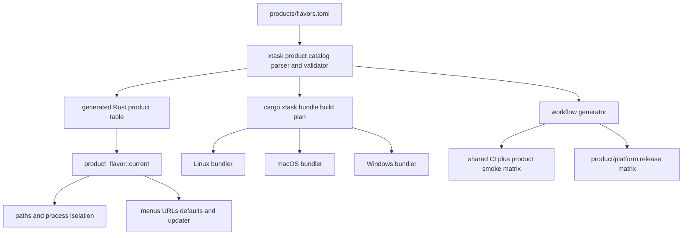

# Design: Declarative multi-product flavors

## Overview

Add a versioned `products/flavors.toml` catalog and make `cargo xtask` the only release-bundling entry point. The catalog is validated and compiled into a small `product_flavor` crate for runtime consumers. The same parser produces bundle plans and workflow matrices, so runtime identity, Cargo features, platform metadata, artifacts, and updater namespaces cannot drift onto independent values.

The Phase 1 build selects `rust` at compile time and uses the provisional marketing name **Copper**. `jvm` (**Orbit**) and `game` (**Forge**) exist in the catalog with `status = "planned"`; validation checks their reserved identities, but bundling and workflows exclude them. Internal Zed crates, modules, action namespaces, and project-local `.zed` files remain unchanged.

## Existing context

- `crates/paths/src/paths.rs` derives global data, config, state, cache, log, extension, language-server, and remote-server locations from one hard-coded `APP_NAME = "Zed"`. The project-local `.zed` paths are in the same crate but serve a different, intentionally shared purpose.
- `crates/release_channel/src/lib.rs` owns channel display names, Linux/macOS app IDs, Windows application identifiers, and update behavior. It does not include a product dimension.
- `crates/zed/Cargo.toml` contains channel-specific cargo-bundle metadata. Its current stable entry is directly branded `Rustlings`, while its URL scheme is still `zed`.
- `script/bundle-linux`, `script/bundle-mac`, and `script/bundle-windows.ps1` independently select features, names, identifiers, icons, installer identities, intermediate filenames, and artifact names. macOS temporarily edits Cargo metadata; Windows duplicates mutex/application identities in the installer script.
- `crates/zed/src/zed/open_listener.rs`, `crates/client/src/client.rs`, `crates/cli/src/main.rs`, and `crates/install_cli/src/register_sim_scheme.rs` hard-code `zed://`, `zed-cli://`, and related schemes.
- Linux CLI IPC uses a socket under `paths::data_dir`; Windows mutexes and named pipes derive from channel-only `release_channel::app_identifier`; macOS single-instance detection uses channel-only fixed loopback ports and handshakes.
- `crates/zed/src/zed/app_menus.rs`, About-window code in `crates/zed/src/zed.rs`, CLI copy, updater prompts, and install-CLI copy contain user-facing Zed names that must become typed consumers. Other Zed strings describe upstream services, technical formats, or source-code concepts and should remain.
- `crates/auto_update/src/auto_update.rs` requests the fixed asset `zed` from `/releases/{channel}/{version}/asset`; its cache and Windows helper filenames are also Zed-specific.
- Rust and rust-analyzer are built in through `crates/languages/src/lib.rs` and `crates/languages/src/rust.rs`. Java, Kotlin, and C# are currently suggested extension IDs in `crates/extensions_ui/src/extension_suggest.rs` rather than built-in product defaults.
- Agent defaults live in `assets/settings/default.json`, profile behavior in `crates/agent_settings`, and native system-prompt assembly in `crates/agent/src/templates.rs`. Personal and project rules already have an established precedence that product defaults must not bypass.
- The active workflows are generated from `tooling/xtask/src/tasks/workflows/`. The current fork has a one-job shared CI and three Rustlings-specific release jobs, but no product model or `cargo xtask bundle` command.

## Architecture



The catalog is the only hand-authored product data. The generated Rust table and generated YAML are derived artifacts checked for freshness. Platform scripts receive a resolved plan from `xtask`; they do not parse the catalog or infer product choices independently.

## Product catalog

### Schema

`products/flavors.toml` has a top-level schema version and ordered product entries. The parser uses `deny_unknown_fields` semantics. Product references to icons and instruction assets must resolve inside the repository; output-name templates accept only the documented variables `{product}`, `{version}`, `{channel}`, `{platform}`, `{arch}`, and `{extension}`.

| Field | Purpose |
| --- | --- |
| `id` | Stable internal flavor ID; lowercase ASCII and immutable after release |
| `status` | `enabled` or `planned`; only enabled entries enter build/workflow matrices |
| `display_name` | Provisional or permanent application name shown to users |
| `executable_name` | Installed launcher basename; platform extensions are derived |
| `bundle_identifier` | Stable reverse-DNS base, independent of the marketing name |
| `url_scheme` | Stable OS-registered deep-link scheme |
| `icon_set` | Repository-relative icon family consumed by all bundlers and About UI |
| `data_namespace` | Stable global config/data/cache/state and remote-install namespace |
| `update_namespace` | Stable update-feed and release-channel namespace |
| `cargo_features` | Exact `zed` features used with `--no-default-features` |
| `remote_server_features` | Exact corresponding `remote_server` features |
| `default_extensions` | Ordered extension IDs plus required/recommended policy |
| `default_language_servers` | Ordered language/server/provider declarations |
| `toolchain_onboarding` | Typed onboarding handler and its declarative checks/docs |
| `agent` | Default profile ID/name/base profile and instruction-asset path |
| `installer_name` | Installer filename template |
| `artifact_name` | Release artifact filename template |

The validator enforces uniqueness across IDs, bundle identifiers, URL schemes, executable names, data namespaces, update namespaces, and all derived channel identities. It also checks that `rust` maps `zed/rust-tools` to `remote_server/rust-tools`, that enabled entries reference existing assets and implemented onboarding handlers, and that planned entries cannot enter a bundle plan.

### Provisional entries

The following names are deliberately temporary. Technical identities use flavor IDs rather than these names.

<!-- impl: products/flavors.toml -->
<!-- impl: crates/product_flavor/generated_product.rs -->

| ID | Status in Phase 1 | Temporary display/executable | Technical identity | Planned focus |
| --- | --- | --- | --- | --- |
| `rust` | enabled | Copper / `copper` | `dev.ideflavors.rust`, `ide-rust`, `ide-rust` data, `rust` updates | `agentic-tools`, `rust-tools`, built-in Rust and rust-analyzer, rustup onboarding, Rust engineer profile |
| `jvm` | planned | Orbit / `orbit` | `dev.ideflavors.jvm`, `ide-jvm`, `ide-jvm` data, `jvm` updates | future `agentic`, `jvm-tools`, Java/Kotlin extensions and language servers, JDK/build-tool onboarding |
| `game` | planned | Forge / `forge` | `dev.ideflavors.game`, `ide-game`, `ide-game` data, `game` updates | future `agentic`, `game-tools`, C#/engine extensions and language servers, .NET/engine onboarding |

The `dev.ideflavors` root is provisional and must be replaced by a publisher-owned reverse-DNS root before production signing. Changing that root after release is an identity migration, not a marketing rename.

## Design decisions

### Catalog compilation and product selection

- Responsibility: Validate catalog data once and expose immutable typed product configuration to runtime, bundling, and workflows.
- Integration: Add `tooling/xtask/src/product_manifest.rs` as the parser/validator and generate `crates/product_flavor/src/generated.rs`. `crates/product_flavor/src/product_flavor.rs` selects an entry using compile-time `ZED_PRODUCT_ID`, defaulting to `rust` only for Phase 1 developer builds. Release bundles always pass an explicit product ID.
- Rationale: Generated constants avoid runtime parsing and make catalog changes visible in review. A compile-time selection prevents a released binary from switching its storage or updater identity through an environment variable.

`cargo xtask products --check` verifies schema and generated-source freshness. `cargo xtask workflows` and `cargo xtask bundle` call the same validator before doing work.

### Derived identity rules

- Responsibility: Produce collision-free channel-specific identities without repeating platform-only values in the catalog.
- Integration: `product_flavor` exposes pure helpers for `bundle_identifier(channel)`, `data_namespace(channel)`, `instance_namespace(channel)`, registered URL scheme, updater namespace, platform executable, installer name, and artifact name. Stable uses the catalog base; non-stable channels append a normalized channel suffix. Windows installer GUIDs use UUIDv5 from the final bundle identifier; AppUserModelID, mutex, and named-pipe identities use the same final identity.
- Rationale: Deriving related identities from stable technical fields reduces drift while keeping marketing names replaceable.

Global config, data, cache, state, logs, databases, downloaded extensions/language servers, and remote-server installations move under the product/channel namespace. Project-local `.zed` files stay unchanged. Linux and macOS use a product/channel Unix-domain IPC endpoint under the isolated data directory; Windows retains mutex/named-pipe mechanics but uses the product identity. This removes the channel-only macOS port allocation and its cross-product collision risk.

### Typed runtime branding

- Responsibility: Apply product identity only where the value is genuinely user-facing or OS-facing.
- Integration: `paths`, `release_channel`, client URL helpers, CLI detection/launch, URL registration/parsing, menu labels, About/version presentation, updater copy, and install-CLI copy consume `product_flavor::current()`. Internal action namespaces, Rust module names, telemetry schema keys, project `.zed` paths, and upstream documentation/source links stay unchanged unless their displayed label would falsely identify the running product.
- Rationale: A typed API makes each branding decision reviewable and prevents a marketing rename from damaging protocol names, source links, or unrelated text.

Deep links are constructed and parsed through helpers rather than prefix literals. The public registered scheme comes from the catalog. Private CLI/dock transport schemes derive from the product's instance namespace. A flavor may parse explicitly passed legacy `zed://` links only through a documented compatibility path, but it never registers the `zed` scheme and therefore cannot steal it from Zed.

### Product-default settings and bootstrap state

- Responsibility: Provide language focus without mutating user choices on every launch.
- Integration: Generate a product-default settings overlay and apply it in `SettingsStore` below user and project settings. The overlay declares language-server ordering and the agent default profile. A small product bootstrap in the existing extension-host/onboarding initialization records per-default disposition (`installed`, `declined`, `removed`, or `failed`) in the product-isolated key-value store.
- Rationale: A settings layer preserves normal precedence. Explicit disposition state prevents an extension the user removed from being reinstalled while allowing a failed installation to be retried deliberately.

Rust Phase 1 declares no mandatory external extension because Rust and rust-analyzer are built in. Its language-server declaration validates that the built-in `rust-analyzer` adapter is registered. JVM and Game entries reserve intended extension/server IDs but remain planned until a future phase verifies those external contracts.

### Toolchain onboarding

- Responsibility: Explain product prerequisites and provide safe next steps.
- Integration: Add typed onboarding handler IDs, beginning with `rustup`. The manifest supplies detection commands/components and documentation URLs; Rust code owns command execution and UI behavior. Phase 1 detects `rustup`, `cargo`, and the active Rust toolchain, then offers copyable guidance or an explicitly confirmed action.
- Rationale: Declarative checks are reusable, while command execution remains typed Rust rather than arbitrary catalog-provided shell.

No handler installs a system toolchain silently. Future `jvm` and `game` handlers require separate implementation and tests before their catalog entries can be enabled.

### Agent profile and instructions

- Responsibility: Make the agent useful for the selected product without overriding user or project rules.
- Integration: The generated product settings overlay adds a product profile based on the existing `write` profile and selects it only as the default for a fresh namespace. `SystemPromptTemplate` receives the catalog-referenced product instruction asset before personal `AGENTS.md` and project rules; the existing personal-before-project ordering remains intact.
- Rationale: A low-precedence product default supplies focus while preserving established customization and instruction precedence.

### Product-aware bundle command

- Responsibility: Resolve one deterministic plan and configure all platform scripts consistently.
- Integration: Add:

  ```text
  cargo xtask bundle --product rust [--platform <host>] [--target <triple>]
      [--channel stable] [--signing auto|off|required] [--dry-run]
  ```

  `xtask` validates the selected enabled entry, chooses a product-specific `CARGO_TARGET_DIR`, sets compile-time product selection, passes exact `--no-default-features` feature arguments, and launches the existing platform bundler with resolved environment values. `--dry-run` emits the normalized plan as JSON and performs no build.
- Rationale: Keeping orchestration in Rust avoids three independent catalog parsers and keeps shell/PowerShell scripts focused on platform assembly.

Direct script execution becomes an explicitly unsupported low-level path unless all required resolved environment values are present. Scripts never infer a product from display strings and never edit bundles with global replacement.

### Platform packaging

- Responsibility: Consume exact plan fields while retaining established assembly/signing mechanics.
- Integration:
  - Linux copies internal `zed` and `cli` outputs to configured installed names, renders the desktop file from exact variables, copies icons from `icon_set`, and writes the configured artifact name.
  - macOS may retain internal Cargo package/binary name `zed`; after `cargo bundle` creates the base application, the script updates exact plist keys (`CFBundleName`, `CFBundleDisplayName`, `CFBundleIdentifier`, `CFBundleExecutable`, and `CFBundleURLTypes`), sets both plist version keys from the resolved release version, installs the configured icon, renames the application/DMG, and only then signs. Cargo metadata remains a neutral internal base instead of one marketing product per table.
  - Windows passes catalog-derived Inno defines for application GUID, name, executable, icon, AppUserModelID, registry prefix, mutex, Appx identity, and output filename. Windows executable resources also consume the resolved display name, icon set, and release version. The updater helper receives the resolved executable rather than hard-coded `Zed.exe` jobs; reusable rollback closures borrow captured paths.
- Rationale: These are typed field assignments at known packaging boundaries, not global string replacement. Internal build products can remain named Zed until copied into an isolated package.

Each platform verifies its final metadata before upload. A mismatch between embedded product ID, bundle metadata, and artifact filename fails the job.

### Signing policy

- Responsibility: Preserve optional platform signing without committing credentials.
- Integration: `auto` uses existing macOS and Windows signing environment only when the complete credential set is present, otherwise producing ad-hoc/unsigned output. `off` always skips production signing. `required` validates completeness before compilation and fails clearly. The plan records only the policy and `credentials_available: true|false`, never values.
- Rationale: This supports fork development and production releases through the same command without inventing secrets.

### Generated CI and release workflows

- Responsibility: Test common code once and expand only product-dependent work.
- Integration: The workflow generator reads enabled catalog entries:
  - `shared_validation` performs fmt, repository clippy, and workspace nextest once.
  - `product_smoke` is a small Linux matrix over enabled products and runs bundle-plan validation plus explicit `cargo check` for application and remote-server features.
  - `release_build` is a static generated include matrix of enabled product/platform/target/runner rows and invokes `cargo xtask bundle --product ...`.
  - `publish_product` depends on the complete selected matrix, downloads only matching artifact names, and emits product-scoped update metadata.
- Rationale: Matrix rows are data, not copied workflow graphs. Planned products are absent until enabled.

Product tags use `<flavor-id>-v<version>` (for example `rust-v1.2.3`), while manual dispatch accepts a validated flavor ID and existing tag. Update metadata carries both `product_id` and `update_namespace/channel`; publishing refuses mixed artifacts. Workflow-level permissions stay read-only, with write permission limited to the publishing job.

### Updater separation

- Responsibility: Prevent one product from discovering or applying another product's release.
- Integration: Extend the existing release-asset request with the product update namespace and use the manifest's product-specific asset key. Cache/install directories and Windows helper launch targets use product identity. Published update metadata includes product ID, channel, version, platform, architecture, checksum, and URL; the updater rejects a mismatched product ID before download or install.
- Rationale: Artifact naming alone is not a safe update boundary.

The final update-manifest hosting URL is an unresolved deployment decision. Phase 1 implements and tests the namespaced client/publisher contract; production auto-update remains disabled or pointed at a non-production test endpoint until a publisher-owned service is selected.

## Migration and rollout

### Phase 1: Rust flavor only

1. Introduce and validate the catalog with `rust` enabled and `jvm`/`game` planned.
2. Replace hard-coded Rustlings packaging values with the `rust` entry and derived identities.
3. Move runtime paths, URL registration, IPC, updater identity, menus, and defaults to typed product configuration.
4. Route all platform release builds through `cargo xtask bundle --product rust`.
5. Enable shared CI, Rust smoke validation, and the Rust/platform release matrix.

The Phase 1 product is a new side-by-side identity, not an in-place rename of Zed or the current ad hoc Rustlings package. Current runtime data still uses Zed paths, so automatic discovery cannot tell whether data belongs to upstream Zed or the fork. The application must not copy from those paths automatically.

An optional migration UI or command accepts a user-selected source directory, summarizes the files to copy, and writes only into an empty/new product namespace. It never deletes or rewrites the source. Partial failure reports copied and skipped items and leaves both installations launchable. Rollback consists of removing the new product namespace after confirmation; the source remains untouched.

### Future JVM phase

Implement and validate the `jvm-tools` feature boundary, Java/Kotlin extension and language-server contracts, JDK/build-tool onboarding, Orbit assets/instructions, and product smoke tests. Only then change `jvm.status` to `enabled`; the existing generator expands CI and release matrices.

### Future Game phase

Implement and validate the `game-tools` boundary, C#/engine extension and language-server contracts, .NET/engine onboarding, Forge assets/instructions, and product smoke tests. Only then change `game.status` to `enabled`.

### Rollback

- Catalog or runtime regressions: disable the affected entry; planned/disabled entries cannot bundle or publish.
- Packaging regression: retain previous product-scoped release artifacts and update manifest; do not advance the product channel pointer.
- Migration regression: disable the import entry point. Imported data is a copy, so users can remove the new namespace and continue using the source installation.

## Error handling and security

- Catalog validation aggregates actionable field-level errors and never falls back from an explicitly requested unknown/planned product.
- Output templates reject path separators, traversal, shell metacharacters outside the allowed filename character set, and unknown variables.
- Platform scripts receive resolved values as environment arguments from `xtask`; they do not `eval` catalog content.
- Default extension failures do not block application startup. Required defaults produce a visible retry action; recommended defaults can be declined permanently.
- Update metadata is verified for product ID, channel, platform, architecture, version, and checksum before installation.
- Signing-policy validation never prints secret values. Existing credentials remain environment-only and are redacted from diagnostic output.

## Requirements traceability

| Requirement | Design element | Verification |
| --- | --- | --- |
| 1.1 | Product catalog; provisional entries | Catalog snapshot asserts stable IDs and independent names |
| 1.2 | Product catalog schema | Schema completeness test for every entry |
| 1.3 | Catalog compilation and validation | Negative validator fixtures for every invalid class |
| 1.4 | Derived identity rules | Rename-only fixture leaves technical identity snapshot unchanged |
| 1.5 | Catalog compilation and product selection | Binary metadata and `bundle --dry-run` report selected immutable ID |
| 2.1 | Typed runtime branding; platform packaging | Per-platform metadata/menu/About/CLI smoke assertions |
| 2.2 | Derived identity rules; updater separation | Cross-product/channel identity uniqueness and coexistence tests |
| 2.3 | Typed runtime branding | Diff/static review confirms internal names and `.zed` paths remain |
| 2.4 | Typed runtime branding; platform packaging | No-global-replacement static check and exact-field package tests |
| 2.5 | Derived identity rules | Project-path unit tests retain `.zed` paths across products |
| 3.1 | Product catalog; bundle command | Rust build-plan and cargo invocation snapshots |
| 3.2 | Product-default settings and bootstrap state | Fresh-namespace precedence integration test |
| 3.3 | Product-default settings and bootstrap state | Removed/declined/failed default lifecycle tests |
| 3.4 | Toolchain onboarding | Detected/missing/declined Rust toolchain UI tests |
| 3.5 | Agent profile and instructions | Prompt precedence and fresh-profile tests |
| 3.6 | Catalog compilation; generated workflows | Planned products rejected and absent from matrices |
| 4.1 | Product-aware bundle command | Host dry-run and platform invocation tests |
| 4.2 | Product-aware bundle command | Plan snapshot shows isolated target and explicit features |
| 4.3 | Platform packaging | Linux, macOS, and Windows package metadata inspection |
| 4.4 | Catalog validation; bundle command | Unknown/planned/unsupported-target negative tests |
| 4.5 | Signing policy | `auto`, `off`, and incomplete `required` plan tests |
| 4.6 | Signing policy | Secret-value scan of catalog, plan JSON, logs, and generated YAML |
| 5.1 | Generated CI | Generated graph asserts one shared validation job |
| 5.2 | Generated CI | Enabled-product smoke matrix and explicit feature snapshots |
| 5.3 | Generated release workflow | Product/platform include-matrix snapshot and artifact inspection |
| 5.4 | Generated release workflow; updater separation | Publish fan-in and mixed-artifact rejection tests |
| 5.5 | Catalog-driven workflow generation | Workflow freshness and permissions validation |
| 6.1 | Migration Phase 1 | Catalog status and generated-matrix assertions |
| 6.2 | Migration Phase 1 | Hard-coded Rustlings consumer scan after migration |
| 6.3 | Migration Phase 1 | Fresh launch test proves no implicit Zed-path import |
| 6.4 | Migration and rollout | Copy-only import success, partial-failure, and rollback tests |
| 6.5 | Future phases | Enablement fixture expands existing boundaries without new brand branches |

## Testing strategy

- Unit-test catalog parsing, path/template safety, identity derivation, feature mappings, generated Rust freshness, and planned-product rejection in `xtask`.
- Unit-test product-aware path functions using injected platform roots rather than mutating process-global home directories.
- Test URL generation/parsing, registered scheme selection, Linux/macOS socket paths, Windows mutex/pipe IDs, CLI detection, and update metadata rejection for at least two synthetic products and two channels.
- Test product-default precedence against user/project settings, extension disposition lifecycle, Rust toolchain detection states, and product-instruction ordering relative to personal/project rules.
- Snapshot `cargo xtask bundle --product rust --dry-run` for every supported target and assert application `agentic-tools,rust-tools`, remote `rust-tools`, product-specific target directories, output names, and signing policy.
- Run platform packaging smoke jobs that inspect desktop metadata/tar contents, macOS plist/application/DMG metadata, and Windows Inno/installer metadata without requiring signing credentials.
- Regenerate workflows and assert one shared validation job, only enabled-product smoke rows, the expected product/platform release rows, product-scoped artifacts, minimal permissions, and publish fan-in.
- Add a coexistence acceptance run that installs or stages Zed plus two synthetic flavor packages against temporary roots and verifies disjoint paths, URL handlers, process identities, and updater metadata.
- Validate the optional importer against empty destination, selected legacy source, partial-copy failure, retry, and non-destructive rollback scenarios.
