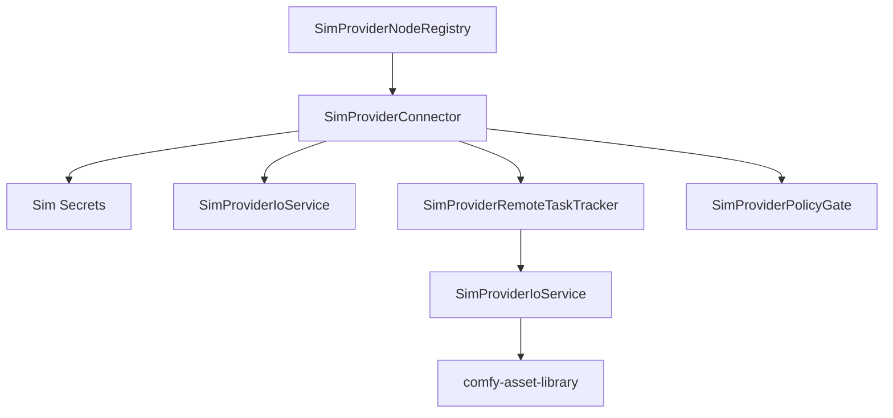

# Design: Comfy API Provider Nodes

## Overview

API provider nodes are normalized as policy-gated world-model harness remote execution connectors. Each connector declares provider capabilities and handles authentication, upload, request creation, polling, download, cancellation, and diagnostics. This avoids copying each Python node implementation verbatim while preserving workflow-compatible node IDs and schemas.

## Architecture



## Components and Interfaces

### SimProviderNodeRegistry

- **Purpose**: Map Comfy API node ids to provider capabilities and connector implementations.
- **Responsibilities**: Enabled/disabled policy, node schemas, capability metadata, and unsupported diagnostics.
- **Native behavior**: Stores Comfy node ids as compatibility keys but exposes
  native `SimProvider*` definitions, provider ids, capability metadata, schema
  refs, credential keys, cost/rate metadata, enabled/disabled policy, and
  unsupported diagnostics. Registry support must not mean forwarding provider
  execution to ComfyUI.

### SimProviderConnector

- **Purpose**: Execute provider-specific request lifecycles behind a common interface.
- **Responsibilities**: Validate inputs, resolve credentials, create requests, poll tasks, cancel tasks, download results, and normalize errors.
- **Native behavior**: Starts native `SimProviderRemoteTaskHandle` records,
  polls provider progress into `SimProviderRemoteTaskStatus`, maps provider
  failures into Sim diagnostics, and models unsupported cancellation locally
  instead of delegating the lifecycle to ComfyUI.

### SimProviderAdapterCatalog and SimProviderAdapterSkeleton

- **Purpose**: Register concrete provider adapter skeletons before provider SDK
  or HTTP implementations are approved.
- **Native behavior**: Stores OpenAI, Gemini, Anthropic/OpenRouter,
  image/video, audio, and 3D adapter families as native
  `SimProviderAdapter*` records. Adapter skeletons expose native
  `sim.provider.*` handlers, validate provider ids and capabilities, create
  Sim-owned remote task handles for supported skeleton operations, and gate
  unavailable provider operations with structured unsupported diagnostics
  rather than passing execution through to ComfyUI.

```rust
pub trait SimProviderConnector {
    fn provider_id(&self) -> &SimProviderId;
    fn capabilities(&self) -> &[SimProviderCapability];
    fn start(&mut self, request: SimProviderPolicyRequest) -> Result<SimProviderRemoteTaskHandle, SimProviderConnectorError>;
    fn poll(&mut self, task: &SimProviderRemoteTaskHandle) -> Result<SimProviderRemoteTaskStatus, SimProviderConnectorError>;
    fn cancel(&mut self, task: &SimProviderRemoteTaskHandle) -> Result<SimProviderRemoteTaskStatus, SimProviderConnectorError>;
}
```

### SimProviderPolicyGate

- **Purpose**: Enforce offline mode, credential availability, cost approval, external data policy, provider quotas, and capability availability.
- **Native behavior**: Evaluates native `SimProviderPolicyRequest` records before
  provider execution so disabled API nodes, offline mode, unapproved external
  data transfer, unapproved cost, unavailable provider capabilities, unavailable
  models, and quota limits fail inside Sim before credentials or media are read.

### SimProviderSecretStore and SimProviderRedactor

- **Purpose**: Resolve provider credentials through Sim secret references and
  remove sensitive data from provider payloads before they reach logs, history,
  diagnostics, or job status.
- **Native behavior**: Stores provider credential metadata as native
  `SimProviderSecret*` records, returns secret refs rather than plaintext
  credentials, emits actionable missing-credential diagnostics, recursively
  redacts sensitive provider fields, replaces known secret values, and strips
  signed URLs. Secret support must not serialize workflow JSON plaintext keys
  or forward credential handling to ComfyUI.

### SimProviderIoService

- **Purpose**: Handle source media upload and result import.
- **Responsibilities**: MIME detection, signed URL redaction, retry boundaries, asset registration, and provenance.
- **Native behavior**: Prepares native `SimProviderUploadRecord` values for
  provider source media, redacts signed upload and download URLs, imports
  provider outputs as `SimProviderImportedAsset` records, preserves image,
  video, audio, text, vector, and 3D MIME metadata, and attaches
  `SimProviderOutputProvenance` to each imported asset.

### SimProviderRemoteTaskTracker

- **Purpose**: Track provider async task ids inside Sim job node state.
- **Responsibilities**: Status polling, timeout, cancellation, provider progress, and terminal state mapping.
- **Native behavior**: Records provider ids, remote task ids, Comfy node
  compatibility ids, native handlers, progress, timeouts, terminal states, and
  diagnostics as `SimProviderRemoteTask*` values owned by Sim.

## Data Models

```rust
pub enum SimProviderCapability {
    TextToImage,
    ImageEdit,
    TextToVideo,
    ImageToVideo,
    AudioGeneration,
    Speech,
    Llm,
    Vector,
    ThreeD,
    Enhancement,
}

pub struct ProviderNodeRequest {
    pub provider: SimProviderId,
    pub node_id: NodeId,
    pub capability: SimProviderCapability,
    pub inputs: JsonObject,
    pub source_assets: Vec<AssetReferenceId>,
    pub policy_context: ProviderPolicyContext,
}

pub struct SimProviderPolicyRequest {
    pub provider: SimProviderId,
    pub capability: SimProviderCapability,
    pub transmits_external_data: bool,
    pub may_incur_cost: bool,
    pub model_id: Option<String>,
    pub estimated_quota_units: u64,
}

pub struct SimProviderResolvedCredential {
    pub key: String,
    pub provider: SimProviderId,
    pub secret_ref: String,
}

pub enum SimProviderRemoteTaskStatus {
    Queued,
    Running { progress: Option<f32>, message: Option<String> },
    Completed { output_refs: Vec<String> },
    Failed { message: String },
    Cancelled { message: String },
    TimedOut { message: String },
}

pub struct SimProviderImportedAsset {
    pub asset_ref: String,
    pub kind: SimProviderOutputKind,
    pub mime_type: String,
    pub provenance: SimProviderOutputProvenance,
}
```

## Correctness Properties

### Property 1: Offline Mode Blocks Calls

_For any_ provider node execution, if API nodes or external provider calls are disabled, the system SHALL block the call before credentials or media are read.

**Validates: Requirement 1.2, 5.3**

### Property 2: Secret Redaction

_For any_ provider request, response, log, history entry, or job status payload, credentials, signed URLs, and configured sensitive provider fields SHALL be redacted.

**Validates: Requirement 2.1, 2.2**

### Property 3: Remote Task Provenance

_For any_ successful provider task, every imported output SHALL include provider id, model id, remote task id, source assets, request parameters, and Sim job/node ids in provenance.

**Validates: Requirement 3.1, 3.3, 4.1, 4.2, 4.3, 4.4, 4.5**

### Property 4: Provider Error Normalization

_For any_ provider failure, timeout, rate limit, auth failure, or malformed response, the node SHALL fail with a structured diagnostic and SHALL NOT register partial outputs unless the provider returned valid artifacts.

**Validates: Requirement 3.4**

### Property 5: Cost and Data Policy

_For any_ provider call that may incur cost or transmit project media externally, the policy gate SHALL require explicit approval before starting the remote task.

**Validates: Requirement 5.1, 5.2**

## Error Handling

- Missing credentials produce authentication diagnostics and do not start remote tasks.
- Disabled provider nodes fail validation before graph execution.
- Provider rate limits include retry-after information when available.
- Provider malformed responses include provider, endpoint, and response-shape diagnostics without logging secrets.
- Cancellation maps unsupported provider cancellation to a Sim-local cancelled/abandoned state with explanation.

## Testing Strategy

- Registry snapshot tests for provider/node/capability mapping from `projects/comfy/comfy_api_nodes`.
- Native fixture tests for `provider_nodes.json` that assert Sim provider records,
  native `sim.provider.*` handlers, unsupported diagnostics, and no ComfyUI
  pass-through behavior.
- Unit tests for secret redaction, offline mode, policy approval, and provider error normalization.
- Mock connector integration tests for upload, create, poll, cancel, download, and asset registration.
- Provenance tests for image, video, audio, text, vector, and 3D provider outputs.
