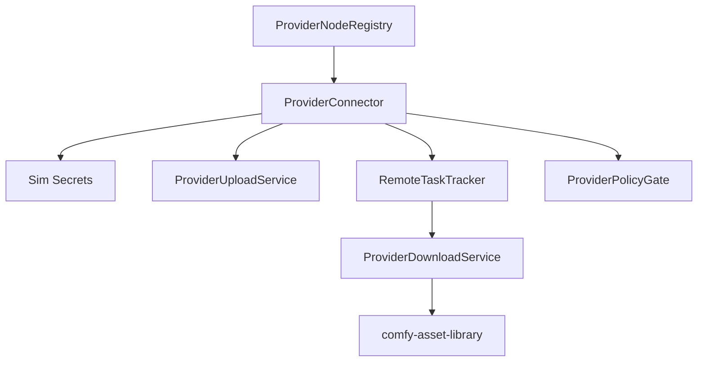

# Design: Comfy API Provider Nodes

## Overview

API provider nodes are normalized as policy-gated world-model harness remote execution connectors. Each connector declares provider capabilities and handles authentication, upload, request creation, polling, download, cancellation, and diagnostics. This avoids copying each Python node implementation verbatim while preserving workflow-compatible node IDs and schemas.

## Architecture



## Components and Interfaces

### ProviderNodeRegistry

- **Purpose**: Map Comfy API node ids to provider capabilities and connector implementations.
- **Responsibilities**: Enabled/disabled policy, node schemas, capability metadata, and unsupported diagnostics.

### ProviderConnector

- **Purpose**: Execute provider-specific request lifecycles behind a common interface.
- **Responsibilities**: Validate inputs, resolve credentials, create requests, poll tasks, cancel tasks, download results, and normalize errors.

```rust
pub trait ProviderConnector {
    fn provider(&self) -> ProviderId;
    fn capabilities(&self) -> Vec<ProviderCapability>;
    async fn start(&self, request: ProviderNodeRequest) -> Result<RemoteTaskHandle, ProviderError>;
    async fn poll(&self, task: &RemoteTaskHandle) -> Result<RemoteTaskStatus, ProviderError>;
    async fn cancel(&self, task: &RemoteTaskHandle) -> Result<CancelResult, ProviderError>;
    async fn collect_outputs(&self, task: &RemoteTaskHandle) -> Result<Vec<ProviderOutput>, ProviderError>;
}
```

### ProviderPolicyGate

- **Purpose**: Enforce offline mode, credential availability, cost approval, external data policy, provider quotas, and capability availability.

### ProviderUploadService and ProviderDownloadService

- **Purpose**: Handle source media upload and result import.
- **Responsibilities**: MIME detection, signed URL redaction, retry boundaries, asset registration, and provenance.

### RemoteTaskTracker

- **Purpose**: Track provider async task ids inside Sim job node state.
- **Responsibilities**: Status polling, timeout, cancellation, provider progress, and terminal state mapping.

## Data Models

```rust
pub enum ProviderCapability {
    TextToImage,
    ImageEdit,
    TextToVideo,
    ImageToVideo,
    AudioGeneration,
    Speech,
    Llm,
    Vector,
    ThreeD,
    Enhancement,
}

pub struct ProviderNodeRequest {
    pub provider: ProviderId,
    pub node_id: NodeId,
    pub capability: ProviderCapability,
    pub inputs: JsonObject,
    pub source_assets: Vec<AssetReferenceId>,
    pub policy_context: ProviderPolicyContext,
}
```

## Correctness Properties

### Property 1: Offline Mode Blocks Calls

_For any_ provider node execution, if API nodes or external provider calls are disabled, the system SHALL block the call before credentials or media are read.

**Validates: Requirement 1.2, 5.3**

### Property 2: Secret Redaction

_For any_ provider request, response, log, history entry, or job status payload, credentials, signed URLs, and configured sensitive provider fields SHALL be redacted.

**Validates: Requirement 2.1, 2.2**

### Property 3: Remote Task Provenance

_For any_ successful provider task, every imported output SHALL include provider id, model id, remote task id, source assets, request parameters, and Sim job/node ids in provenance.

**Validates: Requirement 3.1, 3.3, 4.1, 4.2, 4.3, 4.4, 4.5**

### Property 4: Provider Error Normalization

_For any_ provider failure, timeout, rate limit, auth failure, or malformed response, the node SHALL fail with a structured diagnostic and SHALL NOT register partial outputs unless the provider returned valid artifacts.

**Validates: Requirement 3.4**

### Property 5: Cost and Data Policy

_For any_ provider call that may incur cost or transmit project media externally, the policy gate SHALL require explicit approval before starting the remote task.

**Validates: Requirement 5.1, 5.2**

## Error Handling

- Missing credentials produce authentication diagnostics and do not start remote tasks.
- Disabled provider nodes fail validation before graph execution.
- Provider rate limits include retry-after information when available.
- Provider malformed responses include provider, endpoint, and response-shape diagnostics without logging secrets.
- Cancellation maps unsupported provider cancellation to a Sim-local cancelled/abandoned state with explanation.

## Testing Strategy

- Registry snapshot tests for provider/node/capability mapping from `projects/comfy/comfy_api_nodes`.
- Unit tests for secret redaction, offline mode, policy approval, and provider error normalization.
- Mock connector integration tests for upload, create, poll, cancel, download, and asset registration.
- Provenance tests for image, video, audio, text, vector, and 3D provider outputs.
