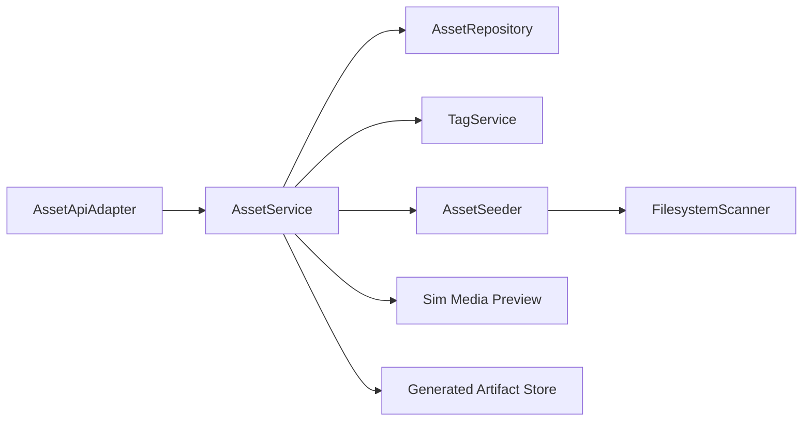

# Design: Comfy Asset Library

## Overview

The asset library provides the world-model harness asset model and Comfy-compatible asset APIs on top of Sim storage, artifact, and media services. It preserves the useful Comfy split between immutable content and mutable owner-scoped references while avoiding a parallel media preview stack.

## Architecture



## Components and Interfaces

### AssetRepository

- **Purpose**: Persist asset content metadata, references, tags, and metadata entries.
- **Responsibilities**: Hash lookup, reference CRUD, owner scoping, soft delete, cache state, and metadata indexing.
- **Native asset records**: Asset content, owner-scoped references, tag links,
  metadata entries, soft-delete timestamps, provenance ids, and cache state are
  stored as Sim-owned repository records. Hash dedupe reuses content while
  preserving distinct reference metadata, and repository behavior does not
  depend on ComfyUI's asset database or storage layer.

```rust
pub trait AssetRepository {
    fn asset_by_hash(&self, hash: &AssetHash) -> Result<Option<AssetRecord>, AssetError>;
    fn list_references(&self, query: AssetListQuery) -> Result<AssetListPage, AssetError>;
    fn create_reference(&self, request: CreateAssetReference) -> Result<AssetReferenceRecord, AssetError>;
    fn soft_delete_reference(&self, owner: &OwnerId, reference: AssetReferenceId) -> Result<bool, AssetError>;
}
```

### AssetApiAdapter

- **Purpose**: Expose Comfy-compatible `/api/assets` and `/api/tags` routes.
- **Responsibilities**: Query validation, multipart parsing, upload dedupe, download streaming, tag mutation, and error shape normalization.
- **Native query validation**: Hashes, cursors, metadata filters, sort/order,
  tags, pagination, and owner scopes are parsed into typed Sim query models
  before any repository access. Compatibility route adapters may translate
  legacy parameter names, but they do not forward ComfyUI query strings or
  rely on ComfyUI validation behavior.
- **Native CRUD/upload service**: List, detail, create-from-hash, upload,
  update, delete, and hash-exists operations execute against Sim repository
  records and owner scopes. Comfy-compatible routes adapt request/response
  shapes only; they do not proxy asset mutations to ComfyUI.
- **Native download/preview resolution**: Download descriptors resolve from
  owner-scoped Sim asset records, force safe content types and content
  disposition, and return Sim media preview routes for preview references
  instead of forwarding to ComfyUI preview handlers.

### AssetSeeder

- **Purpose**: Synchronize filesystem roots into asset records.
- **Responsibilities**: Scan models/input/output roots, pause during generation, resume after output registration, report progress, cancel, and prune missing references.
- **Native seeding and pruning**: Model, input, and output root scans
  register files through Sim asset APIs with progress, cancellation, and
  diagnostics. Prune marks out-of-root references missing in Sim cache state
  without deleting content or invoking ComfyUI scanners.

### MetadataExtractor

- **Purpose**: Extract safe metadata for assets.
- **Responsibilities**: MIME type, image dimensions, safetensors metadata, filename metadata, and generated artifact metadata links.

### UserDataStore

- **Purpose**: Provide Comfy-compatible user files and settings.
- **Responsibilities**: User resolution, system-user protection, path confinement, list/read/write/move/delete, and settings JSON persistence.
- **Native tags and user data**: Tag mutation, tag listing, refinement
  histograms, user files, and settings execute against Sim-owned asset records
  and user storage paths. Comfy-compatible endpoints adapt names and response
  shapes only; they do not call ComfyUI tag, settings, or user-data handlers.

## Data Models

```rust
pub struct AssetRecord {
    pub id: AssetId,
    pub hash: Option<AssetHash>,
    pub size_bytes: u64,
    pub mime_type: Option<String>,
    pub created_at: Timestamp,
}

pub struct AssetReferenceRecord {
    pub id: AssetReferenceId,
    pub asset_id: AssetId,
    pub owner_id: OwnerId,
    pub name: String,
    pub tags: Vec<TagName>,
    pub preview_id: Option<AssetReferenceId>,
    pub user_metadata: JsonObject,
    pub system_metadata: JsonObject,
    pub job_id: Option<Uuid>,
    pub file_path: Option<PathBuf>,
    pub is_missing: bool,
    pub enrichment_level: u8,
}
```

## Correctness Properties

### Property 1: Content Deduplication

_For any_ asset upload or registration with a known hash, the system SHALL reuse the existing content record and create a distinct reference when reference metadata differs.

**Validates: Requirement 1.1, 1.3, 2.2, 2.3**

### Property 2: Owner Isolation

_For any_ asset, tag, or user-data operation, the system SHALL only read or mutate records and paths accessible to the resolved owner.

**Validates: Requirement 2.5, 5.1, 5.3**

### Property 3: Non-Destructive Reference Delete

_For any_ reference delete request, the system SHALL soft-delete the reference and preserve shared content unless an explicit orphan cleanup policy runs.

**Validates: Requirement 2.5**

### Property 4: Scan Progress Monotonicity

_For any_ active seed scan, scanned count SHALL never exceed total count and created plus skipped SHALL never exceed scanned.

**Validates: Requirement 4.2**

### Property 5: Missing File Preservation

_For any_ prune operation, references outside known roots SHALL be marked missing without deleting asset content or user metadata.

**Validates: Requirement 4.4**

## Error Handling

- Disabled asset routes return a service-disabled error.
- Invalid hash, cursor, query, metadata filter, or multipart field returns a structured validation error.
- Hash mismatch rejects upload and removes temporary upload data.
- Missing content for create-from-hash returns not found.
- Download of missing underlying file returns file-not-found without exposing host paths.
- Database lock or missing dependency fails startup when `--enable-assets` is required.
- User path escape returns forbidden and does not create files.

## Testing Strategy

- Unit tests for hash validation, tag normalization, cursor encoding/decoding,
  metadata filters, owner scope resolution, and path confinement.
- Repository tests for content/reference dedupe, soft delete, owner scoping,
  cache state, provenance ids, and tag histograms.
- API tests for upload, download, create-from-hash, CRUD, preview resolution,
  tags, user data, settings, seed status, cancel, and prune.
- Scanner tests for models/input/output roots, missing files, cancellation,
  pruning, enrichment, and output registration.
