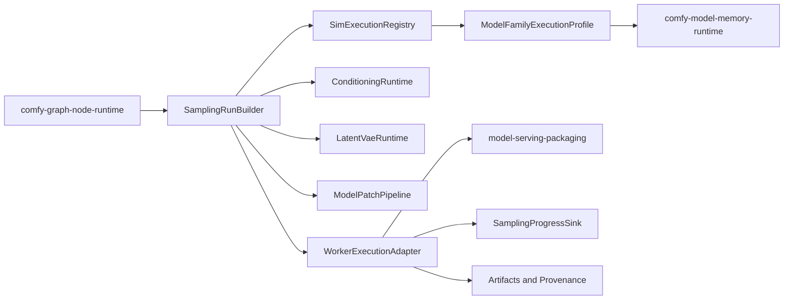

# Design: Comfy Diffusion and World Model Runtime

## Overview

This spec makes Comfy's model-execution semantics explicit inside the world-model harness. The implementation should not treat Comfy as only an API or graph format: Comfy also defines how samplers, schedulers, conditioning, latent formats, VAEs, model patches, and model families are assembled into executable diffusion and world-model runs. Sim keeps worker processes, storage, UI, media previews, and dependency review in existing systems.

## Architecture



The graph runtime decides which nodes execute and in what order. This runtime turns executable sampling/model nodes into typed execution requests and sends those requests through Sim worker boundaries.

## Components and Interfaces

### SimExecutionRegistry

- **Purpose**: Declare supported sampler, scheduler, guidance, latent, VAE, patch, and model-family execution capabilities.
- **Responsibilities**: Capability lookup, unsupported diagnostics, family-specific constraints, fixture linkage, and divergence records.

```rust
pub trait SimExecutionRegistry {
    fn sampler(&self, id: &SamplerId) -> Option<SamplerCapability>;
    fn scheduler(&self, id: &SchedulerId) -> Option<SchedulerCapability>;
    fn model_family(&self, family: &ModelFamilyId) -> Option<ModelFamilyExecutionProfile>;
    fn divergence(&self, key: &ExecutionBehaviorKey) -> Option<DivergenceRecord>;
}
```

### SamplingRunBuilder

- **Purpose**: Convert Comfy sampler and model execution nodes into a validated worker request.
- **Responsibilities**: Capture seeds, noise policy, CFG/guidance, steps, denoise range, latent shape, conditioning references, model profile, and deterministic metadata.
- **Does not own**: Graph scheduling, model file discovery, worker startup, or artifact storage.

### ConditioningRuntime

- **Purpose**: Preserve Comfy conditioning and guidance semantics.
- **Responsibilities**: Text/vision encoding metadata, pooled outputs, attention metadata, area/mask/range transforms, inpaint metadata, ControlNet/GLIGEN/style/unCLIP/IP-adapter/reference attachments, and compatibility validation.

### LatentVaeRuntime

- **Purpose**: Execute or describe latent and VAE operations required by sampling.
- **Responsibilities**: Latent format validation, image/video/audio latent metadata, tiled and temporal VAE settings, inpaint masks, and encode/decode diagnostics.

### ModelPatchPipeline

- **Purpose**: Apply model and conditioning modifiers in a deterministic order.
- **Responsibilities**: LoRA, hypernetwork, ControlNet, GLIGEN, style, edit-model, merge, and model patch provenance.

### WorldModelRunnerBridge

- **Purpose**: Preserve Comfy world-model and temporal diffusion execution constraints while interoperating with `world-model-runtime/`.
- **Responsibilities**: Wan, Hunyuan Video, LTXV, CogVideo, Cosmos, Genmo, Lightricks, and related model family constraints; temporal latent shape; reference frames; camera/control inputs; and guidance metadata.

### WorkerExecutionAdapter

- **Purpose**: Send validated execution requests through Sim worker infrastructure.
- **Responsibilities**: Worker capability checks, progress events, preview events, cancellation, terminal state mapping, output collection, and diagnostics.

## Data Models

```rust
pub struct SamplingRunRequest {
    pub sampler: SamplerId,
    pub scheduler: SchedulerId,
    pub seed: u64,
    pub noise_policy: NoisePolicy,
    pub steps: u32,
    pub guidance: GuidancePolicy,
    pub denoise: DenoiseRange,
    pub latent: LatentDescriptor,
    pub conditioning: ConditioningBundleId,
    pub model: ModelComponentSet,
    pub patches: Vec<ModelPatchRef>,
    pub family_profile: ModelFamilyExecutionProfile,
    pub deterministic: Option<DeterministicRunMetadata>,
}

pub struct DeterministicRunMetadata {
    pub seed: u64,
    pub noise_seed: Option<u64>,
    pub sampler: SamplerId,
    pub scheduler: SchedulerId,
    pub backend: DeviceBackend,
    pub precision: PrecisionPolicy,
    pub model_hash: Option<String>,
}

pub struct ConditioningBundle {
    pub id: ConditioningBundleId,
    pub encoder: EncoderIdentity,
    pub token_embeddings: TensorDescriptor,
    pub pooled_output: Option<TensorDescriptor>,
    pub attention_metadata: AttentionMetadata,
    pub source_prompts: Vec<PromptMetadata>,
    pub regions: Vec<ConditioningRegion>,
    pub control_attachments: Vec<ControlAttachment>,
    pub transforms: Vec<ConditioningTransform>,
}

pub struct ConditioningRuntimeContext {
    pub sampler: SamplerId,
    pub guidance: GuidanceMode,
    pub latent_format: LatentFormat,
    pub backend: DeviceBackend,
    pub worker_supports_control_attachments: bool,
}

pub struct LatentArtifact {
    pub id: LatentId,
    pub format: LatentFormat,
    pub media: LatentMediaKind,
    pub width: u32,
    pub height: u32,
    pub channels: u32,
    pub frames: Option<u32>,
    pub batch: u32,
    pub compression: LatentCompressionMetadata,
    pub mask: Option<LatentMask>,
}

pub struct VaeRuntimeRequest {
    pub operation: VaeOperationKind,
    pub node_id: NodeId,
    pub vae_model_ref: ModelFileRef,
    pub image_ref: Option<AssetRef>,
    pub input_latent: Option<LatentArtifact>,
    pub output_latent: LatentArtifact,
    pub mask: Option<LatentMask>,
    pub tiling: Option<VaeTilingMetadata>,
    pub temporal_frames: Option<u32>,
}

pub struct ModelComponentSet {
    pub id: ModelComponentSetId,
    pub family: ModelFamilyId,
    pub latent_format: LatentFormat,
    pub components: Vec<ModelComponent>,
}

pub struct ModelPatchPlan {
    pub component_set: ModelComponentSet,
    pub patches: Vec<AppliedModelPatch>,
}

pub struct SimRunnerProfile {
    pub family: ModelFamilyId,
    pub runner: RunnerKind,
    pub media: MediaDomain,
    pub latent_format: LatentFormat,
    pub execution_profile: ModelFamilyExecutionProfile,
    pub native_sim_runner: String,
}

pub struct WorldModelRunnerProfile {
    pub runner_profile: SimRunnerProfile,
    pub supports_reference_frames: bool,
    pub supports_camera_controls: bool,
    pub supports_action_controls: bool,
    pub minimum_frames: u32,
}

pub struct WorkerExecutionRequest {
    pub job_id: JobId,
    pub sampling: SamplingRunRequest,
    pub previews_requested: bool,
    pub cancellation_requested: bool,
}

pub struct WorkerExecutionReport {
    pub job_id: JobId,
    pub terminal_state: WorkerTerminalState,
    pub progress: Vec<SamplingProgress>,
    pub previews: Vec<WorkerPreview>,
    pub outputs: Vec<WorkerOutputArtifact>,
    pub provenance: Vec<ProvenanceRecord>,
    pub diagnostics: Vec<WorkerExecutionDiagnostic>,
}

pub struct ModelFamilyExecutionProfile {
    pub family: ModelFamilyId,
    pub media_domain: MediaDomain,
    pub latent_format: LatentFormat,
    pub supported_samplers: BTreeSet<SamplerId>,
    pub supported_schedulers: BTreeSet<SchedulerId>,
    pub supported_guidance: BTreeSet<GuidanceMode>,
    pub temporal_constraints: Option<TemporalExecutionConstraints>,
}

pub struct SamplerCapability {
    pub kind: SamplerKind,
    pub supported_schedulers: BTreeSet<SchedulerKind>,
    pub supports_deterministic_noise: bool,
    pub supports_start_end_steps: bool,
}

pub struct DivergenceRecord {
    pub behavior: ExecutionBehaviorKey,
    pub comfy_source: SourceReference,
    pub reason: DivergenceReason,
    pub sim_behavior: String,
}
```

Conditioning records are native Sim data structures. They preserve
Comfy-compatible conditioning semantics for interoperability, but validation and
worker handoff use typed Sim bundle, tensor, prompt, region, transform, and
control-attachment records instead of passing opaque Comfy payloads through the
runtime.

Latent and VAE records are also native Sim runtime records. VAE encode, decode,
tiled, temporal, and inpaint operations preserve Comfy-compatible metadata, but
Sim validates latent format, dimensions, frame counts, masks, compression, VAE
model references, and tiling metadata before worker execution rather than
delegating those checks to Comfy.

Model loader outputs and model patches are native Sim component and patch plans.
The runtime validates component category, model family, latent format, patch
category, compatibility, strengths, duplicate ids, and patch support before
worker execution. Patch application order is deterministic across LoRA,
hypernetwork, ControlNet, GLIGEN, model patch, model merge, and edit-model
records, with provenance preserved on every applied patch.

Runner profiles are native Sim execution records. They bind Comfy-compatible
model-family semantics to Sim runner identifiers for image diffusion,
video/world-model, audio, 3D, depth, segmentation, and detection families.
Unsupported families produce explicit diagnostics; video/world-model profiles
also preserve reference frame, camera, and action-control constraints.

Worker execution is a native Sim boundary. The adapter validates worker
capabilities for model family, previews, cancellation, and deterministic
execution before dispatch, then maps worker progress, previews, terminal state,
outputs, diagnostics, and provenance back into Sim job records.

Compatibility fixtures use mock runner manifests when production weights are not
available. The fixture manifest records required workflow categories,
native-Sim validation surfaces, and dependency-review divergences so tests can
assert coverage without downloading weights or passing execution through Comfy.

## Correctness Properties

### Property 1: Sampling Input Preservation

_For any_ Comfy sampling node that starts execution, the generated sampling request SHALL include sampler, scheduler, seed/noise policy, steps, guidance, denoise range, latent shape, conditioning, and model profile.

**Validates: Requirement 1.1**

### Property 2: Unsupported Sampling Blocks Early

_For any_ sampling request, if the sampler, scheduler, guidance mode, model family, or worker backend is unsupported, the system SHALL reject the request before model work starts.

**Validates: Requirement 1.2, 2.4, 4.4**

### Property 3: Deterministic Metadata

_For any_ deterministic-capable execution, the provenance record SHALL include seed, noise, sampler, scheduler, backend, precision, and model hash metadata.

**Validates: Requirement 1.3, 5.4**

### Property 4: Conditioning Compatibility

_For any_ conditioning bundle, transforms and control attachments SHALL preserve Comfy-compatible metadata and SHALL validate against the selected model-family execution profile before execution.

**Validates: Requirement 2.1, 2.2, 2.3, 2.4**

### Property 5: Latent and Patch Compatibility

_For any_ latent, VAE, model component, or model patch, if it does not match the selected model family, the system SHALL reject execution with node-scoped diagnostics.

**Validates: Requirement 3.1, 3.2, 3.3, 3.4**

### Property 6: World Model Temporal Semantics

_For any_ video or world-model execution profile, the worker request SHALL preserve temporal latent shape, frame count, reference frames, camera/control inputs, guidance metadata, and model-family constraints.

**Validates: Requirement 4.2**

### Property 7: Worker Boundary

_For any_ local model execution that requires Python, PyTorch, GPU APIs, custom kernels, native packages, model weights, or large downloads, the system SHALL use Sim worker and dependency-review boundaries before execution.

**Validates: Requirement 5.1, 5.2, 5.3**

### Property 8: Divergence Accountability

_For any_ intentional Sim divergence from Comfy execution behavior, a machine-readable divergence record SHALL identify the Comfy source behavior, reason, and Sim behavior.

**Validates: Requirement 6.3**

## Error Handling

- Unsupported sampler, scheduler, guidance, or model-family requests fail validation before worker start.
- Worker capability mismatches return model-family diagnostics rather than generic execution failures.
- Missing model files, precision/device incompatibilities, or memory-policy conflicts are delegated to `comfy-model-memory-runtime/`.
- Python, package, GPU, remote-worker, and download setup failures are delegated to `model-serving-packaging/`.
- Partial execution failures preserve job state, node id, progress, diagnostics, and any completed artifact provenance.
- Divergence without a recorded reason blocks compatibility fixture approval.

## Testing Strategy

- Unit tests for sampler/scheduler registry, sampling request building, conditioning metadata preservation, latent/VAE validation, and patch ordering.
- Integration tests with mock workers for text-to-image, image-to-image, inpaint, ControlNet, LoRA, VAE, sampler/scheduler, and world-model/video workflows.
- Fixture tests that compare request metadata and diagnostic snapshots without requiring production model downloads.
- Property-based tests for deterministic seed/noise metadata, patch ordering, and latent shape validation.
