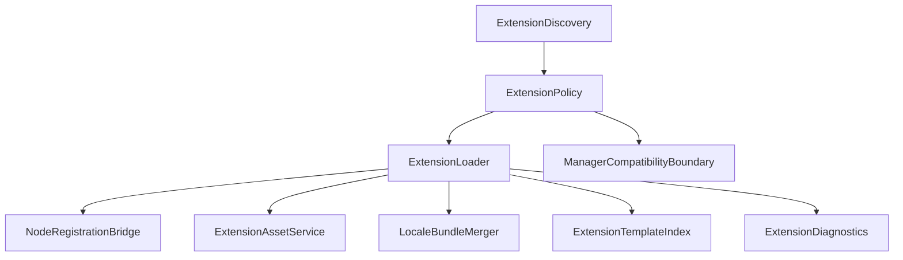

# Design: Comfy Extension Ecosystem

## Overview

The extension ecosystem is a controlled harness extension layer. Sim discovers node packs, extracts supported schemas and assets, and records diagnostics, but it does not run arbitrary extension code without policy gates. Python-backed execution and package installation are separate concerns.

## Architecture



## Components and Interfaces

### ExtensionDiscovery

- **Purpose**: Find candidate node packs in configured roots.
- **Responsibilities**: Directory and Python-file discovery, disabled suffix handling, whitelist filtering, manager blocklist integration, and deterministic order.
- **Native behavior**: Produces native `SimExtension*` records for discovered
  packs, source kinds, root indexes, load order, and skip diagnostics without
  importing Python modules, executing prestartup scripts, or passing discovery
  through to ComfyUI.

### ExtensionPolicy

- **Purpose**: Decide what each extension may do.
- **Responsibilities**: Enable/disable, whitelist, script permission, network permission, package install permission, web asset serving, and developer mode.
- **Native behavior**: Evaluates discovered `SimExtensionRecord` values through
  native `SimExtensionPolicy*` records, emits structured diagnostics for
  disabled, blocked, script-denied, web-asset-denied, network-denied, and
  install-review-required states, and requires explicit install permission plus
  dependency review before manager-like filesystem or network writes.

### ExtensionLoader

- **Purpose**: Load allowed extension metadata and registration output.
- **Responsibilities**: Run allowed prestartup scripts, call supported registration mechanisms, isolate diagnostics, and restore protected hooks.
- **Native behavior**: Consumes discovered `SimExtensionRecord` values and
  native policy evaluations, records `SimExtensionLoad*` loaded/skipped pack
  outcomes, reports missing dependencies and import failures per extension, and
  records protected hook restoration without granting arbitrary ComfyUI process
  mutation.

### NodeRegistrationBridge

- **Purpose**: Register custom node schemas with `comfy-graph-node-runtime/`.
- **Responsibilities**: V1 mapping support, modern extension entrypoint support, display names, relative module metadata, and import failure diagnostics.
- **Native behavior**: Converts V1 `NODE_CLASS_MAPPINGS` and supported modern
  entrypoint declarations into native `SimCustomNode*` registration records and
  Sim-owned `ComfyNodeDefinition` values with `ComfyNodeSource::Custom`, while
  unsupported registration mechanisms produce diagnostics instead of pass-through
  ComfyUI imports.

### ExtensionAssetService

- **Purpose**: Serve extension web assets and workflow templates safely.
- **Responsibilities**: Static asset path confinement, cache policy, deprecated path warnings, and content type safety.
- **Native behavior**: Registers extension web and template roots as native
  `SimExtensionAsset*` records, resolves requests through Sim-owned confined
  routes, emits deprecated-path diagnostics, and assigns cache/content metadata
  without proxying requests through ComfyUI.

### LocaleBundleMerger

- **Purpose**: Merge custom node translation bundles by language.
- **Responsibilities**: Merge `main.json`, `nodeDefs.json`, `commands.json`,
  and `settings.json` per language, preserve deterministic extension
  precedence, and report malformed bundle files.
- **Native behavior**: Produces native `SimExtensionLocale*` records and
  diagnostics for merged locale data without loading ComfyUI frontend
  translation code.

### ExtensionTemplateIndex

- **Purpose**: Feed extension templates and subgraphs into native Sim indexes.
- **Responsibilities**: Expose extension workflow template names/assets,
  sanitize metadata, and register reusable custom-node subgraphs in the shared
  workflow subgraph index.
- **Native behavior**: Converts extension declarations into native
  `SimExtensionTemplate*` records before registering them with
  `ComfyWorkflowTemplateAdapter` and `ComfySubgraphIndex`, preserving native
  diagnostics instead of pass-through ComfyUI template loading.

### ManagerCompatibilityBoundary

- **Purpose**: Expose manager-like status and actions without granting
  uncontrolled package-manager access.
- **Responsibilities**: Manager route enablement, status metadata, background
  operation gates, install/update/disable approval checks, and dependency-review
  enforcement for manager package proposals.
- **Native behavior**: Evaluates manager requests as native `SimManager*`
  records against `SimExtensionPolicy` and `SimDependencyReviewGate`, returning
  explicit diagnostics for disabled routes, background denial, missing approval,
  and dependency-review failures instead of calling ComfyUI-Manager routes.

## Data Models

```rust
pub struct SimExtensionRecord {
    pub id: SimExtensionId,
    pub source_path: PathBuf,
    pub display_name: String,
    pub source_kind: SimExtensionSourceKind,
    pub root_index: usize,
    pub load_order: usize,
}

pub enum SimExtensionPolicyDecisionKind {
    Enabled,
    Disabled,
    Whitelisted,
    Blocked,
}

pub struct SimCustomNodeDeclaration {
    pub node_id: String,
    pub class_name: String,
    pub registration_kind: SimCustomNodeRegistrationKind,
    pub module: SimCustomNodeModuleMetadata,
}

pub struct SimExtensionAssetRoot {
    pub id: SimExtensionAssetRootId,
    pub extension_id: SimExtensionId,
    pub kind: SimExtensionAssetKind,
    pub root_path: PathBuf,
}

pub struct SimExtensionLocaleBundle {
    pub extension_id: SimExtensionId,
    pub language: String,
    pub files: BTreeMap<SimExtensionLocaleFileKind, serde_json::Value>,
}

pub struct SimExtensionTemplateDeclaration {
    pub extension_id: SimExtensionId,
    pub name: String,
    pub template_path: String,
    pub graph_json: serde_json::Value,
}

pub struct SimManagerActionRequest {
    pub action: SimManagerActionKind,
    pub extension: SimExtensionRecord,
    pub requires_network: bool,
    pub requires_filesystem_write: bool,
}
```

## Correctness Properties

### Property 1: Disabled Extensions Do Not Register

_For any_ disabled or non-whitelisted custom node pack, the system SHALL NOT execute scripts, import nodes, serve web assets, or expose translations from that pack.

**Validates: Requirement 1.2, 1.3**

### Property 2: Import Failure Isolation

_For any_ extension import failure, the system SHALL record diagnostics and continue loading other allowed extensions.

**Validates: Requirement 1.4, 2.4**

### Property 3: Script Policy Enforcement

_For any_ prestartup script, the system SHALL execute it only when extension policy explicitly allows scripts for that pack.

**Validates: Requirement 3.1**

### Property 4: Static Asset Confinement

_For any_ extension web asset or workflow template request, the resolved file path SHALL remain inside the registered extension asset root.

**Validates: Requirement 2.3, 4.2**

### Property 5: No Silent Dependency Install

_For any_ missing extension dependency or manager action that requires install/update, the system SHALL require explicit user approval before package or filesystem modification.

**Validates: Requirement 3.3, 5.3**

## Error Handling

- Discovery errors are non-fatal and reported per root.
- Unsupported registration mechanisms produce skipped-extension diagnostics.
- Prestartup failures are logged as failed script diagnostics and do not stop unrelated extensions.
- Translation JSON parse failures skip the broken file and include the path in diagnostics.
- Manager actions denied by policy return explicit policy errors.

## Testing Strategy

- Unit tests for discovery order, disabled suffix, whitelist behavior, and policy decisions.
- Loader tests for V1 mappings, modern entrypoint metadata, import failures, hook restoration, and missing dependencies.
- Asset service tests for path confinement and deprecated path warnings.
- Translation merge tests for locale bundle precedence.
- Manager policy tests for install/update approval boundaries.
