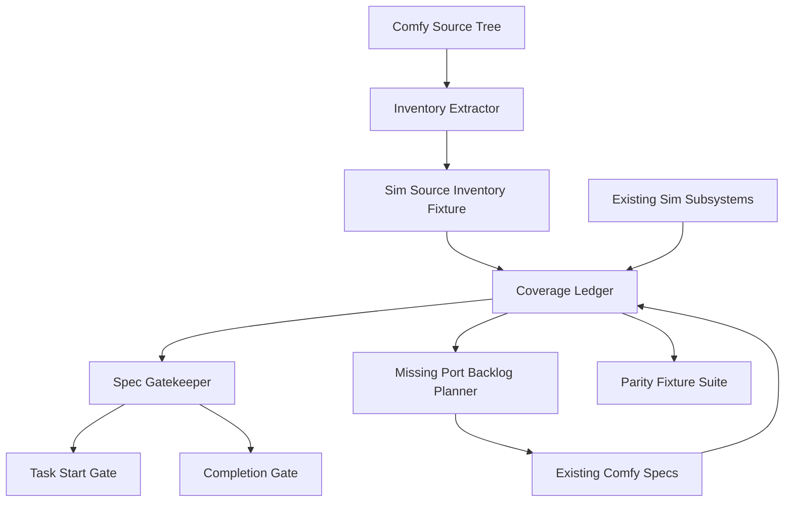

# Design: Comfy Full Port Coverage

## Overview

The existing Comfy specs describe how Sim recreates broad Comfy behavior. This design adds a coverage and anti-duplication layer around those specs. The layer turns the real Comfy source tree into a structured inventory, maps each inventory item to one owning Sim spec or subsystem, and fails migration gates when source functionality is unowned, multiply owned, unsupported without a reason, or implemented through hidden ComfyUI pass-through.

The key design decision is to make coverage data declarative and testable. The inventory and ledger live as fixtures under `crates/world_model/fixtures/comfy/` and are validated by `crates/sim_game` gatekeeper tests. This keeps source attribution close to existing Comfy fixtures while using the existing migration gatekeeper instead of adding a new orchestration crate.

## Architecture

The inventory extractor reads source paths and static metadata from the external Comfy checkout. The coverage ledger is committed in the Sim repository and maps inventory categories to owners. Gatekeeper validation consumes the committed fixtures; it does not require the external Comfy checkout during normal CI unless an explicit inventory-refresh task runs.

## Components and Interfaces

### SimSourceInventoryExtractor

**Purpose:** Build a reproducible snapshot of Comfy source functionality without importing torch, starting ComfyUI, downloading models, or calling provider APIs.

**Responsibilities:**

- Scan known source roots: `server.py`, `nodes.py`, `comfy_execution/`, `comfy/`, `comfy_extras/`, `comfy_api_nodes/`, `app/`, `api_server/`, `blueprints/`, `custom_nodes/`, OpenAPI, CLI/config, tests, and CI.
- Parse Python AST for route decorators, `NODE_CLASS_MAPPINGS`, V3 `ComfyExtension` schema declarations, CLI argument definitions, and class/category metadata.
- Read blueprint filenames and OpenAPI operation IDs as data.
- Emit diagnostics for unparsed files and unsupported AST patterns.

**Interface contract:**

- `extract(root: Path) -> SimSourceInventory`
- `diff(previous: SimSourceInventory, next: SimSourceInventory) -> SimInventoryDiff`

**Dependencies:** Standard filesystem reads, Python AST parsing in tooling or equivalent Rust parser logic, existing fixture attribution helpers.

**Rationale:** Static extraction avoids dependency churn and keeps inventory updates reviewable.

### SimCoverageLedger

**Purpose:** Map every source inventory item to exactly one owner and a clear status.

**Responsibilities:**

- Store coverage records with `source_id`, `source_path`, `source_kind`, `owner`, `status`, `boundary_decision`, `fixture_refs`, and `diagnostic_code`.
- Enforce the ten existing Comfy specs as allowed owners.
- Support existing-Sim owners where behavior is already covered by platform, UI, media, task, secret, storage, artifact, project, or agent systems.
- Represent unsupported and divergent behavior explicitly.

**Interface contract:**

- `owner_for(source_id) -> Option<SimCoverageOwner>`
- `records_by_owner(owner) -> Vec<SimCoverageRecord>`
- `validate(inventory, specs) -> Vec<SimCoverageDiagnostic>`

**Dependencies:** `.agents/specs/godot-migration/**`, existing `sim_game` inventory and spec gatekeeper modules, Comfy compatibility fixtures.

**Rationale:** Single ownership is the main anti-duplication mechanism.

### CoverageOwnerResolver

**Purpose:** Apply default owner rules before humans refine the ledger.

**Responsibilities:**

- Route runtime/API/server features to `comfy-runtime-control-plane`.
- Route graph/core node/object-info/execution-plan features to `comfy-graph-node-runtime`.
- Route model folder, metadata, family, precision, quantization, device, and memory features to `comfy-model-memory-runtime`.
- Route sampler, scheduler, conditioning, latent/VAE, model patch, and model execution features to `comfy-diffusion-world-model-runtime`.
- Route assets/user-data/settings/enrichment to `comfy-asset-library`.
- Route blueprints/workflows/templates/subgraphs/node replacements/app-mode metadata to `comfy-workflows-blueprints`.
- Route media-processing nodes to `comfy-media-node-pipelines`.
- Route partner/API provider nodes to `comfy-api-provider-nodes`.
- Route custom nodes/extensions/manager/i18n/web assets to `comfy-extension-ecosystem`.
- Route CLI/OpenAPI/examples/tests/logs/packaging to `comfy-packaging-quality`.

**Interface contract:**

- `suggest_owner(item: SimSourceItem) -> OwnerSuggestion`
- `explain(item, suggestion) -> String`

**Dependencies:** Static route tables and existing spec names.

**Rationale:** Owner suggestions make coverage updates practical while still requiring review.

### SimSpecGatekeeperExtension

**Purpose:** Extend the existing migration gatekeeper so Comfy parity cannot regress.

**Responsibilities:**

- Validate that every inventory item has one owner.
- Validate that every implemented item has fixture/test/equivalence evidence.
- Validate that every unsupported/divergent item has a boundary reason.
- Validate that implementation tasks touching Comfy-derived writes reference the owner spec.
- Report duplicate owner claims with both paths.

**Interface contract:**

- `validate_sim_coverage(inventory, ledger, specs, tasks) -> GateReport`
- `validate_task_start(task, ledger) -> GateReport`
- `validate_task_completion(task, ledger, changed_files) -> GateReport`

**Dependencies:** `crates/sim_game/src/spec_gatekeeper.rs`, `crates/sim_game/src/inventory.rs`, existing task manifests.

**Rationale:** The repository already has gatekeeper concepts; extending them avoids a duplicate planning validator.

### MissingPortBacklogPlanner

**Purpose:** Convert uncovered coverage records into implementation tasks owned by the appropriate domain spec.

**Responsibilities:**

- Find coverage records with `Planned`, product-approved `Unsupported`, `Divergent`, or `Implemented` without sufficient evidence.
- Group missing records by coverage owner and capability family.
- Update the owning spec task manifest with concrete implementation tasks that include coverage IDs, expected writes, validation commands, and parity evidence requirements.
- Keep foundation tasks and feature tasks under the same owner when missing functionality needs shared infrastructure first.
- Prevent the coverage spec from becoming the implementation owner unless the missing behavior is coverage infrastructure itself.

**Interface contract:**

- `missing_records(ledger) -> Vec<SimCoverageRecord>`
- `group_by_owner(records) -> Vec<MissingPortGroup>`
- `render_owner_tasks(group, owner_spec) -> Vec<SpecTask>`
- `validate_owner_backlog(ledger, owner_specs) -> Vec<SimCoverageDiagnostic>`

**Dependencies:** `SimCoverageLedger`, existing Comfy owner specs, task manifests, and spec gatekeeper validation.

**Rationale:** The coverage ledger identifies missing functionality, but domain specs own the code. A backlog planner makes that handoff explicit and reviewable.

### ParityFixtureManager

**Purpose:** Keep parity fixtures attributable, safe, and useful.

**Responsibilities:**

- Link coverage records to fixtures under `crates/world_model/fixtures/comfy/`.
- Ensure fixtures derived from Comfy source mark `native_sim_records` and `comfyui_passthrough`.
- Reject fixtures that imply model downloads, API calls, or unreviewed native dependencies.
- Preserve source paths and capture metadata.

**Interface contract:**

- `fixture_refs_for(source_id) -> Vec<FixtureRef>`
- `validate_fixture(ref, coverage_record) -> Vec<FixtureDiagnostic>`

**Dependencies:** Existing Comfy fixtures and dependency-review records.

**Rationale:** Fixtures are the bridge between broad source inventory and concrete Sim behavior.

## Data Models

### SimSourceInventory

- `schema_version`: fixture schema version.
- `source_root`: absolute or repository-relative Comfy source root.
- `captured_at`: capture date or version marker.
- `summary`: counts by source kind.
- `items`: ordered list of `SimSourceItem`.
- `diagnostics`: extraction diagnostics.

### SimSourceItem

- `source_id`: stable ID derived from source kind and path/name.
- `source_kind`: `Route`, `WebSocketProtocol`, `CoreNode`, `ExtraNode`, `ApiProviderNode`, `ModelFamily`, `ModelFolder`, `Blueprint`, `AssetApi`, `ExtensionHook`, `CliFlag`, `OpenApiOperation`, `TestSurface`, `PackagingSurface`, `FrontendSurface`, `Unknown`.
- `source_path`: original path in `projects/comfy`.
- `symbol`: route path, node ID, class name, model family, operation ID, or blueprint name.
- `category`: Comfy category when available.
- `metadata`: JSON object for extracted details.
- `extraction_status`: `Classified`, `Unclassified`, or `Failed`.

### SimCoverageRecord

- `source_id`: links to `SimSourceItem`.
- `owner`: `ExistingSimSubsystem`, `RuntimeControlPlane`, `GraphNodeRuntime`, `ModelMemoryRuntime`, `DiffusionWorldModelRuntime`, `AssetLibrary`, `WorkflowsBlueprints`, `MediaNodePipelines`, `ApiProviderNodes`, `ExtensionEcosystem`, `PackagingQuality`.
- `owner_path`: spec path or module path.
- `status`: `Implemented`, `Planned`, `Delegated`, `Unsupported`, `Divergent`.
- `boundary_decision`: reason for delegated, unsupported, or divergent statuses.
- `evidence`: tests, fixtures, modules, or existing-Sim equivalence references.
- `dependency_gate`: optional G7/dependency-review reference.

### SimCoverageDiagnostic

- `code`: stable diagnostic code.
- `source_id`: optional source item.
- `owner`: optional owner.
- `message`: user-facing gate explanation.
- `severity`: `Error`, `Warning`, or `Info`.

### MissingPortGroup

- `owner`: coverage owner that must receive the implementation task.
- `source_ids`: coverage records included in the group.
- `capability_family`: runtime, graph, model, diffusion, asset, workflow, media, provider, extension, or packaging.
- `required_foundation`: optional prerequisite task when no native Sim foundation exists yet.
- `expected_writes`: owner-spec task files, Sim modules, tests, and fixtures expected to change.
- `validation`: command or fixture check required before the group can be marked implemented.
- `evidence_policy`: fixture, test, or existing-Sim equivalence reference needed for ledger completion.

## Correctness Properties

### Property 1: Inventory Completeness

_For any_ supported Comfy source root and extraction run, the inventory SHALL include all configured source kinds or emit an extraction diagnostic for each unclassified source path.

**Validates: Requirement 1.1, 1.2, 1.3, 1.4**

### Property 2: Single Owner

_For any_ `SimSourceItem`, the coverage ledger SHALL resolve exactly one coverage owner before implementation work can start.

**Validates: Requirement 2.1, 2.3, 4.1-4.10**

### Property 3: Existing Sim Delegation

_For any_ Comfy feature that overlaps an existing Sim subsystem, the coverage ledger SHALL mark that subsystem as owner and prevent a parallel Comfy-derived runtime owner unless a documented extension relationship exists.

**Validates: Requirement 2.2, 2.4**

### Property 4: Native Recreation

_For any_ supported Comfy behavior marked implemented, the evidence SHALL reference native Sim records, services, workers, artifacts, diagnostics, or tests and SHALL NOT rely on ComfyUI pass-through.

**Validates: Requirement 3.1, 3.4, 6.3**

### Property 5: Divergence Accountability

_For any_ unsupported or divergent coverage record, the ledger SHALL include a boundary reason, owner, and diagnostic or fallback reference.

**Validates: Requirement 3.2, 3.3, 6.4**

### Property 6: Gap Detection

_For any_ inventory item added by a source refresh, the coverage gate SHALL fail until the item has an owner, status, source path, and boundary decision.

**Validates: Requirement 5.1, 5.2, 5.3**

### Property 7: Evidence for Implemented Coverage

_For any_ coverage item marked implemented, the coverage gate SHALL require fixture, test, code module, or existing-Sim equivalence evidence.

**Validates: Requirement 5.4, 6.1**

### Property 8: Safe Fixtures

_For any_ parity fixture derived from Comfy source behavior, the fixture SHALL preserve source attribution and avoid downloads, provider calls, and unreviewed dependencies unless a dependency gate is recorded.

**Validates: Requirement 6.1, 6.2, 6.3**

### Property 9: Task Gate Alignment

_For any_ implementation task touching Comfy-derived behavior, the start and completion gates SHALL validate owner, wave, expected writes, and coverage status updates.

**Validates: Requirement 7.1, 7.2, 7.3, 7.4**

### Property 10: Value-First Ordering

_For any_ uncovered Comfy functionality, prioritization SHALL rank local world-model authoring and execution parity ahead of provider, extension, packaging, or legacy hardening unless a recorded gate requires the exception.

**Validates: Requirement 8.1, 8.2, 8.3**

### Property 11: Missing Port Backlog Completeness

_For any_ coverage record that is planned, product-approved unsupported, divergent, or missing implementation evidence, the backlog planner SHALL create or validate an owner-specific implementation task with coverage IDs, expected writes, validation, and parity evidence.

**Validates: Requirement 9.1, 9.2, 9.3, 9.4**

## Error Handling

- Inventory extraction errors produce `Unclassified` or `Failed` source items instead of dropping paths.
- Missing owners produce hard gate errors with source path and suggested owner.
- Duplicate owners produce hard gate errors listing every owner/spec path.
- Implemented records without evidence produce hard gate errors.
- Unsupported records without user-visible reasons produce hard gate errors.
- Missing records without owner-specific implementation tasks produce hard gate errors once their owner wave is active.
- Owner-specific implementation tasks without coverage IDs, expected writes, validation, or parity evidence produce task-manifest errors.
- Fixture records requiring network, provider credentials, model downloads, or unreviewed dependencies produce dependency-review errors.
- Source inventory diffs are warnings until a task claims implementation, then become start-gate errors.

## Testing Strategy

- Unit-test static extraction for representative route decorators, old node mappings, V3 `ComfyExtension` schema nodes, CLI flags, OpenAPI operation IDs, and blueprint filenames.
- Unit-test owner suggestion rules for every existing Comfy spec.
- Gatekeeper tests for missing owner, duplicate owners, unsupported without reason, implemented without evidence, and ComfyUI pass-through fixtures.
- Fixture tests that validate `native_sim_records`, `comfyui_passthrough`, source attribution, and dependency-review metadata.
- Backlog planner tests that validate planned, divergent, unsupported, and evidence-missing records generate owner-specific implementation tasks.
- Regression tests using a committed inventory snapshot so CI catches accidental coverage loss without needing the external Comfy checkout.
