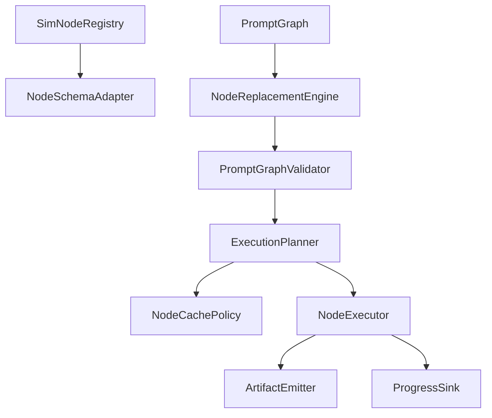

# Design: Comfy Graph and Node Runtime

## Overview

The runtime models Comfy node scheduling as a typed graph service inside `crates/world_model`. It is the graph semantics foundation for the world-model harness, supports Comfy schema introspection and execution planning, and leaves graph canvas UX to `diffusion-graph-editor/`. Actual sampler, scheduler, conditioning, latent/VAE, model patch, diffusion, and world-model execution semantics belong to `comfy-diffusion-world-model-runtime/`.

## Architecture



## Components and Interfaces

### SimNodeRegistry

- **Purpose**: Store enabled node classes and expose stable introspection.
- **Responsibilities**: Register core, extra, provider, and extension nodes; preserve display metadata; enforce disabled-node policy.
- **Interface contract**:

```rust
pub trait SimNodeRegistry {
    fn register(&mut self, node: NodeDefinition) -> Result<(), NodeRegistryError>;
    fn get(&self, node_id: &NodeTypeId) -> Option<&NodeDefinition>;
    fn object_info(&self, node_id: Option<&NodeTypeId>) -> ObjectInfoResponse;
}
```

### NodeSchemaAdapter

- **Purpose**: Convert Comfy node input/output declarations into Sim graph schemas.
- **Responsibilities**: Normalize required, optional, hidden, lazy, list, combo, and primitive inputs; preserve descriptions and display names.

### NodeReplacementEngine

- **Purpose**: Replace missing old node ids with registered new node ids.
- **Responsibilities**: Apply input and output mapping, preserve graph links, and skip invalid replacement targets.

### PromptGraphValidator

- **Purpose**: Reject invalid prompt graphs before enqueue.
- **Responsibilities**: Validate node existence, input values, link targets, port indexes, cycles, and partial execution targets.

### ExecutionPlanner

- **Purpose**: Produce dependency-ordered execution plans.
- **Responsibilities**: Calculate dependency closures, cache keys, dirty nodes, and output targets.

### NodeExecutor

- **Purpose**: Dispatch validated nodes and merge outputs.
- **Responsibilities**: Handle sync, async, list-mapped, blocked, interrupted, failed, and cached node states; dispatch model-execution nodes to `comfy-diffusion-world-model-runtime/`.

## Data Models

```rust
pub struct NodeDefinition {
    pub id: NodeTypeId,
    pub display_name: String,
    pub category: String,
    pub inputs: Vec<NodeInputDefinition>,
    pub outputs: Vec<NodeOutputDefinition>,
    pub source: NodeSource,
    pub api_node: bool,
    pub search_aliases: Vec<String>,
    pub tooltip: Option<String>,
}

pub struct ObjectInfoResponse {
    pub nodes: BTreeMap<NodeTypeId, ObjectInfoNode>,
}

pub struct SimNodeInputSchema {
    pub name: InputId,
    pub data_type: DataType,
    pub required: bool,
    pub hidden: bool,
    pub lazy: bool,
    pub list: bool,
    pub combo_values: Vec<String>,
    pub tooltip: Option<String>,
}

pub struct NodeReplacementRule {
    pub from_node_type: NodeTypeId,
    pub to_node_type: NodeTypeId,
    pub input_mappings: BTreeMap<InputId, InputId>,
    pub output_mappings: BTreeMap<OutputId, OutputId>,
}

pub struct SimValidationCapabilities {
    pub providers: BTreeSet<String>,
    pub model_folders: BTreeSet<String>,
    pub asset_capabilities: BTreeSet<String>,
}

pub struct ExecutionPlan {
    pub target_nodes: Vec<NodeId>,
    pub dependency_closure: Vec<NodeId>,
    pub execution_order: Vec<NodeId>,
    pub reusable_nodes: Vec<NodeId>,
    pub dirty_nodes: Vec<NodeId>,
}

pub struct SimNodeExecutionRecord {
    pub node_id: NodeId,
    pub node_type: NodeTypeId,
    pub state: SimNodeExecutionState,
    pub ui_outputs: Vec<UiOutputRecord>,
    pub provenance: Vec<String>,
    pub dispatch: Option<SimExecutorDispatch>,
}

pub struct PromptNode {
    pub id: NodeId,
    pub class_type: NodeTypeId,
    pub inputs: BTreeMap<InputId, InputValue>,
    pub metadata: BTreeMap<String, String>,
}

pub enum CachePolicy {
    RamPressure { active_gb: f64, inactive_gb: f64 },
    Classic,
    Lru { max_entries: usize },
    None,
}
```

The node registry is a native Sim registry. It stores core, extra, API-provider,
and custom node definitions as typed records, filters disabled nodes from
object-info responses, and returns deterministic availability diagnostics for
unknown or disabled node classes. It does not proxy object-info lookup to
ComfyUI.

The schema adapter is native Sim normalization. It converts required, optional,
hidden, primitive, combo, list, and lazy Comfy declarations into typed Sim graph
schema inputs with deterministic diagnostics for unsupported types or invalid
combo declarations, then reuses native node outputs from the registry.

The node replacement engine is a native Sim graph rewrite pass. It applies
validated old-to-new node type mappings only when a node type is missing from
the enabled Sim registry, rewrites input and output port names on graph nodes
and links, preserves literal input metadata under the new Sim input names, and
leaves invalid replacement targets untouched with deterministic diagnostics for
later validation.

The prompt graph validator is native Sim graph validation. It validates node
availability through the enabled Sim registry, required inputs satisfied by
links or literal Sim metadata, linked port existence, link type compatibility,
cycles, duplicate links, partial execution targets, and provider/model/asset
capability gates without passing prompt validation through ComfyUI.

The execution planner and cache policy are native Sim graph scheduling records.
The planner computes target dependency closures, deterministic dependency-first
execution order, reusable cached nodes, and dirty nodes from Sim graph edges.
Cache policy models classic reuse, LRU limits, RAM-pressure limits, and disabled
cache semantics from Sim cache snapshots and deterministic node cache keys
without relying on ComfyUI execution state.

The node executor adapter is a native Sim execution coordinator. It consumes
execution plans, records cached, completed, async-pending, list-mapped, blocked,
interrupted, failed, and skipped node states, preserves UI outputs and
provenance, stops dependents when upstream nodes cannot complete, and emits
explicit dispatch records for sampler, conditioning, VAE, latent, model patch,
diffusion, or world-model node types owned by
`comfy-diffusion-world-model-runtime/`.

Core node compatibility fixtures are native Sim fixture contracts. They snapshot
object-info coverage for core node categories and run representative prompt
graphs through Sim registry lookup, graph validation, execution planning, and
executor dispatch with mock native outcomes. They are not ComfyUI proxy tests.

## Correctness Properties

### Property 1: No Unknown Node Execution

_For any_ prompt graph, if a node id is missing after replacement mappings are applied, the system SHALL reject the graph before execution.

**Validates: Requirement 2.1, 2.2, 2.3**

### Property 2: Replacement Link Preservation

_For any_ replacement mapping applied before validation, every rewritten edge
SHALL preserve its original source and target node identities while translating
only mapped input or output port names.

**Validates: Requirement 2.3**

### Property 3: Topological Execution

_For any_ valid prompt graph, the execution plan SHALL order every executed node after its linked dependencies.

**Validates: Requirement 2.1, 3.2**

### Property 4: Cache Policy Fidelity

_For any_ node output, if the selected cache policy determines the output is reusable, the executor SHALL use the cached value; if cache policy is none, it SHALL not reuse previous node outputs.

**Validates: Requirement 3.1, 3.3**

### Property 5: Partial Target Closure

_For any_ partial execution target set, the execution plan SHALL include exactly the valid targets and their required dependency closure, except nodes reused from cache.

**Validates: Requirement 3.2**

### Property 6: Cancellation Propagation

_For any_ async or long-running node, when the parent job is cancelled, the node executor SHALL stop or mark the node interrupted and propagate that state to dependent nodes.

**Validates: Requirement 4.3**

### Property 7: Model Execution Delegation

_For any_ node that requires sampler, scheduler, conditioning, VAE, latent, model patch, diffusion, or world-model execution semantics, the graph runtime SHALL dispatch to `comfy-diffusion-world-model-runtime/` rather than implementing those semantics in the graph scheduler.

**Validates: Requirement 5.4**

## Error Handling

- Registry conflicts return deterministic duplicate-node errors.
- Schema conversion failures mark the node unavailable and expose import diagnostics.
- Validation failures return per-node errors and do not enqueue jobs.
- Execution blockers stop dependent nodes and preserve upstream outputs.
- Node exceptions produce failed job status with node id, exception class, and safe diagnostic text.
- Cache deserialization failures invalidate the cache entry and rerun the node when allowed.

## Testing Strategy

- Unit tests for schema adaptation, node replacement, link validation, cycle detection, cache key generation, and partial execution closure.
- Integration tests for prompt validation through queue submission and object info retrieval.
- Compatibility fixtures for core Comfy nodes: sampler, loaders, CLIP text encode, VAE encode/decode, image save/load, latent operations, LoRA, ControlNet, GLIGEN, and inpaint conditioning. Fixture approval requires native Sim object-info records, prompt validation, execution planning, and executor dispatch assertions rather than ComfyUI pass-through.
- Property tests for topological ordering and replacement link preservation.
