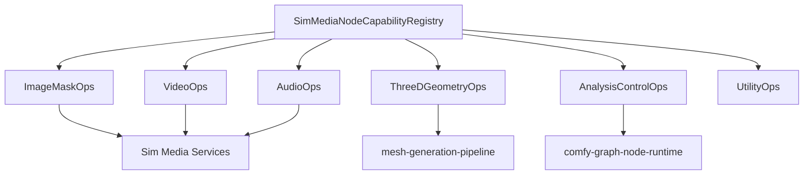

# Design: Comfy Media Node Pipelines

## Overview

Media node support is organized as harness capability groups rather than one-off ports of every Python file. Each group maps Comfy node IDs to Sim media, artifact, model, and graph interfaces. This avoids duplicating preview, mesh, codec, and graph-editor infrastructure while preserving node-level workflow compatibility.

## Architecture



## Components and Interfaces

### SimMediaNodeCapabilityRegistry

- **Purpose**: Map Comfy media nodes to Sim capability groups and backend requirements.
- **Responsibilities**: Capability metadata, unsupported diagnostics, dependency review flags, developer-only flags, and node schema linkage.
- **Native behavior**: Stores Comfy node IDs as compatibility input
  identifiers, but maps them to native `SimMedia*` capability records,
  typed ports, backend diagnostics, and `sim.*` handler ownership. The
  registry must not mark support by forwarding execution to ComfyUI.

### ImageMaskOps

- **Purpose**: Implement deterministic image, mask, post-processing, and GLSL-backed operations.
- **Responsibilities**: Tensor/bitmap conversion, metadata preservation, alpha handling, batch shapes, and safe file outputs.
- **Native behavior**: Uses `SimImage*` and `SimMask*` adapters to preserve
  image/mask shapes, batches, metadata, save formats, GLSL dependency metadata,
  and validation diagnostics. Comfy node IDs are accepted as compatibility
  inputs through the capability registry, but transforms are represented as
  native Sim media operations.

### VideoOps

- **Purpose**: Implement video load/save/create/slice and route advanced video processing to approved backends.
- **Responsibilities**: Frame extraction, frame ranges, MIME metadata, audio association, and codec diagnostics.
- **Native behavior**: Uses `SimVideo*` adapters to preserve frame count,
  frame rate, MIME type, audio references, frame ranges, and output references.
  Advanced processing surfaces native Sim backend diagnostics for dependency
  review or unsupported backend state before execution.

### AudioOps

- **Purpose**: Implement audio load/save/preview/edit nodes and audio latent validation.
- **Responsibilities**: Sample rate, channels, duration, codec selection, and VAE/model compatibility checks.
- **Native behavior**: Uses `SimAudio*` adapters to preserve sample rate,
  channel count, duration, MIME type, sample ranges, output references, volume
  and equalization metadata, and audio latent capability diagnostics. Codec
  support is represented as native Sim backend status, including dependency
  review and unsupported diagnostics, rather than forwarding audio work to
  ComfyUI.

### ThreeDGeometryOps

- **Purpose**: Bridge 3D, geometry, point cloud, and Gaussian splat nodes to Sim 3D artifacts.
- **Responsibilities**: Artifact registration, preview metadata, mesh delegation, and format diagnostics.
- **Native behavior**: Uses `SimThreeD*` adapters to register mesh, point
  cloud, Gaussian splat, depth, normal, camera, and point-map artifacts with
  provenance and preview metadata. Textured mesh exports produce
  `SimMeshPipelineDelegation` records backed by `MeshArtifactMetadata`, so mesh
  lifecycle stays owned by `mesh-generation-pipeline/` rather than a Comfy
  adapter store.

### AnalysisControlOps

- **Purpose**: Expose detection, segmentation, depth, pose, flow, and tracking outputs as typed control signals.
- **Responsibilities**: Port types, backend capability checks, and downstream compatibility validation.
- **Native behavior**: Uses `SimControlSignal*` adapters to preserve typed
  outputs for canny, pose, keypoints, bounding boxes, face landmarks,
  segmentation, detection, depth, geometry, optical flow, camera trajectory,
  and tracking. Downstream graph checks validate `SimControlTargetKind`
  compatibility before execution, and backend gaps surface native Sim
  diagnostics for unsupported or dependency-review-required analysis engines.

### UtilityOps

- **Purpose**: Implement deterministic utility and dataset support for media pipelines.
- **Responsibilities**: String, regex, JSON, math, primitive, logic, seed,
  switch, dataset shuffle, dedupe, bucket, and training-data preparation.
- **Native behavior**: Uses `SimUtility*` and `SimDataset*` adapters for
  deterministic primitive, regex, JSON, math, logic, seed, and switch behavior.
  Dataset entries are normalized through Sim user-data path confinement,
  preserve source attribution, and use deterministic ordering for seeded
  shuffles rather than forwarding dataset work to ComfyUI.

## Data Models

```rust
pub enum SimMediaCapabilityGroup {
    ImageMask,
    Video,
    Audio,
    ThreeDGeometry,
    AnalysisControl,
    Utility,
}

pub struct SimMediaNodeCapability {
    pub node_id: NodeTypeId,
    pub group: SimMediaCapabilityGroup,
    pub inputs: Vec<SimMediaPortType>,
    pub outputs: Vec<SimMediaPortType>,
    pub backend: SimMediaBackendRequirement,
    pub native_sim_handler: String,
    pub developer_only: bool,
}

pub struct SimImageArtifact {
    pub shape: SimImageShape,
    pub metadata: BTreeMap<String, String>,
    pub glsl_dependencies: Vec<SimGlslDependency>,
}

pub struct SimMaskArtifact {
    pub shape: SimMaskShape,
    pub inverted: bool,
    pub feather_radius: u32,
}

pub struct SimVideoArtifact {
    pub reference: String,
    pub metadata: SimVideoMetadata,
}

pub struct SimAudioArtifact {
    pub reference: String,
    pub metadata: SimAudioMetadata,
}

pub struct SimThreeDArtifact {
    pub reference: String,
    pub kind: SimThreeDArtifactKind,
    pub metadata: SimThreeDMetadata,
}

pub struct SimControlSignalArtifact {
    pub reference: String,
    pub kind: SimControlSignalKind,
    pub port_type: SimMediaPortType,
    pub metadata: SimControlSignalMetadata,
}

pub struct SimDatasetEntry {
    pub source_path: PathBuf,
    pub source_reference: String,
    pub text: Option<String>,
    pub bucket: Option<String>,
    pub attribution: BTreeMap<String, String>,
}
```

## Correctness Properties

### Property 1: Media Shape Preservation

_For any_ image, mask, video, audio, latent, or 3D operation, the output shape and metadata SHALL match the declared Comfy node schema or the node SHALL fail with a structured diagnostic.

**Validates: Requirement 1.1, 1.2, 2.1, 3.1, 4.1**

### Property 2: Dependency Review Before Native Backends

_For any_ media node requiring new codecs, native libraries, or heavy model dependencies, the system SHALL block implementation or execution until dependency review is recorded.

**Validates: Requirement 2.3, 3.3**

### Property 3: Mesh Lifecycle Delegation

_For any_ node that creates textured meshes or game-ready mesh exports, the system SHALL use `mesh-generation-pipeline/` artifact lifecycle instead of a parallel mesh store.

**Validates: Requirement 4.3**

### Property 4: Typed Control Compatibility

_For any_ analysis output connected to a generation control input, graph validation SHALL require compatible control signal types.

**Validates: Requirement 5.1, 5.2**

### Property 5: Filesystem Confinement

_For any_ dataset or media file operation, paths SHALL be confined to approved project, user, input, output, temp, or asset roots.

**Validates: Requirement 6.2**

## Error Handling

- Unsupported media node returns node id, capability group, missing backend, and suggested fallback.
- Codec failures include MIME type, file extension, and backend diagnostic.
- Shape mismatches fail node execution before downstream nodes run.
- Developer-only nodes are omitted unless developer mode is active.
- Dataset path escape attempts fail validation and do not read or write files.

## Testing Strategy

- Snapshot coverage for node capability groups from `projects/comfy/comfy_extras/nodes_*.py`.
- Unit tests for image/mask deterministic operations and media metadata preservation.
- Integration tests for video, audio, and 3D artifact registration with preview metadata.
- Graph validation tests for analysis/control signal type compatibility.
- Dependency review tests for nodes requiring new codecs or native backends.
