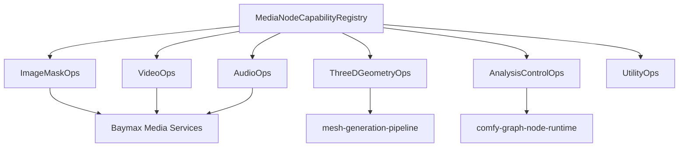

# Design: Comfy Media Node Pipelines

## Overview

Media node support is organized as harness capability groups rather than one-off ports of every Python file. Each group maps Comfy node IDs to Baymax media, artifact, model, and graph interfaces. This avoids duplicating preview, mesh, codec, and graph-editor infrastructure while preserving node-level workflow compatibility.

## Architecture



## Components and Interfaces

### MediaNodeCapabilityRegistry

- **Purpose**: Map Comfy media nodes to Baymax capability groups and backend requirements.
- **Responsibilities**: Capability metadata, unsupported diagnostics, dependency review flags, developer-only flags, and node schema linkage.

### ImageMaskOps

- **Purpose**: Implement deterministic image, mask, post-processing, and GLSL-backed operations.
- **Responsibilities**: Tensor/bitmap conversion, metadata preservation, alpha handling, batch shapes, and safe file outputs.

### VideoOps

- **Purpose**: Implement video load/save/create/slice and route advanced video processing to approved backends.
- **Responsibilities**: Frame extraction, frame ranges, MIME metadata, audio association, and codec diagnostics.

### AudioOps

- **Purpose**: Implement audio load/save/preview/edit nodes and audio latent validation.
- **Responsibilities**: Sample rate, channels, duration, codec selection, and VAE/model compatibility checks.

### ThreeDGeometryOps

- **Purpose**: Bridge 3D, geometry, point cloud, and Gaussian splat nodes to Baymax 3D artifacts.
- **Responsibilities**: Artifact registration, preview metadata, mesh delegation, and format diagnostics.

### AnalysisControlOps

- **Purpose**: Expose detection, segmentation, depth, pose, flow, and tracking outputs as typed control signals.
- **Responsibilities**: Port types, backend capability checks, and downstream compatibility validation.

## Data Models

```rust
pub enum MediaCapabilityGroup {
    ImageMask,
    Video,
    Audio,
    ThreeDGeometry,
    AnalysisControl,
    Utility,
}

pub struct MediaNodeCapability {
    pub node_id: NodeTypeId,
    pub group: MediaCapabilityGroup,
    pub inputs: Vec<MediaPortType>,
    pub outputs: Vec<MediaPortType>,
    pub backend: MediaBackendRequirement,
    pub developer_only: bool,
}
```

## Correctness Properties

### Property 1: Media Shape Preservation

_For any_ image, mask, video, audio, latent, or 3D operation, the output shape and metadata SHALL match the declared Comfy node schema or the node SHALL fail with a structured diagnostic.

**Validates: Requirement 1.1, 1.2, 2.1, 3.1, 4.1**

### Property 2: Dependency Review Before Native Backends

_For any_ media node requiring new codecs, native libraries, or heavy model dependencies, the system SHALL block implementation or execution until dependency review is recorded.

**Validates: Requirement 2.3, 3.3**

### Property 3: Mesh Lifecycle Delegation

_For any_ node that creates textured meshes or game-ready mesh exports, the system SHALL use `mesh-generation-pipeline/` artifact lifecycle instead of a parallel mesh store.

**Validates: Requirement 4.3**

### Property 4: Typed Control Compatibility

_For any_ analysis output connected to a generation control input, graph validation SHALL require compatible control signal types.

**Validates: Requirement 5.1, 5.2**

### Property 5: Filesystem Confinement

_For any_ dataset or media file operation, paths SHALL be confined to approved project, user, input, output, temp, or asset roots.

**Validates: Requirement 6.2**

## Error Handling

- Unsupported media node returns node id, capability group, missing backend, and suggested fallback.
- Codec failures include MIME type, file extension, and backend diagnostic.
- Shape mismatches fail node execution before downstream nodes run.
- Developer-only nodes are omitted unless developer mode is active.
- Dataset path escape attempts fail validation and do not read or write files.

## Testing Strategy

- Snapshot coverage for node capability groups from `projects/comfy/comfy_extras/nodes_*.py`.
- Unit tests for image/mask deterministic operations and media metadata preservation.
- Integration tests for video, audio, and 3D artifact registration with preview metadata.
- Graph validation tests for analysis/control signal type compatibility.
- Dependency review tests for nodes requiring new codecs or native backends.
