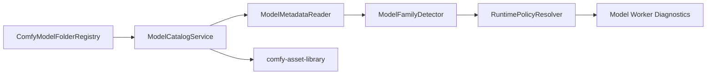

# Design: Comfy Model and Memory Runtime

## Overview

The model runtime is a core harness policy layer around Sim model and worker services. It preserves Comfy folder names and model-family concepts while reusing Sim asset indexing, worker diagnostics, and artifact provenance. The model runtime does not own Python environment creation, remote worker launch, sampler/scheduler behavior, or model-family execution semantics; it supplies the model policy and diagnostics consumed by `model-serving-packaging/` and `comfy-diffusion-world-model-runtime/`.

## Architecture



## Components and Interfaces

### ComfyModelFolderRegistry

- **Purpose**: Provide Comfy-compatible model category names and folder roots.
- **Responsibilities**: Register default folders, merge extra path configs, map legacy folder names, and expose folder roots.

```rust
pub trait ComfyModelFolderRegistry {
    fn folders(&self) -> Vec<ModelFolderInfo>;
    fn resolve(&self, category: &ModelCategory, relative_path: &str) -> Result<ModelFileRef, ModelCatalogError>;
    fn add_extra_paths(&mut self, config: ExtraModelPathConfig) -> Result<(), ModelCatalogError>;
}
```

### ModelCatalogService

- **Purpose**: List models and previews safely.
- **Responsibilities**: Recursive visible-file search, cache invalidation by mtime, metadata summary, preview discovery, and safe preview response mapping.

### ModelMetadataReader

- **Purpose**: Read model-adjacent metadata without loading full weights.
- **Responsibilities**: Safetensors header extraction, image preview detection, size/timestamp capture, and content type classification.

### ModelFamilyDetector

- **Purpose**: Detect Comfy-supported model families and capabilities.
- **Responsibilities**: Identify SD, SDXL, SD3, Flux, Wan, Hunyuan, LTXV, audio, 3D, segmentation, depth, and adapter compatibility from metadata or worker probes.

### RuntimePolicyResolver

- **Purpose**: Convert launch/runtime settings into validated precision, device, and memory policy.
- **Responsibilities**: Check incompatible dtype/backend combinations, quantization metadata, dynamic VRAM availability, offload strategy, and explicit download requirements.

## Data Models

```rust
pub struct ModelFolderInfo {
    pub name: ModelCategory,
    pub roots: Vec<PathBuf>,
    pub allowed_extensions: BTreeSet<String>,
}

pub struct ModelFileSummary {
    pub name: String,
    pub path_index: usize,
    pub size_bytes: u64,
    pub created_at_ms: u64,
    pub modified_at_ms: u64,
    pub preview: Option<ModelPreviewRef>,
}

pub struct ModelFamilyProfile {
    pub family: ModelFamilyKind,
    pub capability: ModelFamilyCapability,
    pub adapter_kind: Option<AdapterKind>,
    pub compatible_base_families: BTreeSet<ModelFamilyKind>,
}

pub struct RuntimePolicy {
    pub precision: PrecisionPolicy,
    pub device: DevicePolicy,
    pub memory: MemoryPolicy,
    pub quantization: Option<QuantizationPlan>,
    pub async_offload: bool,
    pub pinned_memory: bool,
    pub mmap_weights: bool,
    pub release_cache_before_load: bool,
}

pub struct QuantizationPlan {
    pub global_format: Option<QuantizationFormat>,
    pub layers: Vec<QuantizedLayerMetadata>,
}

pub struct ModelResourceReleaseReport {
    pub worker_id: String,
    pub results: Vec<ModelResourceIntentResult>,
    pub diagnostics: ServingDiagnosticReport,
}
```

## Correctness Properties

### Property 1: Folder Resolution Is Confined

_For any_ model file lookup, the resolved path SHALL remain inside one of the registered roots for the requested model category.

**Validates: Requirement 1.1, 1.2, 1.3**

### Property 2: Metadata Reads Are Bounded

_For any_ safetensors metadata request, the system SHALL read only the bounded header metadata needed for introspection and SHALL NOT load full weights.

**Validates: Requirement 2.3**

### Property 3: Adapter Compatibility

_For any_ workflow using LoRA, ControlNet, GLIGEN, style, hypernetwork, or model patch inputs, graph validation SHALL reject incompatible base model and adapter combinations before execution.

**Validates: Requirement 3.2**

### Property 4: Policy Compatibility

_For any_ runtime policy, the resolver SHALL reject precision, quantization, device, or memory settings that are unsupported by the selected worker or model family.

**Validates: Requirement 4.1, 4.2, 4.3, 4.4**

### Property 5: Explicit Heavy Setup

_For any_ missing model weight or heavy dependency, the system SHALL require explicit user action before download or install begins.

**Validates: Requirement 5.2**

## Error Handling

- Missing categories return catalog errors with suggested folder names.
- Missing files produce user-safe diagnostics with category and relative path.
- Unsupported model families block execution with missing capability details.
- Incompatible device or precision policies block worker start.
- Quantization metadata parse failures disable quantized execution and report the invalid layer metadata.
- Resource release failures surface native Sim worker diagnostics instead of pretending memory was freed.

## Testing Strategy

- Unit tests for default folder registration, legacy mapping, extra path merge, path confinement, and file listing.
- Metadata tests for safetensors headers and preview image selection.
- Compatibility tests for representative model-family fixtures from `projects/comfy/comfy/supported_models.py`.
- Policy tests for precision/backend combinations and explicit-download gating.
