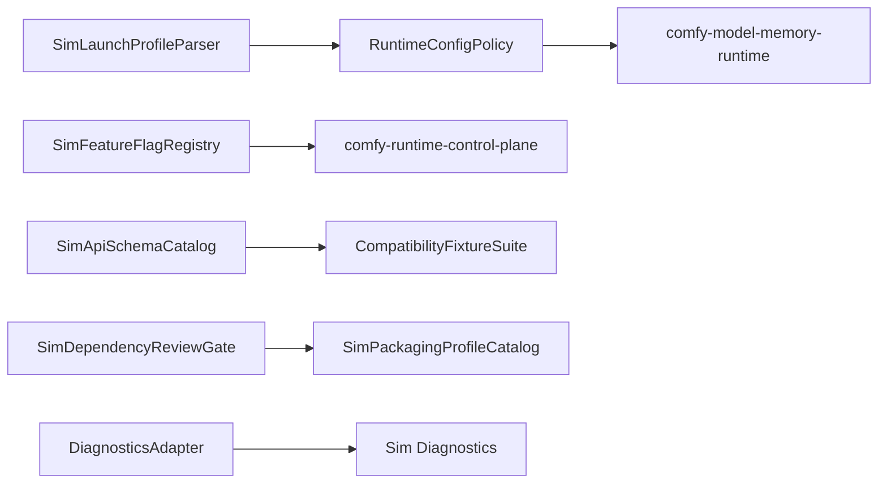

# Design: Comfy Packaging, Configuration, and Quality

## Overview

This spec centralizes migration-wide quality controls so other Comfy specs do not each reinvent configuration parsing, feature flags, schema fixtures, dependency review, test strategy, or platform packaging rules. It protects the core Comfy-derived harness behavior rather than defining a user-facing runtime. Comfy compatibility is an input/output contract only; Sim-owned configuration, diagnostics, and launch profile types use native `Sim*` names and do not pass through to ComfyUI launch code.

## Architecture



## Components and Interfaces

### SimLaunchProfileParser

- **Purpose**: Parse Comfy-compatible launch options into Sim configuration.
- **Responsibilities**: Networking, directories, upload limits, logging, assets, database, API nodes, custom nodes, manager mode, feature flags, memory, precision, device, cache, and performance options.
- **Native behavior**: Accepts Comfy-shaped CLI/config options as input, maps
  supported settings to `SimLaunchProfile` records and `RuntimePolicyRequest`,
  and accumulates diagnostics for invalid or unsupported options instead of
  delegating parsing or validation to ComfyUI.

### SimFeatureFlagRegistry

- **Purpose**: Store server and CLI-provided feature flags and connection-specific client flags.
- **Responsibilities**: Typed coercion, core flag protection, WebSocket negotiation, and response serialization.
- **Native behavior**: Maintains `SimFeatureFlags` for core and CLI-provided
  server features, stores accepted per-client feature sets, and reports
  package diagnostics for missing or outdated frontend, workflow template, and
  embedded docs packages. Comfy-compatible route/event adapters may translate
  these values to compatibility payloads, but they do not own the registry.

### SimApiSchemaCatalog

- **Purpose**: Track implemented, planned, cloud-only, external, and unsupported Comfy/OpenAPI routes.
- **Responsibilities**: Schema coverage, route status, request/response fixtures, and compatibility notes.
- **Native behavior**: Derives implemented route coverage from Sim's native
  Comfy route catalog, records schema references for supported routes, and
  classifies documented non-local routes as planned, cloud-only, external, or
  unsupported with explicit reasons.

### CompatibilityFixtureSuite

- **Purpose**: Provide automated fixtures for migrated Comfy features.
- **Responsibilities**: Script examples, route snapshots, node schema snapshots, blueprint manifest, provider catalogs, asset API tests, and media capability snapshots.
- **Native behavior**: Aggregates fixture coverage that exercises Sim-owned
  runtime, route, node, workflow, asset, and media records. Future provider and
  detailed media fixtures remain explicitly assigned to their owning specs until
  those native Sim features land.

### SimDependencyReviewGate

- **Purpose**: Block unreviewed dependencies and large downloads.
- **Responsibilities**: License, maintenance, security, binary size, platform impact, network requirement, and fallback strategy records.
- **Native behavior**: Evaluates dependency proposals with Sim-owned
  `SimDependencyReview*` records for native libraries, codecs, Python packages,
  provider SDKs, model dependencies, frontend packages, vendored code, network
  access, and large downloads. Compatibility tasks may feed Comfy-derived
  dependency proposals into the gate, but approval and audit state are native
  Sim governance records rather than ComfyUI pass-through labels.

### SimPackagingProfileCatalog

- **Purpose**: Describe supported launch profile presets without owning
  installer or platform packaging logic.
- **Responsibilities**: CPU-only, GPU-specific, API-disabled,
  custom-node-disabled, asset-enabled, portable-like, and remote-worker launch
  profiles.
- **Native behavior**: Emits `SimPackagingProfile*` records that configure
  Sim launch/runtime options and explicitly delegate installer, bundle, and
  platform distribution details to existing Sim packaging systems.

### DiagnosticsAdapter

- **Purpose**: Expose logs and internal diagnostics through Sim diagnostics without making internal endpoints stable public API.

## Data Models

```rust
pub struct SimLaunchProfile {
    pub network: SimNetworkLaunchOptions,
    pub directories: SimDirectoryLaunchOptions,
    pub features: FeatureFlagSet,
    pub runtime_policy: RuntimePolicyInput,
    pub assets: SimAssetLaunchOptions,
    pub extensions: SimExtensionLaunchOptions,
    pub diagnostics: SimDiagnosticLaunchOptions,
}

pub struct SimFeatureFlagRegistry {
    pub core_flags: SimFeatureFlags,
    pub cli_flags: SimFeatureFlags,
    pub client_flags: BTreeMap<String, SimFeatureFlags>,
}

pub struct SimApiSchemaCatalog {
    pub routes: Vec<SimApiSchemaRoute>,
}

pub struct SimDependencyReviewGate {
    pub reviews: BTreeMap<String, SimDependencyReviewRecord>,
    pub audit_records: Vec<SimDependencyAuditRecord>,
}

pub struct SimPackagingProfileCatalog {
    pub profiles: Vec<SimPackagingProfile>,
}

pub enum ComfyRouteSupport {
    Implemented,
    Planned,
    CloudOnly,
    External,
    Unsupported { reason: String },
}
```

## Correctness Properties

### Property 1: Unsupported Option Visibility

_For any_ Comfy launch option supplied to Sim, if no Sim behavior supports it, the parser SHALL report it as unsupported with a reason and nearest equivalent when one exists.

**Validates: Requirement 1.3**

### Property 2: Core Feature Flag Protection

_For any_ CLI-provided feature flag, if it attempts to overwrite a core server flag, the system SHALL ignore the override and preserve the core value.

**Validates: Requirement 2.1**

### Property 3: Schema Status Truthfulness

_For any_ route in the Comfy/OpenAPI compatibility catalog, the status SHALL match an implemented handler, planned task, cloud-only classification, external dependency, or unsupported reason.

**Validates: Requirement 3.1, 3.3**

### Property 4: Fixture Coverage

_For any_ implemented Comfy capability group, the compatibility suite SHALL include at least one automated fixture or snapshot test for that group.

**Validates: Requirement 4.1, 4.2**

### Property 5: Dependency Review Enforcement

_For any_ new native, codec, Python, provider, model, frontend, or vendored dependency, implementation SHALL be blocked until dependency review exists.

**Validates: Requirement 5.1, 5.3**

## Error Handling

- Invalid launch profiles return accumulated option diagnostics rather than failing on the first issue.
- Feature flag coercion errors warn and drop only the invalid flag.
- Missing frontend/template/doc packages produce startup diagnostics with install/update guidance.
- Schema drift fails compatibility tests.
- Diagnostic endpoints fail closed for unapproved roots and internal-only routes.

## Testing Strategy

- Unit tests for option parsing, feature flag coercion, core flag protection, route support status, and dependency gate decisions.
- Snapshot tests for OpenAPI route catalog, script examples, provider catalog, node schema catalog, and blueprint manifest.
- CI checks for spec/task consistency and dependency review references.
- Packaging profile tests for CPU, GPU, API-disabled, custom-node-disabled, asset-enabled, and portable-like launch profiles.
