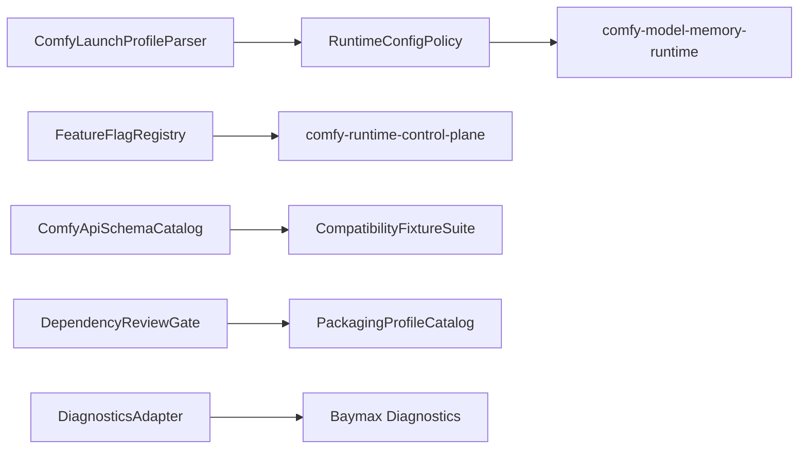

# Design: Comfy Packaging, Configuration, and Quality

## Overview

This spec centralizes migration-wide quality controls so other Comfy specs do not each reinvent configuration parsing, feature flags, schema fixtures, dependency review, test strategy, or platform packaging rules. It protects the core Comfy-derived harness behavior rather than defining a user-facing runtime.

## Architecture



## Components and Interfaces

### ComfyLaunchProfileParser

- **Purpose**: Parse Comfy-compatible launch options into Baymax configuration.
- **Responsibilities**: Networking, directories, upload limits, logging, assets, database, API nodes, custom nodes, manager mode, feature flags, memory, precision, device, cache, and performance options.

### FeatureFlagRegistry

- **Purpose**: Store server and CLI-provided feature flags and connection-specific client flags.
- **Responsibilities**: Typed coercion, core flag protection, WebSocket negotiation, and response serialization.

### ComfyApiSchemaCatalog

- **Purpose**: Track implemented, planned, cloud-only, external, and unsupported Comfy/OpenAPI routes.
- **Responsibilities**: Schema coverage, route status, request/response fixtures, and compatibility notes.

### CompatibilityFixtureSuite

- **Purpose**: Provide automated fixtures for migrated Comfy features.
- **Responsibilities**: Script examples, route snapshots, node schema snapshots, blueprint manifest, provider catalogs, asset API tests, and media capability snapshots.

### DependencyReviewGate

- **Purpose**: Block unreviewed dependencies and large downloads.
- **Responsibilities**: License, maintenance, security, binary size, platform impact, network requirement, and fallback strategy records.

### DiagnosticsAdapter

- **Purpose**: Expose logs and internal diagnostics through Baymax diagnostics without making internal endpoints stable public API.

## Data Models

```rust
pub struct ComfyLaunchProfile {
    pub network: NetworkLaunchOptions,
    pub directories: DirectoryLaunchOptions,
    pub features: FeatureFlagSet,
    pub runtime_policy: RuntimePolicyInput,
    pub assets: AssetLaunchOptions,
    pub extensions: ExtensionLaunchOptions,
    pub diagnostics: DiagnosticLaunchOptions,
}

pub enum ComfyRouteSupport {
    Implemented,
    Planned,
    CloudOnly,
    External,
    Unsupported { reason: String },
}
```

## Correctness Properties

### Property 1: Unsupported Option Visibility

_For any_ Comfy launch option supplied to Baymax, if no Baymax behavior supports it, the parser SHALL report it as unsupported with a reason and nearest equivalent when one exists.

**Validates: Requirement 1.3**

### Property 2: Core Feature Flag Protection

_For any_ CLI-provided feature flag, if it attempts to overwrite a core server flag, the system SHALL ignore the override and preserve the core value.

**Validates: Requirement 2.1**

### Property 3: Schema Status Truthfulness

_For any_ route in the Comfy/OpenAPI compatibility catalog, the status SHALL match an implemented handler, planned task, cloud-only classification, external dependency, or unsupported reason.

**Validates: Requirement 3.1, 3.3**

### Property 4: Fixture Coverage

_For any_ implemented Comfy capability group, the compatibility suite SHALL include at least one automated fixture or snapshot test for that group.

**Validates: Requirement 4.1, 4.2**

### Property 5: Dependency Review Enforcement

_For any_ new native, codec, Python, provider, model, frontend, or vendored dependency, implementation SHALL be blocked until dependency review exists.

**Validates: Requirement 5.1, 5.3**

## Error Handling

- Invalid launch profiles return accumulated option diagnostics rather than failing on the first issue.
- Feature flag coercion errors warn and drop only the invalid flag.
- Missing frontend/template/doc packages produce startup diagnostics with install/update guidance.
- Schema drift fails compatibility tests.
- Diagnostic endpoints fail closed for unapproved roots and internal-only routes.

## Testing Strategy

- Unit tests for option parsing, feature flag coercion, core flag protection, route support status, and dependency gate decisions.
- Snapshot tests for OpenAPI route catalog, script examples, provider catalog, node schema catalog, and blueprint manifest.
- CI checks for spec/task consistency and dependency review references.
- Packaging profile tests for CPU, GPU, API-disabled, custom-node-disabled, asset-enabled, and portable-like launch profiles.
