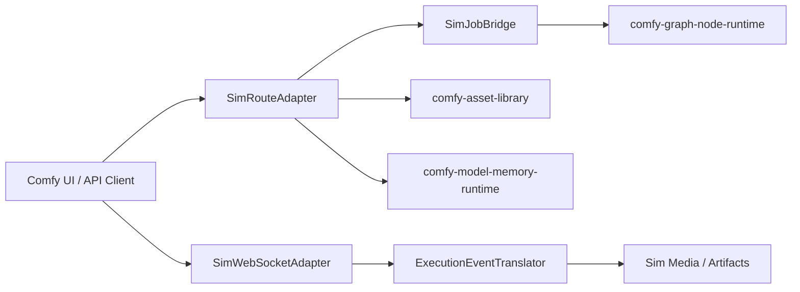

# Design: Comfy Runtime Control Plane

## Overview

The control plane is a Sim harness layer for Comfy-compatible HTTP and WebSocket semantics. It defines the world-model harness prompt/job lifecycle while delegating execution, assets, and model work to existing Sim subsystems and the adjacent Comfy migration specs. The key decision is to model Comfy endpoints as protocol adapters rather than porting `aiohttp` server code.

## Architecture



The adapter exposes legacy Comfy paths and `/api` aliases. Internally it converts requests into Sim task/job operations and converts Sim events back into Comfy-compatible payloads.

## Components and Interfaces

### SimRouteAdapter

- **Purpose**: Register Comfy-compatible HTTP routes against Sim HTTP infrastructure.
- **Responsibilities**: Parse requests, validate prompt ids, map `/api` aliases, return Comfy-compatible JSON, and enforce route-level safety.
- **Does not own**: Job execution, asset persistence, model loading, or frontend rendering.
- **Native route catalog**: Route aliases are method-aware native Sim records in
  `world_model`. Legacy and `/api` paths resolve to the same owning Sim handler
  domain, while shared paths such as `GET /prompt` and `POST /prompt` remain
  distinct operations. The catalog covers prompt submission/status, queue,
  history, jobs, features, model catalog, object info, upload, view,
  embeddings, and extensions without registering a ComfyUI web server.
- **Interface contract**:

```rust
pub trait SimRouteAdapter {
    fn register_routes(&self, router: &mut SimRouter);
    fn handle_prompt(&self, request: PromptSubmission) -> Result<PromptSubmissionResponse, SimApiError>;
    fn handle_queue_action(&self, request: QueueAction) -> Result<(), SimApiError>;
    fn handle_history_action(&self, request: HistoryAction) -> Result<(), SimApiError>;
}
```

### SimJobBridge

- **Purpose**: Map Comfy prompt lifecycle operations onto Sim tasks/jobs.
- **Responsibilities**: Create jobs, expose queue snapshots, normalize job history, cancel pending or running jobs, and remove sensitive extra data from public responses.
- **Dependencies**: Sim task system, Comfy graph validator, generated artifact store.
- **Native job bridge**: Prompt submissions become Sim-owned job records with
  canonical prompt ids, queue numbers, status, client metadata, prompt payloads,
  outputs, and explicit public extra-data views. Queue snapshots, terminal
  history, job listings, sorting, filtering, and queue/history removal actions
  operate on those Sim job records and never expose sensitive prompt extra data
  or forward lifecycle state to a ComfyUI server.
- **Native cancellation controller**: Cancellation and interrupt requests are
  classified against Sim job state. Pending jobs are dequeued into cancelled
  terminal history, running jobs are interrupted into cancelled terminal
  history, terminal and unknown jobs are explicit non-failing no-ops, and
  targeted interrupts never cancel unrelated pending jobs.

### SimWebSocketAdapter

- **Purpose**: Maintain Comfy-compatible realtime sessions.
- **Responsibilities**: Assign client ids, persist per-client feature flags, send initial queue status, and serialize execution events.
- **Native session registry**: Sessions are Sim-owned records keyed by client
  session id. Connect creates or reuses a session, stores the requested client
  id, emits initial queue status from `SimJobBridge`, and negotiates feature
  flags against Sim-supported realtime capabilities.
- **Interface contract**:

```rust
pub trait SimWebSocketAdapter {
    fn connect(&self, requested_client_id: Option<ClientId>) -> ClientSession;
    fn receive_feature_flags(&self, session: ClientSessionId, flags: ClientFeatureFlags);
    fn publish(&self, event: SimRuntimeEvent);
}
```

### ExecutionEventTranslator

- **Purpose**: Convert Sim execution events into Comfy event names and binary preview event ids.
- **Responsibilities**: Emit `status`, `executing`, `progress`, `feature_flags`, legacy preview image events, and metadata preview events.
- **Preview selection**: Sim runtime events are translated into typed WebSocket
  frames. Clients that negotiated preview metadata receive JSON metadata
  previews; clients without that support receive legacy binary preview frames.
  Translation does not proxy a ComfyUI WebSocket server.

### Compatibility Fixtures

- **Purpose**: Keep Comfy script-example compatibility executable as native Sim
  regression tests.
- **Responsibilities**: Cover basic HTTP prompt submission, queue/history reads,
  WebSocket connection, feature negotiation, executing/progress events, and
  metadata-vs-legacy preview selection using checked-in fixtures.
- **Native fixture contract**: Fixtures declare `native_sim_records: true` and
  `comfyui_passthrough: false`; tests fail if compatibility is represented only
  by route labels or hidden ComfyUI proxy behavior.

### SimHttpSafetyLayer

- **Purpose**: Preserve Comfy's local-server safety behavior while using Sim middleware.
- **Responsibilities**: origin checks, CORS policy, CSP when API nodes are disabled, path confinement, safe content disposition, and cache-control classification.

Task 2 implements the safety layer as native Sim primitives. Loopback browser
requests validate host/origin before route handling, API-node mode selects an
explicit content-security policy, executable view content is forced to a safe
download type, cache-control is classified by response purpose, and file
resolution rejects absolute paths or parent-directory escapes before joining
against registered Sim roots.

## Data Models

Task 1 defines these as native Sim protocol records in `crates/world_model`.
Prompt ids are validated as canonical lowercase hyphenated UUID strings before
enqueueing, prompt payloads stay as protocol JSON until graph validation owns
them, extra data exposes an explicit redacted public view, queue/history actions
carry typed prompt ids, job summaries model Sim queue state, and runtime events
carry feature negotiation, execution progress, and preview metadata without
wrapping or forwarding a ComfyUI server object.

```rust
pub struct PromptSubmission {
    pub prompt_id: Option<Uuid>,
    pub prompt: SimPromptGraph,
    pub number: Option<f64>,
    pub front: bool,
    pub client_id: Option<ClientId>,
    pub extra_data: PromptExtraData,
    pub partial_execution_targets: Vec<NodeId>,
}

pub enum JobStatus {
    Pending,
    InProgress,
    Completed,
    Failed,
    Cancelled,
}

pub enum SimRuntimeEvent {
    Status(QueueStatus),
    Executing { prompt_id: Uuid, node_id: Option<NodeId> },
    Progress { prompt_id: Uuid, node_id: NodeId, value: u64, max: u64 },
    Preview(PreviewPayload),
    FeatureFlags(ServerFeatureFlags),
}
```

## Correctness Properties

### Property 1: Canonical Job Identity

_For any_ client-supplied prompt id, if it is not a canonical lowercase hyphenated UUID, the system SHALL reject the prompt before enqueueing it.

**Validates: Requirement 2.1**

### Property 2: Idempotent Cancellation

_For any_ cancel request, the system SHALL cancel matching running or pending jobs and report terminal or unknown jobs as non-failing no-ops.

**Validates: Requirement 2.3**

### Property 3: Sensitive Data Redaction

_For any_ queue, history, or job response, sensitive prompt extra data SHALL be omitted from public response payloads.

**Validates: Requirement 2.5**

### Property 4: Session-Scoped Events

_For any_ execution event with a prompt id and client id, the WebSocket adapter SHALL deliver status and preview payloads to the intended session without rewriting the prompt id.

**Validates: Requirement 3.3**

### Property 5: Path Confinement

_For any_ upload, view, or download request, the resolved filesystem path SHALL remain within the configured input, output, temp, or asset root.

**Validates: Requirement 4.3**

## Error Handling

- Invalid prompt JSON returns a structured Comfy-style error with `node_errors` when validation can run.
- Invalid prompt ids return a 400 error and do not create jobs.
- Missing jobs return 404 for single-job reads and non-failing no-ops for cancellation.
- Unsupported endpoint parity returns `UNSUPPORTED_COMFY_CAPABILITY` with the route and missing capability.
- Origin, CSP, and path violations return 403 or 400 without exposing filesystem details.
- Preview serialization failures downgrade to a logged job event and preserve the running job state.

## Testing Strategy

- Unit tests for prompt id validation, native protocol records, HTTP safety primitives, method-aware `/api` alias routing, Sim job bridge submission/listing/history redaction, idempotent cancellation and targeted interrupt classification, WebSocket session/feature negotiation and preview frame selection, and path confinement.
- Integration tests for prompt submission through queue, job status transitions, WebSocket feature negotiation, progress events, and preview metadata negotiation.
- Compatibility fixtures from `projects/comfy/script_examples` for basic HTTP prompt execution and WebSocket image retrieval, backed by native Sim route, job, session, and event records.
- Property tests for route alias equivalence and path traversal rejection.
