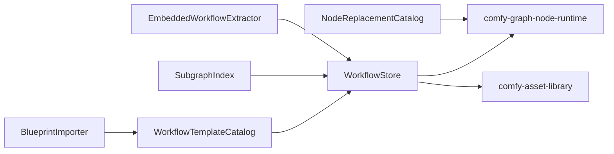

# Design: Comfy Workflows and Blueprints

## Overview

Workflows and blueprints are treated as first-class world-model harness project resources backed by Sim project storage. This spec adds import, export, catalog, subgraph, node replacement, and embedded metadata services while relying on graph runtime validation and graph UI rendering elsewhere.

## Architecture



## Components and Interfaces

### BlueprintImporter

- **Purpose**: Import shipped Comfy blueprint JSON and associated GLSL/helper assets.
- **Responsibilities**: Preserve names, source paths, categories, dependency references, and attribution.
- **Native catalog**: Shipped blueprint fixtures are normalized into Sim-owned
  blueprint records with preserved graph JSON, source path, category,
  dependency records, node type inventory, and attribution. Unsupported nodes or
  missing dependencies produce diagnostics without dropping the blueprint, and
  the importer does not call into a ComfyUI catalog.

### WorkflowStore

- **Purpose**: Persist workflows and versions in Sim project storage.
- **Responsibilities**: Load, save, API export, metadata preservation, provenance links, and default view handling.
- **Native workflow records**: Workflow documents preserve graph JSON, UI
  metadata, default view, source references, version ids, and optional Sim
  provenance artifact links. API export converts saved workflow node/link
  records into the prompt graph shape accepted by the native runtime control
  plane instead of forwarding export to ComfyUI.

```rust
pub trait WorkflowStore {
    fn load(&self, id: WorkflowId) -> Result<WorkflowDocument, WorkflowError>;
    fn save(&self, workflow: WorkflowDocument) -> Result<WorkflowVersionId, WorkflowError>;
    fn export_api_prompt(&self, workflow: &WorkflowDocument) -> Result<ComfyPromptGraph, WorkflowError>;
}
```

### SubgraphIndex

- **Purpose**: Expose reusable graph fragments from blueprints and extensions.
- **Responsibilities**: Stable id generation, source metadata, sanitized listing, and full data retrieval.
- **Native subgraph records**: Blueprint and custom-node subgraphs are indexed as
  Sim-owned records with stable ids derived from source type and source path,
  sanitized listing metadata, node-pack/source metadata, and full graph JSON
  retrieval for execution/import callers. The index does not defer discovery or
  graph reads to a ComfyUI extension registry.

### WorkflowTemplateAdapter

- **Purpose**: Expose custom-node workflow examples through Sim template
  services.
- **Responsibilities**: Stable template ids, safe template/asset path records,
  sanitized listings, static asset references, and full workflow graph retrieval.
- **Native template records**: Custom-node workflow examples are normalized into
  Sim-owned template records with node-pack metadata, static asset references,
  sanitized metadata, diagnostics, and full graph JSON. The adapter does not
  serve templates by proxying a ComfyUI extension directory.

### NodeReplacementCatalog

- **Purpose**: Store node replacement metadata for old workflow compatibility.
- **Responsibilities**: Register replacement entries, dedupe duplicate mappings, and provide mappings to graph validation.
- **Native replacement records**: Replacement mappings are stored as Sim-owned
  catalog entries with source metadata, input/output mappings, duplicate and
  conflict diagnostics, and a direct bridge to native graph replacement before
  validation or workflow import. The catalog does not rely on ComfyUI node
  replacement metadata at runtime.

### EmbeddedWorkflowExtractor

- **Purpose**: Recover prompt/workflow metadata from generated files.
- **Responsibilities**: Read supported metadata fields, associate recovered workflows with assets, and return non-fatal diagnostics.
- **Native metadata records**: Embedded prompt/workflow metadata from supported
  generated PNG, WebP, and FLAC metadata maps is parsed into Sim workflow
  documents, prompt JSON, source artifact links, provenance updates, and
  diagnostics. Metadata failures preserve the asset record and are not delegated
  to ComfyUI image/audio metadata readers.

### AppModeBridge

- **Purpose**: Preserve app-like workflow controls for the unified authoring app.
- **Responsibilities**: Parse app-mode metadata, expose Sim control records,
  preserve graph-workflow fallback, and report invalid control metadata.
- **Native app-mode records**: App-mode controls are stored as Sim-owned
  metadata with control kind, label, default value, choices, target node/input,
  and UI ownership. The bridge stores data for the unified authoring app and
  graph editor instead of implementing UI or forwarding to ComfyUI frontend
  app-mode code.

## Data Models

```rust
pub struct WorkflowDocument {
    pub id: Option<WorkflowId>,
    pub name: String,
    pub graph: ComfyPromptGraph,
    pub ui_metadata: JsonObject,
    pub default_view: WorkflowView,
    pub source: WorkflowSource,
    pub provenance: Option<GeneratedArtifactId>,
}

pub struct BlueprintRecord {
    pub name: String,
    pub source_path: PathBuf,
    pub category: BlueprintCategory,
    pub dependencies: Vec<BlueprintDependency>,
    pub attribution: FixtureAttribution,
}
```

## Correctness Properties

### Property 1: Blueprint Preservation

_For any_ shipped Comfy blueprint, import SHALL preserve the blueprint name, source path, graph JSON, and dependency references even when validation reports unsupported nodes.

**Validates: Requirement 1.1, 1.2, 1.3**

### Property 2: API Export Validity

_For any_ saved workflow that validates as executable, API export SHALL produce a prompt graph accepted by the Comfy runtime control plane.

**Validates: Requirement 2.1, 2.2, 2.3**

### Property 3: Stable Subgraph Identity

_For any_ subgraph source path and source type, the index SHALL generate the same id across runs until the source path or type changes.

**Validates: Requirement 3.1, 3.2**

### Property 4: Replacement Link Preservation

_For any_ node replacement with output mappings, all downstream links to mapped outputs SHALL point to the replacement output index after migration.

**Validates: Requirement 4.1, 4.2**

### Property 5: Metadata Failure Is Non-Fatal

_For any_ generated file import, metadata extraction failure SHALL NOT block asset registration.

**Validates: Requirement 5.3**

## Error Handling

- Invalid workflow JSON returns parse diagnostics and preserves the source file reference.
- Unsupported nodes remain visible with missing capability diagnostics.
- Missing blueprint dependency files produce dependency diagnostics but do not remove the blueprint.
- Invalid replacement mappings are ignored with diagnostics.
- Embedded metadata extraction failures attach non-fatal diagnostics to the asset.

## Testing Strategy

- Import tests over the full 89-entry `projects/comfy/blueprints` fixture list.
- Snapshot tests for blueprint catalog entries and native subgraph ids/listings.
- Round-trip tests for workflow load/save/API export through native Sim records.
- Replacement catalog and graph-rewrite tests shared with native graph validation.
- Metadata extraction tests for supported generated-file metadata containers and
  non-fatal asset preservation.
- App-mode metadata tests for native control records and graph-workflow fallback.
