# Design Document: Additional LLM Providers

## 1. Overview

Integrate the 18+ LLM provider implementations from goose that do not yet have equivalents in baymax. Each provider adapts goose's provider trait to baymax's `language_model` infrastructure, following the established patterns in `crates/language_models/src/provider/`.

### Key Architectural Decisions

- **Provider trait reuse**: Implement the existing `LanguageModelProvider` / `LanguageModel` traits from `crates/language_model_core/`, not goose's provider trait — baymax already has a well-defined provider interface.
- **Feature-gated crates**: Cloud providers (Azure, Vertex AI, etc.) that require heavy SDK dependencies get their own crates under `crates/`; simpler API-only providers (NanoGPT, Avian, etc.) can live in a single shared crate.
- **ACP-based providers**: Claude ACP, Claude Code, ChatGPT/Codex, Cursor Agent communicate via spawning subprocesses or connecting via ACP — these follow the pattern of `crates/acp_thread/` rather than direct HTTP.
- **Declarative providers**: Implemented entirely in configuration, no Rust code changes needed for new OpenAI-compatible endpoints.
- **Local endpoint configuration**: Ollama and llama.cpp use the existing OpenAI-compatible provider path with a local `/v1` endpoint preset. The UI must not require a user-entered API key for these local endpoints, but Baymax may store an internal placeholder credential so provider authentication state remains compatible with the existing OpenAI-compatible runtime.

## 2. Architecture

```mermaid
graph TD
    subgraph "baymax Language Model System"
        LM[language_model_core::LanguageModel trait]
        LM_Models[language_models::Provider Registry]
        LM_Providers[language_models::provider/ directory]
    end

    subgraph "New: Goose Providers"
        Azure[azure]
        Vertex[gcp_vertex_ai]
        HF[huggingface]
        LLM[litellm]
        Snow[snowflake]
        Sagemaker[sagemaker_tgi]
        Nano[nanogpt]
        Tetra[tetrate]
        Avian[avian]
        Kimi[kimicode]
        DB1[databricks_v1]
        DB2[databricks_v2]
        ClaudeACP[claude_acp]
        ClaudeCode[claude_code]
        Codex[chatgpt_codex]
        Cursor[cursor_agent]
        GeminiCLI[gemini_cli]
        LocalInf[local_inference]
        Embed[embedding_providers]
        Declarative[declarative_providers]
        Registry[provider_registry]
    end

    Azure -->|implements| LM
    Vertex -->|implements| LM
    HF -->|implements| LM
    LLM -->|implements| LM
    Snow -->|implements| LM
    Sagemaker -->|implements| LM
    Nano -->|implements| LM
    Tetra -->|implements| LM
    Avian -->|implements| LM
    Kimi -->|implements| LM
    DB1 -->|implements| LM
    DB2 -->|implements| LM
    ClaudeACP -->|ACP protocol| LM
    ClaudeCode -->|subprocess + ACP| LM
    Codex -->|subprocess + ACP| LM
    Cursor -->|subprocess + ACP| LM
    GeminiCLI -->|OAuth + subprocess| LM
    LocalInf -->|local model| LM
    Embed -->|embedding trait| LM_Models
    Declarative -->|config-driven| LM_Models
    Registry --> LM_Models
```



## 3. Components and Interfaces

### Component: Provider Modules (per provider)

Each provider module implements `crate::language_model_core::LanguageModelProvider`:

```rust
impl LanguageModelProvider for AzureProvider {
    fn id(&self) -> &str { "azure" }
    fn name(&self) -> &str { "Azure OpenAI" }
    fn available_models(&self, cx: &App) -> Vec<ModelId> { ... }
    fn language_model(&self, model: &ModelId) -> Result<Arc<dyn LanguageModel>> { ... }
    fn provider_credential_sources(&self) -> Vec<CredentialSource> { ... }
    fn location(&self) -> ProviderLocation { ProviderLocation::Cloud }
}
```

### Component: ACP-Based Provider Adapter

For providers that communicate via ACP (Claude Code, Codex, etc.):

```rust
pub struct AcpSubprocessProvider {
    binary_name: &'static str,
    auth_method: AcpAuthMethod,
}

impl LanguageModelProvider for AcpSubprocessProvider {
    // Spawns the binary, connects via ACP, wraps as LanguageModel
}
```

### Component: Declarative Provider Config

```rust
#[derive(Deserialize)]
pub struct DeclarativeProviderConfig {
    pub name: String,
    pub base_url: String,
    pub api_key_env_var: Option<String>,
    pub models: Vec<String>,
    pub custom_headers: HashMap<String, String>,
}
```

### Component: LLM Provider Configuration UI

The agent configuration UI exposes `Add Provider` flows for OpenAI-compatible providers:

- `OpenAI` uses the standard OpenAI-compatible API flow and requires an API key.
- `Local Inference (Ollama / llama.cpp)` uses the same OpenAI-compatible settings schema, prefills `http://localhost:11434/v1`, and allows a blank API key for local servers that ignore authentication.

Both flows write `language_models.openai_compatible` settings so models appear in the existing `LanguageModelRegistry` without a separate local-inference runtime.

### Component: Provider Registry

```rust
pub struct ProviderRegistry {
    builtin: HashMap<String, Box<dyn Fn() -> Box<dyn LanguageModelProvider>>>,
    declarative: Vec<DeclarativeProviderInstance>,
}
```

## 4. Data Models

### Provider Instance
```rust
pub struct RegisteredProvider {
    pub id: String,
    pub name: String,
    pub provider: Box<dyn LanguageModelProvider>,
    pub source: ProviderSource, // Builtin | Declarative | Extension
}
```

### ACP Auth Methods
```rust
pub enum AcpAuthMethod {
    ApiKey { env_var: String },
    OAuth { client_id: String, scopes: Vec<String> },
    DeviceFlow { client_id: String },
    None, // No auth needed (local binary)
}
```

## 5. Correctness Properties

### Property 1: Provider Isolation

_For any_ provider configuration, [if the provider fails to initialize], THE system SHALL return an error specific to that provider without affecting other providers.

**Validates: Requirement 1.6**

### Property 2: Streaming Consistency

_For any_ provider [that supports streaming], THE system SHALL deliver tokens in order without gaps.

**Validates: Requirement 2.5**

### Property 3: Registry Uniqueness

_For any_ provider ID [registered in the provider registry], THE registry SHALL contain at most one entry per ID.

**Validates: Requirement 7.2**

### Property 4: Declarative Validation

_For any_ declarative provider config [with invalid fields], THE system SHALL reject the config and enumerate all validation errors.

**Validates: Requirement 6.5**

### Property 6: Local Endpoint Configuration

_For any_ local OpenAI-compatible provider configured through the UI, THE system SHALL persist the provider with a local API URL, at least one model, and usable authentication state even when the local endpoint does not require a user-entered API key.

**Validates: Requirement 5.1, 5.2, 6.3, 6.4**

### Property 5: Credential Safety

_For any_ provider credential [stored or transmitted], THE system SHALL NOT log, display, or persist the credential in plaintext.

**Validates: Requirement 1.6**

## 6. Error Handling

| Error Scenario | Handling |
|---|---|
| Invalid API key | Return `LanguageModelError::Authentication` with provider-specific message |
| Rate limited | Return `LanguageModelError::RateLimited` with retry-after info |
| Model unavailable | Return `LanguageModelError::ModelNotFound` |
| ACP binary not found | Return `LanguageModelError::ProviderUnavailable` with install instructions |
| Network timeout | Return `LanguageModelError::Timeout` with configurable timeout duration |
| OAuth token expired | Trigger re-authentication flow before retry |

## 7. Testing Strategy

- **Unit tests**: Each provider's request formatting and response parsing
- **Integration tests**: Mock HTTP server for each cloud provider API
- **ACP mock tests**: Mock subprocess that speaks ACP for ACP-based providers
- **Registry tests**: Registration, lookup, duplicates, missing providers
- **Declarative tests**: Config parsing, validation errors, override behavior

## References

- Source: `projects/goose/crates/goose/src/providers/` (all files listed in requirements)
- Baymax trait: `crates/language_model_core/`
- Baymax providers: `crates/language_models/src/provider/`
