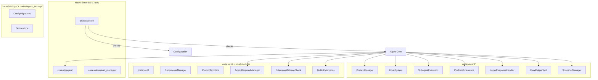

# Design Document: Agent Infrastructure

## 1. Overview

Migrate ~17 foundational agent infrastructure features from goose into baymax's existing agent and supporting crates. These are varied subsystems that augment the core agent loop, configuration, and system management.

### Key Architectural Decisions

- **Distribute across existing crates**: Rather than one monolithic crate, each feature goes where it fits architecturally:
  - Context management → `crates/agent/`
  - Plugins → `crates/extension/` or new `crates/plugins/`
  - Hooks → `crates/agent/` (hook points in the agent loop)
  - Subagents → `crates/agent/` (enhance existing spawn_agent_tool)
  - Platform extensions → `crates/agent/` (tools registered with the agent)
  - Doctor → new `crates/doctor/`
  - Download manager → new `crates/download_manager/`
  - Config migrations → `crates/settings/`
  - Goose mode → `crates/agent_settings/`
  - Misc (instance_id, subprocess, prompt_template, etc.) → `crates/util/` or small modules

## 2. Architecture



## 3. Components and Interfaces

### Component: Context Manager

```rust
pub struct ContextManager {
    max_tokens: usize,
    strategy: CompactionStrategy,
}

impl ContextManager {
    pub fn monitor_usage(&self, messages: &[Message]) -> ContextUsage;
    pub fn compact(&self, messages: &mut Vec<Message>) -> Result<CompactionResult>;
    pub fn should_compact(&self, usage: &ContextUsage) -> bool;
}

pub enum CompactionStrategy {
    Summarize { preserve_last_n: usize },
    Trim { max_messages: usize },
    DropLeastRelevant { threshold: f32 },
}
```

### Component: Hook System

```rust
pub struct HookSystem {
    hooks: HashMap<HookPoint, Vec<Box<dyn Hook>>>,
}

pub enum HookPoint {
    BeforeToolExecution { tool_name: String },
    AfterToolExecution { tool_name: String },
    BeforeLlmCall,
    AfterLlmCall,
    OnSessionStart,
    OnSessionEnd,
    OnError,
}

#[async_trait]
pub trait Hook: Send + Sync {
    fn name(&self) -> &str;
    async fn execute(&self, context: HookContext) -> Result<HookAction>;
}

pub enum HookAction {
    Continue,
    Abort(String),
    Modify(HookContext),
}
```

### Component: Subagent Execution

```rust
pub struct SubagentConfig {
    pub model: Option<ModelId>,
    pub instructions: String,
    pub tools: Vec<String>,
    pub max_turns: usize,
    pub timeout: Duration,
}

pub struct SubagentHandle {
    pub task: Task<Result<SubagentResult>>,
    pub events: Receiver<SubagentEvent>,
}

pub enum SubagentEvent {
    TurnCompleted { turn: usize, summary: String },
    ToolCalled { tool: String, duration: Duration },
    Completed { result: String },
    Failed { error: String },
}
```

### Component: Doctor

```rust
pub struct Doctor {
    checks: Vec<Box<dyn HealthCheck>>,
}

#[async_trait]
pub trait HealthCheck: Send + Sync {
    fn name(&self) -> &str;
    fn description(&self) -> &str;
    async fn run(&self) -> HealthCheckResult;
}

pub struct HealthCheckResult {
    pub name: String,
    pub status: HealthStatus,
    pub message: String,
    pub remediation: Option<String>,
}

pub enum HealthStatus {
    Pass,
    Warning(String),
    Fail(String),
}
```

### Component: Platform Extensions

```rust
// Each platform extension is registered as an agent tool
pub struct CodeExecutionTool;  // Run code in sandbox
impl AgentTool for CodeExecutionTool { ... }

pub struct OrchestratorTool;  // Coordinate multi-step workflows
impl AgentTool for OrchestratorTool { ... }

pub struct SummarizeTool;  // Summarize content
impl AgentTool for SummarizeTool { ... }

// ... similar for Todo, Tom, Apps, Chatrecall, Summon, Analyze, Developer
```

### Component: Configuration Migration

```rust
pub struct ConfigMigrator {
    current_version: u32,
    migrations: Vec<Box<dyn Migration>>,
}

#[async_trait]
pub trait Migration: Send + Sync {
    fn from_version(&self) -> u32;
    fn to_version(&self) -> u32;
    fn description(&self) -> &str;
    async fn migrate(&self, config: &mut Value) -> Result<()>;
    async fn rollback(&self, config: &mut Value) -> Result<()>;
}
```

### Component: Goose Mode

```rust
pub enum GooseMode {
    Balanced,
    Focus,
    Creative,
    Custom { prompt_override: String, temperature: Option<f32> },
}

impl GooseMode {
    pub fn system_prompt_modifier(&self) -> &str;
    pub fn temperature(&self) -> Option<f32>;
}
```

## 4. Data Models

```rust
pub struct CompactionResult {
    pub original_tokens: usize,
    pub compacted_tokens: usize,
    pub strategy_used: CompactionStrategy,
    pub messages_removed: usize,
}

pub struct SubagentResult {
    pub id: String,
    pub output: String,
    pub tool_calls_made: usize,
    pub total_duration: Duration,
    pub token_usage: TokenUsage,
}

pub struct Snapshot {
    pub id: String,
    pub timestamp: DateTime<Utc>,
    pub conversation: Vec<Message>,
    pub tool_states: Value,
}
```

## 5. Correctness Properties

### Property 1: Context Bounds

_For any_ conversation [processed by the context manager], AFTER compaction, THE total token count SHALL be within the configured limit.

**Validates: Requirement 1.3**

### Property 2: Hook Execution Order

_For any_ registered hooks [at the same hook point], THE hooks SHALL execute in registration order.

**Validates: Requirement 3.3**

### Property 3: Subagent Isolation

_For any_ subagent execution, [when the parent agent errors or is cancelled], THE subagent SHALL also be cancelled.

**Validates: Requirement 4.5**

### Property 4: Migration Atomicity

_For any_ configuration migration [that fails], THE system SHALL fully roll back to the previous configuration version.

**Validates: Requirement 16.3**

### Property 5: Doctor Completeness

_For any_ doctor run, ALL registered checks SHALL execute and produce a result.

**Validates: Requirement 11.5**

## 6. Error Handling

| Error Scenario | Handling |
|---|---|
| Context compaction fails | Keep existing context, log error, continue |
| Hook panics | Catch, log, continue with remaining hooks |
| Subagent timeout | Kill subagent, return timeout error to parent |
| Migration incompatible | Halt startup, prompt user to restore backup |
| Doctor check hangs | Timeout after 10s, mark as failed |

## 7. Testing Strategy

- **Unit tests**: Each component independently (context manager, hooks, migrations)
- **Integration tests**: Subagent spawning, doctor running, migration applying
- **Edge cases**: Empty context, all hooks failing, version skip migrations

## References

- Source: All `projects/goose/crates/goose/src/` files listed in requirements
- Baymax: `crates/agent/`, `crates/settings/`, `crates/agent_settings/`, `crates/util/`
