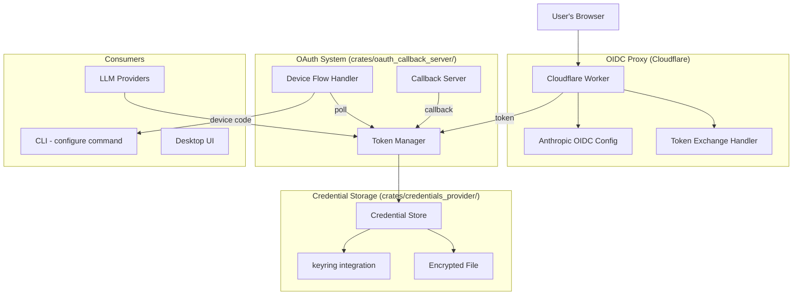

# Design Document: Authentication Subsystem

## 1. Overview

Migrate goose's authentication features: the OIDC proxy (Cloudflare Worker), OAuth token persistence, and OAuth device flow authentication. These extend baymax's existing `crates/oauth_callback_server/` with more flexible authentication patterns.

### Key Architectural Decisions

- **OIDC proxy as standalone deployment**: The Cloudflare Worker is a separate deployment artifact, not integrated into the baymax binary. Document how to deploy it.
- **OAuth persistence in `crates/credentials_provider/`**: Baymax already has `crates/credentials_provider/` for storing credentials. Extend it to handle OAuth tokens.
- **OAuth device flow in `crates/oauth_callback_server/`**: Add device flow support alongside the existing callback server. They share the same token management logic.
- **Encrypted token storage**: Use the existing keyring integration (already a workspace dependency) for OS-level encrypted storage.

## 2. Architecture



## 3. Components and Interfaces

### Component: OIDC Proxy (Cloudflare Worker)

```typescript
// oidc-proxy/src/index.ts
export default {
  async fetch(request: Request, env: Env): Promise<Response> {
    // Routes:
    // GET /authorize — redirect to OIDC provider
    // GET /callback — handle OIDC callback
    // POST /token — exchange auth code for tokens
    // GET /.well-known/openid-configuration — OIDC discovery
  }
}
```

### Component: OAuth Device Flow

```rust
pub struct DeviceFlowHandler {
    client_id: String,
    scopes: Vec<String>,
    token_url: String,
    device_auth_url: String,
}

impl DeviceFlowHandler {
    pub async fn start_device_flow(&self) -> Result<DeviceFlowSession>;
    pub async fn poll_for_token(&self, session: &DeviceFlowSession) -> Result<OAuthTokens>;
    pub fn display_instructions(&self, session: &DeviceFlowSession) -> String;
}

pub struct DeviceFlowSession {
    pub device_code: String,
    pub user_code: String,
    pub verification_uri: String,
    pub interval: Duration,
    pub expires_at: DateTime<Utc>,
}
```

### Component: Token Manager

```rust
pub struct TokenManager {
    store: Arc<dyn TokenStore>,
}

#[async_trait]
pub trait TokenStore: Send + Sync {
    async fn store(&self, key: &str, tokens: &OAuthTokens) -> Result<()>;
    async fn load(&self, key: &str) -> Result<Option<OAuthTokens>>;
    async fn delete(&self, key: &str) -> Result<()>;
}

pub struct OAuthTokens {
    pub access_token: String,
    pub refresh_token: Option<String>,
    pub expires_at: Option<DateTime<Utc>>,
    pub token_type: String,
    pub scope: Option<String>,
}
```

### Component: Keyring Token Store

```rust
pub struct KeyringTokenStore {
    service_name: String,
}

#[async_trait]
impl TokenStore for KeyringTokenStore {
    // Uses the keyring crate (already a workspace dependency)
    async fn store(&self, key: &str, tokens: &OAuthTokens) -> Result<()> {
        let entry = keyring::Entry::new(&self.service_name, key)?;
        entry.set_password(&serde_json::to_string(tokens)?)?;
        Ok(())
    }
    // ...
}
```

## 4. Data Models

```rust
pub struct OAuthConfig {
    pub provider: OAuthProvider,
    pub client_id: String,
    pub client_secret: Option<String>,
    pub scopes: Vec<String>,
    pub auth_url: String,
    pub token_url: String,
    pub device_auth_url: Option<String>,
    pub redirect_uri: String,
}

pub enum OAuthProvider {
    Anthropic,
    Google,
    GitHub,
    Custom { name: String },
}

pub struct OidcProxyConfig {
    pub provider_name: String,
    pub proxy_url: String,
    pub client_id: String,
    pub audience: Option<String>,
}
```

## 5. Correctness Properties

### Property 1: Token Persistence

_For any_ OAuth token [stored via the TokenStore], [after application restart], THE stored token SHALL be retrievable.

**Validates: Requirement 2.2**

### Property 2: Token Encryption

_For any_ OAuth token [persisted to disk], THE token SHALL be encrypted before storage.

**Validates: Requirement 2.4**

### Property 3: Device Flow Instructions

_For any_ device flow initiation, THE system SHALL display the user code and verification URL to the user.

**Validates: Requirement 3.1**

## 6. Error Handling

| Error Scenario | Handling |
|---|---|
| OIDC proxy unavailable | Return connection error with proxy URL |
| Token expired and refresh fails | Clear stored token, prompt for re-auth |
| Device flow poll times out | Inform user, offer to restart flow |
| Keyring unavailable (headless) | Fall back to encrypted file storage |

## 7. Testing Strategy

- **Unit tests**: Token serialization/deserialization, encryption
- **Integration tests**: Mock OAuth server for device flow
- **Keyring tests**: Test with mock keyring backend
- **Worker tests**: Cloudflare Worker with Miniflare or wrangler

## References

- Source: `goose/oidc-proxy/` — Cloudflare Worker
- Source: `goose/crates/goose/src/oauth/persist.rs`
- Source: `goose/crates/goose/src/providers/oauth_device_flow.rs`
- Baymax: `crates/oauth_callback_server/`
- Baymax: `crates/credentials_provider/`
