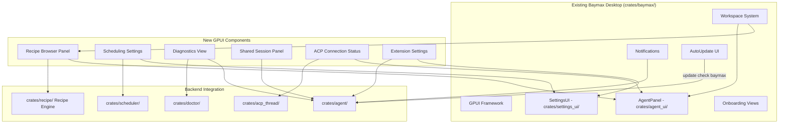

# Design Document: Desktop UI (GPUI Equivalents)

## 1. Overview

Migrate goose's Electron/React desktop app features by building GPUI-based equivalents within baymax's existing desktop application. Baymax already provides a full GPUI desktop (`crates/baymax/`), agent panel (`crates/agent_ui/`), settings UI (`crates/settings_ui/`), workspace system (`crates/workspace/`), notifications (`crates/notifications/`), updates (`crates/auto_update_ui/`), and onboarding (`crates/onboarding/`). Goose adds recipe execution UI, scheduling UI, startup diagnostics, shared sessions, ACP connection management, and enhanced agent settings.

### Key Architectural Decisions

- **No Electron/React port**: All UI is built as native GPUI views. Goose's React components inform the design but are not directly ported.
- **Integrate into existing agent panel**: Recipe browser, diagnostics, and connection status are added as sub-views within or alongside the existing `AgentPanel` in `crates/agent_ui/`.
- **Settings extensions go into `crates/settings_ui/`**: Scheduling and extension management UIs follow the existing settings panel patterns.
- **Shared sessions via deeplinks**: Use baymax's existing `parse_baymax_link` deeplink mechanism for sharing sessions.

## 2. Architecture



## 3. Components and Interfaces

### Component: Recipe Browser Panel

```rust
pub struct RecipeBrowser {
    recipes: Vec<RecipeManifest>,
    search_query: SharedString,
    selected_recipe: Option<usize>,
    is_running: bool,
}

impl Render for RecipeBrowser {
    // GPUI element tree:
    // - Search bar
    // - Scrollable recipe list with cards
    // - Detail view for selected recipe
    // - "Run" button
}

impl RecipeBrowser {
    pub fn new(cx: &mut Context<Self>) -> Self;
    pub fn load_recipes(&mut self, cx: &mut Context<Self>);
    pub fn run_selected_recipe(&mut self, cx: &mut Context<Self>);
    pub fn filter_recipes(&mut self, query: &str);
}
```

### Component: Scheduling Settings View

```rust
pub struct SchedulingSettings {
    schedules: Vec<Schedule>,
    new_schedule_form: Option<ScheduleForm>,
}

impl SchedulingSettings {
    pub fn create_schedule(&mut self, config: ScheduleConfig, cx: &mut Context<Self>);
    pub fn delete_schedule(&mut self, id: ScheduleId, cx: &mut Context<Self>);
    pub fn toggle_schedule(&mut self, id: ScheduleId, cx: &mut Context<Self>);
}

impl Render for SchedulingSettings {
    // Renders within settings_ui panel
    // - List of schedules with enable/disable toggle
    // - Add new schedule form (cron input, task selection)
    // - Delete button per schedule
}
```

### Component: Diagnostics View

```rust
pub struct DiagnosticsView {
    results: Vec<HealthCheckResult>,
    running: bool,
}

impl DiagnosticsView {
    pub fn run_checks(&mut self, cx: &mut Context<Self>);
    pub fn get_result(&self, name: &str) -> Option<&HealthCheckResult>;
    pub fn is_all_passing(&self) -> bool;
}

impl Render for DiagnosticsView {
    // - List of health checks with status icons (pass/warning/fail)
    // - Expandable detail per check
    // - Remediation steps for failed checks
    // - "Re-run" button
    // - Auto-runs on first open
}
```

### Component: ACP Connection Status

```rust
pub struct AcpConnectionIndicator {
    state: AcpConnectionState,
}

impl Render for AcpConnectionIndicator {
    // Small indicator shown in agent panel header:
    // - Green dot: connected
    // - Yellow dot: reconnecting
    // - Red dot: disconnected
    // - Click to show details/reconnect
}

pub enum AcpConnectionState {
    Connected { since: DateTime<Utc>, agent_name: String },
    Reconnecting { attempt: u32, max_attempts: u32 },
    Disconnected { error: Option<String> },
    Disabled,
}
```

### Component: Shared Session Integration

```rust
// Enhance existing session serialization in crates/agent/
impl Session {
    pub fn export_shareable(&self) -> Result<SharedSessionData>;
    pub fn import_shareable(data: &SharedSessionData) -> Result<Self>;
}

pub struct SharedSessionData {
    pub version: u32,
    pub session: Session,
    pub metadata: ShareMetadata,
}

// Deeplink handler in crates/baymax/
fn handle_shared_session_link(url: &Url, cx: &mut App) {
    // Parses baymax://session/<encoded-data>
    // Imports session
    // Opens in agent panel
}
```

### Component: Enhanced Extension Settings

```rust
// Extend existing crates/agent_ui/src/agent_configuration.rs
impl AgentConfiguration {
    // Add extension management:
    // - List installed extensions
    // - Add extension (path picker / URL input)
    // - Remove extension
    // - Toggle enable/disable
    // - View extension details (tools, resources, prompts)
}
```

## 4. Data Models

```rust
pub struct ScheduleConfig {
    pub name: String,
    pub cron_expression: String,
    pub task_type: ScheduledTask,
    pub enabled: bool,
}

pub enum ScheduledTask {
    RunRecipe { recipe_name: String, variables: HashMap<String, String> },
    SendMessage { prompt: String },
    RunDiagnostics,
}
```

## 5. Correctness Properties

### Property 1: Recipe UI Consistency

_For any_ recipe [visible in the recipe browser], THE displayed information (name, description, version, variables) SHALL match the recipe manifest.

**Validates: Requirements 2.2, 2.3**

### Property 2: Connection Status Accuracy

_For any_ ACP connection state change, THE connection indicator SHALL reflect the new state within 500ms.

**Validates: Requirement 6.2**

### Property 3: Schedule Reliability

_For any_ schedule [created via the scheduling UI], [at the configured cron time], THE task SHALL execute.

**Validates: Requirement 3.2**

## 6. Error Handling

| Error Scenario | Handling |
|---|---|
| Recipe load fails | Show error state in browser with retry |
| Schedule creation fails | Show validation error in form |
| Diagnostics check hangs | Timeout after 10s, mark as failed |
| Shared session data corrupted | Show import error with detail |
| Extension load fails | Show error status in extension list |

## 7. Testing Strategy

- **Unit tests**: Each GPUI component's state transitions and event handling
- **Visual tests**: Use baymax's visual test framework for component screenshots
- **Integration tests**: Recipe browser with mock recipe engine
- **Accessibility tests**: Keyboard navigation, screen reader labels

## References

- Source: `projects/goose/ui/desktop/` — Electron/React app (design reference only)
- Baymax: `crates/baymax/` — main desktop binary
- Baymax: `crates/agent_ui/` — agent panel, conversation, configuration
- Baymax: `crates/settings_ui/` — settings panel
- Baymax: `crates/workspace/` — workspace/panel management
- Baymax: `crates/notifications/` — notification system
- Baymax: `crates/auto_update/`, `crates/auto_update_ui/` — update system
- Baymax: `crates/onboarding/` — onboarding
