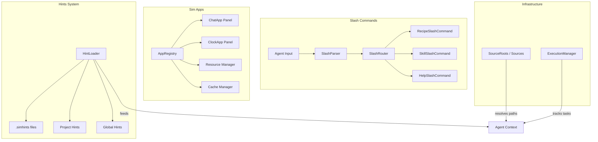

# Design Document: Developer Experience

## 1. Overview

Migrate goose's developer experience features: slash commands, hints system, sim apps (embedded mini-apps), source roots/sources management, and the execution manager. These enhance day-to-day interaction with the agent.

### Key Architectural Decisions

- **Slash commands in agent input processing**: Rather than a separate system, slash commands are parsed at the agent input boundary and routed to handlers — similar to how `crates/agent/` already processes messages.
- **Hints as skill-like files**: Hints are essentially auto-loaded skills without explicit user invocation. Use the existing `crates/agent_skills/` discovery mechanism.
- **Sim apps → GPUI entities**: The chat app, clock app, etc. map naturally to GPUI Entity components with `Render` implementations.
- **Execution manager in `crates/agent/`**: Goose's execution manager is conceptually similar to sim's task/scheduling infrastructure. Extend `crates/scheduler/` or `crates/task/` rather than creating a new crate.

## 2. Architecture



## 3. Components and Interfaces

### Component: Slash Command System

```rust
pub struct SlashCommandParser;

impl SlashCommandParser {
    pub fn parse(input: &str) -> Option<ParsedSlashCommand>;
}

pub struct SlashCommandRouter {
    commands: HashMap<String, Box<dyn SlashCommandHandler>>,
}

#[async_trait]
pub trait SlashCommandHandler: Send + Sync {
    fn name(&self) -> &str;
    fn description(&self) -> &str;
    async fn execute(&self, args: &str, cx: &mut App) -> Result<SlashCommandResult>;
}

pub struct SlashCommandResult {
    pub response: String,
    pub insert_into_conversation: bool,
}
```

### Component: Hints System

```rust
pub struct HintLoader {
    global_hints_path: PathBuf,
    project_hints_path: Option<PathBuf>,
}

impl HintLoader {
    pub fn load_global_hints(&self) -> Result<Vec<Hint>>;
    pub fn load_project_hints(&self, project_root: &Path) -> Result<Vec<Hint>>;
    pub fn load_all(&self) -> Result<Vec<Hint>>;
}

pub struct Hint {
    pub source: HintSource,
    pub content: String,
    pub priority: u8,
}
```

### Component: Sim Apps (GPUI Entities)

```rust
pub trait SimApp {
    fn id(&self) -> &str;
    fn name(&self) -> &str;
    fn render(&self, window: &mut Window, cx: &mut App) -> impl IntoElement;
    fn handle_action(&mut self, action: &dyn Action, cx: &mut App);
}

pub struct ChatApp { /* GPUI Entity */ }
impl Render for ChatApp { /* renders chat interface */ }

pub struct ClockApp { /* GPUI Entity */ }
impl Render for ClockApp { /* renders clock */ }
```

### Component: Source Roots

```rust
pub struct SourceRoots {
    roots: Vec<SourceRoot>,
}

pub struct SourceRoot {
    pub name: String,
    pub path: PathBuf,
    pub priority: u8,
}

impl SourceRoots {
    pub fn resolve(&self, relative: &str) -> Option<PathBuf>;
    pub fn add_root(&mut self, name: &str, path: &Path);
}
```

### Component: Execution Manager

```rust
pub struct ExecutionManager {
    running_tasks: HashMap<TaskId, TrackedTask>,
}

impl ExecutionManager {
    pub fn spawn_task(&mut self, task: Task<Result<()>>, metadata: TaskMetadata) -> TaskId;
    pub fn cancel(&mut self, id: TaskId) -> Result<()>;
    pub fn status(&self, id: TaskId) -> Option<TaskStatus>;
    pub fn list_active(&self) -> Vec<TaskInfo>;
}
```

## 4. Data Models

```rust
pub enum HintSource {
    File(PathBuf),
    Inline { name: String },
    Project { path: PathBuf },
}

pub struct TaskMetadata {
    pub name: String,
    pub description: String,
    pub created_at: DateTime<Utc>,
}

pub enum TaskStatus {
    Running,
    Completed(Result<()>),
    Cancelled,
}

pub struct TaskInfo {
    pub id: TaskId,
    pub metadata: TaskMetadata,
    pub status: TaskStatus,
    pub duration: Option<Duration>,
}
```

## 5. Correctness Properties

### Property 1: Slash Command Uniqueness

_For any_ registered slash command, [its name], THE system SHALL have at most one handler registered.

**Validates: Requirement 1.4**

### Property 2: Hint Scoping

_For any_ project directory, [when hints are loaded], THE system SHALL load global hints merged with project-specific hints, with project hints taking priority.

**Validates: Requirement 2.2**

### Property 3: Task Tracking

_For any_ task registered with the execution manager, [after it completes], THE manager SHALL record the final status for at least 5 seconds before cleanup.

**Validates: Requirement 5.3**

## 6. Error Handling

| Error Scenario | Handling |
|---|---|
| Unknown slash command | Show available commands with descriptions |
| Hint file unreadable | Skip file with warning, continue loading others |
| Source root path doesn't exist | Log warning, return None on resolve |
| Task panics during execution | Catch panic, mark as failed with error |

## 7. Testing Strategy

- **Unit tests**: Slash command parsing and routing
- **Hint tests**: Loading from various sources, priority merging
- **App tests**: Render and action handling
- **Execution manager tests**: Spawn, cancel, status, completion

## References

- Source: `projects/goose/crates/goose/src/slash_commands/`
- Source: `projects/goose/crates/goose/src/hints/`
- Source: `projects/goose/crates/goose/src/goose_apps/`
- Source: `projects/goose/crates/goose/src/source_roots.rs`, `sources.rs`
- Source: `projects/goose/crates/goose/src/execution/`
