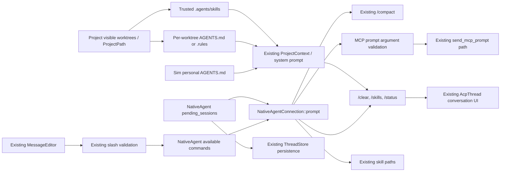

# Design: Developer Context and Commands

## Overview

This feature is an incremental extension of Sim's native agent. The command catalog remains the single source for autocomplete and dispatch; developer context remains the combination of Sim's personal instructions, per-worktree project instructions, trusted skills, and visible worktrees; session loading remains owned by `NativeAgent` and `ThreadStore`.

The implementation adds three source-backed, Sim-owned commands (`/clear`, `/skills`, and `/status`), completes the existing dynamically named MCP prompt path for declared arguments, makes project-instruction failures visible, and adds missing integration and lifecycle regression coverage. It deliberately does not port Goose's types, config paths, hints subsystem, source registries, MCP Apps, or execution manager.

## Existing context

| Area | Existing Sim owner and behavior | Confirmed change |
| --- | --- | --- |
| Native command catalog | `crates/agent/src/agent.rs` — `build_available_commands_for_project` advertises `/compact` and MCP prompts; skill commands are published from the existing skill catalog. | Reserve and advertise `/clear`, `/skills`, and `/status` alongside `/compact`. |
| Dispatch | `crates/agent/src/agent.rs` — `Command::parse` and `NativeAgentConnection::prompt` route `/compact`, qualified/unqualified skills, and MCP prompts before model input. | Add handlers to this dispatch; no second parser or registry. |
| MCP prompt commands | `build_available_commands_for_project` advertises zero- and one-argument context-server prompts; `NativeAgentConnection::prompt` maps the entire remainder to only the first prompt argument and `send_mcp_prompt` owns execution/persistence. | Advertise every declared prompt shape and validate named multi-argument input before reusing `send_mcp_prompt`. |
| Autocomplete and submission | `crates/agent_ui/src/message_editor.rs` — `validate_slash_commands`; `crates/agent_ui/src/conversation_view/thread_view.rs` — `leading_native_command` and `send_command_queueing_remainder`. | Reuse the advertised catalog for completions, preserve unknown input, and cover the full submission behavior with regressions. |
| Personal instructions | `crates/agent_settings/src/user_agents_md.rs` — `UserAgentsMd` watches the platform-specific Sim `AGENTS.md` and exposes load errors. | Reuse unchanged; report its state in `/status`. |
| Project instructions | `crates/prompt_store/src/prompts.rs` — `RULES_FILE_NAMES`, `ProjectContext`, `WorktreeContext`, `RulesFileContext`; `crates/agent/src/agent.rs` — `build_project_context` and `load_worktree_rules_file`. | Surface `RulesLoadingError`, which is currently discarded after loading. |
| Skills | `crates/agent/src/agent.rs` and `crates/agent/src/tools/skill_tool.rs` discover, trust-filter, advertise, and invoke global/project `.agents/skills`. | Reuse the same catalog for `/skills` and `/status`; do not add hint-like auto-loading. |
| Prompt order | `crates/agent/src/thread.rs` builds `SystemPromptTemplate`; `crates/agent/src/templates/system_prompt.hbs` renders personal `AGENTS.md` before project rules and renders skill metadata separately. | Preserve order and add cross-source regressions only. |
| Project roots | `crates/project/src/project.rs` — `Project`, `Worktree`, `ProjectPath`, `absolute_path`, `find_project_path`, and visible worktrees. | Read root identity from these owners; create no source-root abstraction or persistence. |
| Session lifecycle | `crates/agent/src/agent.rs` — `open_thread`, `pending_sessions`, `register_session`, `close_session`, and `save_thread`; `crates/agent/src/thread_store.rs`. | Keep implementation ownership and add the missing shared-failure/retry regression. |

Goose's `execute_commands.rs` confirms that clear, skills, and status are useful observable commands and that `/help` is not one of its built-ins. Goose's hint and source modules are comparison evidence only; their naming and architecture are not used.

## Architecture

## Design decisions

### D-COMMAND-DISPATCH — Extend the existing command catalog and dispatcher

- **Responsibility:** `NativeAgent::build_available_commands_for_project` remains the advertised command source. `Command::parse` remains the syntax parser, and `NativeAgentConnection::prompt` remains the dispatcher.
- **Integration:** Add native command constants/descriptions for `clear`, `skills`, and `status`; reserve all native names when qualifying colliding MCP prompts. Skill commands continue to use the separately published `NativeAvailableSkill` data and the existing scoped invocation syntax.
- **Rationale:** The conversation editor, completion provider, active-session updates, and native command submission already consume this catalog. A second registry would drift from them.

Native command precedence remains:

1. Unqualified native command.
2. Explicitly qualified skill.
3. MCP prompt, qualified when ambiguous.
4. Unqualified skill using existing source precedence.
5. Existing caller-specific handling after no command resolves.

`/help` is not added. Recipe-backed command names are not reserved here; the recipe-system owner must integrate with the same catalog when that separate feature is implemented.

### D-MCP-PROMPTS — Complete MCP prompt commands in the same path

- **Responsibility:** `ContextServerRegistry` remains the prompt source and lookup owner; `NativeAgent::build_available_commands_for_project` remains discovery; `NativeAgentConnection::prompt` remains dispatch; `send_mcp_prompt` remains invocation, persistence, and returned-content ownership.
- **Integration:** Stop omitting prompts with more than one declared argument. Encode each prompt's declared argument names, descriptions, and required state in the existing available-command input metadata where ACP supports it. A shared helper used by catalog tests and dispatch parses multi-argument input as shell-style quoted `name=value` tokens, validates the complete declared argument set, and returns the argument map expected by `send_mcp_prompt`. Zero-argument prompts reject unexpected input. The existing single-argument remainder form remains accepted when unambiguous; explicit `name=value` is also accepted.
- **Failure boundary:** Duplicate names, unknown names, malformed assignments, and missing required values fail locally before `ContextServerRegistry::find_prompt` execution or a model turn. Context-server lookup, transport, protocol, and returned-content failures continue through the existing `send_mcp_prompt` error path.
- **Rationale:** Goose's `/prompt` command proves that declared arguments and visible validation are observable behavior. Sim already exposes the stronger, directly named command experience, so literal `/prompt` and `/prompts` wrappers would duplicate discovery and dispatch.

### D-LOCAL-OUTPUT — Render local command results without model context

- **Responsibility:** `NativeAgentConnection` obtains current session state and creates output; `AcpThread` owns its display in the existing conversation.
- **Integration:** Add only the narrow `AcpThread` operation needed to append a distinct local command result. The operation emits normal entry updates but does not append a `Thread::Message`, so later language-model requests cannot see status text, skill listings, or clear confirmations.
- **Rationale:** `/skills` and `/status` are snapshots of local application state. Sending them to a provider wastes a turn and can expose context metadata unnecessarily.

Local output is intentionally session-transient. Reloading a session reconstructs model conversation from `Thread`, so old status snapshots and confirmations do not reappear. No database schema or UI-only message persistence is introduced.

`/skills` reads `ProjectState.skills`, uses the same qualified invocation labels as autocomplete, and reports each available skill's description and source. It does not rescan or reparse skill files.

`/status` takes one consistent foreground-thread snapshot of:

- selected model display name and provider ID;
- `Thread::latest_token_usage`, including used and maximum context tokens when present;
- `ProjectContext.worktrees`, using root labels and selected project-instruction paths;
- personal `UserAgentsMd` state;
- available skill and developer-context issue counts.

Missing model, usage, or instruction values are rendered as unavailable or not loaded. Instruction bodies and credentials are never included.

### D-CLEAR — Clear conversation state atomically

- **Responsibility:** `Thread` owns model conversation, compaction/summary, and token accounting; `AcpThread` owns visible entries; `NativeAgent` and `ThreadStore` own persistence.
- **Integration:** `/clear` is dispatched only through the native command path. The existing conversation queue waits until an active turn stops before running it. A fallible persistence step stores an empty conversation for the same session before emitting success; the live `Thread` and `AcpThread` are then cleared together, usage is refreshed, and a transient local confirmation is appended.
- **Rationale:** The normal save helper skips empty threads, so relying only on its current observer path would leave stale persisted messages. The clear path must explicitly persist an empty conversation without changing the general new-empty-thread policy.

Conversation-specific state to reset includes model-visible messages, detailed summary and pending summary state, compaction state, request/current token accounting, and any in-flight conversation-only bookkeeping. The command preserves session ID, title, project, selected model or unresolved selection, profile, tool configuration, sandbox/settings, worktree bindings, and records of edits or other real-world actions. Goose's conversation reset is not evidence that Sim's `ActionLog` should be erased.

If persistence fails, the live conversation is not cleared and no success result is shown. If the session disappears after persistence but before the infallible foreground mutation, the command returns a diagnostic; reopening observes the persisted empty conversation. This is the only unavoidable cross-entity boundary and requires a targeted regression.

### D-UNKNOWN-QUEUE — Preserve existing unknown-command and queued-input behavior

- **Responsibility:** `MessageEditor::validate_slash_commands` remains the pre-dispatch validation owner. `ThreadView::send_command_queueing_remainder` remains the native submission owner.
- **Integration:** The validator compares the typed command against existing available-command and available-skill data. On failure, the existing conversation error path displays the recognized command list while the editor retains its content. Native commands are submitted bare; trailing text and resolved content blocks are queued unchanged for the next ordinary turn.
- **Rationale:** This behavior already exists at the right UI boundary. The feature needs end-to-end regression coverage, not a second unknown-command handler.

This feature does not change direct ACP caller behavior after no command resolves. Goose itself deliberately falls through to inference in both legacy and state-machine paths, while Sim's user-facing editor already validates against the advertised catalog. Changing protocol-level fallthrough would be a separate compatibility decision, not an unknown-command UI fix.

### D-CONTEXT — Reuse Sim developer context and generalize its diagnostics

- **Responsibility:** `UserAgentsMd` owns personal instructions; `NativeAgent::build_project_context` owns per-project refresh; `prompt_store::ProjectContext` owns prompt data; the existing skill integration owns `.agents/skills`.
- **Integration:** Keep `RULES_FILE_NAMES` and its first-match precedence. Retain the existing prompt order of personal instructions, then root-labelled project instructions, with skill metadata in the existing catalog. Generalize the current skill-loading issue event and conversation callout just enough to carry a project-instruction load failure as a source-labelled developer-context issue. The existing global settings/error notification continues to own personal `AGENTS.md` failures.
- **Rationale:** `build_project_context` already receives `RulesLoadingError` but drops it at a TODO. Reusing the current issue banner closes the observable gap without a hints service or another settings surface.

The issue snapshot remains replacement-based and dismissible. A corrected or removed source clears its issue; if the same source fails again after being healthy, it may be shown again. `/status` reports issue counts but not full error text or instruction content.

Referenced-file imports are not part of this design. Adding a new directive would require a Sim syntax decision, boundary semantics for global versus worktree files, and new recursive loading behavior. Skill documents continue to instruct the agent to read their supporting files through existing project/file tools, whose `ProjectPath`, trust, and permission checks already apply.

Goose also discovers nested hints after tool arguments reference a subdirectory. Sim currently selects one root instruction file per visible worktree. Loading nested instructions based on path access would change prompt precedence over time and requires a separate product/security decision; it is not silently treated as parity in this feature.

### D-PATHS — Use Project and worktrees as the only root model

- **Responsibility:** `Project::visible_worktrees`, `Worktree`, and `ProjectPath` define which roots exist and how project files are opened.
- **Integration:** `ProjectContext.worktrees` remains the root-labelled prompt/status view. Project instruction and skill loading continue to start from worktree entries and open files through project APIs. Worktree events continue to trigger `project_context_needs_refresh`.
- **Rationale:** A `SourceRoot` or named-source registry would duplicate project lifecycle, remote/local path handling, root naming, and security decisions.

No arbitrary path is accepted by the new commands. `/status` reports only metadata already held by the active `ProjectContext`; `/skills` reports only entries already admitted by trusted skill discovery.

### D-LIFECYCLE — Keep session lifecycle in NativeAgent

- **Responsibility:** `NativeAgent::open_thread` and `pending_sessions` coalesce loads; `register_session` and reference counts own the live entity; `close_session` and `ThreadStore` own final persistence.
- **Integration:** Preserve the existing success path and test. Add coverage that two waiters see the same load failure, that the pending map is cleared, and that a later load can retry. Retain existing final-close persistence coverage.
- **Rationale:** The audited Sim code already has the behavior for which the old pack proposed an execution manager. The remaining work is regression confidence, not a new abstraction or provider/extension restoration protocol.

### D-SCOPE — Re-home non-feature behavior

- Dynamically named recipe commands and CLI recipe generation remain in `recipe-system`; `/doctor` remains in `agent-infrastructure`; terminal-only session and presentation commands remain in `text-ui` if approved.
- Persistent `/goal` and bounded `/grind` are approved but remain outside this feature; `.agents/specs/goose-migration/goal-grind-commands` owns their catalog, persistence, consent, cancellation, and reload behavior while reusing this pack's native command integration.
- Goose `sources.rs` is filesystem-backed ACP CRUD/import/export for skills, saved project profiles, agents, and checks. It is not a root registry. Existing Sim `Project`, recent-project/session state, skill settings, and worktrees already own the reusable behavior; a public structured source-management API requires a separate product/security decision.
- Goose `SourceRoot` and the execution manager's LRU/creation-lock implementation are upstream implementation details. Sim reuses its own project and session owners.
- MCP Apps stay decision-gated. The desktop renderer, resource/tool bridge, loopback proxy secret, CSP, cache, navigation, and app-management behavior cannot be smuggled into a context or command task; existing cross-spec references are conditional until an owner and threat model are approved.

## Error handling and recovery

| Scenario | Required handling |
| --- | --- |
| Unknown slash command in the Sim UI | Keep editor content, skip agent/model dispatch, and use the existing error callout with available commands or a suggestion. |
| Unknown slash command from a direct native-agent caller | Preserve current protocol behavior; no new direct-caller rejection is part of this feature. |
| Invalid MCP prompt arguments | Keep the conversation usable, show the parser/validation error, and call neither the MCP server nor the model. |
| MCP prompt execution failure | Preserve the original command according to the existing prompt owner and surface the server/protocol/content error through the existing conversation failure UI. |
| `/clear` persistence failure | Keep live and visible conversation unchanged and display the existing conversation error. |
| `/skills` or `/status` snapshot failure | Do not append partial output; report the missing session/context through the existing error UI. |
| Personal `AGENTS.md` read failure | Continue using project context and retain the existing settings/error notification. |
| Project instruction read failure | Continue using other roots and skills; publish a source-labelled issue to the existing conversation issue surface. |
| Skill load failure | Preserve the existing per-skill issue, trust filtering, and usable-skill catalog. |
| Shared session load failure | Deliver the failure to all waiters, remove `pending_sessions` state, and allow retry. |

## Requirements traceability

| Requirement | Design element | Verification |
| --- | --- | --- |
| 1.1 | D-COMMAND-DISPATCH | Native commands resolve before a fake model receives a completion. |
| 1.3 | D-COMMAND-DISPATCH | Qualified and unqualified skill invocation regressions remain green. |
| 1.4 | D-COMMAND-DISPATCH, D-MCP-PROMPTS | Native/MCP/skill collision and active-catalog refresh tests. |
| 1.5 | D-UNKNOWN-QUEUE | Full conversation submission keeps editor text, displays the error, and records zero model calls. |
| 1.6 | D-COMMAND-DISPATCH | Catalog contains exactly the approved native names and categories, with no parity-only `/help`. |
| 1.7 | D-COMMAND-DISPATCH, D-MCP-PROMPTS, D-UNKNOWN-QUEUE | Completion provider exposes each advertised native command once. |
| 1.8 | D-CLEAR | Clear/reload test observes empty history and usage with preserved session metadata and action records. |
| 1.9 | D-LOCAL-OUTPUT | `/skills` snapshot matches the existing qualified skill catalog and source labels. |
| 1.10 | D-LOCAL-OUTPUT | `/status` covers present and unavailable model, usage, worktree, instruction, skill, and issue states. |
| 1.11 | D-LOCAL-OUTPUT, D-CLEAR | Fake model receives no completion and next request excludes local output. |
| 1.12 | D-UNKNOWN-QUEUE | Text, mentions, and attachments after each native command run as one follow-up. |
| 1.13 | D-MCP-PROMPTS, D-CLEAR, D-UNKNOWN-QUEUE | Failed command shows no success and does not fast-track its queued remainder. |
| 1.14 | D-MCP-PROMPTS | Zero-, one-, and multi-argument prompts are all advertised with declared input metadata and collision qualification. |
| 1.15 | D-MCP-PROMPTS | Quoted named arguments succeed; duplicate, unknown, malformed, missing-required, and unexpected arguments produce zero MCP/model calls. |
| 1.16 | D-MCP-PROMPTS | Valid prompt results follow `send_mcp_prompt`; server and returned-content failures remain visible; no wrapper commands appear. |
| 2.1 | D-CONTEXT | Context integration test loads only Sim personal/project instructions and trusted skills. |
| 2.2 | D-CONTEXT, D-PATHS | Multi-worktree context preserves visible-worktree order and root labels. |
| 2.3 | D-CONTEXT | Rendered-prompt ordering and skill-body exclusion tests. |
| 2.5 | D-CONTEXT | One broken rule source yields one dismissible issue while other sources remain in context. |
| 2.6 | D-CONTEXT, D-PATHS | Same-named skills and instructions from multiple roots remain distinguishable. |
| 2.7 | D-CONTEXT, D-PATHS | Trust transition removes and restores project-local skills without changing root instructions. |
| 2.8 | D-CONTEXT, D-PATHS | File/worktree/trust changes refresh an already-open session's next prompt and command snapshots. |
| 4.1 | D-PATHS, D-LOCAL-OUTPUT | Prompt and status roots equal `visible_worktrees` with no independent state. |
| 4.3 | D-PATHS | Instruction/skill reads use owning `ProjectPath`; cross-root synthetic paths are never constructed. |
| 4.4 | D-PATHS | Add/remove/rename/rescan events replace root context without duplicates. |
| 4.5 | D-PATHS | Restricted-worktree and ignored/unavailable source regressions retain current admission behavior. |
| 5.1 | D-LIFECYCLE | Concurrent loads exercise one shared pending task. |
| 5.3 | D-LIFECYCLE | Both callers receive the same entity and close reference counting is preserved. |
| 5.4 | D-LIFECYCLE | Shared failure clears pending state and a later retry is evaluated anew. |
| 5.5 | D-LIFECYCLE, D-CLEAR | Final-close persistence/reload test retains latest messages and draft; explicit clear persists empty state. |

## Testing strategy

- Add focused `agent` tests for catalog reservation, MCP prompt metadata and multi-argument validation, local output, no-model-call behavior, clear state, clear persistence, status snapshots, skill snapshots, and command failures.
- Add focused `acp_thread` tests for distinct local command entries and clearing all visible conversation entries.
- Add `agent_ui` tests that exercise submission rather than only the slash validator: unknown input stays in the editor, autocomplete contains the new native commands, and trailing rich content is queued once.
- Extend context tests across `agent`, `agent_settings`, and the system prompt template for personal/project ordering, multi-worktree labels, trust transitions, live refresh, and visible source errors.
- Preserve the existing concurrent-success and final-close tests, and add the missing concurrent-failure/removal/retry session test.
- Run focused crate tests after each task and `./script/clippy` for every affected Rust crate before considering implementation complete.
