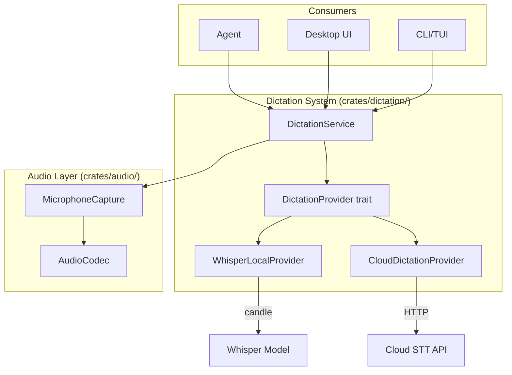

# Design Document: Dictation (Speech-to-Text)

## 1. Overview

Migrate goose's dictation system, providing speech-to-text via local Whisper models and cloud-based dictation providers. This enables voice input to the agent.

### Key Architectural Decisions

- **Audio capture in `crates/audio/`**: Baymax already has `crates/audio/` for audio playback/recording primitives. Extend it with microphone capture.
- **New `crates/dictation/` crate**: STT processing (Whisper inference or cloud API calls) lives in a dedicated crate.
- **Whisper via `candle`**: Goose uses `candle-core` and `candle-nn` for local Whisper inference. These are already workspace dependencies in baymax, making this feasible.
- **Pluggable providers**: Follow the same pattern as LLM providers — a `DictationProvider` trait with built-in and cloud implementations.

## 2. Architecture



## 3. Components and Interfaces

### Component: Dictation Service

```rust
pub struct DictationService {
    provider: Box<dyn DictationProvider>,
    capture: MicrophoneCapture,
}

impl DictationService {
    pub fn new(provider: Box<dyn DictationProvider>) -> Self;
    pub async fn transcribe_from_mic(&self, duration: Duration) -> Result<String>;
    pub async fn transcribe_audio(&self, audio: &[u8], format: AudioFormat) -> Result<String>;
}
```

### Component: Dictation Provider Trait

```rust
#[async_trait]
pub trait DictationProvider: Send + Sync {
    fn name(&self) -> &str;
    async fn transcribe(&self, audio: &[u8], format: AudioFormat) -> Result<String>;
    fn supported_formats(&self) -> Vec<AudioFormat>;
    fn requires_network(&self) -> bool;
}
```

### Component: Whisper Local Provider

```rust
pub struct WhisperLocalProvider {
    model: candle_nn::VarBuilder,
    config: WhisperConfig,
}

impl DictationProvider for WhisperLocalProvider {
    // Runs Whisper inference locally using candle
    async fn transcribe(&self, audio: &[u8], format: AudioFormat) -> Result<String> {
        // 1. Decode audio to PCM
        // 2. Run through Whisper model
        // 3. Return recognized text
    }
}
```

### Component: Cloud Dictation Provider

```rust
pub struct CloudDictationProvider {
    api_url: String,
    api_key: String,
    client: reqwest::Client,
}

impl DictationProvider for CloudDictationProvider {
    // Sends audio to cloud API, returns transcription
}
```

### Component: Audio Capture (in `crates/audio/`)

```rust
pub struct MicrophoneCapture;

impl MicrophoneCapture {
    pub fn list_devices() -> Vec<AudioDevice>;
    pub fn start_capture(device: &AudioDevice, config: CaptureConfig) -> Result<AudioStream>;
    pub fn stop_capture(stream: AudioStream) -> Result<Vec<u8>>;
}
```

## 4. Data Models

```rust
pub struct DictationConfig {
    pub provider: String,                  // "whisper" | "cloud" | provider name
    pub model: Option<String>,             // "tiny", "base", "small", "medium", "large"
    pub language: Option<String>,          // ISO language code
    pub silence_threshold: f32,
    pub auto_stop_silence: Duration,
    pub cloud_provider: Option<CloudDictationConfig>,
}

pub enum AudioFormat {
    Wav,
    Mp3,
    OggOpus,
    Flac,
    RawPcm { sample_rate: u32, channels: u16, bits_per_sample: u8 },
}
```

## 5. Correctness Properties

### Property 1: Offline Capability

_For any_ dictation request [when the local Whisper provider is configured], THE system SHALL transcribe without network connectivity.

**Validates: Requirement 1.4**

### Property 2: Provider Fallback

_For any_ dictation request [when the primary cloud provider fails], IF a fallback provider is configured, THE system SHALL attempt transcription with the fallback.

**Validates: Requirement 2.3**

### Property 3: Audio Format Support

_For any_ dictation provider, [for each supported format], THE provider SHALL accept audio in that format and produce valid text output.

**Validates: Requirement 3.2**

## 6. Error Handling

| Error Scenario | Handling |
|---|---|
| Microphone permission denied | Show OS-specific permission instructions |
| Whisper model not downloaded | Trigger download with progress |
| Cloud API rate limited | Queue and retry with backoff |
| No microphone found | Return clear "no input device" error |
| Audio too long | Split into chunks, transcribe sequentially |

## 7. Testing Strategy

- **Unit tests**: Audio format conversion, Whisper inference with test fixtures
- **Integration tests**: Mock cloud API, test provider switching
- **Hardware tests**: Microphone capture on CI (where available)
- **Performance tests**: Latency and accuracy benchmarks

## References

- Source: `goose/crates/goose/src/dictation/`
- Baymax: `crates/audio/`
