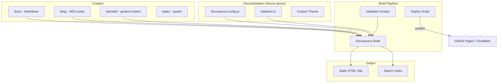

# Design Document: Documentation Site

## 1. Overview

Migrate goose's Docusaurus-based documentation site — a comprehensive documentation hub with installation guides, configuration docs, usage tutorials, blog, and automation scripts.

### Key Architectural Decisions

- **Keep Docusaurus**: Docusaurus is the industry standard for open-source documentation. Stick with it unless baymax already has a different documentation system.
- **Separate directory**: The documentation lives in `docs/` at the repository root, not inside the goose directory. Follow baymax's existing docs structure if any.
- **Automated builds**: CI pipeline builds and deploys the documentation site on merges to main.

## 2. Architecture



## 3. Components and Interfaces

### Site Configuration

```typescript
// docs/docusaurus.config.ts
export default {
  title: 'Baymax Documentation',
  tagline: 'The fast, collaborative AI-powered code editor',
  url: 'https://baymax.dev',
  baseUrl: '/docs/',
  // ... navigation, theme, plugins
}
```

### Content Structure

```
docs/
├── sidebars.ts              ← Navigation structure
├── docusaurus.config.ts     ← Site configuration
├── package.json             ← Dependencies
├── docs/
│   ├── getting-started/     ← Installation, quickstart
│   ├── configuration/       ← Providers, extensions, settings
│   ├── guides/              ← Usage guides
│   ├── features/            ← Feature documentation
│   ├── troubleshooting/     ← Diagnostics, known issues
│   ├── development/         ← Contributing, building
│   └── api/                 ← API reference (generated from OpenAPI)
├── blog/                    ← Release notes, announcements
├── tutorials/               ← Step-by-step tutorials
├── static/                  ← Images, assets
└── scripts/                 ← Build, validate, deploy
```

## 4. Correctness Properties

### Property 1: Link Validity

_For any_ internal link [in the documentation], [after build], THE link SHALL resolve to an existing page or anchor.

**Validates: Requirement 4.2**

### Property 2: Search Completeness

_For any_ page [in the documentation], [after search index generation], THE page content SHALL be indexed and searchable.

**Validates: Requirement 1.7**

## 5. Error Handling

| Error Scenario | Handling |
|---|---|
| Broken link detected | Fail CI build with link location |
| Missing required page | Warning during build |
| Search index generation fails | Degrade to client-side search |

## 6. Testing Strategy

- **Link checker**: CI step checks all internal links
- **Build test**: PR CI builds docs to catch errors
- **Spell check**: CI step for common typos
- **Mobile viewport test**: Ensure responsive layout

## References

- Source: `goose/documentation/`
