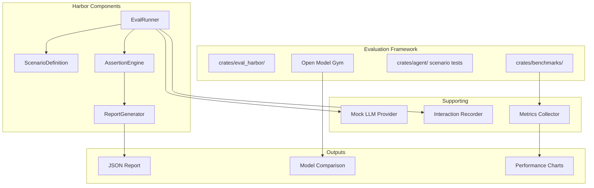

# Design Document: Evaluation Framework

## 1. Overview

Migrate goose's evaluation infrastructure — Harbor eval framework, Open Model Gym, scenario tests, and benchmark scripts — into sim's existing evaluation tools (`crates/eval_cli/`, `crates/eval_utils/`).

### Key Architectural Decisions

- **Harbor as `crates/eval_harbor/`**: A dedicated crate for structured agent evaluations, building on the patterns in `crates/eval_utils/`.
- **Scenario tests in `crates/agent/`**: Enhance the existing test infrastructure to support scenario-based testing with mock providers.
- **Benchmarks in `crates/benchmarks/`**: Sim already has `crates/benchmarks/`. Extend it with agent-specific benchmarks.

## 2. Architecture



## 3. Components and Interfaces

### Component: Harbor Eval Runner

```rust
pub struct EvalRunner {
    scenarios: Vec<ScenarioDefinition>,
    provider: Box<dyn LanguageModelProvider>,
    model: ModelId,
}

impl EvalRunner {
    pub fn new(config: EvalConfig) -> Self;
    pub async fn run_all(&self) -> Result<EvalSuiteResult>;
    pub async fn run_scenario(&self, name: &str) -> Result<ScenarioResult>;
}

pub struct EvalConfig {
    pub scenarios_dir: PathBuf,
    pub provider: String,
    pub model: String,
    pub max_concurrency: usize,
    pub timeout: Duration,
}
```

### Component: Scenario Definition

```rust
pub struct ScenarioDefinition {
    pub name: String,
    pub description: String,
    pub steps: Vec<ScenarioStep>,
    pub expected_outcomes: Vec<ExpectedOutcome>,
    pub tags: Vec<String>,
}

pub struct ScenarioStep {
    pub instruction: String,
    pub expected_tool_calls: Vec<ToolCallPattern>,
    pub expected_response_contains: Option<Vec<String>>,
}

pub struct ExpectedOutcome {
    pub check: OutcomeCheck,
    pub description: String,
}

pub enum OutcomeCheck {
    ToolCalled { tool: String, min_count: usize },
    ResponseContains { text: String },
    ResponseMatches { pattern: String },
    FinalOutput { validator: String },
}
```

### Component: Open Model Gym

```rust
pub struct ModelGym {
    configs: Vec<ModelEvalConfig>,
    tasks: Vec<EvalTask>,
}

impl ModelGym {
    pub async fn run_comparison(&self) -> Result<ModelComparison>;
    pub async fn run_task(&self, task: &str, models: &[&str]) -> Result<TaskResult>;
}

pub struct ModelComparison {
    pub models: Vec<ModelResult>,
    pub tasks: Vec<String>,
    pub summary: ComparisonSummary,
}

pub struct ModelResult {
    pub model: String,
    pub task_results: Vec<TaskResult>,
    pub average_latency: Duration,
    pub total_cost: f64,
    pub overall_score: f64,
}
```

### Component: Scenario Test Runner (in `crates/agent/`)

```rust
pub struct ScenarioTestRunner {
    recordings: Vec<Recording>,
}

impl ScenarioTestRunner {
    pub fn from_recording(path: &Path) -> Result<Self>;
    pub fn run(&self, agent: &mut Agent) -> Result<Vec<AssertionResult>>;

    pub fn record_session(agent: &mut Agent, output: &Path) -> Result<Recording>;
}

pub struct Recording {
    pub turns: Vec<RecordedTurn>,
    pub metadata: RecordingMetadata,
}

pub struct AssertionResult {
    pub assertion: String,
    pub passed: bool,
    pub actual: String,
    pub expected: String,
}
```

### Component: Agent Benchmarks

```rust
pub struct AgentBenchmark {
    pub name: &'static str,
    pub run: Box<dyn Fn(&mut Agent, &mut Bencher)>,
}

// Benchmark categories
pub fn bench_response_latency(b: &mut Bencher);
pub fn bench_tool_execution(b: &mut Bencher);
pub fn bench_context_compaction(b: &mut Bencher);
pub fn bench_concurrent_sessions(b: &mut Bencher);
```

## 4. Data Models

```rust
pub struct EvalSuiteResult {
    pub total_scenarios: usize,
    pub passed: usize,
    pub failed: usize,
    pub skipped: usize,
    pub scenarios: Vec<ScenarioResult>,
    pub duration: Duration,
}

pub struct ScenarioResult {
    pub name: String,
    pub passed: bool,
    pub steps: Vec<StepResult>,
    pub assertions: Vec<AssertionResult>,
    pub duration: Duration,
    pub error: Option<String>,
}

pub struct ComparisonSummary {
    pub best_overall: String,
    pub best_latency: String,
    pub best_cost: String,
    pub rankings: Vec<(String, f64)>,
}
```

## 5. Correctness Properties

### Property 1: Deterministic Evaluation

_For any_ scenario [run twice with the same mock provider and seed], THE results SHALL be identical.

**Validates: Requirement 1.3**

### Property 2: Assertion Coverage

_For any_ scenario definition, [when executed], ALL assertions defined in `expected_outcomes` SHALL be evaluated.

**Validates: Requirement 1.2**

### Property 3: Provider Transparency

_For any_ model comparison run, [for each model], THE metrics SHALL include latency, cost, and score.

**Validates: Requirement 2.3**

## 6. Error Handling

| Error Scenario | Handling |
|---|---|
| Scenario timeout | Skip scenario, mark as failed with timeout error |
| Mock provider misconfigured | Return clear config error before run starts |
| Recording file corrupted | Return parse error with file location |
| Benchmark iteration too slow | Limit iterations, report with warning |

## 7. Testing Strategy

- **Unit tests**: Scenario parsing, assertion evaluation, report generation
- **Integration tests**: Full eval run with mock provider
- **Regression tests**: Recorded scenarios replayed against new agent versions
- **Benchmark tests**: Benchmarks run in CI for performance regression detection

## References

- Source: `projects/goose/evals/harbor/`
- Source: `projects/goose/evals/open-model-gym/`
- Source: `projects/goose/crates/goose-cli/src/scenario_tests/`
- Source: `projects/goose/scripts/bench-*`
- Sim: `crates/eval_cli/`, `crates/eval_utils/`, `crates/benchmarks/`
