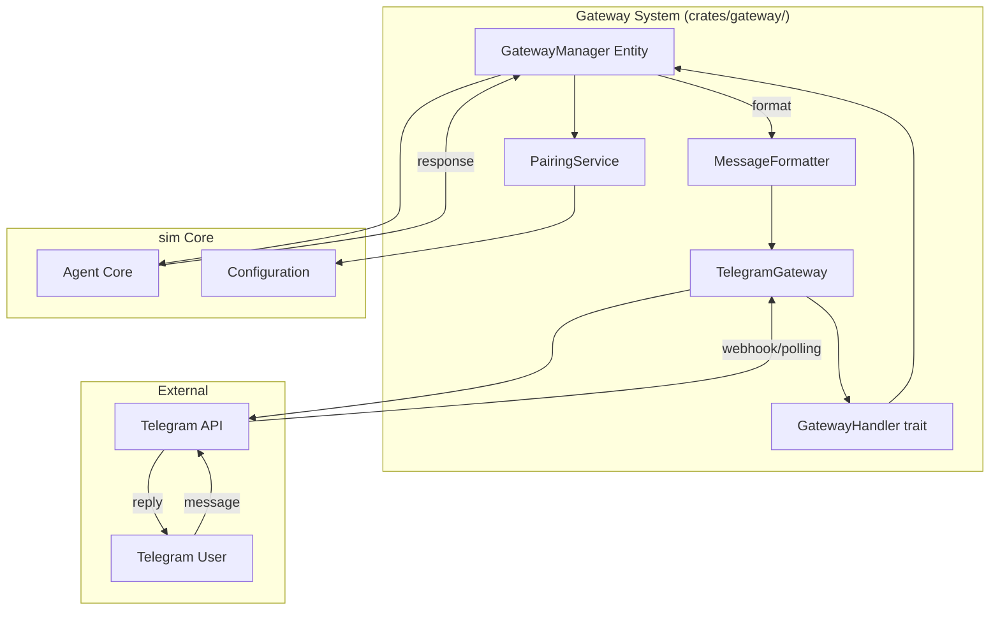

# Design Document: Gateway System

## 1. Overview

Migrate goose's multi-channel gateway system, which allows the agent to operate through external messaging platforms — primarily a Telegram bot. The gateway system provides a handler/manager architecture for routing messages between external platforms and the agent.

### Key Architectural Decisions

- **New `crates/gateway/` crate**: The gateway system is self-contained with its own lifecycle. It can optionally depend on the agent but should not be required by it.
- **Telegram via `teligram-rs` or raw HTTP**: Use the Telegram Bot API directly over HTTP rather than a heavy framework, consistent with sim's dependency philosophy.
- **Gateway manager as an Entity**: Following sim's GPUI patterns, the gateway manager is an `Entity<GatewayManager>` that can be observed.
- **Optional dependency**: The gateway crate is an optional feature of the sim application, not a core dependency.

## 2. Architecture



## 3. Components and Interfaces

### Component: Gateway Manager

```rust
pub struct GatewayManager {
    gateways: Vec<Box<dyn GatewayHandler>>,
    agent: WeakEntity<Agent>,
    pairing: PairingService,
}

impl GatewayManager {
    pub fn register(&mut self, handler: Box<dyn GatewayHandler>);
    pub fn unregister(&mut self, name: &str);
    pub fn route_message(&mut self, message: IncomingMessage) -> Task<Result<()>>;
    pub fn broadcast(&mut self, message: OutgoingMessage);
}

pub trait GatewayHandler: Send {
    fn name(&self) -> &str;
    fn start(&mut self, cx: &mut Context<GatewayManager>) -> Task<Result<()>>;
    fn stop(&mut self) -> Task<Result<()>>;
    fn send_message(&self, message: OutgoingMessage) -> Task<Result<()>>;
}
```

### Component: Telegram Gateway

```rust
pub struct TelegramGateway {
    bot_token: String,
    api_client: reqwest::Client,
    polling_interval: Duration,
    chat_states: HashMap<i64, ChatState>,
}

impl GatewayHandler for TelegramGateway {
    // Long-polling getUpdates or webhook receiver
    // Routes messages to GatewayManager
    // Formats responses for Telegram
}
```

### Component: Pairing Service

```rust
pub struct PairingService {
    store: PairingStore,
}

impl PairingService {
    pub fn pair_platform_user(&mut self, platform_id: &str, sim_user: &str) -> Result<()>;
    pub fn lookup_sim_user(&self, platform_id: &str) -> Option<String>;
    pub fn unlink(&mut self, platform_id: &str) -> Result<()>;
}
```

### Component: Message Formatter

```rust
pub trait MessageFormatter {
    fn format_markdown(&self, text: &str) -> String;
    fn split_long_message(&self, text: &str, max_length: usize) -> Vec<String>;
    fn format_code_block(&self, code: &str, language: &str) -> String;
}

pub struct TelegramFormatter;
impl MessageFormatter for TelegramFormatter {
    // Converts markdown to Telegram-compatible HTML/MarkdownV2
}
```

## 4. Data Models

```rust
pub struct IncomingMessage {
    pub platform: String,
    pub platform_id: String,
    pub user_id: String,
    pub text: String,
    pub attachments: Vec<Attachment>,
    pub timestamp: DateTime<Utc>,
}

pub struct OutgoingMessage {
    pub platform: String,
    pub platform_id: String,
    pub text: String,
    pub attachments: Vec<Attachment>,
    pub reply_to: Option<String>,
}

pub struct ChatState {
    pub last_message_id: i64,
    pub pairing_status: PairingStatus,
    pub pending_action: Option<PendingAction>,
}
```

## 5. Correctness Properties

### Property 1: Message Ordering

_For any_ sequence of messages [from a single platform user], THE system SHALL process them in the order received.

**Validates: Requirement 2.1**

### Property 2: At-Most-Once Delivery

_For any_ agent response, THE system SHALL deliver it to the platform at most once.

**Validates: Requirement 2.2**

### Property 3: Pairing Stability

_For any_ paired platform account, [after the application restarts], THE pairing SHALL be preserved.

**Validates: Requirement 3.3**

## 6. Error Handling

| Error Scenario | Handling |
|---|---|
| Telegram API unavailable | Retry with exponential backoff, log warning |
| Invalid bot token | Log error during startup, disable gateway |
| Message too long | Split into multiple messages (Requirement 4.3) |
| Unpaired user sends message | Reply with pairing instructions |
| Rate limited by Telegram | Respect retry-after header |

## 7. Testing Strategy

- **Unit tests**: Message formatting, pairing logic, manager routing
- **Integration tests**: Mock Telegram API server
- **E2E tests**: Full message round-trip with mock agent

## References

- Source: `projects/goose/crates/goose/src/gateway/`
