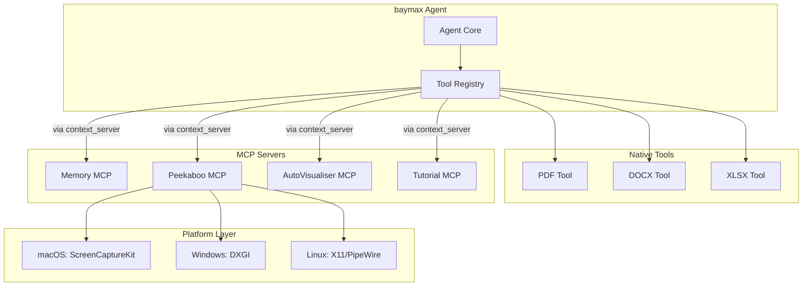

# Design Document: MCP Tools

## 1. Overview

Migrate goose's standalone MCP server tools — Computer Controller, Memory, Peekaboo, AutoVisualiser, Tutorial — into baymax's MCP/extension ecosystem. Each tool becomes either a built-in MCP server (run as subprocess or in-process) or a set of native agent tools registered directly.

### Key Architectural Decisions

- **Dual deployment**: Ship as both standalone MCP binaries (for external use) and native agent tools (for lower latency). The MCP server runner from goose provides the standalone path.
- **Document tools as native**: Computer Controller (PDF, DOCX, XLSX) maps naturally to baymax's existing agent tool system (`crates/agent/src/tools/`) since these are file operations.
- **Memory as MCP server**: Persistent memory benefits from being an MCP server with its own process lifetime rather than an in-memory tool.
- **Peekaboo as platform-specific**: Screen capture requires platform-specific APIs (macOS ScreenCaptureKit, Windows DXGI, Linux X11/PipeWire).
- **Visualiser/Tutorial as MCP servers**: These are self-contained services with templates and tutorials that work well as MCP servers.

## 2. Architecture



## 3. Components and Interfaces

### Component: Computer Controller (Native Tools)

```rust
// PDF Tool
pub struct PdfTool;
impl AgentTool for PdfTool {
    fn name(&self) -> &str { "create_pdf" }
    fn description(&self) -> &str { "Create or modify PDF documents" }
    fn arguments(&self) -> Vec<Parameter> { ... }
    async fn execute(&self, args: Value) -> Result<ToolResult> { ... }
}

// DOCX Tool
pub struct DocxTool;
impl AgentTool for DocxTool { /* similar pattern */ }

// XLSX Tool
pub struct XlsxTool;
impl AgentTool for XlsxTool { /* similar pattern */ }
```

### Component: Memory MCP Server

```rust
pub struct MemoryServer {
    store: Box<dyn MemoryStore>,
}

#[async_trait]
impl McpServer for MemoryServer {
    fn capabilities(&self) -> ServerCapabilities { ... }
    async fn handle_tool_call(&self, name: &str, args: Value) -> Result<ToolResult> {
        match name {
            "store_fact" => self.store_fact(args).await,
            "retrieve_memories" => self.retrieve_memories(args).await,
            "search_memories" => self.search_memories(args).await,
            _ => Err(anyhow!("unknown tool")),
        }
    }
}

pub trait MemoryStore: Send + Sync {
    async fn store(&self, key: String, value: String, metadata: Value) -> Result<()>;
    async fn retrieve(&self, query: &str) -> Result<Vec<MemoryItem>>;
    async fn delete(&self, key: &str) -> Result<()>;
}
```

### Component: Peekaboo (Platform-Specific)

```rust
pub struct Peekaboo {
    platform: Box<dyn ScreenCapture>,
}

#[async_trait]
trait ScreenCapture: Send + Sync {
    async fn capture_region(&self, rect: Option<Rect>) -> Result<Vec<u8>>;
    async fn capture_fullscreen(&self, display: usize) -> Result<Vec<u8>>;
    fn supported_formats(&self) -> Vec<ImageFormat>;
}

#[cfg(target_os = "macos")]
struct MacOsScreenCapture;  // Uses ScreenCaptureKit

#[cfg(target_os = "windows")]
struct WindowsScreenCapture;  // Uses DXGI

#[cfg(target_os = "linux")]
struct LinuxScreenCapture;  // Uses X11 or PipeWire
```

### Component: AutoVisualiser MCP Server

```rust
pub struct AutoVisualiserServer {
    templates: HashMap<String, VisualiserTemplate>,
}

struct VisualiserTemplate {
    name: String,
    template: String, // Handlebars or similar
    output_format: OutputFormat,
}

enum OutputFormat {
    Svg,
    Png,
    Mermaid,
}
```

## 4. Data Models

```rust
pub struct MemoryItem {
    pub id: String,
    pub key: Option<String>,
    pub value: String,
    pub metadata: Value,
    pub created_at: DateTime<Utc>,
    pub importance: f32,
}

pub struct ScreenCaptureResult {
    pub data: Vec<u8>,
    pub format: ImageFormat,
    pub timestamp: DateTime<Utc>,
    pub region: Option<Rect>,
}

pub enum VisualisationType {
    ClassDiagram,
    SequenceDiagram,
    FlowChart,
    ArchitectureDiagram,
    Custom(String),
}
```

## 5. Correctness Properties

### Property 1: Document Integrity

_For any_ document created by the Computer Controller tools, [after creation], THE document SHALL be valid and openable in the corresponding standard application (PDF reader, Word, Excel).

**Validates: Requirement 1.5**

### Property 2: Memory Persistence

_For any_ memory stored via the Memory MCP server, [after the server restarts], THE stored data SHALL be retrievable.

**Validates: Requirement 2.4**

### Property 3: Screen Capture Privacy

_For any_ screen capture request, [if no specific region is provided], THE system SHALL prompt the user before capturing a full screen.

**Validates: Requirement 3.2, implicitly**

### Property 4: MCP Server Lifecycle

_For any_ MCP server launched by the server runner, [if the process exits unexpectedly], THE runner SHALL report the failure and mark the server as stopped.

**Validates: Requirement 6.3**

## 6. Error Handling

| Error Scenario | Handling |
|---|---|
| Missing document dependency (e.g., no libreoffice) | Return clear error with install instructions |
| Screen capture permission denied | Return permission error with OS-specific guidance |
| Memory store file corrupted | Re-initialize from backup or start fresh with warning |
| Template not found for visualiser | Return "template not found" with available templates |
| Tutorial file missing | Return error with tutorial directory path |

## 7. Testing Strategy

- **Unit tests**: PDF/DOCX/XLSX generation with golden file comparison
- **Memory tests**: CRUD operations, persistence across restarts
- **Screen capture tests**: Integration tests on each platform (CI-per-platform)
- **MCP runner tests**: Process lifecycle, crash recovery
- **Template tests**: Template rendering with various inputs

## References

- Source: `goose/crates/goose-mcp/src/`
- Baymax: `crates/agent/src/tools/` — existing agent tool pattern
- Baymax: `crates/context_server/` — MCP client
