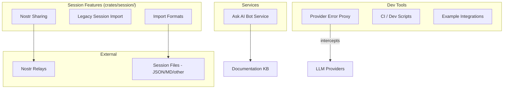

# Design Document: Miscellaneous Services

## 1. Overview

Migrate the remaining goose components: Ask AI bot service, Nostr session sharing, session import formats, examples, development/CI scripts, and the provider error proxy.

### Key Architectural Decisions

- **Ask AI bot as a standalone service**: Separate from the core baymax application. Document its deployment but don't integrate into the main binary.
- **Session import in `crates/session/`**: Extend baymax's existing `crates/session/` with import functionality.
- **Nostr sharing as optional crate**: A small `crates/nostr_sharing/` crate with an optional Nostr dependency.
- **Scripts in `scripts/`**: Migrate to baymax's existing scripts directory.
- **Examples in `examples/`**: Migrate to baymax's existing examples directory.
- **Provider error proxy as dev tool**: Keep as a development/debugging tool, not part of production.

## 2. Architecture



## 3. Components and Interfaces

### Component: Session Import

```rust
pub struct SessionImporter {
    formats: Vec<Box<dyn ImportFormat>>,
}

#[async_trait]
pub trait ImportFormat: Send + Sync {
    fn name(&self) -> &str;
    fn extensions(&self) -> Vec<&str>;
    async fn detect(&self, content: &[u8]) -> bool;
    async fn import(&self, content: &[u8]) -> Result<ImportedSession>;
}

pub struct ImportedSession {
    pub title: String,
    pub messages: Vec<ImportedMessage>,
    pub metadata: Value,
}
```

### Component: Nostr Sharing

```rust
pub struct NostrShare {
    relays: Vec<String>,
    private_key: Option<String>,
}

impl NostrShare {
    pub async fn publish_session(&self, session: &Session) -> Result<String>; // returns event ID
    pub async fn import_session(&self, event_id: &str) -> Result<Session>;
    pub async fn discover_sessions(&self, author: &str) -> Result<Vec<SessionSummary>>;
}
```

### Component: Ask AI Bot

```typescript
// services/ask-ai-bot/
class AskAIBot {
  constructor(config: BotConfig)

  async answerQuestion(question: string): Promise<string> {
    // 1. Search knowledge base
    // 2. Generate answer using LLM
    // 3. Return with citations
  }

  private async searchKnowledgeBase(query: string): Promise<Document[]> {
    // Vector search over documentation
  }
}
```

### Component: Provider Error Proxy

```rust
pub struct ProviderErrorProxy {
    target_url: String,
    listener_port: u16,
    log_file: PathBuf,
}

impl ProviderErrorProxy {
    pub async fn start(&self) -> Result<()>;
    pub async fn stop(&self);
    
    // Intercepts requests, logs them, forwards to target
    async fn handle_request(&self, req: Request) -> Response {
        log_request(&req);
        let response = forward_to_provider(req).await;
        log_response(&response);
        response
    }
}
```

## 4. Data Models

```rust
pub struct ImportedMessage {
    pub role: String,
    pub content: String,
    pub tool_calls: Option<Vec<ToolCall>>,
    pub timestamp: Option<DateTime<Utc>>,
}

pub struct BotConfig {
    pub llm_provider: String,
    pub llm_model: String,
    pub knowledge_base_paths: Vec<PathBuf>,
    pub embedding_provider: Option<String>,
}
```

## 5. Correctness Properties

### Property 1: Import Fidelity

_For any_ session imported [from a supported format], [after import], THE system SHALL preserve message content, role, and ordering.

**Validates: Requirement 2.2**

### Property 2: Nostr Privacy

_For any_ session shared via Nostr, [after sharing], THE session SHALL NOT be shared automatically — only when explicitly requested.

**Validates: Requirement 3.3**

## 6. Error Handling

| Error Scenario | Handling |
|---|---|
| Unknown import format | Return list of supported formats |
| Nostr relay unavailable | Try next relay, fail after all exhausted |
| Ask AI bot KB not found | Fall back to generic LLM answer |
| Error proxy fails to bind port | Log error, suggest alternative port |

## 7. Testing Strategy

- **Import tests**: Test each import format with sample files
- **Nostr tests**: With mock relay server
- **Error proxy tests**: With mock provider endpoint

## References

- Source: `projects/goose/services/ask-ai-bot/`
- Source: `projects/goose/crates/goose/src/session/import_formats/`
- Source: `projects/goose/crates/goose/src/session/nostr_share.rs`
- Source: `projects/goose/examples/`
- Source: `projects/goose/scripts/`
