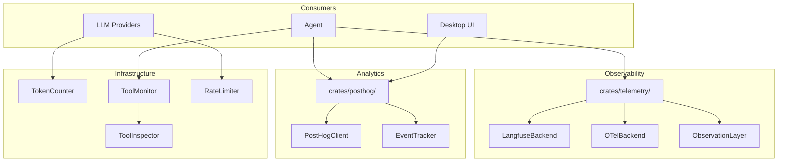

# Design Document: Observability and Analytics

## 1. Overview

Migrate goose's observability and analytics infrastructure: Langfuse tracing, OpenTelemetry OTLP export, observation layer, rate limiter, PostHog analytics, token counting, and tool monitoring/inspection.

### Key Architectural Decisions

- **Integrate with `crates/telemetry/`**: Baymax already has `crates/telemetry/`. Extend it with new tracing backends (Langfuse, OTel OTLP) rather than creating parallel systems.
- **Langfuse as optional backend**: Implement Langfuse as a `TelemetryBackend` that wraps the Langfuse SDK. When enabled, all telemetry events are also sent to Langfuse.
- **OTel via `opentelemetry` crate**: Use the Rust OpenTelemetry SDK with OTLP exporter. This is a new dependency but aligns with industry standards.
- **Rate limiter in `crates/language_models/`**: Rate limiting is provider-specific. Integrate it into the provider request path.
- **PostHog as its own crate**: PostHog analytics is product-focused and should be optional. A lightweight `crates/posthog/` crate.
- **Token counter in `crates/language_model_core/`**: Token counting is a fundamental capability that all model interactions need.

## 2. Architecture



## 3. Components and Interfaces

### Component: Langfuse Backend (in `crates/telemetry/`)

```rust
pub struct LangfuseBackend {
    client: langfuse_sdk::LangfuseClient,
    enabled: bool,
}

impl TelemetryBackend for LangfuseBackend {
    fn name(&self) -> &str { "langfuse" }
    fn record_span(&self, span: TelemetrySpan) -> Result<()>;
    fn record_event(&self, event: TelemetryEvent) -> Result<()>;
}
```

### Component: OTel Backend

```rust
pub struct OtelBackend {
    tracer: opentelemetry_sdk::trace::Tracer,
    exporter: otlp::SpanExporter,
}

impl TelemetryBackend for OtelBackend {
    // Creates OpenTelemetry spans from telemetry events
}
```

### Component: Observation Layer

```rust
pub struct ObservationLayer {
    observations: Vec<Observation>,
    max_observations: usize,
}

impl ObservationLayer {
    pub fn record_turn(&mut self, turn: AgentTurn) -> ObservationId;
    pub fn record_tool_call(&mut self, call: ToolCallObservation) -> ObservationId;
    pub fn get_observations(&self) -> &[Observation];
    pub fn export(&self, backend: &dyn TelemetryBackend) -> Result<()>;
}
```

### Component: Rate Limiter

```rust
pub struct RateLimiter {
    windows: HashMap<String, RateWindow>,
    config: RateLimiterConfig,
}

impl RateLimiter {
    pub async fn acquire(&self, provider: &str) -> Result<RateLimitPermit>;
    pub fn remaining(&self, provider: &str) -> RateLimitStatus;
}

pub struct RateLimiterConfig {
    pub requests_per_minute: u32,
    pub tokens_per_minute: u64,
    pub burst_size: u32,
}
```

### Component: PostHog Client

```rust
pub struct PostHogClient {
    api_key: String,
    host: String,
    client: reqwest::Client,
    instance_id: String,
    enabled: bool,
}

impl PostHogClient {
    pub fn capture(&self, event: &str, properties: Value) -> Task<Result<()>>;
    pub fn identify(&self, distinct_id: &str, properties: Value);
    pub fn flush(&self);
}
```

### Component: Token Counter

```rust
pub trait TokenCounter: Send + Sync {
    fn count_tokens(&self, text: &str) -> Result<usize>;
    fn count_tokens_in_messages(&self, messages: &[Message]) -> Result<usize>;
    fn model_for_counter(&self) -> Option<String>;
}

pub struct TikTokenCounter {
    encoding: tiktoken_rs::CoreBPE,
}

impl TokenCounter for TikTokenCounter {
    // Uses tiktoken for accurate counting
}
```

### Component: Tool Monitor

```rust
pub struct ToolMonitor {
    stats: HashMap<String, ToolStats>,
}

impl ToolMonitor {
    pub fn record_invocation(&mut self, tool: &str, duration: Duration, success: bool);
    pub fn get_stats(&self, tool: &str) -> Option<ToolStats>;
    pub fn get_all_stats(&self) -> HashMap<String, ToolStats>;
    pub fn reset(&mut self);
}
```

## 4. Data Models

```rust
pub struct TelemetrySpan {
    pub id: String,
    pub parent_id: Option<String>,
    pub name: String,
    pub start_time: DateTime<Utc>,
    pub end_time: Option<DateTime<Utc>>,
    pub attributes: HashMap<String, Value>,
}

pub struct Observation {
    pub id: ObservationId,
    pub observation_type: ObservationType,
    pub timestamp: DateTime<Utc>,
    pub duration: Duration,
    pub metadata: Value,
}

pub enum ObservationType {
    AgentTurn { message_count: usize },
    ToolCall { tool: String, input_size: usize, output_size: usize },
    LlmRequest { model: String, prompt_tokens: u32, completion_tokens: u32 },
}

pub struct ToolStats {
    pub invocations: u64,
    pub successes: u64,
    pub failures: u64,
    pub total_duration: Duration,
    pub avg_duration: Duration,
    pub last_invocation: DateTime<Utc>,
}
```

## 5. Correctness Properties

### Property 1: Tracing Non-Blocking

_For any_ tracing operation [that fails], THE system SHALL NOT block or degrade the calling operation.

**Validates: Requirement 1.4, 2.2**

### Property 2: Rate Limit Enforcement

_For any_ provider request [exceeding configured rate limits], THE system SHALL delay the request until capacity is available.

**Validates: Requirement 4.2**

### Property 3: Analytics Privacy

_For any_ PostHog event, THE system SHALL NOT include personally identifiable information in event properties.

**Validates: Requirement 5.4**

### Property 4: Token Accuracy

_For any_ text [of known token count for a given model], THE token counter SHALL return the correct count within 1% margin.

**Validates: Requirement 6.1**

## 6. Error Handling

| Error Scenario | Handling |
|---|---|
| Langfuse API unreachable | Log warning, continue without tracing |
| OTel exporter full | Drop oldest spans, log warning |
| PostHog flush fails | Retry with backoff, drop on repeated failure |
| Tokenizer not found for model | Fall back to character-based approximation |
| Rate limit misconfigured (0 rps) | Treat as unlimited with warning |

## 7. Testing Strategy

- **Unit tests**: Token counter accuracy with known texts
- **Rate limiter tests**: Burst behavior, window sliding, concurrent requests
- **Mock backend tests**: Langfuse and OTel backends with mock servers
- **Tool monitor tests**: Accumulation, reset, stats correctness

## References

- Source: `projects/goose/crates/goose/src/tracing/`
- Source: `projects/goose/crates/goose/src/otel/`
- Source: `projects/goose/crates/goose/src/posthog.rs`
- Source: `projects/goose/crates/goose/src/token_counter.rs`
- Source: `projects/goose/crates/goose/src/tool_monitor.rs`
- Source: `projects/goose/crates/goose/src/tool_inspection.rs`
- Baymax: `crates/telemetry/`
