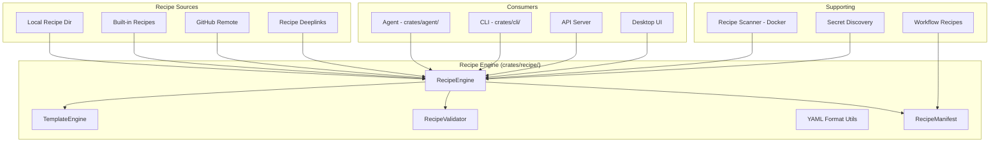

# Design Document: Recipe System

## 1. Overview

Migrate goose's recipe engine — a YAML-based system for defining, templating, validating, discovering, and executing reusable multi-step workflows. The recipe system consists of a core engine, CLI commands, recipe scanner, and workflow recipes.

### Key Architectural Decisions

- **New `crates/recipe/` crate**: The recipe engine is large enough to warrant its own crate, following goose's separation. It will be used by `crates/agent/`, `crates/cli/`, and potentially the server.
- **YAML format retained**: YAML is already used in baymax for settings; recipes follow a similar approach.
- **Recipe + skill integration**: Recipes are conceptually related to skills (both are reusable agent instructions). Recipes are multi-step workflows; skills are single-purpose instructions. They share discovery paths.
- **Deeplinks via existing mechanism**: Use baymax's existing `parse_baymax_link` for recipe deeplinks.

## 2. Architecture



## 3. Components and Interfaces

### Component: Recipe Engine

```rust
pub struct RecipeEngine {
    sources: Vec<Box<dyn RecipeSource>>,
    template_engine: TemplateEngine,
}

impl RecipeEngine {
    pub fn new() -> Self;
    pub fn discover_all(&self) -> Result<Vec<RecipeManifest>>;
    pub fn load(&self, name: &str) -> Result<Recipe>;
    pub fn execute(&self, recipe: &Recipe, context: &mut ExecutionContext) -> Result<RecipeOutput>;
}

pub trait RecipeSource {
    fn discover(&self) -> Result<Vec<RecipeManifest>>;
    fn load(&self, name: &str) -> Result<Recipe>;
    fn priority(&self) -> u8;
}
```

### Component: Recipe Definition

```rust
#[derive(Deserialize, Serialize)]
pub struct Recipe {
    pub name: String,
    pub description: String,
    pub version: String,
    pub metadata: RecipeMetadata,
    pub variables: Vec<VariableDefinition>,
    pub steps: Vec<RecipeStep>,
}

#[derive(Deserialize, Serialize)]
pub struct RecipeStep {
    pub id: String,
    pub prompt: String,
    pub tools: Option<Vec<String>>,
    pub condition: Option<String>,
    pub error_policy: ErrorPolicy,
    pub wait_for_input: bool,
}

pub enum ErrorPolicy {
    Stop,
    Skip,
    Retry(u32),
    Continue,
}
```

### Component: Template Engine

```rust
pub struct TemplateEngine;

impl TemplateEngine {
    pub fn render(template: &str, variables: &HashMap<String, String>) -> Result<String>;
    pub fn validate_template(template: &str) -> Result<Vec<String>>; // returns missing vars
    pub fn extract_variables(template: &str) -> Vec<String>;
}
```

### Component: Recipe Validator

```rust
pub struct RecipeValidator;

impl RecipeValidator {
    pub fn validate(recipe: &Recipe) -> Result<Vec<ValidationError>>;
    pub fn validate_yaml(yaml: &str) -> Result<Recipe>;
}

pub struct ValidationError {
    pub field: String,
    pub message: String,
    pub severity: Severity,
}
```

### Component: Recipe Manifest

```rust
#[derive(Serialize)]
pub struct RecipeManifest {
    pub name: String,
    pub description: String,
    pub version: String,
    pub source: RecipeSourceType,
    pub tags: Vec<String>,
    pub author: Option<String>,
    pub variables: Vec<String>,
}
```

## 4. Data Models

```rust
pub struct ExecutionContext {
    pub variables: HashMap<String, String>,
    pub current_step: usize,
    pub step_results: Vec<StepResult>,
    pub secrets: HashMap<String, String>,
}

pub struct RecipeOutput {
    pub success: bool,
    pub step_count: usize,
    pub completed_steps: usize,
    pub summary: String,
    pub step_results: Vec<StepResult>,
}

pub enum RecipeSourceType {
    Builtin,
    Local(PathBuf),
    GitHub { owner: String, repo: String, path: String },
    Deeplink(String),
}
```

## 5. Correctness Properties

### Property 1: Deterministic Execution

_For any_ recipe [with the same inputs and same conditions], THE recipe SHALL produce the same sequence of steps.

**Validates: Requirement 1.1**

### Property 2: Validation Coverage

_For any_ recipe [loaded by the engine], THE validator SHALL check all required fields before execution begins.

**Validates: Requirement 3.1**

### Property 3: Variable Substitution

_For any_ recipe step [containing variable placeholders], AFTER template rendering, THE step SHALL contain no unreplaced variables.

**Validates: Requirement 2.3**

### Property 4: Search Completeness

_For any_ recipe [in any registered source], THE `discover_all` method SHALL include it in the returned manifests.

**Validates: Requirement 4.1, 4.2**

## 6. Error Handling

| Error Scenario | Handling |
|---|---|
| Malformed YAML | Return parse error with line number and context |
| Missing required variable | Prompt user for value before execution |
| Recipe step fails with Stop policy | Abort execution, return partial results |
| GitHub recipe not found | Return 404-style error with available similar recipes |
| Circular recipe reference | Detect and reject during validation |

## 7. Testing Strategy

- **Unit tests**: YAML parsing, template rendering, validation logic
- **Integration tests**: Full recipe execution with mock agent
- **CLI tests**: Recipe subcommands (list, search, run)
- **Scanner tests**: Docker-based recipe scanning
- **Security tests**: Secret discovery and injection safety

## References

- Source: `goose/crates/goose/src/recipe/`
- Source: `goose/crates/goose-cli/src/recipes/`
- Source: `goose/recipe-scanner/`
- Source: `goose/workflow_recipes/`
