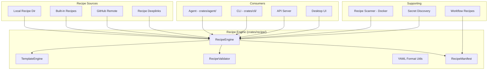

# Design Document: Recipe System

## 1. Overview

Migrate goose's recipe engine — a YAML-based system for defining, templating, validating, discovering, and executing reusable multi-step workflows. The recipe system consists of a core engine, CLI commands, recipe scanner, and workflow recipes.

### Key Architectural Decisions

- **New `crates/recipe/` crate**: The recipe engine is large enough to warrant its own crate, following goose's separation. It will be used by `crates/agent/`, `crates/cli/`, and potentially the server.
- **YAML format retained**: YAML is already used in zed for settings; recipes follow a similar approach.
- **Recipe + skill integration**: Recipes are conceptually related to skills (both are reusable agent instructions). Recipes are multi-step workflows; skills are single-purpose instructions. They share discovery paths.
- **Deeplinks via existing mechanism**: Use zed's existing `parse_zed_link` for recipe deeplinks.

## 2. Architecture



## 3. Components and Interfaces

### Component: Recipe Engine

```rust
pub struct RecipeEngine {
    sources: Vec<Box<dyn RecipeSource>>,
    template_engine: TemplateEngine,
}

impl RecipeEngine {
    pub fn new() -> Self;
    pub fn discover_all(&self) -> Result<Vec<RecipeManifest>>;
    pub fn load(&self, name: &str) -> Result<Recipe>;
    pub fn execute(&self, recipe: &Recipe, context: &mut ExecutionContext) -> Result<RecipeOutput>;
}

pub trait RecipeSource {
    fn discover(&self) -> Result<Vec<RecipeManifest>>;
    fn load(&self, name: &str) -> Result<Recipe>;
    fn priority(&self) -> u8;
}
```

### Component: Recipe Definition

```rust
#[derive(Deserialize, Serialize)]
pub struct Recipe {
    pub name: String,
    pub description: String,
    pub version: String,
    pub metadata: RecipeMetadata,
    pub variables: Vec<VariableDefinition>,
    pub steps: Vec<RecipeStep>,
}

#[derive(Deserialize, Serialize)]
pub struct RecipeStep {
    pub id: String,
    pub prompt: String,
    pub tools: Option<Vec<String>>,
    pub condition: Option<String>,
    pub error_policy: ErrorPolicy,
    pub wait_for_input: bool,
}

pub enum ErrorPolicy {
    Stop,
    Skip,
    Retry(u32),
    Continue,
}
```

### Component: Template Engine

```rust
pub struct TemplateEngine;

impl TemplateEngine {
    pub fn render(template: &str, variables: &HashMap<String, String>) -> Result<String>;
    pub fn validate_template(template: &str) -> Result<Vec<String>>; // returns missing vars
    pub fn extract_variables(template: &str) -> Vec<String>;
}
```

### Component: Recipe Validator

```rust
pub struct RecipeValidator;

impl RecipeValidator {
    pub fn validate(recipe: &Recipe) -> Result<Vec<ValidationError>>;
    pub fn validate_yaml(yaml: &str) -> Result<Recipe>;
}

pub struct ValidationError {
    pub field: String,
    pub message: String,
    pub severity: Severity,
}
```

### Component: Recipe Manifest

```rust
#[derive(Serialize)]
pub struct RecipeManifest {
    pub name: String,
    pub description: String,
    pub version: String,
    pub source: RecipeSourceType,
    pub tags: Vec<String>,
    pub author: Option<String>,
    pub variables: Vec<String>,
}
```

## 4. Data Models

```rust
pub struct ExecutionContext {
    pub variables: HashMap<String, String>,
    pub current_step: usize,
    pub step_results: Vec<StepResult>,
    pub secrets: HashMap<String, String>,
}

pub struct RecipeOutput {
    pub success: bool,
    pub step_count: usize,
    pub completed_steps: usize,
    pub summary: String,
    pub step_results: Vec<StepResult>,
}

pub enum RecipeSourceType {
    Builtin,
    Local(PathBuf),
    GitHub { owner: String, repo: String, path: String },
    Deeplink(String),
}
```

## 5. Correctness Properties

### Property 1: Deterministic Execution

_For any_ recipe [with the same inputs and same conditions], THE recipe SHALL produce the same sequence of steps.

**Validates: Requirement 1.1**

### Property 2: Validation Coverage

_For any_ recipe [loaded by the engine], THE validator SHALL check all required fields before execution begins.

**Validates: Requirement 3.1**

### Property 3: Variable Substitution

_For any_ recipe step [containing variable placeholders], AFTER template rendering, THE step SHALL contain no unreplaced variables.

**Validates: Requirement 2.3**

### Property 4: Search Completeness

_For any_ recipe [in any registered source], THE `discover_all` method SHALL include it in the returned manifests.

**Validates: Requirement 4.1, 4.2**

## 6. Error Handling

| Error Scenario | Handling |
|---|---|
| Malformed YAML | Return parse error with line number and context |
| Missing required variable | Prompt user for value before execution |
| Recipe step fails with Stop policy | Abort execution, return partial results |
| GitHub recipe not found | Return 404-style error with available similar recipes |
| Circular recipe reference | Detect and reject during validation |

## 7. Testing Strategy

- **Unit tests**: YAML parsing, template rendering, validation logic
- **Integration tests**: Full recipe execution with mock agent
- **CLI tests**: Recipe subcommands (list, search, run)
- **Scanner tests**: Docker-based recipe scanning
- **Security tests**: Secret discovery and injection safety

## References

- Source: `projects/goose/crates/goose/src/recipe/`
- Source: `projects/goose/crates/goose-cli/src/recipes/`
- Source: `projects/goose/recipe-scanner/`
- Source: `projects/goose/workflow_recipes/`

## Requirements traceability

| Requirement | Design element | Verification |
| --- | --- | --- |
| 1.1 | Recipe Engine audit design | Observable scenario and failure-path test for 1.1 |
| 1.2 | Recipe Engine audit design | Observable scenario and failure-path test for 1.2 |
| 1.3 | Recipe Engine audit design | Observable scenario and failure-path test for 1.3 |
| 1.4 | Recipe Engine audit design | Observable scenario and failure-path test for 1.4 |
| 1.5 | Recipe Engine audit design | Observable scenario and failure-path test for 1.5 |
| 1.6 | Recipe Engine audit design | Observable scenario and failure-path test for 1.6 |
| 2.1 | Recipe Templates audit design | Observable scenario and failure-path test for 2.1 |
| 2.2 | Recipe Templates audit design | Observable scenario and failure-path test for 2.2 |
| 2.3 | Recipe Templates audit design | Observable scenario and failure-path test for 2.3 |
| 3.1 | Recipe Validation audit design | Observable scenario and failure-path test for 3.1 |
| 3.2 | Recipe Validation audit design | Observable scenario and failure-path test for 3.2 |
| 3.3 | Recipe Validation audit design | Observable scenario and failure-path test for 3.3 |
| 4.1 | Local and Built-in Recipes audit design | Observable scenario and failure-path test for 4.1 |
| 4.2 | Local and Built-in Recipes audit design | Observable scenario and failure-path test for 4.2 |
| 4.3 | Local and Built-in Recipes audit design | Observable scenario and failure-path test for 4.3 |
| 5.1 | YAML Recipe Format audit design | Observable scenario and failure-path test for 5.1 |
| 5.2 | YAML Recipe Format audit design | Observable scenario and failure-path test for 5.2 |
| 5.3 | YAML Recipe Format audit design | Observable scenario and failure-path test for 5.3 |
| 6.1 | Recipe CLI Commands audit design | Observable scenario and failure-path test for 6.1 |
| 6.2 | Recipe CLI Commands audit design | Observable scenario and failure-path test for 6.2 |
| 6.3 | Recipe CLI Commands audit design | Observable scenario and failure-path test for 6.3 |
| 6.4 | Recipe CLI Commands audit design | Observable scenario and failure-path test for 6.4 |
| 6.5 | Recipe CLI Commands audit design | Observable scenario and failure-path test for 6.5 |
| 7.1 | GitHub Recipes audit design | Observable scenario and failure-path test for 7.1 |
| 7.2 | GitHub Recipes audit design | Observable scenario and failure-path test for 7.2 |
| 7.3 | GitHub Recipes audit design | Observable scenario and failure-path test for 7.3 |
| 8.1 | Secret Discovery audit design | Observable scenario and failure-path test for 8.1 |
| 8.2 | Secret Discovery audit design | Observable scenario and failure-path test for 8.2 |
| 8.3 | Secret Discovery audit design | Observable scenario and failure-path test for 8.3 |
| 9.1 | Recipe Deeplink audit design | Observable scenario and failure-path test for 9.1 |
| 9.2 | Recipe Deeplink audit design | Observable scenario and failure-path test for 9.2 |
| 9.3 | Recipe Deeplink audit design | Observable scenario and failure-path test for 9.3 |
| 10.1 | Recipe Scanner audit design | Observable scenario and failure-path test for 10.1 |
| 10.2 | Recipe Scanner audit design | Observable scenario and failure-path test for 10.2 |
| 10.3 | Recipe Scanner audit design | Observable scenario and failure-path test for 10.3 |
| 11.1 | Workflow Recipes audit design | Observable scenario and failure-path test for 11.1 |
| 11.2 | Workflow Recipes audit design | Observable scenario and failure-path test for 11.2 |
| 11.3 | Workflow Recipes audit design | Observable scenario and failure-path test for 11.3 |
| 12.1, 12.2, 12.3, 12.4 | D-SUBRECIPE-GRAPH | Relative-path, ordering, override, cycle, depth, missing-node, and secret-discovery tests |
| 13.1, 13.2, 13.3 | D-RECIPE-CLI | Command contract, input precedence, remote trust, output, and exit-code tests |
| 14.1, 14.2, 14.3, 14.4 | D-RECIPE-SCHEDULE | Persistence/restart, timezone/DST, overlap, cancellation, adapter parity, permission, and security tests |

## Audit design corrections

- **D-SUBRECIPE-GRAPH:** Build a validated dependency graph before session creation. Resolve child paths from their declaring recipe, detect cycles with the full chain, and run secret discovery over the resolved graph.
- **D-RECIPE-CLI:** CLI commands are adapters over the same model, validator, catalog, and session builder used by desktop/ACP. Remote and deeplink content is not executed before trust and validation complete.
- **D-RECIPE-SCHEDULE:** One service owns job persistence and state transitions. The repository's executor infrastructure may drive timers, but it is not itself the persisted product scheduler. UI, CLI, ACP, and the agent tool are adapters.
